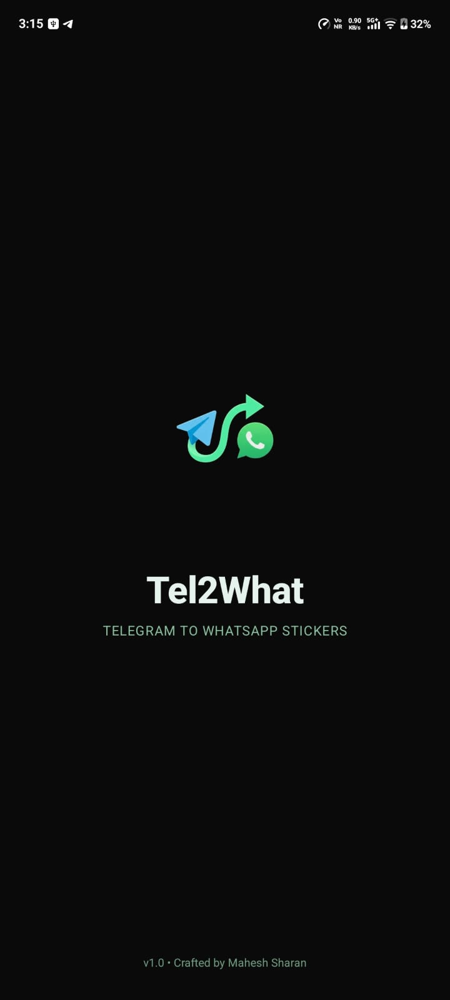
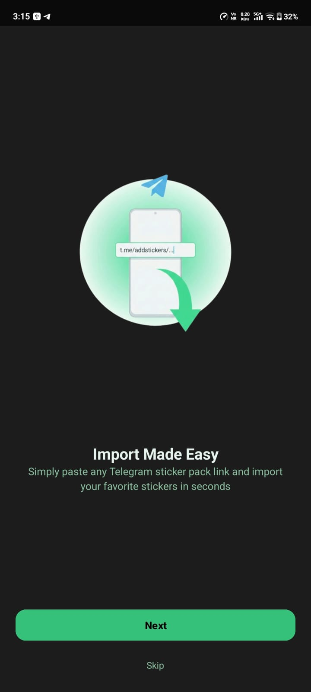
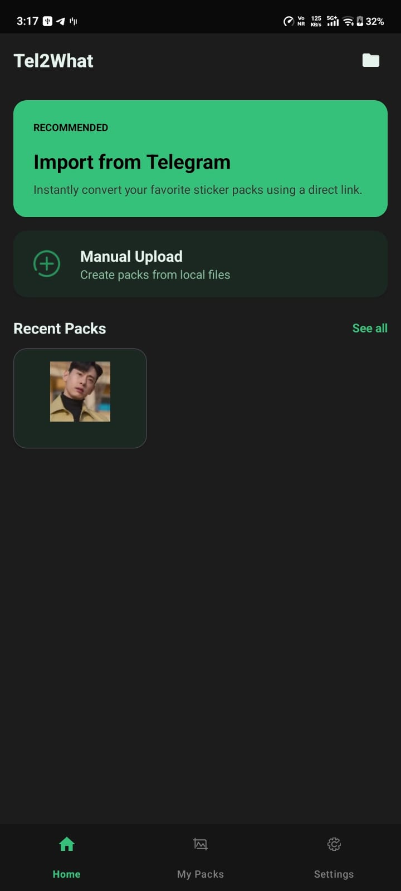
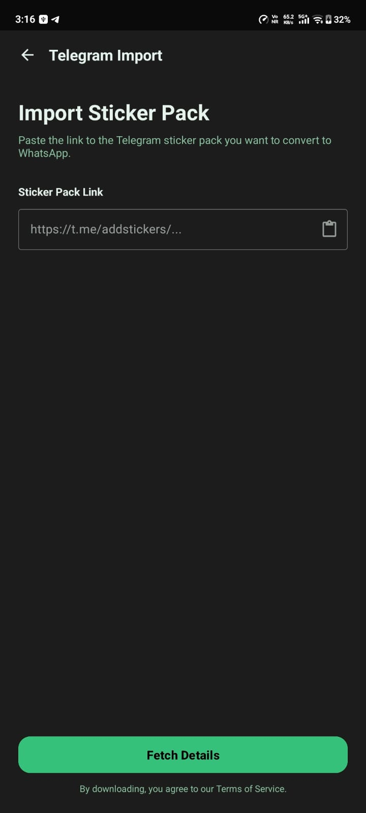
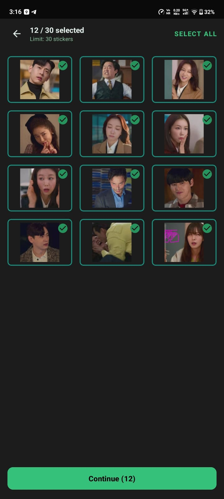
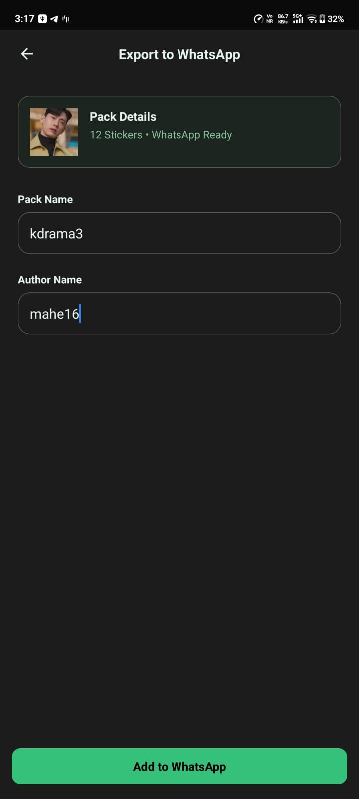
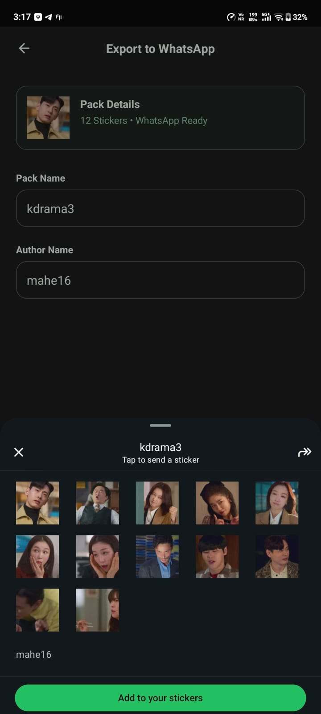

<p align="center">
  
</p>

<h1 align="center">Tel2What - Telegram to WhatsApp Sticker Converter</h1>

<p align="center">Convert your favorite Telegram sticker packs to WhatsApp format with ease. Fast, offline, and privacy-focused.</p>

---

## Privacy & Trust

- **No Ads**: Completely ad-free experience
- **No Data Collection**: We don't collect, store, or transmit any personal data
- **No Analytics**: No tracking or analytics services integrated
- **Fully Offline**: All processing happens locally on your device after initial download
- **Open Source**: Full source code available for review and audit
- **No Permissions Abuse**: Only requests necessary permissions for core functionality

Your privacy matters. This app is built with transparency and user trust as core principles.

## Features

- **Import from Telegram**: Paste any Telegram sticker pack link and import instantly
- **Animated Sticker Support**: Full support for TGS (Lottie) and WebM video stickers
- **Fast Conversion**: Hardware-accelerated processing with native WebP encoding
- **Fully Offline**: All processing happens on your device after initial download
- **Batch Processing**: Download and convert up to 30 stickers at a time
- **Manual Upload**: Upload your own images and GIFs to create custom packs
- **WhatsApp Ready**: Automatic validation and optimization for WhatsApp requirements

## Technical Highlights

- **Native Performance**: JNI bridge to libwebp for optimal encoding speed (~2-3s per animated sticker)
- **Advanced Video Decoding**: Custom WebM decoder using MediaCodec with YUV color space conversion
- **Smart Compression**: Adaptive quality and FPS adjustment to meet 500KB size limit
- **Memory Efficient**: Proper bitmap recycling and concurrency management to prevent OOM
- **Modern Architecture**: Single Activity + Fragments, Kotlin Coroutines, Room Database

##  Screenshots

<table>
  <tr>
    <td align="center"><b>Splash</b></td>
    <td align="center"><b>Onboarding</b></td>
    <td align="center"><b>Home</b></td>
  </tr>
  <tr>
    <td></td>
    <td></td>
    <td></td>
  </tr>
</table>

<table>
  <tr>
    <td align="center"><b>Import</b></td>
    <td align="center"><b>Conversion</b></td>
    <td align="center"><b>Selection</b></td>
  </tr>
  <tr>
    <td></td>
    <td></td>
    <td></td>
  </tr>
</table>

<table>
  <tr>
    <td align="center"><b>Tray Icon</b></td>
    <td align="center"><b>Export</b></td>
    <td align="center"><b>Manual Upload</b></td>
  </tr>
  <tr>
    <td></td>
    <td></td>
    <td></td>
  </tr>
</table>

## Requirements

- Android 11 (API 30) or higher
- 100MB free storage (for temporary conversion files)

## Quick Start

1. Download the latest APK from [Releases](https://github.com/MaheshSharan/Tel2WhatSticker/releases)
2. Install on your Android device
3. Paste a Telegram sticker pack link
4. Convert and export to WhatsApp

## For Developers

### Building from Source

**Prerequisites:**
- Android Studio Hedgehog or later
- JDK 17
- Android SDK 34
- NDK (for native WebP encoding)

**Build:**

```bash
git clone https://github.com/MaheshSharan/Tel2WhatSticker.git
cd Tel2WhatSticker
./gradlew assembleDebug
```

### Documentation

📚 **[Full Documentation](documentation/en/content/)** - Comprehensive technical documentation including:
- Architecture Overview & Design Patterns
- API Reference & Integration Guides  
- Core Features Deep Dive
- Performance Optimization
- Build & Deployment Guide
- Contributing Guidelines

**Quick Links:**
- [Getting Started](documentation/en/content/Getting%20Started.md) - Setup and build instructions
- [Architecture Overview](documentation/en/content/Architecture%20Overview/) - System design and patterns
- [Technical Deep Dive](documentation/en/content/Technical%20Deep%20Dive/) - Implementation details
- [Animated Sticker Pipeline](assets/docs/animated_pipe.md) - Conversion system internals

## Performance

- **WebP Encoding**: ~2-3s per animated sticker (native libwebp)
- **Total Conversion**: ~3-4s end-to-end per sticker
- **Memory Efficient**: Proper bitmap recycling prevents OOM
- **Hardware Accelerated**: MediaCodec for video decoding

## Contributing

Contributions are welcome! Please check out our [documentation](documentation/en/content/) for architecture details and development guidelines.

## Documentation

- [Animated Sticker Pipeline](assets/docs/animated_pipe.md) - Technical deep dive into the conversion system

## License

This project is licensed under the MIT License - see the LICENSE file for details.

## Acknowledgments

- [libwebp](https://developers.google.com/speed/webp) - Google's WebP library
- [Lottie Android](https://github.com/airbnb/lottie-android) - Airbnb's animation library
- [WhatsApp Stickers](https://github.com/WhatsApp/stickers) - WhatsApp's official sticker implementation reference
- Telegram for their excellent sticker ecosystem
