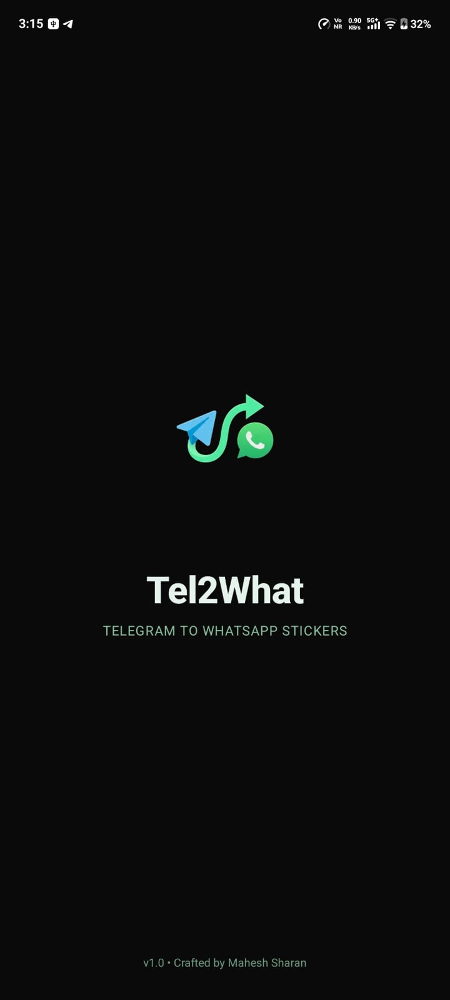
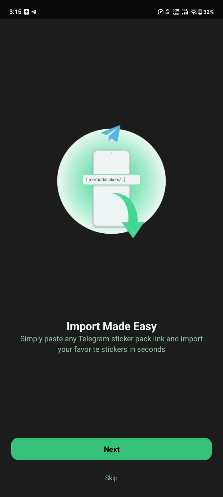
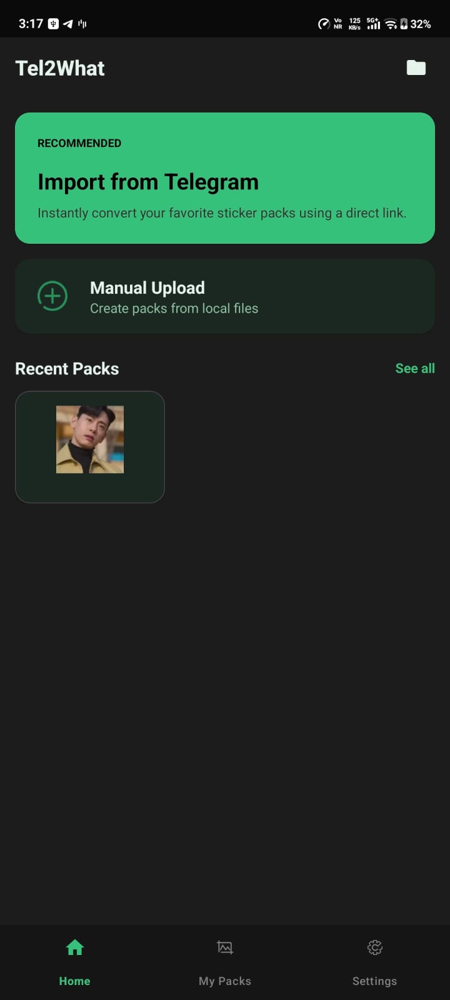
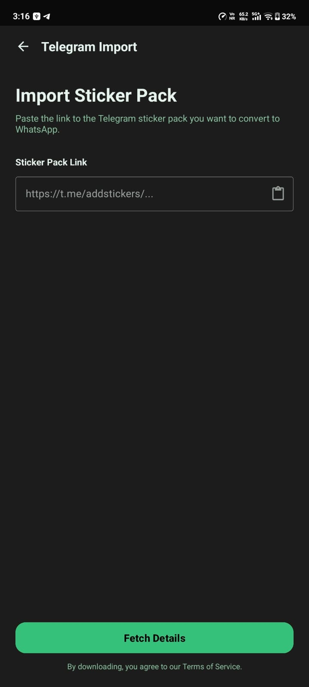
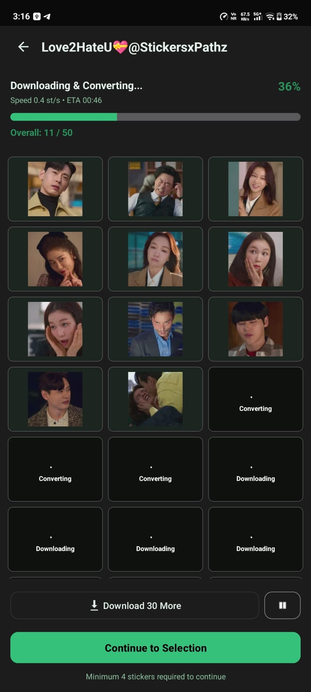
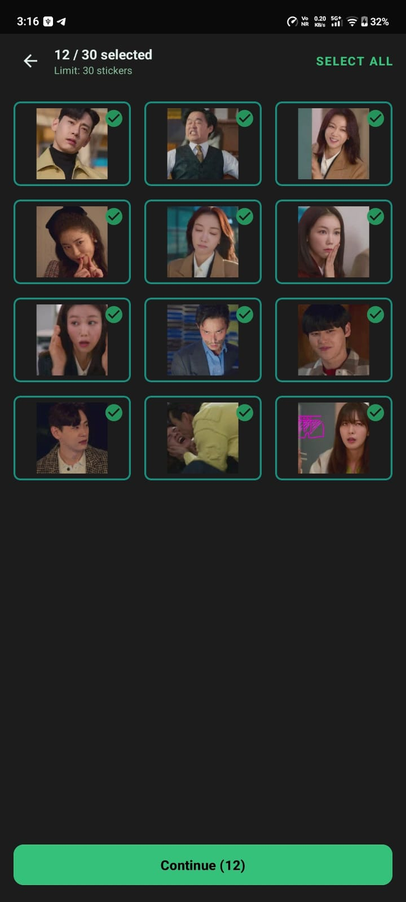
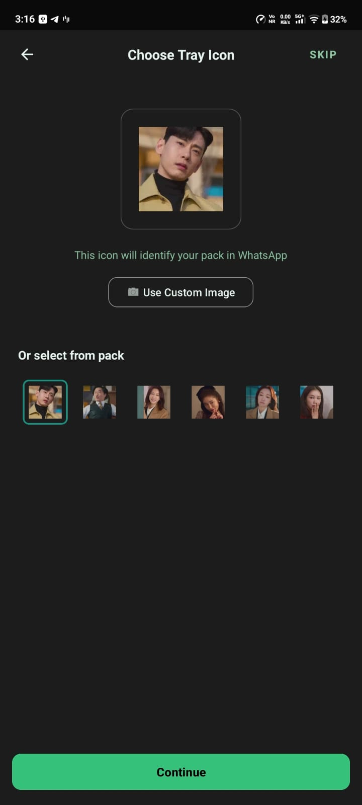
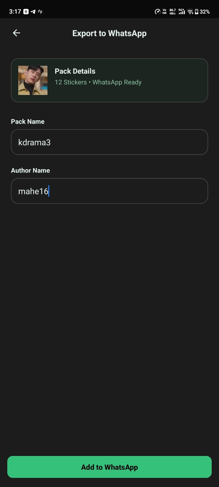
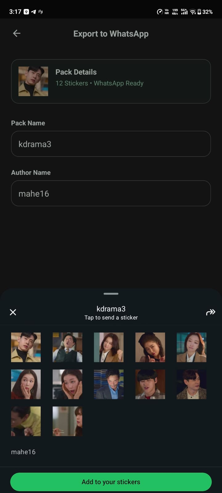

<p align="center">
  
</p>

<h1 align="center">Tel2What - Telegram to WhatsApp Sticker Converter</h1>

<p align="center">Convert Telegram sticker packs to WhatsApp format. Fast, offline, privacy-first.</p>

---

## Key Features

- **Telegram Import**: Paste a sticker pack link and download all stickers
- **Animated Support**: TGS (Lottie) and WebM video stickers fully supported
- **Native Performance**: libwebp JNI bridge for fast WebP encoding (~2-3s per animated sticker)
- **Fully Offline**: All processing on-device after initial download
- **WhatsApp Ready**: Auto-validates size, format, and dimensions for WhatsApp
- **Privacy First**: No ads, no analytics, no data collection, no tracking
- **Batch Processing**: Convert up to 30 stickers at once
- **Manual Upload**: Import your own images and GIFs

## Quick Start

1. Download the latest APK from [Releases](https://github.com/MaheshSharan/Tel2WhatSticker/releases)
2. Install on Android 11+ (API 30)
3. Paste a Telegram sticker pack link
4. Convert and export to WhatsApp

## Screenshots

<table>
  <tr>
    <td align="center"><b>Splash</b></td>
    <td align="center"><b>Onboarding</b></td>
    <td align="center"><b>Home</b></td>
  </tr>
  <tr>
    <td></td>
    <td></td>
    <td></td>
  </tr>
</table>

<table>
  <tr>
    <td align="center"><b>Import</b></td>
    <td align="center"><b>Conversion</b></td>
    <td align="center"><b>Selection</b></td>
  </tr>
  <tr>
    <td></td>
    <td></td>
    <td></td>
  </tr>
</table>

<table>
  <tr>
    <td align="center"><b>Tray Icon</b></td>
    <td align="center"><b>Export</b></td>
    <td align="center"><b>Manual Upload</b></td>
  </tr>
  <tr>
    <td></td>
    <td></td>
    <td></td>
  </tr>
</table>

## For Developers

**Prerequisites:** Android Studio Hedgehog+, JDK 17, Android SDK 34, NDK

```bash
git clone https://github.com/MaheshSharan/Tel2WhatSticker.git
cd Tel2WhatSticker
```

**Bot Token:** Telegram import needs a bot token. Add it to `local.properties` (gitignored):

```properties
TELEGRAM_BOT_TOKEN=your_bot_token_here
```

Get one from [@BotFather](https://t.me/BotFather) on Telegram. Then build:

```bash
./gradlew assembleDebug
```

Technical docs: [Architecture Overview](documentation/en/content/Architecture%20Overview/), [Animated Sticker Pipeline](assets/docs/animated_pipe.md)

## Contributing

Contributions welcome. See [documentation](documentation/en/content/) for architecture details.

## License

MIT License - see [LICENSE](LICENSE) for details.

## Acknowledgments

- [libwebp](https://developers.google.com/speed/webp) - Google's WebP library
- [Lottie Android](https://github.com/airbnb/lottie-android) - Airbnb's animation library
- [WhatsApp Stickers](https://github.com/WhatsApp/stickers) - Official sticker implementation reference
