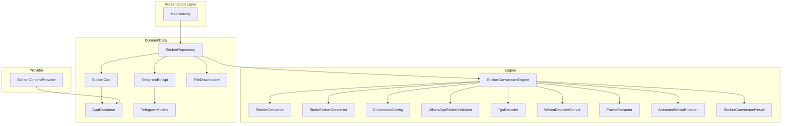
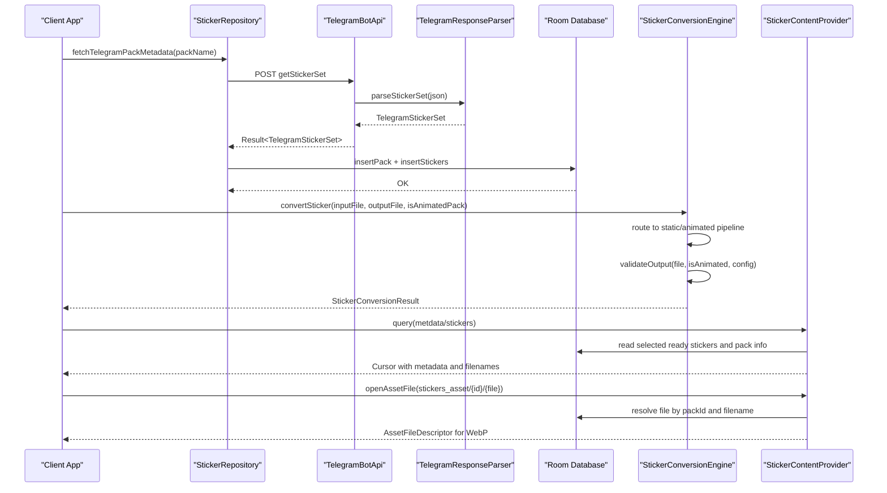
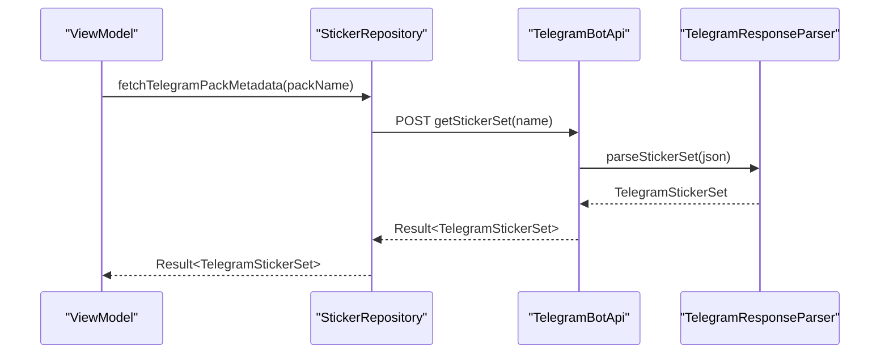
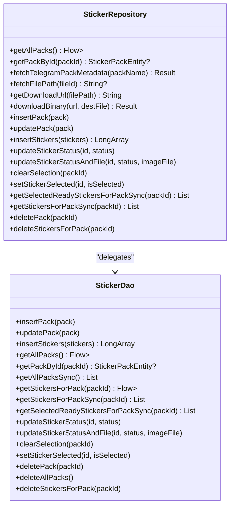
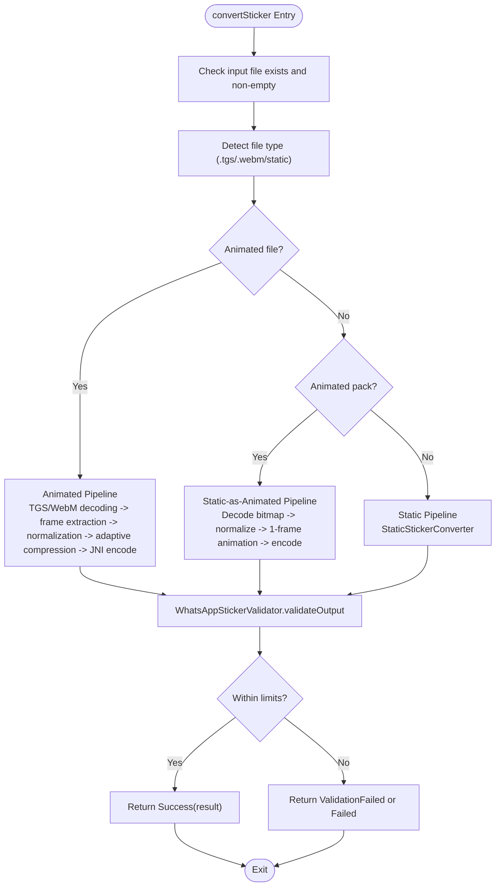
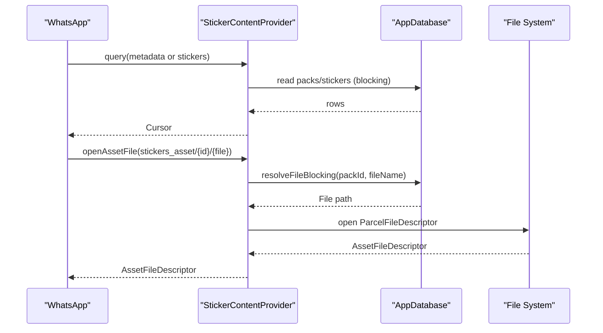
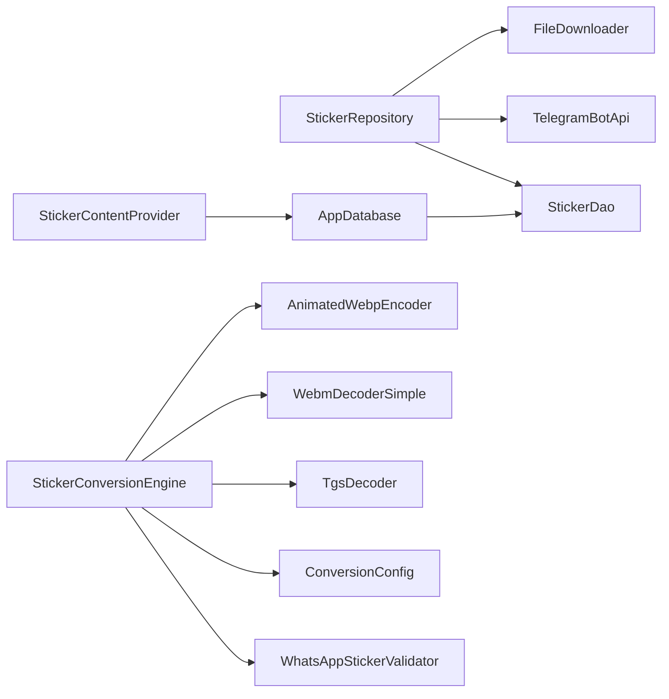

# API Reference

<cite>
**Referenced Files in This Document**
- [README.md](file://README.md)
- [Tel2WhatApplication.kt](file://app/src/main/java/com/maheshsharan/tel2what/Tel2WhatApplication.kt)
- [MainActivity.kt](file://app/src/main/java/com/maheshsharan/tel2what/MainActivity.kt)
- [AppDatabase.kt](file://app/src/main/java/com/maheshsharan/tel2what/data/local/AppDatabase.kt)
- [StickerDao.kt](file://app/src/main/java/com/maheshsharan/tel2what/data/local/dao/StickerDao.kt)
- [StickerRepository.kt](file://app/src/main/java/com/maheshsharan/tel2what/data/repository/StickerRepository.kt)
- [TelegramBotApi.kt](file://app/src/main/java/com/maheshsharan/tel2what/data/network/TelegramBotApi.kt)
- [TelegramModels.kt](file://app/src/main/java/com/maheshsharan/tel2what/data/network/model/TelegramModels.kt)
- [FileDownloader.kt](file://app/src/main/java/com/maheshsharan/tel2what/data/network/FileDownloader.kt)
- [StickerContentProvider.kt](file://app/src/main/java/com/maheshsharan/tel2what/provider/StickerContentProvider.kt)
- [StickerConverter.kt](file://app/src/main/java/com/maheshsharan/tel2what/engine/StickerConverter.kt)
- [StickerConversionEngine.kt](file://app/src/main/java/com/maheshsharan/tel2what/engine/StickerConversionEngine.kt)
- [StaticStickerConverter.kt](file://app/src/main/java/com/maheshsharan/tel2what/engine/StaticStickerConverter.kt)
- [ConversionConfig.kt](file://app/src/main/java/com/maheshsharan/tel2what/engine/ConversionConfig.kt)
- [WhatsAppStickerValidator.kt](file://app/src/main/java/com/maheshsharan/tel2what/engine/WhatsAppStickerValidator.kt)
- [FrameExtractor.kt](file://app/src/main/java/com/maheshsharan/tel2what/engine/decoder/FrameExtractor.kt)
- [TgsDecoder.kt](file://app/src/main/java/com/maheshsharan/tel2what/engine/decoder/TgsDecoder.kt)
- [WebmDecoderSimple.kt](file://app/src/main/java/com/maheshsharan/tel2what/engine/decoder/WebmDecoderSimple.kt)
- [AnimatedWebpEncoder.kt](file://app/src/main/java/com/maheshsharan/tel2what/engine/encoder/AnimatedWebpEncoder.kt)
- [StickerConversionResult.kt](file://app/src/main/java/com/maheshsharan/tel2what/engine/StickerConversionResult.kt)
</cite>

## Table of Contents
1. [Introduction](#introduction)
2. [Project Structure](#project-structure)
3. [Core Components](#core-components)
4. [Architecture Overview](#architecture-overview)
5. [Detailed Component Analysis](#detailed-component-analysis)
6. [Dependency Analysis](#dependency-analysis)
7. [Performance Considerations](#performance-considerations)
8. [Troubleshooting Guide](#troubleshooting-guide)
9. [Conclusion](#conclusion)
10. [Appendices](#appendices)

## Introduction
This document provides a comprehensive API reference for Tel2What’s public and internal interfaces. It covers:
- Telegram Bot API integration endpoints used to import sticker packs
- Repository pattern interfaces for data access
- Conversion engine APIs for animated and static sticker processing
- WhatsApp validation and sticker export interfaces via Android’s ContentProvider
- Error handling strategies, rate limiting considerations, and version compatibility information
- Practical integration patterns and example call flows

Tel2What converts Telegram sticker packs to WhatsApp-compatible WebP stickers. It supports animated stickers (TGS and WebM) and static images, with strict validation and adaptive compression to meet WhatsApp’s constraints.

**Section sources**
- [README.md](file://README.md#L1-L174)

## Project Structure
The project follows a layered architecture:
- Presentation/UI: Fragments and Activities
- Domain/Data: Repository pattern with Room DAOs and Telegram Bot API
- Engine: Conversion pipeline for animated and static stickers
- Provider: Android ContentProvider for exporting sticker metadata and assets to WhatsApp

**Diagram sources**
- [MainActivity.kt](file://app/src/main/java/com/maheshsharan/tel2what/MainActivity.kt#L1-L13)
- [StickerRepository.kt](file://app/src/main/java/com/maheshsharan/tel2what/data/repository/StickerRepository.kt#L1-L80)
- [StickerDao.kt](file://app/src/main/java/com/maheshsharan/tel2what/data/local/dao/StickerDao.kt#L1-L81)
- [AppDatabase.kt](file://app/src/main/java/com/maheshsharan/tel2what/data/local/AppDatabase.kt#L1-L42)
- [TelegramBotApi.kt](file://app/src/main/java/com/maheshsharan/tel2what/data/network/TelegramBotApi.kt#L1-L112)
- [TelegramModels.kt](file://app/src/main/java/com/maheshsharan/tel2what/data/network/model/TelegramModels.kt#L1-L75)
- [FileDownloader.kt](file://app/src/main/java/com/maheshsharan/tel2what/data/network/FileDownloader.kt)
- [StickerConversionEngine.kt](file://app/src/main/java/com/maheshsharan/tel2what/engine/StickerConversionEngine.kt#L1-L276)
- [StickerConverter.kt](file://app/src/main/java/com/maheshsharan/tel2what/engine/StickerConverter.kt#L1-L20)
- [StaticStickerConverter.kt](file://app/src/main/java/com/maheshsharan/tel2what/engine/StaticStickerConverter.kt)
- [ConversionConfig.kt](file://app/src/main/java/com/maheshsharan/tel2what/engine/ConversionConfig.kt)
- [WhatsAppStickerValidator.kt](file://app/src/main/java/com/maheshsharan/tel2what/engine/WhatsAppStickerValidator.kt#L1-L72)
- [FrameExtractor.kt](file://app/src/main/java/com/maheshsharan/tel2what/engine/decoder/FrameExtractor.kt)
- [TgsDecoder.kt](file://app/src/main/java/com/maheshsharan/tel2what/engine/decoder/TgsDecoder.kt)
- [WebmDecoderSimple.kt](file://app/src/main/java/com/maheshsharan/tel2what/engine/decoder/WebmDecoderSimple.kt)
- [AnimatedWebpEncoder.kt](file://app/src/main/java/com/maheshsharan/tel2what/engine/encoder/AnimatedWebpEncoder.kt)
- [StickerConversionResult.kt](file://app/src/main/java/com/maheshsharan/tel2what/engine/StickerConversionResult.kt)
- [StickerContentProvider.kt](file://app/src/main/java/com/maheshsharan/tel2what/provider/StickerContentProvider.kt#L1-L244)

**Section sources**
- [README.md](file://README.md#L98-L110)

## Core Components
This section documents the primary APIs and interfaces used by clients and integrators.

- Telegram Bot API Integration
  - Endpoint: getStickerSet
    - Method: POST
    - Headers: Content-Type: application/json
    - Body: {"name": "<sticker_set_name>"}
    - Response: Success returns TelegramStickerSet; Failure returns error details
    - Authentication: Bot token embedded in URL path
    - Rate limiting: Subject to Telegram Bot API limits; consider self-hosted token for higher quotas
  - Endpoint: getFile
    - Method: GET
    - Query: file_id=<file_id>
    - Response: Success returns file_path; Failure returns null
    - Authentication: Same bot token context
  - Download URL Construction: Combine base URL with file_path from getFile

- Repository Pattern Interfaces
  - Methods:
    - fetchTelegramPackMetadata(packName): Result<TelegramStickerSet>
    - fetchFilePath(fileId): String?
    - getDownloadUrl(filePath): String
    - downloadBinary(url, destFile): suspend Result<Unit>
    - insertPack(pack), updatePack(pack), deletePack(packId)
    - insertStickers(stickers): suspend LongArray
    - updateStickerStatus(id, status), updateStickerStatusAndFile(id, status, path)
    - clearSelection(packId), setStickerSelected(id, isSelected)
    - getSelectedReadyStickersForPackSync(packId): List<StickerEntity>
    - getStickersForPackSync(packId): List<StickerEntity>
    - getAllPacks(): Flow<List<StickerPackEntity>>
    - getPackById(packId): suspend StickerPackEntity?

- Conversion Engine APIs
  - Interface: StickerConverter.convert(inputFile, outputFile, config): suspend StickerConversionResult
  - Orchestrator: StickerConversionEngine.convertSticker(inputFile, outputFile, isAnimatedPack): suspend StickerConversionResult
  - Validation: WhatsAppStickerValidator.validateOutput(file, isAnimated, config): StickerConversionResult
  - Configuration: ConversionConfig defines target dimensions, FPS, max sizes, and durations

- WhatsApp Export Interfaces (ContentProvider)
  - Authority: com.maheshsharan.tel2what.provider
  - URIs:
    - content://com.maheshsharan.tel2what.provider/metadata
    - content://com.maheshsharan.tel2what.provider/metadata/{identifier}
    - content://com.maheshsharan.tel2what.provider/stickers/{identifier}
    - content://com.maheshsharan.tel2what.provider/stickers_asset/{identifier}/{filename}
  - MIME Types:
    - metadata: vnd.android.cursor.dir/vnd.com.maheshsharan.tel2what.provider.metadata
    - stickers: vnd.android.cursor.dir/vnd.com.maheshsharan.tel2what.provider.stickers
    - stickers_asset: image/webp

**Section sources**
- [TelegramBotApi.kt](file://app/src/main/java/com/maheshsharan/tel2what/data/network/TelegramBotApi.kt#L1-L112)
- [TelegramModels.kt](file://app/src/main/java/com/maheshsharan/tel2what/data/network/model/TelegramModels.kt#L1-L75)
- [StickerRepository.kt](file://app/src/main/java/com/maheshsharan/tel2what/data/repository/StickerRepository.kt#L1-L80)
- [StickerConverter.kt](file://app/src/main/java/com/maheshsharan/tel2what/engine/StickerConverter.kt#L1-L20)
- [StickerConversionEngine.kt](file://app/src/main/java/com/maheshsharan/tel2what/engine/StickerConversionEngine.kt#L1-L276)
- [WhatsAppStickerValidator.kt](file://app/src/main/java/com/maheshsharan/tel2what/engine/WhatsAppStickerValidator.kt#L1-L72)
- [ConversionConfig.kt](file://app/src/main/java/com/maheshsharan/tel2what/engine/ConversionConfig.kt)
- [StickerContentProvider.kt](file://app/src/main/java/com/maheshsharan/tel2what/provider/StickerContentProvider.kt#L1-L244)

## Architecture Overview
The system integrates external Telegram Bot API calls with a local repository and conversion engine, then exposes exported sticker metadata and assets to WhatsApp via a ContentProvider.

**Diagram sources**
- [StickerRepository.kt](file://app/src/main/java/com/maheshsharan/tel2what/data/repository/StickerRepository.kt#L1-L80)
- [TelegramBotApi.kt](file://app/src/main/java/com/maheshsharan/tel2what/data/network/TelegramBotApi.kt#L1-L112)
- [TelegramModels.kt](file://app/src/main/java/com/maheshsharan/tel2what/data/network/model/TelegramModels.kt#L1-L75)
- [AppDatabase.kt](file://app/src/main/java/com/maheshsharan/tel2what/data/local/AppDatabase.kt#L1-L42)
- [StickerConversionEngine.kt](file://app/src/main/java/com/maheshsharan/tel2what/engine/StickerConversionEngine.kt#L1-L276)
- [WhatsAppStickerValidator.kt](file://app/src/main/java/com/maheshsharan/tel2what/engine/WhatsAppStickerValidator.kt#L1-L72)
- [StickerContentProvider.kt](file://app/src/main/java/com/maheshsharan/tel2what/provider/StickerContentProvider.kt#L1-L244)

## Detailed Component Analysis

### Telegram Bot API Integration
- Purpose: Fetch Telegram sticker pack metadata and file paths for downloading.
- Endpoints:
  - getStickerSet
    - Request: JSON body with field name set to the Telegram sticker set name
    - Response: TelegramStickerSet on success; detailed error messages on failure (invalid token, not found, bad request)
  - getFile
    - Request: Query parameter file_id
    - Response: file_path string on success; null on failure
  - Download URL
    - Constructed from base URL and file_path
- Authentication:
  - Bot token is embedded in the URL path; replace with your own token for production
- Error Handling:
  - Handles HTTP errors (401, 404, 400), parsing failures, and network exceptions
- Rate Limiting:
  - Subject to Telegram Bot API limits; use your own token for higher quotas

**Diagram sources**
- [TelegramBotApi.kt](file://app/src/main/java/com/maheshsharan/tel2what/data/network/TelegramBotApi.kt#L22-L73)
- [TelegramModels.kt](file://app/src/main/java/com/maheshsharan/tel2what/data/network/model/TelegramModels.kt#L24-L60)

**Section sources**
- [TelegramBotApi.kt](file://app/src/main/java/com/maheshsharan/tel2what/data/network/TelegramBotApi.kt#L1-L112)
- [TelegramModels.kt](file://app/src/main/java/com/maheshsharan/tel2what/data/network/model/TelegramModels.kt#L1-L75)

### Repository Pattern Interfaces
- Responsibilities:
  - Coordinate between Telegram API, local database, and file downloads
  - Provide unified access to sticker packs and stickers
- Key Methods:
  - fetchTelegramPackMetadata, fetchFilePath, getDownloadUrl, downloadBinary
  - CRUD operations on packs and stickers via DAO
  - Selection management and readiness filtering

**Diagram sources**
- [StickerRepository.kt](file://app/src/main/java/com/maheshsharan/tel2what/data/repository/StickerRepository.kt#L1-L80)
- [StickerDao.kt](file://app/src/main/java/com/maheshsharan/tel2what/data/local/dao/StickerDao.kt#L1-L81)

**Section sources**
- [StickerRepository.kt](file://app/src/main/java/com/maheshsharan/tel2what/data/repository/StickerRepository.kt#L1-L80)
- [StickerDao.kt](file://app/src/main/java/com/maheshsharan/tel2what/data/local/dao/StickerDao.kt#L1-L81)
- [AppDatabase.kt](file://app/src/main/java/com/maheshsharan/tel2what/data/local/AppDatabase.kt#L1-L42)

### Conversion Engine APIs
- StickerConverter Interface
  - convert(inputFile, outputFile, config): suspend StickerConversionResult
- StickerConversionEngine
  - convertSticker(inputFile, outputFile, isAnimatedPack): suspend StickerConversionResult
  - Routes to static, static-as-animated, or animated pipelines
  - Applies adaptive compression (quality and FPS) to meet size constraints
  - Validates output against WhatsApp constraints
- Validation
  - WhatsAppStickerValidator.validateOutput(file, isAnimated, config): StickerConversionResult
  - Enforces size and dimension limits
- Configuration
  - ConversionConfig defines targetWidth/targetHeight, targetFps, maxAnimatedSizeBytes, maxStaticSizeBytes, maxDurationMs

**Diagram sources**
- [StickerConversionEngine.kt](file://app/src/main/java/com/maheshsharan/tel2what/engine/StickerConversionEngine.kt#L34-L89)
- [WhatsAppStickerValidator.kt](file://app/src/main/java/com/maheshsharan/tel2what/engine/WhatsAppStickerValidator.kt#L14-L70)

**Section sources**
- [StickerConverter.kt](file://app/src/main/java/com/maheshsharan/tel2what/engine/StickerConverter.kt#L1-L20)
- [StickerConversionEngine.kt](file://app/src/main/java/com/maheshsharan/tel2what/engine/StickerConversionEngine.kt#L1-L276)
- [WhatsAppStickerValidator.kt](file://app/src/main/java/com/maheshsharan/tel2what/engine/WhatsAppStickerValidator.kt#L1-L72)
- [ConversionConfig.kt](file://app/src/main/java/com/maheshsharan/tel2what/engine/ConversionConfig.kt)

### WhatsApp Validation and Export Interfaces
- ContentProvider Contract
  - Authority: com.maheshsharan.tel2what.provider
  - Paths:
    - metadata: list all sticker packs
    - metadata/{identifier}: single pack
    - stickers/{identifier}: list of stickers for a pack
    - stickers_asset/{identifier}/{filename}: binary WebP asset
  - MIME Types:
    - metadata: vnd.android.cursor.dir/vnd.com.maheshsharan.tel2what.provider.metadata
    - stickers: vnd.android.cursor.dir/vnd.com.maheshsharan.tel2what.provider.stickers
    - stickers_asset: image/webp
- Cursor Columns:
  - Metadata columns include identifiers, names, publisher info, links, imageDataVersion, cache flag, animatedStickerPack
  - Sticker columns include filename, emojis, accessibility text
- Resolution:
  - Resolves file paths by packId and filename, serving tray icon or sticker files

**Diagram sources**
- [StickerContentProvider.kt](file://app/src/main/java/com/maheshsharan/tel2what/provider/StickerContentProvider.kt#L74-L235)

**Section sources**
- [StickerContentProvider.kt](file://app/src/main/java/com/maheshsharan/tel2what/provider/StickerContentProvider.kt#L1-L244)

## Dependency Analysis
- Internal Dependencies:
  - StickerRepository depends on StickerDao, TelegramBotApi, and FileDownloader
  - StickerConversionEngine depends on StickerConverter, decoders, frame utilities, and validator
  - StickerContentProvider depends on AppDatabase and StickerDao
- External Dependencies:
  - Telegram Bot API for metadata and file paths
  - OkHttp for HTTP requests
  - Room for persistence
  - Android ContentProvider framework for export

**Diagram sources**
- [StickerRepository.kt](file://app/src/main/java/com/maheshsharan/tel2what/data/repository/StickerRepository.kt#L1-L80)
- [StickerConversionEngine.kt](file://app/src/main/java/com/maheshsharan/tel2what/engine/StickerConversionEngine.kt#L1-L276)
- [WhatsAppStickerValidator.kt](file://app/src/main/java/com/maheshsharan/tel2what/engine/WhatsAppStickerValidator.kt#L1-L72)
- [StickerContentProvider.kt](file://app/src/main/java/com/maheshsharan/tel2what/provider/StickerContentProvider.kt#L1-L244)
- [AppDatabase.kt](file://app/src/main/java/com/maheshsharan/tel2what/data/local/AppDatabase.kt#L1-L42)

**Section sources**
- [StickerRepository.kt](file://app/src/main/java/com/maheshsharan/tel2what/data/repository/StickerRepository.kt#L1-L80)
- [StickerConversionEngine.kt](file://app/src/main/java/com/maheshsharan/tel2what/engine/StickerConversionEngine.kt#L1-L276)
- [StickerContentProvider.kt](file://app/src/main/java/com/maheshsharan/tel2what/provider/StickerContentProvider.kt#L1-L244)
- [AppDatabase.kt](file://app/src/main/java/com/maheshsharan/tel2what/data/local/AppDatabase.kt#L1-L42)

## Performance Considerations
- Concurrency Controls:
  - Static pipeline allows up to 4 concurrent threads
  - Animated pipeline is serialized (semaphore=1) to avoid thermal throttling and OOM
- Adaptive Compression:
  - Starts with high FPS and quality, reduces quality in steps, then reduces FPS floor to meet 500KB limit
- Logging and Telemetry:
  - Metrics logged for frame counts, durations, quality, FPS, and encode time
- Strict Mode:
  - Enabled in debug builds to detect disk reads/writes, network on main thread, and leaked objects

**Section sources**
- [StickerConversionEngine.kt](file://app/src/main/java/com/maheshsharan/tel2what/engine/StickerConversionEngine.kt#L24-L28)
- [Tel2WhatApplication.kt](file://app/src/main/java/com/maheshsharan/tel2what/Tel2WhatApplication.kt#L17-L44)

## Troubleshooting Guide
- Telegram Bot API Errors:
  - 401 Unauthorized: Invalid or missing bot token
  - 404 Not Found: Endpoint not found or invalid token path
  - 400 Bad Request: Sticker set not found or malformed request
  - UnknownHostException: No internet connection
- File Path Retrieval:
  - getFile returns null on HTTP failure or parsing error
- Conversion Failures:
  - Input file missing or empty
  - Decoder returns null or zero frames
  - JNI encoding fails
  - Output exceeds size limits or dimension mismatch
- ContentProvider Issues:
  - Wrong URI path segments
  - File not found by packId/filename resolution

**Section sources**
- [TelegramBotApi.kt](file://app/src/main/java/com/maheshsharan/tel2what/data/network/TelegramBotApi.kt#L34-L73)
- [StickerConversionEngine.kt](file://app/src/main/java/com/maheshsharan/tel2what/engine/StickerConversionEngine.kt#L46-L54)
- [WhatsAppStickerValidator.kt](file://app/src/main/java/com/maheshsharan/tel2what/engine/WhatsAppStickerValidator.kt#L19-L40)
- [StickerContentProvider.kt](file://app/src/main/java/com/maheshsharan/tel2what/provider/StickerContentProvider.kt#L193-L215)

## Conclusion
Tel2What provides a robust, offline-first pipeline to convert Telegram sticker packs to WhatsApp-compatible WebPs. Its public interfaces include Telegram Bot API integration, a repository for data access, a conversion engine with adaptive compression, and a ContentProvider for exporting metadata and assets. The system emphasizes correctness, performance, and compliance with WhatsApp constraints.

[No sources needed since this section summarizes without analyzing specific files]

## Appendices

### API Definitions

- Telegram Bot API
  - getStickerSet
    - Method: POST
    - Headers: Content-Type: application/json
    - Body: {"name": "<sticker_set_name>"}
    - Responses:
      - Success: TelegramStickerSet
      - Failure: Error message string
  - getFile
    - Method: GET
    - Query: file_id
    - Responses:
      - Success: file_path string
      - Failure: null

- Repository
  - Methods:
    - fetchTelegramPackMetadata(packName): Result<TelegramStickerSet>
    - fetchFilePath(fileId): String?
    - getDownloadUrl(filePath): String
    - downloadBinary(url, destFile): suspend Result<Unit>
    - insertPack(pack), updatePack(pack), deletePack(packId)
    - insertStickers(stickers): suspend LongArray
    - updateStickerStatus(id, status), updateStickerStatusAndFile(id, status, imageFile)
    - clearSelection(packId), setStickerSelected(id, isSelected)
    - getSelectedReadyStickersForPackSync(packId): List<StickerEntity>
    - getStickersForPackSync(packId): List<StickerEntity>
    - getAllPacks(): Flow<List<StickerPackEntity>>
    - getPackById(packId): suspend StickerPackEntity?

- Conversion Engine
  - StickerConverter.convert(inputFile, outputFile, config): suspend StickerConversionResult
  - StickerConversionEngine.convertSticker(inputFile, outputFile, isAnimatedPack): suspend StickerConversionResult
  - WhatsAppStickerValidator.validateOutput(file, isAnimated, config): StickerConversionResult

- ContentProvider
  - Authority: com.maheshsharan.tel2what.provider
  - URIs:
    - content://.../metadata
    - content://.../metadata/{identifier}
    - content://.../stickers/{identifier}
    - content://.../stickers_asset/{identifier}/{filename}
  - MIME Types:
    - metadata: vnd.android.cursor.dir/vnd.com.maheshsharan.tel2what.provider.metadata
    - stickers: vnd.android.cursor.dir/vnd.com.maheshsharan.tel2what.provider.stickers
    - stickers_asset: image/webp

**Section sources**
- [TelegramBotApi.kt](file://app/src/main/java/com/maheshsharan/tel2what/data/network/TelegramBotApi.kt#L22-L110)
- [StickerRepository.kt](file://app/src/main/java/com/maheshsharan/tel2what/data/repository/StickerRepository.kt#L16-L79)
- [StickerConverter.kt](file://app/src/main/java/com/maheshsharan/tel2what/engine/StickerConverter.kt#L5-L18)
- [StickerConversionEngine.kt](file://app/src/main/java/com/maheshsharan/tel2what/engine/StickerConversionEngine.kt#L34-L89)
- [WhatsAppStickerValidator.kt](file://app/src/main/java/com/maheshsharan/tel2what/engine/WhatsAppStickerValidator.kt#L14-L70)
- [StickerContentProvider.kt](file://app/src/main/java/com/maheshsharan/tel2what/provider/StickerContentProvider.kt#L17-L179)

### Version Compatibility
- Android 11 (API 30)+ recommended
- Room database version 2 with migration from 1 to 2 (adds isSelected column)
- Native WebP encoding via libwebp through JNI

**Section sources**
- [README.md](file://README.md#L81-L86)
- [AppDatabase.kt](file://app/src/main/java/com/maheshsharan/tel2what/data/local/AppDatabase.kt#L13-L25)