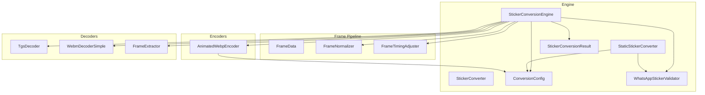
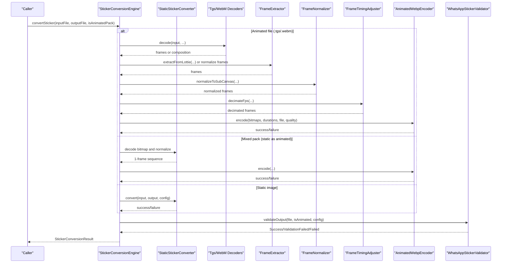
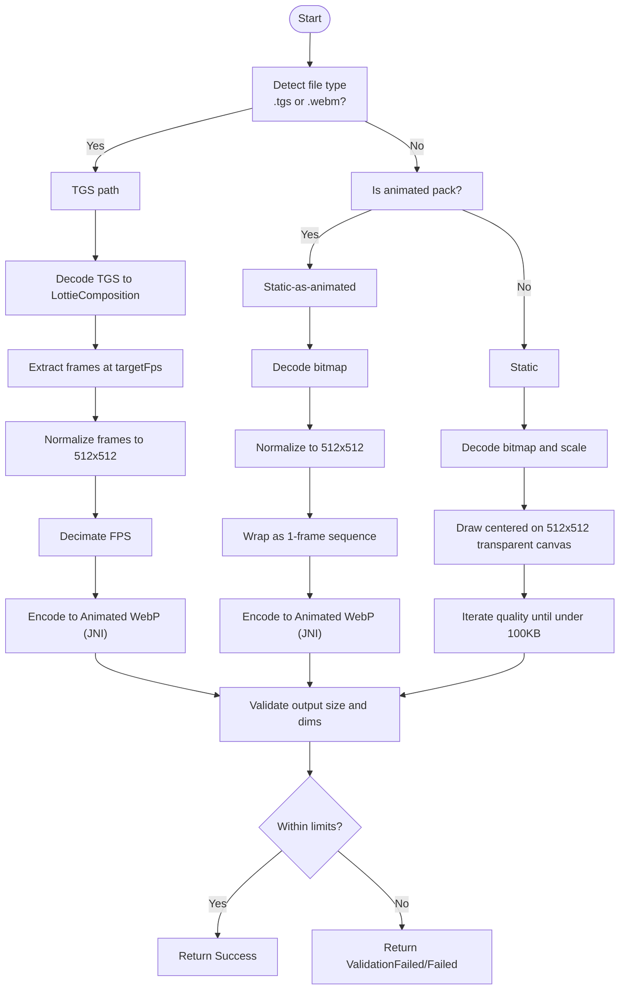

# Conversion Engine APIs

<cite>
**Referenced Files in This Document**
- [StickerConverter.kt](file://app/src/main/java/com/maheshsharan/tel2what/engine/StickerConverter.kt)
- [StaticStickerConverter.kt](file://app/src/main/java/com/maheshsharan/tel2what/engine/StaticStickerConverter.kt)
- [StickerConversionEngine.kt](file://app/src/main/java/com/maheshsharan/tel2what/engine/StickerConversionEngine.kt)
- [ConversionConfig.kt](file://app/src/main/java/com/maheshsharan/tel2what/engine/ConversionConfig.kt)
- [StickerConversionResult.kt](file://app/src/main/java/com/maheshsharan/tel2what/engine/StickerConversionResult.kt)
- [WhatsAppStickerValidator.kt](file://app/src/main/java/com/maheshsharan/tel2what/engine/WhatsAppStickerValidator.kt)
- [FrameData.kt](file://app/src/main/java/com/maheshsharan/tel2what/engine/frame/FrameData.kt)
- [FrameNormalizer.kt](file://app/src/main/java/com/maheshsharan/tel2what/engine/frame/FrameNormalizer.kt)
- [FrameTimingAdjuster.kt](file://app/src/main/java/com/maheshsharan/tel2what/engine/frame/FrameTimingAdjuster.kt)
- [AnimatedWebpEncoder.kt](file://app/src/main/java/com/maheshsharan/tel2what/engine/encoder/AnimatedWebpEncoder.kt)
- [TgsDecoder.kt](file://app/src/main/java/com/maheshsharan/tel2what/engine/decoder/TgsDecoder.kt)
- [WebmDecoderSimple.kt](file://app/src/main/java/com/maheshsharan/tel2what/engine/decoder/WebmDecoderSimple.kt)
- [FrameExtractor.kt](file://app/src/main/java/com/maheshsharan/tel2what/engine/decoder/FrameExtractor.kt)
- [webp_native_bridge.cpp](file://app/src/main/cpp/webp_native_bridge.cpp)
</cite>

## Table of Contents
1. [Introduction](#introduction)
2. [Project Structure](#project-structure)
3. [Core Components](#core-components)
4. [Architecture Overview](#architecture-overview)
5. [Detailed Component Analysis](#detailed-component-analysis)
6. [Dependency Analysis](#dependency-analysis)
7. [Performance Considerations](#performance-considerations)
8. [Troubleshooting Guide](#troubleshooting-guide)
9. [Conclusion](#conclusion)
10. [Appendices](#appendices)

## Introduction
This document describes the sticker conversion engine APIs that transform Telegram stickers into WhatsApp-compliant animated or static WebP stickers. It covers the StickerConverter interface and its implementations, the orchestration engine methods, conversion configuration parameters, and the end-to-end conversion workflow from input validation through native WebP encoding to output generation. It also documents concurrency controls, memory management, error handling patterns, and extension points for adding new sticker formats.

## Project Structure
The conversion engine resides under the engine package and is composed of:
- Orchestration and routing: StickerConversionEngine
- Converter contract: StickerConverter
- Implementations: StaticStickerConverter
- Validation: WhatsAppStickerValidator
- Frame processing: FrameData, FrameNormalizer, FrameTimingAdjuster
- Encoders: AnimatedWebpEncoder (JNI bridge)
- Decoders: TgsDecoder, WebmDecoderSimple, FrameExtractor
- Configuration and results: ConversionConfig, StickerConversionResult

**Diagram sources**
- [StickerConversionEngine.kt](file://app/src/main/java/com/maheshsharan/tel2what/engine/StickerConversionEngine.kt#L17-L88)
- [StaticStickerConverter.kt](file://app/src/main/java/com/maheshsharan/tel2what/engine/StaticStickerConverter.kt#L15-L94)
- [ConversionConfig.kt](file://app/src/main/java/com/maheshsharan/tel2what/engine/ConversionConfig.kt#L3-L13)
- [StickerConversionResult.kt](file://app/src/main/java/com/maheshsharan/tel2what/engine/StickerConversionResult.kt#L5-L22)
- [WhatsAppStickerValidator.kt](file://app/src/main/java/com/maheshsharan/tel2what/engine/WhatsAppStickerValidator.kt#L7-L72)
- [FrameData.kt](file://app/src/main/java/com/maheshsharan/tel2what/engine/frame/FrameData.kt#L5-L8)
- [FrameNormalizer.kt](file://app/src/main/java/com/maheshsharan/tel2what/engine/frame/FrameNormalizer.kt#L11-L61)
- [FrameTimingAdjuster.kt](file://app/src/main/java/com/maheshsharan/tel2what/engine/frame/FrameTimingAdjuster.kt#L8-L71)
- [AnimatedWebpEncoder.kt](file://app/src/main/java/com/maheshsharan/tel2what/engine/encoder/AnimatedWebpEncoder.kt#L8-L90)
- [TgsDecoder.kt](file://app/src/main/java/com/maheshsharan/tel2what/engine/decoder/TgsDecoder.kt#L17-L94)
- [WebmDecoderSimple.kt](file://app/src/main/java/com/maheshsharan/tel2what/engine/decoder/WebmDecoderSimple.kt#L20-L256)
- [FrameExtractor.kt](file://app/src/main/java/com/maheshsharan/tel2what/engine/decoder/FrameExtractor.kt#L16-L100)

**Section sources**
- [StickerConversionEngine.kt](file://app/src/main/java/com/maheshsharan/tel2what/engine/StickerConversionEngine.kt#L17-L88)
- [StaticStickerConverter.kt](file://app/src/main/java/com/maheshsharan/tel2what/engine/StaticStickerConverter.kt#L15-L94)
- [ConversionConfig.kt](file://app/src/main/java/com/maheshsharan/tel2what/engine/ConversionConfig.kt#L3-L13)
- [StickerConversionResult.kt](file://app/src/main/java/com/maheshsharan/tel2what/engine/StickerConversionResult.kt#L5-L22)
- [WhatsAppStickerValidator.kt](file://app/src/main/java/com/maheshsharan/tel2what/engine/WhatsAppStickerValidator.kt#L7-L72)
- [FrameData.kt](file://app/src/main/java/com/maheshsharan/tel2what/engine/frame/FrameData.kt#L5-L8)
- [FrameNormalizer.kt](file://app/src/main/java/com/maheshsharan/tel2what/engine/frame/FrameNormalizer.kt#L11-L61)
- [FrameTimingAdjuster.kt](file://app/src/main/java/com/maheshsharan/tel2what/engine/frame/FrameTimingAdjuster.kt#L8-L71)
- [AnimatedWebpEncoder.kt](file://app/src/main/java/com/maheshsharan/tel2what/engine/encoder/AnimatedWebpEncoder.kt#L8-L90)
- [TgsDecoder.kt](file://app/src/main/java/com/maheshsharan/tel2what/engine/decoder/TgsDecoder.kt#L17-L94)
- [WebmDecoderSimple.kt](file://app/src/main/java/com/maheshsharan/tel2what/engine/decoder/WebmDecoderSimple.kt#L20-L256)
- [FrameExtractor.kt](file://app/src/main/java/com/maheshsharan/tel2what/engine/decoder/FrameExtractor.kt#L16-L100)

## Core Components
- StickerConverter: Defines the contract for converting an input file to a WebP sticker with a given configuration.
- StaticStickerConverter: Implements conversion for static images to a 512x512 static WebP with iterative quality reduction.
- StickerConversionEngine: Orchestrates conversion pipelines for static, animated TGS, animated WebM, and mixed static-as-animated packs. It enforces concurrency and memory safety.
- ConversionConfig: Centralizes conversion parameters such as target dimensions, max sizes, FPS, duration limits, and quality defaults.
- StickerConversionResult: Sealed class representing success, failure, and validation failures with structured outputs.
- Validation: WhatsAppStickerValidator enforces size and dimension constraints post-encoding.
- Frame processing: FrameData, FrameNormalizer, FrameTimingAdjuster support frame extraction, normalization, and timing adjustments.
- Encoders and Decoders: AnimatedWebpEncoder (JNI) and TgsDecoder, WebmDecoderSimple, FrameExtractor form the animated pipeline.

**Section sources**
- [StickerConverter.kt](file://app/src/main/java/com/maheshsharan/tel2what/engine/StickerConverter.kt#L5-L19)
- [StaticStickerConverter.kt](file://app/src/main/java/com/maheshsharan/tel2what/engine/StaticStickerConverter.kt#L15-L94)
- [StickerConversionEngine.kt](file://app/src/main/java/com/maheshsharan/tel2what/engine/StickerConversionEngine.kt#L17-L88)
- [ConversionConfig.kt](file://app/src/main/java/com/maheshsharan/tel2what/engine/ConversionConfig.kt#L3-L13)
- [StickerConversionResult.kt](file://app/src/main/java/com/maheshsharan/tel2what/engine/StickerConversionResult.kt#L5-L22)
- [WhatsAppStickerValidator.kt](file://app/src/main/java/com/maheshsharan/tel2what/engine/WhatsAppStickerValidator.kt#L7-L72)
- [FrameData.kt](file://app/src/main/java/com/maheshsharan/tel2what/engine/frame/FrameData.kt#L5-L8)
- [FrameNormalizer.kt](file://app/src/main/java/com/maheshsharan/tel2what/engine/frame/FrameNormalizer.kt#L11-L61)
- [FrameTimingAdjuster.kt](file://app/src/main/java/com/maheshsharan/tel2what/engine/frame/FrameTimingAdjuster.kt#L8-L71)
- [AnimatedWebpEncoder.kt](file://app/src/main/java/com/maheshsharan/tel2what/engine/encoder/AnimatedWebpEncoder.kt#L8-L90)
- [TgsDecoder.kt](file://app/src/main/java/com/maheshsharan/tel2what/engine/decoder/TgsDecoder.kt#L17-L94)
- [WebmDecoderSimple.kt](file://app/src/main/java/com/maheshsharan/tel2what/engine/decoder/WebmDecoderSimple.kt#L20-L256)
- [FrameExtractor.kt](file://app/src/main/java/com/maheshsharan/tel2what/engine/decoder/FrameExtractor.kt#L16-L100)

## Architecture Overview
The engine routes inputs to appropriate pipelines, normalizes frames, and encodes to WebP using a native encoder. Validation ensures compliance with WhatsApp constraints.

**Diagram sources**
- [StickerConversionEngine.kt](file://app/src/main/java/com/maheshsharan/tel2what/engine/StickerConversionEngine.kt#L33-L88)
- [StaticStickerConverter.kt](file://app/src/main/java/com/maheshsharan/tel2what/engine/StaticStickerConverter.kt#L17-L94)
- [TgsDecoder.kt](file://app/src/main/java/com/maheshsharan/tel2what/engine/decoder/TgsDecoder.kt#L21-L80)
- [WebmDecoderSimple.kt](file://app/src/main/java/com/maheshsharan/tel2what/engine/decoder/WebmDecoderSimple.kt#L27-L192)
- [FrameExtractor.kt](file://app/src/main/java/com/maheshsharan/tel2what/engine/decoder/FrameExtractor.kt#L30-L88)
- [FrameNormalizer.kt](file://app/src/main/java/com/maheshsharan/tel2what/engine/frame/FrameNormalizer.kt#L17-L60)
- [FrameTimingAdjuster.kt](file://app/src/main/java/com/maheshsharan/tel2what/engine/frame/FrameTimingAdjuster.kt#L16-L70)
- [AnimatedWebpEncoder.kt](file://app/src/main/java/com/maheshsharan/tel2what/engine/encoder/AnimatedWebpEncoder.kt#L32-L78)
- [WhatsAppStickerValidator.kt](file://app/src/main/java/com/maheshsharan/tel2what/engine/WhatsAppStickerValidator.kt#L14-L70)

## Detailed Component Analysis

### StickerConverter Interface
Defines a single suspend conversion method that transforms an input file into a WebP sticker according to a configuration and returns a typed result.

- Method signature: convert(inputFile, outputFile, config): StickerConversionResult
- Purpose: Contract for all converters to implement a unified conversion API.

**Section sources**
- [StickerConverter.kt](file://app/src/main/java/com/maheshsharan/tel2what/engine/StickerConverter.kt#L5-L19)

### StaticStickerConverter Implementation
Converts static images to a 512x512 static WebP with iterative quality reduction to meet size constraints.

Key behaviors:
- Decode input bitmap and compute scale to fit within target bounds while preserving aspect ratio.
- Render onto an exactly-sized transparent canvas (512x512) centered with translucent padding.
- Iteratively compress with WebP lossy quality until under maxStaticSizeBytes.
- Validate output via WhatsAppStickerValidator.

Concurrency and memory:
- Uses Dispatchers.IO.
- Recycles original, scaled, and canvas bitmaps in finally blocks.

**Section sources**
- [StaticStickerConverter.kt](file://app/src/main/java/com/maheshsharan/tel2what/engine/StaticStickerConverter.kt#L17-L94)

### StickerConversionEngine Orchestration
Routes inputs to the correct pipeline and manages concurrency and memory.

Primary methods:
- convertSticker(inputFile, outputFile, isAnimatedPack): Main orchestrator that:
  - Validates input existence and non-empty size.
  - Detects file type (.tgs or .webm) and decides pipeline.
  - Enforces concurrency via semaphores:
    - Static pipeline: up to 4 concurrent conversions.
    - Animated pipeline: serialized (1 at a time) to avoid thermal throttling and OOM.
  - Delegates to:
    - processAnimated for .tgs or .webm inputs.
    - processStaticAsAnimated for mixed static-as-animated packs.
    - staticConverter.convert for static images.

Animated pipeline details:
- TGS path:
  - Decode TGS to LottieComposition.
  - Extract frames at targetFps with FrameExtractor.
  - Normalize frames to 512x512 using FrameNormalizer.
  - Decimate FPS using FrameTimingAdjuster to reduce frame count.
  - Encode with AnimatedWebpEncoder and iterate quality until under maxAnimatedSizeBytes.
- WebM path:
  - Decode frames using WebmDecoderSimple.
  - Normalize frames to 512x512.
  - Apply decimation and encoding loop similar to TGS.
- Memory management:
  - Recycle bitmaps after JNI encoding completes.
  - Log metrics for telemetry.

Static-as-animated pipeline:
- Decode bitmap, normalize to 512x512, wrap into a 1-frame sequence, and encode.

Validation:
- Post-encoding, route through WhatsAppStickerValidator to enforce size and dimension constraints.

**Section sources**
- [StickerConversionEngine.kt](file://app/src/main/java/com/maheshsharan/tel2what/engine/StickerConversionEngine.kt#L33-L88)
- [StickerConversionEngine.kt](file://app/src/main/java/com/maheshsharan/tel2what/engine/StickerConversionEngine.kt#L90-L129)
- [StickerConversionEngine.kt](file://app/src/main/java/com/maheshsharan/tel2what/engine/StickerConversionEngine.kt#L131-L273)

### ConversionConfig Parameters
Central configuration controlling conversion behavior.

Parameters:
- targetWidth, targetHeight: Target canvas size (default 512x512).
- maxStaticSizeBytes: Maximum static WebP size (default 100 KB).
- maxAnimatedSizeBytes: Maximum animated WebP size (default 500 KB).
- maxTraySizeBytes: Maximum tray icon size (default 50 KB).
- trayDimension: Tray icon dimension (default 96).
- maxDurationMs: Maximum animation duration (default 10,000 ms).
- minFrameDurationMs: Minimum per-frame duration (default 8 ms).
- targetFps: Target frame rate for extraction/encoding (default 10 FPS).

Usage:
- Applied across decoders, normalizers, timing adjuster, and validators.

**Section sources**
- [ConversionConfig.kt](file://app/src/main/java/com/maheshsharan/tel2what/engine/ConversionConfig.kt#L3-L13)

### StickerConversionResult
Sealed class representing outcomes:
- Success(outputFile, width, height, sizeBytes, isAnimated)
- Failed(reason, exception?)
- ValidationFailed(reason)

Used by all converters and validators to communicate results consistently.

**Section sources**
- [StickerConversionResult.kt](file://app/src/main/java/com/maheshsharan/tel2what/engine/StickerConversionResult.kt#L5-L22)

### Validation Workflow
WhatsAppStickerValidator performs strict checks:
- Existence and non-empty file.
- Size validation (static vs animated).
- Dimension validation via BitmapFactory with inJustDecodeBounds.

Returns Success on pass, ValidationFailed on constraint violation, Failed on missing/empty file.

**Section sources**
- [WhatsAppStickerValidator.kt](file://app/src/main/java/com/maheshsharan/tel2what/engine/WhatsAppStickerValidator.kt#L14-L70)

### Frame Processing Components
- FrameData: Holds a bitmap and its presentation duration in milliseconds.
- FrameNormalizer: Scales and letterboxes arbitrary bitmaps to exactly 512x512 with transparent padding.
- FrameTimingAdjuster: Decimates FPS by accumulating durations across retained frames, enforcing minimum duration and global duration caps.

**Section sources**
- [FrameData.kt](file://app/src/main/java/com/maheshsharan/tel2what/engine/frame/FrameData.kt#L5-L8)
- [FrameNormalizer.kt](file://app/src/main/java/com/maheshsharan/tel2what/engine/frame/FrameNormalizer.kt#L17-L60)
- [FrameTimingAdjuster.kt](file://app/src/main/java/com/maheshsharan/tel2what/engine/frame/FrameTimingAdjuster.kt#L16-L70)

### Encoders and Decoders

#### AnimatedWebpEncoder (JNI)
- Loads native library and exposes encode(bitmaps, durationsMs, outputFile, targetQuality).
- JNI boundary delegates to native WebP animation encoder.
- Writes resulting bytes to output file and returns success/failure.

Native implementation highlights:
- Initializes WebPAnimEncoderOptions and WebPAnimEncoder.
- Configures lossy encoding with method=1 for speed.
- Adds frames with timestamps and compiles to final WebP animation.
- Returns byte array to JVM and writes to file.

**Section sources**
- [AnimatedWebpEncoder.kt](file://app/src/main/java/com/maheshsharan/tel2what/engine/encoder/AnimatedWebpEncoder.kt#L32-L78)
- [webp_native_bridge.cpp](file://app/src/main/cpp/webp_native_bridge.cpp#L14-L147)

#### TgsDecoder
- Validates and decompresses .tgs (GZIP JSON) to JSON.
- Parses LottieComposition synchronously.
- Returns composition or null on failure.

**Section sources**
- [TgsDecoder.kt](file://app/src/main/java/com/maheshsharan/tel2what/engine/decoder/TgsDecoder.kt#L21-L80)

#### FrameExtractor
- Renders LottieComposition to a sequence of 512x512 ARGB_8888 bitmaps at targetFps.
- Respects maxDurationMs and ensures at least two frames for animated WebP.

**Section sources**
- [FrameExtractor.kt](file://app/src/main/java/com/maheshsharan/tel2what/engine/decoder/FrameExtractor.kt#L30-L88)

#### WebmDecoderSimple
- Uses MediaExtractor and MediaCodec to decode video tracks from WebM.
- Outputs frames as RGB bitmaps, converts YUV to RGB, and captures at targetFps.
- Applies duration caps and cleans up resources.

**Section sources**
- [WebmDecoderSimple.kt](file://app/src/main/java/com/maheshsharan/tel2what/engine/decoder/WebmDecoderSimple.kt#L27-L192)

### Conversion Workflow: From Input to Output

**Diagram sources**
- [StickerConversionEngine.kt](file://app/src/main/java/com/maheshsharan/tel2what/engine/StickerConversionEngine.kt#L33-L88)
- [StaticStickerConverter.kt](file://app/src/main/java/com/maheshsharan/tel2what/engine/StaticStickerConverter.kt#L17-L94)
- [TgsDecoder.kt](file://app/src/main/java/com/maheshsharan/tel2what/engine/decoder/TgsDecoder.kt#L21-L80)
- [FrameExtractor.kt](file://app/src/main/java/com/maheshsharan/tel2what/engine/decoder/FrameExtractor.kt#L30-L88)
- [FrameNormalizer.kt](file://app/src/main/java/com/maheshsharan/tel2what/engine/frame/FrameNormalizer.kt#L17-L60)
- [FrameTimingAdjuster.kt](file://app/src/main/java/com/maheshsharan/tel2what/engine/frame/FrameTimingAdjuster.kt#L16-L70)
- [AnimatedWebpEncoder.kt](file://app/src/main/java/com/maheshsharan/tel2what/engine/encoder/AnimatedWebpEncoder.kt#L32-L78)
- [WhatsAppStickerValidator.kt](file://app/src/main/java/com/maheshsharan/tel2what/engine/WhatsAppStickerValidator.kt#L14-L70)

## Dependency Analysis

```mermaid
classDiagram
class StickerConverter {
+convert(inputFile, outputFile, config) : StickerConversionResult
}
class StaticStickerConverter {
+convert(inputFile, outputFile, config) : StickerConversionResult
}
class StickerConversionEngine {
+convertSticker(inputFile, outputFile, isAnimatedPack) : StickerConversionResult
}
class ConversionConfig {
+targetWidth : Int
+targetHeight : Int
+maxStaticSizeBytes : Long
+maxAnimatedSizeBytes : Long
+maxTraySizeBytes : Long
+trayDimension : Int
+maxDurationMs : Long
+minFrameDurationMs : Long
+targetFps : Int
}
class StickerConversionResult
class FrameData {
+bitmap : Bitmap
+durationMs : Int
}
class FrameNormalizer {
+normalizeToSubCanvas(source, targetWidth, targetHeight, recycleOriginal) : Bitmap
}
class FrameTimingAdjuster {
+decimateFps(originalFrames, currentFps, targetFps) : FrameData[]
}
class AnimatedWebpEncoder {
+encode(bitmaps, durationsMs, outputFile, targetQuality) : Boolean
}
class TgsDecoder {
+decode(tgsFile, cacheDir) : LottieComposition?
}
class WebmDecoderSimple {
+decode(webmFile, targetFps, maxDurationMs) : FrameData[]
}
class FrameExtractor {
+extractFromLottie(composition, targetWidth, targetHeight, targetFps, maxDurationMs) : FrameData[]
}
class WhatsAppStickerValidator {
+validateOutput(file, isAnimated, config) : StickerConversionResult
}
StaticStickerConverter ..|> StickerConverter
StickerConversionEngine --> StickerConverter : "delegates"
StickerConversionEngine --> ConversionConfig
StickerConversionEngine --> FrameNormalizer
StickerConversionEngine --> FrameTimingAdjuster
StickerConversionEngine --> AnimatedWebpEncoder
StickerConversionEngine --> TgsDecoder
StickerConversionEngine --> WebmDecoderSimple
StickerConversionEngine --> FrameExtractor
StickerConversionEngine --> WhatsAppStickerValidator
FrameNormalizer --> FrameData
FrameTimingAdjuster --> FrameData
AnimatedWebpEncoder --> ConversionConfig
TgsDecoder --> ConversionConfig
WebmDecoderSimple --> ConversionConfig
FrameExtractor --> ConversionConfig
WhatsAppStickerValidator --> ConversionConfig
```

**Diagram sources**
- [StickerConverter.kt](file://app/src/main/java/com/maheshsharan/tel2what/engine/StickerConverter.kt#L5-L19)
- [StaticStickerConverter.kt](file://app/src/main/java/com/maheshsharan/tel2what/engine/StaticStickerConverter.kt#L15-L94)
- [StickerConversionEngine.kt](file://app/src/main/java/com/maheshsharan/tel2what/engine/StickerConversionEngine.kt#L17-L88)
- [ConversionConfig.kt](file://app/src/main/java/com/maheshsharan/tel2what/engine/ConversionConfig.kt#L3-L13)
- [FrameData.kt](file://app/src/main/java/com/maheshsharan/tel2what/engine/frame/FrameData.kt#L5-L8)
- [FrameNormalizer.kt](file://app/src/main/java/com/maheshsharan/tel2what/engine/frame/FrameNormalizer.kt#L11-L61)
- [FrameTimingAdjuster.kt](file://app/src/main/java/com/maheshsharan/tel2what/engine/frame/FrameTimingAdjuster.kt#L8-L71)
- [AnimatedWebpEncoder.kt](file://app/src/main/java/com/maheshsharan/tel2what/engine/encoder/AnimatedWebpEncoder.kt#L8-L90)
- [TgsDecoder.kt](file://app/src/main/java/com/maheshsharan/tel2what/engine/decoder/TgsDecoder.kt#L17-L94)
- [WebmDecoderSimple.kt](file://app/src/main/java/com/maheshsharan/tel2what/engine/decoder/WebmDecoderSimple.kt#L20-L256)
- [FrameExtractor.kt](file://app/src/main/java/com/maheshsharan/tel2what/engine/decoder/FrameExtractor.kt#L16-L100)
- [WhatsAppStickerValidator.kt](file://app/src/main/java/com/maheshsharan/tel2what/engine/WhatsAppStickerValidator.kt#L7-L72)

**Section sources**
- [StickerConversionEngine.kt](file://app/src/main/java/com/maheshsharan/tel2what/engine/StickerConversionEngine.kt#L17-L88)
- [StaticStickerConverter.kt](file://app/src/main/java/com/maheshsharan/tel2what/engine/StaticStickerConverter.kt#L15-L94)
- [ConversionConfig.kt](file://app/src/main/java/com/maheshsharan/tel2what/engine/ConversionConfig.kt#L3-L13)
- [FrameData.kt](file://app/src/main/java/com/maheshsharan/tel2what/engine/frame/FrameData.kt#L5-L8)
- [FrameNormalizer.kt](file://app/src/main/java/com/maheshsharan/tel2what/engine/frame/FrameNormalizer.kt#L11-L61)
- [FrameTimingAdjuster.kt](file://app/src/main/java/com/maheshsharan/tel2what/engine/frame/FrameTimingAdjuster.kt#L8-L71)
- [AnimatedWebpEncoder.kt](file://app/src/main/java/com/maheshsharan/tel2what/engine/encoder/AnimatedWebpEncoder.kt#L8-L90)
- [TgsDecoder.kt](file://app/src/main/java/com/maheshsharan/tel2what/engine/decoder/TgsDecoder.kt#L17-L94)
- [WebmDecoderSimple.kt](file://app/src/main/java/com/maheshsharan/tel2what/engine/decoder/WebmDecoderSimple.kt#L20-L256)
- [FrameExtractor.kt](file://app/src/main/java/com/maheshsharan/tel2what/engine/decoder/FrameExtractor.kt#L16-L100)
- [WhatsAppStickerValidator.kt](file://app/src/main/java/com/maheshsharan/tel2what/engine/WhatsAppStickerValidator.kt#L7-L72)

## Performance Considerations
- Concurrency:
  - Static conversions: up to 4 concurrent threads via semaphore to maximize throughput for cheap operations.
  - Animated conversions: serialized (1 thread) to avoid thermal throttling and memory pressure from FFmpeg and CPU rendering.
- Memory management:
  - Heavy bitmaps are recycled aggressively after JNI encoding completes.
  - Working directories for TGS decoding are cleaned up promptly.
- Encoding strategy:
  - AnimatedWebpEncoder uses lossy WebP with method=1 for speed and quality balance.
  - Iterative quality reduction and FPS decimation ensure outputs remain under size limits.
- I/O:
  - Native encoding returns bytes directly to reduce intermediate buffering overhead.

**Section sources**
- [StickerConversionEngine.kt](file://app/src/main/java/com/maheshsharan/tel2what/engine/StickerConversionEngine.kt#L23-L27)
- [StickerConversionEngine.kt](file://app/src/main/java/com/maheshsharan/tel2what/engine/StickerConversionEngine.kt#L238-L242)
- [AnimatedWebpEncoder.kt](file://app/src/main/java/com/maheshsharan/tel2what/engine/encoder/AnimatedWebpEncoder.kt#L53-L58)
- [webp_native_bridge.cpp](file://app/src/main/cpp/webp_native_bridge.cpp#L53-L58)
- [TgsDecoder.kt](file://app/src/main/java/com/maheshsharan/tel2what/engine/decoder/TgsDecoder.kt#L71-L79)

## Troubleshooting Guide
Common failure modes and diagnostics:
- Input validation:
  - Non-existent or empty input files cause immediate Failed results.
- Animated pipeline:
  - TGS decode failures return Failed; check logs for parsing errors.
  - WebM decode returning zero frames leads to Failed; verify container and codec support.
  - JNI encoding failures return Failed; inspect native logs for pixel format or encoder initialization errors.
- Quality and FPS loops:
  - If quality drops below threshold and FPS floor is reached, conversion fails; adjust targetFps or maxDurationMs.
- Validation:
  - Size or dimension mismatches return ValidationFailed; confirm targetWidth/targetHeight and max size constraints.

**Section sources**
- [StickerConversionEngine.kt](file://app/src/main/java/com/maheshsharan/tel2what/engine/StickerConversionEngine.kt#L45-L53)
- [StickerConversionEngine.kt](file://app/src/main/java/com/maheshsharan/tel2what/engine/StickerConversionEngine.kt#L140-L144)
- [StickerConversionEngine.kt](file://app/src/main/java/com/maheshsharan/tel2what/engine/StickerConversionEngine.kt#L163-L166)
- [StickerConversionEngine.kt](file://app/src/main/java/com/maheshsharan/tel2what/engine/StickerConversionEngine.kt#L222-L224)
- [StickerConversionEngine.kt](file://app/src/main/java/com/maheshsharan/tel2what/engine/StickerConversionEngine.kt#L243-L246)
- [WhatsAppStickerValidator.kt](file://app/src/main/java/com/maheshsharan/tel2what/engine/WhatsAppStickerValidator.kt#L19-L40)

## Conclusion
The conversion engine provides a robust, configurable, and validated pipeline for transforming Telegram stickers into WhatsApp-compliant WebPs. It supports static images, animated TGS, animated WebM, and mixed static packs, with careful concurrency and memory management. The design cleanly separates concerns across decoders, frame processors, encoders, and validators, enabling straightforward extension for new formats.

## Appendices

### API Reference Summary

- StickerConverter.convert(inputFile, outputFile, config): StickerConversionResult
- StaticStickerConverter.convert(...): Implements static WebP generation with iterative quality reduction.
- StickerConversionEngine.convertSticker(inputFile, outputFile, isAnimatedPack): Orchestrates routing and pipelines.
- ConversionConfig: targetWidth/targetHeight, maxStaticSizeBytes/maxAnimatedSizeBytes, trayDimension/traySize, maxDurationMs, minFrameDurationMs, targetFps.
- AnimatedWebpEncoder.encode(bitmaps, durationsMs, outputFile, targetQuality): Boolean.
- TgsDecoder.decode(tgsFile, cacheDir): LottieComposition?
- FrameExtractor.extractFromLottie(composition, targetWidth, targetHeight, targetFps, maxDurationMs): List<FrameData>
- WebmDecoderSimple.decode(webmFile, targetFps, maxDurationMs): List<FrameData>
- FrameNormalizer.normalizeToSubCanvas(source, targetWidth, targetHeight, recycleOriginal): Bitmap
- FrameTimingAdjuster.decimateFps(originalFrames, currentFps, targetFps): List<FrameData>
- WhatsAppStickerValidator.validateOutput(file, isAnimated, config): StickerConversionResult

**Section sources**
- [StickerConverter.kt](file://app/src/main/java/com/maheshsharan/tel2what/engine/StickerConverter.kt#L5-L19)
- [StaticStickerConverter.kt](file://app/src/main/java/com/maheshsharan/tel2what/engine/StaticStickerConverter.kt#L17-L94)
- [StickerConversionEngine.kt](file://app/src/main/java/com/maheshsharan/tel2what/engine/StickerConversionEngine.kt#L33-L88)
- [ConversionConfig.kt](file://app/src/main/java/com/maheshsharan/tel2what/engine/ConversionConfig.kt#L3-L13)
- [AnimatedWebpEncoder.kt](file://app/src/main/java/com/maheshsharan/tel2what/engine/encoder/AnimatedWebpEncoder.kt#L32-L78)
- [TgsDecoder.kt](file://app/src/main/java/com/maheshsharan/tel2what/engine/decoder/TgsDecoder.kt#L21-L80)
- [FrameExtractor.kt](file://app/src/main/java/com/maheshsharan/tel2what/engine/decoder/FrameExtractor.kt#L30-L88)
- [WebmDecoderSimple.kt](file://app/src/main/java/com/maheshsharan/tel2what/engine/decoder/WebmDecoderSimple.kt#L27-L192)
- [FrameNormalizer.kt](file://app/src/main/java/com/maheshsharan/tel2what/engine/frame/FrameNormalizer.kt#L17-L60)
- [FrameTimingAdjuster.kt](file://app/src/main/java/com/maheshsharan/tel2what/engine/frame/FrameTimingAdjuster.kt#L16-L70)
- [WhatsAppStickerValidator.kt](file://app/src/main/java/com/maheshsharan/tel2what/engine/WhatsAppStickerValidator.kt#L14-L70)

### Extensibility Guide
To add a new sticker format:
- Implement a decoder that produces either a LottieComposition or a list of FrameData.
- Implement a converter that adheres to StickerConverter if it fits the static pattern, or integrate into StickerConversionEngine’s routing for animated formats.
- Ensure normalization to 512x512 and validation against ConversionConfig constraints.
- If adding an animated format, reuse FrameTimingAdjuster and AnimatedWebpEncoder for consistent performance and quality.

[No sources needed since this section provides general guidance]