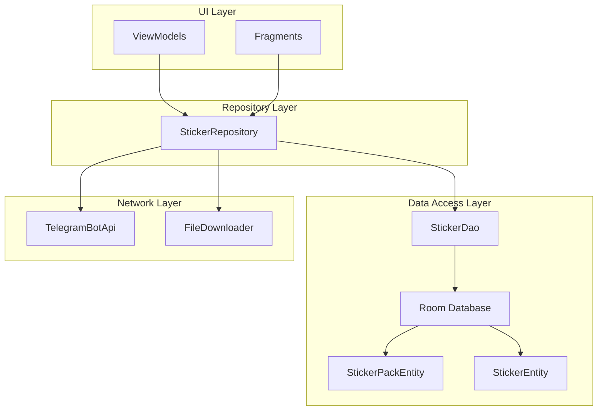
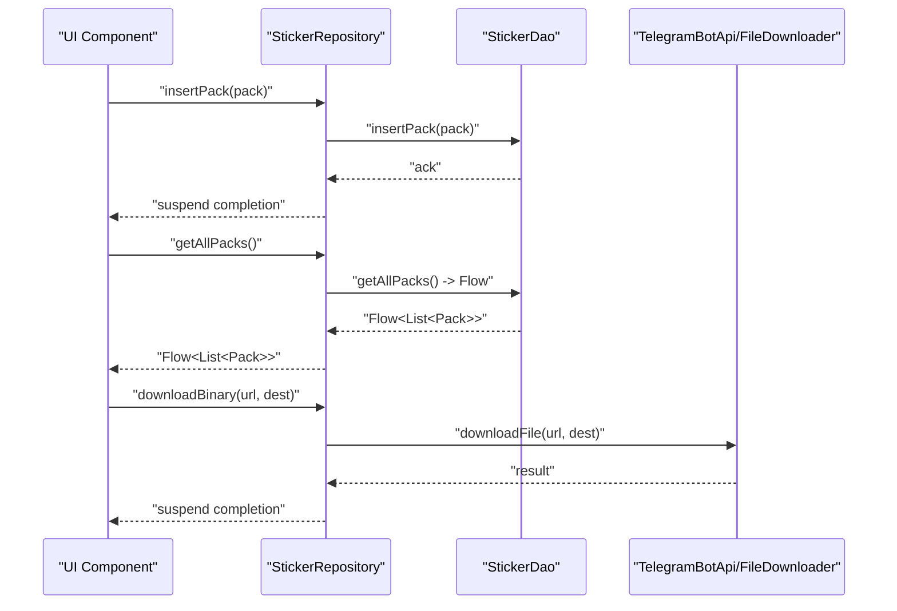
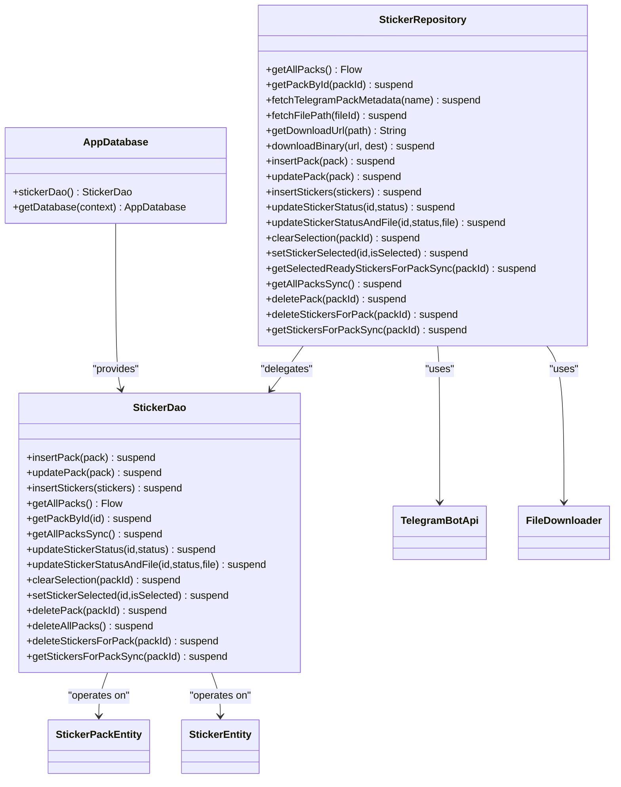

# Repository Interfaces

<cite>
**Referenced Files in This Document**
- [AppDatabase.kt](file://app/src/main/java/com/maheshsharan/tel2what/data/local/AppDatabase.kt)
- [StickerRepository.kt](file://app/src/main/java/com/maheshsharan/tel2what/data/repository/StickerRepository.kt)
- [StickerDao.kt](file://app/src/main/java/com/maheshsharan/tel2what/data/local/dao/StickerDao.kt)
- [StickerEntity.kt](file://app/src/main/java/com/maheshsharan/tel2what/data/local/entity/StickerEntity.kt)
- [StickerPackEntity.kt](file://app/src/main/java/com/maheshsharan/tel2what/data/local/entity/StickerPackEntity.kt)
- [TelegramBotApi.kt](file://app/src/main/java/com/maheshsharan/tel2what/data/network/TelegramBotApi.kt)
- [FileDownloader.kt](file://app/src/main/java/com/maheshsharan/tel2what/data/network/FileDownloader.kt)
</cite>

## Table of Contents
1. [Introduction](#introduction)
2. [Project Structure](#project-structure)
3. [Core Components](#core-components)
4. [Architecture Overview](#architecture-overview)
5. [Detailed Component Analysis](#detailed-component-analysis)
6. [Dependency Analysis](#dependency-analysis)
7. [Performance Considerations](#performance-considerations)
8. [Troubleshooting Guide](#troubleshooting-guide)
9. [Conclusion](#conclusion)

## Introduction
This document explains the repository pattern interfaces used in Tel2What, focusing on the StickerRepository class and its integration with Room database entities and DAOs. It covers the repository’s responsibilities for abstracting data access from UI components, providing clean asynchronous APIs for the conversion engine, and managing transactions and caching strategies. It also documents method signatures, parameter specifications, return types, coroutine-based async patterns, error propagation mechanisms, and data validation rules.

## Project Structure
The repository pattern is implemented with a clear separation of concerns:
- Data access layer: Room database with entities and DAO
- Repository layer: StickerRepository orchestrating DAO and network operations
- Network layer: TelegramBotApi and FileDownloader for external resources
- UI layer: ViewModels and fragments consuming repository APIs

**Diagram sources**
- [StickerRepository.kt](file://app/src/main/java/com/maheshsharan/tel2what/data/repository/StickerRepository.kt#L10-L79)
- [StickerDao.kt](file://app/src/main/java/com/maheshsharan/tel2what/data/local/dao/StickerDao.kt#L13-L80)
- [AppDatabase.kt](file://app/src/main/java/com/maheshsharan/tel2what/data/local/AppDatabase.kt#L13-L41)
- [StickerPackEntity.kt](file://app/src/main/java/com/maheshsharan/tel2what/data/local/entity/StickerPackEntity.kt#L6-L21)
- [StickerEntity.kt](file://app/src/main/java/com/maheshsharan/tel2what/data/local/entity/StickerEntity.kt#L8-L28)
- [TelegramBotApi.kt](file://app/src/main/java/com/maheshsharan/tel2what/data/network/TelegramBotApi.kt)
- [FileDownloader.kt](file://app/src/main/java/com/maheshsharan/tel2what/data/network/FileDownloader.kt)

**Section sources**
- [AppDatabase.kt](file://app/src/main/java/com/maheshsharan/tel2what/data/local/AppDatabase.kt#L13-L41)
- [StickerRepository.kt](file://app/src/main/java/com/maheshsharan/tel2what/data/repository/StickerRepository.kt#L10-L79)

## Core Components
- StickerRepository: Central interface for all sticker pack and sticker operations. Exposes suspend functions for asynchronous work and Flow for reactive lists. Delegates to StickerDao for persistence and integrates TelegramBotApi and FileDownloader for remote metadata and binary downloads.
- StickerDao: Room DAO defining CRUD and query operations for sticker packs and stickers, including blocking variants for ContentProvider compatibility and transactional updates.
- AppDatabase: Room database definition with entities, migration support, and singleton creation.
- Entities: StickerPackEntity and StickerEntity define the schema and relationships, including foreign keys and indices.

Key responsibilities:
- Abstraction of data access from UI components
- Transaction-safe updates via DAO
- Reactive streams for pack lists
- Synchronous and asynchronous APIs for different consumers
- Validation and constraints enforced by Room and repository logic

**Section sources**
- [StickerRepository.kt](file://app/src/main/java/com/maheshsharan/tel2what/data/repository/StickerRepository.kt#L10-L79)
- [StickerDao.kt](file://app/src/main/java/com/maheshsharan/tel2what/data/local/dao/StickerDao.kt#L13-L80)
- [AppDatabase.kt](file://app/src/main/java/com/maheshsharan/tel2what/data/local/AppDatabase.kt#L13-L41)
- [StickerPackEntity.kt](file://app/src/main/java/com/maheshsharan/tel2what/data/local/entity/StickerPackEntity.kt#L6-L21)
- [StickerEntity.kt](file://app/src/main/java/com/maheshsharan/tel2what/data/local/entity/StickerEntity.kt#L8-L28)

## Architecture Overview
The repository pattern isolates UI from data sources. UI components observe Flow emissions and call suspend functions for mutations. The repository encapsulates:
- Room DAO calls for persistence
- Network calls for metadata and binary downloads
- Status transitions and selection flags for stickers
- Transactions and cascading deletes for pack and sticker relationships

**Diagram sources**
- [StickerRepository.kt](file://app/src/main/java/com/maheshsharan/tel2what/data/repository/StickerRepository.kt#L16-L30)
- [StickerDao.kt](file://app/src/main/java/com/maheshsharan/tel2what/data/local/dao/StickerDao.kt#L27-L34)
- [TelegramBotApi.kt](file://app/src/main/java/com/maheshsharan/tel2what/data/network/TelegramBotApi.kt)
- [FileDownloader.kt](file://app/src/main/java/com/maheshsharan/tel2what/data/network/FileDownloader.kt)

## Detailed Component Analysis

### StickerRepository
Responsibilities:
- Provide reactive and synchronous queries for sticker packs
- Insert/update/delete sticker packs
- Insert stickers and update sticker status and selection
- Clear selections and manage ready sticker retrieval per pack
- Fetch Telegram metadata and download binaries
- Delegate to DAO for persistence and to network clients for remote resources

Method categories and characteristics:
- Queries returning Flow for UI observation
  - getAllPacks(): Flow<List<StickerPackEntity>>
- Queries returning suspend functions for single results
  - getPackById(packId: String): suspend StickerPackEntity?
  - getAllPacksSync(): suspend List<StickerPackEntity>
  - getStickersForPackSync(packId: String): suspend List<StickerEntity>
  - getSelectedReadyStickersForPackSync(packId: String): suspend List<StickerEntity>
- Mutations and inserts
  - insertPack(pack: StickerPackEntity): suspend
  - updatePack(pack: StickerPackEntity): suspend
  - insertStickers(stickers: List<StickerEntity>): suspend LongArray
- Sticker status and selection
  - updateStickerStatus(stickerId: Long, status: String): suspend
  - updateStickerStatusAndFile(stickerId: Long, status: String, imageFile: String): suspend
  - clearSelection(packId: String): suspend
  - setStickerSelected(stickerId: Long, isSelected: Boolean): suspend
- Deletions
  - deletePack(packId: String): suspend
  - deleteStickersForPack(packId: String): suspend

Coroutine and async patterns:
- All repository methods are suspend functions except getAllPacks(), which returns Flow for cold, reactive streams.
- Repository delegates to DAO and network clients using suspend calls, enabling structured concurrency and cancellation.

Error propagation:
- Repository methods propagate exceptions thrown by DAO or network clients. Callers should handle Result or catch exceptions appropriately.

Caching and data validation:
- Room enforces primary keys and foreign keys; cascading deletes maintain referential integrity.
- StickerEntity includes an index on packId for efficient joins and queries.
- Status field in StickerEntity defines discrete states for lifecycle management.

Usage examples in UI contexts:
- Home screen observes getAllPacks() Flow to render recent sticker packs.
- Import flow calls fetchTelegramPackMetadata() and downloadBinary() to populate packs and stickers.
- Conversion engine uses getSelectedReadyStickersForPackSync() to process READY stickers.

**Section sources**
- [StickerRepository.kt](file://app/src/main/java/com/maheshsharan/tel2what/data/repository/StickerRepository.kt#L16-L79)

### StickerDao
Responsibilities:
- Define Room operations for StickerPackEntity and StickerEntity
- Provide Flow emission for reactive lists
- Offer blocking variants for ContentProvider compatibility
- Enforce safe updates and cascading deletes

Key operations:
- Packs
  - insertPack(pack: StickerPackEntity): suspend
  - updatePack(pack: StickerPackEntity): suspend
  - getAllPacks(): Flow<List<StickerPackEntity>>
  - getPackById(packId: String): suspend StickerPackEntity?
  - getAllPacksSync(): suspend List<StickerPackEntity>
  - deletePack(packId: String): suspend
  - deleteAllPacks(): suspend
- Stickers
  - insertStickers(stickers: List<StickerEntity>): suspend LongArray
  - updateStickerStatus(stickerId: Long, status: String): suspend
  - updateStickerStatusAndFile(stickerId: Long, status: String, imageFile: String): suspend
  - clearSelection(packId: String): suspend
  - setStickerSelected(stickerId: Long, isSelected: Boolean): suspend
  - deleteStickersForPack(packId: String): suspend
  - getStickersForPackSync(packId: String): suspend List<StickerEntity>

Transactions and integrity:
- Foreign key cascade ensures stickers are deleted when a pack is removed.
- Safe update strategy avoids triggering cascade during updates to existing rows.

**Section sources**
- [StickerDao.kt](file://app/src/main/java/com/maheshsharan/tel2what/data/local/dao/StickerDao.kt#L13-L80)

### AppDatabase
Responsibilities:
- Define Room entities and version
- Provide DAO access
- Manage migrations and singleton instantiation

Highlights:
- Entities: StickerPackEntity and StickerEntity
- Migration 1 → 2 adds isSelected column to stickers table
- Singleton database builder with thread-safety

**Section sources**
- [AppDatabase.kt](file://app/src/main/java/com/maheshsharan/tel2what/data/local/AppDatabase.kt#L13-L41)

### Entities
- StickerPackEntity
  - Primary key: identifier
  - Fields include metadata such as name, publisher, tray image, animated flag, and timestamps
- StickerEntity
  - Primary key: id (auto-generated)
  - Foreign key: packId referencing StickerPackEntity.identifier
  - Indices: packId for efficient queries
  - Fields include imageFile, emojis, accessibilityText, status, and isSelected
  - Status values: DOWNLOADING, CONVERTING, READY, FAILED

Relationships:
- One-to-many: StickerPackEntity to StickerEntity via packId

**Section sources**
- [StickerPackEntity.kt](file://app/src/main/java/com/maheshsharan/tel2what/data/local/entity/StickerPackEntity.kt#L6-L21)
- [StickerEntity.kt](file://app/src/main/java/com/maheshsharan/tel2what/data/local/entity/StickerEntity.kt#L8-L28)

### Network Integration
- TelegramBotApi
  - fetchTelegramPackMetadata(packName: String): suspend Result<TelegramStickerSet>
  - fetchFilePath(fileId: String): suspend Result<String>
  - getDownloadUrl(filePath: String): String
- FileDownloader
  - downloadBinary(url: String, destFile: File): suspend Unit

Integration points:
- StickerRepository delegates to TelegramBotApi for metadata and file path resolution.
- StickerRepository delegates to FileDownloader for downloading binaries to disk.

**Section sources**
- [StickerRepository.kt](file://app/src/main/java/com/maheshsharan/tel2what/data/repository/StickerRepository.kt#L24-L30)
- [TelegramBotApi.kt](file://app/src/main/java/com/maheshsharan/tel2what/data/network/TelegramBotApi.kt)
- [FileDownloader.kt](file://app/src/main/java/com/maheshsharan/tel2what/data/network/FileDownloader.kt)

## Dependency Analysis

**Diagram sources**
- [StickerRepository.kt](file://app/src/main/java/com/maheshsharan/tel2what/data/repository/StickerRepository.kt#L10-L79)
- [StickerDao.kt](file://app/src/main/java/com/maheshsharan/tel2what/data/local/dao/StickerDao.kt#L13-L80)
- [AppDatabase.kt](file://app/src/main/java/com/maheshsharan/tel2what/data/local/AppDatabase.kt#L13-L41)
- [StickerPackEntity.kt](file://app/src/main/java/com/maheshsharan/tel2what/data/local/entity/StickerPackEntity.kt#L6-L21)
- [StickerEntity.kt](file://app/src/main/java/com/maheshsharan/tel2what/data/local/entity/StickerEntity.kt#L8-L28)

**Section sources**
- [StickerRepository.kt](file://app/src/main/java/com/maheshsharan/tel2what/data/repository/StickerRepository.kt#L10-L79)
- [StickerDao.kt](file://app/src/main/java/com/maheshsharan/tel2what/data/local/dao/StickerDao.kt#L13-L80)
- [AppDatabase.kt](file://app/src/main/java/com/maheshsharan/tel2what/data/local/AppDatabase.kt#L13-L41)

## Performance Considerations
- Reactive queries: Use Flow for observing pack lists to avoid unnecessary recomputation and to integrate smoothly with UI lifecycle.
- Batch operations: insertStickers(List<StickerEntity>) returns LongArray to efficiently handle bulk inserts.
- Indexing: StickerEntity packId index improves join and filtering performance for pack-specific queries.
- Foreign key cascade: Cascading deletes ensure referential integrity without manual cleanup overhead.
- Concurrency: Repository methods are suspend; callers should leverage structured concurrency and cancellation to prevent resource leaks.
- Network I/O: Offload network calls to background threads; repository methods are suspend so they can be called from Dispatchers.IO or appropriate scopes.

[No sources needed since this section provides general guidance]

## Troubleshooting Guide
Common issues and resolutions:
- Flow not emitting updates
  - Verify that repository’s getAllPacks() is observed on the correct lifecycle owner and that DAO emits changes.
- Sticker status not updating
  - Ensure updateStickerStatus or updateStickerStatusAndFile is invoked with correct stickerId and valid status values.
- Stickers not cleared after pack deletion
  - Confirm that deletePack triggers cascading delete; verify foreign key configuration.
- Network failures during download
  - Check Result handling around fetchTelegramPackMetadata and downloadBinary; ensure proper error propagation to UI.
- Selection flags not resetting
  - Use clearSelection(packId) before importing a new pack to reset previous selections.

**Section sources**
- [StickerRepository.kt](file://app/src/main/java/com/maheshsharan/tel2what/data/repository/StickerRepository.kt#L24-L30)
- [StickerDao.kt](file://app/src/main/java/com/maheshsharan/tel2what/data/local/dao/StickerDao.kt#L60-L79)
- [StickerEntity.kt](file://app/src/main/java/com/maheshsharan/tel2what/data/local/entity/StickerEntity.kt#L8-L28)

## Conclusion
The StickerRepository provides a cohesive abstraction over Room and network layers, exposing clean, coroutine-based APIs for UI components and the conversion engine. Its design emphasizes reactive streams for observation, safe DAO operations for persistence, and explicit status and selection management for stickers. By leveraging Room’s foreign keys and migrations, and by delegating network tasks to dedicated clients, the repository maintains separation of concerns while ensuring data integrity and performance.