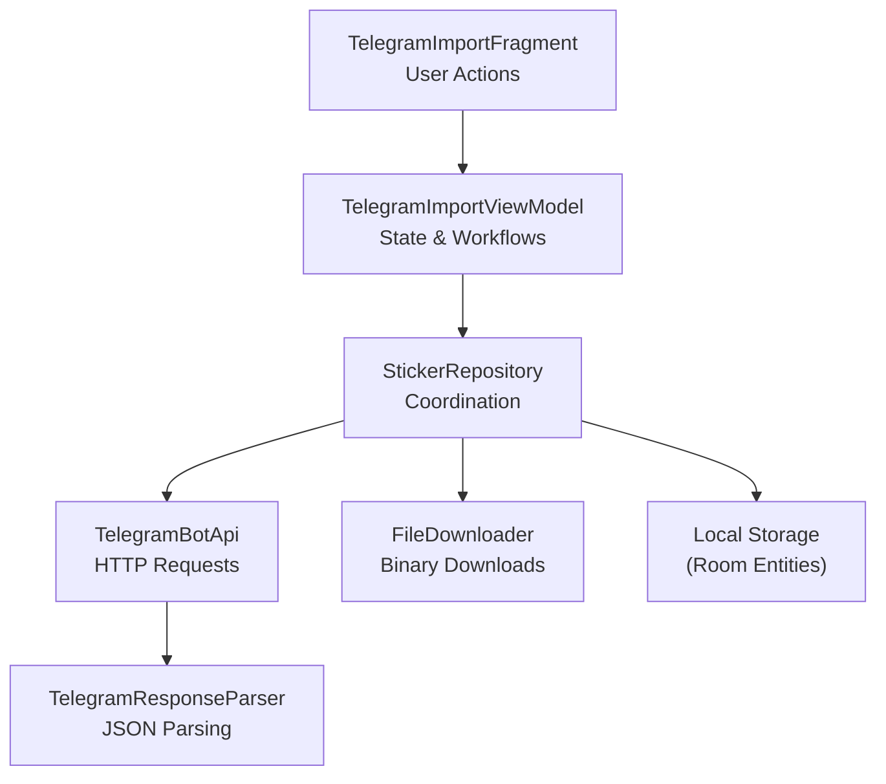
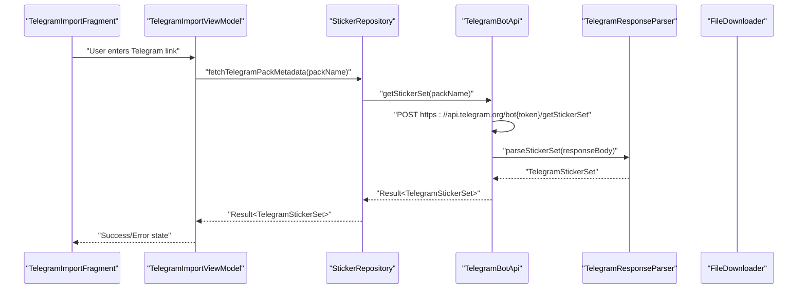
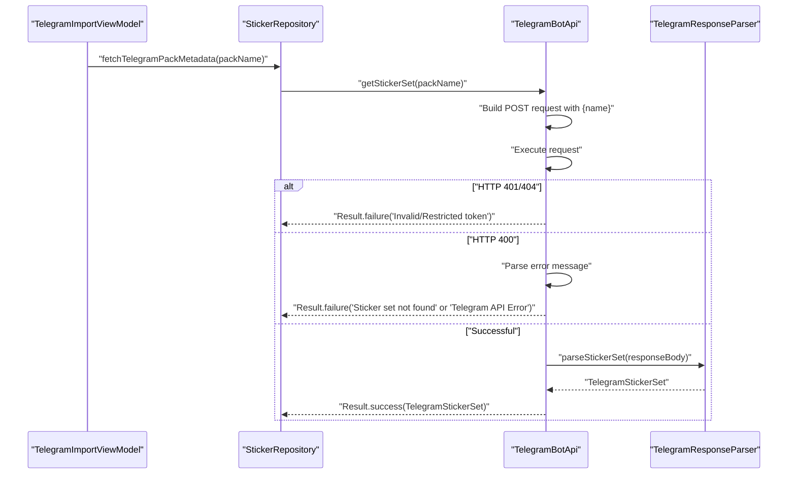
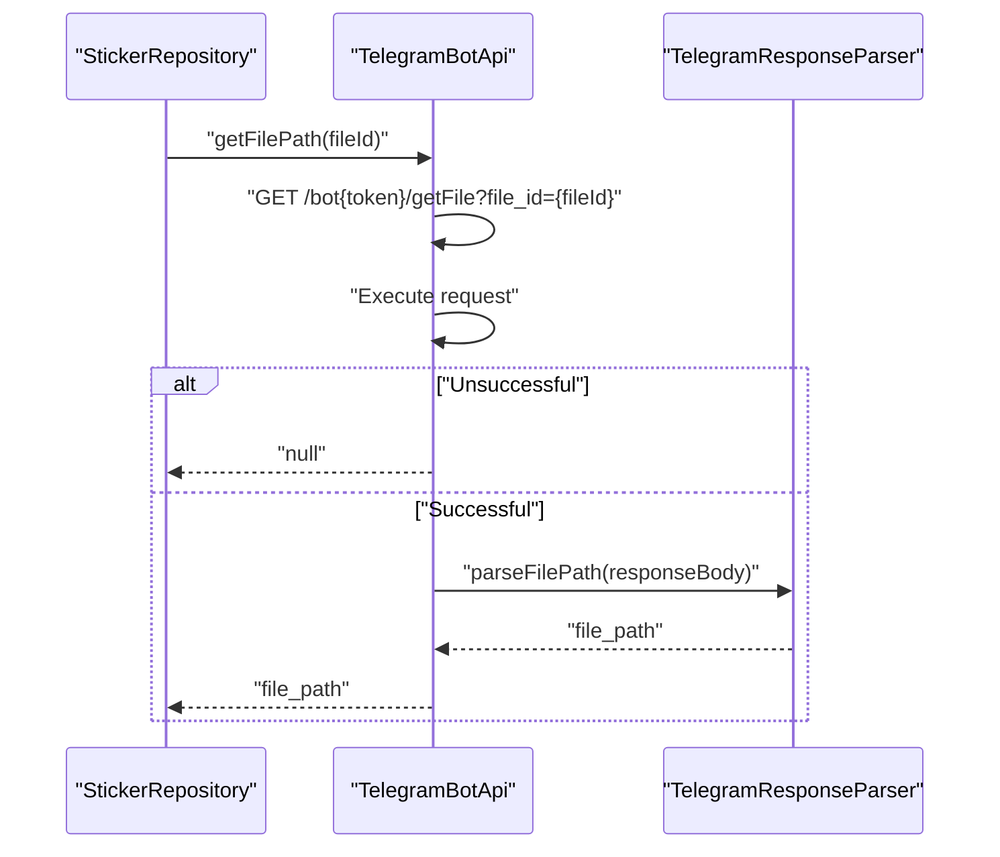
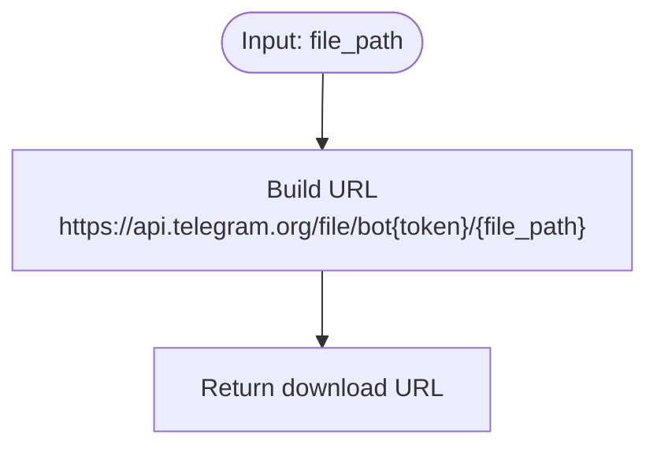
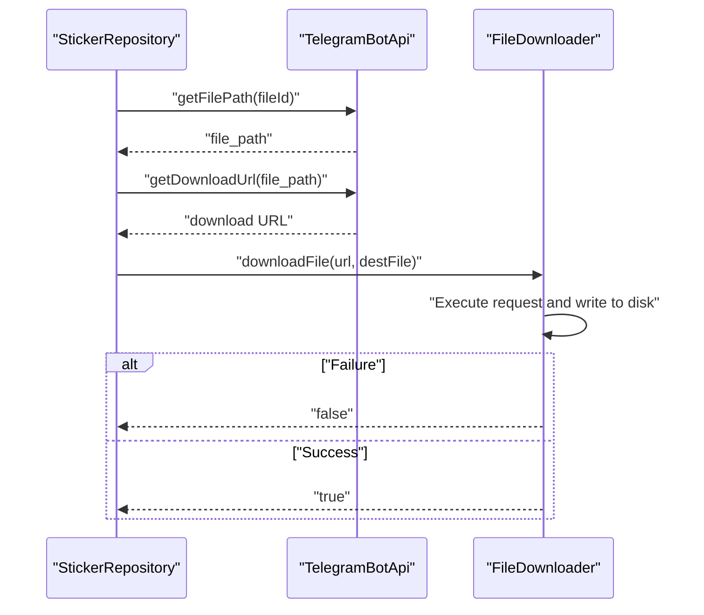
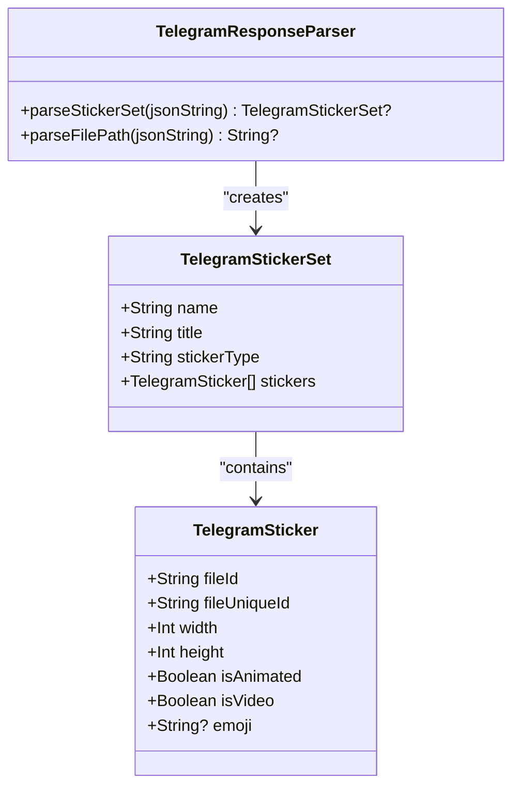
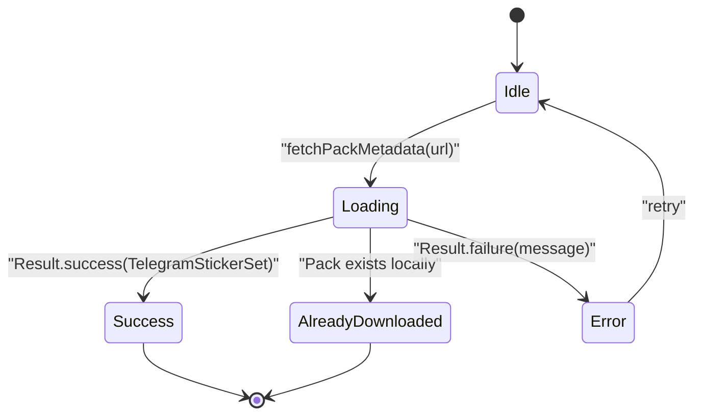
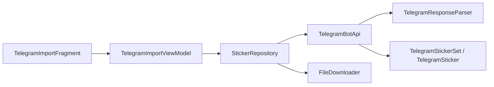
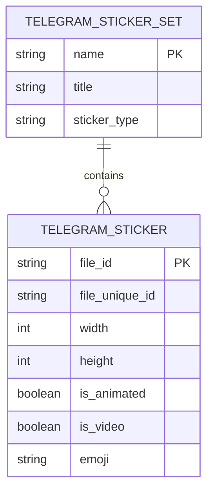

# Telegram Bot API

<cite>
**Referenced Files in This Document**
- [TelegramBotApi.kt](file://app/src/main/java/com/maheshsharan/tel2what/data/network/TelegramBotApi.kt)
- [TelegramModels.kt](file://app/src/main/java/com/maheshsharan/tel2what/data/network/model/TelegramModels.kt)
- [FileDownloader.kt](file://app/src/main/java/com/maheshsharan/tel2what/data/network/FileDownloader.kt)
- [StickerRepository.kt](file://app/src/main/java/com/maheshsharan/tel2what/data/repository/StickerRepository.kt)
- [TelegramImportViewModel.kt](file://app/src/main/java/com/maheshsharan/tel2what/ui/importpack/TelegramImportViewModel.kt)
- [TelegramImportFragment.kt](file://app/src/main/java/com/maheshsharan/tel2what/ui/importpack/TelegramImportFragment.kt)
</cite>

## Table of Contents
1. [Introduction](#introduction)
2. [Project Structure](#project-structure)
3. [Core Components](#core-components)
4. [Architecture Overview](#architecture-overview)
5. [Detailed Component Analysis](#detailed-component-analysis)
6. [Dependency Analysis](#dependency-analysis)
7. [Performance Considerations](#performance-considerations)
8. [Troubleshooting Guide](#troubleshooting-guide)
9. [Conclusion](#conclusion)
10. [Appendices](#appendices)

## Introduction
This document provides comprehensive API documentation for the Telegram Bot API integration used by the application. It focuses on:
- Fetching sticker pack metadata via getStickerSet
- Resolving file paths via getFilePath
- Constructing download URLs via getDownloadUrl
- Downloading sticker files using the FileDownloader
- Parsing JSON responses with TelegramResponseParser
- Handling errors for HTTP 401, 404, and 400 status codes
- Practical usage patterns for fetching metadata, handling network errors, and downloading files
- Rate limiting, token management, and offline fallback strategies

## Project Structure
The Telegram Bot API integration is organized around a small set of cohesive components:
- Network layer: TelegramBotApi for HTTP requests and TelegramResponseParser for JSON parsing
- Repository: StickerRepository orchestrating network and persistence
- UI layer: TelegramImportViewModel and TelegramImportFragment coordinating user actions and state
- File handling: FileDownloader for binary downloads

**Diagram sources**
- [TelegramImportFragment.kt](file://app/src/main/java/com/maheshsharan/tel2what/ui/importpack/TelegramImportFragment.kt#L25-L154)
- [TelegramImportViewModel.kt](file://app/src/main/java/com/maheshsharan/tel2what/ui/importpack/TelegramImportViewModel.kt#L25-L105)
- [StickerRepository.kt](file://app/src/main/java/com/maheshsharan/tel2what/data/repository/StickerRepository.kt#L10-L80)
- [TelegramBotApi.kt](file://app/src/main/java/com/maheshsharan/tel2what/data/network/TelegramBotApi.kt#L14-L112)
- [TelegramModels.kt](file://app/src/main/java/com/maheshsharan/tel2what/data/network/model/TelegramModels.kt#L22-L74)
- [FileDownloader.kt](file://app/src/main/java/com/maheshsharan/tel2what/data/network/FileDownloader.kt#L11-L77)

**Section sources**
- [TelegramBotApi.kt](file://app/src/main/java/com/maheshsharan/tel2what/data/network/TelegramBotApi.kt#L14-L112)
- [TelegramModels.kt](file://app/src/main/java/com/maheshsharan/tel2what/data/network/model/TelegramModels.kt#L1-L74)
- [FileDownloader.kt](file://app/src/main/java/com/maheshsharan/tel2what/data/network/FileDownloader.kt#L11-L77)
- [StickerRepository.kt](file://app/src/main/java/com/maheshsharan/tel2what/data/repository/StickerRepository.kt#L10-L80)
- [TelegramImportViewModel.kt](file://app/src/main/java/com/maheshsharan/tel2what/ui/importpack/TelegramImportViewModel.kt#L25-L105)
- [TelegramImportFragment.kt](file://app/src/main/java/com/maheshsharan/tel2what/ui/importpack/TelegramImportFragment.kt#L25-L154)

## Core Components
- TelegramBotApi: Implements getStickerSet, getFilePath, and getDownloadUrl with robust error handling and JSON parsing via TelegramResponseParser.
- TelegramResponseParser: Provides parseStickerSet and parseFilePath to transform Telegram API JSON responses into domain models.
- TelegramSticker and TelegramStickerSet: Data models representing individual stickers and a sticker set.
- StickerRepository: Coordinates network calls and file downloads, exposes convenience methods for consumers.
- FileDownloader: Handles binary downloads with logging, cleanup, and content-length awareness.
- UI Layer: TelegramImportViewModel and TelegramImportFragment manage user input, state transitions, and navigation.

**Section sources**
- [TelegramBotApi.kt](file://app/src/main/java/com/maheshsharan/tel2what/data/network/TelegramBotApi.kt#L14-L112)
- [TelegramModels.kt](file://app/src/main/java/com/maheshsharan/tel2what/data/network/model/TelegramModels.kt#L5-L74)
- [FileDownloader.kt](file://app/src/main/java/com/maheshsharan/tel2what/data/network/FileDownloader.kt#L11-L77)
- [StickerRepository.kt](file://app/src/main/java/com/maheshsharan/tel2what/data/repository/StickerRepository.kt#L10-L80)
- [TelegramImportViewModel.kt](file://app/src/main/java/com/maheshsharan/tel2what/ui/importpack/TelegramImportViewModel.kt#L13-L105)
- [TelegramImportFragment.kt](file://app/src/main/java/com/maheshsharan/tel2what/ui/importpack/TelegramImportFragment.kt#L25-L154)

## Architecture Overview
The integration follows a layered architecture:
- Presentation: UI fragments and view models
- Domain: Repository coordinating network and persistence
- Network: TelegramBotApi and FileDownloader
- Data: TelegramResponseParser and domain models

**Diagram sources**
- [TelegramImportFragment.kt](file://app/src/main/java/com/maheshsharan/tel2what/ui/importpack/TelegramImportFragment.kt#L94-L151)
- [TelegramImportViewModel.kt](file://app/src/main/java/com/maheshsharan/tel2what/ui/importpack/TelegramImportViewModel.kt#L30-L66)
- [StickerRepository.kt](file://app/src/main/java/com/maheshsharan/tel2what/data/repository/StickerRepository.kt#L24-L24)
- [TelegramBotApi.kt](file://app/src/main/java/com/maheshsharan/tel2what/data/network/TelegramBotApi.kt#L22-L73)
- [TelegramModels.kt](file://app/src/main/java/com/maheshsharan/tel2what/data/network/model/TelegramModels.kt#L22-L60)

## Detailed Component Analysis

### getStickerSet Endpoint
- Purpose: Retrieve metadata for a Telegram sticker pack by its name.
- Authentication: Uses a hardcoded bot token embedded in the client.
- Request
  - Method: POST
  - Endpoint: https://api.telegram.org/bot{token}/getStickerSet
  - Body: JSON containing the pack name field
- Response
  - Success: Parsed TelegramStickerSet
  - Errors handled:
    - HTTP 401 Unauthorized: Invalid or missing token
    - HTTP 404 Not Found: Endpoint not found or invalid token path
    - HTTP 400 Bad Request: Sticker set not found or other API errors
    - Network failures: Unknown host, timeouts, and generic exceptions
- Error Handling
  - Returns Result<TelegramStickerSet>, converting failures into descriptive messages
  - Distinguishes between token errors, not found conditions, and general API errors

**Diagram sources**
- [TelegramBotApi.kt](file://app/src/main/java/com/maheshsharan/tel2what/data/network/TelegramBotApi.kt#L22-L73)
- [TelegramModels.kt](file://app/src/main/java/com/maheshsharan/tel2what/data/network/model/TelegramModels.kt#L22-L60)
- [StickerRepository.kt](file://app/src/main/java/com/maheshsharan/tel2what/data/repository/StickerRepository.kt#L24-L24)

**Section sources**
- [TelegramBotApi.kt](file://app/src/main/java/com/maheshsharan/tel2what/data/network/TelegramBotApi.kt#L22-L73)
- [TelegramModels.kt](file://app/src/main/java/com/maheshsharan/tel2what/data/network/model/TelegramModels.kt#L15-L20)

### getFilePath Endpoint
- Purpose: Resolve a file path for a given Telegram file ID.
- Authentication: Uses the same bot token.
- Request
  - Method: GET
  - Endpoint: https://api.telegram.org/bot{token}/getFile?file_id={fileId}
- Response
  - Success: Returns file_path extracted from the response
  - Failure: Returns null and logs the error
- Error Handling
  - Non-success responses return null
  - Exceptions are caught and logged

**Diagram sources**
- [TelegramBotApi.kt](file://app/src/main/java/com/maheshsharan/tel2what/data/network/TelegramBotApi.kt#L75-L106)
- [TelegramModels.kt](file://app/src/main/java/com/maheshsharan/tel2what/data/network/model/TelegramModels.kt#L62-L73)
- [StickerRepository.kt](file://app/src/main/java/com/maheshsharan/tel2what/data/repository/StickerRepository.kt#L26-L26)

**Section sources**
- [TelegramBotApi.kt](file://app/src/main/java/com/maheshsharan/tel2what/data/network/TelegramBotApi.kt#L75-L106)
- [TelegramModels.kt](file://app/src/main/java/com/maheshsharan/tel2what/data/network/model/TelegramModels.kt#L62-L73)

### getDownloadUrl Method
- Purpose: Construct a direct download URL for a Telegram file using the resolved file_path.
- Input: file_path returned by getFilePath
- Output: URL string pointing to https://api.telegram.org/file/bot{token}/{file_path}

**Diagram sources**
- [TelegramBotApi.kt](file://app/src/main/java/com/maheshsharan/tel2what/data/network/TelegramBotApi.kt#L108-L110)

**Section sources**
- [TelegramBotApi.kt](file://app/src/main/java/com/maheshsharan/tel2what/data/network/TelegramBotApi.kt#L108-L110)

### File Download Workflow
- Steps
  - Resolve file_path via getFilePath
  - Construct download URL via getDownloadUrl
  - Download binary content via FileDownloader
- Error Handling
  - Non-success responses return false
  - Exceptions trigger cleanup of partial files

**Diagram sources**
- [StickerRepository.kt](file://app/src/main/java/com/maheshsharan/tel2what/data/repository/StickerRepository.kt#L26-L30)
- [TelegramBotApi.kt](file://app/src/main/java/com/maheshsharan/tel2what/data/network/TelegramBotApi.kt#L75-L110)
- [FileDownloader.kt](file://app/src/main/java/com/maheshsharan/tel2what/data/network/FileDownloader.kt#L21-L77)

**Section sources**
- [StickerRepository.kt](file://app/src/main/java/com/maheshsharan/tel2what/data/repository/StickerRepository.kt#L26-L30)
- [FileDownloader.kt](file://app/src/main/java/com/maheshsharan/tel2what/data/network/FileDownloader.kt#L21-L77)

### TelegramResponseParser Utility Functions
- parseStickerSet(jsonString)
  - Parses the Telegram getStickerSet response into TelegramStickerSet
  - Extracts name, title, sticker_type, and a list of TelegramSticker entries
  - Returns null on parse failure
- parseFilePath(jsonString)
  - Parses the Telegram getFile response to extract file_path
  - Returns null on parse failure

**Diagram sources**
- [TelegramModels.kt](file://app/src/main/java/com/maheshsharan/tel2what/data/network/model/TelegramModels.kt#L22-L74)

**Section sources**
- [TelegramModels.kt](file://app/src/main/java/com/maheshsharan/tel2what/data/network/model/TelegramModels.kt#L22-L74)

### UI Integration and State Management
- TelegramImportViewModel
  - Extracts pack name from user-provided URL
  - Checks local cache before fetching
  - Emits loading, success, already downloaded, and error states
- TelegramImportFragment
  - Handles user input, clipboard paste, and state-driven UI updates
  - Navigates to download/conversion flows upon success

**Diagram sources**
- [TelegramImportViewModel.kt](file://app/src/main/java/com/maheshsharan/tel2what/ui/importpack/TelegramImportViewModel.kt#L13-L23)
- [TelegramImportViewModel.kt](file://app/src/main/java/com/maheshsharan/tel2what/ui/importpack/TelegramImportViewModel.kt#L30-L66)
- [TelegramImportFragment.kt](file://app/src/main/java/com/maheshsharan/tel2what/ui/importpack/TelegramImportFragment.kt#L102-L149)

**Section sources**
- [TelegramImportViewModel.kt](file://app/src/main/java/com/maheshsharan/tel2what/ui/importpack/TelegramImportViewModel.kt#L25-L105)
- [TelegramImportFragment.kt](file://app/src/main/java/com/maheshsharan/tel2what/ui/importpack/TelegramImportFragment.kt#L25-L154)

## Dependency Analysis
- TelegramBotApi depends on:
  - OkHttp client for HTTP requests
  - TelegramResponseParser for JSON parsing
  - TelegramStickerSet and TelegramSticker for data models
- StickerRepository depends on:
  - TelegramBotApi for network operations
  - FileDownloader for binary downloads
- UI components depend on:
  - StickerRepository for orchestration
  - Local Room entities for persistence

**Diagram sources**
- [TelegramBotApi.kt](file://app/src/main/java/com/maheshsharan/tel2what/data/network/TelegramBotApi.kt#L4-L5)
- [TelegramModels.kt](file://app/src/main/java/com/maheshsharan/tel2what/data/network/model/TelegramModels.kt#L15-L20)
- [StickerRepository.kt](file://app/src/main/java/com/maheshsharan/tel2what/data/repository/StickerRepository.kt#L10-L14)
- [TelegramImportViewModel.kt](file://app/src/main/java/com/maheshsharan/tel2what/ui/importpack/TelegramImportViewModel.kt#L25-L25)
- [TelegramImportFragment.kt](file://app/src/main/java/com/maheshsharan/tel2what/ui/importpack/TelegramImportFragment.kt#L34-L36)

**Section sources**
- [TelegramBotApi.kt](file://app/src/main/java/com/maheshsharan/tel2what/data/network/TelegramBotApi.kt#L4-L5)
- [StickerRepository.kt](file://app/src/main/java/com/maheshsharan/tel2what/data/repository/StickerRepository.kt#L10-L14)

## Performance Considerations
- Concurrency: Network calls are executed on Dispatchers.IO to avoid blocking the main thread.
- Content-Length Awareness: FileDownloader reads contentLength and streams bytes efficiently.
- Logging: Extensive logging aids performance diagnostics and error tracing.
- Offline Fallback: UI checks local cache before hitting the network to reduce redundant requests.

[No sources needed since this section provides general guidance]

## Troubleshooting Guide
Common issues and resolutions:
- HTTP 401 Unauthorized
  - Cause: Invalid or missing bot token
  - Resolution: Replace the hardcoded token with a valid one configured externally
- HTTP 404 Not Found
  - Cause: Endpoint mismatch or invalid token path
  - Resolution: Verify token validity and endpoint correctness
- HTTP 400 Bad Request
  - Cause: Sticker set not found or malformed request
  - Resolution: Confirm the pack name is correct and publicly accessible
- Network Failures
  - Cause: No internet connection or timeouts
  - Resolution: Retry after checking connectivity; handle UnknownHostException gracefully
- Parsing Failures
  - Cause: Unexpected JSON structure
  - Resolution: TelegramResponseParser returns null; callers should handle null results

**Section sources**
- [TelegramBotApi.kt](file://app/src/main/java/com/maheshsharan/tel2what/data/network/TelegramBotApi.kt#L36-L57)
- [TelegramBotApi.kt](file://app/src/main/java/com/maheshsharan/tel2what/data/network/TelegramBotApi.kt#L67-L72)
- [TelegramModels.kt](file://app/src/main/java/com/maheshsharan/tel2what/data/network/model/TelegramModels.kt#L24-L59)

## Conclusion
The Telegram Bot API integration provides a clean separation of concerns:
- TelegramBotApi encapsulates HTTP requests and error handling
- TelegramResponseParser centralizes JSON parsing
- StickerRepository coordinates network and persistence
- UI components manage user interactions and state transitions
Adhering to the documented endpoints, error handling, and offline strategies ensures reliable sticker pack retrieval and file downloads.

[No sources needed since this section summarizes without analyzing specific files]

## Appendices

### API Definitions

- getStickerSet
  - Method: POST
  - Endpoint: https://api.telegram.org/bot{token}/getStickerSet
  - Request Body: {"name": "<packName>"}
  - Success Response: TelegramStickerSet
  - Error Codes: 400 (Bad Request), 401 (Unauthorized), 404 (Not Found)
  - Notes: Returns Result<TelegramStickerSet>; handle failure messages for token and not-found scenarios

- getFilePath
  - Method: GET
  - Endpoint: https://api.telegram.org/bot{token}/getFile?file_id={fileId}
  - Success Response: {"ok": true, "result": {"file_path": "..."}}
  - Error Codes: Non-2xx responses return null
  - Notes: Used to resolve file_path for subsequent download URL construction

- getDownloadUrl
  - Input: file_path
  - Output: "https://api.telegram.org/file/bot{token}/{file_path}"

**Section sources**
- [TelegramBotApi.kt](file://app/src/main/java/com/maheshsharan/tel2what/data/network/TelegramBotApi.kt#L22-L110)
- [TelegramModels.kt](file://app/src/main/java/com/maheshsharan/tel2what/data/network/model/TelegramModels.kt#L15-L20)

### Data Models

**Diagram sources**
- [TelegramModels.kt](file://app/src/main/java/com/maheshsharan/tel2what/data/network/model/TelegramModels.kt#L5-L20)

### Practical Usage Examples (Paths)
- Fetch sticker metadata
  - ViewModel: [TelegramImportViewModel.kt](file://app/src/main/java/com/maheshsharan/tel2what/ui/importpack/TelegramImportViewModel.kt#L30-L66)
  - Repository: [StickerRepository.kt](file://app/src/main/java/com/maheshsharan/tel2what/data/repository/StickerRepository.kt#L24-L24)
  - API: [TelegramBotApi.kt](file://app/src/main/java/com/maheshsharan/tel2what/data/network/TelegramBotApi.kt#L22-L73)
- Handle network errors
  - API error handling: [TelegramBotApi.kt](file://app/src/main/java/com/maheshsharan/tel2what/data/network/TelegramBotApi.kt#L36-L72)
  - UI state updates: [TelegramImportViewModel.kt](file://app/src/main/java/com/maheshsharan/tel2what/ui/importpack/TelegramImportViewModel.kt#L52-L64)
- Process file downloads
  - File path resolution: [TelegramBotApi.kt](file://app/src/main/java/com/maheshsharan/tel2what/data/network/TelegramBotApi.kt#L75-L106)
  - Download URL construction: [TelegramBotApi.kt](file://app/src/main/java/com/maheshsharan/tel2what/data/network/TelegramBotApi.kt#L108-L110)
  - Binary download: [FileDownloader.kt](file://app/src/main/java/com/maheshsharan/tel2what/data/network/FileDownloader.kt#L21-L77)

### Rate Limiting, Token Management, and Offline Fallback
- Rate Limiting
  - The application performs minimal network calls and relies on caching to reduce load.
  - Consider adding exponential backoff and retry policies for transient failures.
- Token Management
  - The token is currently hardcoded. Externalize via secure configuration and refresh mechanisms.
- Offline Fallback
  - UI checks local cache before network calls to avoid redundant downloads.
  - FileDownloader cleans up partial files on failure to maintain a healthy cache.

**Section sources**
- [TelegramImportViewModel.kt](file://app/src/main/java/com/maheshsharan/tel2what/ui/importpack/TelegramImportViewModel.kt#L40-L50)
- [FileDownloader.kt](file://app/src/main/java/com/maheshsharan/tel2what/data/network/FileDownloader.kt#L65-L74)