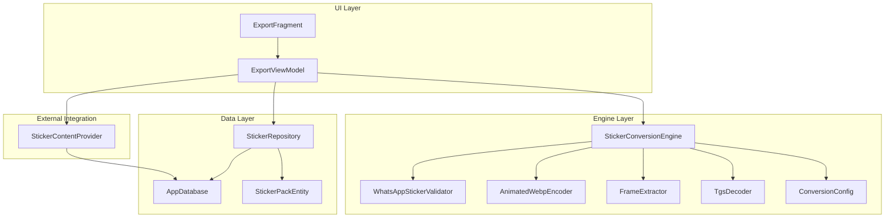
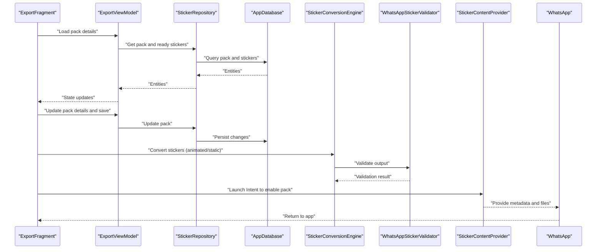
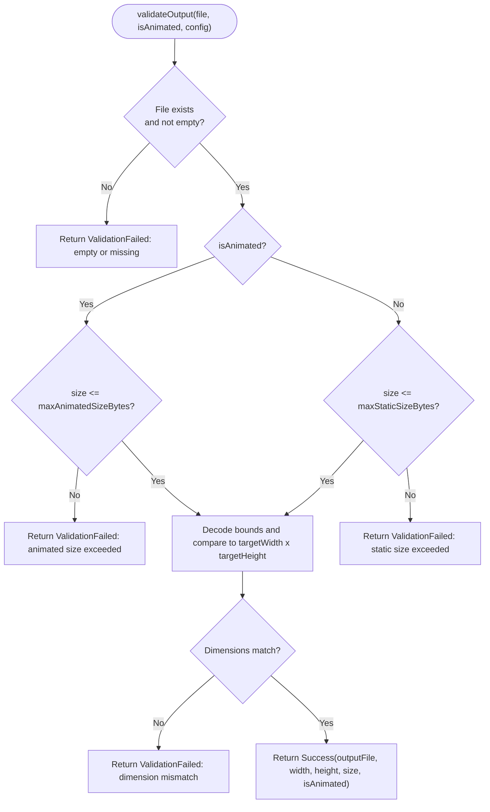
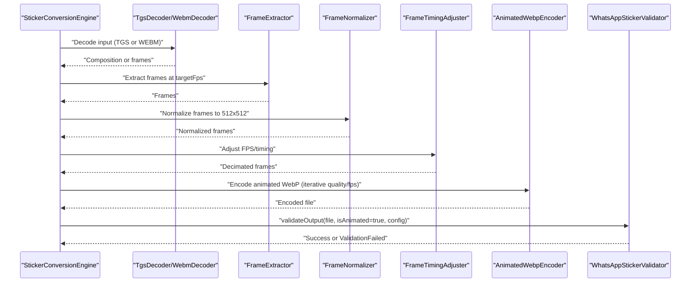
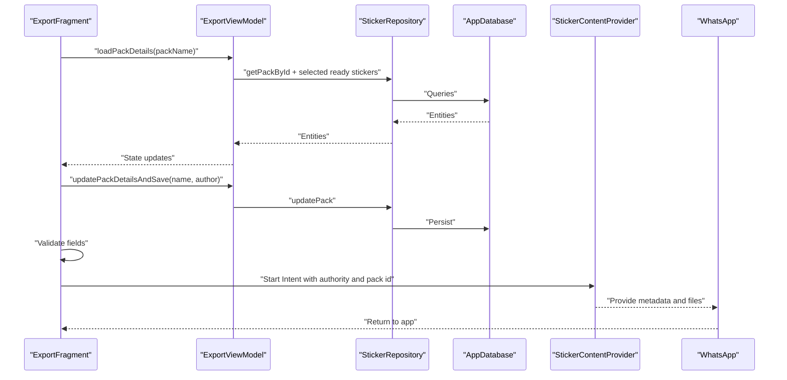
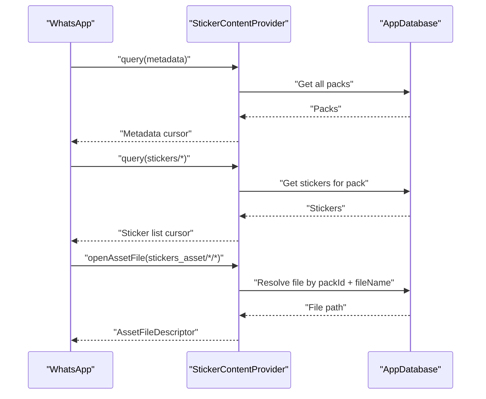
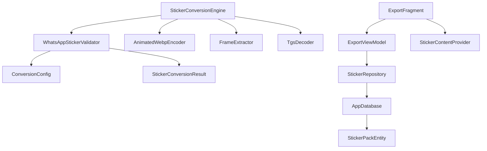

# Validation and Export APIs

<cite>
**Referenced Files in This Document**
- [WhatsAppStickerValidator.kt](file://app/src/main/java/com/maheshsharan/tel2what/engine/WhatsAppStickerValidator.kt)
- [StickerConversionEngine.kt](file://app/src/main/java/com/maheshsharan/tel2what/engine/StickerConversionEngine.kt)
- [ConversionConfig.kt](file://app/src/main/java/com/maheshsharan/tel2what/engine/ConversionConfig.kt)
- [StickerConversionResult.kt](file://app/src/main/java/com/maheshsharan/tel2what/engine/StickerConversionResult.kt)
- [ExportViewModel.kt](file://app/src/main/java/com/maheshsharan/tel2what/ui/export/ExportViewModel.kt)
- [ExportFragment.kt](file://app/src/main/java/com/maheshsharan/tel2what/ui/export/ExportFragment.kt)
- [StickerContentProvider.kt](file://app/src/main/java/com/maheshsharan/tel2what/provider/StickerContentProvider.kt)
- [StickerRepository.kt](file://app/src/main/java/com/maheshsharan/tel2what/data/repository/StickerRepository.kt)
- [AppDatabase.kt](file://app/src/main/java/com/maheshsharan/tel2what/data/local/AppDatabase.kt)
- [StickerPackEntity.kt](file://app/src/main/java/com/maheshsharan/tel2what/data/local/entity/StickerPackEntity.kt)
- [AnimatedWebpEncoder.kt](file://app/src/main/java/com/maheshsharan/tel2what/engine/encoder/AnimatedWebpEncoder.kt)
- [FrameExtractor.kt](file://app/src/main/java/com/maheshsharan/tel2what/engine/decoder/FrameExtractor.kt)
- [TgsDecoder.kt](file://app/src/main/java/com/maheshsharan/tel2what/engine/decoder/TgsDecoder.kt)
</cite>

## Table of Contents
1. [Introduction](#introduction)
2. [Project Structure](#project-structure)
3. [Core Components](#core-components)
4. [Architecture Overview](#architecture-overview)
5. [Detailed Component Analysis](#detailed-component-analysis)
6. [Dependency Analysis](#dependency-analysis)
7. [Performance Considerations](#performance-considerations)
8. [Troubleshooting Guide](#troubleshooting-guide)
9. [Conclusion](#conclusion)

## Introduction
This document explains the validation and export APIs for WhatsApp sticker packs in the application. It covers:
- Validation of sticker compliance with WhatsApp’s constraints (size limits, dimensions, animation rules)
- Export workflow via the UI and ViewModel, including batch processing and initiation of the export action
- Integration with the Content Provider to share sticker packs with external apps (notably WhatsApp)
- Validation criteria, error reporting, and compliance-checking algorithms
- Examples of validation failures and recommended resolutions
- End-to-end export process from validation completion to file generation and external app integration
- Guidance on handling validation errors, retry mechanisms, and user feedback patterns

## Project Structure
The validation and export features span several layers:
- Engine: conversion orchestration, validation, and encoding
- UI: export screen and ViewModel for state and actions
- Data: repository and database for sticker pack metadata and files
- Provider: Content Provider for external app integration

**Diagram sources**
- [ExportFragment.kt](file://app/src/main/java/com/maheshsharan/tel2what/ui/export/ExportFragment.kt#L25-L113)
- [ExportViewModel.kt](file://app/src/main/java/com/maheshsharan/tel2what/ui/export/ExportViewModel.kt#L13-L56)
- [StickerConversionEngine.kt](file://app/src/main/java/com/maheshsharan/tel2what/engine/StickerConversionEngine.kt#L17-L275)
- [WhatsAppStickerValidator.kt](file://app/src/main/java/com/maheshsharan/tel2what/engine/WhatsAppStickerValidator.kt#L7-L72)
- [AnimatedWebpEncoder.kt](file://app/src/main/java/com/maheshsharan/tel2what/engine/encoder/AnimatedWebpEncoder.kt#L8-L91)
- [FrameExtractor.kt](file://app/src/main/java/com/maheshsharan/tel2what/engine/decoder/FrameExtractor.kt#L16-L100)
- [TgsDecoder.kt](file://app/src/main/java/com/maheshsharan/tel2what/engine/decoder/TgsDecoder.kt#L17-L94)
- [ConversionConfig.kt](file://app/src/main/java/com/maheshsharan/tel2what/engine/ConversionConfig.kt#L3-L14)
- [StickerRepository.kt](file://app/src/main/java/com/maheshsharan/tel2what/data/repository/StickerRepository.kt#L10-L80)
- [AppDatabase.kt](file://app/src/main/java/com/maheshsharan/tel2what/data/local/AppDatabase.kt#L13-L42)
- [StickerPackEntity.kt](file://app/src/main/java/com/maheshsharan/tel2what/data/local/entity/StickerPackEntity.kt#L6-L22)
- [StickerContentProvider.kt](file://app/src/main/java/com/maheshsharan/tel2what/provider/StickerContentProvider.kt#L15-L244)

**Section sources**
- [ExportFragment.kt](file://app/src/main/java/com/maheshsharan/tel2what/ui/export/ExportFragment.kt#L25-L113)
- [ExportViewModel.kt](file://app/src/main/java/com/maheshsharan/tel2what/ui/export/ExportViewModel.kt#L13-L56)
- [StickerConversionEngine.kt](file://app/src/main/java/com/maheshsharan/tel2what/engine/StickerConversionEngine.kt#L17-L275)
- [WhatsAppStickerValidator.kt](file://app/src/main/java/com/maheshsharan/tel2what/engine/WhatsAppStickerValidator.kt#L7-L72)
- [AnimatedWebpEncoder.kt](file://app/src/main/java/com/maheshsharan/tel2what/engine/encoder/AnimatedWebpEncoder.kt#L8-L91)
- [FrameExtractor.kt](file://app/src/main/java/com/maheshsharan/tel2what/engine/decoder/FrameExtractor.kt#L16-L100)
- [TgsDecoder.kt](file://app/src/main/java/com/maheshsharan/tel2what/engine/decoder/TgsDecoder.kt#L17-L94)
- [ConversionConfig.kt](file://app/src/main/java/com/maheshsharan/tel2what/engine/ConversionConfig.kt#L3-L14)
- [StickerRepository.kt](file://app/src/main/java/com/maheshsharan/tel2what/data/repository/StickerRepository.kt#L10-L80)
- [AppDatabase.kt](file://app/src/main/java/com/maheshsharan/tel2what/data/local/AppDatabase.kt#L13-L42)
- [StickerPackEntity.kt](file://app/src/main/java/com/maheshsharan/tel2what/data/local/entity/StickerPackEntity.kt#L6-L22)
- [StickerContentProvider.kt](file://app/src/main/java/com/maheshsharan/tel2what/provider/StickerContentProvider.kt#L15-L244)

## Core Components
- WhatsAppStickerValidator: Enforces strict output validation for WebP files against WhatsApp’s constraints (size, dimensions). Returns a sealed result indicating success, failure, or validation failure.
- StickerConversionEngine: Orchestrates conversion pipelines (static, animated, static-as-animated), applies frame extraction and timing adjustments, and invokes validation post-encoding.
- ExportViewModel and ExportFragment: Manage pack details, user input, save operations, and trigger the external integration with WhatsApp via a prepared Intent.
- StickerContentProvider: Implements a Content Provider that exposes sticker metadata and files to external apps (e.g., WhatsApp) using fixed URIs and column names required by WhatsApp.
- Data and Repository: Provide persistence and retrieval of sticker pack metadata and sticker lists, enabling the export UI and provider to operate.

**Section sources**
- [WhatsAppStickerValidator.kt](file://app/src/main/java/com/maheshsharan/tel2what/engine/WhatsAppStickerValidator.kt#L7-L72)
- [StickerConversionEngine.kt](file://app/src/main/java/com/maheshsharan/tel2what/engine/StickerConversionEngine.kt#L17-L275)
- [ExportViewModel.kt](file://app/src/main/java/com/maheshsharan/tel2what/ui/export/ExportViewModel.kt#L13-L56)
- [ExportFragment.kt](file://app/src/main/java/com/maheshsharan/tel2what/ui/export/ExportFragment.kt#L25-L113)
- [StickerContentProvider.kt](file://app/src/main/java/com/maheshsharan/tel2what/provider/StickerContentProvider.kt#L15-L244)
- [StickerRepository.kt](file://app/src/main/java/com/maheshsharan/tel2what/data/repository/StickerRepository.kt#L10-L80)
- [AppDatabase.kt](file://app/src/main/java/com/maheshsharan/tel2what/data/local/AppDatabase.kt#L13-L42)
- [StickerPackEntity.kt](file://app/src/main/java/com/maheshsharan/tel2what/data/local/entity/StickerPackEntity.kt#L6-L22)

## Architecture Overview
The validation and export pipeline integrates UI, engine, data, and provider layers to deliver compliant sticker packs to external apps.

**Diagram sources**
- [ExportFragment.kt](file://app/src/main/java/com/maheshsharan/tel2what/ui/export/ExportFragment.kt#L34-L113)
- [ExportViewModel.kt](file://app/src/main/java/com/maheshsharan/tel2what/ui/export/ExportViewModel.kt#L21-L44)
- [StickerRepository.kt](file://app/src/main/java/com/maheshsharan/tel2what/data/repository/StickerRepository.kt#L16-L80)
- [AppDatabase.kt](file://app/src/main/java/com/maheshsharan/tel2what/data/local/AppDatabase.kt#L13-L42)
- [StickerConversionEngine.kt](file://app/src/main/java/com/maheshsharan/tel2what/engine/StickerConversionEngine.kt#L33-L88)
- [WhatsAppStickerValidator.kt](file://app/src/main/java/com/maheshsharan/tel2what/engine/WhatsAppStickerValidator.kt#L14-L70)
- [StickerContentProvider.kt](file://app/src/main/java/com/maheshsharan/tel2what/provider/StickerContentProvider.kt#L74-L180)

## Detailed Component Analysis

### WhatsAppStickerValidator
Responsibilities:
- Validates output WebP files against configured constraints
- Enforces size limits for static and animated outputs
- Verifies exact target dimensions using fast bitmap bounds decoding
- Returns structured results for downstream handling

Key behaviors:
- Early exit for missing or empty files
- Size checks differ for static vs animated outputs
- Dimension check enforces exact target width and height
- Logs detailed info and errors for diagnostics

Validation criteria:
- Static size limit and animated size limit are enforced
- Output dimensions must match configured target width and height
- Animation-specific constraints are validated indirectly via the conversion pipeline (e.g., minimum frame count enforced by frame extraction)

Error reporting:
- Returns a sealed result indicating success, failure, or validation failure
- Comprehensive logging aids troubleshooting

**Section sources**
- [WhatsAppStickerValidator.kt](file://app/src/main/java/com/maheshsharan/tel2what/engine/WhatsAppStickerValidator.kt#L7-L72)
- [ConversionConfig.kt](file://app/src/main/java/com/maheshsharan/tel2what/engine/ConversionConfig.kt#L3-L14)
- [StickerConversionResult.kt](file://app/src/main/java/com/maheshsharan/tel2what/engine/StickerConversionResult.kt#L5-L23)

#### Validation Flowchart

**Diagram sources**
- [WhatsAppStickerValidator.kt](file://app/src/main/java/com/maheshsharan/tel2what/engine/WhatsAppStickerValidator.kt#L14-L70)
- [ConversionConfig.kt](file://app/src/main/java/com/maheshsharan/tel2what/engine/ConversionConfig.kt#L3-L14)
- [StickerConversionResult.kt](file://app/src/main/java/com/maheshsharan/tel2what/engine/StickerConversionResult.kt#L5-L23)

### StickerConversionEngine
Responsibilities:
- Routes input to appropriate conversion pipeline (static, animated, static-as-animated)
- Applies frame extraction, normalization, and timing adjustments
- Encodes animated WebP using a native encoder with iterative quality/fps tuning
- Invokes validation after encoding

Processing logic highlights:
- Animated pipeline uses TGS/WebM decoding, frame extraction, normalization, and timing adjustment
- Static-as-animated wraps a single bitmap into a 1-frame animation
- Native encoder writes compressed WebP bytes to disk
- Validation runs post-encoding to enforce final compliance

Concurrency:
- Uses semaphores to limit concurrent animated conversions and allow multiple static conversions

**Section sources**
- [StickerConversionEngine.kt](file://app/src/main/java/com/maheshsharan/tel2what/engine/StickerConversionEngine.kt#L17-L275)
- [FrameExtractor.kt](file://app/src/main/java/com/maheshsharan/tel2what/engine/decoder/FrameExtractor.kt#L24-L99)
- [TgsDecoder.kt](file://app/src/main/java/com/maheshsharan/tel2what/engine/decoder/TgsDecoder.kt#L21-L80)
- [AnimatedWebpEncoder.kt](file://app/src/main/java/com/maheshsharan/tel2what/engine/encoder/AnimatedWebpEncoder.kt#L32-L78)

#### Conversion Sequence (Animated Pipeline)

**Diagram sources**
- [StickerConversionEngine.kt](file://app/src/main/java/com/maheshsharan/tel2what/engine/StickerConversionEngine.kt#L131-L275)
- [FrameExtractor.kt](file://app/src/main/java/com/maheshsharan/tel2what/engine/decoder/FrameExtractor.kt#L24-L99)
- [AnimatedWebpEncoder.kt](file://app/src/main/java/com/maheshsharan/tel2what/engine/encoder/AnimatedWebpEncoder.kt#L32-L78)
- [WhatsAppStickerValidator.kt](file://app/src/main/java/com/maheshsharan/tel2what/engine/WhatsAppStickerValidator.kt#L14-L70)

### ExportViewModel and ExportFragment
Responsibilities:
- Load and display pack details and selected stickers
- Allow editing pack name and author
- Persist updates to the repository/database
- Launch the external Intent to enable the sticker pack in WhatsApp

Workflow:
- ExportFragment initializes ExportViewModel with a repository
- Loads pack details and sticker counts
- Validates required fields before saving
- Saves updated pack metadata
- Launches Intent with authority and identifiers to integrate with WhatsApp

User feedback:
- Shows toasts for success and errors
- Requests focus on invalid fields

**Section sources**
- [ExportViewModel.kt](file://app/src/main/java/com/maheshsharan/tel2what/ui/export/ExportViewModel.kt#L13-L56)
- [ExportFragment.kt](file://app/src/main/java/com/maheshsharan/tel2what/ui/export/ExportFragment.kt#L34-L113)
- [StickerRepository.kt](file://app/src/main/java/com/maheshsharan/tel2what/data/repository/StickerRepository.kt#L16-L80)
- [AppDatabase.kt](file://app/src/main/java/com/maheshsharan/tel2what/data/local/AppDatabase.kt#L13-L42)
- [StickerPackEntity.kt](file://app/src/main/java/com/maheshsharan/tel2what/data/local/entity/StickerPackEntity.kt#L6-L22)

#### Export Initiation Sequence

**Diagram sources**
- [ExportFragment.kt](file://app/src/main/java/com/maheshsharan/tel2what/ui/export/ExportFragment.kt#L65-L113)
- [ExportViewModel.kt](file://app/src/main/java/com/maheshsharan/tel2what/ui/export/ExportViewModel.kt#L21-L44)
- [StickerRepository.kt](file://app/src/main/java/com/maheshsharan/tel2what/data/repository/StickerRepository.kt#L16-L80)
- [AppDatabase.kt](file://app/src/main/java/com/maheshsharan/tel2what/data/local/AppDatabase.kt#L13-L42)
- [StickerContentProvider.kt](file://app/src/main/java/com/maheshsharan/tel2what/provider/StickerContentProvider.kt#L98-L113)

### StickerContentProvider
Responsibilities:
- Expose sticker pack metadata and files to external apps using fixed URIs and column names
- Serve tray icons and sticker images via openAssetFile
- Provide correct MIME types required by WhatsApp

Key behaviors:
- Defines URIs for metadata, sticker lists, and asset files
- Implements query to return metadata and sticker rows
- Implements openAssetFile to serve files by pack identifier and filename
- Uses synchronous DAO calls suitable for ContentProvider context

Integration with WhatsApp:
- Uses a fixed authority and path segments expected by WhatsApp
- Returns exact column names and MIME types required by WhatsApp

**Section sources**
- [StickerContentProvider.kt](file://app/src/main/java/com/maheshsharan/tel2what/provider/StickerContentProvider.kt#L15-L244)

#### Provider Interaction Flow

**Diagram sources**
- [StickerContentProvider.kt](file://app/src/main/java/com/maheshsharan/tel2what/provider/StickerContentProvider.kt#L74-L216)
- [AppDatabase.kt](file://app/src/main/java/com/maheshsharan/tel2what/data/local/AppDatabase.kt#L13-L42)

## Dependency Analysis
The following diagram shows key dependencies among components involved in validation and export.

**Diagram sources**
- [WhatsAppStickerValidator.kt](file://app/src/main/java/com/maheshsharan/tel2what/engine/WhatsAppStickerValidator.kt#L7-L72)
- [StickerConversionEngine.kt](file://app/src/main/java/com/maheshsharan/tel2what/engine/StickerConversionEngine.kt#L17-L275)
- [ExportViewModel.kt](file://app/src/main/java/com/maheshsharan/tel2what/ui/export/ExportViewModel.kt#L13-L56)
- [ExportFragment.kt](file://app/src/main/java/com/maheshsharan/tel2what/ui/export/ExportFragment.kt#L25-L113)
- [StickerContentProvider.kt](file://app/src/main/java/com/maheshsharan/tel2what/provider/StickerContentProvider.kt#L15-L244)
- [StickerRepository.kt](file://app/src/main/java/com/maheshsharan/tel2what/data/repository/StickerRepository.kt#L10-L80)
- [AppDatabase.kt](file://app/src/main/java/com/maheshsharan/tel2what/data/local/AppDatabase.kt#L13-L42)
- [StickerPackEntity.kt](file://app/src/main/java/com/maheshsharan/tel2what/data/local/entity/StickerPackEntity.kt#L6-L22)

**Section sources**
- [WhatsAppStickerValidator.kt](file://app/src/main/java/com/maheshsharan/tel2what/engine/WhatsAppStickerValidator.kt#L7-L72)
- [StickerConversionEngine.kt](file://app/src/main/java/com/maheshsharan/tel2what/engine/StickerConversionEngine.kt#L17-L275)
- [ExportViewModel.kt](file://app/src/main/java/com/maheshsharan/tel2what/ui/export/ExportViewModel.kt#L13-L56)
- [ExportFragment.kt](file://app/src/main/java/com/maheshsharan/tel2what/ui/export/ExportFragment.kt#L25-L113)
- [StickerContentProvider.kt](file://app/src/main/java/com/maheshsharan/tel2what/provider/StickerContentProvider.kt#L15-L244)
- [StickerRepository.kt](file://app/src/main/java/com/maheshsharan/tel2what/data/repository/StickerRepository.kt#L10-L80)
- [AppDatabase.kt](file://app/src/main/java/com/maheshsharan/tel2what/data/local/AppDatabase.kt#L13-L42)
- [StickerPackEntity.kt](file://app/src/main/java/com/maheshsharan/tel2what/data/local/entity/StickerPackEntity.kt#L6-L22)

## Performance Considerations
- Animated conversion is computationally expensive; concurrency is limited to one animated operation at a time to prevent thermal throttling and memory pressure.
- Static conversions are parallelized up to four threads to improve throughput.
- The animated pipeline iteratively reduces quality and then FPS to meet size targets, minimizing wasted computation.
- Frame extraction and normalization are performed on 512x512 canvases to satisfy WhatsApp’s constraints efficiently.
- Logging provides telemetry for metrics such as final frame count, duration, quality, FPS, and encode time.

[No sources needed since this section provides general guidance]

## Troubleshooting Guide
Common validation failures and resolutions:
- Empty or missing output file:
  - Cause: Conversion did not produce a file or file was deleted.
  - Resolution: Re-run conversion; ensure sufficient storage and no premature deletion.
- Size exceeded (static or animated):
  - Cause: Output larger than configured limits.
  - Resolution: Reduce input complexity, lower quality, or decrease FPS; re-run conversion.
- Dimension mismatch:
  - Cause: Output dimensions do not match target width/height.
  - Resolution: Ensure input is normalized to 512x512; verify frame extraction and normalization steps.
- Zero frames extracted:
  - Cause: Invalid or unsupported input (e.g., WebM produced no frames).
  - Resolution: Verify source file integrity; re-export with supported codecs.
- JNI encoder failure:
  - Cause: Native WebP encoding returned null or empty bytes.
  - Resolution: Retry with different quality; check native library loading; ensure valid frame arrays.
- Provider file not found:
  - Cause: Incorrect packId or filename; file missing from storage.
  - Resolution: Confirm pack metadata and file paths; ensure files exist and are readable.

Retry mechanisms:
- Animated pipeline retries with reduced quality and then reduced FPS to meet size constraints.
- UI can prompt users to adjust inputs or retry conversion after addressing the cause.

User feedback patterns:
- ExportFragment displays toasts for success and errors.
- Field validation sets errors and requests focus for invalid inputs.

**Section sources**
- [WhatsAppStickerValidator.kt](file://app/src/main/java/com/maheshsharan/tel2what/engine/WhatsAppStickerValidator.kt#L19-L62)
- [StickerConversionEngine.kt](file://app/src/main/java/com/maheshsharan/tel2what/engine/StickerConversionEngine.kt#L214-L246)
- [ExportFragment.kt](file://app/src/main/java/com/maheshsharan/tel2what/ui/export/ExportFragment.kt#L75-L95)
- [StickerContentProvider.kt](file://app/src/main/java/com/maheshsharan/tel2what/provider/StickerContentProvider.kt#L189-L216)

## Conclusion
The validation and export APIs implement a robust pipeline to ensure sticker packs meet WhatsApp’s requirements. The engine enforces strict constraints, the UI manages user-driven export actions, and the Content Provider enables seamless integration with external apps. By combining iterative compression, dimension normalization, and precise validation, the system delivers compliant outputs and clear feedback for troubleshooting and retries.

[No sources needed since this section summarizes without analyzing specific files]