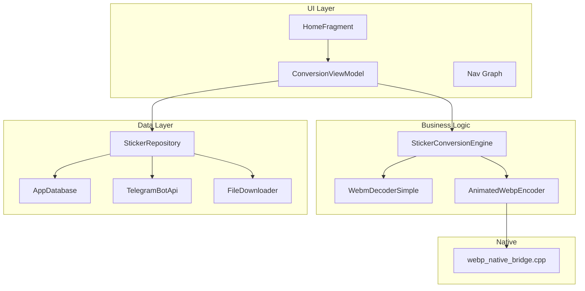
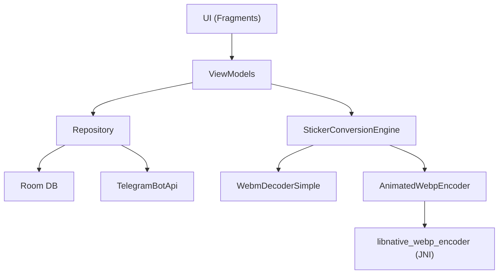
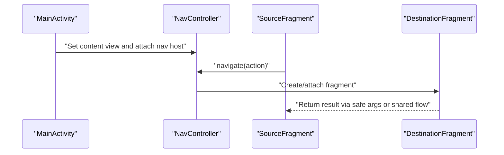
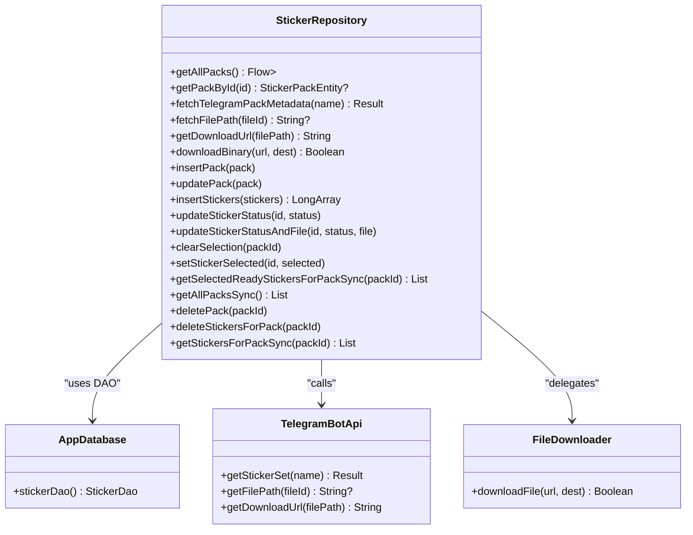
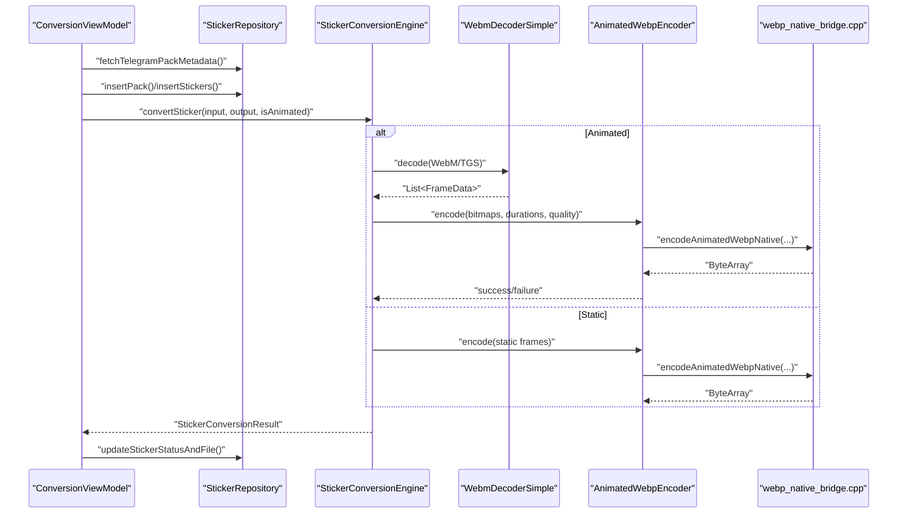
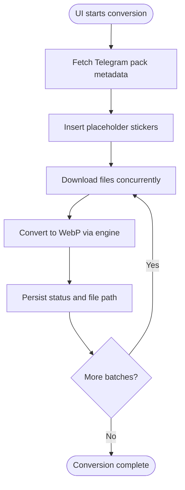
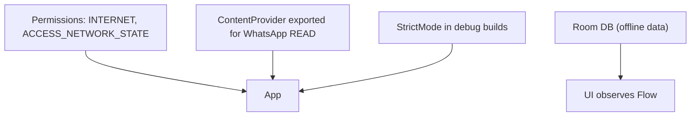
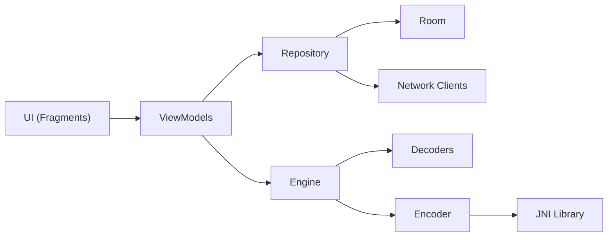

# Architecture Overview

<cite>
**Referenced Files in This Document**
- [MainActivity.kt](file://app/src/main/java/com/maheshsharan/tel2what/MainActivity.kt)
- [Tel2WhatApplication.kt](file://app/src/main/java/com/maheshsharan/tel2what/Tel2WhatApplication.kt)
- [AppDatabase.kt](file://app/src/main/java/com/maheshsharan/tel2what/data/local/AppDatabase.kt)
- [StickerRepository.kt](file://app/src/main/java/com/maheshsharan/tel2what/data/repository/StickerRepository.kt)
- [TelegramBotApi.kt](file://app/src/main/java/com/maheshsharan/tel2what/data/network/TelegramBotApi.kt)
- [FileDownloader.kt](file://app/src/main/java/com/maheshsharan/tel2what/data/network/FileDownloader.kt)
- [StickerConversionEngine.kt](file://app/src/main/java/com/maheshsharan/tel2what/engine/StickerConversionEngine.kt)
- [WebmDecoderSimple.kt](file://app/src/main/java/com/maheshsharan/tel2what/engine/decoder/WebmDecoderSimple.kt)
- [AnimatedWebpEncoder.kt](file://app/src/main/java/com/maheshsharan/tel2what/engine/encoder/AnimatedWebpEncoder.kt)
- [webp_native_bridge.cpp](file://app/src/main/cpp/webp_native_bridge.cpp)
- [nav_graph.xml](file://app/src/main/res/navigation/nav_graph.xml)
- [HomeFragment.kt](file://app/src/main/java/com/maheshsharan/tel2what/ui/home/HomeFragment.kt)
- [HomeViewModel.kt](file://app/src/main/java/com/maheshsharan/tel2what/ui/home/HomeViewModel.kt)
- [ConversionViewModel.kt](file://app/src/main/java/com/maheshsharan/tel2what/ui/conversion/ConversionViewModel.kt)
- [AndroidManifest.xml](file://app/src/main/AndroidManifest.xml)
</cite>

## Table of Contents
1. [Introduction](#introduction)
2. [Project Structure](#project-structure)
3. [Core Components](#core-components)
4. [Architecture Overview](#architecture-overview)
5. [Detailed Component Analysis](#detailed-component-analysis)
6. [Dependency Analysis](#dependency-analysis)
7. [Performance Considerations](#performance-considerations)
8. [Troubleshooting Guide](#troubleshooting-guide)
9. [Conclusion](#conclusion)

## Introduction
This document describes the overall system design of Tel2What, focusing on its layered architecture with MVVM, single-activity with fragment navigation, repository pattern for data access, and integration between native C++ and Kotlin. It also explains offline-first design and privacy-conscious implementation choices.

## Project Structure
The application follows a feature-based package structure with clear separation of concerns:
- UI layer: fragments and view models under ui/
- Business logic: engines and validators under engine/
- Data layer: repositories, DAOs, entities, and network clients under data/
- Native integration: C++ bridge under cpp/

**Diagram sources**
- [MainActivity.kt](file://app/src/main/java/com/maheshsharan/tel2what/MainActivity.kt#L1-L13)
- [nav_graph.xml](file://app/src/main/res/navigation/nav_graph.xml#L1-L122)
- [HomeFragment.kt](file://app/src/main/java/com/maheshsharan/tel2what/ui/home/HomeFragment.kt#L1-L93)
- [HomeViewModel.kt](file://app/src/main/java/com/maheshsharan/tel2what/ui/home/HomeViewModel.kt#L1-L25)
- [ConversionViewModel.kt](file://app/src/main/java/com/maheshsharan/tel2what/ui/conversion/ConversionViewModel.kt#L1-L456)
- [StickerRepository.kt](file://app/src/main/java/com/maheshsharan/tel2what/data/repository/StickerRepository.kt#L1-L80)
- [AppDatabase.kt](file://app/src/main/java/com/maheshsharan/tel2what/data/local/AppDatabase.kt#L1-L42)
- [TelegramBotApi.kt](file://app/src/main/java/com/maheshsharan/tel2what/data/network/TelegramBotApi.kt#L1-L112)
- [FileDownloader.kt](file://app/src/main/java/com/maheshsharan/tel2what/data/network/FileDownloader.kt#L1-L77)
- [StickerConversionEngine.kt](file://app/src/main/java/com/maheshsharan/tel2what/engine/StickerConversionEngine.kt#L1-L276)
- [WebmDecoderSimple.kt](file://app/src/main/java/com/maheshsharan/tel2what/engine/decoder/WebmDecoderSimple.kt#L1-L256)
- [AnimatedWebpEncoder.kt](file://app/src/main/java/com/maheshsharan/tel2what/engine/encoder/AnimatedWebpEncoder.kt#L1-L91)
- [webp_native_bridge.cpp](file://app/src/main/cpp/webp_native_bridge.cpp#L1-L148)

**Section sources**
- [MainActivity.kt](file://app/src/main/java/com/maheshsharan/tel2what/MainActivity.kt#L1-L13)
- [nav_graph.xml](file://app/src/main/res/navigation/nav_graph.xml#L1-L122)

## Core Components
- Single Activity with Navigation: The app uses a single activity hosting a navigation graph with multiple fragments. Navigation actions define transitions between screens.
- MVVM Pattern:
  - UI layer: Fragments inflate layouts and bind to ViewModels.
  - ViewModels: Expose StateFlow/Flow streams and orchestrate workloads.
  - Repository: Centralizes data access and business rules.
- Repository Pattern: Abstraction over local Room database and remote Telegram APIs.
- Native Integration: Kotlin invokes a native WebP encoder via JNI, implemented in C++.

Key responsibilities:
- UI: Present data, handle user interactions, navigate between screens.
- ViewModel: Manage UI state, coordinate conversions, and observe repository streams.
- Repository: Provide unified access to local and remote data.
- Engine: Decode, normalize, and encode animated/static stickers.
- Network/Data: Fetch Telegram metadata, resolve file paths, download binaries, persist metadata.

**Section sources**
- [HomeFragment.kt](file://app/src/main/java/com/maheshsharan/tel2what/ui/home/HomeFragment.kt#L1-L93)
- [HomeViewModel.kt](file://app/src/main/java/com/maheshsharan/tel2what/ui/home/HomeViewModel.kt#L1-L25)
- [ConversionViewModel.kt](file://app/src/main/java/com/maheshsharan/tel2what/ui/conversion/ConversionViewModel.kt#L1-L456)
- [StickerRepository.kt](file://app/src/main/java/com/maheshsharan/tel2what/data/repository/StickerRepository.kt#L1-L80)
- [AppDatabase.kt](file://app/src/main/java/com/maheshsharan/tel2what/data/local/AppDatabase.kt#L1-L42)
- [TelegramBotApi.kt](file://app/src/main/java/com/maheshsharan/tel2what/data/network/TelegramBotApi.kt#L1-L112)
- [FileDownloader.kt](file://app/src/main/java/com/maheshsharan/tel2what/data/network/FileDownloader.kt#L1-L77)
- [StickerConversionEngine.kt](file://app/src/main/java/com/maheshsharan/tel2what/engine/StickerConversionEngine.kt#L1-L276)
- [AnimatedWebpEncoder.kt](file://app/src/main/java/com/maheshsharan/tel2what/engine/encoder/AnimatedWebpEncoder.kt#L1-L91)
- [webp_native_bridge.cpp](file://app/src/main/cpp/webp_native_bridge.cpp#L1-L148)

## Architecture Overview
The system is layered:
- Presentation (UI + ViewModel) observes and mutates state via Flow/StateFlow.
- Domain (Engine) encapsulates media processing logic.
- Data (Repository) abstracts Room and HTTP clients.

**Diagram sources**
- [HomeFragment.kt](file://app/src/main/java/com/maheshsharan/tel2what/ui/home/HomeFragment.kt#L1-L93)
- [HomeViewModel.kt](file://app/src/main/java/com/maheshsharan/tel2what/ui/home/HomeViewModel.kt#L1-L25)
- [ConversionViewModel.kt](file://app/src/main/java/com/maheshsharan/tel2what/ui/conversion/ConversionViewModel.kt#L1-L456)
- [StickerRepository.kt](file://app/src/main/java/com/maheshsharan/tel2what/data/repository/StickerRepository.kt#L1-L80)
- [AppDatabase.kt](file://app/src/main/java/com/maheshsharan/tel2what/data/local/AppDatabase.kt#L1-L42)
- [TelegramBotApi.kt](file://app/src/main/java/com/maheshsharan/tel2what/data/network/TelegramBotApi.kt#L1-L112)
- [StickerConversionEngine.kt](file://app/src/main/java/com/maheshsharan/tel2what/engine/StickerConversionEngine.kt#L1-L276)
- [WebmDecoderSimple.kt](file://app/src/main/java/com/maheshsharan/tel2what/engine/decoder/WebmDecoderSimple.kt#L1-L256)
- [AnimatedWebpEncoder.kt](file://app/src/main/java/com/maheshsharan/tel2what/engine/encoder/AnimatedWebpEncoder.kt#L1-L91)
- [webp_native_bridge.cpp](file://app/src/main/cpp/webp_native_bridge.cpp#L1-L148)

## Detailed Component Analysis

### MVVM and Navigation
- Single Activity with Navigation Component:
  - The activity hosts a navigation graph with a start destination and multiple destinations.
  - Fragments navigate declaratively using actions and shared element transitions.
- Fragment Lifecycle Management:
  - Fragments initialize ViewModels with factories, bind adapters, and observe flows.
  - Lifecycle-aware scopes collect flows and cancel on destroy to prevent leaks.

**Diagram sources**
- [MainActivity.kt](file://app/src/main/java/com/maheshsharan/tel2what/MainActivity.kt#L1-L13)
- [nav_graph.xml](file://app/src/main/res/navigation/nav_graph.xml#L1-L122)
- [HomeFragment.kt](file://app/src/main/java/com/maheshsharan/tel2what/ui/home/HomeFragment.kt#L1-L93)

**Section sources**
- [MainActivity.kt](file://app/src/main/java/com/maheshsharan/tel2what/MainActivity.kt#L1-L13)
- [nav_graph.xml](file://app/src/main/res/navigation/nav_graph.xml#L1-L122)
- [HomeFragment.kt](file://app/src/main/java/com/maheshsharan/tel2what/ui/home/HomeFragment.kt#L1-L93)

### Repository Pattern Implementation
- StickerRepository centralizes:
  - Local data access via Room DAOs.
  - Remote data via TelegramBotApi and FileDownloader.
  - Business operations: insert/update packs and stickers, selection management, and sync queries.
- Data access abstraction:
  - Returns Flow/List depending on whether data is observed or fetched synchronously.
  - Provides convenience methods for Telegram metadata resolution and download URL construction.

**Diagram sources**
- [StickerRepository.kt](file://app/src/main/java/com/maheshsharan/tel2what/data/repository/StickerRepository.kt#L1-L80)
- [TelegramBotApi.kt](file://app/src/main/java/com/maheshsharan/tel2what/data/network/TelegramBotApi.kt#L1-L112)
- [FileDownloader.kt](file://app/src/main/java/com/maheshsharan/tel2what/data/network/FileDownloader.kt#L1-L77)
- [AppDatabase.kt](file://app/src/main/java/com/maheshsharan/tel2what/data/local/AppDatabase.kt#L1-L42)

**Section sources**
- [StickerRepository.kt](file://app/src/main/java/com/maheshsharan/tel2what/data/repository/StickerRepository.kt#L1-L80)
- [AppDatabase.kt](file://app/src/main/java/com/maheshsharan/tel2what/data/local/AppDatabase.kt#L1-L42)
- [TelegramBotApi.kt](file://app/src/main/java/com/maheshsharan/tel2what/data/network/TelegramBotApi.kt#L1-L112)
- [FileDownloader.kt](file://app/src/main/java/com/maheshsharan/tel2what/data/network/FileDownloader.kt#L1-L77)

### Conversion Pipeline and Native Integration
- StickerConversionEngine orchestrates:
  - Input validation and routing (static vs animated).
  - Animated pipeline: TGS/WebM decoding, frame extraction, normalization, timing adjustment, and native WebP encoding.
  - Static pipeline: optional wrapping into 1-frame animation.
- Native WebP encoding:
  - AnimatedWebpEncoder loads the native library and marshals frames/durations to C++.
  - webp_native_bridge.cpp encodes frames using libwebp and returns bytes to Java/Kotlin.

**Diagram sources**
- [ConversionViewModel.kt](file://app/src/main/java/com/maheshsharan/tel2what/ui/conversion/ConversionViewModel.kt#L1-L456)
- [StickerConversionEngine.kt](file://app/src/main/java/com/maheshsharan/tel2what/engine/StickerConversionEngine.kt#L1-L276)
- [WebmDecoderSimple.kt](file://app/src/main/java/com/maheshsharan/tel2what/engine/decoder/WebmDecoderSimple.kt#L1-L256)
- [AnimatedWebpEncoder.kt](file://app/src/main/java/com/maheshsharan/tel2what/engine/encoder/AnimatedWebpEncoder.kt#L1-L91)
- [webp_native_bridge.cpp](file://app/src/main/cpp/webp_native_bridge.cpp#L1-L148)

**Section sources**
- [StickerConversionEngine.kt](file://app/src/main/java/com/maheshsharan/tel2what/engine/StickerConversionEngine.kt#L1-L276)
- [WebmDecoderSimple.kt](file://app/src/main/java/com/maheshsharan/tel2what/engine/decoder/WebmDecoderSimple.kt#L1-L256)
- [AnimatedWebpEncoder.kt](file://app/src/main/java/com/maheshsharan/tel2what/engine/encoder/AnimatedWebpEncoder.kt#L1-L91)
- [webp_native_bridge.cpp](file://app/src/main/cpp/webp_native_bridge.cpp#L1-L148)

### Data Flow Patterns
- UI observes Flow<List<StickerPackEntity>> from repository and renders recent packs.
- ConversionViewModel fetches Telegram metadata, inserts placeholders, downloads binaries, converts asynchronously, and updates DB state.
- Repository mediates between Room and network layers, ensuring consistent state and error propagation.

**Diagram sources**
- [HomeViewModel.kt](file://app/src/main/java/com/maheshsharan/tel2what/ui/home/HomeViewModel.kt#L1-L25)
- [ConversionViewModel.kt](file://app/src/main/java/com/maheshsharan/tel2what/ui/conversion/ConversionViewModel.kt#L1-L456)
- [StickerRepository.kt](file://app/src/main/java/com/maheshsharan/tel2what/data/repository/StickerRepository.kt#L1-L80)

**Section sources**
- [HomeViewModel.kt](file://app/src/main/java/com/maheshsharan/tel2what/ui/home/HomeViewModel.kt#L1-L25)
- [ConversionViewModel.kt](file://app/src/main/java/com/maheshsharan/tel2what/ui/conversion/ConversionViewModel.kt#L1-L456)
- [StickerRepository.kt](file://app/src/main/java/com/maheshsharan/tel2what/data/repository/StickerRepository.kt#L1-L80)

### Offline-First and Privacy-Focused Design
- Offline-first:
  - Local persistence via Room ensures user can browse previously imported packs.
  - Conversion results are stored locally; UI reacts to Flow emissions.
- Privacy:
  - Minimal permissions: INTERNET and ACCESS_NETWORK_STATE.
  - Content provider exported only for WhatsApp read permission, limiting exposure.
  - StrictMode enabled in debug builds to detect UI thread violations and resource leaks.

**Diagram sources**
- [AndroidManifest.xml](file://app/src/main/AndroidManifest.xml#L1-L39)
- [Tel2WhatApplication.kt](file://app/src/main/java/com/maheshsharan/tel2what/Tel2WhatApplication.kt#L1-L46)
- [AppDatabase.kt](file://app/src/main/java/com/maheshsharan/tel2what/data/local/AppDatabase.kt#L1-L42)

**Section sources**
- [AndroidManifest.xml](file://app/src/main/AndroidManifest.xml#L1-L39)
- [Tel2WhatApplication.kt](file://app/src/main/java/com/maheshsharan/tel2what/Tel2WhatApplication.kt#L1-L46)
- [AppDatabase.kt](file://app/src/main/java/com/maheshsharan/tel2what/data/local/AppDatabase.kt#L1-L42)

## Dependency Analysis
- UI depends on ViewModels and Navigation.
- ViewModels depend on Repository and Engine.
- Repository depends on Room and network clients.
- Engine depends on decoders and encoder; encoder depends on native library.

**Diagram sources**
- [HomeFragment.kt](file://app/src/main/java/com/maheshsharan/tel2what/ui/home/HomeFragment.kt#L1-L93)
- [ConversionViewModel.kt](file://app/src/main/java/com/maheshsharan/tel2what/ui/conversion/ConversionViewModel.kt#L1-L456)
- [StickerRepository.kt](file://app/src/main/java/com/maheshsharan/tel2what/data/repository/StickerRepository.kt#L1-L80)
- [StickerConversionEngine.kt](file://app/src/main/java/com/maheshsharan/tel2what/engine/StickerConversionEngine.kt#L1-L276)
- [AnimatedWebpEncoder.kt](file://app/src/main/java/com/maheshsharan/tel2what/engine/encoder/AnimatedWebpEncoder.kt#L1-L91)

**Section sources**
- [HomeFragment.kt](file://app/src/main/java/com/maheshsharan/tel2what/ui/home/HomeFragment.kt#L1-L93)
- [ConversionViewModel.kt](file://app/src/main/java/com/maheshsharan/tel2what/ui/conversion/ConversionViewModel.kt#L1-L456)
- [StickerRepository.kt](file://app/src/main/java/com/maheshsharan/tel2what/data/repository/StickerRepository.kt#L1-L80)
- [StickerConversionEngine.kt](file://app/src/main/java/com/maheshsharan/tel2what/engine/StickerConversionEngine.kt#L1-L276)
- [AnimatedWebpEncoder.kt](file://app/src/main/java/com/maheshsharan/tel2what/engine/encoder/AnimatedWebpEncoder.kt#L1-L91)

## Performance Considerations
- Concurrency control:
  - Separate semaphores for static and animated pipelines to balance throughput and stability.
  - Batched downloads and per-sticker conversion with controlled concurrency.
- Memory management:
  - Explicit bitmap recycling in decoders and engines.
  - Early cleanup of intermediate files and heavy allocations.
- Network efficiency:
  - Telegram file paths preserved with extensions to route decoders correctly.
  - Download failures cleaned up to avoid partial artifacts.

[No sources needed since this section provides general guidance]

## Troubleshooting Guide
Common issues and diagnostics:
- Telegram API errors:
  - Invalid token, missing endpoint, or pack not found lead to descriptive errors surfaced to the UI.
- Network connectivity:
  - UnknownHostException handled gracefully; UI receives actionable messages.
- Conversion failures:
  - Animated pipeline logs metrics and reasons; static-as-animated wraps failures clearly.
- StrictMode warnings:
  - Detects disk reads/writes, network on main thread, leaked objects, and cleartext traffic in debug builds.

**Section sources**
- [TelegramBotApi.kt](file://app/src/main/java/com/maheshsharan/tel2what/data/network/TelegramBotApi.kt#L1-L112)
- [FileDownloader.kt](file://app/src/main/java/com/maheshsharan/tel2what/data/network/FileDownloader.kt#L1-L77)
- [StickerConversionEngine.kt](file://app/src/main/java/com/maheshsharan/tel2what/engine/StickerConversionEngine.kt#L1-L276)
- [Tel2WhatApplication.kt](file://app/src/main/java/com/maheshsharan/tel2what/Tel2WhatApplication.kt#L1-L46)

## Conclusion
Tel2What employs a clean layered MVVM architecture with a single-activity navigation approach, robust repository abstraction, and a high-performance media conversion engine backed by native WebP encoding. The design emphasizes offline-first capabilities and privacy-conscious defaults, supported by strict development-time checks and careful resource management.