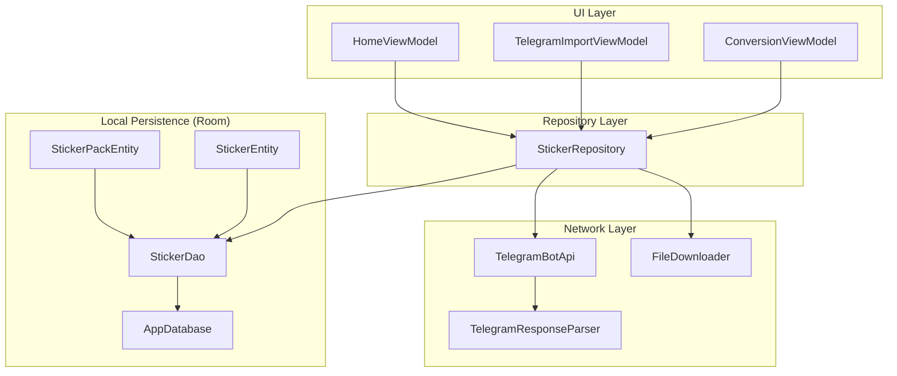
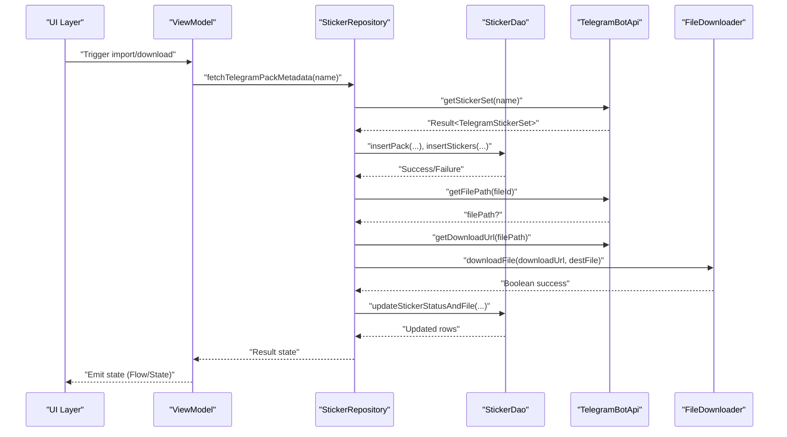
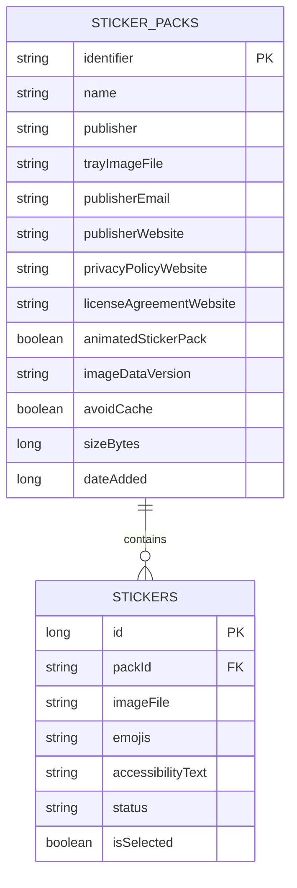
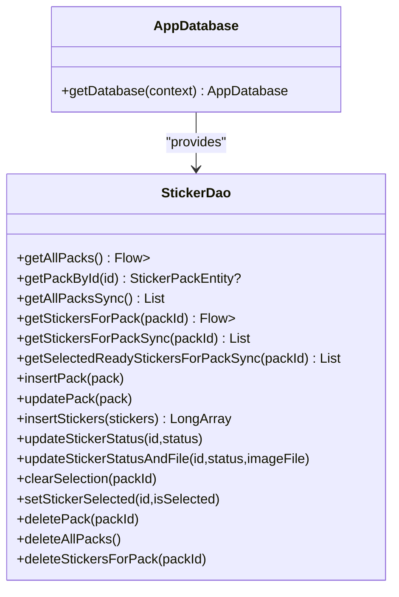
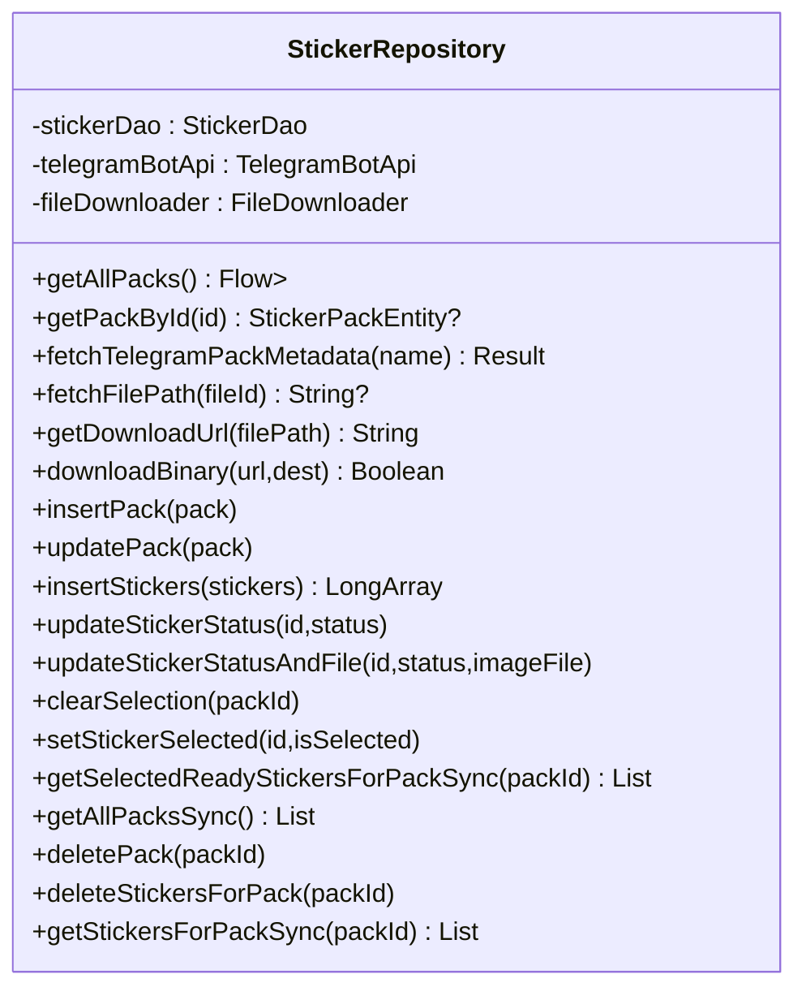
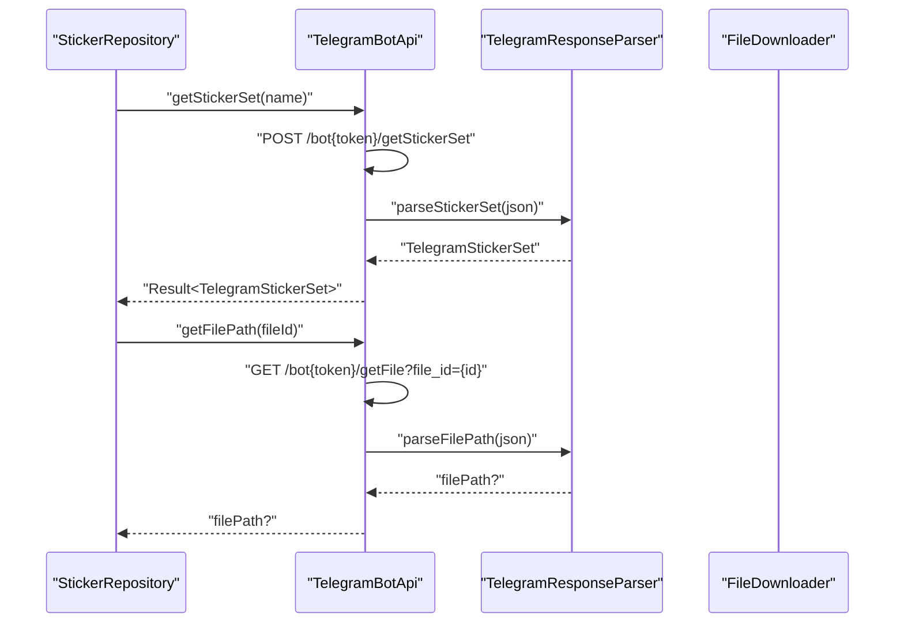
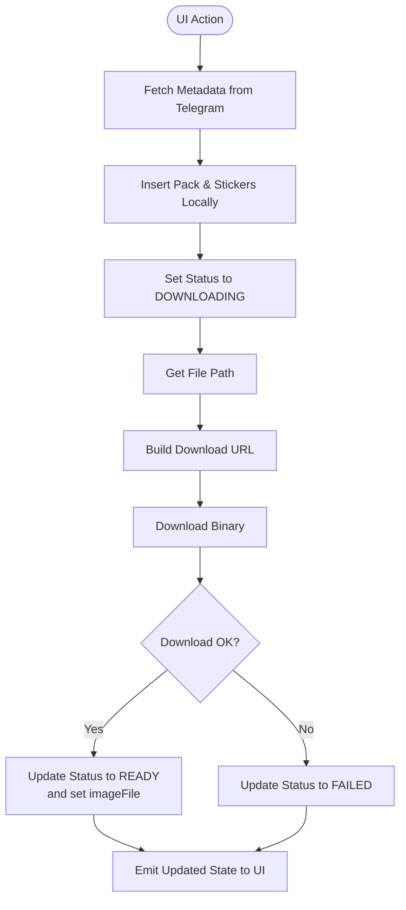
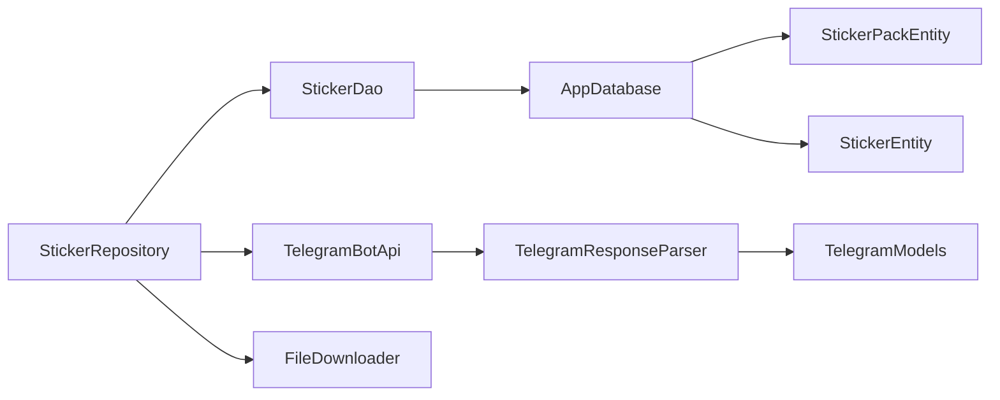

# Data Layer Architecture

<cite>
**Referenced Files in This Document**
- [AppDatabase.kt](file://app/src/main/java/com/maheshsharan/tel2what/data/local/AppDatabase.kt)
- [StickerDao.kt](file://app/src/main/java/com/maheshsharan/tel2what/data/local/dao/StickerDao.kt)
- [StickerPackEntity.kt](file://app/src/main/java/com/maheshsharan/tel2what/data/local/entity/StickerPackEntity.kt)
- [StickerEntity.kt](file://app/src/main/java/com/maheshsharan/tel2what/data/local/entity/StickerEntity.kt)
- [StickerRepository.kt](file://app/src/main/java/com/maheshsharan/tel2what/data/repository/StickerRepository.kt)
- [TelegramBotApi.kt](file://app/src/main/java/com/maheshsharan/tel2what/data/network/TelegramBotApi.kt)
- [FileDownloader.kt](file://app/src/main/java/com/maheshsharan/tel2what/data/network/FileDownloader.kt)
- [TelegramModels.kt](file://app/src/main/java/com/maheshsharan/tel2what/data/network/model/TelegramModels.kt)
</cite>

## Table of Contents
1. [Introduction](#introduction)
2. [Project Structure](#project-structure)
3. [Core Components](#core-components)
4. [Architecture Overview](#architecture-overview)
5. [Detailed Component Analysis](#detailed-component-analysis)
6. [Dependency Analysis](#dependency-analysis)
7. [Performance Considerations](#performance-considerations)
8. [Troubleshooting Guide](#troubleshooting-guide)
9. [Conclusion](#conclusion)

## Introduction
This document describes the data layer architecture of Tel2What, focusing on how the repository pattern abstracts data access from the UI layer, how Room integrates with entity relationships and DAO patterns for local persistence, and how the network layer integrates with the Telegram Bot API for sticker pack discovery and file downloads. It also documents data flow across local storage, network sources, and UI presentation, along with caching strategies, synchronization patterns, offline-first management, database schema design, migration strategies, and performance optimizations tailored for sticker pack data management.

## Project Structure
The data layer is organized by responsibility:
- Local persistence: Room database, entities, and DAOs
- Repository: centralized data access coordinating between local and network sources
- Network: Telegram Bot API integration and file downloading
- UI: ViewModels consume repository APIs and expose state to the UI

**Diagram sources**
- [StickerRepository.kt](file://app/src/main/java/com/maheshsharan/tel2what/data/repository/StickerRepository.kt#L10-L79)
- [AppDatabase.kt](file://app/src/main/java/com/maheshsharan/tel2what/data/local/AppDatabase.kt#L13-L41)
- [StickerDao.kt](file://app/src/main/java/com/maheshsharan/tel2what/data/local/dao/StickerDao.kt#L13-L80)
- [StickerPackEntity.kt](file://app/src/main/java/com/maheshsharan/tel2what/data/local/entity/StickerPackEntity.kt#L6-L21)
- [StickerEntity.kt](file://app/src/main/java/com/maheshsharan/tel2what/data/local/entity/StickerEntity.kt#L8-L28)
- [TelegramBotApi.kt](file://app/src/main/java/com/maheshsharan/tel2what/data/network/TelegramBotApi.kt#L14-L111)
- [TelegramModels.kt](file://app/src/main/java/com/maheshsharan/tel2what/data/network/model/TelegramModels.kt#L22-L74)
- [FileDownloader.kt](file://app/src/main/java/com/maheshsharan/tel2what/data/network/FileDownloader.kt#L11-L76)

**Section sources**
- [AppDatabase.kt](file://app/src/main/java/com/maheshsharan/tel2what/data/local/AppDatabase.kt#L13-L41)
- [StickerDao.kt](file://app/src/main/java/com/maheshsharan/tel2what/data/local/dao/StickerDao.kt#L13-L80)
- [StickerRepository.kt](file://app/src/main/java/com/maheshsharan/tel2what/data/repository/StickerRepository.kt#L10-L79)
- [TelegramBotApi.kt](file://app/src/main/java/com/maheshsharan/tel2what/data/network/TelegramBotApi.kt#L14-L111)
- [FileDownloader.kt](file://app/src/main/java/com/maheshsharan/tel2what/data/network/FileDownloader.kt#L11-L76)

## Core Components
- AppDatabase: Declares Room entities and provides a singleton database instance with migrations.
- StickerDao: Defines CRUD and query operations for sticker packs and stickers, exposing reactive streams via Flow and blocking variants for ContentProvider compatibility.
- Entities: StickerPackEntity and StickerEntity define the schema and foreign key relationship.
- StickerRepository: Orchestrates data access, combining Room DAO operations with Telegram Bot API and file downloads.
- TelegramBotApi: Encapsulates Telegram Bot API requests, parsing responses and handling errors.
- FileDownloader: Handles binary downloads with robust error handling and cleanup.
- TelegramResponseParser: Parses JSON responses into domain models.

**Section sources**
- [AppDatabase.kt](file://app/src/main/java/com/maheshsharan/tel2what/data/local/AppDatabase.kt#L13-L41)
- [StickerDao.kt](file://app/src/main/java/com/maheshsharan/tel2what/data/local/dao/StickerDao.kt#L13-L80)
- [StickerPackEntity.kt](file://app/src/main/java/com/maheshsharan/tel2what/data/local/entity/StickerPackEntity.kt#L6-L21)
- [StickerEntity.kt](file://app/src/main/java/com/maheshsharan/tel2what/data/local/entity/StickerEntity.kt#L8-L28)
- [StickerRepository.kt](file://app/src/main/java/com/maheshsharan/tel2what/data/repository/StickerRepository.kt#L10-L79)
- [TelegramBotApi.kt](file://app/src/main/java/com/maheshsharan/tel2what/data/network/TelegramBotApi.kt#L14-L111)
- [FileDownloader.kt](file://app/src/main/java/com/maheshsharan/tel2what/data/network/FileDownloader.kt#L11-L76)
- [TelegramModels.kt](file://app/src/main/java/com/maheshsharan/tel2what/data/network/model/TelegramModels.kt#L22-L74)

## Architecture Overview
The repository pattern centralizes data operations:
- UI layer invokes ViewModel methods that delegate to StickerRepository.
- StickerRepository coordinates Room DAOs for local persistence and TelegramBotApi for remote metadata and file paths.
- FileDownloader performs binary downloads to local storage.
- DAO queries return Flow for reactive updates and suspend functions for immediate results.

**Diagram sources**
- [StickerRepository.kt](file://app/src/main/java/com/maheshsharan/tel2what/data/repository/StickerRepository.kt#L24-L30)
- [TelegramBotApi.kt](file://app/src/main/java/com/maheshsharan/tel2what/data/network/TelegramBotApi.kt#L22-L73)
- [FileDownloader.kt](file://app/src/main/java/com/maheshsharan/tel2what/data/network/FileDownloader.kt#L21-L75)
- [StickerDao.kt](file://app/src/main/java/com/maheshsharan/tel2what/data/local/dao/StickerDao.kt#L16-L25)
- [StickerDao.kt](file://app/src/main/java/com/maheshsharan/tel2what/data/local/dao/StickerDao.kt#L63-L64)

## Detailed Component Analysis

### Database Schema and Relationships
- Entities:
  - StickerPackEntity: represents a sticker pack with metadata and identifiers.
  - StickerEntity: represents individual stickers linked to a pack via foreign key.
- Relationship:
  - StickerEntity references StickerPackEntity via packId with cascade delete.
- Indices:
  - StickerEntity.packId is indexed for efficient lookups by pack.

**Diagram sources**
- [StickerPackEntity.kt](file://app/src/main/java/com/maheshsharan/tel2what/data/local/entity/StickerPackEntity.kt#L6-L21)
- [StickerEntity.kt](file://app/src/main/java/com/maheshsharan/tel2what/data/local/entity/StickerEntity.kt#L8-L28)

**Section sources**
- [StickerPackEntity.kt](file://app/src/main/java/com/maheshsharan/tel2what/data/local/entity/StickerPackEntity.kt#L6-L21)
- [StickerEntity.kt](file://app/src/main/java/com/maheshsharan/tel2what/data/local/entity/StickerEntity.kt#L8-L28)

### Room Database and DAO Patterns
- AppDatabase:
  - Declares entities and version.
  - Provides a singleton instance with migration from version 1 to 2.
  - Migration adds a new column to the stickers table for selection state.
- StickerDao:
  - Insert/update/delete operations for packs and stickers.
  - Queries for reactive lists (Flow) and synchronous lists.
  - Blocking variants for ContentProvider compatibility.
  - Specialized queries for selection and readiness filtering.

**Diagram sources**
- [AppDatabase.kt](file://app/src/main/java/com/maheshsharan/tel2what/data/local/AppDatabase.kt#L13-L41)
- [StickerDao.kt](file://app/src/main/java/com/maheshsharan/tel2what/data/local/dao/StickerDao.kt#L13-L80)

**Section sources**
- [AppDatabase.kt](file://app/src/main/java/com/maheshsharan/tel2what/data/local/AppDatabase.kt#L13-L41)
- [StickerDao.kt](file://app/src/main/java/com/maheshsharan/tel2what/data/local/dao/StickerDao.kt#L13-L80)

### Repository Pattern Implementation
- Responsibilities:
  - Expose reactive and synchronous APIs to the UI.
  - Coordinate between Room and network layers.
  - Manage sticker status transitions and selection state.
- Key operations:
  - Fetch Telegram pack metadata and file paths.
  - Download binaries and persist metadata/status.
  - Update selection and readiness states atomically where needed.

**Diagram sources**
- [StickerRepository.kt](file://app/src/main/java/com/maheshsharan/tel2what/data/repository/StickerRepository.kt#L10-L79)

**Section sources**
- [StickerRepository.kt](file://app/src/main/java/com/maheshsharan/tel2what/data/repository/StickerRepository.kt#L10-L79)

### Network Layer: Telegram Bot API Integration
- TelegramBotApi:
  - Builds and executes requests to Telegram Bot API endpoints.
  - Handles HTTP error codes and parses JSON responses.
  - Returns Kotlin Result types for safe error propagation.
- FileDownloader:
  - Streams binary content to disk with progress-like logging.
  - Ensures parent directories exist and cleans up partial files on failure.
- Response Parsing:
  - TelegramResponseParser converts JSON into domain models.

**Diagram sources**
- [TelegramBotApi.kt](file://app/src/main/java/com/maheshsharan/tel2what/data/network/TelegramBotApi.kt#L22-L73)
- [TelegramModels.kt](file://app/src/main/java/com/maheshsharan/tel2what/data/network/model/TelegramModels.kt#L24-L60)
- [FileDownloader.kt](file://app/src/main/java/com/maheshsharan/tel2what/data/network/FileDownloader.kt#L21-L75)

**Section sources**
- [TelegramBotApi.kt](file://app/src/main/java/com/maheshsharan/tel2what/data/network/TelegramBotApi.kt#L14-L111)
- [TelegramModels.kt](file://app/src/main/java/com/maheshsharan/tel2what/data/network/model/TelegramModels.kt#L22-L74)
- [FileDownloader.kt](file://app/src/main/java/com/maheshsharan/tel2what/data/network/FileDownloader.kt#L11-L76)

### Data Flow Between Layers
- Discovery flow:
  - UI triggers import with a Telegram sticker set name.
  - Repository fetches metadata from Telegram, inserts pack and stickers locally, and updates statuses.
- Download flow:
  - Repository requests file paths, constructs download URLs, and downloads binaries via FileDownloader.
  - On completion, repository updates sticker status and file path.
- Presentation flow:
  - DAO queries return Flow for reactive UI updates.
  - Synchronous variants support ContentProvider and immediate operations.

**Diagram sources**
- [StickerRepository.kt](file://app/src/main/java/com/maheshsharan/tel2what/data/repository/StickerRepository.kt#L24-L30)
- [TelegramBotApi.kt](file://app/src/main/java/com/maheshsharan/tel2what/data/network/TelegramBotApi.kt#L75-L110)
- [FileDownloader.kt](file://app/src/main/java/com/maheshsharan/tel2what/data/network/FileDownloader.kt#L21-L75)
- [StickerDao.kt](file://app/src/main/java/com/maheshsharan/tel2what/data/local/dao/StickerDao.kt#L60-L64)

**Section sources**
- [StickerRepository.kt](file://app/src/main/java/com/maheshsharan/tel2what/data/repository/StickerRepository.kt#L16-L78)
- [TelegramBotApi.kt](file://app/src/main/java/com/maheshsharan/tel2what/data/network/TelegramBotApi.kt#L22-L110)
- [FileDownloader.kt](file://app/src/main/java/com/maheshsharan/tel2what/data/network/FileDownloader.kt#L21-L75)
- [StickerDao.kt](file://app/src/main/java/com/maheshsharan/tel2what/data/local/dao/StickerDao.kt#L27-L79)

### Caching Strategies and Offline-First Management
- Local caching:
  - Sticker metadata and file paths are persisted in Room for offline access.
  - Selection state and readiness status are stored locally to enable offline browsing and export preparation.
- Network caching:
  - Telegram file paths and download URLs are derived on-demand; consider adding a lightweight cache for file paths if repeated imports are frequent.
- Offline-first:
  - UI reacts to Flow emissions for packs and stickers.
  - Blocking DAO methods support ContentProvider operations without network dependency.

**Section sources**
- [StickerDao.kt](file://app/src/main/java/com/maheshsharan/tel2what/data/local/dao/StickerDao.kt#L27-L79)
- [StickerRepository.kt](file://app/src/main/java/com/maheshsharan/tel2what/data/repository/StickerRepository.kt#L16-L28)

### Data Synchronization Patterns
- Reactive synchronization:
  - DAO returns Flow for real-time UI updates when local data changes.
- Explicit sync:
  - Suspend functions provide immediate results for operations requiring synchronous outcomes.
- Atomic operations:
  - DAO supports batch insertions and targeted updates to maintain consistency during import and conversion.

**Section sources**
- [StickerDao.kt](file://app/src/main/java/com/maheshsharan/tel2what/data/local/dao/StickerDao.kt#L16-L25)
- [StickerDao.kt](file://app/src/main/java/com/maheshsharan/tel2what/data/local/dao/StickerDao.kt#L60-L64)

### Database Schema Design and Migrations
- Schema:
  - Two tables: sticker_packs and stickers.
  - Foreign key constraint ensures referential integrity and cascade deletes.
- Migration:
  - Version 1 to 2 adds a selection flag column to stickers with a default value.
- Indexing:
  - packId index on stickers accelerates pack-scoped queries.

**Section sources**
- [AppDatabase.kt](file://app/src/main/java/com/maheshsharan/tel2what/data/local/AppDatabase.kt#L13-L25)
- [StickerEntity.kt](file://app/src/main/java/com/maheshsharan/tel2what/data/local/entity/StickerEntity.kt#L8-L18)
- [StickerDao.kt](file://app/src/main/java/com/maheshsharan/tel2what/data/local/dao/StickerDao.kt#L43-L51)

## Dependency Analysis
The following diagram shows module-level dependencies among the data layer components:

**Diagram sources**
- [StickerRepository.kt](file://app/src/main/java/com/maheshsharan/tel2what/data/repository/StickerRepository.kt#L3-L13)
- [AppDatabase.kt](file://app/src/main/java/com/maheshsharan/tel2what/data/local/AppDatabase.kt#L9-L11)
- [TelegramBotApi.kt](file://app/src/main/java/com/maheshsharan/tel2what/data/network/TelegramBotApi.kt#L4-L6)
- [TelegramModels.kt](file://app/src/main/java/com/maheshsharan/tel2what/data/network/model/TelegramModels.kt#L1-L21)

**Section sources**
- [StickerRepository.kt](file://app/src/main/java/com/maheshsharan/tel2what/data/repository/StickerRepository.kt#L3-L13)
- [AppDatabase.kt](file://app/src/main/java/com/maheshsharan/tel2what/data/local/AppDatabase.kt#L9-L11)
- [TelegramBotApi.kt](file://app/src/main/java/com/maheshsharan/tel2what/data/network/TelegramBotApi.kt#L4-L6)
- [TelegramModels.kt](file://app/src/main/java/com/maheshsharan/tel2what/data/network/model/TelegramModels.kt#L1-L21)

## Performance Considerations
- Batch operations:
  - Use DAO batch insert for stickers to minimize transaction overhead.
- Reactive UI updates:
  - Prefer Flow-based queries to avoid redundant UI refreshes.
- Efficient queries:
  - Utilize indexed packId queries for pack-scoped operations.
- Network efficiency:
  - Reuse OkHttpClient instances (already encapsulated).
  - Consider adding retry/backoff and timeout tuning for Telegram API calls.
- Disk I/O:
  - Stream downloads directly to disk; ensure sufficient free space and handle partial file cleanup.
- Memory:
  - Avoid loading entire sticker sets into memory unnecessarily; rely on paging or streaming where applicable.

[No sources needed since this section provides general guidance]

## Troubleshooting Guide
Common issues and resolutions:
- Telegram API errors:
  - Invalid token or unauthorized access: repository propagates descriptive errors; ensure a valid token is configured.
  - Sticker set not found: verify the Telegram link and that the pack is public.
  - Network failures: handle UnknownHostException and generic exceptions gracefully.
- Download failures:
  - Non-success HTTP responses or missing response bodies lead to failure; partial files are cleaned up automatically.
- Data inconsistencies:
  - Use DAO’s atomic update methods to ensure status and file path updates occur together.

**Section sources**
- [TelegramBotApi.kt](file://app/src/main/java/com/maheshsharan/tel2what/data/network/TelegramBotApi.kt#L34-L72)
- [FileDownloader.kt](file://app/src/main/java/com/maheshsharan/tel2what/data/network/FileDownloader.kt#L30-L74)
- [StickerDao.kt](file://app/src/main/java/com/maheshsharan/tel2what/data/local/dao/StickerDao.kt#L60-L64)

## Conclusion
Tel2What’s data layer leverages the repository pattern to cleanly separate concerns between UI and data sources. Room provides robust local persistence with foreign keys and indices, while the repository orchestrates Telegram Bot API interactions and file downloads. Reactive Flow emissions enable responsive UI updates, and blocking DAO methods support ContentProvider needs. The design emphasizes offline-first capabilities, efficient synchronization, and maintainable migrations, with clear extension points for caching and performance enhancements tailored to sticker pack workflows.