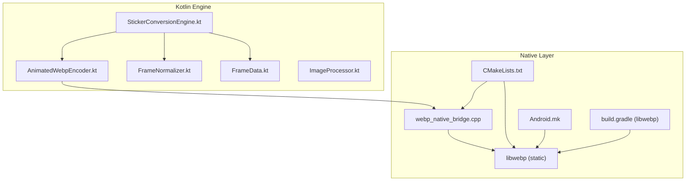
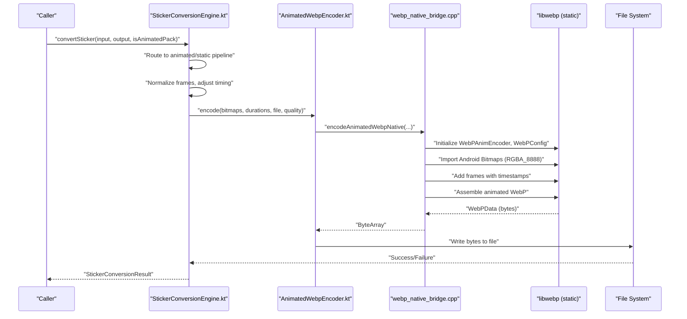
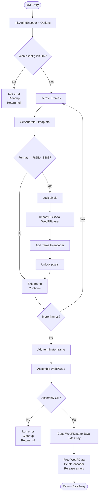
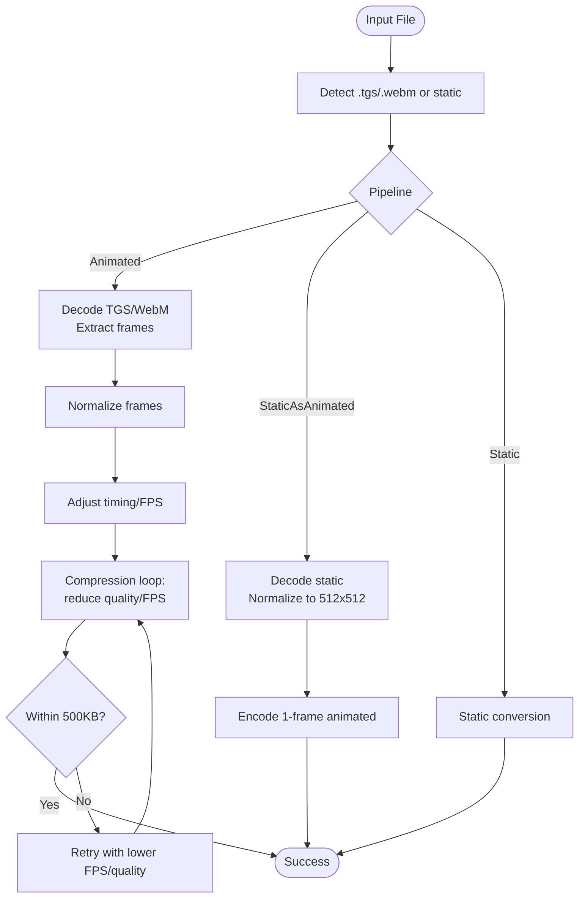
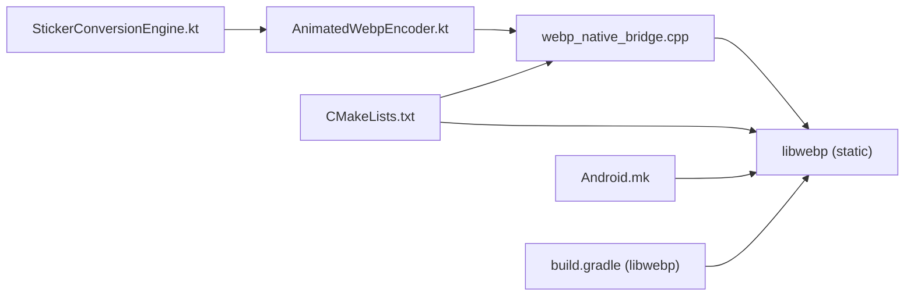

# Native Integration Architecture

<cite>
**Referenced Files in This Document**
- [webp_native_bridge.cpp](file://app/src/main/cpp/webp_native_bridge.cpp)
- [CMakeLists.txt](file://app/src/main/cpp/CMakeLists.txt)
- [AnimatedWebpEncoder.kt](file://app/src/main/java/com/maheshsharan/tel2what/engine/encoder/AnimatedWebpEncoder.kt)
- [StickerConversionEngine.kt](file://app/src/main/java/com/maheshsharan/tel2what/engine/StickerConversionEngine.kt)
- [FrameNormalizer.kt](file://app/src/main/java/com/maheshsharan/tel2what/engine/frame/FrameNormalizer.kt)
- [FrameData.kt](file://app/src/main/java/com/maheshsharan/tel2what/engine/frame/FrameData.kt)
- [ImageProcessor.kt](file://app/src/main/java/com/maheshsharan/tel2what/utils/ImageProcessor.kt)
- [build.gradle.kts](file://app/build.gradle.kts)
- [Android.mk](file://app/src/main/cpp/libwebp/Android.mk)
- [build.gradle (libwebp)](file://app/src/main/cpp/libwebp/build.gradle)
- [anim_util.h](file://app/src/main/cpp/libwebp/examples/anim_util.h)
- [image_enc.h](file://app/src/main/cpp/libwebp/imageio/image_enc.h)
</cite>

## Table of Contents
1. [Introduction](#introduction)
2. [Project Structure](#project-structure)
3. [Core Components](#core-components)
4. [Architecture Overview](#architecture-overview)
5. [Detailed Component Analysis](#detailed-component-analysis)
6. [Dependency Analysis](#dependency-analysis)
7. [Performance Considerations](#performance-considerations)
8. [Troubleshooting Guide](#troubleshooting-guide)
9. [Conclusion](#conclusion)

## Introduction
This document explains Tel2What’s native integration architecture for animated sticker encoding. It focuses on the JNI bridge that connects Kotlin code to a native C++ WebP encoder built from a vendored copy of libwebp. The documentation covers the CMake build configuration, native library compilation, cross-platform compatibility considerations, the WebP encoding pipeline, memory management across Java and native layers, performance optimization strategies, integration points with the conversion engine and frame processing utilities, debugging and error propagation, and platform-specific optimizations.

## Project Structure
The native stack is organized around a small JNI bridge and a self-contained subset of libwebp compiled as a static library. The Kotlin engine orchestrates decoding, normalization, timing adjustment, and calls into the native encoder.

**Diagram sources**
- [AnimatedWebpEncoder.kt](file://app/src/main/java/com/maheshsharan/tel2what/engine/encoder/AnimatedWebpEncoder.kt#L1-L91)
- [StickerConversionEngine.kt](file://app/src/main/java/com/maheshsharan/tel2what/engine/StickerConversionEngine.kt#L1-L275)
- [FrameNormalizer.kt](file://app/src/main/java/com/maheshsharan/tel2what/engine/frame/FrameNormalizer.kt#L1-L62)
- [FrameData.kt](file://app/src/main/java/com/maheshsharan/tel2what/engine/frame/FrameData.kt#L1-L9)
- [ImageProcessor.kt](file://app/src/main/java/com/maheshsharan/tel2what/utils/ImageProcessor.kt#L1-L68)
- [webp_native_bridge.cpp](file://app/src/main/cpp/webp_native_bridge.cpp#L1-L148)
- [CMakeLists.txt](file://app/src/main/cpp/CMakeLists.txt#L1-L44)
- [Android.mk](file://app/src/main/cpp/libwebp/Android.mk#L1-L296)
- [build.gradle (libwebp)](file://app/src/main/cpp/libwebp/build.gradle#L1-L445)

**Section sources**
- [CMakeLists.txt](file://app/src/main/cpp/CMakeLists.txt#L1-L44)
- [build.gradle.kts](file://app/build.gradle.kts#L1-L117)

## Core Components
- JNI Bridge: Exposes a single external function to Kotlin, taking arrays of Android Bitmaps and per-frame durations, returning a byte array of the animated WebP.
- libwebp Static Library: Compiled from a curated set of WebP source files (decoders, encoders, mux, utils, and SharpYUV) to minimize footprint and avoid symbol pollution.
- Kotlin Encoder Wrapper: Loads the native library and validates inputs before delegating to the JNI function.
- Conversion Engine: Orchestrates the animated pipeline, normalizes frames, adjusts timing, and iteratively reduces quality/FPS until under the 500 KB constraint.

**Section sources**
- [webp_native_bridge.cpp](file://app/src/main/cpp/webp_native_bridge.cpp#L13-L148)
- [CMakeLists.txt](file://app/src/main/cpp/CMakeLists.txt#L14-L43)
- [AnimatedWebpEncoder.kt](file://app/src/main/java/com/maheshsharan/tel2what/engine/encoder/AnimatedWebpEncoder.kt#L8-L90)
- [StickerConversionEngine.kt](file://app/src/main/java/com/maheshsharan/tel2what/engine/StickerConversionEngine.kt#L17-L275)

## Architecture Overview
The system uses a layered approach:
- Kotlin layer validates inputs and prepares frame arrays.
- JNI layer converts Android Bitmaps to WebP frames and assembles an animated WebP.
- libwebp handles encoding, muxing, and memory management internally.
- Kotlin writes the resulting byte array to disk and validates output against constraints.

**Diagram sources**
- [StickerConversionEngine.kt](file://app/src/main/java/com/maheshsharan/tel2what/engine/StickerConversionEngine.kt#L131-L275)
- [AnimatedWebpEncoder.kt](file://app/src/main/java/com/maheshsharan/tel2what/engine/encoder/AnimatedWebpEncoder.kt#L32-L78)
- [webp_native_bridge.cpp](file://app/src/main/cpp/webp_native_bridge.cpp#L13-L148)

## Detailed Component Analysis

### JNI Bridge: Animated WebP Encoding
The JNI function performs:
- Validates inputs and initializes WebPAnimEncoderOptions and WebPAnimEncoder.
- Configures WebPConfig for lossy encoding with a tuned speed/quality trade-off.
- Iterates frames:
  - Locks Android Bitmap pixels (expects RGBA_8888).
  - Imports RGBA into WebPPicture.
  - Adds frame to the encoder with accumulated timestamps.
- Finalizes with a terminator frame and assembles the animated WebP.
- Converts the internal WebPData into a Java byte array and returns it.

Key behaviors:
- Strict format requirement: RGBA_8888.
- Uses loop_count=0 for infinite looping (WhatsApp requirement).
- Logs errors and cleans up resources on failures.

**Diagram sources**
- [webp_native_bridge.cpp](file://app/src/main/cpp/webp_native_bridge.cpp#L13-L148)

**Section sources**
- [webp_native_bridge.cpp](file://app/src/main/cpp/webp_native_bridge.cpp#L13-L148)

### Kotlin Encoder Wrapper
Responsibilities:
- Loads the native library on demand.
- Validates non-empty arrays and equal length of frames and durations.
- Invokes the native function and writes the result to a file.
- Handles exceptions and logs outcomes.

Integration points:
- Works with FrameData lists produced by the conversion engine.
- Uses a fixed quality default and exposes a configurable parameter.

**Section sources**
- [AnimatedWebpEncoder.kt](file://app/src/main/java/com/maheshsharan/tel2what/engine/encoder/AnimatedWebpEncoder.kt#L8-L90)

### Conversion Engine Orchestration
Highlights:
- Routes inputs to animated, static-as-animated, or static pipelines.
- Normalizes frames to 512x512 with transparent letterboxing.
- Adjusts FPS and quality iteratively to meet the 500 KB cap.
- Uses semaphores to control concurrency and avoid thermal throttling or OOM.

**Diagram sources**
- [StickerConversionEngine.kt](file://app/src/main/java/com/maheshsharan/tel2what/engine/StickerConversionEngine.kt#L33-L275)
- [FrameNormalizer.kt](file://app/src/main/java/com/maheshsharan/tel2what/engine/frame/FrameNormalizer.kt#L11-L62)
- [FrameData.kt](file://app/src/main/java/com/maheshsharan/tel2what/engine/frame/FrameData.kt#L5-L8)

**Section sources**
- [StickerConversionEngine.kt](file://app/src/main/java/com/maheshsharan/tel2what/engine/StickerConversionEngine.kt#L17-L275)
- [FrameNormalizer.kt](file://app/src/main/java/com/maheshsharan/tel2what/engine/frame/FrameNormalizer.kt#L11-L62)
- [FrameData.kt](file://app/src/main/java/com/maheshsharan/tel2what/engine/frame/FrameData.kt#L5-L8)

### Frame Processing Utilities
- FrameNormalizer: Scales to maintain aspect ratio and pads with transparent edges to 512x512.
- ImageProcessor: Generates tray icons sized to 96x96 and compressed to under 50 KB using WebP lossy compression.

These utilities prepare inputs for the native encoder and ensure compliance with platform constraints.

**Section sources**
- [FrameNormalizer.kt](file://app/src/main/java/com/maheshsharan/tel2what/engine/frame/FrameNormalizer.kt#L11-L62)
- [ImageProcessor.kt](file://app/src/main/java/com/maheshsharan/tel2what/utils/ImageProcessor.kt#L9-L68)

## Dependency Analysis
The native library is built as a static library and linked into a shared JNI bridge. The Kotlin engine depends on the JNI wrapper, which depends on libwebp.

**Diagram sources**
- [AnimatedWebpEncoder.kt](file://app/src/main/java/com/maheshsharan/tel2what/engine/encoder/AnimatedWebpEncoder.kt#L8-L21)
- [webp_native_bridge.cpp](file://app/src/main/cpp/webp_native_bridge.cpp#L1-L12)
- [CMakeLists.txt](file://app/src/main/cpp/CMakeLists.txt#L26-L43)
- [Android.mk](file://app/src/main/cpp/libwebp/Android.mk#L180-L296)
- [build.gradle (libwebp)](file://app/src/main/cpp/libwebp/build.gradle#L103-L137)

**Section sources**
- [CMakeLists.txt](file://app/src/main/cpp/CMakeLists.txt#L14-L43)
- [Android.mk](file://app/src/main/cpp/libwebp/Android.mk#L180-L296)
- [build.gradle (libwebp)](file://app/src/main/cpp/libwebp/build.gradle#L103-L137)

## Performance Considerations
- Encoding profile:
  - Lossy encoding with method tuned for speed.
  - Loop_count set to zero for infinite looping.
- Memory management:
  - JNI locks Android Bitmap pixels per frame and unlocks after import.
  - WebPPicture and WebPData are freed promptly on success or failure.
  - Kotlin recycles original and intermediate bitmaps aggressively.
- Concurrency:
  - Animated pipeline is serialized to avoid thermal throttling and OOM.
  - Static conversions allow up to four concurrent workers.
- Build-time optimizations:
  - CMake passes -O3 and selects modern ABIs only.
  - libwebp build defines threading and platform-specific optimizations.

Recommendations:
- Keep frame count and duration arrays synchronized.
- Prefer RGBA_8888 to avoid extra conversions.
- Monitor output size and reduce quality/FPS incrementally to stay under 500 KB.

**Section sources**
- [webp_native_bridge.cpp](file://app/src/main/cpp/webp_native_bridge.cpp#L45-L60)
- [StickerConversionEngine.kt](file://app/src/main/java/com/maheshsharan/tel2what/engine/StickerConversionEngine.kt#L23-L27)
- [build.gradle.kts](file://app/build.gradle.kts#L32-L42)
- [Android.mk](file://app/src/main/cpp/libwebp/Android.mk#L5-L14)

## Troubleshooting Guide
Common issues and diagnostics:
- JNI load failures:
  - Verify the library name matches the module name and ABI filters.
  - Confirm the library is packaged for the target ABI.
- Bitmap format errors:
  - Ensure all frames are RGBA_8888; the JNI function logs unsupported formats and skips frames.
- Empty or mismatched arrays:
  - Kotlin encoder checks non-empty arrays and equal lengths.
- Encoding failures:
  - JNI logs WebP error codes and assembly failures; check logs for “Failed to add frame” or “Failed to assemble”.
- IO errors:
  - Kotlin encoder wraps write exceptions and logs failures.

Debugging tips:
- Enable verbose logging in the JNI layer.
- Reduce quality/FPS gradually to isolate bottlenecks.
- Validate intermediate outputs and sizes.

**Section sources**
- [AnimatedWebpEncoder.kt](file://app/src/main/java/com/maheshsharan/tel2what/engine/encoder/AnimatedWebpEncoder.kt#L13-L20)
- [webp_native_bridge.cpp](file://app/src/main/cpp/webp_native_bridge.cpp#L69-L131)
- [StickerConversionEngine.kt](file://app/src/main/java/com/maheshsharan/tel2what/engine/StickerConversionEngine.kt#L38-L48)

## Conclusion
Tel2What’s native integration leverages a focused JNI bridge and a compact libwebp static library to efficiently encode animated stickers. The Kotlin conversion engine coordinates decoding, normalization, timing adjustments, and iterative compression to meet strict size constraints. The build system targets modern ARM architectures, and the JNI layer ensures robust error handling and memory hygiene. Together, these components deliver a reliable, high-performance pipeline for animated sticker generation on Android.