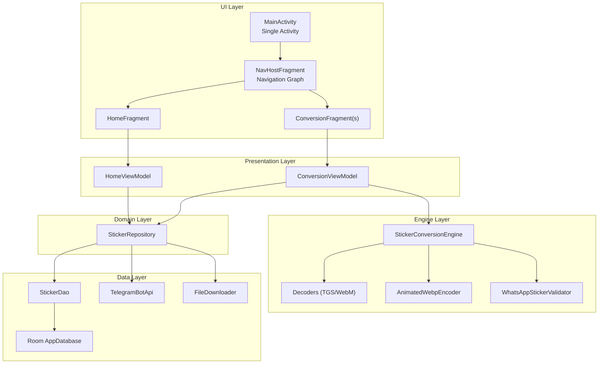
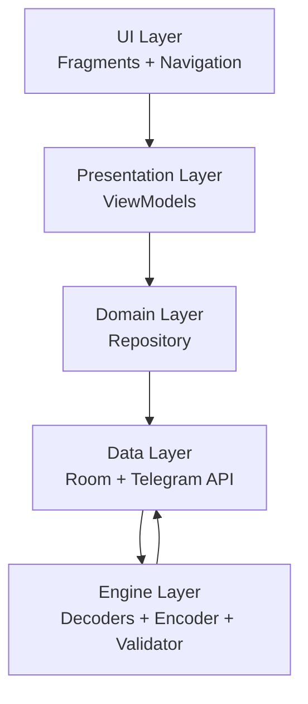
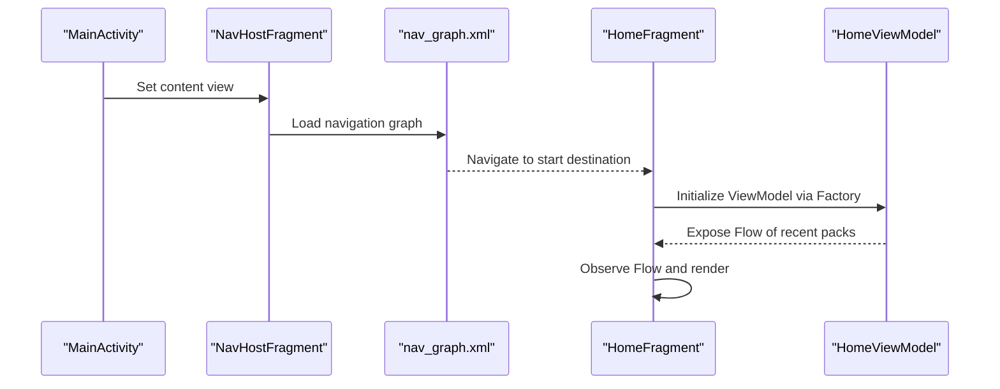
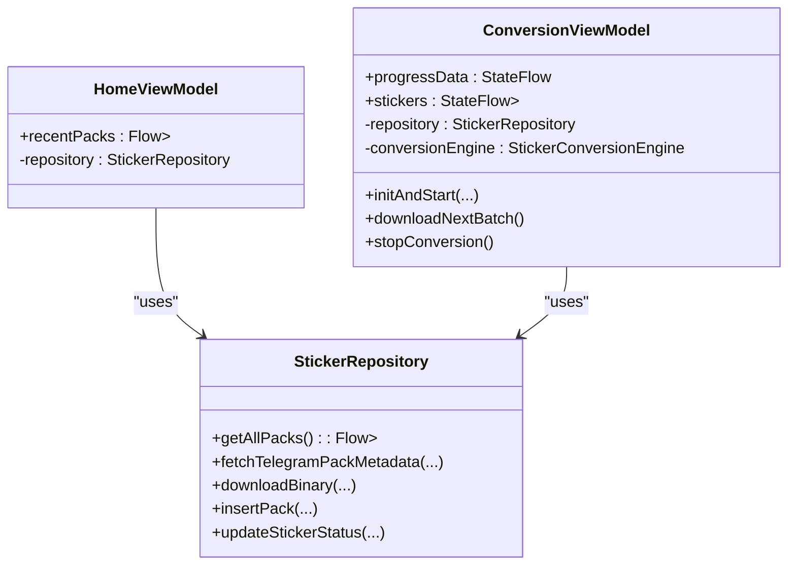
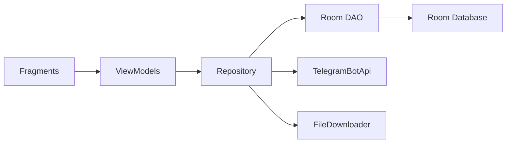
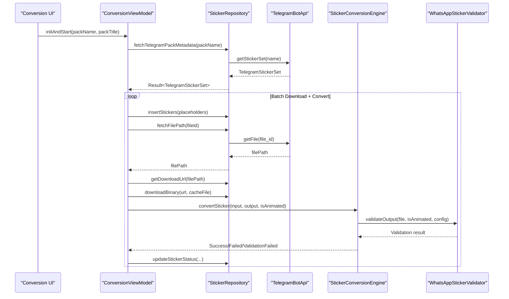
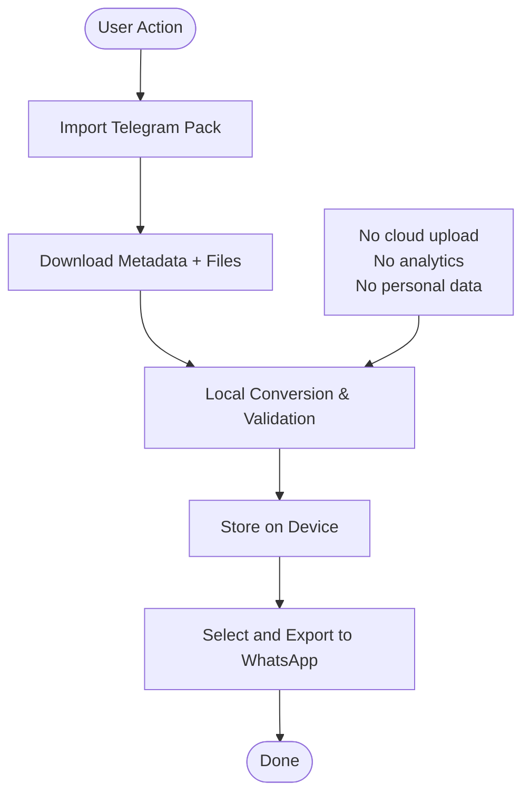
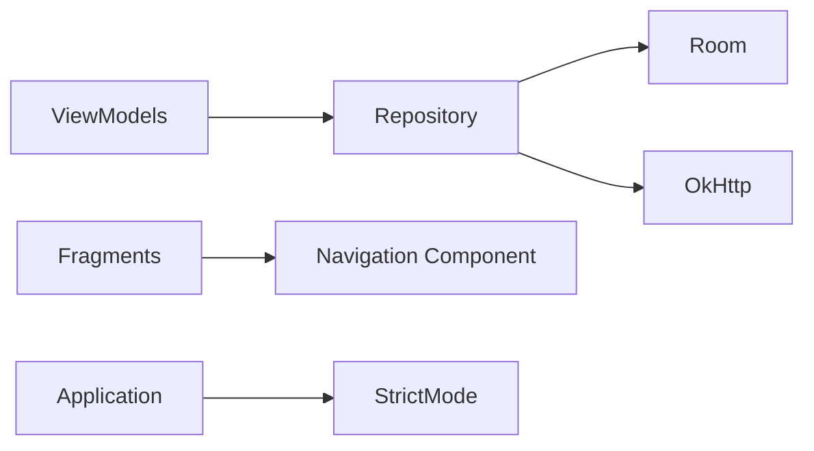

# Overall System Architecture

<cite>
**Referenced Files in This Document**
- [MainActivity.kt](file://app/src/main/java/com/maheshsharan/tel2what/MainActivity.kt)
- [activity_main.xml](file://app/src/main/res/layout/activity_main.xml)
- [nav_graph.xml](file://app/src/main/res/navigation/nav_graph.xml)
- [Tel2WhatApplication.kt](file://app/src/main/java/com/maheshsharan/tel2what/Tel2WhatApplication.kt)
- [HomeFragment.kt](file://app/src/main/java/com/maheshsharan/tel2what/ui/home/HomeFragment.kt)
- [HomeViewModel.kt](file://app/src/main/java/com/maheshsharan/tel2what/ui/home/HomeViewModel.kt)
- [ConversionViewModel.kt](file://app/src/main/java/com/maheshsharan/tel2what/ui/conversion/ConversionViewModel.kt)
- [StickerRepository.kt](file://app/src/main/java/com/maheshsharan/tel2what/data/repository/StickerRepository.kt)
- [AppDatabase.kt](file://app/src/main/java/com/maheshsharan/tel2what/data/local/AppDatabase.kt)
- [TelegramBotApi.kt](file://app/src/main/java/com/maheshsharan/tel2what/data/network/TelegramBotApi.kt)
- [StickerConversionEngine.kt](file://app/src/main/java/com/maheshsharan/tel2what/engine/StickerConversionEngine.kt)
- [WhatsAppStickerValidator.kt](file://app/src/main/java/com/maheshsharan/tel2what/engine/WhatsAppStickerValidator.kt)
- [AndroidManifest.xml](file://app/src/main/AndroidManifest.xml)
- [README.md](file://README.md)
- [privacy-policy.html](file://docs/privacy-policy.html)
</cite>

## Table of Contents
1. [Introduction](#introduction)
2. [Project Structure](#project-structure)
3. [Core Components](#core-components)
4. [Architecture Overview](#architecture-overview)
5. [Detailed Component Analysis](#detailed-component-analysis)
6. [Dependency Analysis](#dependency-analysis)
7. [Performance Considerations](#performance-considerations)
8. [Troubleshooting Guide](#troubleshooting-guide)
9. [Conclusion](#conclusion)

## Introduction
This document describes the overall system architecture of Tel2What, a Telegram to WhatsApp sticker converter. The application follows a single-activity architecture with fragment-based navigation, an MVVM pattern with ViewModels managing UI state and business logic, and a layered design separating UI, business logic, and data. It emphasizes offline-first processing and privacy-focused operations, performing all conversions and validations locally on-device.

## Project Structure
The project is organized into distinct layers:
- UI layer: Activities and Fragments with Navigation Component
- Presentation layer: ViewModels implementing MVVM
- Domain/business layer: Repository coordinating business logic
- Data layer: Room database, Telegram APIs, and file/network utilities
- Engine layer: Native and specialized media processing pipelines
- Utilities: Shared helpers and validators

**Diagram sources**
- [MainActivity.kt](file://app/src/main/java/com/maheshsharan/tel2what/MainActivity.kt#L6-L12)
- [activity_main.xml](file://app/src/main/res/layout/activity_main.xml#L8-L14)
- [nav_graph.xml](file://app/src/main/res/navigation/nav_graph.xml#L1-L122)
- [HomeFragment.kt](file://app/src/main/java/com/maheshsharan/tel2what/ui/home/HomeFragment.kt#L20-L92)
- [HomeViewModel.kt](file://app/src/main/java/com/maheshsharan/tel2what/ui/home/HomeViewModel.kt#L8-L14)
- [ConversionViewModel.kt](file://app/src/main/java/com/maheshsharan/tel2what/ui/conversion/ConversionViewModel.kt#L39-L442)
- [StickerRepository.kt](file://app/src/main/java/com/maheshsharan/tel2what/data/repository/StickerRepository.kt#L10-L79)
- [AppDatabase.kt](file://app/src/main/java/com/maheshsharan/tel2what/data/local/AppDatabase.kt#L13-L41)
- [TelegramBotApi.kt](file://app/src/main/java/com/maheshsharan/tel2what/data/network/TelegramBotApi.kt#L14-L111)
- [StickerConversionEngine.kt](file://app/src/main/java/com/maheshsharan/tel2what/engine/StickerConversionEngine.kt#L17-L274)

**Section sources**
- [README.md](file://README.md#L98-L110)

## Core Components
- Single-Activity Container: MainActivity inflates a FragmentContainerView hosting NavHostFragment.
- Navigation Graph: nav_graph.xml defines the navigation flow among fragments.
- Fragment Responsibilities: Each fragment initializes its ViewModel via a Factory and observes state via Flows.
- MVVM: ViewModels expose StateFlow/Flow to the UI and encapsulate business logic.
- Repository Pattern: StickerRepository mediates between DAO, Telegram API, and FileDownloader.
- Local-Only Processing: Room database stores sticker packs and metadata; conversion runs entirely on-device.

**Section sources**
- [MainActivity.kt](file://app/src/main/java/com/maheshsharan/tel2what/MainActivity.kt#L6-L12)
- [activity_main.xml](file://app/src/main/res/layout/activity_main.xml#L8-L14)
- [nav_graph.xml](file://app/src/main/res/navigation/nav_graph.xml#L1-L122)
- [HomeFragment.kt](file://app/src/main/java/com/maheshsharan/tel2what/ui/home/HomeFragment.kt#L20-L92)
- [HomeViewModel.kt](file://app/src/main/java/com/maheshsharan/tel2what/ui/home/HomeViewModel.kt#L8-L24)
- [ConversionViewModel.kt](file://app/src/main/java/com/maheshsharan/tel2what/ui/conversion/ConversionViewModel.kt#L39-L442)
- [StickerRepository.kt](file://app/src/main/java/com/maheshsharan/tel2what/data/repository/StickerRepository.kt#L10-L79)
- [AppDatabase.kt](file://app/src/main/java/com/maheshsharan/tel2what/data/local/AppDatabase.kt#L13-L41)

## Architecture Overview
Tel2What employs a layered architecture:
- UI Layer: Fragments and Activities driven by Navigation Component
- Presentation Layer: ViewModels manage UI state and orchestrate work
- Domain Layer: Repository coordinates data access and business rules
- Data Layer: Room for persistence, TelegramBotApi for remote metadata and files
- Engine Layer: Specialized decoders, encoders, and validators for media processing

**Diagram sources**
- [HomeFragment.kt](file://app/src/main/java/com/maheshsharan/tel2what/ui/home/HomeFragment.kt#L20-L92)
- [HomeViewModel.kt](file://app/src/main/java/com/maheshsharan/tel2what/ui/home/HomeViewModel.kt#L8-L14)
- [ConversionViewModel.kt](file://app/src/main/java/com/maheshsharan/tel2what/ui/conversion/ConversionViewModel.kt#L39-L442)
- [StickerRepository.kt](file://app/src/main/java/com/maheshsharan/tel2what/data/repository/StickerRepository.kt#L10-L79)
- [AppDatabase.kt](file://app/src/main/java/com/maheshsharan/tel2what/data/local/AppDatabase.kt#L13-L41)
- [TelegramBotApi.kt](file://app/src/main/java/com/maheshsharan/tel2what/data/network/TelegramBotApi.kt#L14-L111)
- [StickerConversionEngine.kt](file://app/src/main/java/com/maheshsharan/tel2what/engine/StickerConversionEngine.kt#L17-L274)

## Detailed Component Analysis

### Single-Activity and Fragment-Based Navigation
- MainActivity hosts a FragmentContainerView configured as NavHost with nav_graph.
- nav_graph.xml defines the start destination and actions between fragments.
- Fragments observe ViewModel state and navigate declaratively via NavController.

**Diagram sources**
- [MainActivity.kt](file://app/src/main/java/com/maheshsharan/tel2what/MainActivity.kt#L6-L12)
- [activity_main.xml](file://app/src/main/res/layout/activity_main.xml#L8-L14)
- [nav_graph.xml](file://app/src/main/res/navigation/nav_graph.xml#L1-L122)
- [HomeFragment.kt](file://app/src/main/java/com/maheshsharan/tel2what/ui/home/HomeFragment.kt#L20-L92)
- [HomeViewModel.kt](file://app/src/main/java/com/maheshsharan/tel2what/ui/home/HomeViewModel.kt#L8-L14)

**Section sources**
- [MainActivity.kt](file://app/src/main/java/com/maheshsharan/tel2what/MainActivity.kt#L6-L12)
- [activity_main.xml](file://app/src/main/res/layout/activity_main.xml#L8-L14)
- [nav_graph.xml](file://app/src/main/res/navigation/nav_graph.xml#L1-L122)

### MVVM Implementation with ViewModels
- HomeViewModel exposes a Flow of sticker packs from the repository and sorts them by date.
- ConversionViewModel manages conversion progress, batch processing, and state updates.
- Both use ViewModelProvider.Factory for construction and lifecycle-aware coroutine scopes.

**Diagram sources**
- [HomeViewModel.kt](file://app/src/main/java/com/maheshsharan/tel2what/ui/home/HomeViewModel.kt#L8-L24)
- [ConversionViewModel.kt](file://app/src/main/java/com/maheshsharan/tel2what/ui/conversion/ConversionViewModel.kt#L39-L442)
- [StickerRepository.kt](file://app/src/main/java/com/maheshsharan/tel2what/data/repository/StickerRepository.kt#L10-L79)

**Section sources**
- [HomeViewModel.kt](file://app/src/main/java/com/maheshsharan/tel2what/ui/home/HomeViewModel.kt#L8-L24)
- [ConversionViewModel.kt](file://app/src/main/java/com/maheshsharan/tel2what/ui/conversion/ConversionViewModel.kt#L39-L442)

### Layered Architecture: UI, Business Logic, Data
- UI: Fragments inflate layouts and bind to ViewModels.
- Business Logic: Repository encapsulates domain rules and orchestrates data sources.
- Data: Room DAO persists packs and stickers; TelegramBotApi retrieves metadata and files.

**Diagram sources**
- [HomeFragment.kt](file://app/src/main/java/com/maheshsharan/tel2what/ui/home/HomeFragment.kt#L20-L92)
- [StickerRepository.kt](file://app/src/main/java/com/maheshsharan/tel2what/data/repository/StickerRepository.kt#L10-L79)
- [AppDatabase.kt](file://app/src/main/java/com/maheshsharan/tel2what/data/local/AppDatabase.kt#L13-L41)
- [TelegramBotApi.kt](file://app/src/main/java/com/maheshsharan/tel2what/data/network/TelegramBotApi.kt#L14-L111)

**Section sources**
- [HomeFragment.kt](file://app/src/main/java/com/maheshsharan/tel2what/ui/home/HomeFragment.kt#L20-L92)
- [StickerRepository.kt](file://app/src/main/java/com/maheshsharan/tel2what/data/repository/StickerRepository.kt#L10-L79)
- [AppDatabase.kt](file://app/src/main/java/com/maheshsharan/tel2what/data/local/AppDatabase.kt#L13-L41)
- [TelegramBotApi.kt](file://app/src/main/java/com/maheshsharan/tel2what/data/network/TelegramBotApi.kt#L14-L111)

### Conversion Workflow and Media Processing
- ConversionViewModel drives batched downloads and conversions.
- StickerConversionEngine selects pipeline based on input type and pack characteristics.
- WhatsAppStickerValidator enforces size and dimension constraints.

**Diagram sources**
- [ConversionViewModel.kt](file://app/src/main/java/com/maheshsharan/tel2what/ui/conversion/ConversionViewModel.kt#L66-L329)
- [StickerRepository.kt](file://app/src/main/java/com/maheshsharan/tel2what/data/repository/StickerRepository.kt#L24-L30)
- [TelegramBotApi.kt](file://app/src/main/java/com/maheshsharan/tel2what/data/network/TelegramBotApi.kt#L22-L111)
- [StickerConversionEngine.kt](file://app/src/main/java/com/maheshsharan/tel2what/engine/StickerConversionEngine.kt#L33-L88)
- [WhatsAppStickerValidator.kt](file://app/src/main/java/com/maheshsharan/tel2what/engine/WhatsAppStickerValidator.kt#L14-L70)

**Section sources**
- [ConversionViewModel.kt](file://app/src/main/java/com/maheshsharan/tel2what/ui/conversion/ConversionViewModel.kt#L66-L329)
- [StickerConversionEngine.kt](file://app/src/main/java/com/maheshsharan/tel2what/engine/StickerConversionEngine.kt#L33-L88)
- [WhatsAppStickerValidator.kt](file://app/src/main/java/com/maheshsharan/tel2what/engine/WhatsAppStickerValidator.kt#L14-L70)

### Offline-First Design and Privacy
- Offline-first: After initial Telegram metadata and file retrieval, subsequent operations (conversion, validation, selection, export) run locally.
- Privacy: The app does not collect personal data, operates without analytics, and keeps all processed stickers on-device.
- Manifest permissions are minimal and scoped to core functionality.

**Diagram sources**
- [README.md](file://README.md#L11-L19)
- [privacy-policy.html](file://docs/privacy-policy.html#L46-L69)
- [AndroidManifest.xml](file://app/src/main/AndroidManifest.xml#L3-L9)

**Section sources**
- [README.md](file://README.md#L11-L19)
- [privacy-policy.html](file://docs/privacy-policy.html#L46-L69)
- [AndroidManifest.xml](file://app/src/main/AndroidManifest.xml#L3-L9)

## Dependency Analysis
Key dependencies and their roles:
- Room: Local persistence for sticker packs and stickers
- OkHttp: Network client for Telegram API
- Kotlin Coroutines + Flow: Reactive state management in ViewModels
- Navigation Component: Declarative navigation between fragments
- StrictMode: Development-time strictness for detecting violations

**Diagram sources**
- [AppDatabase.kt](file://app/src/main/java/com/maheshsharan/tel2what/data/local/AppDatabase.kt#L13-L41)
- [TelegramBotApi.kt](file://app/src/main/java/com/maheshsharan/tel2what/data/network/TelegramBotApi.kt#L14-L111)
- [Tel2WhatApplication.kt](file://app/src/main/java/com/maheshsharan/tel2what/Tel2WhatApplication.kt#L7-L44)
- [HomeFragment.kt](file://app/src/main/java/com/maheshsharan/tel2what/ui/home/HomeFragment.kt#L20-L92)

**Section sources**
- [AppDatabase.kt](file://app/src/main/java/com/maheshsharan/tel2what/data/local/AppDatabase.kt#L13-L41)
- [TelegramBotApi.kt](file://app/src/main/java/com/maheshsharan/tel2what/data/network/TelegramBotApi.kt#L14-L111)
- [Tel2WhatApplication.kt](file://app/src/main/java/com/maheshsharan/tel2what/Tel2WhatApplication.kt#L7-L44)

## Performance Considerations
- Concurrency control: Semaphores limit parallel animated processing to prevent thermal throttling and OOM; static processing allows higher concurrency.
- Adaptive compression: Animated pipeline reduces FPS or quality to meet size targets.
- Memory hygiene: Bitmaps are recycled promptly; caches are cleaned post-processing.
- Native encoding: JNI-backed libwebp accelerates WebP encoding for fast conversion times.

[No sources needed since this section provides general guidance]

## Troubleshooting Guide
Common issues and mitigations:
- Telegram API errors: Invalid token, rate limits, or missing packs. The API layer surfaces descriptive errors for 401/404/400 cases.
- Network connectivity: UnknownHostException is handled gracefully with user-facing messages.
- Conversion failures: ConversionViewModel and engine log detailed reasons; validation failures return explicit messages.
- Lifecycle: ViewModels cancel child coroutines on cleared; ensure UI observes flows within lifecycle owners.

**Section sources**
- [TelegramBotApi.kt](file://app/src/main/java/com/maheshsharan/tel2what/data/network/TelegramBotApi.kt#L34-L73)
- [ConversionViewModel.kt](file://app/src/main/java/com/maheshsharan/tel2what/ui/conversion/ConversionViewModel.kt#L408-L441)
- [StickerConversionEngine.kt](file://app/src/main/java/com/maheshsharan/tel2what/engine/StickerConversionEngine.kt#L266-L273)

## Conclusion
Tel2What’s architecture centers on a single-activity, fragment-driven UI with MVVM and a layered design. The system is offline-first and privacy-focused, performing all processing locally while leveraging a robust media conversion pipeline. The modular structure, combined with reactive state management and strict lifecycle handling, yields a responsive, maintainable, and trustworthy application.