# UI and Navigation Architecture

<cite>
**Referenced Files in This Document**
- [nav_graph.xml](file://app/src/main/res/navigation/nav_graph.xml)
- [activity_main.xml](file://app/src/main/res/layout/activity_main.xml)
- [bottom_nav_menu.xml](file://app/src/main/res/menu/bottom_nav_menu.xml)
- [MainActivity.kt](file://app/src/main/java/com/maheshsharan/tel2what/MainActivity.kt)
- [SplashFragment.kt](file://app/src/main/java/com/maheshsharan/tel2what/ui/splash/SplashFragment.kt)
- [OnboardingFragment.kt](file://app/src/main/java/com/maheshsharan/tel2what/ui/onboarding/OnboardingFragment.kt)
- [HomeFragment.kt](file://app/src/main/java/com/maheshsharan/tel2what/ui/home/HomeFragment.kt)
- [TelegramImportFragment.kt](file://app/src/main/java/com/maheshsharan/tel2what/ui/importpack/TelegramImportFragment.kt)
- [DownloadConversionFragment.kt](file://app/src/main/java/com/maheshsharan/tel2what/ui/conversion/DownloadConversionFragment.kt)
- [StickerSelectionFragment.kt](file://app/src/main/java/com/maheshsharan/tel2what/ui/selection/StickerSelectionFragment.kt)
- [TrayIconSelectionFragment.kt](file://app/src/main/java/com/maheshsharan/tel2what/ui/trayicon/TrayIconSelectionFragment.kt)
- [ExportFragment.kt](file://app/src/main/java/com/maheshsharan/tel2what/ui/export/ExportFragment.kt)
- [ManualUploadFragment.kt](file://app/src/main/java/com/maheshsharan/tel2what/ui/manual/ManualUploadFragment.kt)
- [StorageManagementFragment.kt](file://app/src/main/java/com/maheshsharan/tel2what/ui/storage/StorageManagementFragment.kt)
- [SettingsFragment.kt](file://app/src/main/java/com/maheshsharan/tel2what/ui/settings/SettingsFragment.kt)
</cite>

## Table of Contents
1. [Introduction](#introduction)
2. [Project Structure](#project-structure)
3. [Core Components](#core-components)
4. [Architecture Overview](#architecture-overview)
5. [Detailed Component Analysis](#detailed-component-analysis)
6. [Dependency Analysis](#dependency-analysis)
7. [Performance Considerations](#performance-considerations)
8. [Troubleshooting Guide](#troubleshooting-guide)
9. [Conclusion](#conclusion)

## Introduction
This document explains the UI and navigation architecture of Tel2What, focusing on the Navigation Component implementation, the navigation graph, and the user journeys across import, conversion, selection, and export. It also covers fragment lifecycle management, state preservation, memory optimization, bottom navigation integration, back stack behavior, onboarding and splash handling, and fragment-to-fragment communication via safe args and shared view models. Deep linking and navigation patterns are addressed conceptually, along with practical guidance for extending the system.

## Project Structure
The app uses Android’s Navigation Component with a single-activity architecture. The NavHost is declared in the activity layout and bound to a navigation graph that defines all screens and transitions. Feature fragments are organized under dedicated packages for import, conversion, selection, export, storage, settings, onboarding, home, and splash.

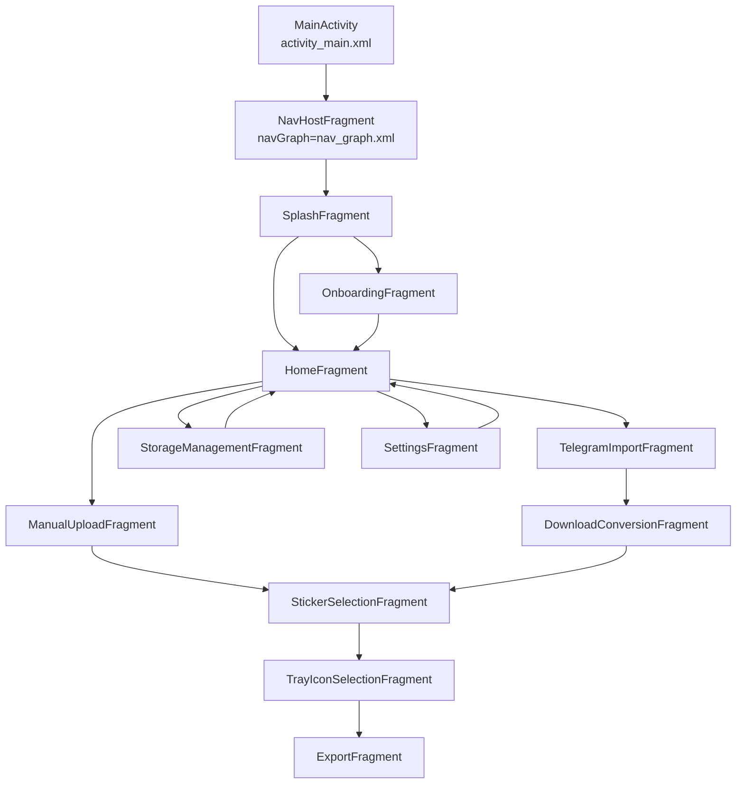

**Diagram sources**
- [activity_main.xml](file://app/src/main/res/layout/activity_main.xml#L8-L14)
- [nav_graph.xml](file://app/src/main/res/navigation/nav_graph.xml#L1-L122)

**Section sources**
- [activity_main.xml](file://app/src/main/res/layout/activity_main.xml#L1-L16)
- [nav_graph.xml](file://app/src/main/res/navigation/nav_graph.xml#L1-L122)

## Core Components
- Navigation Graph: Central definition of all destinations and actions, including start destination and back stack behavior.
- NavHost: Hosts the navigation container and binds to the navigation graph.
- Fragments: Feature-specific screens implementing UI and navigation actions.
- Bottom Navigation: Integrated in HomeFragment to switch between primary destinations.
- ViewModel Factories: Provide repositories and context to view models per feature.

Key responsibilities:
- Navigation Graph: Defines user flows, transitions, and back stack policies.
- NavHost: Manages fragment transactions and back stack.
- Fragments: Handle UI, observe view models, and trigger navigation.
- Bottom Navigation: Provides quick access to secondary destinations from Home.

**Section sources**
- [nav_graph.xml](file://app/src/main/res/navigation/nav_graph.xml#L1-L122)
- [activity_main.xml](file://app/src/main/res/layout/activity_main.xml#L8-L14)
- [HomeFragment.kt](file://app/src/main/java/com/maheshsharan/tel2what/ui/home/HomeFragment.kt#L82-L97)

## Architecture Overview
The navigation architecture follows a layered pattern:
- Activity hosts the NavHost.
- NavHost delegates to the navigation graph.
- Graph defines destinations and actions.
- Fragments implement UI and call findNavController().navigate or navigateUp().
- Bottom navigation triggers navigation actions directly.

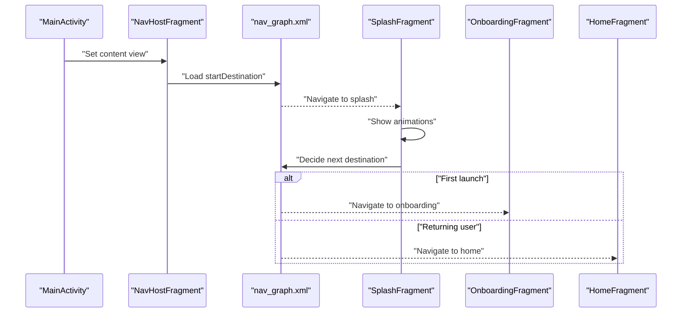

**Diagram sources**
- [MainActivity.kt](file://app/src/main/java/com/maheshsharan/tel2what/MainActivity.kt#L6-L11)
- [activity_main.xml](file://app/src/main/res/layout/activity_main.xml#L8-L14)
- [nav_graph.xml](file://app/src/main/res/navigation/nav_graph.xml#L6-L24)
- [SplashFragment.kt](file://app/src/main/java/com/maheshsharan/tel2what/ui/splash/SplashFragment.kt#L63-L76)

## Detailed Component Analysis

### Navigation Graph and User Flows
The navigation graph defines:
- Start destination: splashFragment.
- Conditional routing after splash based on onboarding completion.
- Hierarchical flows: import → conversion → selection → tray icon → export.
- Bottom navigation shortcuts from home to storage and settings.
- Back stack behavior using popUpTo and popUpToInclusive to avoid redundant entries.

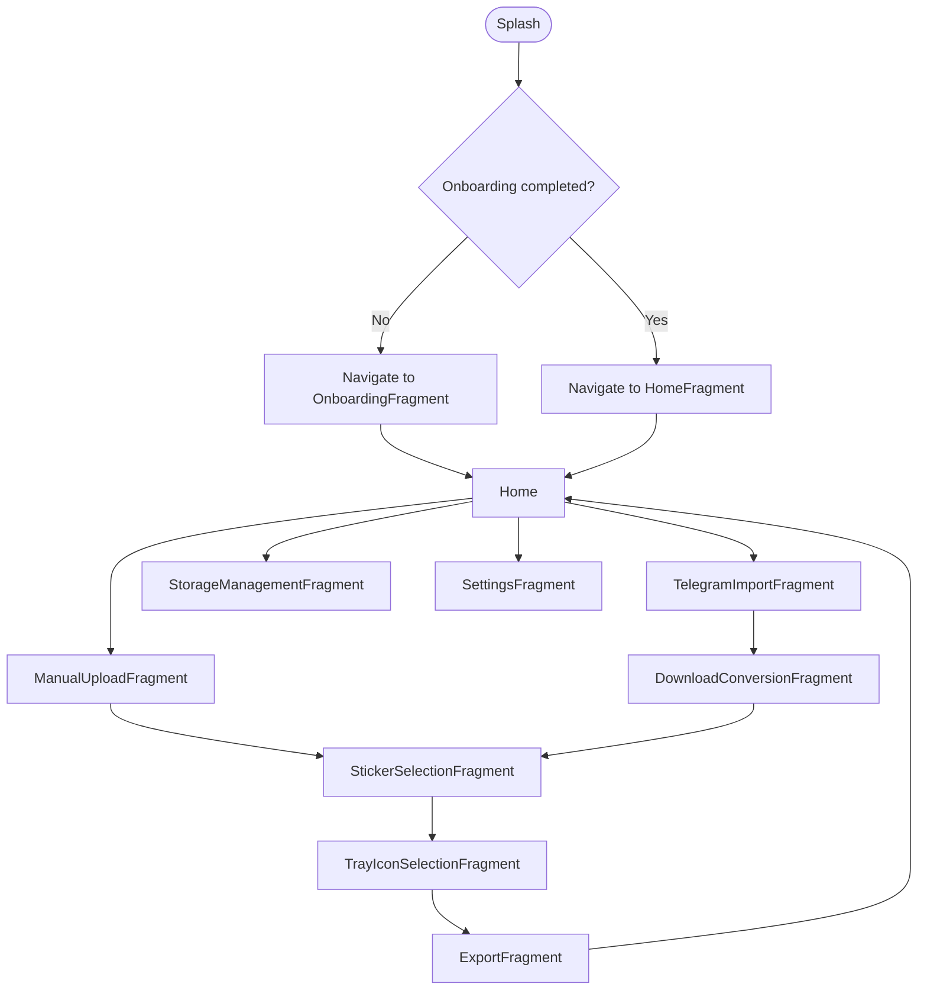

**Diagram sources**
- [nav_graph.xml](file://app/src/main/res/navigation/nav_graph.xml#L6-L122)

**Section sources**
- [nav_graph.xml](file://app/src/main/res/navigation/nav_graph.xml#L1-L122)

### Splash Screen Handling
- Animates UI elements progressively.
- Waits briefly, then checks a shared preference to decide next destination.
- Navigates either to onboarding or home based on onboarding completion.

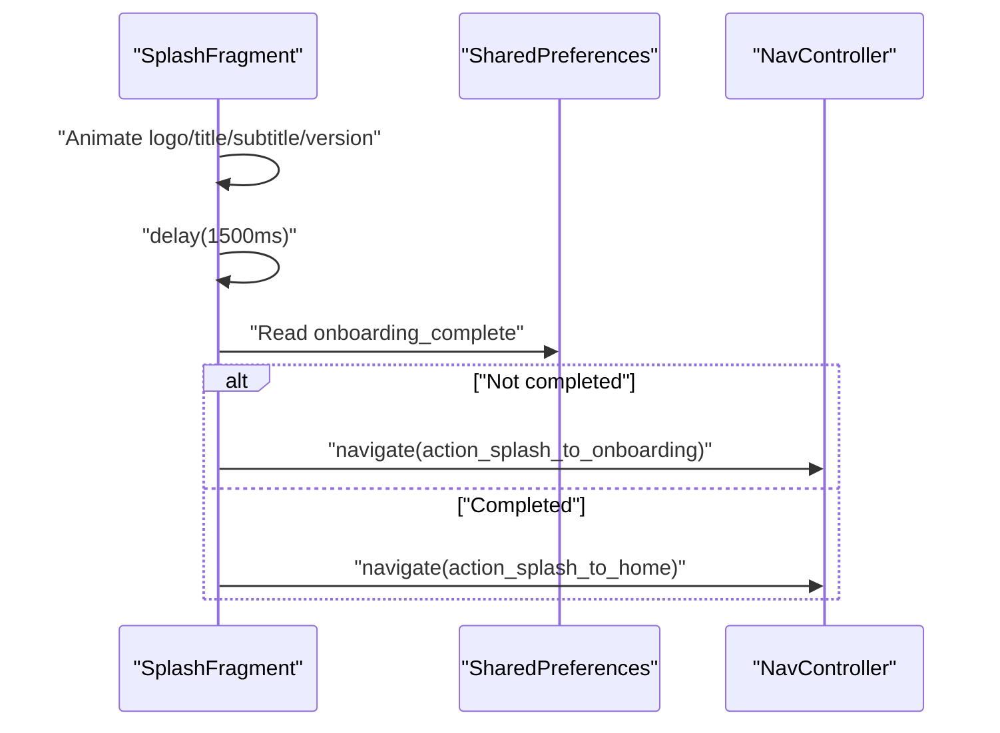

**Diagram sources**
- [SplashFragment.kt](file://app/src/main/java/com/maheshsharan/tel2what/ui/splash/SplashFragment.kt#L63-L76)
- [nav_graph.xml](file://app/src/main/res/navigation/nav_graph.xml#L13-L23)

**Section sources**
- [SplashFragment.kt](file://app/src/main/java/com/maheshsharan/tel2what/ui/splash/SplashFragment.kt#L1-L79)

### Onboarding Flow
- ViewPager2 pages guide the user through three steps.
- Next button switches pages or completes onboarding.
- Completing onboarding writes a flag and navigates to home.

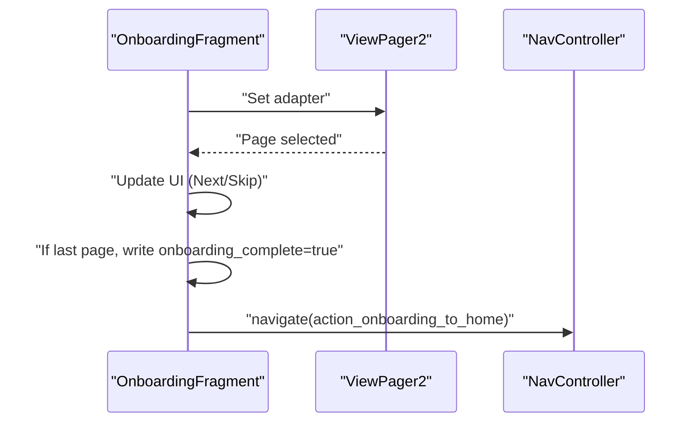

**Diagram sources**
- [OnboardingFragment.kt](file://app/src/main/java/com/maheshsharan/tel2what/ui/onboarding/OnboardingFragment.kt#L35-L67)
- [nav_graph.xml](file://app/src/main/res/navigation/nav_graph.xml#L31-L35)

**Section sources**
- [OnboardingFragment.kt](file://app/src/main/java/com/maheshsharan/tel2what/ui/onboarding/OnboardingFragment.kt#L1-L69)

### Home Fragment and Bottom Navigation
- Initializes ViewModel with repository and network clients.
- Sets up recent packs list and bottom navigation item selection.
- Bottom navigation routes to storage and settings; home remains selected.

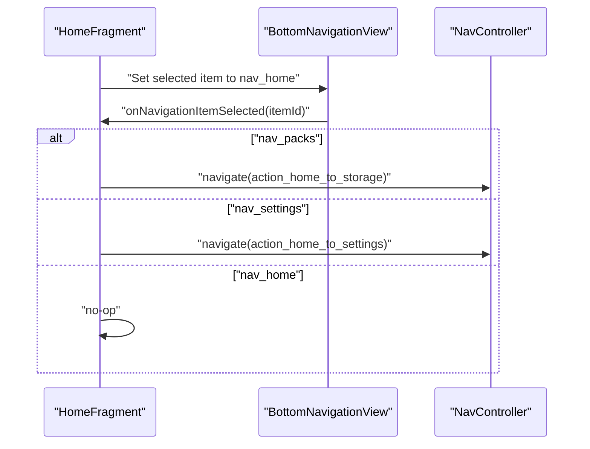

**Diagram sources**
- [HomeFragment.kt](file://app/src/main/java/com/maheshsharan/tel2what/ui/home/HomeFragment.kt#L82-L97)
- [bottom_nav_menu.xml](file://app/src/main/res/menu/bottom_nav_menu.xml#L1-L15)

**Section sources**
- [HomeFragment.kt](file://app/src/main/java/com/maheshsharan/tel2what/ui/home/HomeFragment.kt#L1-L106)
- [bottom_nav_menu.xml](file://app/src/main/res/menu/bottom_nav_menu.xml#L1-L15)

### Telegram Import Flow
- Accepts a Telegram sticker pack link, fetches metadata, and previews details.
- Supports clipboard paste and focus change to trigger fetch.
- On success, passes pack metadata via arguments to conversion.

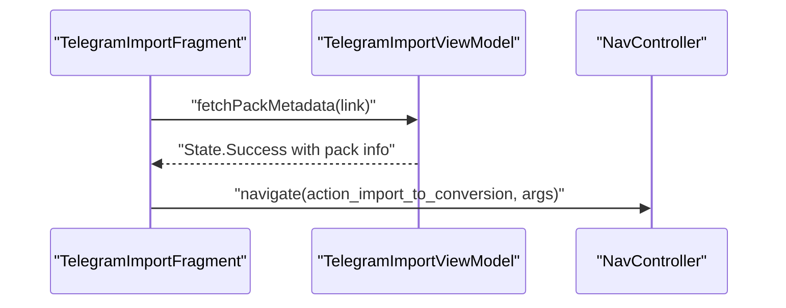

**Diagram sources**
- [TelegramImportFragment.kt](file://app/src/main/java/com/maheshsharan/tel2what/ui/importpack/TelegramImportFragment.kt#L94-L151)
- [nav_graph.xml](file://app/src/main/res/navigation/nav_graph.xml#L60-L62)

**Section sources**
- [TelegramImportFragment.kt](file://app/src/main/java/com/maheshsharan/tel2what/ui/importpack/TelegramImportFragment.kt#L1-L154)

### Conversion and Batch Progress
- Receives pack metadata from import.
- Observes progress and updates UI (ETA, speed, percentage).
- Enables “download more” and “continue” based on thresholds.
- Uses navigateUp() for back navigation.

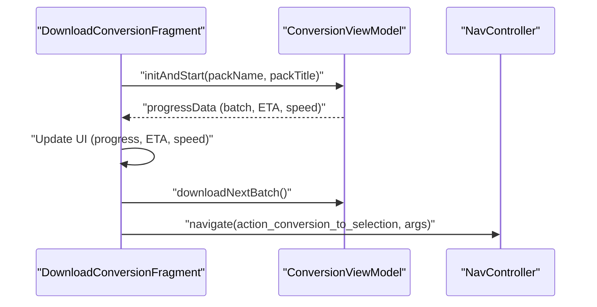

**Diagram sources**
- [DownloadConversionFragment.kt](file://app/src/main/java/com/maheshsharan/tel2what/ui/conversion/DownloadConversionFragment.kt#L62-L124)
- [nav_graph.xml](file://app/src/main/res/navigation/nav_graph.xml#L69-L72)

**Section sources**
- [DownloadConversionFragment.kt](file://app/src/main/java/com/maheshsharan/tel2what/ui/conversion/DownloadConversionFragment.kt#L1-L139)

### Sticker Selection
- Loads stickers for a given pack and allows selection.
- Enforces selection bounds (3–30).
- Passes selected IDs to tray icon selection.

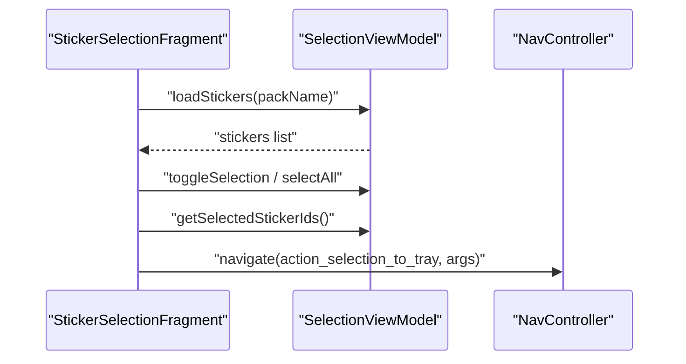

**Diagram sources**
- [StickerSelectionFragment.kt](file://app/src/main/java/com/maheshsharan/tel2what/ui/selection/StickerSelectionFragment.kt#L53-L91)
- [nav_graph.xml](file://app/src/main/res/navigation/nav_graph.xml#L78-L81)

**Section sources**
- [StickerSelectionFragment.kt](file://app/src/main/java/com/maheshsharan/tel2what/ui/selection/StickerSelectionFragment.kt#L1-L93)

### Tray Icon Selection and Customization
- Presents tray icon options and allows selecting a custom image.
- Processes and saves the custom tray icon to app storage.
- Navigates to export upon successful save or skips to export.

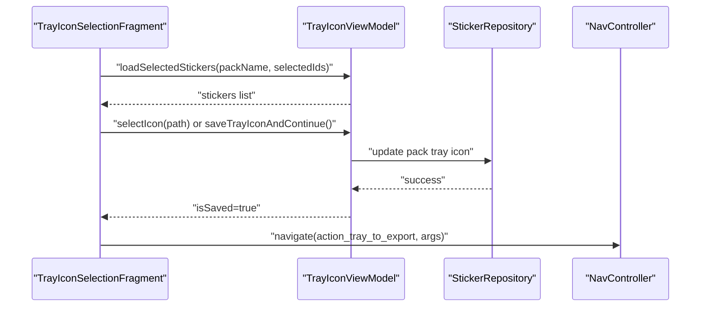

**Diagram sources**
- [TrayIconSelectionFragment.kt](file://app/src/main/java/com/maheshsharan/tel2what/ui/trayicon/TrayIconSelectionFragment.kt#L71-L119)
- [nav_graph.xml](file://app/src/main/res/navigation/nav_graph.xml#L87-L90)

**Section sources**
- [TrayIconSelectionFragment.kt](file://app/src/main/java/com/maheshsharan/tel2what/ui/trayicon/TrayIconSelectionFragment.kt#L1-L164)

### Export and WhatsApp Integration
- Loads pack details and displays tray preview.
- Validates required fields and updates pack metadata.
- Launches WhatsApp intent to enable the sticker pack and returns to home.

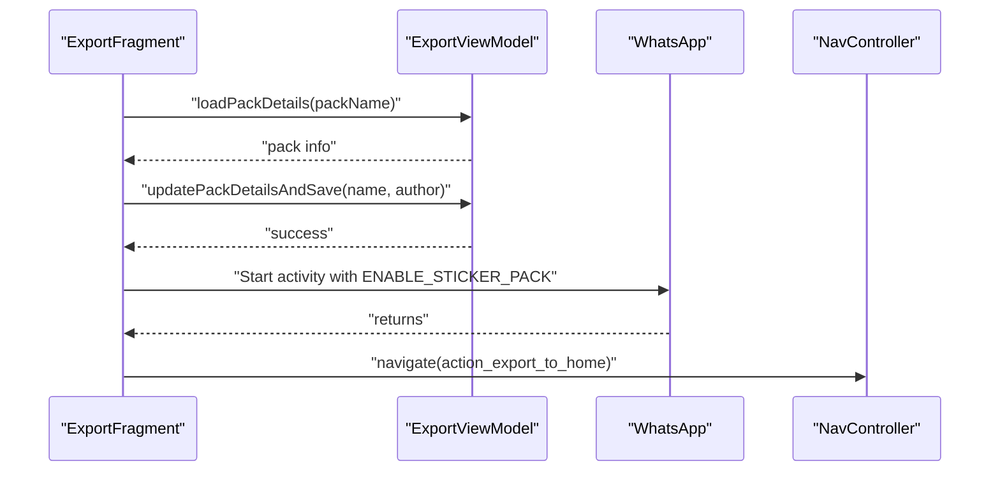

**Diagram sources**
- [ExportFragment.kt](file://app/src/main/java/com/maheshsharan/tel2what/ui/export/ExportFragment.kt#L87-L111)
- [nav_graph.xml](file://app/src/main/res/navigation/nav_graph.xml#L96-L100)

**Section sources**
- [ExportFragment.kt](file://app/src/main/java/com/maheshsharan/tel2what/ui/export/ExportFragment.kt#L1-L113)

### Manual Upload Flow
- Allows selecting up to 30 images.
- Processes files and navigates to selection upon success.

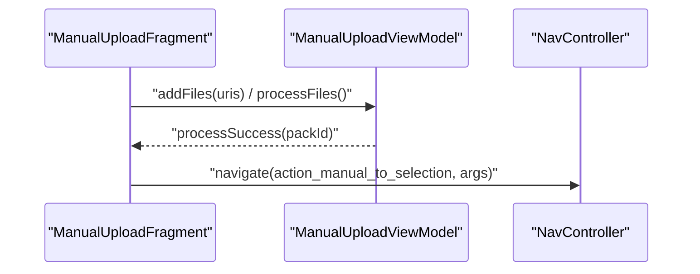

**Diagram sources**
- [ManualUploadFragment.kt](file://app/src/main/java/com/maheshsharan/tel2what/ui/manual/ManualUploadFragment.kt#L78-L88)
- [nav_graph.xml](file://app/src/main/res/navigation/nav_graph.xml#L107-L110)

**Section sources**
- [ManualUploadFragment.kt](file://app/src/main/java/com/maheshsharan/tel2what/ui/manual/ManualUploadFragment.kt#L1-L111)

### Storage Management
- Lists stored packs, supports clearing cache and deleting packs.
- Integrates with Glide disk cache and clears app cache safely.

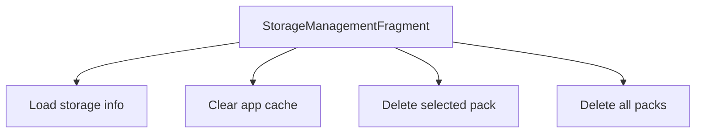

**Diagram sources**
- [StorageManagementFragment.kt](file://app/src/main/java/com/maheshsharan/tel2what/ui/storage/StorageManagementFragment.kt#L62-L106)

**Section sources**
- [StorageManagementFragment.kt](file://app/src/main/java/com/maheshsharan/tel2what/ui/storage/StorageManagementFragment.kt#L1-L118)

### Settings
- Opens external links for GitHub, privacy policy, terms, and licenses.
- Shows current app version.

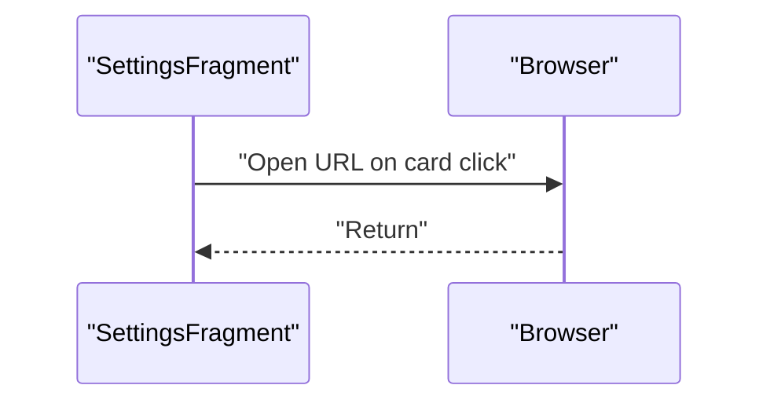

**Diagram sources**
- [SettingsFragment.kt](file://app/src/main/java/com/maheshsharan/tel2what/ui/settings/SettingsFragment.kt#L34-L58)

**Section sources**
- [SettingsFragment.kt](file://app/src/main/java/com/maheshsharan/tel2what/ui/settings/SettingsFragment.kt#L1-L60)

## Dependency Analysis
- Activity depends on NavHost and navigation graph.
- Fragments depend on view models and repositories.
- Navigation graph defines explicit dependencies between destinations.
- Bottom navigation is coupled to HomeFragment.

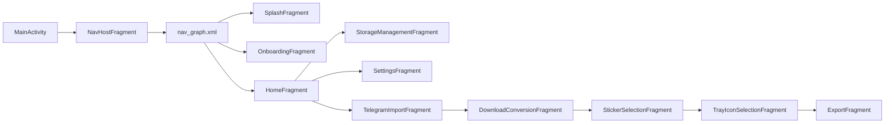

**Diagram sources**
- [activity_main.xml](file://app/src/main/res/layout/activity_main.xml#L8-L14)
- [nav_graph.xml](file://app/src/main/res/navigation/nav_graph.xml#L1-L122)

**Section sources**
- [activity_main.xml](file://app/src/main/res/layout/activity_main.xml#L1-L16)
- [nav_graph.xml](file://app/src/main/res/navigation/nav_graph.xml#L1-L122)

## Performance Considerations
- Lifecycle-aware observation: All fragments collect flows inside viewLifecycleOwner lifecycleScope to avoid leaks and unnecessary work.
- Adapter detachment: HomeFragment clears RecyclerView adapters in onDestroyView to prevent memory retention.
- Background work: Tray icon customization runs on Dispatchers.IO and updates UI on main thread.
- Cache management: Storage screen clears Glide disk cache and app cache safely.
- UI responsiveness: Buttons and cards are disabled during processing to avoid invalid states.

[No sources needed since this section provides general guidance]

## Troubleshooting Guide
- Navigation does not return to previous screen:
  - Ensure navigateUp() is used for back navigation in conversion and selection fragments.
- Bottom navigation not switching destinations:
  - Verify selectedItemId initialization and item selection listener logic in HomeFragment.
- Export not opening WhatsApp:
  - Confirm intent action and extras; handle ActivityNotFoundException gracefully.
- Onboarding not completing:
  - Check onboarding preference write and navigation action.
- Splash stuck or incorrect routing:
  - Validate onboarding preference read and navigation actions.

**Section sources**
- [HomeFragment.kt](file://app/src/main/java/com/maheshsharan/tel2what/ui/home/HomeFragment.kt#L82-L97)
- [ExportFragment.kt](file://app/src/main/java/com/maheshsharan/tel2what/ui/export/ExportFragment.kt#L98-L111)
- [OnboardingFragment.kt](file://app/src/main/java/com/maheshsharan/tel2what/ui/onboarding/OnboardingFragment.kt#L63-L67)
- [SplashFragment.kt](file://app/src/main/java/com/maheshsharan/tel2what/ui/splash/SplashFragment.kt#L67-L76)

## Conclusion
Tel2What’s UI and navigation architecture centers on a clear navigation graph, a single-activity NavHost setup, and modular fragments that encapsulate feature logic. The design emphasizes predictable user flows, robust back stack management, and lifecycle-safe UI updates. Bottom navigation complements the graph by offering quick access to secondary destinations. The system balances usability and performance through careful state observation, adapter cleanup, and background processing. Extending the architecture involves adding destinations to the navigation graph and wiring fragment actions while preserving existing patterns.