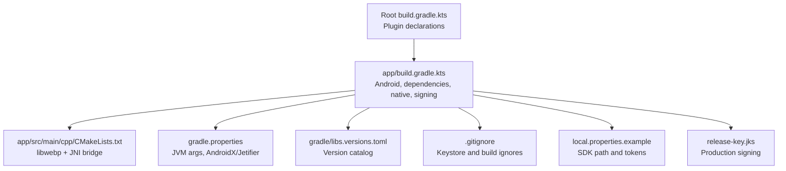
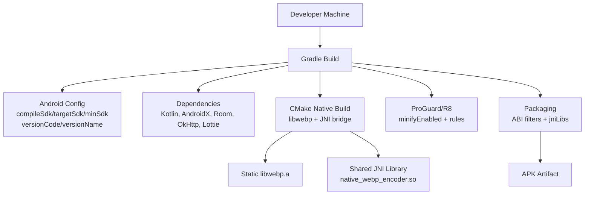
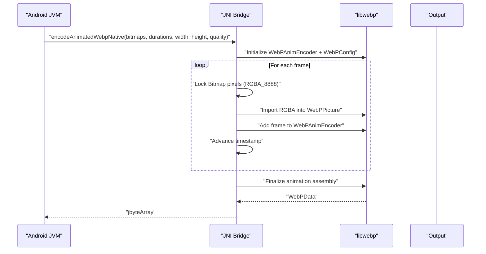
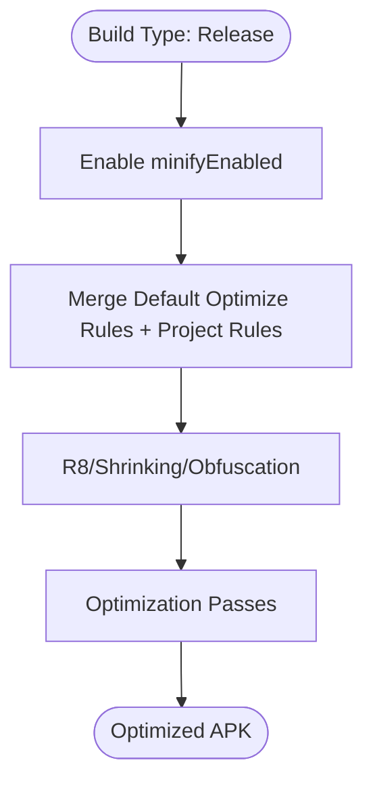
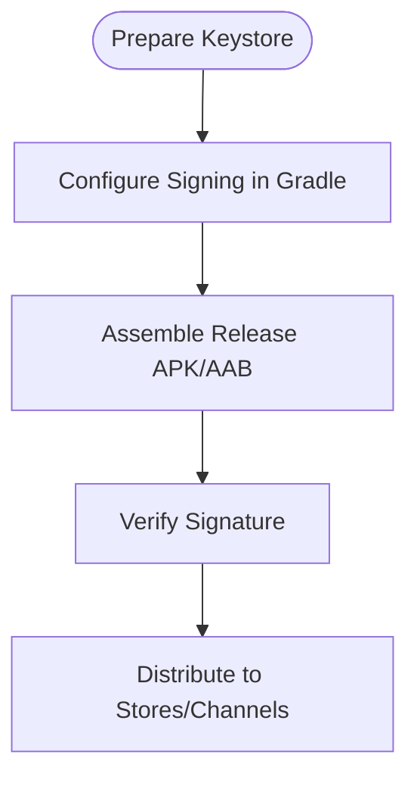
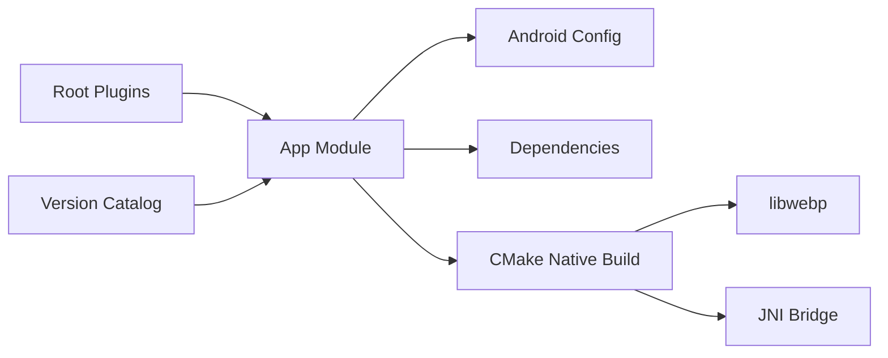

# Build and Deployment

<cite>
**Referenced Files in This Document**
- [build.gradle.kts](file://build.gradle.kts)
- [app/build.gradle.kts](file://app/build.gradle.kts)
- [settings.gradle.kts](file://settings.gradle.kts)
- [gradle.properties](file://gradle.properties)
- [gradle/libs.versions.toml](file://gradle/libs.versions.toml)
- [app/src/main/cpp/CMakeLists.txt](file://app/src/main/cpp/CMakeLists.txt)
- [app/src/main/cpp/webp_native_bridge.cpp](file://app/src/main/cpp/webp_native_bridge.cpp)
- [.gitignore](file://.gitignore)
- [local.properties.example](file://local.properties.example)
- [release-key.jks](file://release-key.jks)
</cite>

## Table of Contents
1. [Introduction](#introduction)
2. [Project Structure](#project-structure)
3. [Core Components](#core-components)
4. [Architecture Overview](#architecture-overview)
5. [Detailed Component Analysis](#detailed-component-analysis)
6. [Dependency Analysis](#dependency-analysis)
7. [Performance Considerations](#performance-considerations)
8. [Troubleshooting Guide](#troubleshooting-guide)
9. [Conclusion](#conclusion)
10. [Appendices](#appendices)

## Introduction
This document explains how to build and deploy Tel2What, focusing on the Android Gradle build configuration, native CMake build, release optimization, signing, and distribution. It consolidates the repository’s build scripts and native integration to provide a repeatable, secure, and efficient build pipeline suitable for development and production.

## Project Structure
Tel2What is a single-module Android application with a Kotlin/Java frontend and a native WebP encoder built via CMake. The build system is organized as follows:
- Root Gradle configuration defines plugin versions and applies them to the app module.
- The app module configures Android settings, build variants, dependency management, native build integration, and packaging.
- Native sources are bundled under app/src/main/cpp, including a vendored libwebp subtree and a JNI bridge.
- Global Gradle properties tune JVM arguments and AndroidX/Jetifier flags.
- Version catalogs centralize dependency versions for the entire build.
- Sensitive configuration is managed via local.properties and ignored from version control.

**Diagram sources**
- [build.gradle.kts](file://build.gradle.kts#L1-L5)
- [app/build.gradle.kts](file://app/build.gradle.kts#L1-L117)
- [app/src/main/cpp/CMakeLists.txt](file://app/src/main/cpp/CMakeLists.txt#L1-L44)
- [gradle.properties](file://gradle.properties#L1-L12)
- [gradle/libs.versions.toml](file://gradle/libs.versions.toml#L1-L14)
- [.gitignore](file://.gitignore#L1-L22)
- [local.properties.example](file://local.properties.example#L1-L13)
- [release-key.jks](file://release-key.jks)

**Section sources**
- [build.gradle.kts](file://build.gradle.kts#L1-L5)
- [app/build.gradle.kts](file://app/build.gradle.kts#L1-L117)
- [settings.gradle.kts](file://settings.gradle.kts#L1-L26)
- [gradle.properties](file://gradle.properties#L1-L12)
- [gradle/libs.versions.toml](file://gradle/libs.versions.toml#L1-L14)
- [.gitignore](file://.gitignore#L1-L22)
- [local.properties.example](file://local.properties.example#L1-L13)

## Core Components
- Android Gradle Plugin and Kotlin Android plugin are applied at the root level and reused in the app module.
- The app module sets compile/target/min SDK, version code/name, test runner, and native build integration.
- Build variants enable code shrinking and optimization for release while disabling minification for debug.
- Dependencies are declared in the app module, including AndroidX, Navigation, Room, OkHttp, Lottie, and coroutines.
- Native build integrates CMake with a custom CMakeLists.txt that compiles libwebp and a JNI bridge library.
- Packaging excludes legacy JNI packaging and restricts ABI filters to arm64-v8a and armeabi-v7a to reduce APK size.
- Global Gradle properties increase memory for the Gradle daemon and enable AndroidX/Jetifier.

**Section sources**
- [build.gradle.kts](file://build.gradle.kts#L1-L5)
- [app/build.gradle.kts](file://app/build.gradle.kts#L16-L81)
- [app/build.gradle.kts](file://app/build.gradle.kts#L83-L116)
- [app/src/main/cpp/CMakeLists.txt](file://app/src/main/cpp/CMakeLists.txt#L1-L44)
- [gradle.properties](file://gradle.properties#L9-L11)

## Architecture Overview
The build pipeline combines Gradle, CMake, and Android NDK to produce an optimized APK with native WebP encoding capabilities.

**Diagram sources**
- [app/build.gradle.kts](file://app/build.gradle.kts#L16-L81)
- [app/build.gradle.kts](file://app/build.gradle.kts#L42-L58)
- [app/src/main/cpp/CMakeLists.txt](file://app/src/main/cpp/CMakeLists.txt#L14-L43)

## Detailed Component Analysis

### Gradle Build Configuration
- Plugin application: The root build declares Android Application and Kotlin Android plugins, ensuring consistent versions across modules.
- App module Android block:
  - Namespace and SDK levels set per module.
  - Default config defines applicationId, min/target SDK, versioning, instrumentation runner, and BuildConfig field injection from local.properties.
  - External native build integrates CMake with a path to the module’s CMakeLists.txt and a pinned CMake version.
  - ABI filters restrict supported ABIs to arm64-v8a and armeabi-v7a.
  - Java/Kotlin compatibility set to 17.
  - Packaging disables legacy JNI packaging.
- Build types:
  - Release enables minification and merges default optimize rules with a project-specific rules file.
  - Debug disables minification.
- Dependencies:
  - AndroidX core, AppCompat, Material, ConstraintLayout.
  - Navigation Component KTX.
  - Glide for image loading.
  - Lifecycle ViewModel/Runtime KTX and coroutines.
  - Room runtime/ktx with annotation processor via kapt.
  - OkHttp for networking.
  - Lottie for animations.
  - Test dependencies for unit tests.

**Section sources**
- [build.gradle.kts](file://build.gradle.kts#L1-L5)
- [app/build.gradle.kts](file://app/build.gradle.kts#L16-L81)
- [app/build.gradle.kts](file://app/build.gradle.kts#L42-L58)
- [app/build.gradle.kts](file://app/build.gradle.kts#L83-L116)

### Native Build with CMake
- CMakeLists.txt:
  - Sets minimum required CMake version aligned with the app module.
  - Defines project name and includes libwebp source directories.
  - Gathers libwebp source files from dec, demux, dsp, enc, mux, and utils, plus sharpyuv.
  - Builds a static libwebp library to avoid namespace pollution.
  - Adds a shared JNI bridge library linking against libwebp, android, jnigraphics, and log.
- Native JNI bridge:
  - Exposes a method to encode animated WebP from Android Bitmap arrays.
  - Initializes WebPAnimEncoder with loop count for infinite playback.
  - Configures WebP quality and method for fast encoding.
  - Iterates frames, locks Android Bitmap pixels, imports RGBA data, and adds frames to the encoder.
  - Assembles final WebP animation and returns a byte array to the JVM.

**Diagram sources**
- [app/src/main/cpp/webp_native_bridge.cpp](file://app/src/main/cpp/webp_native_bridge.cpp#L13-L147)
- [app/src/main/cpp/CMakeLists.txt](file://app/src/main/cpp/CMakeLists.txt#L29-L43)

**Section sources**
- [app/src/main/cpp/CMakeLists.txt](file://app/src/main/cpp/CMakeLists.txt#L1-L44)
- [app/src/main/cpp/webp_native_bridge.cpp](file://app/src/main/cpp/webp_native_bridge.cpp#L1-L148)

### Release Build and Code Shrinking
- Release build type enables minification and merges:
  - Default Android optimize rules.
  - A project-specific rules file referenced in the app module.
- The app module does not define a dedicated proguard-rules.pro file at the app root; ensure the referenced file exists or adjust the merge accordingly.

**Diagram sources**
- [app/build.gradle.kts](file://app/build.gradle.kts#L42-L58)

**Section sources**
- [app/build.gradle.kts](file://app/build.gradle.kts#L42-L58)

### Signing Configuration and Keystore Management
- Keystore location: The repository includes a keystore file named release-key.jks at the repository root.
- Security: The .gitignore file explicitly ignores *.jks, *.keystore, and release-key.jks to prevent accidental commits of signing material.
- Production release: Configure Gradle to sign the release APK using the repository keystore. Ensure the keystore and key aliases are properly referenced in the app module signingConfigs or via environment variables and local.properties.

**Diagram sources**
- [.gitignore](file://.gitignore#L19-L22)
- [release-key.jks](file://release-key.jks)

**Section sources**
- [.gitignore](file://.gitignore#L19-L22)
- [release-key.jks](file://release-key.jks)

### Dependency Management and Version Catalogs
- Root plugins apply Android Application and Kotlin Android plugins.
- Version catalog (gradle/libs.versions.toml) centralizes versions for libraries and plugins, including Guava and JUnit Jupiter.
- App module dependencies are declared directly; consider migrating to version catalog references for consistency and maintainability.

**Section sources**
- [build.gradle.kts](file://build.gradle.kts#L1-L5)
- [gradle/libs.versions.toml](file://gradle/libs.versions.toml#L1-L14)
- [app/build.gradle.kts](file://app/build.gradle.kts#L83-L116)

### Build Variants and ABI Filters
- ABI filters limit supported architectures to arm64-v8a and armeabi-v7a, reducing APK size and build time.
- Build types:
  - Release: minified with R8 optimization.
  - Debug: no minification.

**Section sources**
- [app/build.gradle.kts](file://app/build.gradle.kts#L32-L58)

### Packaging and Native Libraries
- Legacy JNI packaging disabled to align with modern packaging expectations.
- ABI filters and static libwebp linkage ensure only required native binaries are packaged.

**Section sources**
- [app/build.gradle.kts](file://app/build.gradle.kts#L76-L81)
- [app/src/main/cpp/CMakeLists.txt](file://app/src/main/cpp/CMakeLists.txt#L26-L43)

## Dependency Analysis
The build system exhibits a clean separation of concerns:
- Root Gradle manages plugin versions.
- App module orchestrates Android configuration, dependencies, native build, and packaging.
- Version catalog centralizes versions for libraries and plugins.
- Native build is self-contained under app/src/main/cpp with explicit include/link directives.

**Diagram sources**
- [build.gradle.kts](file://build.gradle.kts#L1-L5)
- [gradle/libs.versions.toml](file://gradle/libs.versions.toml#L1-L14)
- [app/build.gradle.kts](file://app/build.gradle.kts#L16-L81)
- [app/src/main/cpp/CMakeLists.txt](file://app/src/main/cpp/CMakeLists.txt#L14-L43)

**Section sources**
- [build.gradle.kts](file://build.gradle.kts#L1-L5)
- [gradle/libs.versions.toml](file://gradle/libs.versions.toml#L1-L14)
- [app/build.gradle.kts](file://app/build.gradle.kts#L16-L81)
- [app/src/main/cpp/CMakeLists.txt](file://app/src/main/cpp/CMakeLists.txt#L14-L43)

## Performance Considerations
- JVM arguments: The Gradle properties increase heap and metaspace sizes and disable logging to improve daemon performance during native builds.
- ABI filtering: Restricting to two modern ARM ABIs reduces APK size and speeds up installation.
- Native compilation flags: The app module passes optimization flags to CMake for native builds.
- Minification: Release builds enable R8 shrinking and optimization to reduce code size.

**Section sources**
- [gradle.properties](file://gradle.properties#L9-L11)
- [app/build.gradle.kts](file://app/build.gradle.kts#L32-L38)
- [app/build.gradle.kts](file://app/build.gradle.kts#L42-L58)

## Troubleshooting Guide
- Missing proguard-rules.pro: The app module references a project-specific rules file; ensure it exists or adjust the merge to avoid build failures.
- Keystore not found: The release-key.jks file is present at the repository root; confirm the signing configuration references it and that .gitignore does not interfere with local builds.
- SDK path missing: local.properties.example demonstrates the expected format for sdk.dir; populate local.properties with the correct SDK path.
- Native build errors: Verify CMake version alignment and that the CMakeLists.txt path matches the app module configuration.

**Section sources**
- [app/build.gradle.kts](file://app/build.gradle.kts#L42-L58)
- [release-key.jks](file://release-key.jks)
- [local.properties.example](file://local.properties.example#L4-L5)
- [app/src/main/cpp/CMakeLists.txt](file://app/src/main/cpp/CMakeLists.txt#L60-L65)

## Conclusion
Tel2What’s build system integrates Gradle, CMake, and Android NDK to deliver a compact, optimized APK with native WebP encoding. By leveraging ABI filtering, R8 minification, and a modular native build, the project balances performance and maintainability. Secure keystore management and version catalogs further streamline development and release workflows.

## Appendices

### Appendix A: Build Commands
- Clean and assemble release:
  - gradlew clean assembleRelease
- Clean and assemble debug:
  - gradlew clean assembleDebug
- Run connected tests:
  - gradlew connectedAndroidTest

[No sources needed since this section provides general guidance]