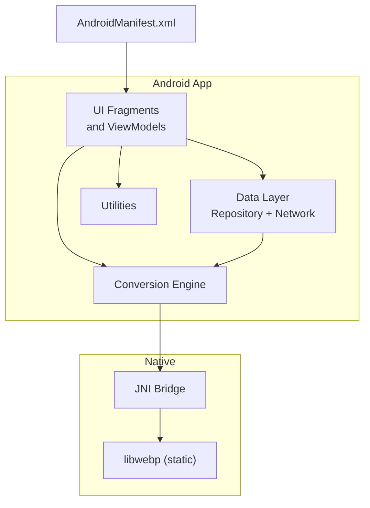
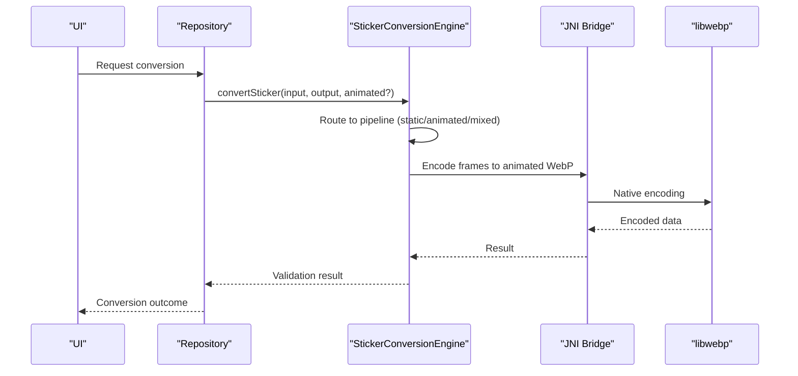
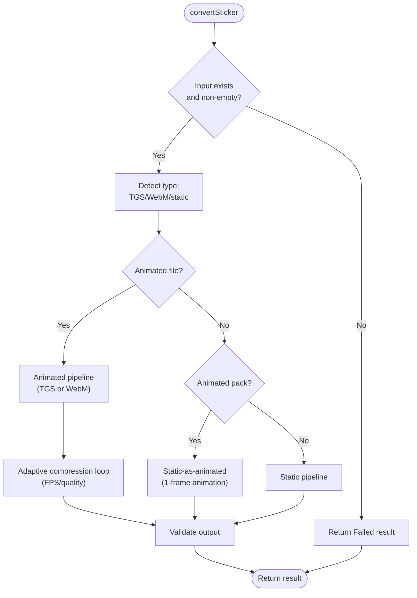
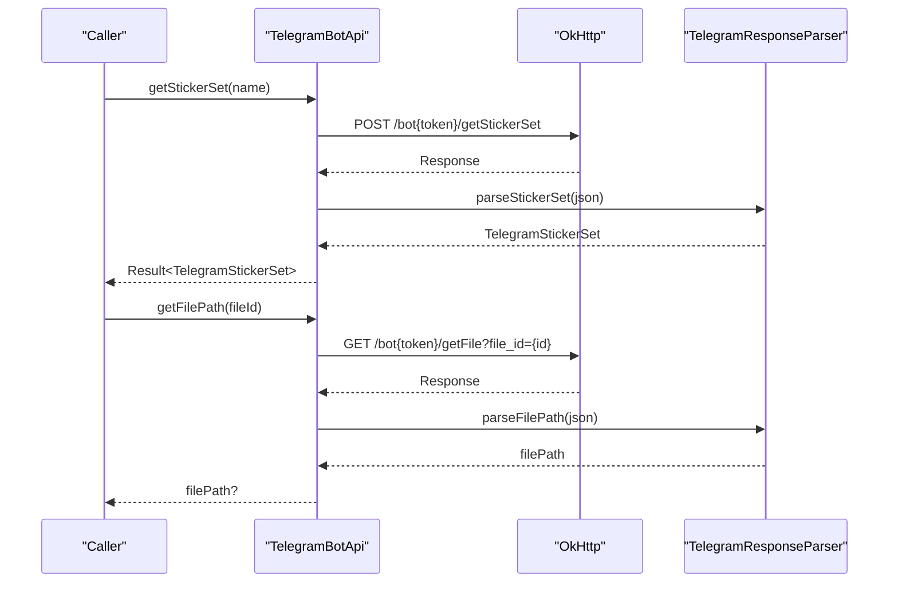
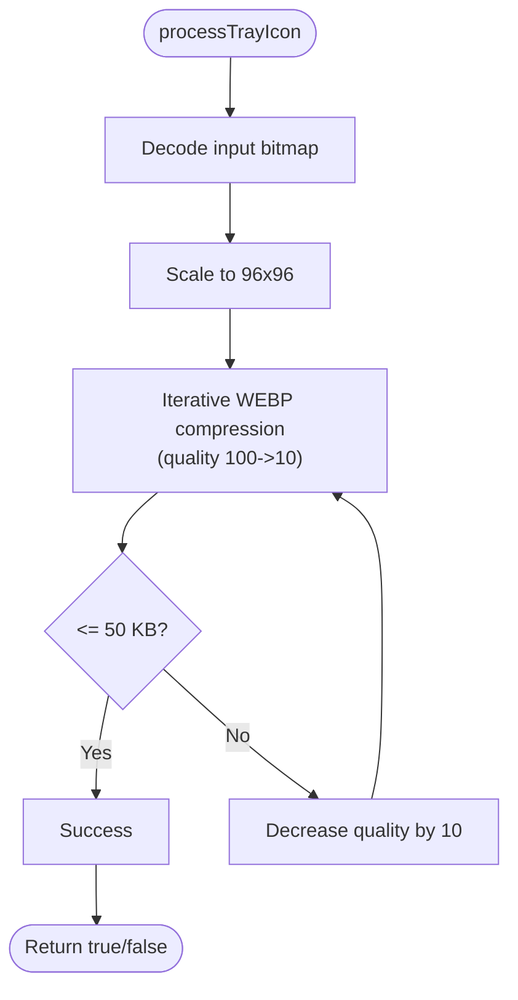
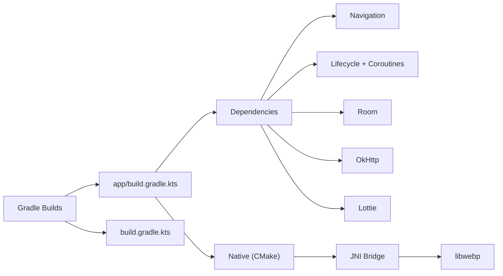

# Contributing and Development Guidelines

<cite>
**Referenced Files in This Document**
- [README.md](file://README.md)
- [CHANGELOG.md](file://CHANGELOG.md)
- [build.gradle.kts](file://build.gradle.kts)
- [app/build.gradle.kts](file://app/build.gradle.kts)
- [settings.gradle.kts](file://settings.gradle.kts)
- [gradle/libs.versions.toml](file://gradle/libs.versions.toml)
- [local.properties.example](file://local.properties.example)
- [AndroidManifest.xml](file://app/src/main/AndroidManifest.xml)
- [CMakeLists.txt](file://app/src/main/cpp/CMakeLists.txt)
- [StickerConversionEngine.kt](file://app/src/main/java/com/maheshsharan/tel2what/engine/StickerConversionEngine.kt)
- [TelegramBotApi.kt](file://app/src/main/java/com/maheshsharan/tel2what/data/network/TelegramBotApi.kt)
- [ImageProcessor.kt](file://app/src/main/java/com/maheshsharan/tel2what/utils/ImageProcessor.kt)
</cite>

## Table of Contents
1. [Introduction](#introduction)
2. [Project Structure](#project-structure)
3. [Core Components](#core-components)
4. [Architecture Overview](#architecture-overview)
5. [Detailed Component Analysis](#detailed-component-analysis)
6. [Dependency Analysis](#dependency-analysis)
7. [Development Environment Setup](#development-environment-setup)
8. [Coding Standards and Project Conventions](#coding-stards-and-project-conventions)
9. [Contribution Process](#contribution-process)
10. [Code Review Process](#code-review-process)
11. [Testing Requirements](#testing-requirements)
12. [Documentation Standards](#documentation-standards)
13. [Extending Conversion Capabilities](#extending-conversion-capabilities)
14. [Adding New Sticker Formats](#adding-new-sticker-formats)
15. [Integrating New Dependencies](#integrating-new-dependencies)
16. [Release Process, Versioning, and Changelog Maintenance](#release-process-versioning-and-changelog-maintenance)
17. [Troubleshooting Guide](#troubleshooting-guide)
18. [Conclusion](#conclusion)
19. [Appendices](#appendices)

## Introduction
This document provides comprehensive contributing and development guidelines for Tel2What, a Telegram to WhatsApp sticker converter. It covers development environment setup, coding standards, contribution procedures, code review expectations, testing requirements, documentation standards, architectural principles, extension points for new sticker formats and conversion capabilities, dependency integration, release and versioning, and practical templates for contributions.

## Project Structure
Tel2What is an Android application structured around a modular Kotlin codebase with a native C++ WebP encoder and a sticker conversion engine. The app follows a single-activity architecture with fragments, Room for persistence, Kotlin Coroutines for async operations, and a native JNI bridge to libwebp for performance-critical encoding.

**Diagram sources**
- [AndroidManifest.xml](file://app/src/main/AndroidManifest.xml#L1-L39)
- [CMakeLists.txt](file://app/src/main/cpp/CMakeLists.txt#L1-L44)
- [StickerConversionEngine.kt](file://app/src/main/java/com/maheshsharan/tel2what/engine/StickerConversionEngine.kt#L1-L275)

**Section sources**
- [README.md](file://README.md#L98-L110)
- [AndroidManifest.xml](file://app/src/main/AndroidManifest.xml#L1-L39)
- [CMakeLists.txt](file://app/src/main/cpp/CMakeLists.txt#L1-L44)

## Core Components
- Conversion Engine: Orchestrates static, animated, and mixed pipelines with concurrency control and adaptive compression.
- Telegram Bot API: Fetches sticker metadata and file paths from the Telegram Bot API.
- Native JNI Bridge: Integrates libwebp for hardware-accelerated animated WebP encoding.
- Utilities: Includes tray icon processing helpers.

Key implementation references:
- [StickerConversionEngine.kt](file://app/src/main/java/com/maheshsharan/tel2what/engine/StickerConversionEngine.kt#L1-L275)
- [TelegramBotApi.kt](file://app/src/main/java/com/maheshsharan/tel2what/data/network/TelegramBotApi.kt#L1-L112)
- [CMakeLists.txt](file://app/src/main/cpp/CMakeLists.txt#L1-L44)
- [ImageProcessor.kt](file://app/src/main/java/com/maheshsharan/tel2what/utils/ImageProcessor.kt#L1-L68)

**Section sources**
- [StickerConversionEngine.kt](file://app/src/main/java/com/maheshsharan/tel2what/engine/StickerConversionEngine.kt#L1-L275)
- [TelegramBotApi.kt](file://app/src/main/java/com/maheshsharan/tel2what/data/network/TelegramBotApi.kt#L1-L112)
- [ImageProcessor.kt](file://app/src/main/java/com/maheshsharan/tel2what/utils/ImageProcessor.kt#L1-L68)

## Architecture Overview
The app’s architecture emphasizes:
- Separation of concerns: UI, engine, data, and utilities.
- Asynchronous processing with Kotlin Coroutines and semaphores for concurrency control.
- Native performance via JNI and libwebp for animated WebP encoding.
- Strict validation and constraints aligned with WhatsApp sticker requirements.

**Diagram sources**
- [StickerConversionEngine.kt](file://app/src/main/java/com/maheshsharan/tel2what/engine/StickerConversionEngine.kt#L33-L88)
- [CMakeLists.txt](file://app/src/main/cpp/CMakeLists.txt#L29-L43)

**Section sources**
- [README.md](file://README.md#L98-L110)
- [StickerConversionEngine.kt](file://app/src/main/java/com/maheshsharan/tel2what/engine/StickerConversionEngine.kt#L1-L275)

## Detailed Component Analysis

### StickerConversionEngine
Responsibilities:
- Detects input type (static, TGS, WebM).
- Routes to appropriate pipeline with concurrency control.
- Performs adaptive compression to meet 500 KB constraints.
- Validates output against WhatsApp requirements.

**Diagram sources**
- [StickerConversionEngine.kt](file://app/src/main/java/com/maheshsharan/tel2what/engine/StickerConversionEngine.kt#L33-L88)
- [StickerConversionEngine.kt](file://app/src/main/java/com/maheshsharan/tel2what/engine/StickerConversionEngine.kt#L131-L273)

**Section sources**
- [StickerConversionEngine.kt](file://app/src/main/java/com/maheshsharan/tel2what/engine/StickerConversionEngine.kt#L1-L275)

### TelegramBotApi
Responsibilities:
- Retrieves sticker set metadata and file paths from Telegram Bot API.
- Handles authentication errors, missing packs, and network failures.

**Diagram sources**
- [TelegramBotApi.kt](file://app/src/main/java/com/maheshsharan/tel2what/data/network/TelegramBotApi.kt#L22-L73)
- [TelegramBotApi.kt](file://app/src/main/java/com/maheshsharan/tel2what/data/network/TelegramBotApi.kt#L75-L106)

**Section sources**
- [TelegramBotApi.kt](file://app/src/main/java/com/maheshsharan/tel2what/data/network/TelegramBotApi.kt#L1-L112)

### ImageProcessor (Tray Icon)
Responsibilities:
- Resizes and compresses tray icons to meet WhatsApp constraints.

**Diagram sources**
- [ImageProcessor.kt](file://app/src/main/java/com/maheshsharan/tel2what/utils/ImageProcessor.kt#L17-L66)

**Section sources**
- [ImageProcessor.kt](file://app/src/main/java/com/maheshsharan/tel2what/utils/ImageProcessor.kt#L1-L68)

## Dependency Analysis
Build and runtime dependencies are declared in Gradle files. The app integrates:
- AndroidX Navigation, Lifecycle, Coroutines
- Room for persistence
- OkHttp/Retrofit for networking
- Lottie for TGS decoding
- libwebp via JNI for native encoding

**Diagram sources**
- [app/build.gradle.kts](file://app/build.gradle.kts#L83-L116)
- [build.gradle.kts](file://build.gradle.kts#L1-L5)
- [CMakeLists.txt](file://app/src/main/cpp/CMakeLists.txt#L29-L43)

**Section sources**
- [app/build.gradle.kts](file://app/build.gradle.kts#L1-L117)
- [build.gradle.kts](file://build.gradle.kts#L1-L5)
- [settings.gradle.kts](file://settings.gradle.kts#L1-L26)
- [gradle/libs.versions.toml](file://gradle/libs.versions.toml#L1-L14)

## Development Environment Setup
Prerequisites:
- Android Studio Hedgehog or later
- JDK 17
- Android SDK 34
- Android NDK (required for native WebP encoding)
- Telegram Bot Token (see note below)

Environment configuration:
- Telegram Bot Token: Add your token to local.properties or replace the hardcoded token in the source (not recommended for production).
- SDK location: Configure sdk.dir in local.properties.example.

Build commands:
- Build debug APK: ./gradlew assembleDebug
- Install on device: ./gradlew installDebug
- Build release APK: ./gradlew assembleRelease

Notes:
- The app requires Android 11 (API 30) or higher and approximately 100 MB free storage for temporary conversion files.
- The included Telegram Bot token is for testing and may hit rate limits.

**Section sources**
- [README.md](file://README.md#L112-L149)
- [local.properties.example](file://local.properties.example#L1-L13)
- [app/build.gradle.kts](file://app/build.gradle.kts#L10-L31)

## Coding Standards and Project Conventions
- Language and frameworks:
  - Kotlin-first Android app with coroutines and Flow.
  - Material Design 3 and Navigation Component for UI.
  - Room for persistence, OkHttp/Retrofit for networking, Lottie for animations.
- Architecture:
  - Single Activity + Fragments.
  - Clear separation between UI, engine, data, and utilities.
- Concurrency:
  - Use of semaphores to control parallelism in conversion pipelines.
- Logging:
  - Structured logs prefixed with Tel2What namespaces for traceability.
- Native integration:
  - CMake-based static libwebp build and a minimal JNI bridge.
- Naming and structure:
  - Package names reflect feature areas (engine, data, ui, utils).
  - Files named descriptively (e.g., StickerConversionEngine.kt).

**Section sources**
- [README.md](file://README.md#L87-L110)
- [StickerConversionEngine.kt](file://app/src/main/java/com/maheshsharan/tel2what/engine/StickerConversionEngine.kt#L17-L28)
- [CMakeLists.txt](file://app/src/main/cpp/CMakeLists.txt#L1-L44)

## Contribution Process
Issue reporting:
- Use GitHub Issues to report bugs and request features.
- Include steps to reproduce, expected vs. actual behavior, device info, and logs.

Feature requests:
- Describe the problem being solved and proposed solution.
- Provide context on user impact and alternatives considered.

Pull requests:
- Fork the repo and branch from develop/main.
- Reference related issues in PR descriptions.
- Keep commits focused and include unit/integration tests where applicable.
- Update documentation and changelog entries as needed.

Review and merging:
- Maintainers will review PRs for correctness, performance, and adherence to standards.
- Ensure CI passes and address feedback promptly.

[No sources needed since this section provides general guidance]

## Code Review Process
Review criteria:
- Correctness: Does the change fix the intended issue or deliver the feature?
- Performance: Are there unnecessary allocations or blocking calls?
- Security: Are permissions and data handling appropriate?
- Compatibility: Does it maintain API stability and Android version targets?
- Tests: Are new or changed logic covered by tests?
- Documentation: Are user-visible changes reflected in docs/changelog?

Review workflow:
- Open PR with clear description and linked issues.
- Address reviewer comments and update diffs accordingly.
- Merge only after approval and successful checks.

[No sources needed since this section provides general guidance]

## Testing Requirements
Current state:
- Unit tests are present for the app module.
- The project includes jsoup and okhttp dependencies; jsoup can be removed later according to comments.

Recommendations:
- Add unit tests for conversion logic, decoders, and validators.
- Add instrumentation tests for critical UI flows and permission handling.
- Validate native JNI bridge behavior under various inputs and sizes.
- Include performance tests for typical sticker conversion scenarios.

**Section sources**
- [app/build.gradle.kts](file://app/build.gradle.kts#L109-L116)

## Documentation Standards
- Keep README concise and user-focused; technical deep-dives go to assets/docs.
- Update CHANGELOG.md with user-visible changes per release.
- For code-level documentation, favor self-documenting names and minimal comments.
- When adding new features, update both user-facing docs and internal docs.

**Section sources**
- [README.md](file://README.md#L160-L166)
- [CHANGELOG.md](file://CHANGELOG.md#L1-L40)

## Extending Conversion Capabilities
Guidelines:
- Introduce new decoders in the engine.decoder package and route them in the conversion engine.
- Maintain strict concurrency controls and memory management.
- Ensure adaptive compression remains effective for new formats.
- Validate outputs against WhatsApp constraints.

Reference points:
- Engine routing and concurrency: [StickerConversionEngine.kt](file://app/src/main/java/com/maheshsharan/tel2what/engine/StickerConversionEngine.kt#L64-L88)
- Native encoding integration: [CMakeLists.txt](file://app/src/main/cpp/CMakeLists.txt#L29-L43)

**Section sources**
- [StickerConversionEngine.kt](file://app/src/main/java/com/maheshsharan/tel2what/engine/StickerConversionEngine.kt#L1-L275)
- [CMakeLists.txt](file://app/src/main/cpp/CMakeLists.txt#L1-L44)

## Adding New Sticker Formats
Steps:
- Add a new decoder in engine/decoder for the format.
- Extend the engine routing logic to detect the new format and dispatch to the decoder.
- Integrate with frame extraction and normalization utilities.
- Add adaptive compression and validation steps.
- Update tests and documentation.

Reference points:
- Format detection and routing: [StickerConversionEngine.kt](file://app/src/main/java/com/maheshsharan/tel2what/engine/StickerConversionEngine.kt#L55-L68)
- Frame extraction and normalization: [StickerConversionEngine.kt](file://app/src/main/java/com/maheshsharan/tel2what/engine/StickerConversionEngine.kt#L149-L177)

**Section sources**
- [StickerConversionEngine.kt](file://app/src/main/java/com/maheshsharan/tel2what/engine/StickerConversionEngine.kt#L55-L88)

## Integrating New Dependencies
Guidance:
- Declare dependencies in app/build.gradle.kts under dependencies.
- Prefer AndroidX and Jetpack Compose-compatible libraries.
- Keep third-party libraries audited and scoped to their usage.
- For native dependencies, integrate via CMake and expose via JNI.

Reference points:
- Dependency declarations: [app/build.gradle.kts](file://app/build.gradle.kts#L83-L116)
- Native integration: [CMakeLists.txt](file://app/src/main/cpp/CMakeLists.txt#L1-L44)

**Section sources**
- [app/build.gradle.kts](file://app/build.gradle.kts#L83-L116)
- [CMakeLists.txt](file://app/src/main/cpp/CMakeLists.txt#L1-L44)

## Release Process, Versioning, and Changelog Maintenance
Versioning:
- Follow semantic versioning. Increment major for breaking changes, minor for features, patch for fixes.

Release checklist:
- Update versionCode/versionName in app/build.gradle.kts.
- Update CHANGELOG.md with a new entry for the upcoming version.
- Verify build types (debug/release), minify/proguard rules, and ABI filters.
- Build and sign release APK/AAB.
- Publish artifacts and tag the release.

Changelog maintenance:
- Document user-visible additions, changes, fixes, and technical notes.
- Keep entries concise and organized.

**Section sources**
- [CHANGELOG.md](file://CHANGELOG.md#L1-L40)
- [app/build.gradle.kts](file://app/build.gradle.kts#L20-L31)

## Troubleshooting Guide
Common issues and resolutions:
- Telegram API errors:
  - Invalid token or unauthorized access: configure a valid token in local.properties.
  - Sticker pack not found: verify the Telegram link and ensure the pack is public.
  - Network errors: check connectivity and retry.
- Conversion failures:
  - Empty or missing input files: ensure files exist and are readable.
  - Excessive file size: confirm adaptive compression succeeded; reduce FPS/quality further if needed.
- Native encoding issues:
  - JNI failures: verify native build and ABI filters; ensure device supports required ABIs.

References:
- Telegram API error handling: [TelegramBotApi.kt](file://app/src/main/java/com/maheshsharan/tel2what/data/network/TelegramBotApi.kt#L36-L73)
- Conversion engine logging and routing: [StickerConversionEngine.kt](file://app/src/main/java/com/maheshsharan/tel2what/engine/StickerConversionEngine.kt#L39-L88)

**Section sources**
- [TelegramBotApi.kt](file://app/src/main/java/com/maheshsharan/tel2what/data/network/TelegramBotApi.kt#L36-L73)
- [StickerConversionEngine.kt](file://app/src/main/java/com/maheshsharan/tel2what/engine/StickerConversionEngine.kt#L39-L88)

## Conclusion
These guidelines aim to streamline contributions while preserving Tel2What’s performance, privacy, and user trust. By following the setup, standards, review, testing, and release processes outlined here, contributors can efficiently extend the app’s capabilities—especially around sticker formats, conversion pipelines, and dependencies—while maintaining quality and consistency.

[No sources needed since this section summarizes without analyzing specific files]

## Appendices

### Templates

Bug Report Template
- Steps to reproduce:
- Expected behavior:
- Actual behavior:
- Device/OS info:
- Logs (attach or link):
- Additional context:

Feature Proposal Template
- Problem statement:
- Proposed solution:
- Why current solution is insufficient:
- Alternatives considered:
- Impact on performance/privacy:
- Test plan:

Contribution Agreement
- I confirm that this contribution is my original work and that I have the right to submit it to Tel2What.
- I agree that my contributions will be licensed under the project’s license.
- I have tested my changes and believe they are ready for review.

[No sources needed since this section provides general guidance]