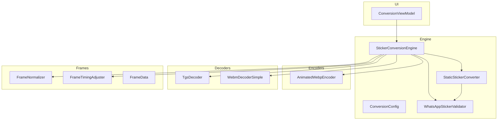
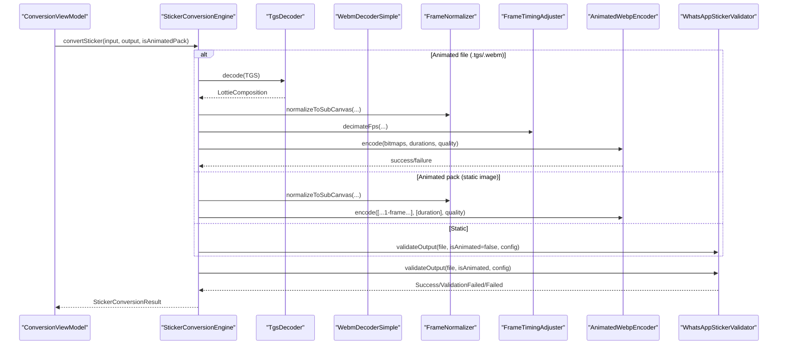
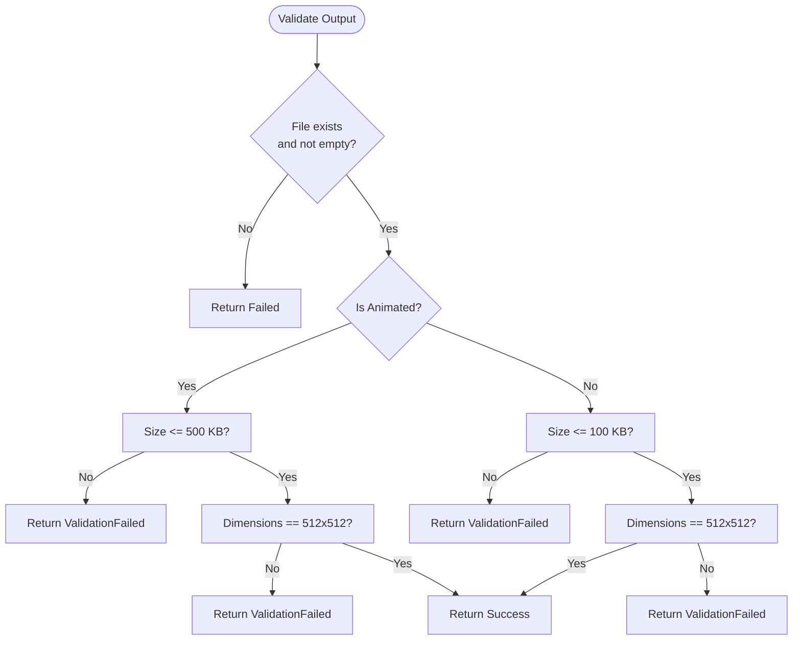
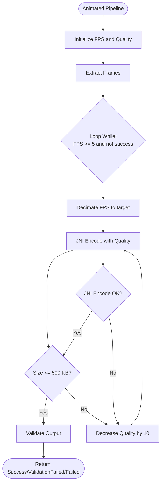
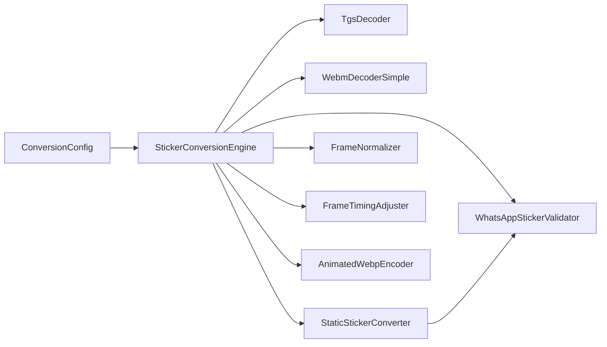

# Conversion Configuration and Parameters

<cite>
**Referenced Files in This Document**
- [ConversionConfig.kt](file://app/src/main/java/com/maheshsharan/tel2what/engine/ConversionConfig.kt)
- [StickerConversionResult.kt](file://app/src/main/java/com/maheshsharan/tel2what/engine/StickerConversionResult.kt)
- [StickerConverter.kt](file://app/src/main/java/com/maheshsharan/tel2what/engine/StickerConverter.kt)
- [StickerConversionEngine.kt](file://app/src/main/java/com/maheshsharan/tel2what/engine/StickerConversionEngine.kt)
- [StaticStickerConverter.kt](file://app/src/main/java/com/maheshsharan/tel2what/engine/StaticStickerConverter.kt)
- [WhatsAppStickerValidator.kt](file://app/src/main/java/com/maheshsharan/tel2what/engine/WhatsAppStickerValidator.kt)
- [AnimatedWebpEncoder.kt](file://app/src/main/java/com/maheshsharan/tel2what/engine/encoder/AnimatedWebpEncoder.kt)
- [FrameNormalizer.kt](file://app/src/main/java/com/maheshsharan/tel2what/engine/frame/FrameNormalizer.kt)
- [FrameTimingAdjuster.kt](file://app/src/main/java/com/maheshsharan/tel2what/engine/frame/FrameTimingAdjuster.kt)
- [TgsDecoder.kt](file://app/src/main/java/com/maheshsharan/tel2what/engine/decoder/TgsDecoder.kt)
- [WebmDecoderSimple.kt](file://app/src/main/java/com/maheshsharan/tel2what/engine/decoder/WebmDecoderSimple.kt)
- [FrameData.kt](file://app/src/main/java/com/maheshsharan/tel2what/engine/frame/FrameData.kt)
- [ConversionViewModel.kt](file://app/src/main/java/com/maheshsharan/tel2what/ui/conversion/ConversionViewModel.kt)
</cite>

## Table of Contents
1. [Introduction](#introduction)
2. [Project Structure](#project-structure)
3. [Core Components](#core-components)
4. [Architecture Overview](#architecture-overview)
5. [Detailed Component Analysis](#detailed-component-analysis)
6. [Dependency Analysis](#dependency-analysis)
7. [Performance Considerations](#performance-considerations)
8. [Troubleshooting Guide](#troubleshooting-guide)
9. [Conclusion](#conclusion)
10. [Appendices](#appendices)

## Introduction
This document explains conversion configuration management and result handling for sticker conversion. It focuses on the ConversionConfig class parameters (target dimensions, FPS, duration limits, and quality thresholds), the StickerConversionResult sealed class hierarchy (Success, Failed, ValidationFailed), configuration validation, defaults, runtime adjustments, and practical examples for initialization and tuning. It also covers persistence considerations and environment-specific optimizations.

## Project Structure
The conversion pipeline resides under the engine package and orchestrates decoding, normalization, timing adjustment, encoding, and validation. Supporting components include decoders for TGS and WebM, frame utilities, and a native WebP encoder.

**Diagram sources**
- [StickerConversionEngine.kt](file://app/src/main/java/com/maheshsharan/tel2what/engine/StickerConversionEngine.kt#L17-L88)
- [StaticStickerConverter.kt](file://app/src/main/java/com/maheshsharan/tel2what/engine/StaticStickerConverter.kt#L15-L94)
- [AnimatedWebpEncoder.kt](file://app/src/main/java/com/maheshsharan/tel2what/engine/encoder/AnimatedWebpEncoder.kt#L8-L91)
- [TgsDecoder.kt](file://app/src/main/java/com/maheshsharan/tel2what/engine/decoder/TgsDecoder.kt#L17-L94)
- [WebmDecoderSimple.kt](file://app/src/main/java/com/maheshsharan/tel2what/engine/decoder/WebmDecoderSimple.kt#L20-L256)
- [FrameNormalizer.kt](file://app/src/main/java/com/maheshsharan/tel2what/engine/frame/FrameNormalizer.kt#L11-L62)
- [FrameTimingAdjuster.kt](file://app/src/main/java/com/maheshsharan/tel2what/engine/frame/FrameTimingAdjuster.kt#L8-L72)
- [FrameData.kt](file://app/src/main/java/com/maheshsharan/tel2what/engine/frame/FrameData.kt#L5-L9)
- [WhatsAppStickerValidator.kt](file://app/src/main/java/com/maheshsharan/tel2what/engine/WhatsAppStickerValidator.kt#L7-L72)
- [ConversionViewModel.kt](file://app/src/main/java/com/maheshsharan/tel2what/ui/conversion/ConversionViewModel.kt#L39-L138)

**Section sources**
- [StickerConversionEngine.kt](file://app/src/main/java/com/maheshsharan/tel2what/engine/StickerConversionEngine.kt#L17-L88)
- [ConversionConfig.kt](file://app/src/main/java/com/maheshsharan/tel2what/engine/ConversionConfig.kt#L3-L13)

## Core Components
- ConversionConfig defines target dimensions, size limits, tray dimension, duration caps, minimum frame duration, and target FPS. Defaults are optimized for speed and WhatsApp constraints.
- StickerConversionResult encapsulates outcomes: Success with metadata, Failed with optional exception, and ValidationFailed for constraint violations.
- StickerConverter interface standardizes conversion across static and animated paths.
- StickerConversionEngine orchestrates routing, concurrency, and the full pipeline.
- StaticStickerConverter performs static WebP compression with iterative quality reduction.
- AnimatedWebpEncoder provides native animated WebP muxing.
- FrameNormalizer and FrameTimingAdjuster handle dimension normalization and FPS/time adjustments.
- WhatsAppStickerValidator enforces size and dimension constraints post-encoding.
- Decoders (TgsDecoder, WebmDecoderSimple) produce frame sequences for animated conversion.

**Section sources**
- [ConversionConfig.kt](file://app/src/main/java/com/maheshsharan/tel2what/engine/ConversionConfig.kt#L3-L13)
- [StickerConversionResult.kt](file://app/src/main/java/com/maheshsharan/tel2what/engine/StickerConversionResult.kt#L5-L22)
- [StickerConverter.kt](file://app/src/main/java/com/maheshsharan/tel2what/engine/StickerConverter.kt#L5-L19)
- [StaticStickerConverter.kt](file://app/src/main/java/com/maheshsharan/tel2what/engine/StaticStickerConverter.kt#L15-L94)
- [AnimatedWebpEncoder.kt](file://app/src/main/java/com/maheshsharan/tel2what/engine/encoder/AnimatedWebpEncoder.kt#L8-L91)
- [FrameNormalizer.kt](file://app/src/main/java/com/maheshsharan/tel2what/engine/frame/FrameNormalizer.kt#L11-L62)
- [FrameTimingAdjuster.kt](file://app/src/main/java/com/maheshsharan/tel2what/engine/frame/FrameTimingAdjuster.kt#L8-L72)
- [WhatsAppStickerValidator.kt](file://app/src/main/java/com/maheshsharan/tel2what/engine/WhatsAppStickerValidator.kt#L7-L72)
- [TgsDecoder.kt](file://app/src/main/java/com/maheshsharan/tel2what/engine/decoder/TgsDecoder.kt#L17-L94)
- [WebmDecoderSimple.kt](file://app/src/main/java/com/maheshsharan/tel2what/engine/decoder/WebmDecoderSimple.kt#L20-L256)

## Architecture Overview
The engine routes inputs to either static or animated pipelines, applies normalization and timing adjustments, and uses a native encoder to produce WebP outputs validated against WhatsApp constraints.

**Diagram sources**
- [StickerConversionEngine.kt](file://app/src/main/java/com/maheshsharan/tel2what/engine/StickerConversionEngine.kt#L33-L88)
- [TgsDecoder.kt](file://app/src/main/java/com/maheshsharan/tel2what/engine/decoder/TgsDecoder.kt#L21-L79)
- [WebmDecoderSimple.kt](file://app/src/main/java/com/maheshsharan/tel2what/engine/decoder/WebmDecoderSimple.kt#L27-L192)
- [FrameNormalizer.kt](file://app/src/main/java/com/maheshsharan/tel2what/engine/frame/FrameNormalizer.kt#L17-L60)
- [FrameTimingAdjuster.kt](file://app/src/main/java/com/maheshsharan/tel2what/engine/frame/FrameTimingAdjuster.kt#L16-L70)
- [AnimatedWebpEncoder.kt](file://app/src/main/java/com/maheshsharan/tel2what/engine/encoder/AnimatedWebpEncoder.kt#L32-L78)
- [WhatsAppStickerValidator.kt](file://app/src/main/java/com/maheshsharan/tel2what/engine/WhatsAppStickerValidator.kt#L14-L70)

## Detailed Component Analysis

### ConversionConfig Parameters
- Target dimensions: 512x512 pixels enforced by normalization and validation.
- Maximum sizes:
  - Static: 100 KB
  - Animated: 500 KB
  - Tray icon: 50 KB
- Tray dimension: 96 pixels.
- Duration and FPS:
  - Maximum animation duration: 10,000 ms.
  - Minimum frame duration: 8 ms (~125 FPS max).
  - Target FPS: 10 FPS for speed and compatibility.
- Defaults are chosen to maximize throughput while meeting WhatsApp constraints.

Practical initialization and tuning:
- Initialize with defaults for typical conversions.
- Adjust target FPS for speed vs. smoothness trade-offs.
- Increase max duration cautiously to stay within size targets.
- Tune quality thresholds in the encoder loop when necessary.

**Section sources**
- [ConversionConfig.kt](file://app/src/main/java/com/maheshsharan/tel2what/engine/ConversionConfig.kt#L3-L13)
- [FrameTimingAdjuster.kt](file://app/src/main/java/com/maheshsharan/tel2what/engine/frame/FrameTimingAdjuster.kt#L38-L49)
- [WhatsAppStickerValidator.kt](file://app/src/main/java/com/maheshsharan/tel2what/engine/WhatsAppStickerValidator.kt#L28-L40)

### StickerConversionResult Sealed Class Hierarchy
- Success: Contains output file, dimensions, size in bytes, and animated flag.
- Failed: Indicates a pipeline failure with an optional exception.
- ValidationFailed: Indicates a constraint violation (e.g., size or dimension mismatch).

Result interpretation patterns:
- Success: Persist the file and update UI state.
- Failed: Log stack traces and surface user-friendly messages.
- ValidationFailed: Inform users about size/dimension constraints and suggest adjustments.

**Section sources**
- [StickerConversionResult.kt](file://app/src/main/java/com/maheshsharan/tel2what/engine/StickerConversionResult.kt#L5-L22)
- [WhatsAppStickerValidator.kt](file://app/src/main/java/com/maheshsharan/tel2what/engine/WhatsAppStickerValidator.kt#L14-L70)

### Configuration Validation and Enforcement
- Static validation checks file existence, size, and dimensions.
- Animated validation checks size and dimensions; duration constraints are enforced during extraction/encoding.
- FrameTimingAdjuster enforces minimum frame duration and caps total animation length.

**Diagram sources**
- [WhatsAppStickerValidator.kt](file://app/src/main/java/com/maheshsharan/tel2what/engine/WhatsAppStickerValidator.kt#L14-L70)

**Section sources**
- [WhatsAppStickerValidator.kt](file://app/src/main/java/com/maheshsharan/tel2what/engine/WhatsAppStickerValidator.kt#L14-L70)
- [FrameTimingAdjuster.kt](file://app/src/main/java/com/maheshsharan/tel2what/engine/frame/FrameTimingAdjuster.kt#L38-L49)

### Runtime Parameter Adjustment Strategies
- Animated pipeline:
  - Start with target FPS and quality floor.
  - Reduce quality in steps to meet size targets.
  - If quality is exhausted, reduce FPS in steps to further compress.
- Static pipeline:
  - Iteratively reduce quality until under the static size limit.
- FrameTimingAdjuster:
  - Enforces minimum frame duration and caps total duration to 10 seconds.

**Diagram sources**
- [StickerConversionEngine.kt](file://app/src/main/java/com/maheshsharan/tel2what/engine/StickerConversionEngine.kt#L187-L235)
- [AnimatedWebpEncoder.kt](file://app/src/main/java/com/maheshsharan/tel2what/engine/encoder/AnimatedWebpEncoder.kt#L32-L78)

**Section sources**
- [StickerConversionEngine.kt](file://app/src/main/java/com/maheshsharan/tel2what/engine/StickerConversionEngine.kt#L187-L235)
- [AnimatedWebpEncoder.kt](file://app/src/main/java/com/maheshsharan/tel2what/engine/encoder/AnimatedWebpEncoder.kt#L32-L78)

### Examples of Configuration Initialization and Tuning
- Typical initialization: Use ConversionConfig defaults for standard conversions.
- Speed-first tuning: Lower target FPS and quality floor to reduce CPU time.
- Quality-first tuning: Keep higher target FPS and increase quality steps to improve fidelity.
- Environment-specific: On low-memory devices, prefer fewer concurrent animated conversions and lower FPS.

Note: Replace code snippets with file references for reproducibility.

**Section sources**
- [ConversionConfig.kt](file://app/src/main/java/com/maheshsharan/tel2what/engine/ConversionConfig.kt#L3-L13)
- [StickerConversionEngine.kt](file://app/src/main/java/com/maheshsharan/tel2what/engine/StickerConversionEngine.kt#L23-L27)

### Result Interpretation Patterns
- Success: Persist file and update UI counters and metrics.
- Failed: Capture exception and log stack traces for diagnostics.
- ValidationFailed: Present clear messages about size or dimension mismatches.

**Section sources**
- [ConversionViewModel.kt](file://app/src/main/java/com/maheshsharan/tel2what/ui/conversion/ConversionViewModel.kt#L284-L307)
- [StickerConversionResult.kt](file://app/src/main/java/com/maheshsharan/tel2what/engine/StickerConversionResult.kt#L5-L22)

### Configuration Persistence and Environment Optimizations
- Persistence: Store ConversionConfig alongside user preferences or per-pack settings to maintain consistent behavior across sessions.
- Environment optimizations:
  - Concurrency: Limit animated conversions to avoid thermal throttling and OOM.
  - Memory: Recycle bitmaps aggressively and normalize frames to fixed dimensions.
  - Decoding: Prefer efficient decoders and early termination on errors.

**Section sources**
- [StickerConversionEngine.kt](file://app/src/main/java/com/maheshsharan/tel2what/engine/StickerConversionEngine.kt#L23-L27)
- [FrameNormalizer.kt](file://app/src/main/java/com/maheshsharan/tel2what/engine/frame/FrameNormalizer.kt#L17-L60)
- [StaticStickerConverter.kt](file://app/src/main/java/com/maheshsharan/tel2what/engine/StaticStickerConverter.kt#L87-L92)

## Dependency Analysis
The engine depends on decoders, frame utilities, and the native encoder. Validation is applied uniformly post-processing.

**Diagram sources**
- [StickerConversionEngine.kt](file://app/src/main/java/com/maheshsharan/tel2what/engine/StickerConversionEngine.kt#L17-L88)
- [StaticStickerConverter.kt](file://app/src/main/java/com/maheshsharan/tel2what/engine/StaticStickerConverter.kt#L15-L94)
- [AnimatedWebpEncoder.kt](file://app/src/main/java/com/maheshsharan/tel2what/engine/encoder/AnimatedWebpEncoder.kt#L8-L91)
- [FrameNormalizer.kt](file://app/src/main/java/com/maheshsharan/tel2what/engine/frame/FrameNormalizer.kt#L11-L62)
- [FrameTimingAdjuster.kt](file://app/src/main/java/com/maheshsharan/tel2what/engine/frame/FrameTimingAdjuster.kt#L8-L72)
- [WhatsAppStickerValidator.kt](file://app/src/main/java/com/maheshsharan/tel2what/engine/WhatsAppStickerValidator.kt#L7-L72)

**Section sources**
- [StickerConversionEngine.kt](file://app/src/main/java/com/maheshsharan/tel2what/engine/StickerConversionEngine.kt#L17-L88)
- [StaticStickerConverter.kt](file://app/src/main/java/com/maheshsharan/tel2what/engine/StaticStickerConverter.kt#L15-L94)

## Performance Considerations
- Concurrency: Use semaphores to limit animated processing to prevent resource contention.
- Memory: Normalize frames to fixed size and recycle bitmaps promptly.
- Quality loops: Start with conservative quality and reduce incrementally to minimize retries.
- FPS decimation: Reduce FPS to meet size targets efficiently.

[No sources needed since this section provides general guidance]

## Troubleshooting Guide
Common issues and resolutions:
- Empty or missing input files: Return Failed early with descriptive reasons.
- Zero frames extracted: Validate decoder outputs and surface ValidationFailed.
- JNI encoding failures: Retry with reduced quality or FPS.
- Dimension mismatches: Ensure normalization and validation enforce 512x512.
- Excessive size: Lower target FPS or quality; consider reducing max duration.

**Section sources**
- [StickerConversionEngine.kt](file://app/src/main/java/com/maheshsharan/tel2what/engine/StickerConversionEngine.kt#L45-L53)
- [WebmDecoderSimple.kt](file://app/src/main/java/com/maheshsharan/tel2what/engine/decoder/WebmDecoderSimple.kt#L183-L191)
- [AnimatedWebpEncoder.kt](file://app/src/main/java/com/maheshsharan/tel2what/engine/encoder/AnimatedWebpEncoder.kt#L38-L46)
- [WhatsAppStickerValidator.kt](file://app/src/main/java/com/maheshsharan/tel2what/engine/WhatsAppStickerValidator.kt#L19-L23)

## Conclusion
ConversionConfig and StickerConversionResult define a robust, constraint-aware pipeline for sticker conversion. Defaults balance speed and compliance with WhatsApp constraints. The engine’s validation and quality/fps loops ensure reliable outcomes across diverse inputs and environments.

[No sources needed since this section summarizes without analyzing specific files]

## Appendices
- Example references:
  - ConversionConfig defaults: [ConversionConfig.kt](file://app/src/main/java/com/maheshsharan/tel2what/engine/ConversionConfig.kt#L3-L13)
  - Result types: [StickerConversionResult.kt](file://app/src/main/java/com/maheshsharan/tel2what/engine/StickerConversionResult.kt#L5-L22)
  - Engine orchestration: [StickerConversionEngine.kt](file://app/src/main/java/com/maheshsharan/tel2what/engine/StickerConversionEngine.kt#L33-L88)
  - Static conversion loop: [StaticStickerConverter.kt](file://app/src/main/java/com/maheshsharan/tel2what/engine/StaticStickerConverter.kt#L54-L72)
  - Animated compression loop: [StickerConversionEngine.kt](file://app/src/main/java/com/maheshsharan/tel2what/engine/StickerConversionEngine.kt#L194-L235)
  - Native encoder: [AnimatedWebpEncoder.kt](file://app/src/main/java/com/maheshsharan/tel2what/engine/encoder/AnimatedWebpEncoder.kt#L32-L78)
  - Validation: [WhatsAppStickerValidator.kt](file://app/src/main/java/com/maheshsharan/tel2what/engine/WhatsAppStickerValidator.kt#L14-L70)

[No sources needed since this section lists references already cited above]