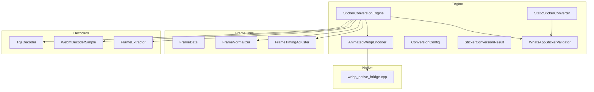
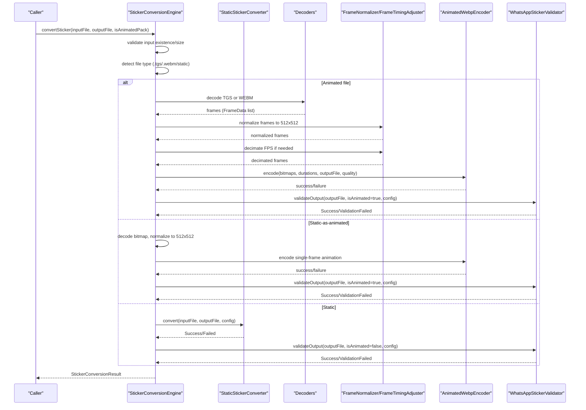
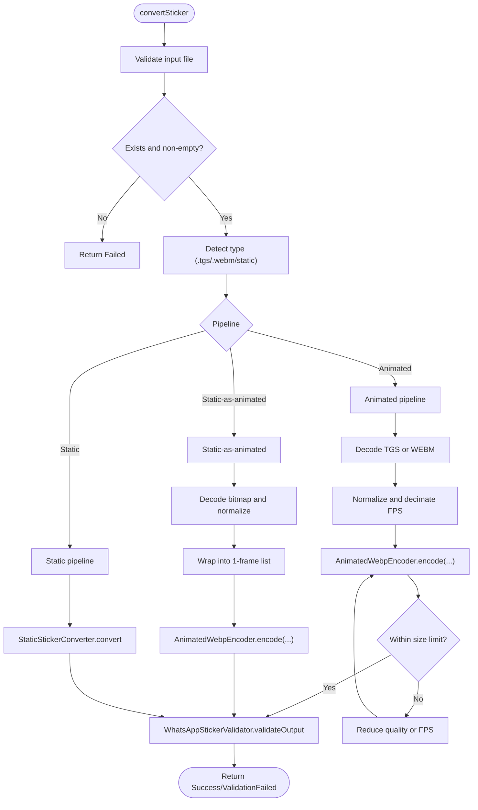
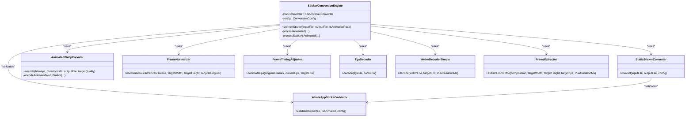

# Conversion Engine

<cite>
**Referenced Files in This Document**
- [StickerConversionEngine.kt](file://app/src/main/java/com/maheshsharan/tel2what/engine/StickerConversionEngine.kt)
- [StaticStickerConverter.kt](file://app/src/main/java/com/maheshsharan/tel2what/engine/StaticStickerConverter.kt)
- [AnimatedWebpEncoder.kt](file://app/src/main/java/com/maheshsharan/tel2what/engine/encoder/AnimatedWebpEncoder.kt)
- [ConversionConfig.kt](file://app/src/main/java/com/maheshsharan/tel2what/engine/ConversionConfig.kt)
- [StickerConversionResult.kt](file://app/src/main/java/com/maheshsharan/tel2what/engine/StickerConversionResult.kt)
- [StickerConverter.kt](file://app/src/main/java/com/maheshsharan/tel2what/engine/StickerConverter.kt)
- [FrameData.kt](file://app/src/main/java/com/maheshsharan/tel2what/engine/frame/FrameData.kt)
- [FrameNormalizer.kt](file://app/src/main/java/com/maheshsharan/tel2what/engine/frame/FrameNormalizer.kt)
- [FrameTimingAdjuster.kt](file://app/src/main/java/com/maheshsharan/tel2what/engine/frame/FrameTimingAdjuster.kt)
- [WhatsAppStickerValidator.kt](file://app/src/main/java/com/maheshsharan/tel2what/engine/WhatsAppStickerValidator.kt)
- [TgsDecoder.kt](file://app/src/main/java/com/maheshsharan/tel2what/engine/decoder/TgsDecoder.kt)
- [WebmDecoderSimple.kt](file://app/src/main/java/com/maheshsharan/tel2what/engine/decoder/WebmDecoderSimple.kt)
- [FrameExtractor.kt](file://app/src/main/java/com/maheshsharan/tel2what/engine/decoder/FrameExtractor.kt)
- [webp_native_bridge.cpp](file://app/src/main/cpp/webp_native_bridge.cpp)
- [ImageProcessor.kt](file://app/src/main/java/com/maheshsharan/tel2what/utils/ImageProcessor.kt)
- [ConversionViewModel.kt](file://app/src/main/java/com/maheshsharan/tel2what/ui/conversion/ConversionViewModel.kt)
</cite>

## Table of Contents
1. [Introduction](#introduction)
2. [Project Structure](#project-structure)
3. [Core Components](#core-components)
4. [Architecture Overview](#architecture-overview)
5. [Detailed Component Analysis](#detailed-component-analysis)
6. [Dependency Analysis](#dependency-analysis)
7. [Performance Considerations](#performance-considerations)
8. [Troubleshooting Guide](#troubleshooting-guide)
9. [Conclusion](#conclusion)
10. [Appendices](#appendices)

## Introduction
This document explains the core conversion engine that transforms Telegram stickers into WhatsApp-compatible formats. It covers the conversion pipeline architecture, input validation, format detection, processing workflows, converter types, configuration parameters, quality settings, performance optimizations, result structures, error reporting, batch processing, and concurrent execution strategies. It also lists supported input formats and provides troubleshooting guidance for common conversion issues.

## Project Structure
The conversion engine resides under the engine package and integrates with decoders, frame processors, an encoder, and validators. Supporting utilities and native bindings handle performance-critical tasks.

**Diagram sources**
- [StickerConversionEngine.kt](file://app/src/main/java/com/maheshsharan/tel2what/engine/StickerConversionEngine.kt#L17-L88)
- [StaticStickerConverter.kt](file://app/src/main/java/com/maheshsharan/tel2what/engine/StaticStickerConverter.kt#L15-L92)
- [AnimatedWebpEncoder.kt](file://app/src/main/java/com/maheshsharan/tel2what/engine/encoder/AnimatedWebpEncoder.kt#L8-L89)
- [ConversionConfig.kt](file://app/src/main/java/com/maheshsharan/tel2what/engine/ConversionConfig.kt#L3-L13)
- [StickerConversionResult.kt](file://app/src/main/java/com/maheshsharan/tel2what/engine/StickerConversionResult.kt#L5-L22)
- [FrameData.kt](file://app/src/main/java/com/maheshsharan/tel2what/engine/frame/FrameData.kt#L5-L8)
- [FrameNormalizer.kt](file://app/src/main/java/com/maheshsharan/tel2what/engine/frame/FrameNormalizer.kt#L11-L60)
- [FrameTimingAdjuster.kt](file://app/src/main/java/com/maheshsharan/tel2what/engine/frame/FrameTimingAdjuster.kt#L8-L70)
- [WhatsAppStickerValidator.kt](file://app/src/main/java/com/maheshsharan/tel2what/engine/WhatsAppStickerValidator.kt#L7-L70)
- [TgsDecoder.kt](file://app/src/main/java/com/maheshsharan/tel2what/engine/decoder/TgsDecoder.kt#L17-L79)
- [WebmDecoderSimple.kt](file://app/src/main/java/com/maheshsharan/tel2what/engine/decoder/WebmDecoderSimple.kt#L20-L191)
- [FrameExtractor.kt](file://app/src/main/java/com/maheshsharan/tel2what/engine/decoder/FrameExtractor.kt#L16-L98)
- [webp_native_bridge.cpp](file://app/src/main/cpp/webp_native_bridge.cpp#L13-L146)

**Section sources**
- [StickerConversionEngine.kt](file://app/src/main/java/com/maheshsharan/tel2what/engine/StickerConversionEngine.kt#L17-L88)
- [ConversionConfig.kt](file://app/src/main/java/com/maheshsharan/tel2what/engine/ConversionConfig.kt#L3-L13)

## Core Components
- StickerConversionEngine: Orchestrates conversion, detects input type, routes to appropriate pipeline, manages concurrency, and performs validation.
- StaticStickerConverter: Handles static images, scales and centers to target bounds, and iteratively compresses to meet size limits.
- AnimatedWebpEncoder: JNI-based encoder that converts sequences of ARGB_8888 bitmaps into animated WebP using libwebp.
- ConversionConfig: Defines constraints and defaults for target dimensions, sizes, durations, FPS, and quality.
- StickerConversionResult: Sealed class representing success, failure, or validation failure outcomes.
- Frame utilities: FrameData, FrameNormalizer, FrameTimingAdjuster support frame modeling, normalization, and timing adjustments.
- Decoders: TgsDecoder parses Telegram’s .tgs (GZIP + JSON) into Lottie compositions; WebmDecoderSimple extracts frames from .webm; FrameExtractor renders Lottie compositions into frames.
- Validator: WhatsAppStickerValidator enforces size and dimension constraints post-conversion.

**Section sources**
- [StickerConversionEngine.kt](file://app/src/main/java/com/maheshsharan/tel2what/engine/StickerConversionEngine.kt#L17-L88)
- [StaticStickerConverter.kt](file://app/src/main/java/com/maheshsharan/tel2what/engine/StaticStickerConverter.kt#L15-L92)
- [AnimatedWebpEncoder.kt](file://app/src/main/java/com/maheshsharan/tel2what/engine/encoder/AnimatedWebpEncoder.kt#L8-L89)
- [ConversionConfig.kt](file://app/src/main/java/com/maheshsharan/tel2what/engine/ConversionConfig.kt#L3-L13)
- [StickerConversionResult.kt](file://app/src/main/java/com/maheshsharan/tel2what/engine/StickerConversionResult.kt#L5-L22)
- [FrameData.kt](file://app/src/main/java/com/maheshsharan/tel2what/engine/frame/FrameData.kt#L5-L8)
- [FrameNormalizer.kt](file://app/src/main/java/com/maheshsharan/tel2what/engine/frame/FrameNormalizer.kt#L11-L60)
- [FrameTimingAdjuster.kt](file://app/src/main/java/com/maheshsharan/tel2what/engine/frame/FrameTimingAdjuster.kt#L8-L70)
- [WhatsAppStickerValidator.kt](file://app/src/main/java/com/maheshsharan/tel2what/engine/WhatsAppStickerValidator.kt#L7-L70)
- [TgsDecoder.kt](file://app/src/main/java/com/maheshsharan/tel2what/engine/decoder/TgsDecoder.kt#L17-L79)
- [WebmDecoderSimple.kt](file://app/src/main/java/com/maheshsharan/tel2what/engine/decoder/WebmDecoderSimple.kt#L20-L191)
- [FrameExtractor.kt](file://app/src/main/java/com/maheshsharan/tel2what/engine/decoder/FrameExtractor.kt#L16-L98)

## Architecture Overview
The engine supports three primary conversion paths:
- Static: Decode image, scale and center to 512x512 with transparent padding, then iteratively compress to meet static size limits.
- Static-as-animated: Wrap a static image into a single-frame animation and encode with animated WebP.
- Animated: Decode .tgs or .webm, render/extract frames, normalize to 512x512, adjust timing/fps, and encode with animated WebP using a quality/size loop.

**Diagram sources**
- [StickerConversionEngine.kt](file://app/src/main/java/com/maheshsharan/tel2what/engine/StickerConversionEngine.kt#L33-L88)
- [StaticStickerConverter.kt](file://app/src/main/java/com/maheshsharan/tel2what/engine/StaticStickerConverter.kt#L17-L92)
- [TgsDecoder.kt](file://app/src/main/java/com/maheshsharan/tel2what/engine/decoder/TgsDecoder.kt#L21-L79)
- [WebmDecoderSimple.kt](file://app/src/main/java/com/maheshsharan/tel2what/engine/decoder/WebmDecoderSimple.kt#L27-L191)
- [FrameExtractor.kt](file://app/src/main/java/com/maheshsharan/tel2what/engine/decoder/FrameExtractor.kt#L30-L98)
- [FrameNormalizer.kt](file://app/src/main/java/com/maheshsharan/tel2what/engine/frame/FrameNormalizer.kt#L17-L60)
- [FrameTimingAdjuster.kt](file://app/src/main/java/com/maheshsharan/tel2what/engine/frame/FrameTimingAdjuster.kt#L16-L70)
- [AnimatedWebpEncoder.kt](file://app/src/main/java/com/maheshsharan/tel2what/engine/encoder/AnimatedWebpEncoder.kt#L32-L78)
- [WhatsAppStickerValidator.kt](file://app/src/main/java/com/maheshsharan/tel2what/engine/WhatsAppStickerValidator.kt#L14-L70)

## Detailed Component Analysis

### StickerConversionEngine
Responsibilities:
- Input validation (existence, non-empty).
- File type detection (.tgs, .webm, static).
- Pipeline routing:
  - Animated: TGS or WEBM decoding, frame normalization, timing adjustment, animated encoding with quality/size loop, validation.
  - Static-as-animated: Decode bitmap, normalize to 512x512, wrap into 1-frame animation, encode, validate.
  - Static: Use StaticStickerConverter.
- Concurrency control: Semaphores limit parallelism (4 static threads, 1 animated thread) to avoid thermal throttling and OOM.

Key behaviors:
- Animated pipeline uses a nested loop: reduce FPS floor to 5, then reduce quality floor to 25, ensuring file size remains under configured limits.
- Metrics logged for telemetry (initial/ final frame counts, durations, quality, FPS, file size, encode time).
- Memory safety: frames are recycled after JNI encoding completes.

**Diagram sources**
- [StickerConversionEngine.kt](file://app/src/main/java/com/maheshsharan/tel2what/engine/StickerConversionEngine.kt#L33-L88)
- [StickerConversionEngine.kt](file://app/src/main/java/com/maheshsharan/tel2what/engine/StickerConversionEngine.kt#L131-L273)
- [StickerConversionEngine.kt](file://app/src/main/java/com/maheshsharan/tel2what/engine/StickerConversionEngine.kt#L90-L129)

**Section sources**
- [StickerConversionEngine.kt](file://app/src/main/java/com/maheshsharan/tel2what/engine/StickerConversionEngine.kt#L17-L88)
- [StickerConversionEngine.kt](file://app/src/main/java/com/maheshsharan/tel2what/engine/StickerConversionEngine.kt#L90-L129)
- [StickerConversionEngine.kt](file://app/src/main/java/com/maheshsharan/tel2what/engine/StickerConversionEngine.kt#L131-L273)

### StaticStickerConverter
Responsibilities:
- Decode static input image.
- Scale to fit within target bounds while preserving aspect ratio.
- Center onto a 512x512 canvas with transparent padding.
- Iteratively compress using WebP (lossy on modern Android) with decreasing quality until under static size limit.
- Validate output via WhatsAppStickerValidator.

Optimization highlights:
- Uses ARGB_8888 canvas to match normalization expectations.
- Recycles bitmaps in finally blocks to minimize memory pressure.

**Section sources**
- [StaticStickerConverter.kt](file://app/src/main/java/com/maheshsharan/tel2what/engine/StaticStickerConverter.kt#L15-L92)

### AnimatedWebpEncoder
Responsibilities:
- Load native library and bind to external JNI function.
- Validate inputs (non-empty arrays, matching sizes).
- Call native encoder to produce animated WebP bytes and write to output file.

Native bridge behavior:
- Initializes WebPAnimEncoderOptions and WebPAnimEncoder.
- Configures lossy encoding with method tuned for speed.
- Adds frames with per-frame durations and advances timestamps.
- Assembles final WebP animation and returns bytes to Java/Kotlin.

**Section sources**
- [AnimatedWebpEncoder.kt](file://app/src/main/java/com/maheshsharan/tel2what/engine/encoder/AnimatedWebpEncoder.kt#L8-L89)
- [webp_native_bridge.cpp](file://app/src/main/cpp/webp_native_bridge.cpp#L13-L146)

### ConversionConfig
Defines constraints and defaults:
- Target dimensions: 512x512.
- Maximum sizes: static (100 KB), animated (500 KB), tray icon (50 KB).
- Tray icon dimension: 96.
- Duration limits: max duration 10,000 ms; minimum frame duration 8 ms.
- Target FPS: 10 (reduced for speed).
- Min FPS floor enforced in engine loop.

**Section sources**
- [ConversionConfig.kt](file://app/src/main/java/com/maheshsharan/tel2what/engine/ConversionConfig.kt#L3-L13)

### StickerConversionResult
Structure:
- Success: output file, width, height, size in bytes, animated flag.
- Failed: reason and optional exception.
- ValidationFailed: reason for constraint violation.

**Section sources**
- [StickerConversionResult.kt](file://app/src/main/java/com/maheshsharan/tel2what/engine/StickerConversionResult.kt#L5-L22)

### Frame Utilities
- FrameData: Holds bitmap and duration.
- FrameNormalizer: Scales and letterboxes to 512x512 with transparent padding; optimized to avoid redundant work when already matching target dimensions.
- FrameTimingAdjuster: Decimates FPS by accumulating durations, enforcing minimum frame duration and global duration caps.

**Section sources**
- [FrameData.kt](file://app/src/main/java/com/maheshsharan/tel2what/engine/frame/FrameData.kt#L5-L8)
- [FrameNormalizer.kt](file://app/src/main/java/com/maheshsharan/tel2what/engine/frame/FrameNormalizer.kt#L11-L60)
- [FrameTimingAdjuster.kt](file://app/src/main/java/com/maheshsharan/tel2what/engine/frame/FrameTimingAdjuster.kt#L8-L70)

### Decoders and Frame Extraction
- TgsDecoder: Decompresses GZIP, parses JSON into LottieComposition, cleans up temporary files.
- WebmDecoderSimple: Uses MediaExtractor/MediaCodec to decode VP9/Vp8, converts YUV_420_888 to RGB bitmaps, captures frames at target FPS, caps duration.
- FrameExtractor: Renders Lottie composition to ARGB_8888 bitmaps at target FPS and bounds, ensuring at least two frames for animations.

**Section sources**
- [TgsDecoder.kt](file://app/src/main/java/com/maheshsharan/tel2what/engine/decoder/TgsDecoder.kt#L17-L79)
- [WebmDecoderSimple.kt](file://app/src/main/java/com/maheshsharan/tel2what/engine/decoder/WebmDecoderSimple.kt#L20-L191)
- [FrameExtractor.kt](file://app/src/main/java/com/maheshsharan/tel2what/engine/decoder/FrameExtractor.kt#L16-L98)

### Validator
- Checks file existence and non-zero size.
- Enforces size limits (static vs animated).
- Validates exact 512x512 dimensions using BitmapFactory bounds.
- Returns Success on pass, ValidationFailed on constraint violations.

**Section sources**
- [WhatsAppStickerValidator.kt](file://app/src/main/java/com/maheshsharan/tel2what/engine/WhatsAppStickerValidator.kt#L7-L70)

### Tray Icon Utility
- ImageProcessor generates 96x96 tray icons under 50 KB using iterative WebP lossy compression.

**Section sources**
- [ImageProcessor.kt](file://app/src/main/java/com/maheshsharan/tel2what/utils/ImageProcessor.kt#L9-L66)

## Dependency Analysis
High-level dependencies among core engine components:

**Diagram sources**
- [StickerConversionEngine.kt](file://app/src/main/java/com/maheshsharan/tel2what/engine/StickerConversionEngine.kt#L17-L88)
- [StaticStickerConverter.kt](file://app/src/main/java/com/maheshsharan/tel2what/engine/StaticStickerConverter.kt#L15-L92)
- [AnimatedWebpEncoder.kt](file://app/src/main/java/com/maheshsharan/tel2what/engine/encoder/AnimatedWebpEncoder.kt#L8-L89)
- [WhatsAppStickerValidator.kt](file://app/src/main/java/com/maheshsharan/tel2what/engine/WhatsAppStickerValidator.kt#L7-L70)
- [FrameNormalizer.kt](file://app/src/main/java/com/maheshsharan/tel2what/engine/frame/FrameNormalizer.kt#L11-L60)
- [FrameTimingAdjuster.kt](file://app/src/main/java/com/maheshsharan/tel2what/engine/frame/FrameTimingAdjuster.kt#L8-L70)
- [TgsDecoder.kt](file://app/src/main/java/com/maheshsharan/tel2what/engine/decoder/TgsDecoder.kt#L17-L79)
- [WebmDecoderSimple.kt](file://app/src/main/java/com/maheshsharan/tel2what/engine/decoder/WebmDecoderSimple.kt#L20-L191)
- [FrameExtractor.kt](file://app/src/main/java/com/maheshsharan/tel2what/engine/decoder/FrameExtractor.kt#L16-L98)

**Section sources**
- [StickerConversionEngine.kt](file://app/src/main/java/com/maheshsharan/tel2what/engine/StickerConversionEngine.kt#L17-L88)
- [StaticStickerConverter.kt](file://app/src/main/java/com/maheshsharan/tel2what/engine/StaticStickerConverter.kt#L15-L92)
- [AnimatedWebpEncoder.kt](file://app/src/main/java/com/maheshsharan/tel2what/engine/encoder/AnimatedWebpEncoder.kt#L8-L89)
- [WhatsAppStickerValidator.kt](file://app/src/main/java/com/maheshsharan/tel2what/engine/WhatsAppStickerValidator.kt#L7-L70)
- [FrameNormalizer.kt](file://app/src/main/java/com/maheshsharan/tel2what/engine/frame/FrameNormalizer.kt#L11-L60)
- [FrameTimingAdjuster.kt](file://app/src/main/java/com/maheshsharan/tel2what/engine/frame/FrameTimingAdjuster.kt#L8-L70)
- [TgsDecoder.kt](file://app/src/main/java/com/maheshsharan/tel2what/engine/decoder/TgsDecoder.kt#L17-L79)
- [WebmDecoderSimple.kt](file://app/src/main/java/com/maheshsharan/tel2what/engine/decoder/WebmDecoderSimple.kt#L20-L191)
- [FrameExtractor.kt](file://app/src/main/java/com/maheshsharan/tel2what/engine/decoder/FrameExtractor.kt#L16-L98)

## Performance Considerations
- Concurrency:
  - Static conversions: permit up to 4 concurrent threads to maximize throughput for inexpensive operations.
  - Animated conversions: permit only 1 thread to avoid thermal throttling and OOM on mid-tier devices.
- Animated compression loop:
  - Starts with target FPS and quality, reduces quality floor to 25 and FPS floor to 5 to meet size constraints.
  - Logs metrics for encode time and final file size to inform tuning.
- Memory management:
  - Recycle bitmaps aggressively after normalization and after JNI encoding completes.
  - Avoid unnecessary copies; reuse normalized frames where possible.
- Native encoding:
  - Uses libwebp with method tuned for speed and lossy compression to respect 500 KB animated limit.
- Decoding:
  - WEBM decoding uses ByteBuffer output and YUV-to-RGB conversion to avoid format mismatches.
  - Lottie extraction creates ARGB_8888 bitmaps directly at target bounds.

[No sources needed since this section provides general guidance]

## Troubleshooting Guide
Common issues and resolutions:
- Input file does not exist or is empty:
  - Engine returns Failed early; ensure the input path is correct and readable.
- TGS parsing failures:
  - TgsDecoder returns null; verify the .tgs file integrity and that JSON decompression succeeds.
- WEBM decoding yields zero frames:
  - WEBM decoder reports no video track or fails to create codec; confirm container and codec support.
- JNI encoding failure:
  - AnimatedWebpEncoder returns false; check native library loading and that frames/durations arrays are non-empty and matched.
- Size exceeded:
  - Validator reports size over limit; reduce FPS or quality further in the compression loop; ensure normalization to 512x512.
- Dimension mismatch:
  - Validator reports wrong dimensions; ensure FrameNormalizer runs and outputs exactly 512x512.
- Thermal throttling or OOM on animated:
  - Limit concurrency to 1 animated thread; consider lowering target FPS or quality earlier.

**Section sources**
- [StickerConversionEngine.kt](file://app/src/main/java/com/maheshsharan/tel2what/engine/StickerConversionEngine.kt#L45-L53)
- [TgsDecoder.kt](file://app/src/main/java/com/maheshsharan/tel2what/engine/decoder/TgsDecoder.kt#L25-L33)
- [WebmDecoderSimple.kt](file://app/src/main/java/com/maheshsharan/tel2what/engine/decoder/WebmDecoderSimple.kt#L32-L40)
- [AnimatedWebpEncoder.kt](file://app/src/main/java/com/maheshsharan/tel2what/engine/encoder/AnimatedWebpEncoder.kt#L38-L46)
- [WhatsAppStickerValidator.kt](file://app/src/main/java/com/maheshsharan/tel2what/engine/WhatsAppStickerValidator.kt#L19-L40)

## Conclusion
The conversion engine provides a robust, validated pipeline to transform Telegram stickers into WhatsApp-compliant animated or static WebPs. It balances performance and quality through concurrency controls, adaptive FPS/quality loops, and strict validation. The modular design enables clear extension and maintenance.

[No sources needed since this section summarizes without analyzing specific files]

## Appendices

### Supported Input Formats and Parameters
- Inputs:
  - Static images: Any format decodable by BitmapFactory (converted to 512x512 WebP).
  - Animated:
    - .tgs: Telegram Lottie sticker; decompressed and parsed into LottieComposition.
    - .webm: Telegram animated sticker; decoded via MediaCodec (VP9/Vp8).
- Conversion parameters:
  - Target dimensions: 512x512.
  - Static size limit: 100 KB.
  - Animated size limit: 500 KB.
  - Tray icon size: 96x96, ≤50 KB.
  - Max duration: 10,000 ms; min frame duration: 8 ms.
  - Target FPS: 10; engine reduces to 5 as needed.
  - Quality range: 25–100 (iterative reduction in engine loop).

**Section sources**
- [ConversionConfig.kt](file://app/src/main/java/com/maheshsharan/tel2what/engine/ConversionConfig.kt#L3-L13)
- [StickerConversionEngine.kt](file://app/src/main/java/com/maheshsharan/tel2what/engine/StickerConversionEngine.kt#L194-L235)
- [FrameExtractor.kt](file://app/src/main/java/com/maheshsharan/tel2what/engine/decoder/FrameExtractor.kt#L55-L59)
- [ImageProcessor.kt](file://app/src/main/java/com/maheshsharan/tel2what/utils/ImageProcessor.kt#L11-L12)

### Batch Processing and Concurrent Execution
- The engine uses semaphores to cap concurrent animated conversions to 1 and static conversions to 4.
- Batch UI flow coordinates multiple conversions, releases permits per completion, and updates progress.

**Section sources**
- [StickerConversionEngine.kt](file://app/src/main/java/com/maheshsharan/tel2what/engine/StickerConversionEngine.kt#L23-L27)
- [ConversionViewModel.kt](file://app/src/main/java/com/maheshsharan/tel2what/ui/conversion/ConversionViewModel.kt#L307-L336)