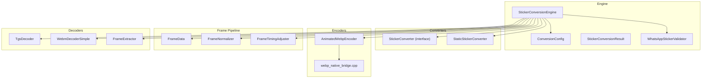
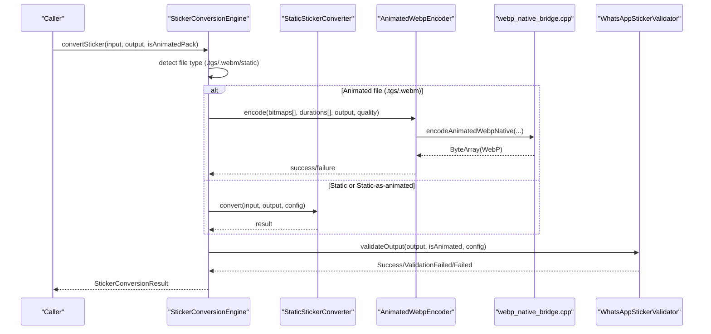
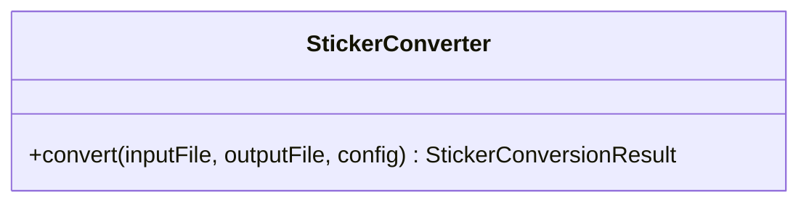
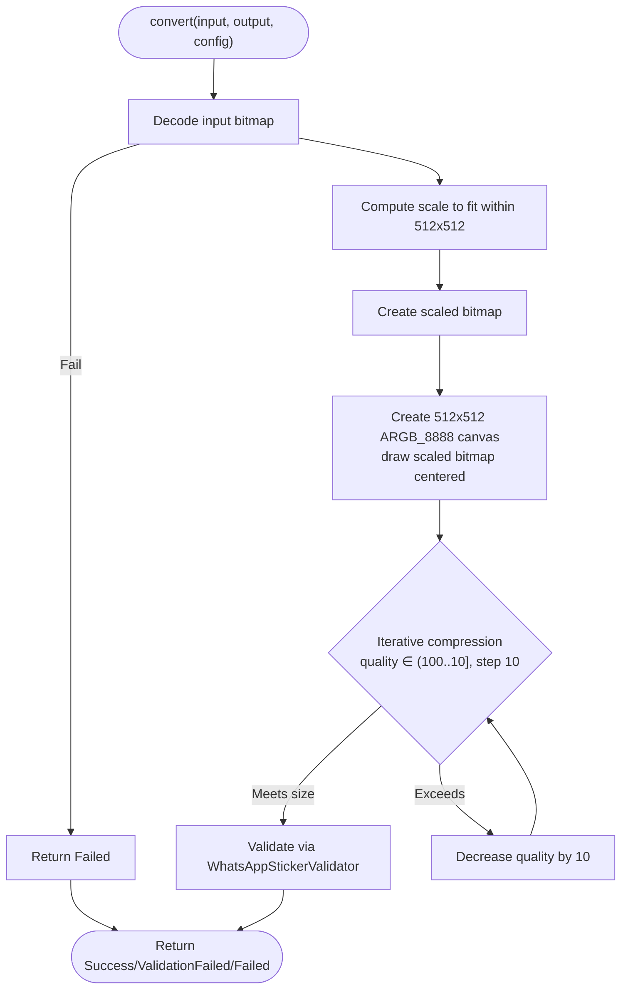
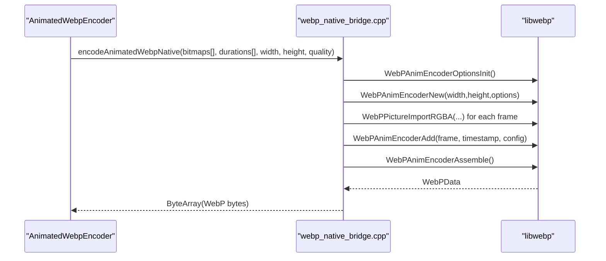
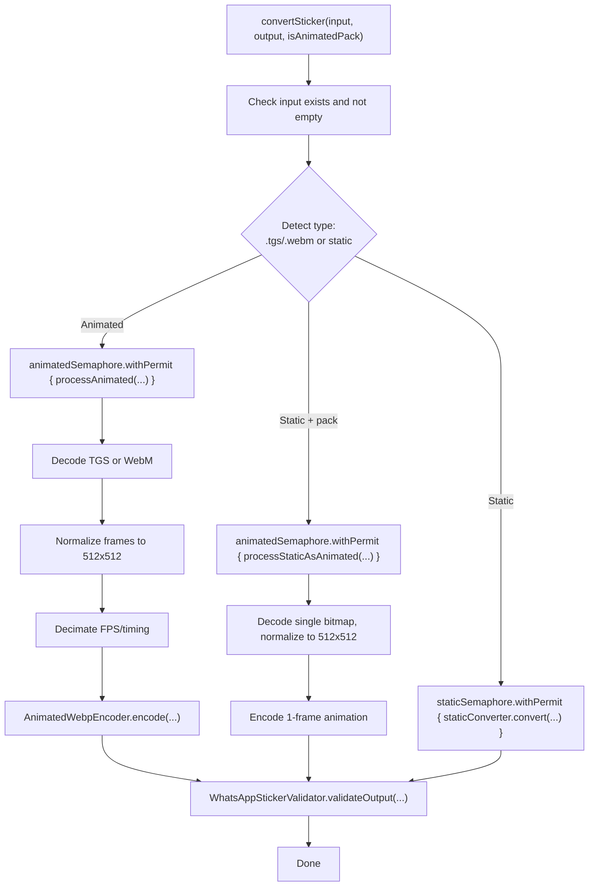
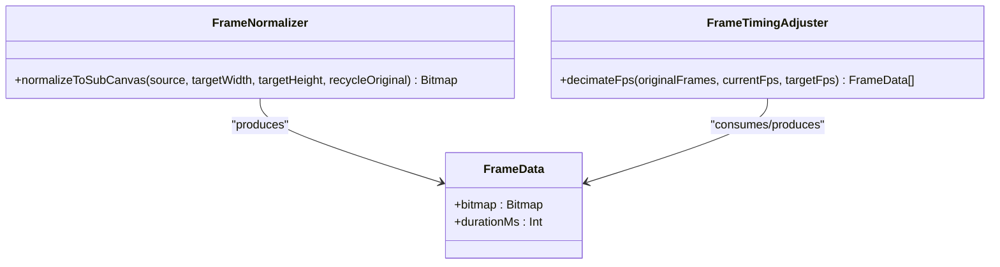
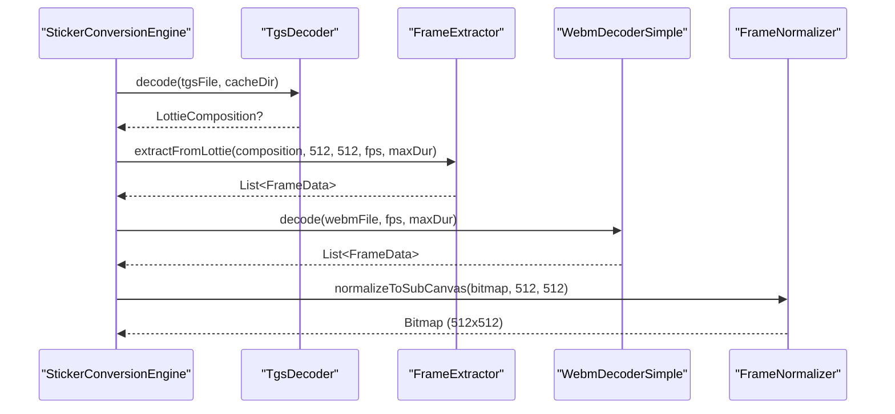
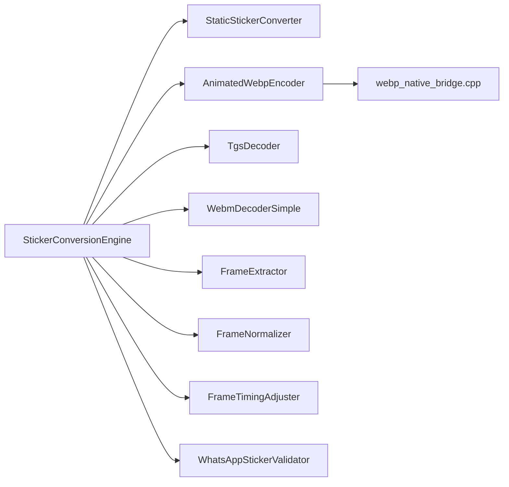

# Converter Types and Implementations

<cite>
**Referenced Files in This Document**
- [StickerConverter.kt](file://app/src/main/java/com/maheshsharan/tel2what/engine/StickerConverter.kt)
- [StaticStickerConverter.kt](file://app/src/main/java/com/maheshsharan/tel2what/engine/StaticStickerConverter.kt)
- [AnimatedWebpEncoder.kt](file://app/src/main/java/com/maheshsharan/tel2what/engine/encoder/AnimatedWebpEncoder.kt)
- [StickerConversionEngine.kt](file://app/src/main/java/com/maheshsharan/tel2what/engine/StickerConversionEngine.kt)
- [ConversionConfig.kt](file://app/src/main/java/com/maheshsharan/tel2what/engine/ConversionConfig.kt)
- [StickerConversionResult.kt](file://app/src/main/java/com/maheshsharan/tel2what/engine/StickerConversionResult.kt)
- [WhatsAppStickerValidator.kt](file://app/src/main/java/com/maheshsharan/tel2what/engine/WhatsAppStickerValidator.kt)
- [webp_native_bridge.cpp](file://app/src/main/cpp/webp_native_bridge.cpp)
- [FrameData.kt](file://app/src/main/java/com/maheshsharan/tel2what/engine/frame/FrameData.kt)
- [FrameNormalizer.kt](file://app/src/main/java/com/maheshsharan/tel2what/engine/frame/FrameNormalizer.kt)
- [FrameTimingAdjuster.kt](file://app/src/main/java/com/maheshsharan/tel2what/engine/frame/FrameTimingAdjuster.kt)
- [TgsDecoder.kt](file://app/src/main/java/com/maheshsharan/tel2what/engine/decoder/TgsDecoder.kt)
- [WebmDecoderSimple.kt](file://app/src/main/java/com/maheshsharan/tel2what/engine/decoder/WebmDecoderSimple.kt)
- [FrameExtractor.kt](file://app/src/main/java/com/maheshsharan/tel2what/engine/decoder/FrameExtractor.kt)
</cite>

## Table of Contents
1. [Introduction](#introduction)
2. [Project Structure](#project-structure)
3. [Core Components](#core-components)
4. [Architecture Overview](#architecture-overview)
5. [Detailed Component Analysis](#detailed-component-analysis)
6. [Dependency Analysis](#dependency-analysis)
7. [Performance Considerations](#performance-considerations)
8. [Troubleshooting Guide](#troubleshooting-guide)
9. [Conclusion](#conclusion)

## Introduction
This document explains the conversion engine’s converter implementations and how they transform Telegram stickers into WhatsApp-compliant WebP formats. It covers the base contract for converters, the static image converter, the animated WebP encoder with its JNI bridge, and the orchestration logic that selects the appropriate converter. It also outlines configuration, validation, and performance characteristics, along with usage patterns and extensibility points.

## Project Structure
The conversion engine is organized around a core interface and several implementations:
- Base contract: StickerConverter
- Static image converter: StaticStickerConverter
- Animated WebP encoder: AnimatedWebpEncoder (with native bridge)
- Orchestration: StickerConversionEngine
- Supporting types: ConversionConfig, StickerConversionResult, WhatsAppStickerValidator
- Frame pipeline: FrameData, FrameNormalizer, FrameTimingAdjuster
- Decoders: TgsDecoder, WebmDecoderSimple, FrameExtractor

**Diagram sources**
- [StickerConversionEngine.kt](file://app/src/main/java/com/maheshsharan/tel2what/engine/StickerConversionEngine.kt#L17-L88)
- [StickerConverter.kt](file://app/src/main/java/com/maheshsharan/tel2what/engine/StickerConverter.kt#L5-L18)
- [StaticStickerConverter.kt](file://app/src/main/java/com/maheshsharan/tel2what/engine/StaticStickerConverter.kt#L15-L92)
- [AnimatedWebpEncoder.kt](file://app/src/main/java/com/maheshsharan/tel2what/engine/encoder/AnimatedWebpEncoder.kt#L8-L89)
- [webp_native_bridge.cpp](file://app/src/main/cpp/webp_native_bridge.cpp#L13-L147)
- [FrameData.kt](file://app/src/main/java/com/maheshsharan/tel2what/engine/frame/FrameData.kt#L5-L8)
- [FrameNormalizer.kt](file://app/src/main/java/com/maheshsharan/tel2what/engine/frame/FrameNormalizer.kt#L11-L60)
- [FrameTimingAdjuster.kt](file://app/src/main/java/com/maheshsharan/tel2what/engine/frame/FrameTimingAdjuster.kt#L8-L69)
- [TgsDecoder.kt](file://app/src/main/java/com/maheshsharan/tel2what/engine/decoder/TgsDecoder.kt#L17-L79)
- [WebmDecoderSimple.kt](file://app/src/main/java/com/maheshsharan/tel2what/engine/decoder/WebmDecoderSimple.kt#L20-L191)
- [FrameExtractor.kt](file://app/src/main/java/com/maheshsharan/tel2what/engine/decoder/FrameExtractor.kt#L16-L98)

**Section sources**
- [StickerConversionEngine.kt](file://app/src/main/java/com/maheshsharan/tel2what/engine/StickerConversionEngine.kt#L17-L88)
- [ConversionConfig.kt](file://app/src/main/java/com/maheshsharan/tel2what/engine/ConversionConfig.kt#L3-L13)

## Core Components
- StickerConverter: Defines the contract for converting input files into WebP stickers with a suspend convert method.
- StaticStickerConverter: Implements conversion for static images, ensuring exact dimensions and size constraints via iterative compression.
- AnimatedWebpEncoder: Provides a Kotlin wrapper for native WebP animation encoding via JNI.
- StickerConversionEngine: Orchestrates routing to the correct converter, manages concurrency, and applies multi-dimensional compression loops.
- ConversionConfig: Centralizes constraints and defaults (dimensions, sizes, FPS, durations).
- StickerConversionResult: Sealed class representing outcomes of conversions.
- WhatsAppStickerValidator: Validates output against WhatsApp constraints.

**Section sources**
- [StickerConverter.kt](file://app/src/main/java/com/maheshsharan/tel2what/engine/StickerConverter.kt#L5-L18)
- [StaticStickerConverter.kt](file://app/src/main/java/com/maheshsharan/tel2what/engine/StaticStickerConverter.kt#L15-L92)
- [AnimatedWebpEncoder.kt](file://app/src/main/java/com/maheshsharan/tel2what/engine/encoder/AnimatedWebpEncoder.kt#L8-L89)
- [StickerConversionEngine.kt](file://app/src/main/java/com/maheshsharan/tel2what/engine/StickerConversionEngine.kt#L17-L88)
- [ConversionConfig.kt](file://app/src/main/java/com/maheshsharan/tel2what/engine/ConversionConfig.kt#L3-L13)
- [StickerConversionResult.kt](file://app/src/main/java/com/maheshsharan/tel2what/engine/StickerConversionResult.kt#L5-L22)
- [WhatsAppStickerValidator.kt](file://app/src/main/java/com/maheshsharan/tel2what/engine/WhatsAppStickerValidator.kt#L7-L70)

## Architecture Overview
The engine routes inputs to either static or animated pipelines. Static images are processed in-memory with iterative WebP compression. Animated inputs are decoded to frames, normalized, optionally decimated for timing/fps, and encoded natively to WebP with a configurable quality loop.

**Diagram sources**
- [StickerConversionEngine.kt](file://app/src/main/java/com/maheshsharan/tel2what/engine/StickerConversionEngine.kt#L33-L87)
- [StaticStickerConverter.kt](file://app/src/main/java/com/maheshsharan/tel2what/engine/StaticStickerConverter.kt#L17-L92)
- [AnimatedWebpEncoder.kt](file://app/src/main/java/com/maheshsharan/tel2what/engine/encoder/AnimatedWebpEncoder.kt#L32-L78)
- [webp_native_bridge.cpp](file://app/src/main/cpp/webp_native_bridge.cpp#L13-L147)
- [WhatsAppStickerValidator.kt](file://app/src/main/java/com/maheshsharan/tel2what/engine/WhatsAppStickerValidator.kt#L14-L70)

## Detailed Component Analysis

### StickerConverter Interface
- Role: Base contract for all converters.
- Method: convert(inputFile, outputFile, config) suspending and returning StickerConversionResult.
- Extensibility: New converter types implement this interface and integrate via the engine’s routing.

**Diagram sources**
- [StickerConverter.kt](file://app/src/main/java/com/maheshsharan/tel2what/engine/StickerConverter.kt#L5-L18)

**Section sources**
- [StickerConverter.kt](file://app/src/main/java/com/maheshsharan/tel2what/engine/StickerConverter.kt#L5-L18)

### StaticStickerConverter
- Purpose: Convert static images to a 512x512 transparent-canvas WebP under size limits.
- Supported formats: Any image decodable by Android’s BitmapFactory (e.g., PNG, JPEG, WebP).
- Quality settings: Iterative WebP lossy compression with quality stepping to meet maxStaticSizeBytes.
- Optimization techniques:
  - Exact 512x512 canvas with transparent letterboxing.
  - Aspect-ratio preserving scaling.
  - Bitmap recycling to reduce GC pressure.
- Validation: Delegates to WhatsAppStickerValidator for size and dimension checks.

**Diagram sources**
- [StaticStickerConverter.kt](file://app/src/main/java/com/maheshsharan/tel2what/engine/StaticStickerConverter.kt#L17-L92)
- [WhatsAppStickerValidator.kt](file://app/src/main/java/com/maheshsharan/tel2what/engine/WhatsAppStickerValidator.kt#L14-L70)

**Section sources**
- [StaticStickerConverter.kt](file://app/src/main/java/com/maheshsharan/tel2what/engine/StaticStickerConverter.kt#L15-L92)
- [ConversionConfig.kt](file://app/src/main/java/com/maheshsharan/tel2what/engine/ConversionConfig.kt#L3-L13)

### AnimatedWebpEncoder (JNI Bridge)
- Purpose: Encodes an array of ARGB_8888 Bitmaps into an animated WebP using libwebp via JNI.
- JNI bridge: Loads native library and exposes encodeAnimatedWebpNative.
- Native implementation:
  - Initializes WebPAnimEncoder with loop_count=0 for infinite looping.
  - Configures WebPConfig (lossy, method=1 for speed).
  - Imports RGBA frames directly from Android pixel buffers.
  - Assembles animation and returns a Java ByteArray.
- Performance characteristics:
  - Uses lossy compression to stay under 500 KB.
  - Fast encoding method=1 to maximize throughput.
  - Requires RGBA_8888 frames; normalizer ensures format and size.

**Diagram sources**
- [AnimatedWebpEncoder.kt](file://app/src/main/java/com/maheshsharan/tel2what/engine/encoder/AnimatedWebpEncoder.kt#L32-L89)
- [webp_native_bridge.cpp](file://app/src/main/cpp/webp_native_bridge.cpp#L13-L147)

**Section sources**
- [AnimatedWebpEncoder.kt](file://app/src/main/java/com/maheshsharan/tel2what/engine/encoder/AnimatedWebpEncoder.kt#L8-L89)
- [webp_native_bridge.cpp](file://app/src/main/cpp/webp_native_bridge.cpp#L13-L147)

### StickerConversionEngine (Routing and Concurrency)
- Responsibilities:
  - Detects input type (.tgs, .webm, static).
  - Routes to static, static-as-animated, or animated pipelines.
  - Manages concurrency with semaphores (4 static threads, 1 animated).
  - Applies multi-dimensional compression loop for animations (FPS and quality).
- Pipelines:
  - Static: calls StaticStickerConverter.
  - Static-as-animated: wraps a single decoded frame into a 1-frame animation.
  - Animated: decodes via TgsDecoder or WebmDecoderSimple, normalizes frames, decimates FPS/timing, encodes via AnimatedWebpEncoder, validates output.

**Diagram sources**
- [StickerConversionEngine.kt](file://app/src/main/java/com/maheshsharan/tel2what/engine/StickerConversionEngine.kt#L33-L87)
- [StickerConversionEngine.kt](file://app/src/main/java/com/maheshsharan/tel2what/engine/StickerConversionEngine.kt#L90-L129)
- [StickerConversionEngine.kt](file://app/src/main/java/com/maheshsharan/tel2what/engine/StickerConversionEngine.kt#L131-L273)

**Section sources**
- [StickerConversionEngine.kt](file://app/src/main/java/com/maheshsharan/tel2what/engine/StickerConversionEngine.kt#L17-L88)
- [StickerConversionEngine.kt](file://app/src/main/java/com/maheshsharan/tel2what/engine/StickerConversionEngine.kt#L90-L129)
- [StickerConversionEngine.kt](file://app/src/main/java/com/maheshsharan/tel2what/engine/StickerConversionEngine.kt#L131-L273)

### Frame Pipeline Components
- FrameData: Holds a bitmap and its presentation duration.
- FrameNormalizer: Scales and letterboxes frames to 512x512 with transparent padding.
- FrameTimingAdjuster: Decimates FPS by accumulating durations, respecting minimum frame duration and global duration caps.

**Diagram sources**
- [FrameData.kt](file://app/src/main/java/com/maheshsharan/tel2what/engine/frame/FrameData.kt#L5-L8)
- [FrameNormalizer.kt](file://app/src/main/java/com/maheshsharan/tel2what/engine/frame/FrameNormalizer.kt#L11-L60)
- [FrameTimingAdjuster.kt](file://app/src/main/java/com/maheshsharan/tel2what/engine/frame/FrameTimingAdjuster.kt#L8-L69)

**Section sources**
- [FrameData.kt](file://app/src/main/java/com/maheshsharan/tel2what/engine/frame/FrameData.kt#L5-L8)
- [FrameNormalizer.kt](file://app/src/main/java/com/maheshsharan/tel2what/engine/frame/FrameNormalizer.kt#L11-L60)
- [FrameTimingAdjuster.kt](file://app/src/main/java/com/maheshsharan/tel2what/engine/frame/FrameTimingAdjuster.kt#L8-L69)

### Decoders
- TgsDecoder: Decompresses .tgs (GZIP JSON) and parses into a LottieComposition.
- WebmDecoderSimple: Extracts video frames using MediaCodec in ByteBuffer mode, converts YUV to RGB, and returns frames with durations.
- FrameExtractor: Renders Lottie frames into 512x512 ARGB_8888 bitmaps at target FPS.

**Diagram sources**
- [TgsDecoder.kt](file://app/src/main/java/com/maheshsharan/tel2what/engine/decoder/TgsDecoder.kt#L21-L79)
- [FrameExtractor.kt](file://app/src/main/java/com/maheshsharan/tel2what/engine/decoder/FrameExtractor.kt#L24-L98)
- [WebmDecoderSimple.kt](file://app/src/main/java/com/maheshsharan/tel2what/engine/decoder/WebmDecoderSimple.kt#L23-L191)
- [FrameNormalizer.kt](file://app/src/main/java/com/maheshsharan/tel2what/engine/frame/FrameNormalizer.kt#L17-L60)

**Section sources**
- [TgsDecoder.kt](file://app/src/main/java/com/maheshsharan/tel2what/engine/decoder/TgsDecoder.kt#L17-L94)
- [FrameExtractor.kt](file://app/src/main/java/com/maheshsharan/tel2what/engine/decoder/FrameExtractor.kt#L16-L99)
- [WebmDecoderSimple.kt](file://app/src/main/java/com/maheshsharan/tel2what/engine/decoder/WebmDecoderSimple.kt#L20-L256)
- [FrameNormalizer.kt](file://app/src/main/java/com/maheshsharan/tel2what/engine/frame/FrameNormalizer.kt#L11-L60)

## Dependency Analysis
- Converter selection: StickerConversionEngine detects file type and routes to StaticStickerConverter or AnimatedWebpEncoder.
- Animation pipeline dependencies: Decoders → FrameExtractor/FrameNormalizer → FrameTimingAdjuster → AnimatedWebpEncoder → Validator.
- Static pipeline: StaticStickerConverter → Validator.
- JNI dependency: AnimatedWebpEncoder depends on webp_native_bridge.cpp for native encoding.

**Diagram sources**
- [StickerConversionEngine.kt](file://app/src/main/java/com/maheshsharan/tel2what/engine/StickerConversionEngine.kt#L17-L88)
- [StaticStickerConverter.kt](file://app/src/main/java/com/maheshsharan/tel2what/engine/StaticStickerConverter.kt#L15-L92)
- [AnimatedWebpEncoder.kt](file://app/src/main/java/com/maheshsharan/tel2what/engine/encoder/AnimatedWebpEncoder.kt#L8-L89)
- [webp_native_bridge.cpp](file://app/src/main/cpp/webp_native_bridge.cpp#L13-L147)
- [TgsDecoder.kt](file://app/src/main/java/com/maheshsharan/tel2what/engine/decoder/TgsDecoder.kt#L17-L79)
- [WebmDecoderSimple.kt](file://app/src/main/java/com/maheshsharan/tel2what/engine/decoder/WebmDecoderSimple.kt#L20-L191)
- [FrameExtractor.kt](file://app/src/main/java/com/maheshsharan/tel2what/engine/decoder/FrameExtractor.kt#L16-L99)
- [FrameNormalizer.kt](file://app/src/main/java/com/maheshsharan/tel2what/engine/frame/FrameNormalizer.kt#L11-L60)
- [FrameTimingAdjuster.kt](file://app/src/main/java/com/maheshsharan/tel2what/engine/frame/FrameTimingAdjuster.kt#L8-L69)
- [WhatsAppStickerValidator.kt](file://app/src/main/java/com/maheshsharan/tel2what/engine/WhatsAppStickerValidator.kt#L7-L70)

**Section sources**
- [StickerConversionEngine.kt](file://app/src/main/java/com/maheshsharan/tel2what/engine/StickerConversionEngine.kt#L17-L88)
- [AnimatedWebpEncoder.kt](file://app/src/main/java/com/maheshsharan/tel2what/engine/encoder/AnimatedWebpEncoder.kt#L8-L89)
- [webp_native_bridge.cpp](file://app/src/main/cpp/webp_native_bridge.cpp#L13-L147)

## Performance Considerations
- Static conversion:
  - Iterative compression reduces quality in steps to meet size targets.
  - Ensures exact 512x512 canvas to avoid extra processing later.
- Animated conversion:
  - Multi-dimensional compression loop: starts with low quality and gradually lowers FPS when needed.
  - Uses lossy WebP with method optimized for speed.
  - Maintains global duration and enforces minimum frame duration to satisfy platform constraints.
- Concurrency:
  - Static pipeline allows up to 4 concurrent conversions.
  - Animated pipeline is serialized to prevent thermal throttling and OOM.

[No sources needed since this section provides general guidance]

## Troubleshooting Guide
Common issues and where they originate:
- Input file errors: Engine checks existence and non-empty size early and returns Failed.
- Static conversion failures: Decoding failures or inability to compress under size limits.
- Animated decoding failures: TGS parsing errors or WebM yielding zero frames.
- JNI encoding failures: Native encoder returns null/empty or IO write fails.
- Validation failures: Output size or dimensions violate WhatsApp constraints.

Where to look:
- Engine logs for routing and metrics.
- Validator logs for size/dimension checks.
- Decoder logs for parsing/decoding issues.
- Native logs for JNI errors.

**Section sources**
- [StickerConversionEngine.kt](file://app/src/main/java/com/maheshsharan/tel2what/engine/StickerConversionEngine.kt#L45-L53)
- [StickerConversionEngine.kt](file://app/src/main/java/com/maheshsharan/tel2what/engine/StickerConversionEngine.kt#L94-L96)
- [StickerConversionEngine.kt](file://app/src/main/java/com/maheshsharan/tel2what/engine/StickerConversionEngine.kt#L141-L144)
- [StickerConversionEngine.kt](file://app/src/main/java/com/maheshsharan/tel2what/engine/StickerConversionEngine.kt#L163-L166)
- [AnimatedWebpEncoder.kt](file://app/src/main/java/com/maheshsharan/tel2what/engine/encoder/AnimatedWebpEncoder.kt#L74-L77)
- [WhatsAppStickerValidator.kt](file://app/src/main/java/com/maheshsharan/tel2what/engine/WhatsAppStickerValidator.kt#L19-L40)

## Conclusion
The conversion engine cleanly separates concerns: a base converter interface, specialized implementations for static and animated content, robust decoders and frame processing utilities, and a native encoder for efficient WebP animation generation. The engine’s routing, concurrency controls, and multi-dimensional compression loop ensure reliable, high-quality outputs within strict size and dimension constraints for WhatsApp.