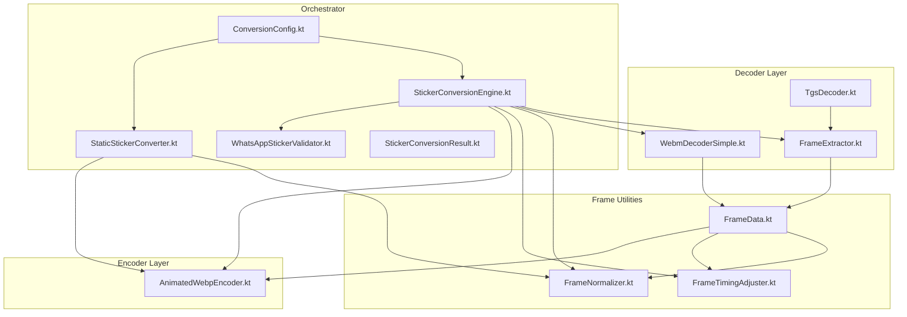
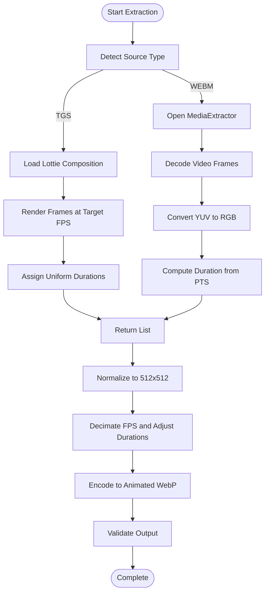
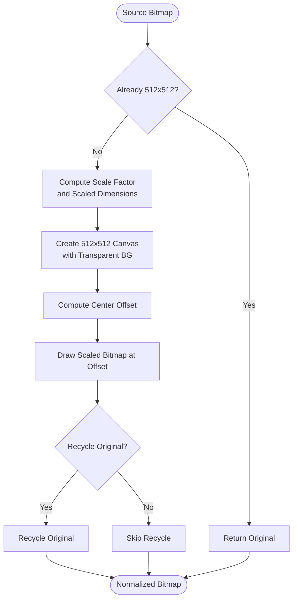
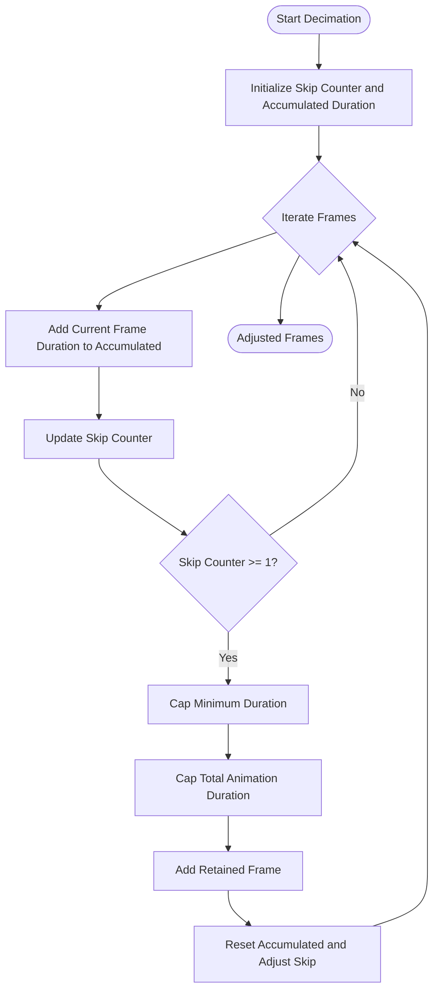
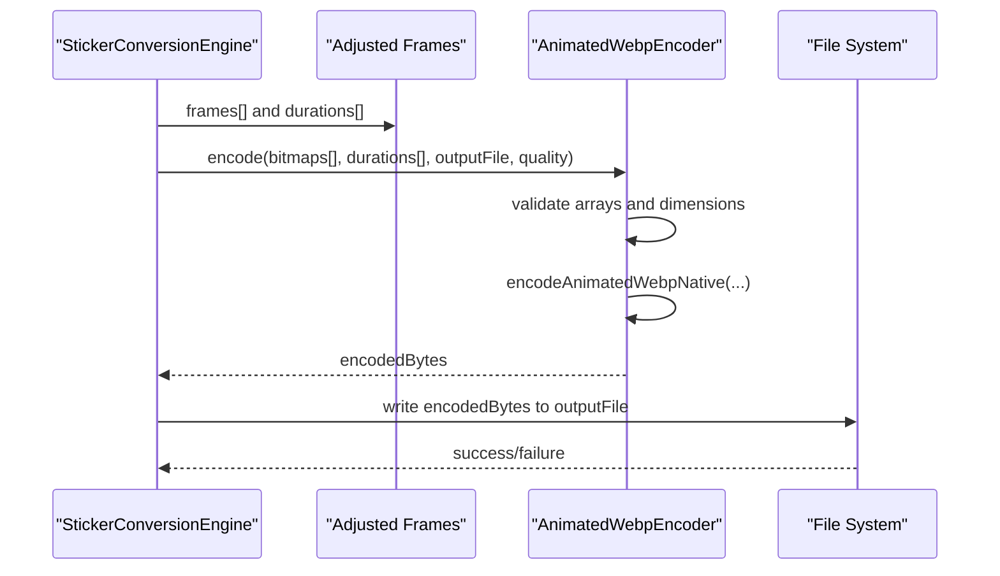
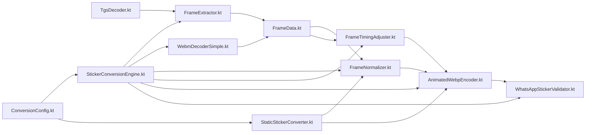

# Frame Processing and Normalization

<cite>
**Referenced Files in This Document**
- [FrameData.kt](file://app/src/main/java/com/maheshsharan/tel2what/engine/frame/FrameData.kt)
- [FrameNormalizer.kt](file://app/src/main/java/com/maheshsharan/tel2what/engine/frame/FrameNormalizer.kt)
- [FrameTimingAdjuster.kt](file://app/src/main/java/com/maheshsharan/tel2what/engine/frame/FrameTimingAdjuster.kt)
- [FrameExtractor.kt](file://app/src/main/java/com/maheshsharan/tel2what/engine/decoder/FrameExtractor.kt)
- [WebmDecoderSimple.kt](file://app/src/main/java/com/maheshsharan/tel2what/engine/decoder/WebmDecoderSimple.kt)
- [TgsDecoder.kt](file://app/src/main/java/com/maheshsharan/tel2what/engine/decoder/TgsDecoder.kt)
- [AnimatedWebpEncoder.kt](file://app/src/main/java/com/maheshsharan/tel2what/engine/encoder/AnimatedWebpEncoder.kt)
- [StickerConversionEngine.kt](file://app/src/main/java/com/maheshsharan/tel2what/engine/StickerConversionEngine.kt)
- [StaticStickerConverter.kt](file://app/src/main/java/com/maheshsharan/tel2what/engine/StaticStickerConverter.kt)
- [ConversionConfig.kt](file://app/src/main/java/com/maheshsharan/tel2what/engine/ConversionConfig.kt)
- [WhatsAppStickerValidator.kt](file://app/src/main/java/com/maheshsharan/tel2what/engine/WhatsAppStickerValidator.kt)
- [StickerConversionResult.kt](file://app/src/main/java/com/maheshsharan/tel2what/engine/StickerConversionResult.kt)
</cite>

## Table of Contents
1. [Introduction](#introduction)
2. [Project Structure](#project-structure)
3. [Core Components](#core-components)
4. [Architecture Overview](#architecture-overview)
5. [Detailed Component Analysis](#detailed-component-analysis)
6. [Dependency Analysis](#dependency-analysis)
7. [Performance Considerations](#performance-considerations)
8. [Troubleshooting Guide](#troubleshooting-guide)
9. [Conclusion](#conclusion)

## Introduction
This document explains the frame processing pipeline used to convert animated content into WhatsApp-compatible stickers. It focuses on three core components:
- FrameData: a lightweight structure that encapsulates a bitmap frame and its presentation duration.
- FrameNormalizer: a utility that scales and centers arbitrary bitmaps into a fixed 512x512 canvas with transparent letterboxing.
- FrameTimingAdjuster: a utility that reduces frame rates by decimating frames and accumulating durations to preserve global timing.

The document also covers the end-to-end workflows for extracting frames from Lottie animations (.tgs) and WebM videos, normalization to WhatsApp’s constraints, timing adjustments, and the final encoding to Animated WebP. Memory management strategies and performance optimizations for batch frame processing are included.

## Project Structure
The frame processing logic is organized into focused modules:
- decoder: Extracts frames from Lottie compositions and WebM videos.
- frame: Encapsulates frame data and provides normalization and timing adjustment utilities.
- encoder: Encodes the processed frames into Animated WebP using native bindings.
- engine: Orchestrates the entire conversion pipeline with concurrency control and validation.



**Diagram sources**
- [FrameExtractor.kt](file://app/src/main/java/com/maheshsharan/tel2what/engine/decoder/FrameExtractor.kt#L1-L100)
- [WebmDecoderSimple.kt](file://app/src/main/java/com/maheshsharan/tel2what/engine/decoder/WebmDecoderSimple.kt#L1-L256)
- [TgsDecoder.kt](file://app/src/main/java/com/maheshsharan/tel2what/engine/decoder/TgsDecoder.kt#L1-L94)
- [FrameData.kt](file://app/src/main/java/com/maheshsharan/tel2what/engine/frame/FrameData.kt#L1-L9)
- [FrameNormalizer.kt](file://app/src/main/java/com/maheshsharan/tel2what/engine/frame/FrameNormalizer.kt#L1-L62)
- [FrameTimingAdjuster.kt](file://app/src/main/java/com/maheshsharan/tel2what/engine/frame/FrameTimingAdjuster.kt#L1-L72)
- [AnimatedWebpEncoder.kt](file://app/src/main/java/com/maheshsharan/tel2what/engine/encoder/AnimatedWebpEncoder.kt#L1-L91)
- [StickerConversionEngine.kt](file://app/src/main/java/com/maheshsharan/tel2what/engine/StickerConversionEngine.kt#L1-L275)
- [StaticStickerConverter.kt](file://app/src/main/java/com/maheshsharan/tel2what/engine/StaticStickerConverter.kt#L1-L94)
- [ConversionConfig.kt](file://app/src/main/java/com/maheshsharan/tel2what/engine/ConversionConfig.kt#L1-L14)
- [WhatsAppStickerValidator.kt](file://app/src/main/java/com/maheshsharan/tel2what/engine/WhatsAppStickerValidator.kt#L1-L72)
- [StickerConversionResult.kt](file://app/src/main/java/com/maheshsharan/tel2what/engine/StickerConversionResult.kt#L1-L23)

**Section sources**
- [StickerConversionEngine.kt](file://app/src/main/java/com/maheshsharan/tel2what/engine/StickerConversionEngine.kt#L1-L275)
- [ConversionConfig.kt](file://app/src/main/java/com/maheshsharan/tel2what/engine/ConversionConfig.kt#L1-L14)

## Core Components
This section documents the three primary frame processing components.

### FrameData
FrameData is a simple data class that pairs a bitmap with its presentation duration in milliseconds. It serves as the fundamental unit for frame sequences.

Key characteristics:
- Encapsulates a Bitmap and an integer duration.
- Used consistently across extraction, normalization, timing adjustment, and encoding stages.

Example usage references:
- FrameExtractor creates FrameData instances with uniform durations derived from target FPS.
- WebmDecoderSimple creates FrameData with durations computed from presentation timestamps.
- FrameTimingAdjuster operates on lists of FrameData to reduce frame rate while preserving total duration.
- AnimatedWebpEncoder consumes arrays of FrameData bitmaps and durations.

**Section sources**
- [FrameData.kt](file://app/src/main/java/com/maheshsharan/tel2what/engine/frame/FrameData.kt#L1-L9)

### FrameNormalizer
FrameNormalizer transforms arbitrary bitmaps into a fixed 512x512 canvas with transparent letterboxing. It maintains aspect ratio by scaling to fit within the target bounds and centers the scaled content.

Key behaviors:
- Aspect-ratio-preserving scaling using the smaller of width or height ratios.
- Transparent background to support letterboxing around the scaled image.
- Optional recycling of the original bitmap to reduce memory pressure.
- Early exit when the source bitmap already matches the target dimensions.

Performance notes:
- Uses ARGB_8888 bitmaps for full alpha support.
- Minimizes allocations by reusing canvases and avoiding unnecessary copies.

Constraints:
- Output dimensions are strictly 512x512 pixels.
- Letterboxed regions are fully transparent.

**Section sources**
- [FrameNormalizer.kt](file://app/src/main/java/com/maheshsharan/tel2what/engine/frame/FrameNormalizer.kt#L1-L62)

### FrameTimingAdjuster
FrameTimingAdjuster reduces frame rate by decimating frames and accumulating their durations into retained frames. This avoids re-rendering content while preserving the global animation duration and meeting platform constraints.

Key behaviors:
- Computes a skip counter based on the ratio of current to target FPS.
- Accumulates durations from dropped frames into the next retained frame.
- Enforces a minimum duration threshold to satisfy platform requirements.
- Caps total animation duration at the maximum allowed value.
- Preserves global timing by carrying forward accumulated durations.

Processing logic highlights:
- Hard constraint: minimum frame duration enforced.
- Hard constraint: maximum total animation duration enforced.
- Dropped frames are not recycled here; recycling is deferred to the engine orchestrator.

**Section sources**
- [FrameTimingAdjuster.kt](file://app/src/main/java/com/maheshsharan/tel2what/engine/frame/FrameTimingAdjuster.kt#L1-L72)

## Architecture Overview
The conversion pipeline integrates decoding, normalization, timing adjustment, and encoding with strict validation and memory management.

```mermaid
sequenceDiagram
participant Client as "Caller"
participant Engine as "StickerConversionEngine"
participant Decoder as "FrameExtractor/WebmDecoderSimple"
participant Normalizer as "FrameNormalizer"
participant Adjuster as "FrameTimingAdjuster"
participant Encoder as "AnimatedWebpEncoder"
participant Validator as "WhatsAppStickerValidator"
Client->>Engine : convertSticker(inputFile, outputFile, isAnimatedPack)
Engine->>Engine : detect file type and route pipeline
alt Animated TGS
Engine->>Decoder : extractFromLottie(composition, dims, fps, maxDuration)
Decoder-->>Engine : List<FrameData>
else Animated WEBM
Engine->>Decoder : decode(webmFile, fps, maxDuration)
Decoder-->>Engine : List<FrameData>
else Static or Static-as-animated
Engine->>Engine : processStaticAsAnimated or StaticStickerConverter
Engine-->>Client : StickerConversionResult
exit
end
Engine->>Normalizer : normalizeToSubCanvas(bitmap, 512, 512)
Normalizer-->>Engine : List<FrameData>
Engine->>Adjuster : decimateFps(frames, targetFps, currentFps)
Adjuster-->>Engine : List<FrameData>
Engine->>Encoder : encode(bitmaps[], durations[], outputFile, quality)
Encoder-->>Engine : success/failure
Engine->>Validator : validateOutput(outputFile, isAnimated, config)
Validator-->>Engine : StickerConversionResult
Engine-->>Client : StickerConversionResult
```

**Diagram sources**
- [StickerConversionEngine.kt](file://app/src/main/java/com/maheshsharan/tel2what/engine/StickerConversionEngine.kt#L1-L275)
- [FrameExtractor.kt](file://app/src/main/java/com/maheshsharan/tel2what/engine/decoder/FrameExtractor.kt#L1-L100)
- [WebmDecoderSimple.kt](file://app/src/main/java/com/maheshsharan/tel2what/engine/decoder/WebmDecoderSimple.kt#L1-L256)
- [FrameNormalizer.kt](file://app/src/main/java/com/maheshsharan/tel2what/engine/frame/FrameNormalizer.kt#L1-L62)
- [FrameTimingAdjuster.kt](file://app/src/main/java/com/maheshsharan/tel2what/engine/frame/FrameTimingAdjuster.kt#L1-L72)
- [AnimatedWebpEncoder.kt](file://app/src/main/java/com/maheshsharan/tel2what/engine/encoder/AnimatedWebpEncoder.kt#L1-L91)
- [WhatsAppStickerValidator.kt](file://app/src/main/java/com/maheshsharan/tel2what/engine/WhatsAppStickerValidator.kt#L1-L72)

## Detailed Component Analysis

### Frame Extraction Workflows
Two primary extraction paths produce FrameData sequences:

- Lottie (.tgs) extraction:
  - Loads a LottieComposition and renders frames at a target FPS onto 512x512 transparent canvases.
  - Ensures a minimum frame count and enforces maximum duration.
  - Produces uniformly spaced frames with equal durations.

- WebM decoding:
  - Uses MediaCodec to decode video frames to ByteBuffer, converting YUV to RGB bitmaps.
  - Captures frames at target intervals and computes durations from presentation timestamps.
  - Applies duration caps and ensures minimum duration thresholds.



**Diagram sources**
- [FrameExtractor.kt](file://app/src/main/java/com/maheshsharan/tel2what/engine/decoder/FrameExtractor.kt#L1-L100)
- [WebmDecoderSimple.kt](file://app/src/main/java/com/maheshsharan/tel2what/engine/decoder/WebmDecoderSimple.kt#L1-L256)
- [FrameNormalizer.kt](file://app/src/main/java/com/maheshsharan/tel2what/engine/frame/FrameNormalizer.kt#L1-L62)
- [FrameTimingAdjuster.kt](file://app/src/main/java/com/maheshsharan/tel2what/engine/frame/FrameTimingAdjuster.kt#L1-L72)

**Section sources**
- [FrameExtractor.kt](file://app/src/main/java/com/maheshsharan/tel2what/engine/decoder/FrameExtractor.kt#L1-L100)
- [WebmDecoderSimple.kt](file://app/src/main/java/com/maheshsharan/tel2what/engine/decoder/WebmDecoderSimple.kt#L1-L256)

### Normalization Process
Normalization ensures all frames meet WhatsApp’s 512x512 pixel requirement with transparent letterboxing. The process:
- Computes the scale factor to fit within the target bounds while preserving aspect ratio.
- Creates a 512x512 ARGB_8888 canvas with a transparent background.
- Centers the scaled bitmap within the canvas.
- Optionally recycles the original bitmap to free memory.



**Diagram sources**
- [FrameNormalizer.kt](file://app/src/main/java/com/maheshsharan/tel2what/engine/frame/FrameNormalizer.kt#L1-L62)

**Section sources**
- [FrameNormalizer.kt](file://app/src/main/java/com/maheshsharan/tel2what/engine/frame/FrameNormalizer.kt#L1-L62)

### Timing Adjustment Workflow
Timing adjustment reduces frame rate by decimation while preserving global timing and respecting platform constraints:
- Computes a skip counter based on the ratio of current to target FPS.
- Accumulates durations from dropped frames into the next retained frame.
- Enforces minimum duration and caps total animation duration.
- Logs metrics and returns the adjusted frame sequence.



**Diagram sources**
- [FrameTimingAdjuster.kt](file://app/src/main/java/com/maheshsharan/tel2what/engine/frame/FrameTimingAdjuster.kt#L1-L72)

**Section sources**
- [FrameTimingAdjuster.kt](file://app/src/main/java/com/maheshsharan/tel2what/engine/frame/FrameTimingAdjuster.kt#L1-L72)

### Encoding Pipeline
AnimatedWebpEncoder wraps the native libwebp encoder to mux frames into an Animated WebP file. It:
- Validates input arrays and dimensions.
- Bridges to native code with arrays of bitmaps and durations.
- Writes the resulting bytes to disk and reports success or failure.



**Diagram sources**
- [AnimatedWebpEncoder.kt](file://app/src/main/java/com/maheshsharan/tel2what/engine/encoder/AnimatedWebpEncoder.kt#L1-L91)
- [StickerConversionEngine.kt](file://app/src/main/java/com/maheshsharan/tel2what/engine/StickerConversionEngine.kt#L1-L275)

**Section sources**
- [AnimatedWebpEncoder.kt](file://app/src/main/java/com/maheshsharan/tel2what/engine/encoder/AnimatedWebpEncoder.kt#L1-L91)

## Dependency Analysis
The frame processing components depend on each other in a layered manner, with the engine orchestrating the flow.



**Diagram sources**
- [TgsDecoder.kt](file://app/src/main/java/com/maheshsharan/tel2what/engine/decoder/TgsDecoder.kt#L1-L94)
- [FrameExtractor.kt](file://app/src/main/java/com/maheshsharan/tel2what/engine/decoder/FrameExtractor.kt#L1-L100)
- [WebmDecoderSimple.kt](file://app/src/main/java/com/maheshsharan/tel2what/engine/decoder/WebmDecoderSimple.kt#L1-L256)
- [FrameData.kt](file://app/src/main/java/com/maheshsharan/tel2what/engine/frame/FrameData.kt#L1-L9)
- [FrameNormalizer.kt](file://app/src/main/java/com/maheshsharan/tel2what/engine/frame/FrameNormalizer.kt#L1-L62)
- [FrameTimingAdjuster.kt](file://app/src/main/java/com/maheshsharan/tel2what/engine/frame/FrameTimingAdjuster.kt#L1-L72)
- [AnimatedWebpEncoder.kt](file://app/src/main/java/com/maheshsharan/tel2what/engine/encoder/AnimatedWebpEncoder.kt#L1-L91)
- [WhatsAppStickerValidator.kt](file://app/src/main/java/com/maheshsharan/tel2what/engine/WhatsAppStickerValidator.kt#L1-L72)
- [StickerConversionEngine.kt](file://app/src/main/java/com/maheshsharan/tel2what/engine/StickerConversionEngine.kt#L1-L275)
- [ConversionConfig.kt](file://app/src/main/java/com/maheshsharan/tel2what/engine/ConversionConfig.kt#L1-L14)
- [StaticStickerConverter.kt](file://app/src/main/java/com/maheshsharan/tel2what/engine/StaticStickerConverter.kt#L1-L94)

**Section sources**
- [StickerConversionEngine.kt](file://app/src/main/java/com/maheshsharan/tel2what/engine/StickerConversionEngine.kt#L1-L275)

## Performance Considerations
Memory management and performance optimizations are critical for handling large frame arrays efficiently:

- Bitmap lifecycle control:
  - NormalizeToSubCanvas optionally recycles the original bitmap when the output is distinct.
  - FrameExtractor recycles bitmaps on exceptions to prevent memory leaks.
  - WebmDecoderSimple recycles bitmaps on failures and in finally blocks.
  - StickerConversionEngine recycles all frames after JNI encoding completes.

- Concurrency control:
  - Animated pipeline runs with a semaphore limiting to one concurrent thread to avoid thermal throttling and OOM.
  - Static pipeline allows up to four concurrent threads for lighter workloads.

- Batch processing optimizations:
  - FrameTimingAdjuster accumulates durations from dropped frames to minimize recomputation.
  - AnimatedWebpEncoder writes directly to disk and avoids extra copies.
  - ConversionConfig sets reasonable defaults (512x512, 10 FPS, 500 KB limit) to balance quality and performance.

- Yield points:
  - FrameExtractor yields between frames to allow cooperative cancellation and reduce blocking.

- Native encoding:
  - AnimatedWebpEncoder delegates to native libwebp for efficient compression and muxing.

**Section sources**
- [FrameNormalizer.kt](file://app/src/main/java/com/maheshsharan/tel2what/engine/frame/FrameNormalizer.kt#L1-L62)
- [FrameExtractor.kt](file://app/src/main/java/com/maheshsharan/tel2what/engine/decoder/FrameExtractor.kt#L1-L100)
- [WebmDecoderSimple.kt](file://app/src/main/java/com/maheshsharan/tel2what/engine/decoder/WebmDecoderSimple.kt#L1-L256)
- [StickerConversionEngine.kt](file://app/src/main/java/com/maheshsharan/tel2what/engine/StickerConversionEngine.kt#L1-L275)
- [AnimatedWebpEncoder.kt](file://app/src/main/java/com/maheshsharan/tel2what/engine/encoder/AnimatedWebpEncoder.kt#L1-L91)
- [ConversionConfig.kt](file://app/src/main/java/com/maheshsharan/tel2what/engine/ConversionConfig.kt#L1-L14)

## Troubleshooting Guide
Common issues and their handling:

- Input validation failures:
  - Engine checks for missing or empty input files and returns explicit failure results.
  - Validator verifies file existence, size limits, and dimensions.

- Extraction errors:
  - FrameExtractor catches exceptions and recycles allocated bitmaps to prevent leaks.
  - WebmDecoderSimple recycles frames and logs detailed errors during decode failures.

- Encoding failures:
  - AnimatedWebpEncoder validates arrays and dimensions before native calls.
  - Returns false if JNI returns null or empty byte arrays, or if IO fails.

- Timing and duration constraints:
  - FrameTimingAdjuster enforces minimum duration and caps total animation duration.
  - Engine logs warnings and metrics for FPS reductions and quality adjustments.

- Static conversion issues:
  - StaticStickerConverter iteratively reduces quality to meet size limits and validates output.

**Section sources**
- [StickerConversionEngine.kt](file://app/src/main/java/com/maheshsharan/tel2what/engine/StickerConversionEngine.kt#L1-L275)
- [FrameExtractor.kt](file://app/src/main/java/com/maheshsharan/tel2what/engine/decoder/FrameExtractor.kt#L1-L100)
- [WebmDecoderSimple.kt](file://app/src/main/java/com/maheshsharan/tel2what/engine/decoder/WebmDecoderSimple.kt#L1-L256)
- [AnimatedWebpEncoder.kt](file://app/src/main/java/com/maheshsharan/tel2what/engine/encoder/AnimatedWebpEncoder.kt#L1-L91)
- [WhatsAppStickerValidator.kt](file://app/src/main/java/com/maheshsharan/tel2what/engine/WhatsAppStickerValidator.kt#L1-L72)
- [StaticStickerConverter.kt](file://app/src/main/java/com/maheshsharan/tel2what/engine/StaticStickerConverter.kt#L1-L94)

## Conclusion
The frame processing pipeline provides a robust, memory-efficient solution for converting animated content into WhatsApp-compliant stickers. FrameData encapsulates frames and durations, FrameNormalizer ensures consistent 512x512 dimensions with transparent letterboxing, and FrameTimingAdjuster reduces frame rates without re-rendering. The StickerConversionEngine orchestrates decoding, normalization, timing adjustments, and encoding, applying strict validation and memory management. Together, these components deliver high-quality, compliant animated stickers while optimizing performance and resource usage.