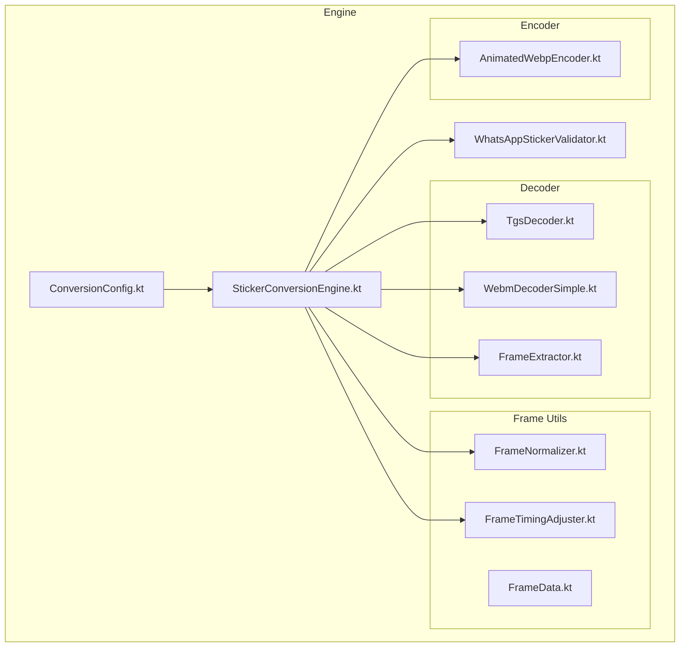
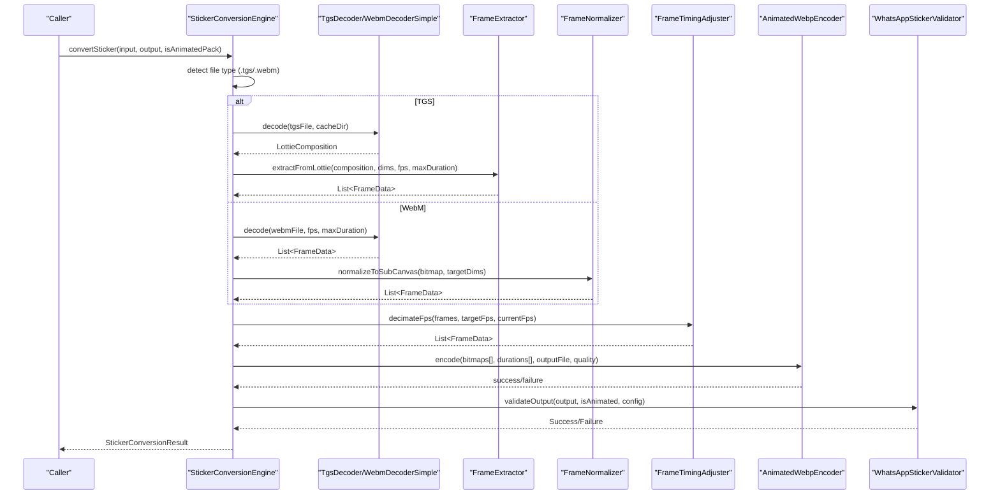
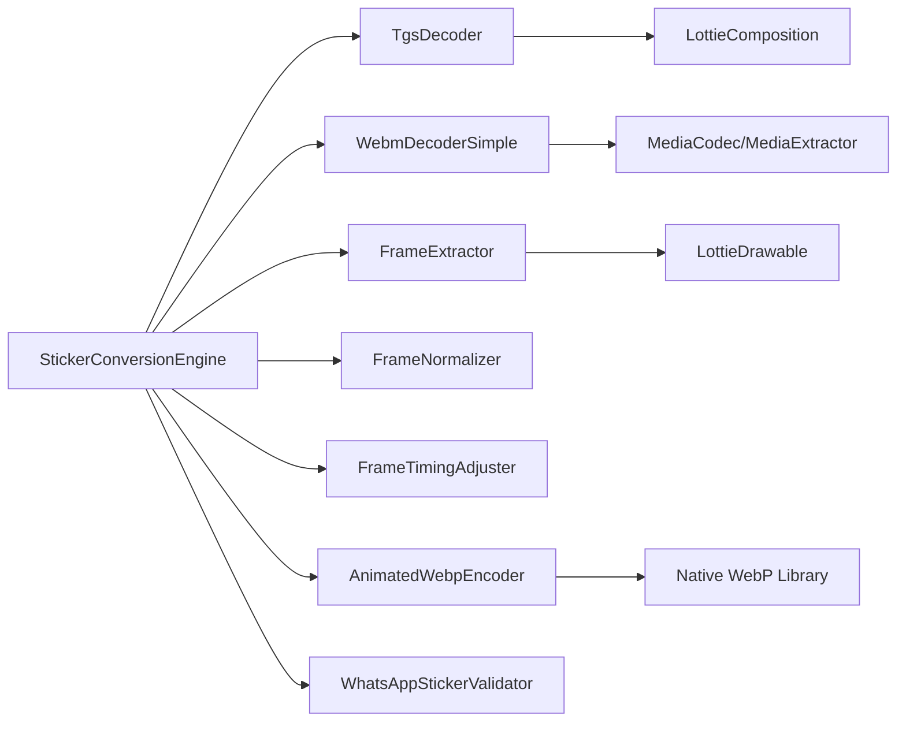

# Media Decoders and Format Support

<cite>
**Referenced Files in This Document**
- [README.md](file://README.md)
- [animated_pipe.md](file://assets/docs/animated_pipe.md)
- [StickerConversionEngine.kt](file://app/src/main/java/com/maheshsharan/tel2what/engine/StickerConversionEngine.kt)
- [ConversionConfig.kt](file://app/src/main/java/com/maheshsharan/tel2what/engine/ConversionConfig.kt)
- [FrameExtractor.kt](file://app/src/main/java/com/maheshsharan/tel2what/engine/decoder/FrameExtractor.kt)
- [TgsDecoder.kt](file://app/src/main/java/com/maheshsharan/tel2what/engine/decoder/TgsDecoder.kt)
- [WebmDecoderSimple.kt](file://app/src/main/java/com/maheshsharan/tel2what/engine/decoder/WebmDecoderSimple.kt)
- [FrameData.kt](file://app/src/main/java/com/maheshsharan/tel2what/engine/frame/FrameData.kt)
- [FrameNormalizer.kt](file://app/src/main/java/com/maheshsharan/tel2what/engine/frame/FrameNormalizer.kt)
- [FrameTimingAdjuster.kt](file://app/src/main/java/com/maheshsharan/tel2what/engine/frame/FrameTimingAdjuster.kt)
- [AnimatedWebpEncoder.kt](file://app/src/main/java/com/maheshsharan/tel2what/engine/encoder/AnimatedWebpEncoder.kt)
- [WhatsAppStickerValidator.kt](file://app/src/main/java/com/maheshsharan/tel2what/engine/WhatsAppStickerValidator.kt)
</cite>

## Table of Contents
1. [Introduction](#introduction)
2. [Project Structure](#project-structure)
3. [Core Components](#core-components)
4. [Architecture Overview](#architecture-overview)
5. [Detailed Component Analysis](#detailed-component-analysis)
6. [Dependency Analysis](#dependency-analysis)
7. [Performance Considerations](#performance-considerations)
8. [Troubleshooting Guide](#troubleshooting-guide)
9. [Conclusion](#conclusion)
10. [Appendices](#appendices)

## Introduction
This document explains the media decoders that handle different input formats for animated sticker conversion. It focuses on:
- FrameExtractor for extracting frames from Lottie compositions, including FPS control, duration limits, and quality settings
- TgsDecoder for Telegram GIF (TGS) format processing, covering Lottie animation parsing and frame generation
- WebmDecoderSimple for WebM video processing, including frame extraction algorithms and format compatibility

It also provides usage examples, supported format specifications, troubleshooting guidance, and performance considerations tailored to the project’s architecture and constraints.

## Project Structure
The animated sticker conversion pipeline resides in the engine module and is organized by responsibilities:
- decoder: Format-specific decoders (TGS and WebM)
- frame: Utilities for frame normalization and timing adjustments
- encoder: Native WebP encoder
- Conversion orchestration and validation

**Diagram sources**
- [StickerConversionEngine.kt](file://app/src/main/java/com/maheshsharan/tel2what/engine/StickerConversionEngine.kt#L1-L275)
- [ConversionConfig.kt](file://app/src/main/java/com/maheshsharan/tel2what/engine/ConversionConfig.kt#L1-L14)
- [FrameExtractor.kt](file://app/src/main/java/com/maheshsharan/tel2what/engine/decoder/FrameExtractor.kt#L1-L100)
- [TgsDecoder.kt](file://app/src/main/java/com/maheshsharan/tel2what/engine/decoder/TgsDecoder.kt#L1-L94)
- [WebmDecoderSimple.kt](file://app/src/main/java/com/maheshsharan/tel2what/engine/decoder/WebmDecoderSimple.kt#L1-L256)
- [FrameData.kt](file://app/src/main/java/com/maheshsharan/tel2what/engine/frame/FrameData.kt#L1-L9)
- [FrameNormalizer.kt](file://app/src/main/java/com/maheshsharan/tel2what/engine/frame/FrameNormalizer.kt#L1-L62)
- [FrameTimingAdjuster.kt](file://app/src/main/java/com/maheshsharan/tel2what/engine/frame/FrameTimingAdjuster.kt#L1-L72)
- [AnimatedWebpEncoder.kt](file://app/src/main/java/com/maheshsharan/tel2what/engine/encoder/AnimatedWebpEncoder.kt#L1-L91)
- [WhatsAppStickerValidator.kt](file://app/src/main/java/com/maheshsharan/tel2what/engine/WhatsAppStickerValidator.kt#L1-L72)

**Section sources**
- [README.md](file://README.md#L98-L110)
- [animated_pipe.md](file://assets/docs/animated_pipe.md#L1-L43)

## Core Components
- FrameExtractor: Renders Lottie compositions into discrete, timed Bitmaps with configurable FPS and duration caps. It enforces a minimum frame count requirement and produces FrameData sequences.
- TgsDecoder: Validates and decompresses Telegram’s .tgs (GZIP JSON) into a LottieComposition, then parses it synchronously for downstream frame extraction.
- WebmDecoderSimple: Uses MediaCodec to decode WebM videos (VP9/Vp8) into frames, converting YUV buffers to RGB bitmaps and capturing at target FPS with duration limits.

These components integrate with FrameNormalizer for dimension normalization and FrameTimingAdjuster for FPS reduction and duration accumulation.

**Section sources**
- [FrameExtractor.kt](file://app/src/main/java/com/maheshsharan/tel2what/engine/decoder/FrameExtractor.kt#L13-L100)
- [TgsDecoder.kt](file://app/src/main/java/com/maheshsharan/tel2what/engine/decoder/TgsDecoder.kt#L13-L94)
- [WebmDecoderSimple.kt](file://app/src/main/java/com/maheshsharan/tel2what/engine/decoder/WebmDecoderSimple.kt#L16-L256)
- [FrameNormalizer.kt](file://app/src/main/java/com/maheshsharan/tel2what/engine/frame/FrameNormalizer.kt#L8-L62)
- [FrameTimingAdjuster.kt](file://app/src/main/java/com/maheshsharan/tel2what/engine/frame/FrameTimingAdjuster.kt#L5-L72)

## Architecture Overview
The animated conversion pipeline routes inputs to the correct decoder, normalizes frames, adjusts timing, and encodes to Animated WebP with adaptive quality and FPS to meet size constraints.

**Diagram sources**
- [StickerConversionEngine.kt](file://app/src/main/java/com/maheshsharan/tel2what/engine/StickerConversionEngine.kt#L131-L275)
- [TgsDecoder.kt](file://app/src/main/java/com/maheshsharan/tel2what/engine/decoder/TgsDecoder.kt#L21-L80)
- [WebmDecoderSimple.kt](file://app/src/main/java/com/maheshsharan/tel2what/engine/decoder/WebmDecoderSimple.kt#L23-L192)
- [FrameExtractor.kt](file://app/src/main/java/com/maheshsharan/tel2what/engine/decoder/FrameExtractor.kt#L24-L98)
- [FrameNormalizer.kt](file://app/src/main/java/com/maheshsharan/tel2what/engine/frame/FrameNormalizer.kt#L17-L60)
- [FrameTimingAdjuster.kt](file://app/src/main/java/com/maheshsharan/tel2what/engine/frame/FrameTimingAdjuster.kt#L16-L70)
- [AnimatedWebpEncoder.kt](file://app/src/main/java/com/maheshsharan/tel2what/engine/encoder/AnimatedWebpEncoder.kt#L32-L78)
- [WhatsAppStickerValidator.kt](file://app/src/main/java/com/maheshsharan/tel2what/engine/WhatsAppStickerValidator.kt#L14-L70)

## Detailed Component Analysis

### FrameExtractor
Purpose:
- Extracts frames from a LottieComposition at a specified FPS, respecting a maximum duration.
- Produces a sequence of FrameData with ARGB_8888 bitmaps and uniform durations.

Key behaviors:
- FPS control: frameDelayMs computed from targetFps; frameCount derived from min(nativeDuration, maxDuration) / frameDelayMs.
- Minimum frames: Ensures at least 2 frames for animated sticker validation.
- Rendering: Creates fresh ARGB_8888 bitmaps, clears to transparent, sets LottieDrawable progress, and draws onto Canvas.
- Error handling: Recycles partial frames on exceptions to prevent memory leaks.

Supported format:
- Input: LottieComposition
- Output: List of FrameData with bitmap and durationMs

Usage example (conceptual):
- Call extractFromLottie with composition, target dimensions, targetFps, and maxDurationMs to obtain frames for subsequent normalization and encoding.

**Section sources**
- [FrameExtractor.kt](file://app/src/main/java/com/maheshsharan/tel2what/engine/decoder/FrameExtractor.kt#L24-L98)
- [FrameData.kt](file://app/src/main/java/com/maheshsharan/tel2what/engine/frame/FrameData.kt#L5-L8)

### TgsDecoder
Purpose:
- Validates and decompresses Telegram’s .tgs (GZIP-compressed JSON) into a LottieComposition.

Processing steps:
- Validates input existence and non-empty size.
- Creates a temporary working directory and decompresses the GZIP stream to a JSON file.
- Parses the JSON synchronously into a LottieComposition using LottieCompositionFactory.
- Cleans up intermediate files immediately after parsing.

Supported format:
- Input: .tgs file (GZIP-compressed JSON)
- Output: LottieComposition or null on failure

Usage example (conceptual):
- Call decode(tgsFile, cacheDir) to obtain a composition suitable for FrameExtractor.

**Section sources**
- [TgsDecoder.kt](file://app/src/main/java/com/maheshsharan/tel2what/engine/decoder/TgsDecoder.kt#L21-L80)

### WebmDecoderSimple
Purpose:
- Decodes WebM video streams to frames using MediaCodec, converting YUV output to RGB bitmaps.

Key behaviors:
- Track selection: Scans tracks and selects the first video track.
- Codec selection: Uses container MIME to determine codec (VP9 for WebM, falls back to VP8 if needed).
- Duration cap: Limits decoding to min(videoDuration, maxDurationMs).
- Frame capture: Captures frames at targetFps by comparing presentation timestamps against nextTargetTimeUs.
- Color conversion: Converts YUV_420_888 (I420) to NV21 and then to RGB via JPEG compression and decoding.

Supported format:
- Input: .webm file (VP9 or VP8)
- Output: List of FrameData with bitmap and durationMs

Usage example (conceptual):
- Call decode(webmFile, targetFps, maxDurationMs) to obtain frames for normalization and encoding.

**Section sources**
- [WebmDecoderSimple.kt](file://app/src/main/java/com/maheshsharan/tel2what/engine/decoder/WebmDecoderSimple.kt#L23-L192)
- [WebmDecoderSimple.kt](file://app/src/main/java/com/maheshsharan/tel2what/engine/decoder/WebmDecoderSimple.kt#L194-L203)
- [WebmDecoderSimple.kt](file://app/src/main/java/com/maheshsharan/tel2what/engine/decoder/WebmDecoderSimple.kt#L205-L254)

### FrameNormalizer
Purpose:
- Normalizes arbitrary bitmaps to exactly 512x512 with aspect-ratio-preserving scaling and transparent letterboxing.

Key behaviors:
- Computes scale factor to fit within target dimensions while preserving aspect ratio.
- Creates a transparent target canvas and centers the scaled bitmap.
- Recycles original bitmap if requested to reduce memory fragmentation.

Supported format:
- Input: Bitmap
- Output: Bitmap sized to targetWidth x targetHeight

**Section sources**
- [FrameNormalizer.kt](file://app/src/main/java/com/maheshsharan/tel2what/engine/frame/FrameNormalizer.kt#L17-L60)

### FrameTimingAdjuster
Purpose:
- Reduces FPS by decimating frames and accumulating durations to maintain global timing and meet constraints.

Key behaviors:
- Decimates frames by a scale factor (currentFps / targetFps).
- Accumulates dropped frame durations into the next retained frame.
- Enforces minimum 8ms per frame and caps total duration at 10,000ms.

Supported format:
- Input: List of FrameData
- Output: List of FrameData with adjusted durations

**Section sources**
- [FrameTimingAdjuster.kt](file://app/src/main/java/com/maheshsharan/tel2what/engine/frame/FrameTimingAdjuster.kt#L16-L70)

### AnimatedWebpEncoder
Purpose:
- Encodes a sequence of ARGB_8888 bitmaps into an Animated WebP using a native JNI bridge.

Key behaviors:
- Validates non-empty arrays and matching sizes.
- Loads native library and invokes native function to produce WebP bytes.
- Writes encoded bytes to output file.

Supported format:
- Input: Array of Bitmaps, IntArray of durations, targetQuality
- Output: Boolean success

**Section sources**
- [AnimatedWebpEncoder.kt](file://app/src/main/java/com/maheshsharan/tel2what/engine/encoder/AnimatedWebpEncoder.kt#L32-L78)

### WhatsAppStickerValidator
Purpose:
- Validates output files against WhatsApp constraints (size, dimensions).

Key behaviors:
- Checks file existence and size limits (animated vs static).
- Reads image bounds to verify exact 512x512 dimensions.
- Returns success or detailed failure messages.

Supported format:
- Input: File, isAnimated flag, ConversionConfig
- Output: StickerConversionResult

**Section sources**
- [WhatsAppStickerValidator.kt](file://app/src/main/java/com/maheshsharan/tel2what/engine/WhatsAppStickerValidator.kt#L14-L70)

## Dependency Analysis
The engine orchestrates decoders, frame utilities, and encoder/validator. Decoders depend on platform APIs and libraries:
- TgsDecoder depends on LottieComposition and GZIP decompression.
- WebmDecoderSimple depends on MediaExtractor and MediaCodec.
- FrameExtractor depends on LottieDrawable and Canvas drawing.
- FrameNormalizer and FrameTimingAdjuster operate on FrameData.
- AnimatedWebpEncoder depends on native WebP library.
- Validator reads output files to enforce constraints.

**Diagram sources**
- [StickerConversionEngine.kt](file://app/src/main/java/com/maheshsharan/tel2what/engine/StickerConversionEngine.kt#L1-L275)
- [TgsDecoder.kt](file://app/src/main/java/com/maheshsharan/tel2what/engine/decoder/TgsDecoder.kt#L1-L94)
- [WebmDecoderSimple.kt](file://app/src/main/java/com/maheshsharan/tel2what/engine/decoder/WebmDecoderSimple.kt#L1-L256)
- [FrameExtractor.kt](file://app/src/main/java/com/maheshsharan/tel2what/engine/decoder/FrameExtractor.kt#L1-L100)
- [AnimatedWebpEncoder.kt](file://app/src/main/java/com/maheshsharan/tel2what/engine/encoder/AnimatedWebpEncoder.kt#L1-L91)

**Section sources**
- [StickerConversionEngine.kt](file://app/src/main/java/com/maheshsharan/tel2what/engine/StickerConversionEngine.kt#L1-L275)

## Performance Considerations
- Concurrency control: Animated pipeline runs with a semaphore permit to prevent thermal throttling and OOM on mid-tier devices.
- Memory management: Frames are recycled progressively during and after encoding to minimize peak memory usage.
- Adaptive compression: The pipeline reduces FPS and quality iteratively to meet the 500KB animated size limit.
- Platform acceleration: WebM decoding uses MediaCodec; TGS rendering uses LottieDrawable; final encoding uses native libwebp.
- Frame normalization: Ensures consistent dimensions to avoid repeated scaling overhead.

[No sources needed since this section provides general guidance]

## Troubleshooting Guide
Common issues and resolutions:
- TGS file errors:
  - Nonexistent or empty file: Decoder returns null; engine fails early with descriptive message.
  - JSON parse failures: LottieCompositionFactory returns exception; decoder logs and returns null.
  - Cleanup failures: Working directory deletion errors are logged but do not block pipeline.
- WebM decoding failures:
  - No video track: Decoder returns empty list; engine fails with “no frames”.
  - Codec creation failures: Attempts VP8 fallback; if both fail, returns empty list.
  - Buffer conversion errors: Logs conversion failures and continues; consider checking container MIME and format compatibility.
- Frame extraction issues:
  - Zero frames: Engine checks for empty lists and fails with “failed to extract structural frames”.
  - Memory leaks: FrameExtractor recycles partial frames on exceptions; WebmDecoderSimple recycles frames on catastrophic failure.
- Encoding failures:
  - JNI encoder returns null/empty bytes: Encoder logs failure and returns false; engine retries with reduced FPS/quality.
- Validation failures:
  - Size or dimension mismatches: Validator returns detailed failure messages indicating expected vs actual values.

**Section sources**
- [TgsDecoder.kt](file://app/src/main/java/com/maheshsharan/tel2what/engine/decoder/TgsDecoder.kt#L25-L80)
- [WebmDecoderSimple.kt](file://app/src/main/java/com/maheshsharan/tel2what/engine/decoder/WebmDecoderSimple.kt#L52-L192)
- [FrameExtractor.kt](file://app/src/main/java/com/maheshsharan/tel2what/engine/decoder/FrameExtractor.kt#L89-L98)
- [AnimatedWebpEncoder.kt](file://app/src/main/java/com/maheshsharan/tel2what/engine/encoder/AnimatedWebpEncoder.kt#L38-L78)
- [WhatsAppStickerValidator.kt](file://app/src/main/java/com/maheshsharan/tel2what/engine/WhatsAppStickerValidator.kt#L19-L40)

## Conclusion
The media decoders provide robust support for Telegram’s TGS and WebM formats, integrating seamlessly with normalization, timing adjustment, and native WebP encoding. The pipeline enforces strict constraints (dimensions, duration, size) and adapts dynamically to meet performance and memory targets, ensuring reliable conversion to WhatsApp-ready animated stickers.

[No sources needed since this section summarizes without analyzing specific files]

## Appendices

### Supported Format Specifications
- TGS (Telegram Sticker)
  - Input: .tgs (GZIP-compressed JSON)
  - Output: LottieComposition suitable for frame extraction
- WebM (Telegram Video Sticker)
  - Input: .webm (VP9 or VP8)
  - Output: Frames captured at target FPS with duration limits

**Section sources**
- [animated_pipe.md](file://assets/docs/animated_pipe.md#L13-L25)
- [TgsDecoder.kt](file://app/src/main/java/com/maheshsharan/tel2what/engine/decoder/TgsDecoder.kt#L21-L80)
- [WebmDecoderSimple.kt](file://app/src/main/java/com/maheshsharan/tel2what/engine/decoder/WebmDecoderSimple.kt#L69-L73)

### Decoder Usage Examples
- TGS pipeline:
  - Decode TGS to LottieComposition
  - Extract frames at targetFps with maxDurationMs
  - Normalize frames to 512x512
  - Encode to Animated WebP with adaptive quality
- WebM pipeline:
  - Decode WebM to frames with duration cap
  - Normalize frames to 512x512
  - Adjust FPS and accumulate durations
  - Encode to Animated WebP with adaptive quality

**Section sources**
- [StickerConversionEngine.kt](file://app/src/main/java/com/maheshsharan/tel2what/engine/StickerConversionEngine.kt#L131-L275)
- [FrameExtractor.kt](file://app/src/main/java/com/maheshsharan/tel2what/engine/decoder/FrameExtractor.kt#L24-L98)
- [WebmDecoderSimple.kt](file://app/src/main/java/com/maheshsharan/tel2what/engine/decoder/WebmDecoderSimple.kt#L23-L192)
- [FrameNormalizer.kt](file://app/src/main/java/com/maheshsharan/tel2what/engine/frame/FrameNormalizer.kt#L17-L60)
- [FrameTimingAdjuster.kt](file://app/src/main/java/com/maheshsharan/tel2what/engine/frame/FrameTimingAdjuster.kt#L16-L70)
- [AnimatedWebpEncoder.kt](file://app/src/main/java/com/maheshsharan/tel2what/engine/encoder/AnimatedWebpEncoder.kt#L32-L78)