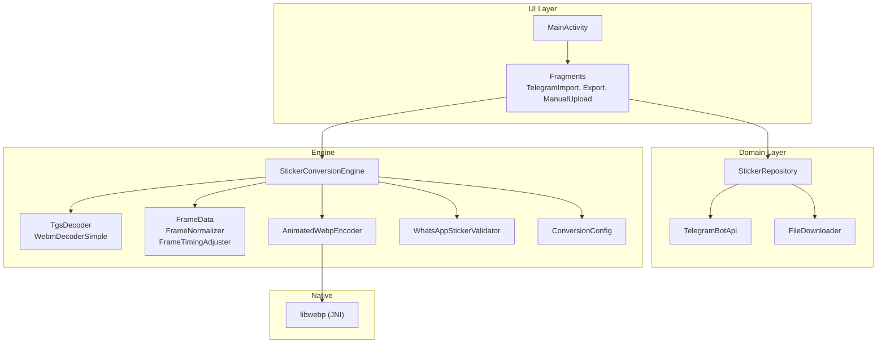
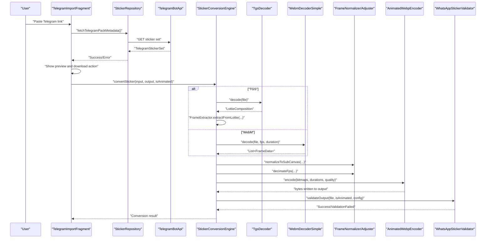
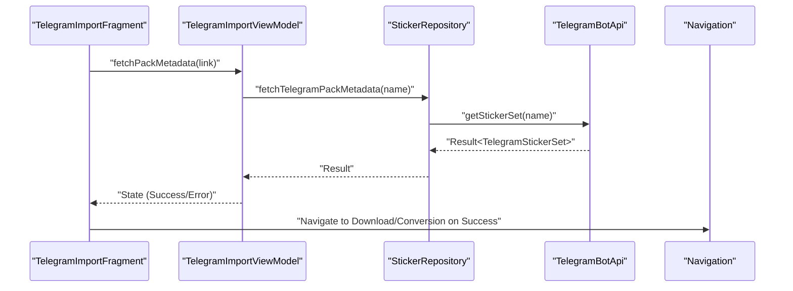
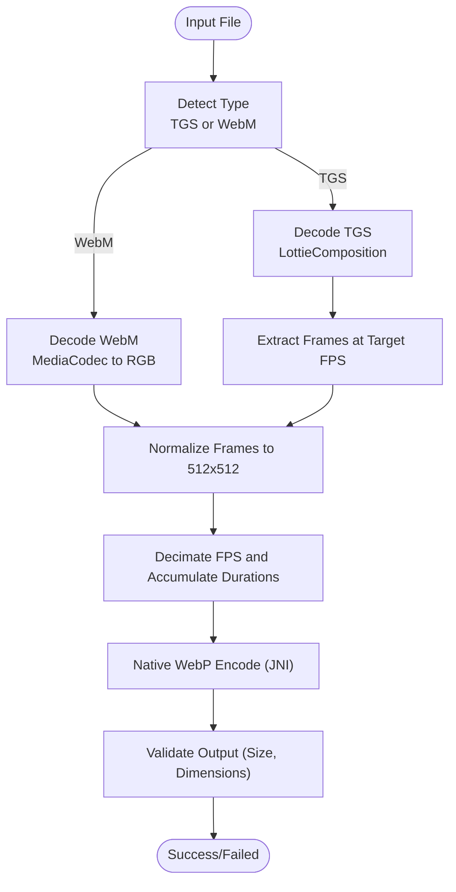
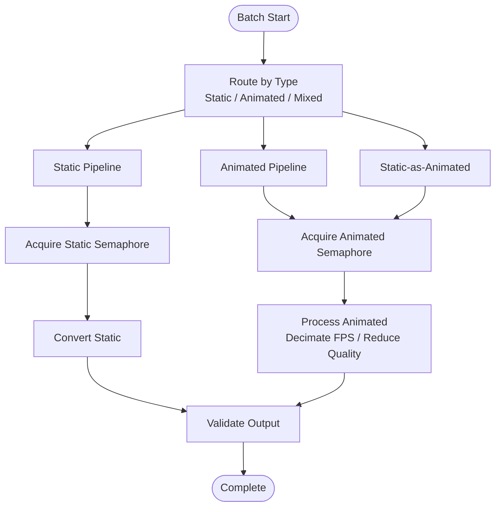
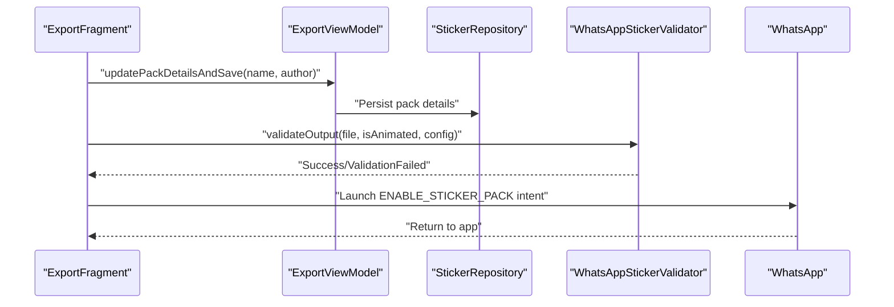
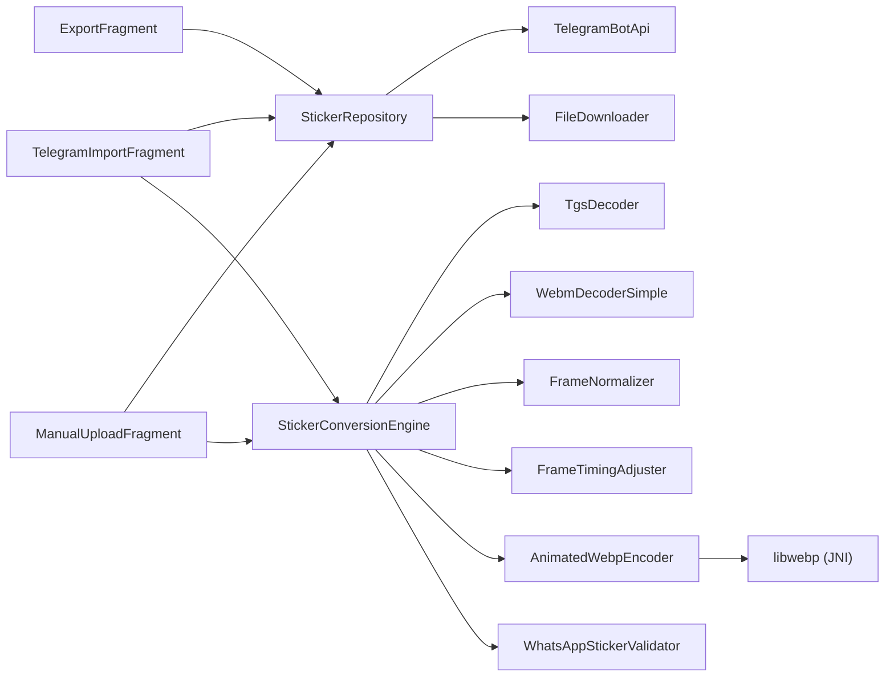

# Core Features

<cite>
**Referenced Files in This Document**
- [README.md](file://README.md)
- [MainActivity.kt](file://app/src/main/java/com/maheshsharan/tel2what/MainActivity.kt)
- [Tel2WhatApplication.kt](file://app/src/main/java/com/maheshsharan/tel2what/Tel2WhatApplication.kt)
- [StickerConversionEngine.kt](file://app/src/main/java/com/maheshsharan/tel2what/engine/StickerConversionEngine.kt)
- [StickerConverter.kt](file://app/src/main/java/com/maheshsharan/tel2what/engine/StickerConverter.kt)
- [TgsDecoder.kt](file://app/src/main/java/com/maheshsharan/tel2what/engine/decoder/TgsDecoder.kt)
- [WebmDecoderSimple.kt](file://app/src/main/java/com/maheshsharan/tel2what/engine/decoder/WebmDecoderSimple.kt)
- [AnimatedWebpEncoder.kt](file://app/src/main/java/com/maheshsharan/tel2what/engine/encoder/AnimatedWebpEncoder.kt)
- [FrameData.kt](file://app/src/main/java/com/maheshsharan/tel2what/engine/frame/FrameData.kt)
- [FrameNormalizer.kt](file://app/src/main/java/com/maheshsharan/tel2what/engine/frame/FrameNormalizer.kt)
- [FrameTimingAdjuster.kt](file://app/src/main/java/com/maheshsharan/tel2what/engine/frame/FrameTimingAdjuster.kt)
- [ConversionConfig.kt](file://app/src/main/java/com/maheshsharan/tel2what/engine/ConversionConfig.kt)
- [WhatsAppStickerValidator.kt](file://app/src/main/java/com/maheshsharan/tel2what/engine/WhatsAppStickerValidator.kt)
- [TelegramImportFragment.kt](file://app/src/main/java/com/maheshsharan/tel2what/ui/importpack/TelegramImportFragment.kt)
- [ExportFragment.kt](file://app/src/main/java/com/maheshsharan/tel2what/ui/export/ExportFragment.kt)
- [ManualUploadFragment.kt](file://app/src/main/java/com/maheshsharan/tel2what/ui/manual/ManualUploadFragment.kt)
- [TelegramBotApi.kt](file://app/src/main/java/com/maheshsharan/tel2what/data/network/TelegramBotApi.kt)
- [StickerRepository.kt](file://app/src/main/java/com/maheshsharan/tel2what/data/repository/StickerRepository.kt)
</cite>

## Table of Contents
1. [Introduction](#introduction)
2. [Project Structure](#project-structure)
3. [Core Components](#core-components)
4. [Architecture Overview](#architecture-overview)
5. [Detailed Component Analysis](#detailed-component-analysis)
6. [Dependency Analysis](#dependency-analysis)
7. [Performance Considerations](#performance-considerations)
8. [Troubleshooting Guide](#troubleshooting-guide)
9. [Conclusion](#conclusion)
10. [Appendices](#appendices)

## Introduction
Tel2What is a privacy-focused Android application that converts Telegram sticker packs into WhatsApp-ready animated or static WebP stickers. It emphasizes offline-first processing, strong privacy guarantees, and a streamlined user workflow from import to export. The app supports animated stickers (TGS and WebM), batch processing, and automatic validation to meet WhatsApp’s strict constraints.

Key goals:
- Fully offline processing after initial downloads
- Privacy-first: no ads, no analytics, no data collection
- Fast conversion using native WebP encoding and optimized decoders
- Batch processing up to 30 stickers at a time
- WhatsApp export via system intents

**Section sources**
- [README.md](file://README.md#L11-L31)

## Project Structure
The app follows a modern Android architecture with a single-activity pattern and modular UI fragments. The core conversion pipeline resides under the engine package, with dedicated modules for decoders, encoders, and frame utilities. Data access is handled via a repository pattern layered over Room and network APIs.

**Diagram sources**
- [MainActivity.kt](file://app/src/main/java/com/maheshsharan/tel2what/MainActivity.kt#L6-L11)
- [StickerRepository.kt](file://app/src/main/java/com/maheshsharan/tel2what/data/repository/StickerRepository.kt#L10-L14)
- [TelegramBotApi.kt](file://app/src/main/java/com/maheshsharan/tel2what/data/network/TelegramBotApi.kt#L14-L18)
- [StickerConversionEngine.kt](file://app/src/main/java/com/maheshsharan/tel2what/engine/StickerConversionEngine.kt#L18-L28)
- [AnimatedWebpEncoder.kt](file://app/src/main/java/com/maheshsharan/tel2what/engine/encoder/AnimatedWebpEncoder.kt#L8-L21)

**Section sources**
- [README.md](file://README.md#L98-L110)
- [MainActivity.kt](file://app/src/main/java/com/maheshsharan/tel2what/MainActivity.kt#L6-L11)
- [Tel2WhatApplication.kt](file://app/src/main/java/com/maheshsharan/tel2what/Tel2WhatApplication.kt#L9-L15)

## Core Components
This section documents Tel2What’s core features and their purpose, user workflow, and technical implementation.

- Telegram Import System
  - Purpose: Allow users to import public Telegram sticker packs by pasting a link. The app fetches metadata, previews the pack, and enables batch download and conversion.
  - User Workflow:
    - Paste or focus-out to fetch metadata.
    - Preview shows title and total sticker count.
    - “Download First 30” initiates batch download and conversion.
  - Technical Implementation:
    - UI fragment observes state and navigates to the conversion/download flow.
    - Repository uses TelegramBotApi to fetch pack metadata and file paths.
    - FileDownloader retrieves sticker assets.
    - Engine orchestrates conversion to WebP with validation.
  - Privacy: Initial fetch uses Telegram’s public bot API; subsequent processing is local.
  - Limitations: Requires a valid Telegram bot token; rate limits may apply to the demo token.

- Animated Sticker Support (TGS and WebM)
  - Purpose: Decode vector animations (TGS) and video animations (WebM) into frame sequences suitable for animated WebP.
  - User Workflow:
    - Import animated packs or upload GIFs/images for static-as-animated.
    - Conversion pipeline normalizes frames, adjusts timing, and encodes.
  - Technical Implementation:
    - TGS decoding uses LottieComposition parsing with GZIP decompression.
    - WebM decoding uses MediaCodec with ByteBuffer output and YUV to RGB conversion.
    - Frames are normalized to 512x512 with transparent letterboxing and timing adjusted to target FPS.
    - Native WebP encoder writes the final animated WebP.

- Batch Processing Capabilities
  - Purpose: Download and convert up to 30 stickers concurrently, with controlled concurrency to avoid OOM and thermal throttling.
  - User Workflow:
    - Manual upload allows selecting 3–30 files; processing starts automatically when threshold is met.
    - Import flow caps to “First 30” for preview.
  - Technical Implementation:
    - Engine enforces concurrency limits: 4 static threads and 1 animated thread.
    - Compression loop adapts quality and FPS to meet size constraints.

- WhatsApp Export Functionality
  - Purpose: Validate and export packs to WhatsApp using the platform’s enable-sticker-pack intent.
  - User Workflow:
    - Enter pack name and author, save details.
    - Launch WhatsApp to add the pack.
  - Technical Implementation:
    - Validator checks size, dimensions, and emits success/failure.
    - Export UI sends intent with authority and identifiers.

- Offline-First and Privacy
  - Offline-first: All conversions occur locally after initial downloads; no server-side processing.
  - Privacy: No ads, analytics, or data collection; minimal runtime permissions; open source.

**Section sources**
- [README.md](file://README.md#L22-L31)
- [TelegramImportFragment.kt](file://app/src/main/java/com/maheshsharan/tel2what/ui/importpack/TelegramImportFragment.kt#L25-L154)
- [ExportFragment.kt](file://app/src/main/java/com/maheshsharan/tel2what/ui/export/ExportFragment.kt#L25-L101)
- [ManualUploadFragment.kt](file://app/src/main/java/com/maheshsharan/tel2what/ui/manual/ManualUploadFragment.kt#L23-L111)
- [StickerConversionEngine.kt](file://app/src/main/java/com/maheshsharan/tel2what/engine/StickerConversionEngine.kt#L18-L89)
- [WhatsAppStickerValidator.kt](file://app/src/main/java/com/maheshsharan/tel2what/engine/WhatsAppStickerValidator.kt#L14-L70)
- [README.md](file://README.md#L11-L21)

## Architecture Overview
The conversion pipeline is orchestrated by the engine, which routes inputs to appropriate decoders, normalizes frames, and encodes to animated WebP via JNI. Validation ensures compliance with WhatsApp constraints.

**Diagram sources**
- [TelegramImportFragment.kt](file://app/src/main/java/com/maheshsharan/tel2what/ui/importpack/TelegramImportFragment.kt#L94-L151)
- [StickerRepository.kt](file://app/src/main/java/com/maheshsharan/tel2what/data/repository/StickerRepository.kt#L24-L28)
- [TelegramBotApi.kt](file://app/src/main/java/com/maheshsharan/tel2what/data/network/TelegramBotApi.kt#L22-L73)
- [StickerConversionEngine.kt](file://app/src/main/java/com/maheshsharan/tel2what/engine/StickerConversionEngine.kt#L132-L274)
- [TgsDecoder.kt](file://app/src/main/java/com/maheshsharan/tel2what/engine/decoder/TgsDecoder.kt#L21-L80)
- [WebmDecoderSimple.kt](file://app/src/main/java/com/maheshsharan/tel2what/engine/decoder/WebmDecoderSimple.kt#L27-L192)
- [FrameNormalizer.kt](file://app/src/main/java/com/maheshsharan/tel2what/engine/frame/FrameNormalizer.kt#L17-L60)
- [FrameTimingAdjuster.kt](file://app/src/main/java/com/maheshsharan/tel2what/engine/frame/FrameTimingAdjuster.kt#L16-L70)
- [AnimatedWebpEncoder.kt](file://app/src/main/java/com/maheshsharan/tel2what/engine/encoder/AnimatedWebpEncoder.kt#L32-L78)
- [WhatsAppStickerValidator.kt](file://app/src/main/java/com/maheshsharan/tel2what/engine/WhatsAppStickerValidator.kt#L14-L70)

## Detailed Component Analysis

### Telegram Import System
- Purpose: Fetch public Telegram sticker sets, preview metadata, and initiate batch download and conversion.
- User Workflow:
  - Paste link or trigger focus-out validation.
  - Preview shows title and total sticker count.
  - “Download First 30” navigates to conversion/download flow.
- Technical Implementation:
  - UI observes ViewModel state and updates views accordingly.
  - Repository delegates to TelegramBotApi for metadata and file paths.
  - FileDownloader retrieves assets; Engine performs conversion.
- Privacy and Limitations:
  - Uses Telegram Bot API; requires a valid token; demo token may be rate-limited.

**Diagram sources**
- [TelegramImportFragment.kt](file://app/src/main/java/com/maheshsharan/tel2what/ui/importpack/TelegramImportFragment.kt#L94-L151)
- [StickerRepository.kt](file://app/src/main/java/com/maheshsharan/tel2what/data/repository/StickerRepository.kt#L24-L28)
- [TelegramBotApi.kt](file://app/src/main/java/com/maheshsharan/tel2what/data/network/TelegramBotApi.kt#L22-L73)

**Section sources**
- [TelegramImportFragment.kt](file://app/src/main/java/com/maheshsharan/tel2what/ui/importpack/TelegramImportFragment.kt#L25-L154)
- [StickerRepository.kt](file://app/src/main/java/com/maheshsharan/tel2what/data/repository/StickerRepository.kt#L10-L14)
- [TelegramBotApi.kt](file://app/src/main/java/com/maheshsharan/tel2what/data/network/TelegramBotApi.kt#L14-L18)

### Animated Sticker Support (TGS and WebM)
- Purpose: Decode TGS (vector) and WebM (video) into normalized frames for animated WebP.
- Technical Implementation:
  - TGS: Decompress GZIP, parse LottieComposition, render frames at target FPS.
  - WebM: MediaCodec decode to ByteBuffer, YUV to RGB conversion, frame extraction at target FPS.
  - Frame normalization to 512x512 with transparent letterboxing.
  - Timing adjuster decimates FPS while preserving global duration and minimum frame time.
  - Native WebP encoding via JNI with adaptive quality/FPS loop to meet size targets.

**Diagram sources**
- [StickerConversionEngine.kt](file://app/src/main/java/com/maheshsharan/tel2what/engine/StickerConversionEngine.kt#L132-L274)
- [TgsDecoder.kt](file://app/src/main/java/com/maheshsharan/tel2what/engine/decoder/TgsDecoder.kt#L21-L80)
- [WebmDecoderSimple.kt](file://app/src/main/java/com/maheshsharan/tel2what/engine/decoder/WebmDecoderSimple.kt#L27-L192)
- [FrameNormalizer.kt](file://app/src/main/java/com/maheshsharan/tel2what/engine/frame/FrameNormalizer.kt#L17-L60)
- [FrameTimingAdjuster.kt](file://app/src/main/java/com/maheshsharan/tel2what/engine/frame/FrameTimingAdjuster.kt#L16-L70)
- [AnimatedWebpEncoder.kt](file://app/src/main/java/com/maheshsharan/tel2what/engine/encoder/AnimatedWebpEncoder.kt#L32-L78)
- [WhatsAppStickerValidator.kt](file://app/src/main/java/com/maheshsharan/tel2what/engine/WhatsAppStickerValidator.kt#L14-L70)

**Section sources**
- [TgsDecoder.kt](file://app/src/main/java/com/maheshsharan/tel2what/engine/decoder/TgsDecoder.kt#L17-L94)
- [WebmDecoderSimple.kt](file://app/src/main/java/com/maheshsharan/tel2what/engine/decoder/WebmDecoderSimple.kt#L20-L256)
- [FrameNormalizer.kt](file://app/src/main/java/com/maheshsharan/tel2what/engine/frame/FrameNormalizer.kt#L11-L62)
- [FrameTimingAdjuster.kt](file://app/src/main/java/com/maheshsharan/tel2what/engine/frame/FrameTimingAdjuster.kt#L8-L72)
- [AnimatedWebpEncoder.kt](file://app/src/main/java/com/maheshsharan/tel2what/engine/encoder/AnimatedWebpEncoder.kt#L8-L91)
- [WhatsAppStickerValidator.kt](file://app/src/main/java/com/maheshsharan/tel2what/engine/WhatsAppStickerValidator.kt#L7-L72)

### Batch Processing Capabilities
- Purpose: Efficiently process multiple stickers in batches while controlling resource usage.
- Implementation:
  - Concurrency control: 4 static threads and 1 animated thread to prevent OOM and throttling.
  - Compression loop reduces quality and FPS progressively until under 500 KB for animated packs.
  - Static-as-animated wraps single images into 1-frame animations meeting dimension constraints.

**Diagram sources**
- [StickerConversionEngine.kt](file://app/src/main/java/com/maheshsharan/tel2what/engine/StickerConversionEngine.kt#L24-L89)
- [StickerConversionEngine.kt](file://app/src/main/java/com/maheshsharan/tel2what/engine/StickerConversionEngine.kt#L188-L236)
- [WhatsAppStickerValidator.kt](file://app/src/main/java/com/maheshsharan/tel2what/engine/WhatsAppStickerValidator.kt#L14-L70)

**Section sources**
- [StickerConversionEngine.kt](file://app/src/main/java/com/maheshsharan/tel2what/engine/StickerConversionEngine.kt#L18-L89)
- [StickerConversionEngine.kt](file://app/src/main/java/com/maheshsharan/tel2what/engine/StickerConversionEngine.kt#L188-L236)

### WhatsApp Export Functionality
- Purpose: Validate and share sticker packs with WhatsApp using the platform’s intent.
- User Workflow:
  - Enter pack name and author, save details.
  - Launch WhatsApp to add the pack via intent with authority and identifiers.
- Technical Implementation:
  - Validator checks file existence, size, and dimensions.
  - Export UI constructs and launches the intent; navigates back on completion.

**Diagram sources**
- [ExportFragment.kt](file://app/src/main/java/com/maheshsharan/tel2what/ui/export/ExportFragment.kt#L71-L99)
- [WhatsAppStickerValidator.kt](file://app/src/main/java/com/maheshsharan/tel2what/engine/WhatsAppStickerValidator.kt#L14-L70)

**Section sources**
- [ExportFragment.kt](file://app/src/main/java/com/maheshsharan/tel2what/ui/export/ExportFragment.kt#L25-L101)
- [WhatsAppStickerValidator.kt](file://app/src/main/java/com/maheshsharan/tel2what/engine/WhatsAppStickerValidator.kt#L7-L72)

### Manual Upload and Batch Selection
- Purpose: Allow users to upload custom images/GIFs to create sticker packs.
- User Workflow:
  - Add files up to 30; process when selection meets thresholds.
  - Navigate to selection/export after processing.
- Technical Implementation:
  - UI collects URIs, manages selection, and triggers processing.
  - Repository persists metadata; Engine converts to WebP.

**Section sources**
- [ManualUploadFragment.kt](file://app/src/main/java/com/maheshsharan/tel2what/ui/manual/ManualUploadFragment.kt#L23-L111)

## Dependency Analysis
The following diagram highlights key dependencies among major components.

**Diagram sources**
- [TelegramImportFragment.kt](file://app/src/main/java/com/maheshsharan/tel2what/ui/importpack/TelegramImportFragment.kt#L33-L36)
- [ExportFragment.kt](file://app/src/main/java/com/maheshsharan/tel2what/ui/export/ExportFragment.kt#L39-L42)
- [ManualUploadFragment.kt](file://app/src/main/java/com/maheshsharan/tel2what/ui/manual/ManualUploadFragment.kt#L37-L40)
- [StickerRepository.kt](file://app/src/main/java/com/maheshsharan/tel2what/data/repository/StickerRepository.kt#L10-L14)
- [TelegramBotApi.kt](file://app/src/main/java/com/maheshsharan/tel2what/data/network/TelegramBotApi.kt#L14-L18)
- [StickerConversionEngine.kt](file://app/src/main/java/com/maheshsharan/tel2what/engine/StickerConversionEngine.kt#L18-L28)
- [AnimatedWebpEncoder.kt](file://app/src/main/java/com/maheshsharan/tel2what/engine/encoder/AnimatedWebpEncoder.kt#L8-L21)

**Section sources**
- [StickerRepository.kt](file://app/src/main/java/com/maheshsharan/tel2what/data/repository/StickerRepository.kt#L10-L14)
- [StickerConversionEngine.kt](file://app/src/main/java/com/maheshsharan/tel2what/engine/StickerConversionEngine.kt#L18-L28)

## Performance Considerations
- Native WebP encoding via JNI yields ~2–3s per animated sticker.
- WebM frame extraction: ~400ms for 30 frames at 10fps.
- TGS frame rendering: ~600ms for vector-to-raster conversion.
- Total conversion time: ~3–4s end-to-end per sticker.
- Concurrency: 4 static threads and 1 animated thread to balance throughput and stability.
- Memory management: Bitmap recycling and careful lifecycle handling to prevent OOM.

**Section sources**
- [README.md](file://README.md#L151-L159)
- [StickerConversionEngine.kt](file://app/src/main/java/com/maheshsharan/tel2what/engine/StickerConversionEngine.kt#L24-L28)

## Troubleshooting Guide
Common issues and resolutions:
- Invalid Telegram Bot Token
  - Symptom: HTTP 401 or endpoint not found errors.
  - Resolution: Provide a valid token in the configuration.
- Sticker Pack Not Found
  - Symptom: “Sticker pack not found” or 404 responses.
  - Resolution: Verify the Telegram link is correct and the pack is public.
- Network Errors
  - Symptom: Unknown host or network exceptions.
  - Resolution: Check connectivity and retry.
- Conversion Failures
  - Symptom: Empty frames, zero duration, or JNI failures.
  - Resolution: Ensure input files are valid; reduce concurrent animated conversions; verify storage availability.
- Validation Failures
  - Symptom: Exceeds size or dimension limits.
  - Resolution: Confirm normalized dimensions and quality/FPS settings; reduce quality or FPS further if needed.

**Section sources**
- [TelegramBotApi.kt](file://app/src/main/java/com/maheshsharan/tel2what/data/network/TelegramBotApi.kt#L34-L73)
- [StickerConversionEngine.kt](file://app/src/main/java/com/maheshsharan/tel2what/engine/StickerConversionEngine.kt#L132-L183)
- [WhatsAppStickerValidator.kt](file://app/src/main/java/com/maheshsharan/tel2what/engine/WhatsAppStickerValidator.kt#L19-L40)

## Conclusion
Tel2What delivers a privacy-respecting, offline-first solution for converting Telegram stickers to WhatsApp. Its robust conversion pipeline, animated sticker support, batch processing, and strict validation ensure reliable exports. The modular architecture and native optimizations provide a responsive user experience while maintaining strong privacy guarantees.

[No sources needed since this section summarizes without analyzing specific files]

## Appendices

### Feature Matrix
- Import from Telegram: ✅ Public sticker sets via bot API
- Animated Sticker Support: ✅ TGS and WebM decoding
- Batch Processing: ✅ Up to 30 stickers
- Manual Upload: ✅ Images/GIFs to custom packs
- WhatsApp Export: ✅ Validation and intent-based installation
- Offline-First: ✅ All processing local after initial downloads
- Privacy: ✅ No ads, analytics, or data collection

**Section sources**
- [README.md](file://README.md#L22-L31)

### Conversion Pipeline and Quality Controls
- Input Types: Static images, TGS, WebM
- Normalization: 512x512 with transparent letterboxing
- Timing: Target 10 FPS; minimum 8 ms per frame; capped at 10 seconds
- Compression Loop: Starts at quality 25; lowers quality/FPS until under 500 KB for animated packs
- Validation: Size, dimensions, and basic structural checks

**Section sources**
- [ConversionConfig.kt](file://app/src/main/java/com/maheshsharan/tel2what/engine/ConversionConfig.kt#L3-L13)
- [FrameTimingAdjuster.kt](file://app/src/main/java/com/maheshsharan/tel2what/engine/frame/FrameTimingAdjuster.kt#L16-L70)
- [WhatsAppStickerValidator.kt](file://app/src/main/java/com/maheshsharan/tel2what/engine/WhatsAppStickerValidator.kt#L14-L70)

### Practical Examples and Combinations
- Import a public Telegram animated pack → Preview and download first 30 → Convert to animated WebP → Validate → Export to WhatsApp.
- Manually upload 10 GIFs → Process to static WebPs → Validate → Export to WhatsApp.
- Mix static and animated in one pack → Engine wraps static images as 1-frame animations → Validate and export.

**Section sources**
- [TelegramImportFragment.kt](file://app/src/main/java/com/maheshsharan/tel2what/ui/importpack/TelegramImportFragment.kt#L114-L128)
- [ManualUploadFragment.kt](file://app/src/main/java/com/maheshsharan/tel2what/ui/manual/ManualUploadFragment.kt#L78-L87)
- [ExportFragment.kt](file://app/src/main/java/com/maheshsharan/tel2what/ui/export/ExportFragment.kt#L75-L82)