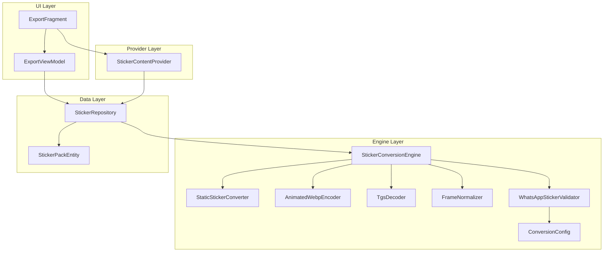
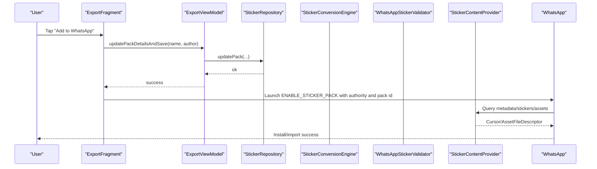
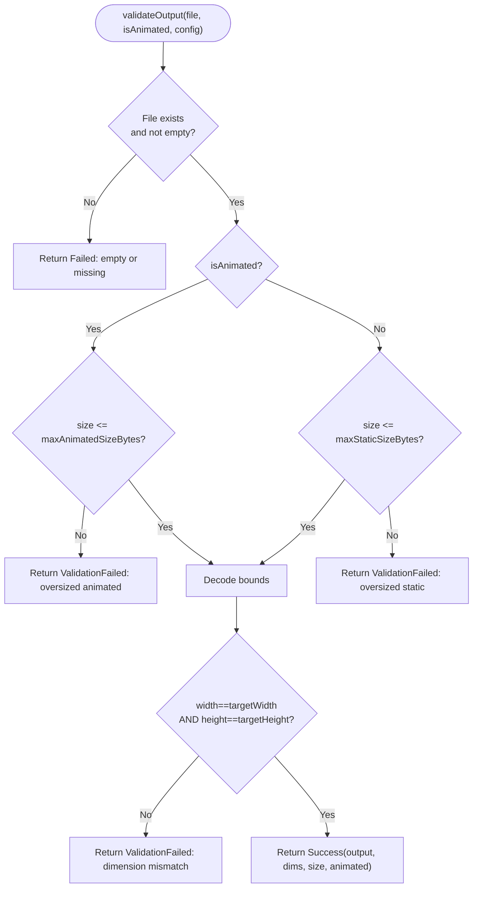
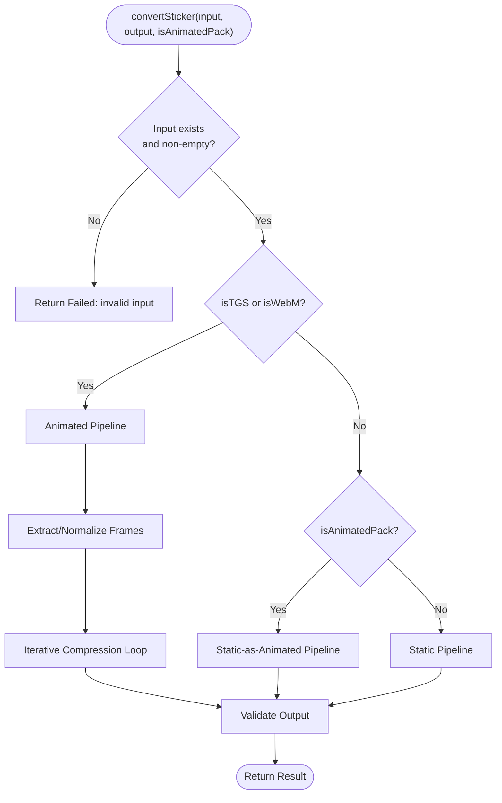
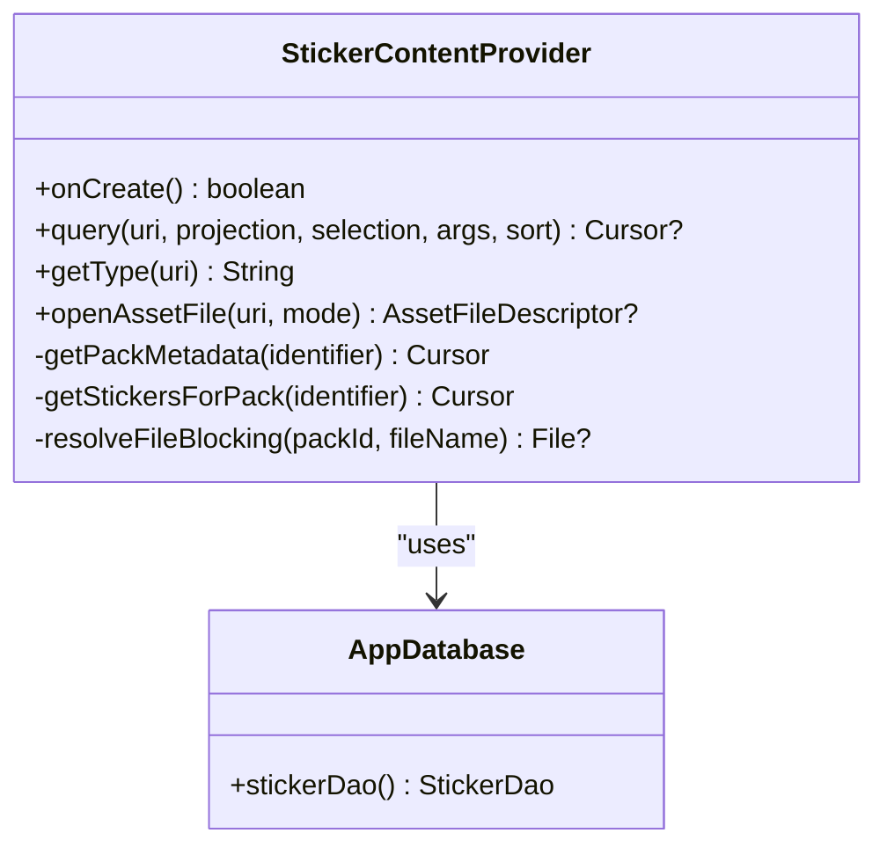
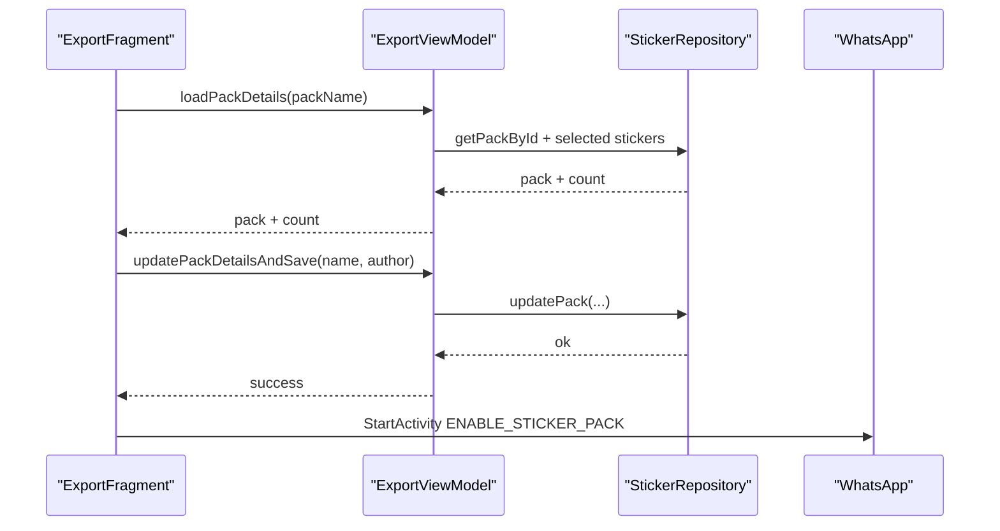
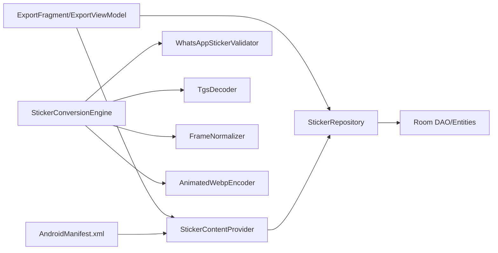

# Export System

<cite>
**Referenced Files in This Document**
- [WhatsAppStickerValidator.kt](file://app/src/main/java/com/maheshsharan/tel2what/engine/WhatsAppStickerValidator.kt)
- [StickerContentProvider.kt](file://app/src/main/java/com/maheshsharan/tel2what/provider/StickerContentProvider.kt)
- [ExportFragment.kt](file://app/src/main/java/com/maheshsharan/tel2what/ui/export/ExportFragment.kt)
- [ExportViewModel.kt](file://app/src/main/java/com/maheshsharan/tel2what/ui/export/ExportViewModel.kt)
- [StickerConversionEngine.kt](file://app/src/main/java/com/maheshsharan/tel2what/engine/StickerConversionEngine.kt)
- [StaticStickerConverter.kt](file://app/src/main/java/com/maheshsharan/tel2what/engine/StaticStickerConverter.kt)
- [AnimatedWebpEncoder.kt](file://app/src/main/java/com/maheshsharan/tel2what/engine/encoder/AnimatedWebpEncoder.kt)
- [TgsDecoder.kt](file://app/src/main/java/com/maheshsharan/tel2what/engine/decoder/TgsDecoder.kt)
- [FrameNormalizer.kt](file://app/src/main/java/com/maheshsharan/tel2what/engine/frame/FrameNormalizer.kt)
- [ConversionConfig.kt](file://app/src/main/java/com/maheshsharan/tel2what/engine/ConversionConfig.kt)
- [StickerConversionResult.kt](file://app/src/main/java/com/maheshsharan/tel2what/engine/StickerConversionResult.kt)
- [StickerPackEntity.kt](file://app/src/main/java/com/maheshsharan/tel2what/data/local/entity/StickerPackEntity.kt)
- [StickerRepository.kt](file://app/src/main/java/com/maheshsharan/tel2what/data/repository/StickerRepository.kt)
- [fragment_export.xml](file://app/src/main/res/layout/fragment_export.xml)
- [AndroidManifest.xml](file://app/src/main/AndroidManifest.xml)
</cite>

## Table of Contents
1. [Introduction](#introduction)
2. [Project Structure](#project-structure)
3. [Core Components](#core-components)
4. [Architecture Overview](#architecture-overview)
5. [Detailed Component Analysis](#detailed-component-analysis)
6. [Dependency Analysis](#dependency-analysis)
7. [Performance Considerations](#performance-considerations)
8. [Troubleshooting Guide](#troubleshooting-guide)
9. [Conclusion](#conclusion)
10. [Appendices](#appendices)

## Introduction
This document explains the export system that prepares converted stickers for integration with WhatsApp. It covers the validation pipeline, the Content Provider that exposes sticker packs to external apps, the export workflow from selection to final packaging, batch and selective export options, validation rules, error handling, and troubleshooting. It also details the integration with WhatsApp’s sticker pack format and distribution mechanisms.

## Project Structure
The export system spans UI, engine, provider, and data layers:
- UI: ExportFragment and ExportViewModel orchestrate user actions and pack details.
- Engine: StickerConversionEngine coordinates conversion pipelines for static, animated, and mixed packs.
- Validator: WhatsAppStickerValidator enforces strict format constraints.
- Provider: StickerContentProvider exposes metadata, sticker lists, and asset files to WhatsApp.
- Data: StickerRepository and StickerPackEntity manage persistence and queries.
- Layout: fragment_export.xml defines the export screen UI.

**Diagram sources**
- [ExportFragment.kt](file://app/src/main/java/com/maheshsharan/tel2what/ui/export/ExportFragment.kt#L25-L113)
- [ExportViewModel.kt](file://app/src/main/java/com/maheshsharan/tel2what/ui/export/ExportViewModel.kt#L13-L56)
- [StickerConversionEngine.kt](file://app/src/main/java/com/maheshsharan/tel2what/engine/StickerConversionEngine.kt#L17-L275)
- [StaticStickerConverter.kt](file://app/src/main/java/com/maheshsharan/tel2what/engine/StaticStickerConverter.kt#L15-L94)
- [AnimatedWebpEncoder.kt](file://app/src/main/java/com/maheshsharan/tel2what/engine/encoder/AnimatedWebpEncoder.kt#L8-L91)
- [TgsDecoder.kt](file://app/src/main/java/com/maheshsharan/tel2what/engine/decoder/TgsDecoder.kt#L17-L94)
- [FrameNormalizer.kt](file://app/src/main/java/com/maheshsharan/tel2what/engine/frame/FrameNormalizer.kt#L11-L62)
- [WhatsAppStickerValidator.kt](file://app/src/main/java/com/maheshsharan/tel2what/engine/WhatsAppStickerValidator.kt#L7-L72)
- [ConversionConfig.kt](file://app/src/main/java/com/maheshsharan/tel2what/engine/ConversionConfig.kt#L3-L13)
- [StickerRepository.kt](file://app/src/main/java/com/maheshsharan/tel2what/data/repository/StickerRepository.kt#L10-L80)
- [StickerPackEntity.kt](file://app/src/main/java/com/maheshsharan/tel2what/data/local/entity/StickerPackEntity.kt#L6-L22)
- [StickerContentProvider.kt](file://app/src/main/java/com/maheshsharan/tel2what/provider/StickerContentProvider.kt#L15-L244)

**Section sources**
- [ExportFragment.kt](file://app/src/main/java/com/maheshsharan/tel2what/ui/export/ExportFragment.kt#L25-L113)
- [ExportViewModel.kt](file://app/src/main/java/com/maheshsharan/tel2what/ui/export/ExportViewModel.kt#L13-L56)
- [StickerConversionEngine.kt](file://app/src/main/java/com/maheshsharan/tel2what/engine/StickerConversionEngine.kt#L17-L275)
- [StickerContentProvider.kt](file://app/src/main/java/com/maheshsharan/tel2what/provider/StickerContentProvider.kt#L15-L244)
- [StickerRepository.kt](file://app/src/main/java/com/maheshsharan/tel2what/data/repository/StickerRepository.kt#L10-L80)
- [fragment_export.xml](file://app/src/main/res/layout/fragment_export.xml#L1-L168)
- [AndroidManifest.xml](file://app/src/main/AndroidManifest.xml#L19-L24)

## Core Components
- WhatsAppStickerValidator: Enforces strict output constraints (existence, size, dimensions) and returns standardized results.
- StickerConversionEngine: Orchestrates conversion pipelines for static, animated, and mixed packs with concurrency control.
- StickerContentProvider: Exposes sticker pack metadata, sticker lists, and assets to external apps like WhatsApp via a ContentProvider.
- ExportFragment and ExportViewModel: Drive the export UI, collect pack details, and trigger the integration flow with WhatsApp.
- StaticStickerConverter and AnimatedWebpEncoder: Implement static and animated WebP conversion with iterative compression loops.
- TgsDecoder and FrameNormalizer: Decode TGS animations and normalize frames to target dimensions.
- ConversionConfig and StickerConversionResult: Define constraints and represent outcomes consistently.
- StickerRepository and StickerPackEntity: Persist and query sticker pack and sticker data.

**Section sources**
- [WhatsAppStickerValidator.kt](file://app/src/main/java/com/maheshsharan/tel2what/engine/WhatsAppStickerValidator.kt#L7-L72)
- [StickerConversionEngine.kt](file://app/src/main/java/com/maheshsharan/tel2what/engine/StickerConversionEngine.kt#L17-L275)
- [StickerContentProvider.kt](file://app/src/main/java/com/maheshsharan/tel2what/provider/StickerContentProvider.kt#L15-L244)
- [ExportFragment.kt](file://app/src/main/java/com/maheshsharan/tel2what/ui/export/ExportFragment.kt#L25-L113)
- [ExportViewModel.kt](file://app/src/main/java/com/maheshsharan/tel2what/ui/export/ExportViewModel.kt#L13-L56)
- [StaticStickerConverter.kt](file://app/src/main/java/com/maheshsharan/tel2what/engine/StaticStickerConverter.kt#L15-L94)
- [AnimatedWebpEncoder.kt](file://app/src/main/java/com/maheshsharan/tel2what/engine/encoder/AnimatedWebpEncoder.kt#L8-L91)
- [TgsDecoder.kt](file://app/src/main/java/com/maheshsharan/tel2what/engine/decoder/TgsDecoder.kt#L17-L94)
- [FrameNormalizer.kt](file://app/src/main/java/com/maheshsharan/tel2what/engine/frame/FrameNormalizer.kt#L11-L62)
- [ConversionConfig.kt](file://app/src/main/java/com/maheshsharan/tel2what/engine/ConversionConfig.kt#L3-L13)
- [StickerConversionResult.kt](file://app/src/main/java/com/maheshsharan/tel2what/engine/StickerConversionResult.kt#L5-L22)
- [StickerRepository.kt](file://app/src/main/java/com/maheshsharan/tel2what/data/repository/StickerRepository.kt#L10-L80)
- [StickerPackEntity.kt](file://app/src/main/java/com/maheshsharan/tel2what/data/local/entity/StickerPackEntity.kt#L6-L22)

## Architecture Overview
The export workflow integrates UI, conversion, validation, and provider layers to deliver a ready-to-import sticker pack to WhatsApp.

**Diagram sources**
- [ExportFragment.kt](file://app/src/main/java/com/maheshsharan/tel2what/ui/export/ExportFragment.kt#L98-L111)
- [ExportViewModel.kt](file://app/src/main/java/com/maheshsharan/tel2what/ui/export/ExportViewModel.kt#L31-L44)
- [StickerRepository.kt](file://app/src/main/java/com/maheshsharan/tel2what/data/repository/StickerRepository.kt#L36-L38)
- [StickerContentProvider.kt](file://app/src/main/java/com/maheshsharan/tel2what/provider/StickerContentProvider.kt#L74-L85)
- [AndroidManifest.xml](file://app/src/main/AndroidManifest.xml#L19-L24)

## Detailed Component Analysis

### WhatsAppStickerValidator
Validates the final WebP output against WhatsApp’s constraints:
- Existence and non-empty file check.
- Size limits: static vs animated.
- Dimension checks using BitmapFactory bounds.
- Returns standardized success/validation-failed results.

**Diagram sources**
- [WhatsAppStickerValidator.kt](file://app/src/main/java/com/maheshsharan/tel2what/engine/WhatsAppStickerValidator.kt#L14-L70)
- [ConversionConfig.kt](file://app/src/main/java/com/maheshsharan/tel2what/engine/ConversionConfig.kt#L3-L13)
- [StickerConversionResult.kt](file://app/src/main/java/com/maheshsharan/tel2what/engine/StickerConversionResult.kt#L5-L22)

**Section sources**
- [WhatsAppStickerValidator.kt](file://app/src/main/java/com/maheshsharan/tel2what/engine/WhatsAppStickerValidator.kt#L14-L70)
- [ConversionConfig.kt](file://app/src/main/java/com/maheshsharan/tel2what/engine/ConversionConfig.kt#L3-L13)
- [StickerConversionResult.kt](file://app/src/main/java/com/maheshsharan/tel2what/engine/StickerConversionResult.kt#L5-L22)

### StickerConversionEngine
Routes inputs to appropriate conversion pipelines:
- Animated TGS/WebM: decode, extract/normalize frames, iterative compression loop, validate.
- Static-as-animated: normalize to 512x512, wrap into 1-frame animation, validate.
- Static: iterative WebP compression loop, validate.

**Diagram sources**
- [StickerConversionEngine.kt](file://app/src/main/java/com/maheshsharan/tel2what/engine/StickerConversionEngine.kt#L33-L88)
- [StaticStickerConverter.kt](file://app/src/main/java/com/maheshsharan/tel2what/engine/StaticStickerConverter.kt#L17-L94)
- [AnimatedWebpEncoder.kt](file://app/src/main/java/com/maheshsharan/tel2what/engine/encoder/AnimatedWebpEncoder.kt#L32-L78)
- [TgsDecoder.kt](file://app/src/main/java/com/maheshsharan/tel2what/engine/decoder/TgsDecoder.kt#L21-L80)
- [FrameNormalizer.kt](file://app/src/main/java/com/maheshsharan/tel2what/engine/frame/FrameNormalizer.kt#L17-L60)
- [WhatsAppStickerValidator.kt](file://app/src/main/java/com/maheshsharan/tel2what/engine/WhatsAppStickerValidator.kt#L14-L70)

**Section sources**
- [StickerConversionEngine.kt](file://app/src/main/java/com/maheshsharan/tel2what/engine/StickerConversionEngine.kt#L33-L88)
- [StaticStickerConverter.kt](file://app/src/main/java/com/maheshsharan/tel2what/engine/StaticStickerConverter.kt#L17-L94)
- [AnimatedWebpEncoder.kt](file://app/src/main/java/com/maheshsharan/tel2what/engine/encoder/AnimatedWebpEncoder.kt#L32-L78)
- [TgsDecoder.kt](file://app/src/main/java/com/maheshsharan/tel2what/engine/decoder/TgsDecoder.kt#L21-L80)
- [FrameNormalizer.kt](file://app/src/main/java/com/maheshsharan/tel2what/engine/frame/FrameNormalizer.kt#L17-L60)
- [WhatsAppStickerValidator.kt](file://app/src/main/java/com/maheshsharan/tel2what/engine/WhatsAppStickerValidator.kt#L14-L70)

### StickerContentProvider
Exposes sticker pack metadata, sticker lists, and assets to external apps:
- Metadata: pack identifiers, names, publisher info, animated flag, cache preference.
- Sticker list: per-pack sticker filenames, emoji associations, accessibility text.
- Assets: serves WebP bytes for stickers and tray icons via content URIs.
- Enforces exact column names and MIME types required by WhatsApp.

**Diagram sources**
- [StickerContentProvider.kt](file://app/src/main/java/com/maheshsharan/tel2what/provider/StickerContentProvider.kt#L15-L244)

**Section sources**
- [StickerContentProvider.kt](file://app/src/main/java/com/maheshsharan/tel2what/provider/StickerContentProvider.kt#L74-L244)
- [AndroidManifest.xml](file://app/src/main/AndroidManifest.xml#L19-L24)

### Export UI and Workflow
- ExportFragment collects pack name and author, validates inputs, updates pack details, and launches WhatsApp with the ENABLE_STICKER_PACK action.
- ExportViewModel loads pack details and selected stickers, and persists updated metadata.

**Diagram sources**
- [ExportFragment.kt](file://app/src/main/java/com/maheshsharan/tel2what/ui/export/ExportFragment.kt#L34-L96)
- [ExportViewModel.kt](file://app/src/main/java/com/maheshsharan/tel2what/ui/export/ExportViewModel.kt#L21-L44)
- [StickerRepository.kt](file://app/src/main/java/com/maheshsharan/tel2what/data/repository/StickerRepository.kt#L20-L22)
- [fragment_export.xml](file://app/src/main/res/layout/fragment_export.xml#L117-L144)

**Section sources**
- [ExportFragment.kt](file://app/src/main/java/com/maheshsharan/tel2what/ui/export/ExportFragment.kt#L34-L111)
- [ExportViewModel.kt](file://app/src/main/java/com/maheshsharan/tel2what/ui/export/ExportViewModel.kt#L21-L44)
- [fragment_export.xml](file://app/src/main/res/layout/fragment_export.xml#L117-L144)

### Batch Export and Selective Options
- Selective export: only selected and ready stickers are included in the pack.
- Batch export: the system iterates through selected stickers and converts them using the conversion engine, then validates and exposes them via the provider.
- Mixed packs: static images can be converted into 1-frame animations to satisfy animated pack requirements.

**Section sources**
- [StickerRepository.kt](file://app/src/main/java/com/maheshsharan/tel2what/data/repository/StickerRepository.kt#L60-L62)
- [StickerConversionEngine.kt](file://app/src/main/java/com/maheshsharan/tel2what/engine/StickerConversionEngine.kt#L76-L87)
- [StaticStickerConverter.kt](file://app/src/main/java/com/maheshsharan/tel2what/engine/StaticStickerConverter.kt#L90-L129)

### Validation Rules and Constraints
- Target dimensions: 512x512 pixels.
- Maximum sizes:
  - Static: 100 KB.
  - Animated: 500 KB.
  - Tray icon: 50 KB.
- Maximum duration: 10 seconds.
- Minimum frame duration: ~8 ms (~125 FPS max).
- Target FPS: 10 FPS for speed and size balance.
- Animated frame extraction and normalization maintain aspect ratio with transparent letterboxed padding.

**Section sources**
- [ConversionConfig.kt](file://app/src/main/java/com/maheshsharan/tel2what/engine/ConversionConfig.kt#L3-L13)
- [FrameNormalizer.kt](file://app/src/main/java/com/maheshsharan/tel2what/engine/frame/FrameNormalizer.kt#L17-L60)
- [WhatsAppStickerValidator.kt](file://app/src/main/java/com/maheshsharan/tel2what/engine/WhatsAppStickerValidator.kt#L25-L60)

## Dependency Analysis
The system exhibits clear layering:
- UI depends on ViewModel and Repository.
- Engine depends on decoders, normalizers, and encoders.
- Provider depends on Repository for data access.
- Manifest registers the provider with required permissions and queries.

**Diagram sources**
- [ExportFragment.kt](file://app/src/main/java/com/maheshsharan/tel2what/ui/export/ExportFragment.kt#L39-L42)
- [ExportViewModel.kt](file://app/src/main/java/com/maheshsharan/tel2what/ui/export/ExportViewModel.kt#L13-L16)
- [StickerRepository.kt](file://app/src/main/java/com/maheshsharan/tel2what/data/repository/StickerRepository.kt#L10-L14)
- [StickerConversionEngine.kt](file://app/src/main/java/com/maheshsharan/tel2what/engine/StickerConversionEngine.kt#L17-L21)
- [StickerContentProvider.kt](file://app/src/main/java/com/maheshsharan/tel2what/provider/StickerContentProvider.kt#L64-L69)
- [AndroidManifest.xml](file://app/src/main/AndroidManifest.xml#L19-L24)

**Section sources**
- [ExportFragment.kt](file://app/src/main/java/com/maheshsharan/tel2what/ui/export/ExportFragment.kt#L39-L42)
- [ExportViewModel.kt](file://app/src/main/java/com/maheshsharan/tel2what/ui/export/ExportViewModel.kt#L13-L16)
- [StickerRepository.kt](file://app/src/main/java/com/maheshsharan/tel2what/data/repository/StickerRepository.kt#L10-L14)
- [StickerConversionEngine.kt](file://app/src/main/java/com/maheshsharan/tel2what/engine/StickerConversionEngine.kt#L17-L21)
- [StickerContentProvider.kt](file://app/src/main/java/com/maheshsharan/tel2what/provider/StickerContentProvider.kt#L64-L69)
- [AndroidManifest.xml](file://app/src/main/AndroidManifest.xml#L19-L24)

## Performance Considerations
- Concurrency control: static conversions allow up to four concurrent threads; animated conversions are serialized to prevent thermal throttling and OOM.
- Iterative compression loops reduce quality until size targets are met, balancing speed and file size.
- Frame decimation reduces FPS progressively when quality floor is reached.
- Memory management: bitmaps are recycled promptly after use to minimize heap pressure.

[No sources needed since this section provides general guidance]

## Troubleshooting Guide
Common validation and export failures:
- Empty or missing output file: ensure conversion completes and writes to the target path.
- Oversized static/animated file: adjust quality or reduce duration; respect 100 KB static and 500 KB animated limits.
- Dimension mismatch: ensure frames are normalized to exactly 512x512 with transparent letterboxing.
- Provider errors:
  - Wrong URI segment count or unknown URI: verify content URI path segments and matcher codes.
  - File not found: confirm the pack identifier and file name match stored entries.
  - Missing read permission: ensure the manifest grants read permission for the provider.
- WhatsApp launch failures:
  - WhatsApp not installed: handle ActivityNotFoundException gracefully.
  - Incorrect authority or pack ID: verify the EXTRA values passed to the intent.

Resolution steps:
- Verify ConversionConfig limits and ensure outputs meet size and dimension requirements.
- Confirm StickerContentProvider exposes correct metadata and assets with exact column names and MIME types.
- Check AndroidManifest registration for the provider and required permissions.

**Section sources**
- [WhatsAppStickerValidator.kt](file://app/src/main/java/com/maheshsharan/tel2what/engine/WhatsAppStickerValidator.kt#L19-L60)
- [StickerContentProvider.kt](file://app/src/main/java/com/maheshsharan/tel2what/provider/StickerContentProvider.kt#L189-L216)
- [ExportFragment.kt](file://app/src/main/java/com/maheshsharan/tel2what/ui/export/ExportFragment.kt#L105-L111)
- [AndroidManifest.xml](file://app/src/main/AndroidManifest.xml#L19-L24)

## Conclusion
The export system integrates robust conversion, validation, and provider layers to prepare sticker packs compliant with WhatsApp’s format and distribution requirements. The UI enables selective export and pack customization, while the engine and validator ensure strict adherence to size and dimension constraints. The Content Provider exposes metadata and assets precisely as WhatsApp expects, enabling seamless installation and discovery.

[No sources needed since this section summarizes without analyzing specific files]

## Appendices

### Successful Export Checklist
- Selected stickers are ready and validated.
- Output files meet size and dimension constraints.
- Provider returns metadata and assets without errors.
- WhatsApp receives correct authority, pack ID, and name.

### Common Validation Errors
- Output file does not exist or is empty.
- Animated sticker exceeds 500 KB.
- Static sticker exceeds 100 KB.
- Sticker dimensions not exactly 512x512.
- URI segment count incorrect or unknown URI in provider.
- File not found for requested asset.

**Section sources**
- [WhatsAppStickerValidator.kt](file://app/src/main/java/com/maheshsharan/tel2what/engine/WhatsAppStickerValidator.kt#L19-L60)
- [StickerContentProvider.kt](file://app/src/main/java/com/maheshsharan/tel2what/provider/StickerContentProvider.kt#L189-L216)