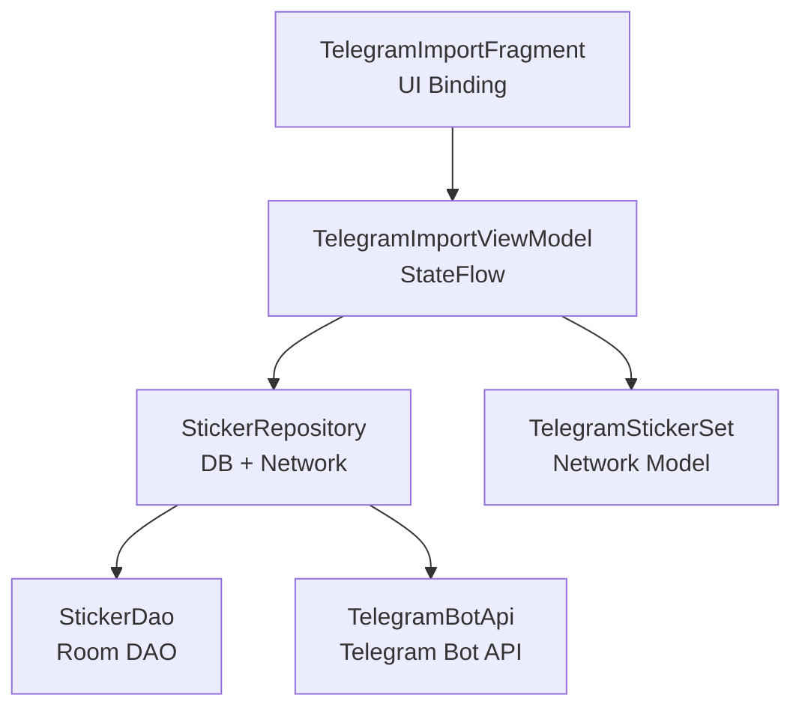
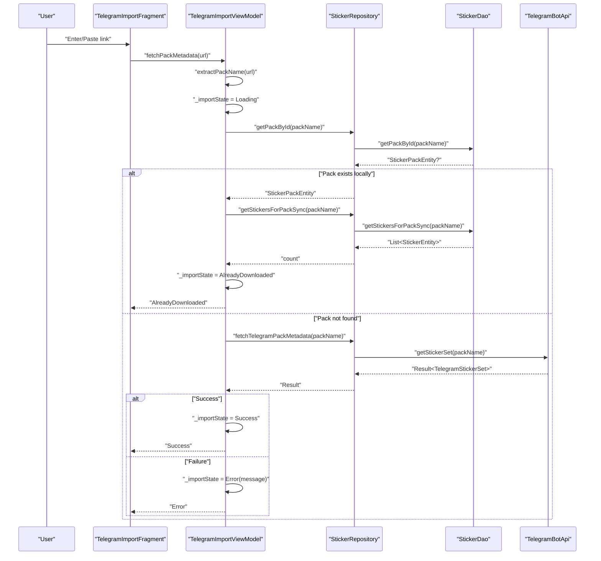
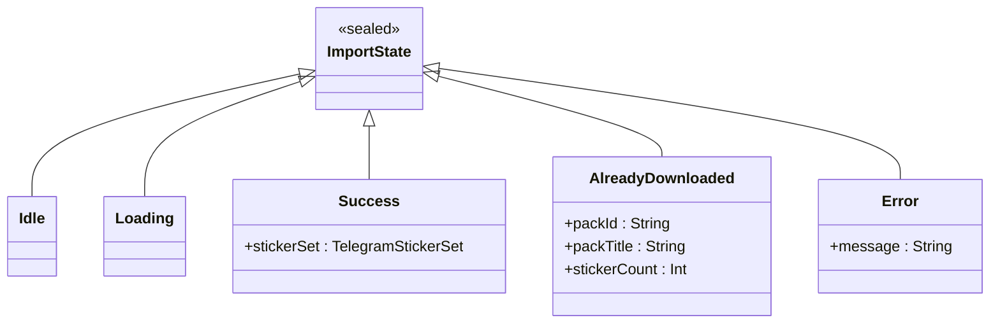
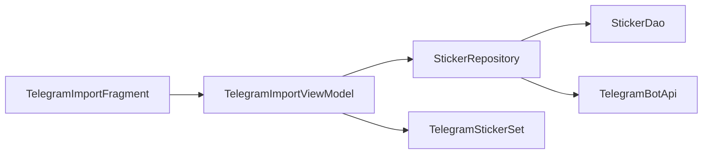

# Import State Management

<cite>
**Referenced Files in This Document**
- [TelegramImportFragment.kt](file://app/src/main/java/com/maheshsharan/tel2what/ui/importpack/TelegramImportFragment.kt)
- [TelegramImportViewModel.kt](file://app/src/main/java/com/maheshsharan/tel2what/ui/importpack/TelegramImportViewModel.kt)
- [StickerRepository.kt](file://app/src/main/java/com/maheshsharan/tel2what/data/repository/StickerRepository.kt)
- [TelegramBotApi.kt](file://app/src/main/java/com/maheshsharan/tel2what/data/network/TelegramBotApi.kt)
- [StickerDao.kt](file://app/src/main/java/com/maheshsharan/tel2what/data/local/dao/StickerDao.kt)
- [StickerPackEntity.kt](file://app/src/main/java/com/maheshsharan/tel2what/data/local/entity/StickerPackEntity.kt)
- [TelegramModels.kt](file://app/src/main/java/com/maheshsharan/tel2what/data/network/model/TelegramModels.kt)
- [fragment_telegram_import.xml](file://app/src/main/res/layout/fragment_telegram_import.xml)
</cite>

## Table of Contents
1. [Introduction](#introduction)
2. [Project Structure](#project-structure)
3. [Core Components](#core-components)
4. [Architecture Overview](#architecture-overview)
5. [Detailed Component Analysis](#detailed-component-analysis)
6. [Dependency Analysis](#dependency-analysis)
7. [Performance Considerations](#performance-considerations)
8. [Troubleshooting Guide](#troubleshooting-guide)
9. [Conclusion](#conclusion)

## Introduction
This document explains the import state management system centered around the ImportState sealed class used in the Telegram sticker pack import flow. It covers each state type (Idle, Loading, Success, AlreadyDownloaded, Error), the state transition logic, ViewModel implementation patterns, UI binding mechanisms, duplicate detection via cache checks, and threading considerations with viewModelScope and coroutine lifecycle management.

## Project Structure
The import flow spans UI, ViewModel, repository, and data layers:
- UI: TelegramImportFragment observes ImportState and updates the UI accordingly
- ViewModel: TelegramImportViewModel defines ImportState sealed class and orchestrates state transitions
- Repository: StickerRepository coordinates database and network operations
- Network: TelegramBotApi handles Telegram Bot API requests
- Local: Room DAO and entities persist sticker packs and stickers

**Diagram sources**
- [TelegramImportFragment.kt](file://app/src/main/java/com/maheshsharan/tel2what/ui/importpack/TelegramImportFragment.kt#L25-L154)
- [TelegramImportViewModel.kt](file://app/src/main/java/com/maheshsharan/tel2what/ui/importpack/TelegramImportViewModel.kt#L13-L94)
- [StickerRepository.kt](file://app/src/main/java/com/maheshsharan/tel2what/data/repository/StickerRepository.kt#L10-L79)
- [TelegramBotApi.kt](file://app/src/main/java/com/maheshsharan/tel2what/data/network/TelegramBotApi.kt#L14-L111)
- [StickerDao.kt](file://app/src/main/java/com/maheshsharan/tel2what/data/local/dao/StickerDao.kt#L14-L80)
- [TelegramModels.kt](file://app/src/main/java/com/maheshsharan/tel2what/data/network/model/TelegramModels.kt#L15-L20)

**Section sources**
- [TelegramImportFragment.kt](file://app/src/main/java/com/maheshsharan/tel2what/ui/importpack/TelegramImportFragment.kt#L25-L154)
- [TelegramImportViewModel.kt](file://app/src/main/java/com/maheshsharan/tel2what/ui/importpack/TelegramImportViewModel.kt#L13-L94)
- [StickerRepository.kt](file://app/src/main/java/com/maheshsharan/tel2what/data/repository/StickerRepository.kt#L10-L79)
- [TelegramBotApi.kt](file://app/src/main/java/com/maheshsharan/tel2what/data/network/TelegramBotApi.kt#L14-L111)
- [StickerDao.kt](file://app/src/main/java/com/maheshsharan/tel2what/data/local/dao/StickerDao.kt#L14-L80)
- [TelegramModels.kt](file://app/src/main/java/com/maheshsharan/tel2what/data/network/model/TelegramModels.kt#L15-L20)

## Core Components
- ImportState sealed class defines five states:
  - Idle: Initial state before user interaction
  - Loading: Network operation in progress
  - Success: Metadata retrieved successfully
  - AlreadyDownloaded: Pack already exists in local database
  - Error: Failure scenario with user-facing message
- ViewModel exposes importState as a StateFlow and transitions states based on validation, cache checks, and network results.
- Fragment observes importState and updates UI controls (visibility, enabled state, text, error messages).

Key implementation references:
- State definition and transitions: [TelegramImportViewModel.kt](file://app/src/main/java/com/maheshsharan/tel2what/ui/importpack/TelegramImportViewModel.kt#L13-L66)
- UI observation and rendering: [TelegramImportFragment.kt](file://app/src/main/java/com/maheshsharan/tel2what/ui/importpack/TelegramImportFragment.kt#L94-L151)

**Section sources**
- [TelegramImportViewModel.kt](file://app/src/main/java/com/maheshsharan/tel2what/ui/importpack/TelegramImportViewModel.kt#L13-L66)
- [TelegramImportFragment.kt](file://app/src/main/java/com/maheshsharan/tel2what/ui/importpack/TelegramImportFragment.kt#L94-L151)

## Architecture Overview
The import flow follows MVVM with reactive state updates:
- User enters or pastes a Telegram sticker pack link
- ViewModel validates the URL and extracts the pack name
- ViewModel checks local database for existing pack
- If not found, ViewModel fetches metadata from Telegram Bot API
- ViewModel emits appropriate ImportState and Fragment updates UI

**Diagram sources**
- [TelegramImportViewModel.kt](file://app/src/main/java/com/maheshsharan/tel2what/ui/importpack/TelegramImportViewModel.kt#L30-L66)
- [StickerRepository.kt](file://app/src/main/java/com/maheshsharan/tel2what/data/repository/StickerRepository.kt#L20-L24)
- [TelegramBotApi.kt](file://app/src/main/java/com/maheshsharan/tel2what/data/network/TelegramBotApi.kt#L22-L73)
- [StickerDao.kt](file://app/src/main/java/com/maheshsharan/tel2what/data/local/dao/StickerDao.kt#L30-L47)

## Detailed Component Analysis

### ImportState Sealed Class
The sealed class encapsulates all possible states of the import process. Each state variant carries relevant data for UI rendering or downstream actions.

**Diagram sources**
- [TelegramImportViewModel.kt](file://app/src/main/java/com/maheshsharan/tel2what/ui/importpack/TelegramImportViewModel.kt#L13-L23)

**Section sources**
- [TelegramImportViewModel.kt](file://app/src/main/java/com/maheshsharan/tel2what/ui/importpack/TelegramImportViewModel.kt#L13-L23)

### ViewModel Implementation Patterns
- State container: Uses MutableStateFlow initialized to Idle and exposed as StateFlow for read-only consumption
- Threading: viewModelScope ensures coroutine lifecycle aligns with ViewModel lifecycle
- Validation: extractPackName supports multiple URL formats and raw pack names
- Duplicate detection: getPackById checks Room database before network call
- Error handling: Converts exceptions to user-friendly messages

References:
- State container and transitions: [TelegramImportViewModel.kt](file://app/src/main/java/com/maheshsharan/tel2what/ui/importpack/TelegramImportViewModel.kt#L27-L66)
- URL extraction: [TelegramImportViewModel.kt](file://app/src/main/java/com/maheshsharan/tel2what/ui/importpack/TelegramImportViewModel.kt#L68-L93)

**Section sources**
- [TelegramImportViewModel.kt](file://app/src/main/java/com/maheshsharan/tel2what/ui/importpack/TelegramImportViewModel.kt#L25-L93)

### UI Binding Mechanisms
- Fragment creates ViewModel with factory using repository injected from AppDatabase
- Observes importState via lifecycleScope and resets UI state before applying new state
- Renders previews, enables/disables action button, shows/hides progress indicator, and displays error messages

References:
- ViewModel creation and factory: [TelegramImportFragment.kt](file://app/src/main/java/com/maheshsharan/tel2what/ui/importpack/TelegramImportFragment.kt#L33-L36)
- UI observation and state rendering: [TelegramImportFragment.kt](file://app/src/main/java/com/maheshsharan/tel2what/ui/importpack/TelegramImportFragment.kt#L94-L151)
- Layout XML for UI elements: [fragment_telegram_import.xml](file://app/src/main/res/layout/fragment_telegram_import.xml#L90-L204)

**Section sources**
- [TelegramImportFragment.kt](file://app/src/main/java/com/maheshsharan/tel2what/ui/importpack/TelegramImportFragment.kt#L29-L151)
- [fragment_telegram_import.xml](file://app/src/main/res/layout/fragment_telegram_import.xml#L90-L204)

### State Transition Logic
- Idle → Loading: On user input or paste action
- Loading → AlreadyDownloaded: If pack exists locally
- Loading → Success: If metadata fetch succeeds and pack is not empty
- Loading → Error: On invalid URL, empty pack, or network/API errors
- Success → Navigation: Opens conversion/download flow
- AlreadyDownloaded → Navigation: Opens sticker selection

References:
- Transitions and conditions: [TelegramImportViewModel.kt](file://app/src/main/java/com/maheshsharan/tel2what/ui/importpack/TelegramImportViewModel.kt#L30-L66)
- UI-driven transitions: [TelegramImportFragment.kt](file://app/src/main/java/com/maheshsharan/tel2what/ui/importpack/TelegramImportFragment.kt#L80-L91)

**Section sources**
- [TelegramImportViewModel.kt](file://app/src/main/java/com/maheshsharan/tel2what/ui/importpack/TelegramImportViewModel.kt#L30-L66)
- [TelegramImportFragment.kt](file://app/src/main/java/com/maheshsharan/tel2what/ui/importpack/TelegramImportFragment.kt#L80-L91)

### Duplicate Detection Algorithm
Duplicate detection prevents redundant downloads by checking the local database:
- Extract pack name from URL
- Query StickerPackEntity by identifier
- If found, compute sticker count from StickerEntity list
- Emit AlreadyDownloaded with pack metadata

References:
- Cache check and AlreadyDownloaded emission: [TelegramImportViewModel.kt](file://app/src/main/java/com/maheshsharan/tel2what/ui/importpack/TelegramImportViewModel.kt#L39-L50)
- DAO queries: [StickerDao.kt](file://app/src/main/java/com/maheshsharan/tel2what/data/local/dao/StickerDao.kt#L30-L47)
- Repository facade: [StickerRepository.kt](file://app/src/main/java/com/maheshsharan/tel2what/data/repository/StickerRepository.kt#L20-L24)

**Section sources**
- [TelegramImportViewModel.kt](file://app/src/main/java/com/maheshsharan/tel2what/ui/importpack/TelegramImportViewModel.kt#L39-L50)
- [StickerDao.kt](file://app/src/main/java/com/maheshsharan/tel2what/data/local/dao/StickerDao.kt#L30-L47)
- [StickerRepository.kt](file://app/src/main/java/com/maheshsharan/tel2what/data/repository/StickerRepository.kt#L20-L24)

### Threading Considerations and Lifecycle Management
- viewModelScope: Launches coroutines bound to ViewModel lifecycle; automatically cancelled when ViewModel is cleared
- Dispatchers.IO: Network operations performed off the main thread
- UI updates: Always occur on main thread via StateFlow collection in lifecycleScope

References:
- viewModelScope usage: [TelegramImportViewModel.kt](file://app/src/main/java/com/maheshsharan/tel2what/ui/importpack/TelegramImportViewModel.kt#L39-L65)
- Network dispatcher: [TelegramBotApi.kt](file://app/src/main/java/com/maheshsharan/tel2what/data/network/TelegramBotApi.kt#L22-L73)
- UI observation on lifecycleScope: [TelegramImportFragment.kt](file://app/src/main/java/com/maheshsharan/tel2what/ui/importpack/TelegramImportFragment.kt#L94-L151)

**Section sources**
- [TelegramImportViewModel.kt](file://app/src/main/java/com/maheshsharan/tel2what/ui/importpack/TelegramImportViewModel.kt#L39-L65)
- [TelegramBotApi.kt](file://app/src/main/java/com/maheshsharan/tel2what/data/network/TelegramBotApi.kt#L22-L73)
- [TelegramImportFragment.kt](file://app/src/main/java/com/maheshsharan/tel2what/ui/importpack/TelegramImportFragment.kt#L94-L151)

## Dependency Analysis
The import flow depends on:
- ViewModel depends on Repository
- Repository depends on DAO and TelegramBotApi
- Fragment depends on ViewModel and layout resources

**Diagram sources**
- [TelegramImportFragment.kt](file://app/src/main/java/com/maheshsharan/tel2what/ui/importpack/TelegramImportFragment.kt#L25-L36)
- [TelegramImportViewModel.kt](file://app/src/main/java/com/maheshsharan/tel2what/ui/importpack/TelegramImportViewModel.kt#L25-L28)
- [StickerRepository.kt](file://app/src/main/java/com/maheshsharan/tel2what/data/repository/StickerRepository.kt#L10-L14)
- [TelegramBotApi.kt](file://app/src/main/java/com/maheshsharan/tel2what/data/network/TelegramBotApi.kt#L14-L18)
- [StickerDao.kt](file://app/src/main/java/com/maheshsharan/tel2what/data/local/dao/StickerDao.kt#L14-L14)
- [TelegramModels.kt](file://app/src/main/java/com/maheshsharan/tel2what/data/network/model/TelegramModels.kt#L15-L20)

**Section sources**
- [TelegramImportFragment.kt](file://app/src/main/java/com/maheshsharan/tel2what/ui/importpack/TelegramImportFragment.kt#L25-L36)
- [TelegramImportViewModel.kt](file://app/src/main/java/com/maheshsharan/tel2what/ui/importpack/TelegramImportViewModel.kt#L25-L28)
- [StickerRepository.kt](file://app/src/main/java/com/maheshsharan/tel2what/data/repository/StickerRepository.kt#L10-L14)
- [TelegramBotApi.kt](file://app/src/main/java/com/maheshsharan/tel2what/data/network/TelegramBotApi.kt#L14-L18)
- [StickerDao.kt](file://app/src/main/java/com/maheshsharan/tel2what/data/local/dao/StickerDao.kt#L14-L14)
- [TelegramModels.kt](file://app/src/main/java/com/maheshsharan/tel2what/data/network/model/TelegramModels.kt#L15-L20)

## Performance Considerations
- Prefer cache-first approach: Check database before network calls to reduce latency and API usage
- Use StateFlow for reactive UI updates: Avoid redundant UI work by leveraging collect semantics
- Keep network calls off the main thread: Dispatchers.IO ensures responsiveness
- Limit UI updates: Reset UI state per state change to minimize flicker and redundant work

## Troubleshooting Guide
Common issues and resolutions:
- Invalid Telegram link: Ensure the URL starts with the expected prefixes or is a plain pack name without slashes/spaces
- Empty pack: UI shows an error when the returned sticker list is empty
- Network/API errors: TelegramBotApi maps HTTP errors and parsing failures to user-friendly messages
- No internet: Network exceptions are captured and surfaced as errors

References:
- URL validation and error emission: [TelegramImportViewModel.kt](file://app/src/main/java/com/maheshsharan/tel2what/ui/importpack/TelegramImportViewModel.kt#L30-L35)
- Empty pack handling: [TelegramImportViewModel.kt](file://app/src/main/java/com/maheshsharan/tel2what/ui/importpack/TelegramImportViewModel.kt#L56-L60)
- API error mapping: [TelegramBotApi.kt](file://app/src/main/java/com/maheshsharan/tel2what/data/network/TelegramBotApi.kt#L34-L72)
- UI error display: [TelegramImportFragment.kt](file://app/src/main/java/com/maheshsharan/tel2what/ui/importpack/TelegramImportFragment.kt#L144-L148)

**Section sources**
- [TelegramImportViewModel.kt](file://app/src/main/java/com/maheshsharan/tel2what/ui/importpack/TelegramImportViewModel.kt#L30-L35)
- [TelegramImportViewModel.kt](file://app/src/main/java/com/maheshsharan/tel2what/ui/importpack/TelegramImportViewModel.kt#L56-L60)
- [TelegramBotApi.kt](file://app/src/main/java/com/maheshsharan/tel2what/data/network/TelegramBotApi.kt#L34-L72)
- [TelegramImportFragment.kt](file://app/src/main/java/com/maheshsharan/tel2what/ui/importpack/TelegramImportFragment.kt#L144-L148)

## Conclusion
The import state management system cleanly separates concerns across UI, ViewModel, repository, and data layers. The ImportState sealed class provides a comprehensive, type-safe representation of the import lifecycle. The ViewModel enforces proper threading and lifecycle management, while the Fragment binds state to UI with clear user feedback. Duplicate detection leverages the local database to avoid unnecessary network calls, and error handling surfaces actionable messages to users.