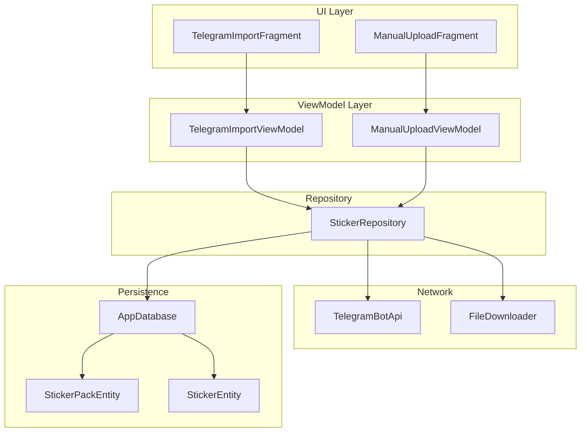
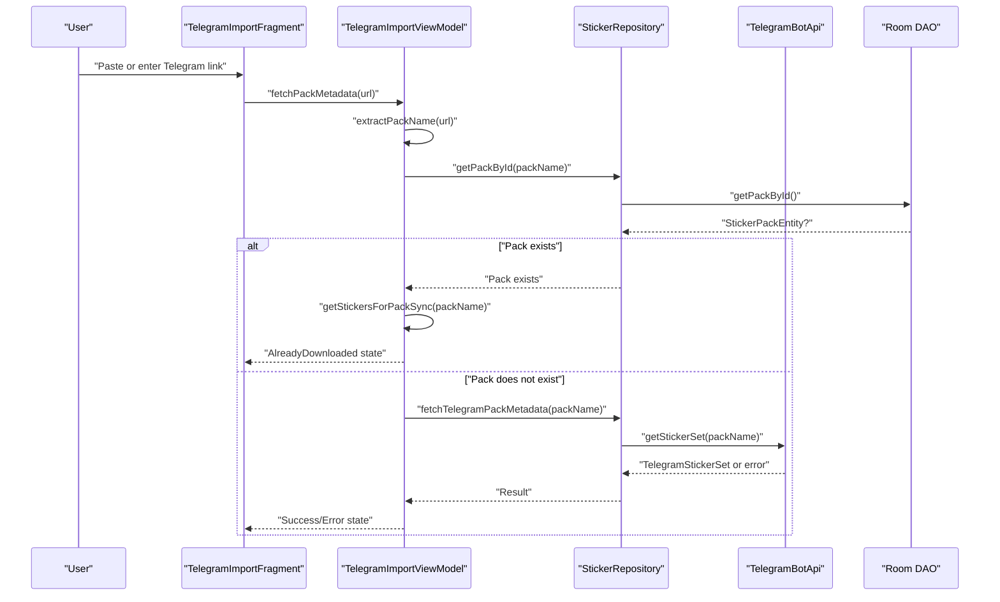
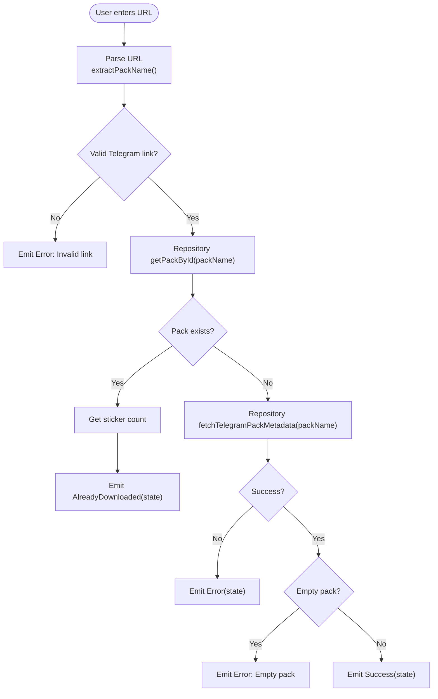
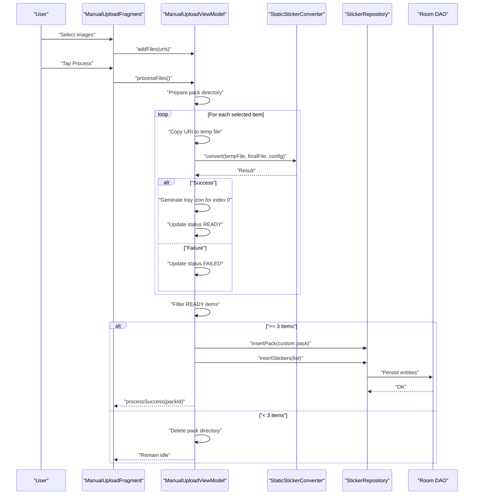
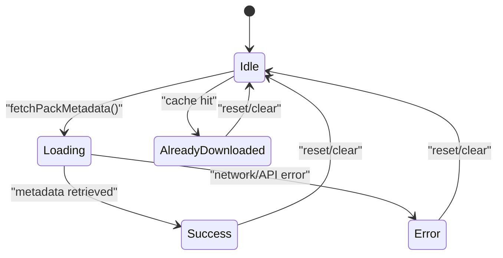
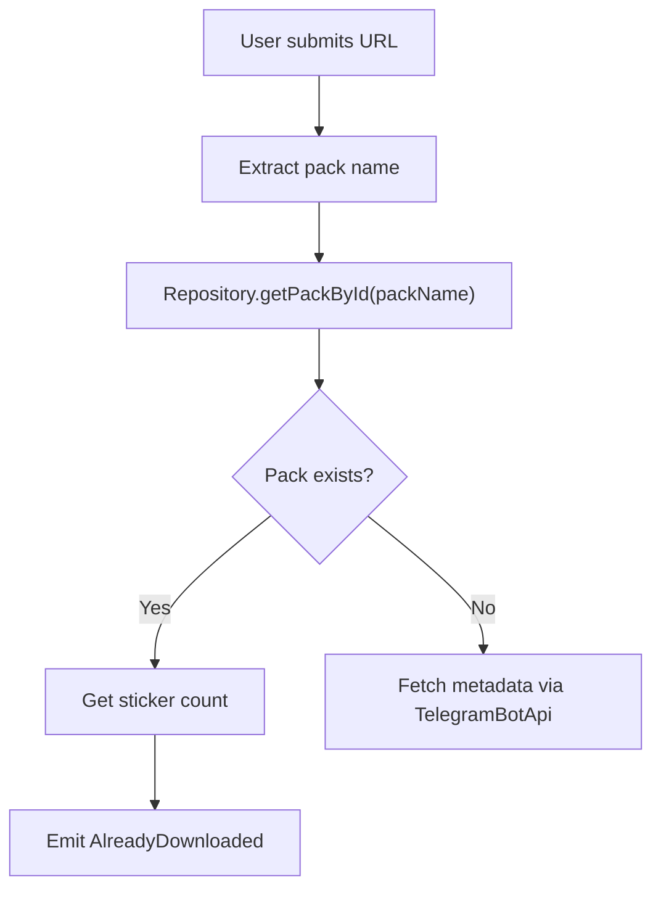
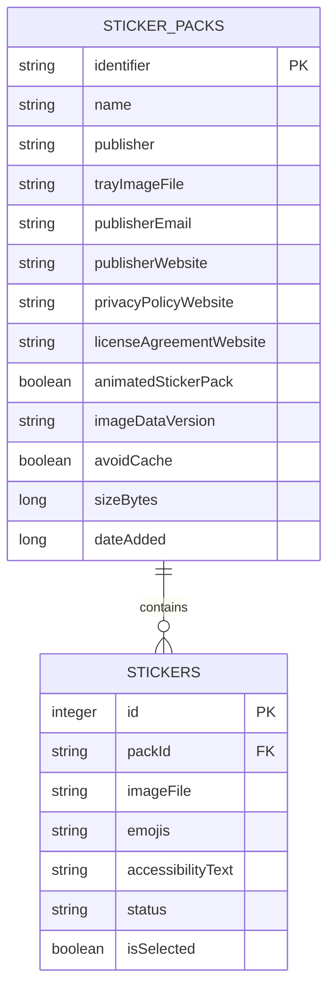
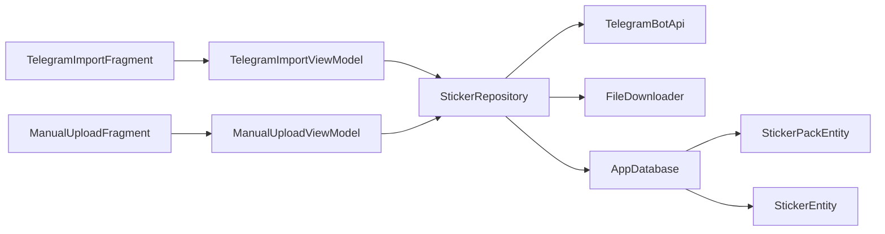

# Import System

<cite>
**Referenced Files in This Document**
- [TelegramImportFragment.kt](file://app/src/main/java/com/maheshsharan/tel2what/ui/importpack/TelegramImportFragment.kt)
- [TelegramImportViewModel.kt](file://app/src/main/java/com/maheshsharan/tel2what/ui/importpack/TelegramImportViewModel.kt)
- [ManualUploadFragment.kt](file://app/src/main/java/com/maheshsharan/tel2what/ui/manual/ManualUploadFragment.kt)
- [ManualUploadViewModel.kt](file://app/src/main/java/com/maheshsharan/tel2what/ui/manual/ManualUploadViewModel.kt)
- [TelegramBotApi.kt](file://app/src/main/java/com/maheshsharan/tel2what/data/network/TelegramBotApi.kt)
- [FileDownloader.kt](file://app/src/main/java/com/maheshsharan/tel2what/data/network/FileDownloader.kt)
- [StickerRepository.kt](file://app/src/main/java/com/maheshsharan/tel2what/data/repository/StickerRepository.kt)
- [AppDatabase.kt](file://app/src/main/java/com/maheshsharan/tel2what/data/local/AppDatabase.kt)
- [StickerPackEntity.kt](file://app/src/main/java/com/maheshsharan/tel2what/data/local/entity/StickerPackEntity.kt)
- [StickerEntity.kt](file://app/src/main/java/com/maheshsharan/tel2what/data/local/entity/StickerEntity.kt)
</cite>

## Table of Contents
1. [Introduction](#introduction)
2. [Project Structure](#project-structure)
3. [Core Components](#core-components)
4. [Architecture Overview](#architecture-overview)
5. [Detailed Component Analysis](#detailed-component-analysis)
6. [Dependency Analysis](#dependency-analysis)
7. [Performance Considerations](#performance-considerations)
8. [Troubleshooting Guide](#troubleshooting-guide)
9. [Conclusion](#conclusion)

## Introduction
This document explains Tel2What's import system, covering two primary workflows:
- Telegram Bot API integration to fetch sticker pack metadata from a Telegram URL and preview pack details
- Manual upload workflow to import stickers from device storage

It documents URL parsing, authentication, data retrieval, state management, duplicate detection via cache checks and database queries, error handling strategies, and the integration with the repository and persistence layers.

## Project Structure
The import system spans UI fragments, view models, a repository layer, network APIs, and local persistence:
- UI: TelegramImportFragment and ManualUploadFragment handle user interactions and state rendering
- ViewModels: TelegramImportViewModel and ManualUploadViewModel orchestrate business logic and state
- Repository: StickerRepository mediates between UI and data sources
- Network: TelegramBotApi and FileDownloader implement Telegram API calls and file downloads
- Persistence: AppDatabase with Room DAOs persists sticker packs and stickers

**Diagram sources**
- [TelegramImportFragment.kt](file://app/src/main/java/com/maheshsharan/tel2what/ui/importpack/TelegramImportFragment.kt#L25-L154)
- [ManualUploadFragment.kt](file://app/src/main/java/com/maheshsharan/tel2what/ui/manual/ManualUploadFragment.kt#L23-L111)
- [TelegramImportViewModel.kt](file://app/src/main/java/com/maheshsharan/tel2what/ui/importpack/TelegramImportViewModel.kt#L25-L94)
- [ManualUploadViewModel.kt](file://app/src/main/java/com/maheshsharan/tel2what/ui/manual/ManualUploadViewModel.kt#L33-L181)
- [StickerRepository.kt](file://app/src/main/java/com/maheshsharan/tel2what/data/repository/StickerRepository.kt#L10-L79)
- [TelegramBotApi.kt](file://app/src/main/java/com/maheshsharan/tel2what/data/network/TelegramBotApi.kt#L14-L112)
- [FileDownloader.kt](file://app/src/main/java/com/maheshsharan/tel2what/data/network/FileDownloader.kt#L11-L77)
- [AppDatabase.kt](file://app/src/main/java/com/maheshsharan/tel2what/data/local/AppDatabase.kt#L13-L42)
- [StickerPackEntity.kt](file://app/src/main/java/com/maheshsharan/tel2what/data/local/entity/StickerPackEntity.kt#L6-L22)
- [StickerEntity.kt](file://app/src/main/java/com/maheshsharan/tel2what/data/local/entity/StickerEntity.kt#L8-L29)

**Section sources**
- [TelegramImportFragment.kt](file://app/src/main/java/com/maheshsharan/tel2what/ui/importpack/TelegramImportFragment.kt#L25-L154)
- [ManualUploadFragment.kt](file://app/src/main/java/com/maheshsharan/tel2what/ui/manual/ManualUploadFragment.kt#L23-L111)
- [TelegramImportViewModel.kt](file://app/src/main/java/com/maheshsharan/tel2what/ui/importpack/TelegramImportViewModel.kt#L25-L94)
- [ManualUploadViewModel.kt](file://app/src/main/java/com/maheshsharan/tel2what/ui/manual/ManualUploadViewModel.kt#L33-L181)
- [StickerRepository.kt](file://app/src/main/java/com/maheshsharan/tel2what/data/repository/StickerRepository.kt#L10-L79)
- [TelegramBotApi.kt](file://app/src/main/java/com/maheshsharan/tel2what/data/network/TelegramBotApi.kt#L14-L112)
- [FileDownloader.kt](file://app/src/main/java/com/maheshsharan/tel2what/data/network/FileDownloader.kt#L11-L77)
- [AppDatabase.kt](file://app/src/main/java/com/maheshsharan/tel2what/data/local/AppDatabase.kt#L13-L42)
- [StickerPackEntity.kt](file://app/src/main/java/com/maheshsharan/tel2what/data/local/entity/StickerPackEntity.kt#L6-L22)
- [StickerEntity.kt](file://app/src/main/java/com/maheshsharan/tel2what/data/local/entity/StickerEntity.kt#L8-L29)

## Core Components
- TelegramImportFragment: Hosts the Telegram import UI, binds ViewModel, handles clipboard paste, link input, and renders preview and actions based on import state.
- TelegramImportViewModel: Manages import state, parses URLs, performs cache checks, and delegates metadata retrieval to the repository.
- ManualUploadFragment: Provides manual sticker selection from device storage, previews selected items, and triggers processing.
- ManualUploadViewModel: Processes images, converts to WebP, generates tray icon, and persists packs and stickers.
- TelegramBotApi: Implements Telegram Bot API calls for getStickerSet and getFile, with robust error handling.
- FileDownloader: Downloads files from URLs to local destinations with logging and cleanup.
- StickerRepository: Orchestrates repository operations, delegating to TelegramBotApi and FileDownloader, and managing Room DAO interactions.
- AppDatabase and Entities: Defines Room database, DAOs, and entities for sticker packs and stickers.

**Section sources**
- [TelegramImportFragment.kt](file://app/src/main/java/com/maheshsharan/tel2what/ui/importpack/TelegramImportFragment.kt#L25-L154)
- [TelegramImportViewModel.kt](file://app/src/main/java/com/maheshsharan/tel2what/ui/importpack/TelegramImportViewModel.kt#L25-L94)
- [ManualUploadFragment.kt](file://app/src/main/java/com/maheshsharan/tel2what/ui/manual/ManualUploadFragment.kt#L23-L111)
- [ManualUploadViewModel.kt](file://app/src/main/java/com/maheshsharan/tel2what/ui/manual/ManualUploadViewModel.kt#L33-L181)
- [TelegramBotApi.kt](file://app/src/main/java/com/maheshsharan/tel2what/data/network/TelegramBotApi.kt#L14-L112)
- [FileDownloader.kt](file://app/src/main/java/com/maheshsharan/tel2what/data/network/FileDownloader.kt#L11-L77)
- [StickerRepository.kt](file://app/src/main/java/com/maheshsharan/tel2what/data/repository/StickerRepository.kt#L10-L79)
- [AppDatabase.kt](file://app/src/main/java/com/maheshsharan/tel2what/data/local/AppDatabase.kt#L13-L42)
- [StickerPackEntity.kt](file://app/src/main/java/com/maheshsharan/tel2what/data/local/entity/StickerPackEntity.kt#L6-L22)
- [StickerEntity.kt](file://app/src/main/java/com/maheshsharan/tel2what/data/local/entity/StickerEntity.kt#L8-L29)

## Architecture Overview
The import system follows MVVM with a repository pattern:
- UI fragments observe StateFlow from ViewModels
- ViewModels call repository methods
- Repository coordinates network and persistence
- Network layer handles Telegram API and file downloads
- Persistence layer stores packs and stickers

**Diagram sources**
- [TelegramImportFragment.kt](file://app/src/main/java/com/maheshsharan/tel2what/ui/importpack/TelegramImportFragment.kt#L29-L151)
- [TelegramImportViewModel.kt](file://app/src/main/java/com/maheshsharan/tel2what/ui/importpack/TelegramImportViewModel.kt#L30-L66)
- [StickerRepository.kt](file://app/src/main/java/com/maheshsharan/tel2what/data/repository/StickerRepository.kt#L20-L28)
- [TelegramBotApi.kt](file://app/src/main/java/com/maheshsharan/tel2what/data/network/TelegramBotApi.kt#L22-L73)
- [AppDatabase.kt](file://app/src/main/java/com/maheshsharan/tel2what/data/local/AppDatabase.kt#L13-L42)

## Detailed Component Analysis

### Telegram Import Workflow
- URL Parsing: Accepts full Telegram links or raw pack names, trims whitespace, removes trailing slashes, and supports both HTTPS and protocol-relative prefixes.
- Authentication: Uses a hardcoded bot token to call Telegram Bot API endpoints.
- Metadata Retrieval: Calls getStickerSet to fetch pack details; handles HTTP errors, JSON parsing, and network exceptions.
- Duplicate Detection: Checks Room database for existing pack by identifier; if present, reports AlreadyDownloaded with saved sticker count.
- State Management: Emits Idle, Loading, Success, AlreadyDownloaded, and Error states; UI updates accordingly.

**Diagram sources**
- [TelegramImportViewModel.kt](file://app/src/main/java/com/maheshsharan/tel2what/ui/importpack/TelegramImportViewModel.kt#L30-L93)
- [StickerRepository.kt](file://app/src/main/java/com/maheshsharan/tel2what/data/repository/StickerRepository.kt#L20-L28)
- [TelegramBotApi.kt](file://app/src/main/java/com/maheshsharan/tel2what/data/network/TelegramBotApi.kt#L22-L73)

**Section sources**
- [TelegramImportFragment.kt](file://app/src/main/java/com/maheshsharan/tel2what/ui/importpack/TelegramImportFragment.kt#L29-L151)
- [TelegramImportViewModel.kt](file://app/src/main/java/com/maheshsharan/tel2what/ui/importpack/TelegramImportViewModel.kt#L30-L93)
- [TelegramBotApi.kt](file://app/src/main/java/com/maheshsharan/tel2what/data/network/TelegramBotApi.kt#L14-L112)
- [StickerRepository.kt](file://app/src/main/java/com/maheshsharan/tel2what/data/repository/StickerRepository.kt#L10-L79)

### Manual Upload Workflow
- File Selection: Allows selecting up to 30 images from device storage.
- Processing Pipeline: Converts each image to WebP using StaticStickerConverter, generates tray icon for the first sticker, and tracks per-item status.
- Persistence: Creates a new custom pack with a generated identifier, inserts stickers, and navigates to the selection screen upon success.
- Validation: Requires at least 3 successful conversions to persist; otherwise cleans up and remains idle.

**Diagram sources**
- [ManualUploadFragment.kt](file://app/src/main/java/com/maheshsharan/tel2what/ui/manual/ManualUploadFragment.kt#L28-L108)
- [ManualUploadViewModel.kt](file://app/src/main/java/com/maheshsharan/tel2what/ui/manual/ManualUploadViewModel.kt#L64-L166)
- [StickerRepository.kt](file://app/src/main/java/com/maheshsharan/tel2what/data/repository/StickerRepository.kt#L32-L42)
- [AppDatabase.kt](file://app/src/main/java/com/maheshsharan/tel2what/data/local/AppDatabase.kt#L13-L42)

**Section sources**
- [ManualUploadFragment.kt](file://app/src/main/java/com/maheshsharan/tel2what/ui/manual/ManualUploadFragment.kt#L23-L111)
- [ManualUploadViewModel.kt](file://app/src/main/java/com/maheshsharan/tel2what/ui/manual/ManualUploadViewModel.kt#L33-L181)
- [StickerRepository.kt](file://app/src/main/java/com/maheshsharan/tel2what/data/repository/StickerRepository.kt#L10-L79)

### Import State Management
The import state machine defines five states:
- Idle: Initial state; hides preview; action button says "Fetch Details".
- Loading: Disables input; shows progress; indicates network operation.
- Success: Displays pack preview; action button triggers conversion/download flow.
- AlreadyDownloaded: Indicates previously imported pack; shows saved count; opens selection.
- Error: Displays error message; allows retry after fixing input.

**Diagram sources**
- [TelegramImportViewModel.kt](file://app/src/main/java/com/maheshsharan/tel2what/ui/importpack/TelegramImportViewModel.kt#L13-L23)
- [TelegramImportFragment.kt](file://app/src/main/java/com/maheshsharan/tel2what/ui/importpack/TelegramImportFragment.kt#L102-L149)

**Section sources**
- [TelegramImportViewModel.kt](file://app/src/main/java/com/maheshsharan/tel2what/ui/importpack/TelegramImportViewModel.kt#L13-L23)
- [TelegramImportFragment.kt](file://app/src/main/java/com/maheshsharan/tel2what/ui/importpack/TelegramImportFragment.kt#L102-L149)

### Duplicate Detection Mechanism
Duplicate detection relies on:
- Cache Check: Repository queries the database for an existing pack by identifier before attempting to fetch metadata.
- Database Query: If found, the ViewModel retrieves the sticker count synchronously and emits AlreadyDownloaded state.
- Prevention: This avoids redundant network calls and duplicate downloads.

**Diagram sources**
- [TelegramImportViewModel.kt](file://app/src/main/java/com/maheshsharan/tel2what/ui/importpack/TelegramImportViewModel.kt#L39-L50)
- [StickerRepository.kt](file://app/src/main/java/com/maheshsharan/tel2what/data/repository/StickerRepository.kt#L20-L24)

**Section sources**
- [TelegramImportViewModel.kt](file://app/src/main/java/com/maheshsharan/tel2what/ui/importpack/TelegramImportViewModel.kt#L39-L50)
- [StickerRepository.kt](file://app/src/main/java/com/maheshsharan/tel2what/data/repository/StickerRepository.kt#L20-L24)

### Supported URL Formats
The URL parser accepts:
- Full HTTPS link: https://t.me/addstickers/<packName>
- Protocol-relative link: t.me/addstickers/<packName>
- Raw pack name: <packName> (without slashes or spaces)

Examples:
- https://t.me/addstickers/Animals
- t.me/addstickers/CuteCats
- Animals

Invalid examples:
- https://t.me/notaddstickers/Animals
- https://t.me/addstickers/Animals Extra (contains space)
- https://t.me/addstickers/Animals/ (trailing slash handled)

**Section sources**
- [TelegramImportViewModel.kt](file://app/src/main/java/com/maheshsharan/tel2what/ui/importpack/TelegramImportViewModel.kt#L68-L93)

### Error Handling Strategies
- Telegram Bot API:
  - Handles 401 Unauthorized, 404 Not Found, 400 Bad Request, and generic HTTP errors
  - Parses error messages from JSON response where available
  - Distinguishes between invalid token, restricted token, and missing sticker sets
  - Catches network exceptions (e.g., UnknownHostException) and returns user-friendly messages
- File Downloader:
  - Logs response codes and body
  - Ensures parent directories exist
  - Cleans up incomplete files on failure
- UI:
  - Displays error messages in TextInputLayout
  - Resets UI states after transitions

**Section sources**
- [TelegramBotApi.kt](file://app/src/main/java/com/maheshsharan/tel2what/data/network/TelegramBotApi.kt#L34-L73)
- [FileDownloader.kt](file://app/src/main/java/com/maheshsharan/tel2what/data/network/FileDownloader.kt#L21-L75)
- [TelegramImportFragment.kt](file://app/src/main/java/com/maheshsharan/tel2what/ui/importpack/TelegramImportFragment.kt#L144-L148)

### Data Persistence and Repository Integration
- Room Entities:
  - StickerPackEntity: Stores pack metadata and identifiers
  - StickerEntity: Stores individual sticker records linked to a pack
- Repository Methods:
  - Insert/update/delete packs and stickers
  - Query packs and stickers synchronously and asynchronously
  - Delegate network calls for file paths and downloads
- Database Initialization:
  - AppDatabase defines entities, version, and migrations

**Diagram sources**
- [StickerPackEntity.kt](file://app/src/main/java/com/maheshsharan/tel2what/data/local/entity/StickerPackEntity.kt#L6-L22)
- [StickerEntity.kt](file://app/src/main/java/com/maheshsharan/tel2what/data/local/entity/StickerEntity.kt#L8-L29)
- [AppDatabase.kt](file://app/src/main/java/com/maheshsharan/tel2what/data/local/AppDatabase.kt#L13-L42)

**Section sources**
- [StickerRepository.kt](file://app/src/main/java/com/maheshsharan/tel2what/data/repository/StickerRepository.kt#L10-L79)
- [StickerPackEntity.kt](file://app/src/main/java/com/maheshsharan/tel2what/data/local/entity/StickerPackEntity.kt#L6-L22)
- [StickerEntity.kt](file://app/src/main/java/com/maheshsharan/tel2what/data/local/entity/StickerEntity.kt#L8-L29)
- [AppDatabase.kt](file://app/src/main/java/com/maheshsharan/tel2what/data/local/AppDatabase.kt#L13-L42)

## Dependency Analysis
The import system exhibits clear separation of concerns:
- UI depends on ViewModels
- ViewModels depend on Repository
- Repository depends on Network and Persistence
- Network components are self-contained
- Persistence is encapsulated behind DAOs

**Diagram sources**
- [TelegramImportFragment.kt](file://app/src/main/java/com/maheshsharan/tel2what/ui/importpack/TelegramImportFragment.kt#L25-L36)
- [ManualUploadFragment.kt](file://app/src/main/java/com/maheshsharan/tel2what/ui/manual/ManualUploadFragment.kt#L34-L40)
- [TelegramImportViewModel.kt](file://app/src/main/java/com/maheshsharan/tel2what/ui/importpack/TelegramImportViewModel.kt#L25-L28)
- [ManualUploadViewModel.kt](file://app/src/main/java/com/maheshsharan/tel2what/ui/manual/ManualUploadViewModel.kt#L33-L48)
- [StickerRepository.kt](file://app/src/main/java/com/maheshsharan/tel2what/data/repository/StickerRepository.kt#L10-L14)
- [TelegramBotApi.kt](file://app/src/main/java/com/maheshsharan/tel2what/data/network/TelegramBotApi.kt#L14-L18)
- [FileDownloader.kt](file://app/src/main/java/com/maheshsharan/tel2what/data/network/FileDownloader.kt#L11-L13)
- [AppDatabase.kt](file://app/src/main/java/com/maheshsharan/tel2what/data/local/AppDatabase.kt#L13-L15)

**Section sources**
- [TelegramImportFragment.kt](file://app/src/main/java/com/maheshsharan/tel2what/ui/importpack/TelegramImportFragment.kt#L25-L36)
- [ManualUploadFragment.kt](file://app/src/main/java/com/maheshsharan/tel2what/ui/manual/ManualUploadFragment.kt#L34-L40)
- [TelegramImportViewModel.kt](file://app/src/main/java/com/maheshsharan/tel2what/ui/importpack/TelegramImportViewModel.kt#L25-L28)
- [ManualUploadViewModel.kt](file://app/src/main/java/com/maheshsharan/tel2what/ui/manual/ManualUploadViewModel.kt#L33-L48)
- [StickerRepository.kt](file://app/src/main/java/com/maheshsharan/tel2what/data/repository/StickerRepository.kt#L10-L14)
- [TelegramBotApi.kt](file://app/src/main/java/com/maheshsharan/tel2what/data/network/TelegramBotApi.kt#L14-L18)
- [FileDownloader.kt](file://app/src/main/java/com/maheshsharan/tel2what/data/network/FileDownloader.kt#L11-L13)
- [AppDatabase.kt](file://app/src/main/java/com/maheshsharan/tel2what/data/local/AppDatabase.kt#L13-L15)

## Performance Considerations
- Concurrency: ManualUploadViewModel uses coroutines with Dispatchers.IO and async/await to process multiple files concurrently while limiting UI blocking.
- Early Termination: Manual upload pipeline validates success counts early and cleans up on failure to avoid unnecessary work.
- Network Efficiency: TelegramBotApi caches OkHttp client and reuses it; repository consolidates network calls.
- Disk I/O: FileDownloader ensures parent directories exist and streams directly to disk to minimize memory overhead.

[No sources needed since this section provides general guidance]

## Troubleshooting Guide
Common issues and resolutions:
- Invalid Telegram Link
  - Symptom: Error state with message indicating invalid link format
  - Resolution: Ensure the link starts with https://t.me/addstickers/ or t.me/addstickers/, or paste a raw pack name without spaces or slashes
- Sticker Pack Not Found
  - Symptom: Error indicating the pack was not found
  - Resolution: Verify the pack is public and the name is correct; try fetching again
- Invalid Bot Token or Restricted Access
  - Symptom: 401 Unauthorized or endpoint not found errors
  - Resolution: Replace the hardcoded token with a valid one configured locally
- Empty Sticker Pack
  - Symptom: Error indicating zero stickers
  - Resolution: Choose a non-empty pack
- Network Connectivity Issues
  - Symptom: UnknownHostException or network error messages
  - Resolution: Check internet connectivity and retry
- Manual Upload Insufficient Items
  - Symptom: No persistence and cleanup
  - Resolution: Select at least 3 images for conversion

**Section sources**
- [TelegramImportViewModel.kt](file://app/src/main/java/com/maheshsharan/tel2what/ui/importpack/TelegramImportViewModel.kt#L32-L34)
- [TelegramBotApi.kt](file://app/src/main/java/com/maheshsharan/tel2what/data/network/TelegramBotApi.kt#L36-L57)
- [TelegramImportFragment.kt](file://app/src/main/java/com/maheshsharan/tel2what/ui/importpack/TelegramImportFragment.kt#L144-L148)
- [ManualUploadViewModel.kt](file://app/src/main/java/com/maheshsharan/tel2what/ui/manual/ManualUploadViewModel.kt#L147-L154)

## Conclusion
Tel2What’s import system provides two complementary pathways to acquire sticker packs:
- Telegram Bot API integration with robust URL parsing, authentication, and error handling
- Manual upload with batch processing, conversion, and persistence

The system leverages a clear MVVM architecture with a repository layer mediating network and persistence, ensuring predictable state management, efficient duplicate detection, and resilient error handling.