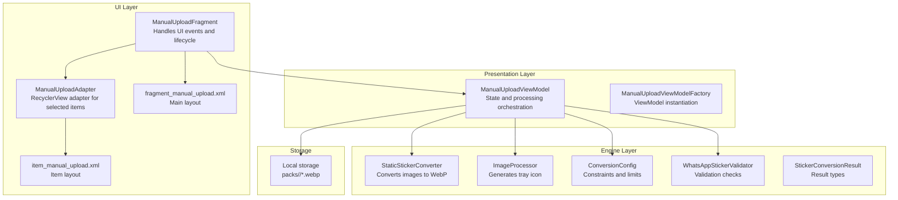
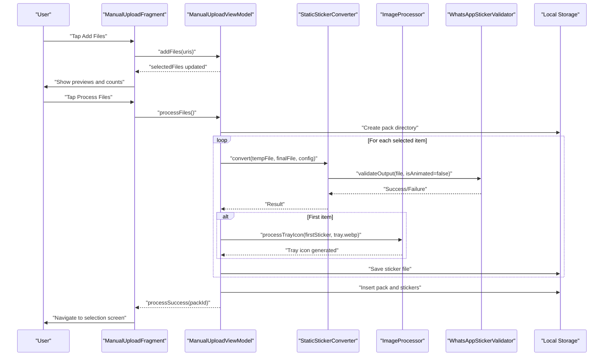
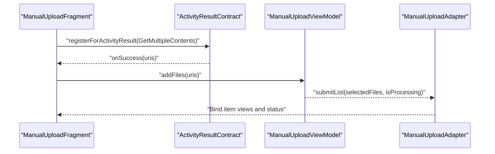
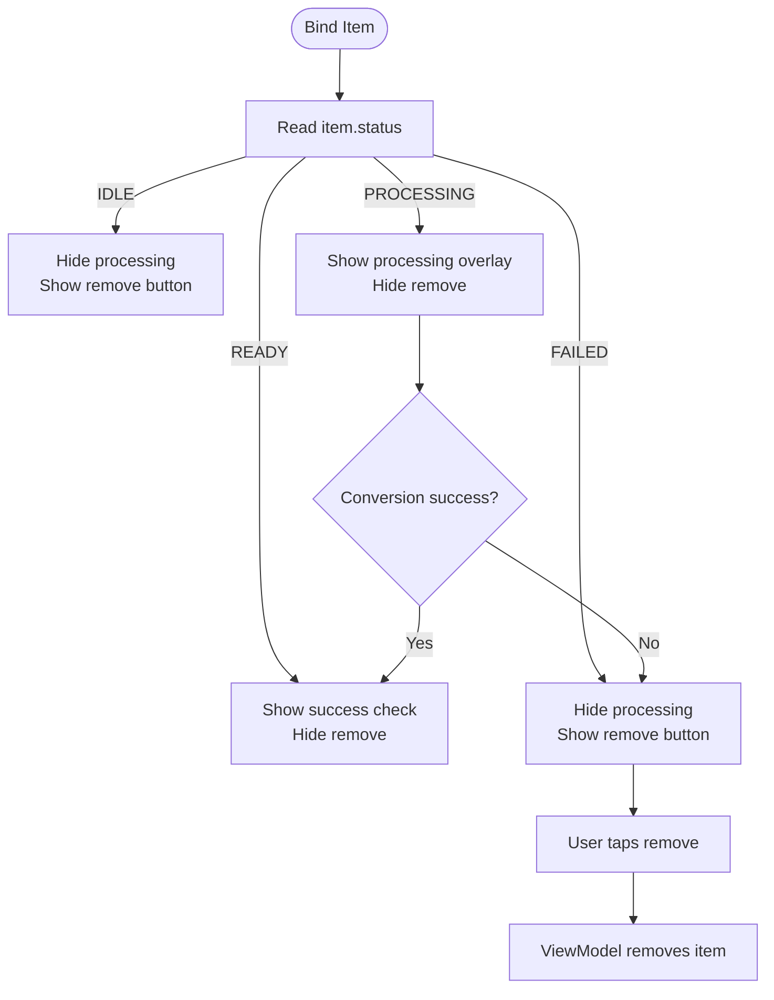
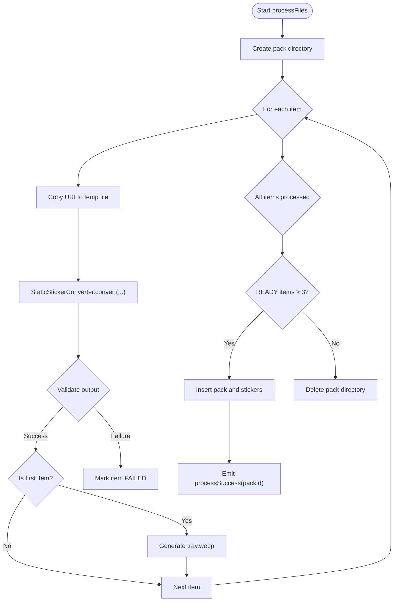
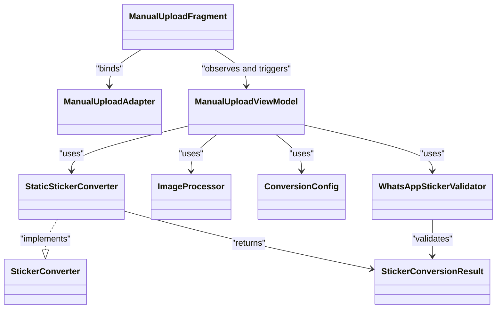

# Manual Upload Functionality

<cite>
**Referenced Files in This Document**
- [ManualUploadFragment.kt](file://app/src/main/java/com/maheshsharan/tel2what/ui/manual/ManualUploadFragment.kt)
- [ManualUploadAdapter.kt](file://app/src/main/java/com/maheshsharan/tel2what/ui/manual/ManualUploadAdapter.kt)
- [ManualUploadViewModel.kt](file://app/src/main/java/com/maheshsharan/tel2what/ui/manual/ManualUploadViewModel.kt)
- [ManualUploadViewModelFactory.kt](file://app/src/main/java/com/maheshsharan/tel2what/ui/manual/ManualUploadViewModelFactory.kt)
- [ManualUploadItem.kt](file://app/src/main/java/com/maheshsharan/tel2what/ui/manual/ManualUploadItem.kt)
- [fragment_manual_upload.xml](file://app/src/main/res/layout/fragment_manual_upload.xml)
- [item_manual_upload.xml](file://app/src/main/res/layout/item_manual_upload.xml)
- [StaticStickerConverter.kt](file://app/src/main/java/com/maheshsharan/tel2what/engine/StaticStickerConverter.kt)
- [ImageProcessor.kt](file://app/src/main/java/com/maheshsharan/tel2what/utils/ImageProcessor.kt)
- [ConversionConfig.kt](file://app/src/main/java/com/maheshsharan/tel2what/engine/ConversionConfig.kt)
- [WhatsAppStickerValidator.kt](file://app/src/main/java/com/maheshsharan/tel2what/engine/WhatsAppStickerValidator.kt)
- [StickerConverter.kt](file://app/src/main/java/com/maheshsharan/tel2what/engine/StickerConverter.kt)
- [StickerConversionResult.kt](file://app/src/main/java/com/maheshsharan/tel2what/engine/StickerConversionResult.kt)
- [AndroidManifest.xml](file://app/src/main/AndroidManifest.xml)
</cite>

## Table of Contents
1. [Introduction](#introduction)
2. [Project Structure](#project-structure)
3. [Core Components](#core-components)
4. [Architecture Overview](#architecture-overview)
5. [Detailed Component Analysis](#detailed-component-analysis)
6. [Dependency Analysis](#dependency-analysis)
7. [Performance Considerations](#performance-considerations)
8. [Troubleshooting Guide](#troubleshooting-guide)
9. [Conclusion](#conclusion)
10. [Appendices](#appendices)

## Introduction
This document explains the manual upload functionality that enables users to import stickers from device storage. It covers the file picker implementation, supported file formats, validation processes, UI components (upload adapter, progress tracking, and error handling), and the end-to-end file processing pipeline from selection to database storage. It also documents size limits, quality considerations, and storage access patterns.

## Project Structure
The manual upload feature is implemented as a cohesive module under the manual package, with UI fragments, adapters, view models, and conversion engines working together. The UI layouts define the user-facing controls, while the engine handles conversion and validation.

**Diagram sources**
- [ManualUploadFragment.kt](file://app/src/main/java/com/maheshsharan/tel2what/ui/manual/ManualUploadFragment.kt#L23-L111)
- [ManualUploadAdapter.kt](file://app/src/main/java/com/maheshsharan/tel2what/ui/manual/ManualUploadAdapter.kt#L13-L83)
- [ManualUploadViewModel.kt](file://app/src/main/java/com/maheshsharan/tel2what/ui/manual/ManualUploadViewModel.kt#L33-L181)
- [StaticStickerConverter.kt](file://app/src/main/java/com/maheshsharan/tel2what/engine/StaticStickerConverter.kt#L15-L94)
- [ImageProcessor.kt](file://app/src/main/java/com/maheshsharan/tel2what/utils/ImageProcessor.kt#L9-L68)
- [ConversionConfig.kt](file://app/src/main/java/com/maheshsharan/tel2what/engine/ConversionConfig.kt#L3-L13)
- [WhatsAppStickerValidator.kt](file://app/src/main/java/com/maheshsharan/tel2what/engine/WhatsAppStickerValidator.kt#L7-L72)
- [StickerConversionResult.kt](file://app/src/main/java/com/maheshsharan/tel2what/engine/StickerConversionResult.kt#L5-L23)

**Section sources**
- [ManualUploadFragment.kt](file://app/src/main/java/com/maheshsharan/tel2what/ui/manual/ManualUploadFragment.kt#L23-L111)
- [fragment_manual_upload.xml](file://app/src/main/res/layout/fragment_manual_upload.xml#L1-L164)

## Core Components
- ManualUploadFragment: Hosts the UI, registers the file picker, binds the adapter, observes state flows, and navigates on success.
- ManualUploadAdapter: Displays selected items with status indicators and removal actions.
- ManualUploadViewModel: Manages selected files, orchestrates conversion, updates statuses, persists packs and stickers, and emits success signals.
- StaticStickerConverter: Converts static images to WhatsApp-compliant WebP with size and dimension constraints.
- ImageProcessor: Generates a tray icon from the first processed sticker.
- ConversionConfig: Centralizes constraints (dimensions, sizes, durations).
- WhatsAppStickerValidator: Validates output files against WhatsApp requirements.
- Layouts: Provide the visual structure for selection, preview, and action buttons.

**Section sources**
- [ManualUploadFragment.kt](file://app/src/main/java/com/maheshsharan/tel2what/ui/manual/ManualUploadFragment.kt#L23-L111)
- [ManualUploadAdapter.kt](file://app/src/main/java/com/maheshsharan/tel2what/ui/manual/ManualUploadAdapter.kt#L13-L83)
- [ManualUploadViewModel.kt](file://app/src/main/java/com/maheshsharan/tel2what/ui/manual/ManualUploadViewModel.kt#L33-L181)
- [StaticStickerConverter.kt](file://app/src/main/java/com/maheshsharan/tel2what/engine/StaticStickerConverter.kt#L15-L94)
- [ImageProcessor.kt](file://app/src/main/java/com/maheshsharan/tel2what/utils/ImageProcessor.kt#L9-L68)
- [ConversionConfig.kt](file://app/src/main/java/com/maheshsharan/tel2what/engine/ConversionConfig.kt#L3-L13)
- [WhatsAppStickerValidator.kt](file://app/src/main/java/com/maheshsharan/tel2what/engine/WhatsAppStickerValidator.kt#L7-L72)
- [fragment_manual_upload.xml](file://app/src/main/res/layout/fragment_manual_upload.xml#L1-L164)
- [item_manual_upload.xml](file://app/src/main/res/layout/item_manual_upload.xml#L1-L64)

## Architecture Overview
The manual upload flow integrates UI, presentation, and engine layers. Users pick images via the system picker, the adapter previews selections, the view model converts each file to WebP, generates a tray icon, and persists the pack and stickers to local storage.

**Diagram sources**
- [ManualUploadFragment.kt](file://app/src/main/java/com/maheshsharan/tel2what/ui/manual/ManualUploadFragment.kt#L28-L108)
- [ManualUploadViewModel.kt](file://app/src/main/java/com/maheshsharan/tel2what/ui/manual/ManualUploadViewModel.kt#L64-L156)
- [StaticStickerConverter.kt](file://app/src/main/java/com/maheshsharan/tel2what/engine/StaticStickerConverter.kt#L17-L84)
- [ImageProcessor.kt](file://app/src/main/java/com/maheshsharan/tel2what/utils/ImageProcessor.kt#L17-L62)
- [WhatsAppStickerValidator.kt](file://app/src/main/java/com/maheshsharan/tel2what/engine/WhatsAppStickerValidator.kt#L14-L70)

## Detailed Component Analysis

### File Picker and Selection
- The fragment registers a multi-file picker contract targeting MIME type "image/*".
- Selected URIs are passed to the view model, which enforces a maximum of 30 files.
- The adapter displays thumbnails using a content URI loader and updates UI states based on item status.

**Diagram sources**
- [ManualUploadFragment.kt](file://app/src/main/java/com/maheshsharan/tel2what/ui/manual/ManualUploadFragment.kt#L28-L32)
- [ManualUploadAdapter.kt](file://app/src/main/java/com/maheshsharan/tel2what/ui/manual/ManualUploadAdapter.kt#L20-L36)

**Section sources**
- [ManualUploadFragment.kt](file://app/src/main/java/com/maheshsharan/tel2what/ui/manual/ManualUploadFragment.kt#L28-L32)
- [ManualUploadAdapter.kt](file://app/src/main/java/com/maheshsharan/tel2what/ui/manual/ManualUploadAdapter.kt#L20-L36)
- [fragment_manual_upload.xml](file://app/src/main/res/layout/fragment_manual_upload.xml#L64-L104)

### Supported File Formats and Validation
- Supported formats for manual upload: JPG, PNG, WEBP, and GIF. The picker targets "image/*", which broadly includes these formats.
- Static images are converted to WebP using StaticStickerConverter with strict constraints:
  - Target dimensions: 512x512 pixels with transparent padding.
  - Maximum static file size: 100 KB.
  - Iterative lossy compression reduces file size until under the limit.
- Validation ensures:
  - Exact 512x512 dimensions.
  - File size under configured limits.
  - Animated outputs validated similarly with a 500 KB cap.

Practical examples:
- Static images: JPG/PNG/WEBP are resized proportionally and centered on a 512x512 canvas; compressed iteratively to meet the 100 KB limit.
- GIFs: Converted to static WebP using the same pipeline; animated WebP conversion is handled by the animated pipeline elsewhere.

Quality considerations:
- Compression quality is reduced iteratively to meet size targets.
- Trimming to exact dimensions prevents oversize outputs.

**Section sources**
- [fragment_manual_upload.xml](file://app/src/main/res/layout/fragment_manual_upload.xml#L100-L102)
- [StaticStickerConverter.kt](file://app/src/main/java/com/maheshsharan/tel2what/engine/StaticStickerConverter.kt#L33-L84)
- [ConversionConfig.kt](file://app/src/main/java/com/maheshsharan/tel2what/engine/ConversionConfig.kt#L6-L12)
- [WhatsAppStickerValidator.kt](file://app/src/main/java/com/maheshsharan/tel2what/engine/WhatsAppStickerValidator.kt#L25-L40)

### UI Components: Adapter, Progress Tracking, and Error Handling
- Adapter:
  - Displays thumbnails for each selected item.
  - Shows a processing overlay during conversion.
  - Indicates success with a checkmark.
  - Allows removing failed or unwanted items.
- Progress tracking:
  - Global processing flag disables add/clear actions and updates button states.
  - Per-item status transitions: IDLE → PROCESSING → READY or FAILED.
- Error handling:
  - Items marked FAILED remain removable.
  - Partial failures prevent pack creation; partial successes trigger persistence of READY items.

**Diagram sources**
- [ManualUploadAdapter.kt](file://app/src/main/java/com/maheshsharan/tel2what/ui/manual/ManualUploadAdapter.kt#L48-L79)

**Section sources**
- [ManualUploadAdapter.kt](file://app/src/main/java/com/maheshsharan/tel2what/ui/manual/ManualUploadAdapter.kt#L13-L83)
- [item_manual_upload.xml](file://app/src/main/res/layout/item_manual_upload.xml#L26-L51)

### File Processing Pipeline: From Selection to Storage
- Directory creation: A unique pack directory is created under app files/packs/<packId>.
- Conversion loop:
  - Each selected item is copied to a temporary cache file.
  - StaticStickerConverter produces a WebP under 100 KB.
  - First successful item generates tray.webp via ImageProcessor.
  - Final paths are recorded per item.
- Persistence:
  - A pack entity is inserted with tray icon path and metadata.
  - Sticker entities are inserted with emoji and accessibility metadata.
- Success condition:
  - At least three READY items are required to persist the pack.

**Diagram sources**
- [ManualUploadViewModel.kt](file://app/src/main/java/com/maheshsharan/tel2what/ui/manual/ManualUploadViewModel.kt#L64-L156)
- [StaticStickerConverter.kt](file://app/src/main/java/com/maheshsharan/tel2what/engine/StaticStickerConverter.kt#L17-L84)
- [ImageProcessor.kt](file://app/src/main/java/com/maheshsharan/tel2what/utils/ImageProcessor.kt#L17-L62)

**Section sources**
- [ManualUploadViewModel.kt](file://app/src/main/java/com/maheshsharan/tel2what/ui/manual/ManualUploadViewModel.kt#L64-L156)

### Permissions and Storage Access Patterns
- Manifest permissions:
  - INTERNET and ACCESS_NETWORK_STATE are declared for network operations.
  - A ContentProvider is exported with read permission for WhatsApp sticker reading.
- Storage access:
  - The app writes pack files under its internal files directory (packs/<packId>).
  - Temporary cache files are used during conversion and deleted afterward.
  - No external storage permissions are required for manual uploads.

**Section sources**
- [AndroidManifest.xml](file://app/src/main/AndroidManifest.xml#L3-L9)
- [AndroidManifest.xml](file://app/src/main/AndroidManifest.xml#L19-L25)
- [ManualUploadViewModel.kt](file://app/src/main/java/com/maheshsharan/tel2what/ui/manual/ManualUploadViewModel.kt#L70-L101)

## Dependency Analysis
The manual upload module exhibits clear separation of concerns:
- UI depends on ViewModel for state and actions.
- ViewModel depends on converters, validators, and storage.
- Engine components encapsulate conversion logic and validation.

**Diagram sources**
- [ManualUploadFragment.kt](file://app/src/main/java/com/maheshsharan/tel2what/ui/manual/ManualUploadFragment.kt#L23-L111)
- [ManualUploadAdapter.kt](file://app/src/main/java/com/maheshsharan/tel2what/ui/manual/ManualUploadAdapter.kt#L13-L83)
- [ManualUploadViewModel.kt](file://app/src/main/java/com/maheshsharan/tel2what/ui/manual/ManualUploadViewModel.kt#L33-L181)
- [StaticStickerConverter.kt](file://app/src/main/java/com/maheshsharan/tel2what/engine/StaticStickerConverter.kt#L15-L94)
- [ImageProcessor.kt](file://app/src/main/java/com/maheshsharan/tel2what/utils/ImageProcessor.kt#L9-L68)
- [ConversionConfig.kt](file://app/src/main/java/com/maheshsharan/tel2what/engine/ConversionConfig.kt#L3-L13)
- [WhatsAppStickerValidator.kt](file://app/src/main/java/com/maheshsharan/tel2what/engine/WhatsAppStickerValidator.kt#L7-L72)
- [StickerConverter.kt](file://app/src/main/java/com/maheshsharan/tel2what/engine/StickerConverter.kt#L5-L19)
- [StickerConversionResult.kt](file://app/src/main/java/com/maheshsharan/tel2what/engine/StickerConversionResult.kt#L5-L23)

**Section sources**
- [ManualUploadViewModel.kt](file://app/src/main/java/com/maheshsharan/tel2what/ui/manual/ManualUploadViewModel.kt#L33-L181)

## Performance Considerations
- Concurrency: Each item conversion runs concurrently using async/awaitAll, improving throughput for batches.
- Compression loop: Static conversion uses iterative compression to meet size targets efficiently.
- Memory management: Bitmaps are recycled after use to reduce GC pressure.
- Early termination: If fewer than three items succeed, the pack is not persisted, avoiding wasted work.

[No sources needed since this section provides general guidance]

## Troubleshooting Guide
Common issues and resolutions:
- Conversion fails due to size or dimension:
  - Verify the input image meets the 512x512 requirement and is under 100 KB after compression.
  - Check logs emitted by the validator for exact reasons.
- Empty or invalid output:
  - Ensure the converter produced a non-empty file and that validation passes.
- Not enough stickers:
  - At least three stickers must succeed for the pack to be created.
- Removal of failed items:
  - Use the remove button in the item view to clear failed entries.

**Section sources**
- [WhatsAppStickerValidator.kt](file://app/src/main/java/com/maheshsharan/tel2what/engine/WhatsAppStickerValidator.kt#L19-L40)
- [ManualUploadAdapter.kt](file://app/src/main/java/com/maheshsharan/tel2what/ui/manual/ManualUploadAdapter.kt#L69-L75)
- [ManualUploadViewModel.kt](file://app/src/main/java/com/maheshsharan/tel2what/ui/manual/ManualUploadViewModel.kt#L147-L154)

## Conclusion
The manual upload feature provides a streamlined path for importing stickers from device storage. It leverages a responsive UI, robust conversion and validation logic, and safe storage patterns to deliver a reliable user experience. By enforcing strict constraints and offering clear feedback, it ensures generated packs meet WhatsApp requirements.

[No sources needed since this section summarizes without analyzing specific files]

## Appendices

### Practical Examples and Constraints
- Supported formats: JPG, PNG, WEBP, GIF (picked via "image/*").
- Limits:
  - Static WebP: up to 100 KB.
  - Tray icon: up to 50 KB, exactly 96x96.
  - Minimum successful items: 3 for pack creation.
- Quality:
  - Iterative compression to meet size targets.
  - Exact 512x512 canvas with transparent padding.

**Section sources**
- [fragment_manual_upload.xml](file://app/src/main/res/layout/fragment_manual_upload.xml#L100-L102)
- [ConversionConfig.kt](file://app/src/main/java/com/maheshsharan/tel2what/engine/ConversionConfig.kt#L6-L12)
- [ImageProcessor.kt](file://app/src/main/java/com/maheshsharan/tel2what/utils/ImageProcessor.kt#L11-L12)
- [StaticStickerConverter.kt](file://app/src/main/java/com/maheshsharan/tel2what/engine/StaticStickerConverter.kt#L50-L72)