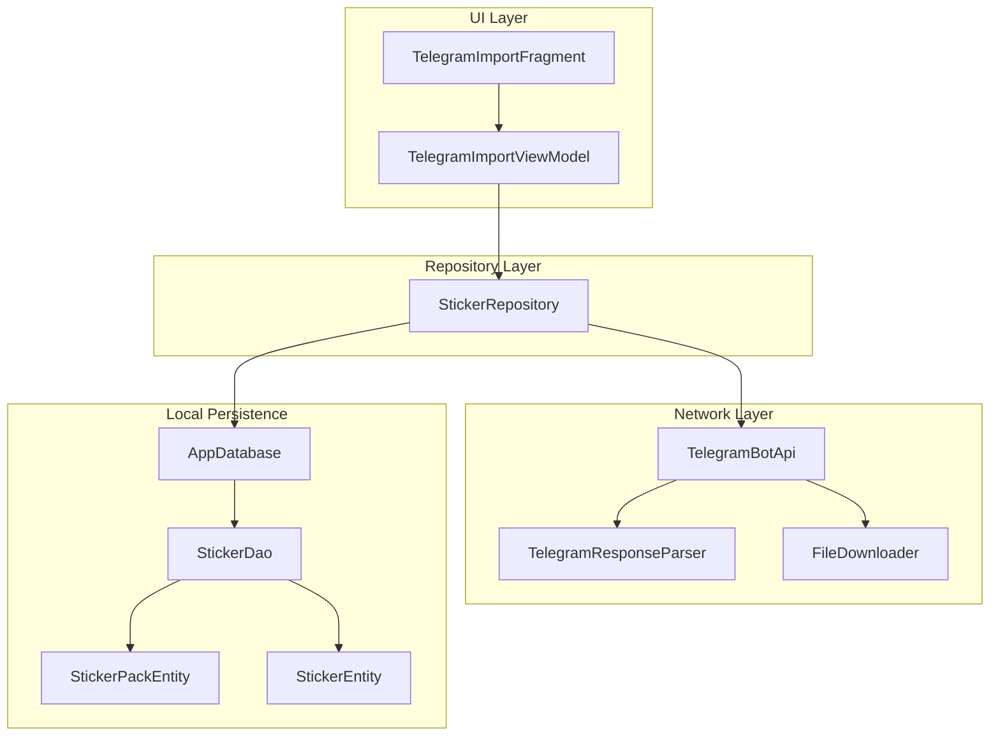
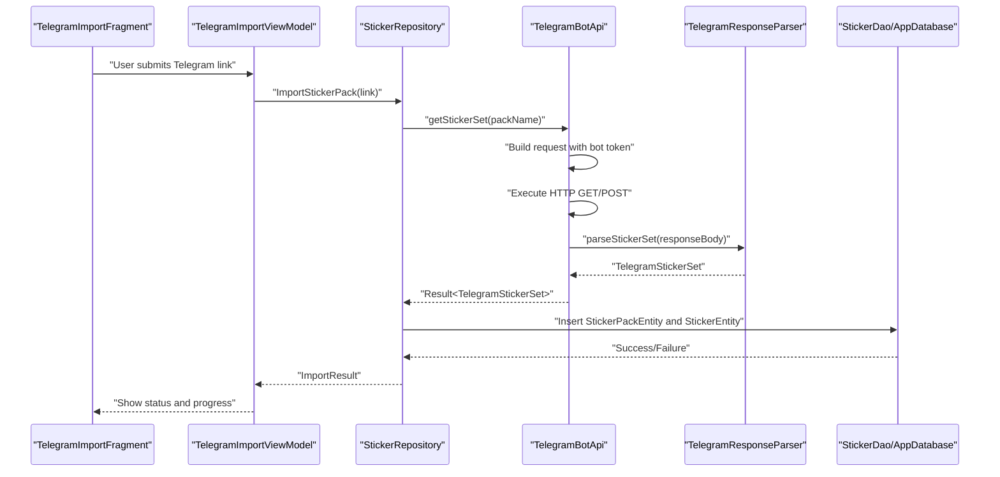
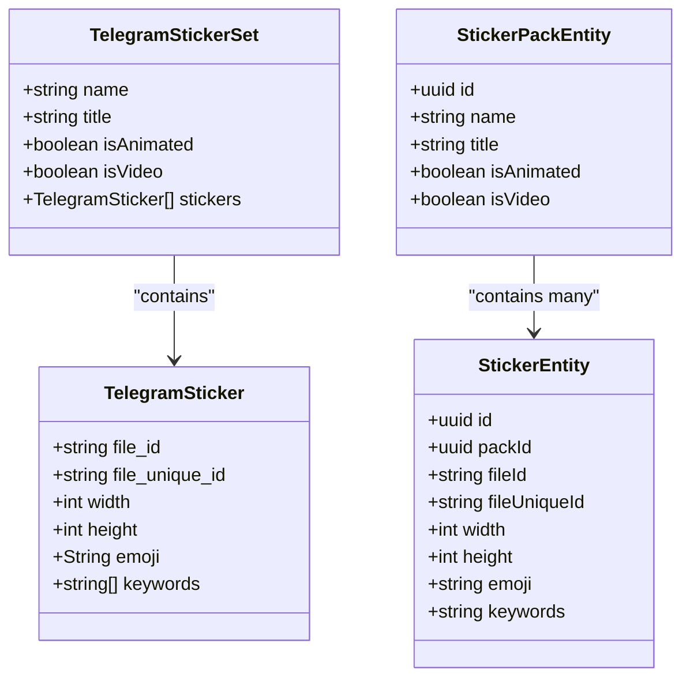
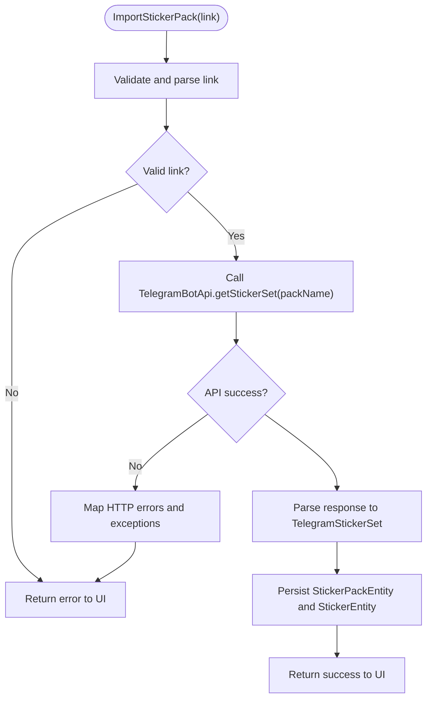
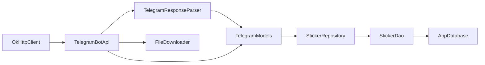

# Telegram Bot API Integration

<cite>
**Referenced Files in This Document**
- [TelegramBotApi.kt](file://app/src/main/java/com/maheshsharan/tel2what/data/network/TelegramBotApi.kt)
- [TelegramModels.kt](file://app/src/main/java/com/maheshsharan/tel2what/data/network/model/TelegramModels.kt)
- [TelegramResponseParser.kt](file://app/src/main/java/com/maheshsharan/tel2what/data/network/model/TelegramResponseParser.kt)
- [StickerRepository.kt](file://app/src/main/java/com/maheshsharan/tel2what/data/repository/StickerRepository.kt)
- [AppDatabase.kt](file://app/src/main/java/com/maheshsharan/tel2what/data/local/AppDatabase.kt)
- [StickerDao.kt](file://app/src/main/java/com/maheshsharan/tel2what/data/local/dao/StickerDao.kt)
- [StickerEntity.kt](file://app/src/main/java/com/maheshsharan/tel2what/data/local/entity/StickerEntity.kt)
- [StickerPackEntity.kt](file://app/src/main/java/com/maheshsharan/tel2what/data/local/entity/StickerPackEntity.kt)
- [FileDownloader.kt](file://app/src/main/java/com/maheshsharan/tel2what/data/network/FileDownloader.kt)
- [TelegramImportViewModel.kt](file://app/src/main/java/com/maheshsharan/tel2what/ui/importpack/TelegramImportViewModel.kt)
- [TelegramImportFragment.kt](file://app/src/main/java/com/maheshsharan/tel2what/ui/importpack/TelegramImportFragment.kt)
</cite>

## Table of Contents
1. [Introduction](#introduction)
2. [Project Structure](#project-structure)
3. [Core Components](#core-components)
4. [Architecture Overview](#architecture-overview)
5. [Detailed Component Analysis](#detailed-component-analysis)
6. [Dependency Analysis](#dependency-analysis)
7. [Performance Considerations](#performance-considerations)
8. [Troubleshooting Guide](#troubleshooting-guide)
9. [Conclusion](#conclusion)

## Introduction
This document explains the Telegram Bot API integration used to fetch and parse sticker pack metadata from Telegram. It covers the API endpoints, response parsing, the TelegramStickerSet model, mapping to local database entities, authentication, rate limiting considerations, error handling, URL parsing for extracting pack names from Telegram links, integration patterns with the repository layer, and network security considerations including offline fallback mechanisms.

## Project Structure
The Telegram Bot API integration is implemented within the data layer and integrates with the repository and local persistence layers. Key components include:
- Network layer: TelegramBotApi for HTTP requests and FileDownloader for file retrieval
- Parsing layer: TelegramResponseParser for JSON-to-model conversion
- Model layer: TelegramModels containing TelegramStickerSet and related structures
- Repository layer: StickerRepository orchestrating data flow between network and database
- Local persistence: Room entities and DAO for storing sticker packs and stickers
- UI layer: TelegramImportViewModel and TelegramImportFragment for user interaction

**Diagram sources**
- [TelegramBotApi.kt](file://app/src/main/java/com/maheshsharan/tel2what/data/network/TelegramBotApi.kt#L1-L112)
- [TelegramResponseParser.kt](file://app/src/main/java/com/maheshsharan/tel2what/data/network/model/TelegramResponseParser.kt)
- [FileDownloader.kt](file://app/src/main/java/com/maheshsharan/tel2what/data/network/FileDownloader.kt)
- [StickerRepository.kt](file://app/src/main/java/com/maheshsharan/tel2what/data/repository/StickerRepository.kt)
- [AppDatabase.kt](file://app/src/main/java/com/maheshsharan/tel2what/data/local/AppDatabase.kt)
- [StickerDao.kt](file://app/src/main/java/com/maheshsharan/tel2what/data/local/dao/StickerDao.kt)
- [StickerPackEntity.kt](file://app/src/main/java/com/maheshsharan/tel2what/data/local/entity/StickerPackEntity.kt)
- [StickerEntity.kt](file://app/src/main/java/com/maheshsharan/tel2what/data/local/entity/StickerEntity.kt)

**Section sources**
- [TelegramBotApi.kt](file://app/src/main/java/com/maheshsharan/tel2what/data/network/TelegramBotApi.kt#L1-L112)
- [TelegramModels.kt](file://app/src/main/java/com/maheshsharan/tel2what/data/network/model/TelegramModels.kt)
- [TelegramResponseParser.kt](file://app/src/main/java/com/maheshsharan/tel2what/data/network/model/TelegramResponseParser.kt)
- [StickerRepository.kt](file://app/src/main/java/com/maheshsharan/tel2what/data/repository/StickerRepository.kt)
- [AppDatabase.kt](file://app/src/main/java/com/maheshsharan/tel2what/data/local/AppDatabase.kt)
- [StickerDao.kt](file://app/src/main/java/com/maheshsharan/tel2what/data/local/dao/StickerDao.kt)
- [StickerEntity.kt](file://app/src/main/java/com/maheshsharan/tel2what/data/local/entity/StickerEntity.kt)
- [StickerPackEntity.kt](file://app/src/main/java/com/maheshsharan/tel2what/data/local/entity/StickerPackEntity.kt)

## Core Components
- TelegramBotApi: Implements HTTP calls to Telegram Bot API endpoints, handles authentication via bot token, parses responses, and manages errors.
- TelegramResponseParser: Converts raw JSON responses into domain models (e.g., TelegramStickerSet).
- TelegramModels: Defines the TelegramStickerSet and related structures used for parsing and mapping to local entities.
- StickerRepository: Coordinates between network and database layers, orchestrating data retrieval and persistence.
- Local Database Entities: StickerPackEntity and StickerEntity represent persisted sticker pack and sticker data.
- FileDownloader: Handles downloading sticker files after retrieving file paths from Telegram.

Key responsibilities:
- Fetch sticker pack metadata via /getStickerSet
- Parse JSON responses into structured models
- Map models to local database entities
- Provide download URLs for sticker files
- Handle network errors and offline scenarios

**Section sources**
- [TelegramBotApi.kt](file://app/src/main/java/com/maheshsharan/tel2what/data/network/TelegramBotApi.kt#L14-L112)
- [TelegramResponseParser.kt](file://app/src/main/java/com/maheshsharan/tel2what/data/network/model/TelegramResponseParser.kt)
- [TelegramModels.kt](file://app/src/main/java/com/maheshsharan/tel2what/data/network/model/TelegramModels.kt)
- [StickerRepository.kt](file://app/src/main/java/com/maheshsharan/tel2what/data/repository/StickerRepository.kt)
- [StickerPackEntity.kt](file://app/src/main/java/com/maheshsharan/tel2what/data/local/entity/StickerPackEntity.kt)
- [StickerEntity.kt](file://app/src/main/java/com/maheshsharan/tel2what/data/local/entity/StickerEntity.kt)
- [FileDownloader.kt](file://app/src/main/java/com/maheshsharan/tel2what/data/network/FileDownloader.kt)

## Architecture Overview
The integration follows a layered architecture:
- UI triggers import actions
- ViewModel delegates to Repository
- Repository calls TelegramBotApi for metadata and FileDownloader for files
- Parser converts JSON to models
- Repository persists data to Room database via DAO
- UI observes repository state and updates views

**Diagram sources**
- [TelegramImportFragment.kt](file://app/src/main/java/com/maheshsharan/tel2what/ui/importpack/TelegramImportFragment.kt)
- [TelegramImportViewModel.kt](file://app/src/main/java/com/maheshsharan/tel2what/ui/importpack/TelegramImportViewModel.kt)
- [StickerRepository.kt](file://app/src/main/java/com/maheshsharan/tel2what/data/repository/StickerRepository.kt)
- [TelegramBotApi.kt](file://app/src/main/java/com/maheshsharan/tel2what/data/network/TelegramBotApi.kt#L22-L73)
- [TelegramResponseParser.kt](file://app/src/main/java/com/maheshsharan/tel2what/data/network/model/TelegramResponseParser.kt)
- [StickerDao.kt](file://app/src/main/java/com/maheshsharan/tel2what/data/local/dao/StickerDao.kt)
- [AppDatabase.kt](file://app/src/main/java/com/maheshsharan/tel2what/data/local/AppDatabase.kt)

## Detailed Component Analysis

### Telegram Bot API Endpoints and Authentication
- Endpoint: /getStickerSet
  - Method: POST
  - Headers: application/json; charset=utf-8
  - Body: {"name": "<packName>"}
  - Response: JSON containing sticker pack metadata and stickers
- Endpoint: /getFile
  - Method: GET
  - Query: file_id=<fileId>
  - Response: JSON containing file_path
- Authentication:
  - Uses a hardcoded bot token embedded in the client
  - All requests append the token to the base URL
- Rate Limiting:
  - No explicit rate limiting logic is implemented in the client
  - The application relies on Telegram's service limits and retries as needed

Practical considerations:
- Ensure the bot token is valid and configured properly
- Handle 401 Unauthorized and 404 Not Found responses appropriately
- Validate that the pack name corresponds to a public sticker set

**Section sources**
- [TelegramBotApi.kt](file://app/src/main/java/com/maheshsharan/tel2what/data/network/TelegramBotApi.kt#L22-L110)

### Response Parsing and TelegramStickerSet Model
- TelegramResponseParser extracts and validates fields from the JSON response
- TelegramStickerSet encapsulates the parsed data for downstream use
- The model includes fields such as pack name, sticker list, and metadata

Mapping to local database entities:
- StickerPackEntity stores the pack metadata (e.g., name, title)
- StickerEntity stores individual sticker details (e.g., file_id, emoji, keywords)
- Relationship: One-to-many between StickerPackEntity and StickerEntity

**Diagram sources**
- [TelegramModels.kt](file://app/src/main/java/com/maheshsharan/tel2what/data/network/model/TelegramModels.kt)
- [StickerPackEntity.kt](file://app/src/main/java/com/maheshsharan/tel2what/data/local/entity/StickerPackEntity.kt)
- [StickerEntity.kt](file://app/src/main/java/com/maheshsharan/tel2what/data/local/entity/StickerEntity.kt)

**Section sources**
- [TelegramResponseParser.kt](file://app/src/main/java/com/maheshsharan/tel2what/data/network/model/TelegramResponseParser.kt)
- [TelegramModels.kt](file://app/src/main/java/com/maheshsharan/tel2what/data/network/model/TelegramModels.kt)
- [StickerPackEntity.kt](file://app/src/main/java/com/maheshsharan/tel2what/data/local/entity/StickerPackEntity.kt)
- [StickerEntity.kt](file://app/src/main/java/com/maheshsharan/tel2what/data/local/entity/StickerEntity.kt)

### URL Parsing Logic for Extracting Pack Names
- The application expects a Telegram link pointing to a sticker pack
- The pack name is extracted from the link and passed to the /getStickerSet endpoint
- Typical link format: https://t.me/addstickers/<packName>
- Extraction pattern: Extract the last path segment after the domain

Integration pattern:
- ViewModel receives the link from the UI
- Repository parses the link and calls TelegramBotApi.getStickerSet
- On success, persist entities via DAO; on failure, surface user-friendly messages

**Section sources**
- [TelegramImportViewModel.kt](file://app/src/main/java/com/maheshsharan/tel2what/ui/importpack/TelegramImportViewModel.kt)
- [TelegramImportFragment.kt](file://app/src/main/java/com/maheshsharan/tel2what/ui/importpack/TelegramImportFragment.kt)

### Integration Patterns with the Repository Layer
- StickerRepository coordinates:
  - Link parsing and validation
  - Network calls to TelegramBotApi
  - Database persistence via StickerDao
  - Error propagation to UI
- Repository ensures:
  - Idempotent inserts for packs and stickers
  - Proper foreign key relationships between packs and stickers
  - Transaction boundaries for consistency

**Diagram sources**
- [StickerRepository.kt](file://app/src/main/java/com/maheshsharan/tel2what/data/repository/StickerRepository.kt)
- [TelegramBotApi.kt](file://app/src/main/java/com/maheshsharan/tel2what/data/network/TelegramBotApi.kt#L22-L73)
- [TelegramResponseParser.kt](file://app/src/main/java/com/maheshsharan/tel2what/data/network/model/TelegramResponseParser.kt)
- [StickerDao.kt](file://app/src/main/java/com/maheshsharan/tel2what/data/local/dao/StickerDao.kt)

**Section sources**
- [StickerRepository.kt](file://app/src/main/java/com/maheshsharan/tel2what/data/repository/StickerRepository.kt)
- [TelegramBotApi.kt](file://app/src/main/java/com/maheshsharan/tel2what/data/network/TelegramBotApi.kt#L22-L73)

### Network Security Considerations and Offline Fallback
- Security:
  - Bot token is embedded in the client; avoid exposing sensitive credentials
  - Prefer server-side proxy for production deployments
  - Validate and sanitize user-provided links before parsing
- Offline Fallback:
  - If network errors occur, return user-friendly messages
  - Allow retry attempts with exponential backoff
  - Cache recent successful imports to support limited offline viewing

**Section sources**
- [TelegramBotApi.kt](file://app/src/main/java/com/maheshsharan/tel2what/data/network/TelegramBotApi.kt#L67-L72)
- [TelegramBotApi.kt](file://app/src/main/java/com/maheshsharan/tel2what/data/network/TelegramBotApi.kt#L84-L105)

## Dependency Analysis
The Telegram integration depends on:
- OkHttp for HTTP communication
- JSON parsing utilities for response handling
- Room for local persistence
- ViewModel and Fragment for UI orchestration

**Diagram sources**
- [TelegramBotApi.kt](file://app/src/main/java/com/maheshsharan/tel2what/data/network/TelegramBotApi.kt#L1-L112)
- [TelegramResponseParser.kt](file://app/src/main/java/com/maheshsharan/tel2what/data/network/model/TelegramResponseParser.kt)
- [TelegramModels.kt](file://app/src/main/java/com/maheshsharan/tel2what/data/network/model/TelegramModels.kt)
- [FileDownloader.kt](file://app/src/main/java/com/maheshsharan/tel2what/data/network/FileDownloader.kt)
- [StickerRepository.kt](file://app/src/main/java/com/maheshsharan/tel2what/data/repository/StickerRepository.kt)
- [StickerDao.kt](file://app/src/main/java/com/maheshsharan/tel2what/data/local/dao/StickerDao.kt)
- [AppDatabase.kt](file://app/src/main/java/com/maheshsharan/tel2what/data/local/AppDatabase.kt)

**Section sources**
- [TelegramBotApi.kt](file://app/src/main/java/com/maheshsharan/tel2what/data/network/TelegramBotApi.kt#L1-L112)
- [TelegramResponseParser.kt](file://app/src/main/java/com/maheshsharan/tel2what/data/network/model/TelegramResponseParser.kt)
- [TelegramModels.kt](file://app/src/main/java/com/maheshsharan/tel2what/data/network/model/TelegramModels.kt)
- [FileDownloader.kt](file://app/src/main/java/com/maheshsharan/tel2what/data/network/FileDownloader.kt)
- [StickerRepository.kt](file://app/src/main/java/com/maheshsharan/tel2what/data/repository/StickerRepository.kt)
- [StickerDao.kt](file://app/src/main/java/com/maheshsharan/tel2what/data/local/dao/StickerDao.kt)
- [AppDatabase.kt](file://app/src/main/java/com/maheshsharan/tel2what/data/local/AppDatabase.kt)

## Performance Considerations
- Concurrency: Network calls are executed on Dispatchers.IO to avoid blocking the main thread
- Caching: Reuse OkHttpClient instances and consider adding response caching for repeated queries
- Batch Operations: Persist multiple stickers in transactions to reduce overhead
- Throttling: Implement retry logic with exponential backoff for transient failures
- Memory: Avoid loading large sticker files into memory; stream or cache files as needed

[No sources needed since this section provides general guidance]

## Troubleshooting Guide
Common issues and resolutions:
- Invalid Bot Token (HTTP 401):
  - Verify the token is correct and configured
  - Replace the hardcoded token with a valid one
- Sticker Pack Not Found (HTTP 400 with "sticker set not found"):
  - Confirm the pack name is correct and the pack is public
- Unknown Host Exception:
  - Check device connectivity and network permissions
- General Network Errors:
  - Retry with backoff; log detailed error messages for diagnostics

**Section sources**
- [TelegramBotApi.kt](file://app/src/main/java/com/maheshsharan/tel2what/data/network/TelegramBotApi.kt#L34-L72)
- [TelegramBotApi.kt](file://app/src/main/java/com/maheshsharan/tel2what/data/network/TelegramBotApi.kt#L84-L105)

## Conclusion
The Telegram Bot API integration provides a robust mechanism to fetch and parse sticker pack metadata, map it to local database entities, and support file downloads. By following the outlined patterns for authentication, error handling, and offline fallback, the integration remains resilient and user-friendly. For production deployments, consider moving the bot token to a secure backend and implementing additional safeguards for reliability and security.