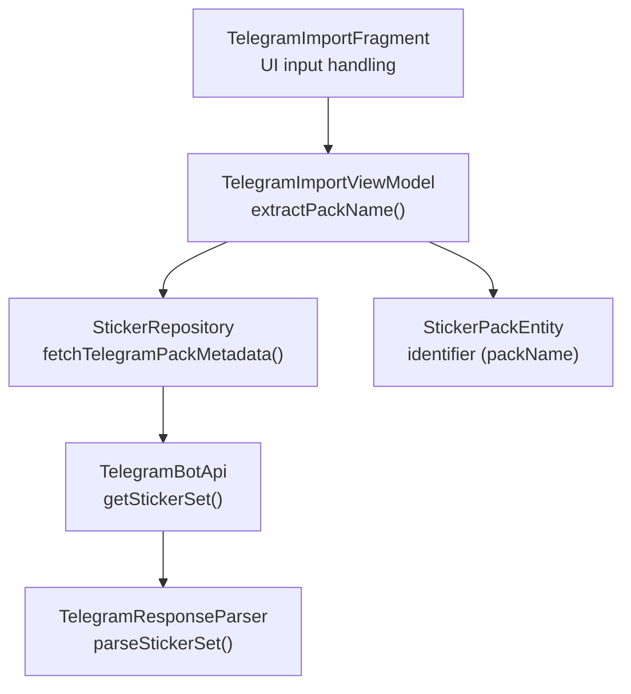
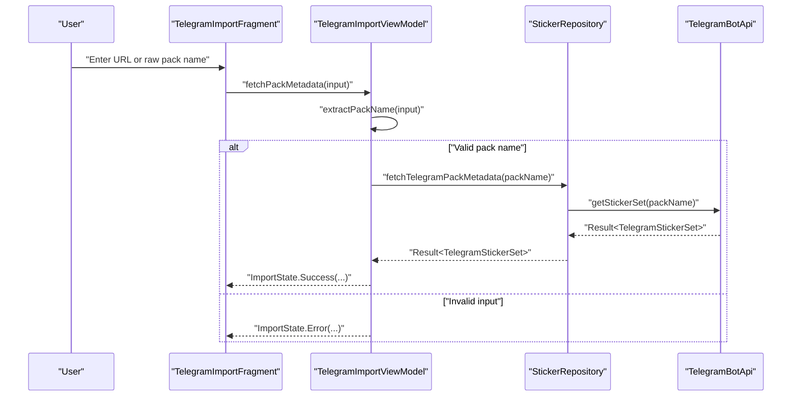
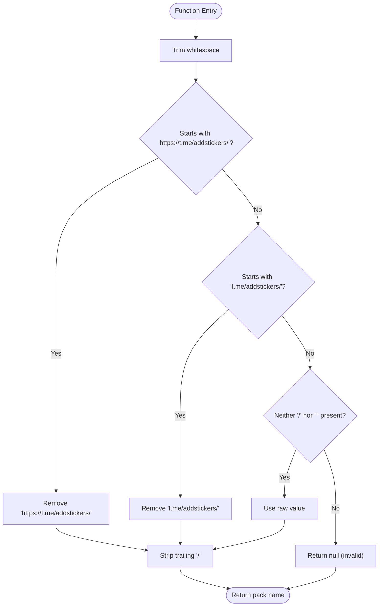
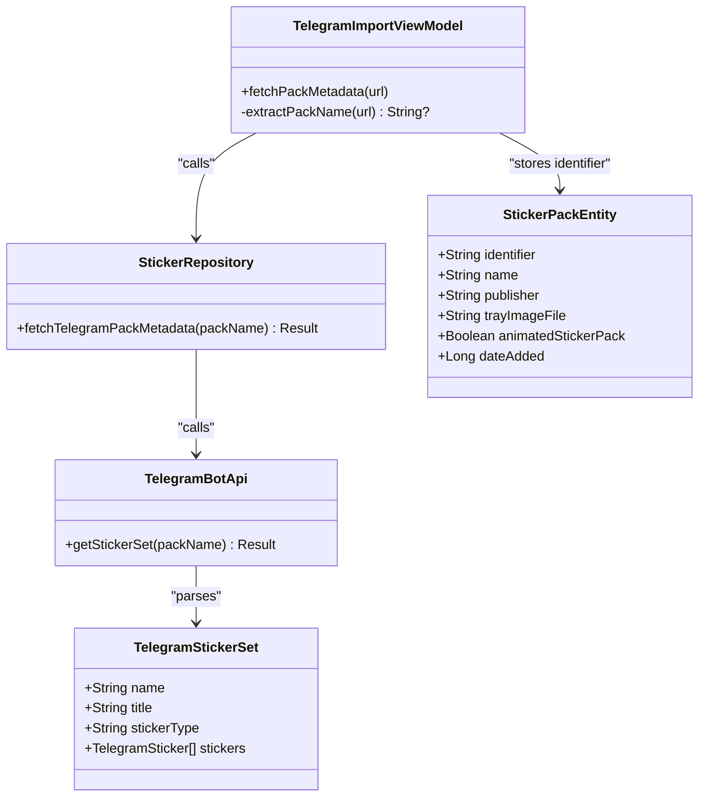
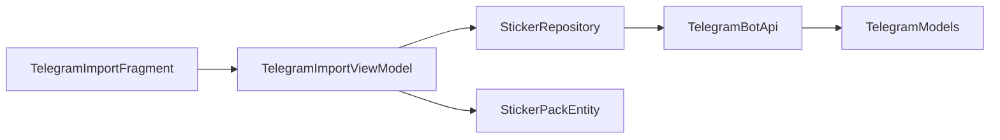

# URL Parsing and Validation

<cite>
**Referenced Files in This Document**
- [TelegramImportViewModel.kt](file://app/src/main/java/com/maheshsharan/tel2what/ui/importpack/TelegramImportViewModel.kt)
- [TelegramImportFragment.kt](file://app/src/main/java/com/maheshsharan/tel2what/ui/importpack/TelegramImportFragment.kt)
- [fragment_telegram_import.xml](file://app/src/main/res/layout/fragment_telegram_import.xml)
- [TelegramBotApi.kt](file://app/src/main/java/com/maheshsharan/tel2what/data/network/TelegramBotApi.kt)
- [StickerRepository.kt](file://app/src/main/java/com/maheshsharan/tel2what/data/repository/StickerRepository.kt)
- [StickerPackEntity.kt](file://app/src/main/java/com/maheshsharan/tel2what/data/local/entity/StickerPackEntity.kt)
- [TelegramModels.kt](file://app/src/main/java/com/maheshsharan/tel2what/data/network/model/TelegramModels.kt)
</cite>

## Table of Contents
1. [Introduction](#introduction)
2. [Project Structure](#project-structure)
3. [Core Components](#core-components)
4. [Architecture Overview](#architecture-overview)
5. [Detailed Component Analysis](#detailed-component-analysis)
6. [Dependency Analysis](#dependency-analysis)
7. [Performance Considerations](#performance-considerations)
8. [Troubleshooting Guide](#troubleshooting-guide)
9. [Conclusion](#conclusion)

## Introduction
This document explains the URL parsing and validation logic used to extract Telegram sticker pack identifiers from various input formats. It focuses on the extractPackName function, detailing support for:
- Full HTTPS URLs: https://t.me/addstickers/<packName>
- Shortened URLs: t.me/addstickers/<packName>
- Raw pack names: <packName> (without slashes or spaces)

It also documents trimming, suffix normalization, validation rules, error handling, and practical examples. Internationalization and special character handling considerations are addressed.

## Project Structure
The URL parsing and validation logic resides in the import pack UI module and integrates with the repository and network layers.

**Diagram sources**
- [TelegramImportFragment.kt](file://app/src/main/java/com/maheshsharan/tel2what/ui/importpack/TelegramImportFragment.kt#L25-L154)
- [TelegramImportViewModel.kt](file://app/src/main/java/com/maheshsharan/tel2what/ui/importpack/TelegramImportViewModel.kt#L25-L94)
- [StickerRepository.kt](file://app/src/main/java/com/maheshsharan/tel2what/data/repository/StickerRepository.kt#L24-L24)
- [TelegramBotApi.kt](file://app/src/main/java/com/maheshsharan/tel2what/data/network/TelegramBotApi.kt#L22-L73)
- [TelegramModels.kt](file://app/src/main/java/com/maheshsharan/tel2what/data/network/model/TelegramModels.kt#L22-L60)
- [StickerPackEntity.kt](file://app/src/main/java/com/maheshsharan/tel2what/data/local/entity/StickerPackEntity.kt#L7-L8)

**Section sources**
- [TelegramImportFragment.kt](file://app/src/main/java/com/maheshsharan/tel2what/ui/importpack/TelegramImportFragment.kt#L25-L154)
- [TelegramImportViewModel.kt](file://app/src/main/java/com/maheshsharan/tel2what/ui/importpack/TelegramImportViewModel.kt#L25-L94)
- [StickerRepository.kt](file://app/src/main/java/com/maheshsharan/tel2what/data/repository/StickerRepository.kt#L24-L24)
- [TelegramBotApi.kt](file://app/src/main/java/com/maheshsharan/tel2what/data/network/TelegramBotApi.kt#L22-L73)
- [TelegramModels.kt](file://app/src/main/java/com/maheshsharan/tel2what/data/network/model/TelegramModels.kt#L22-L60)
- [StickerPackEntity.kt](file://app/src/main/java/com/maheshsharan/tel2what/data/local/entity/StickerPackEntity.kt#L7-L8)

## Core Components
- extractPackName: Parses and validates the input string to produce a clean Telegram sticker pack identifier.
- UI layer: Provides input via a text field and displays validation errors.
- Repository and API: Fetch metadata using the validated pack identifier.

Key behaviors:
- Trims leading/trailing whitespace.
- Accepts both https://t.me/addstickers/ and t.me/addstickers/ prefixes.
- Allows raw pack names if they contain neither slashes nor spaces.
- Removes trailing slash from extracted pack names.
- Returns null for invalid inputs, triggering error handling.

**Section sources**
- [TelegramImportViewModel.kt](file://app/src/main/java/com/maheshsharan/tel2what/ui/importpack/TelegramImportViewModel.kt#L68-L93)
- [fragment_telegram_import.xml](file://app/src/main/res/layout/fragment_telegram_import.xml#L100-L107)
- [TelegramImportFragment.kt](file://app/src/main/java/com/maheshsharan/tel2what/ui/importpack/TelegramImportFragment.kt#L71-L91)

## Architecture Overview
The flow from user input to validated pack identifier and subsequent metadata retrieval:

**Diagram sources**
- [TelegramImportFragment.kt](file://app/src/main/java/com/maheshsharan/tel2what/ui/importpack/TelegramImportFragment.kt#L71-L91)
- [TelegramImportViewModel.kt](file://app/src/main/java/com/maheshsharan/tel2what/ui/importpack/TelegramImportViewModel.kt#L30-L66)
- [StickerRepository.kt](file://app/src/main/java/com/maheshsharan/tel2what/data/repository/StickerRepository.kt#L24-L24)
- [TelegramBotApi.kt](file://app/src/main/java/com/maheshsharan/tel2what/data/network/TelegramBotApi.kt#L22-L73)

## Detailed Component Analysis

### extractPackName Function
Purpose: Extract and normalize a Telegram sticker pack identifier from diverse user inputs.

Behavior summary:
- Trim whitespace.
- Detect and remove supported prefixes (HTTPS and short).
- Allow raw pack names only if they do not contain "/" or " ".
- Strip trailing slash.
- Return null for invalid inputs.

Validation rules:
- Must start with a supported prefix or be a raw pack name without "/" or " ".
- After normalization, the resulting string is used as the pack identifier.

Error handling:
- Invalid inputs lead to a null result, which the caller interprets as an error state.

Practical examples:
- Supported inputs:
  - https://t.me/addstickers/MyPack
  - t.me/addstickers/MyPack
  - MyPack
- Edge cases:
  - https://t.me/addstickers/MyPack/ → normalized to MyPack
  - t.me/addstickers/MyPack/ → normalized to MyPack
  - My/Pack → rejected (contains "/")
  - My Pack → rejected (contains " ")

Internationalization and special characters:
- The function does not enforce Unicode restrictions; it accepts any non-empty string after trimming and normalization.
- Special characters and non-Latin scripts are preserved as-is, provided the input passes the basic validation rules.

**Diagram sources**
- [TelegramImportViewModel.kt](file://app/src/main/java/com/maheshsharan/tel2what/ui/importpack/TelegramImportViewModel.kt#L68-L93)

**Section sources**
- [TelegramImportViewModel.kt](file://app/src/main/java/com/maheshsharan/tel2what/ui/importpack/TelegramImportViewModel.kt#L68-L93)

### UI Integration and Error Presentation
- Input field hint indicates expected format and uses URI input type.
- On focus loss or action click, the ViewModel is invoked with the current text.
- Errors are surfaced via ImportState.Error and displayed as form errors.

Examples of supported formats in UI:
- Full HTTPS URL
- Short URL
- Raw pack name

Error messages:
- Invalid Telegram Sticker Link. Must be https://t.me/addstickers/...
- This sticker pack is empty. It has 0 stickers.
- Failed to fetch pack. Unknown error.

**Section sources**
- [fragment_telegram_import.xml](file://app/src/main/res/layout/fragment_telegram_import.xml#L100-L107)
- [TelegramImportFragment.kt](file://app/src/main/java/com/maheshsharan/tel2what/ui/importpack/TelegramImportFragment.kt#L71-L91)
- [TelegramImportViewModel.kt](file://app/src/main/java/com/maheshsharan/tel2what/ui/importpack/TelegramImportViewModel.kt#L30-L66)

### Network and Data Model Integration
- The validated pack identifier is passed to the repository, which calls the Telegram API.
- The API response is parsed into a TelegramStickerSet model.
- The identifier is stored as the primary key for the sticker pack entity.

**Diagram sources**
- [TelegramImportViewModel.kt](file://app/src/main/java/com/maheshsharan/tel2what/ui/importpack/TelegramImportViewModel.kt#L25-L94)
- [StickerRepository.kt](file://app/src/main/java/com/maheshsharan/tel2what/data/repository/StickerRepository.kt#L24-L24)
- [TelegramBotApi.kt](file://app/src/main/java/com/maheshsharan/tel2what/data/network/TelegramBotApi.kt#L22-L73)
- [TelegramModels.kt](file://app/src/main/java/com/maheshsharan/tel2what/data/network/model/TelegramModels.kt#L15-L20)
- [StickerPackEntity.kt](file://app/src/main/java/com/maheshsharan/tel2what/data/local/entity/StickerPackEntity.kt#L7-L8)

**Section sources**
- [TelegramImportViewModel.kt](file://app/src/main/java/com/maheshsharan/tel2what/ui/importpack/TelegramImportViewModel.kt#L25-L94)
- [StickerRepository.kt](file://app/src/main/java/com/maheshsharan/tel2what/data/repository/StickerRepository.kt#L24-L24)
- [TelegramBotApi.kt](file://app/src/main/java/com/maheshsharan/tel2what/data/network/TelegramBotApi.kt#L22-L73)
- [TelegramModels.kt](file://app/src/main/java/com/maheshsharan/tel2what/data/network/model/TelegramModels.kt#L15-L20)
- [StickerPackEntity.kt](file://app/src/main/java/com/maheshsharan/tel2what/data/local/entity/StickerPackEntity.kt#L7-L8)

## Dependency Analysis
- The UI depends on the ViewModel for parsing and validation.
- The ViewModel depends on the Repository abstraction.
- The Repository depends on the Telegram API client.
- The API client parses JSON responses into domain models.

**Diagram sources**
- [TelegramImportFragment.kt](file://app/src/main/java/com/maheshsharan/tel2what/ui/importpack/TelegramImportFragment.kt#L25-L154)
- [TelegramImportViewModel.kt](file://app/src/main/java/com/maheshsharan/tel2what/ui/importpack/TelegramImportViewModel.kt#L25-L94)
- [StickerRepository.kt](file://app/src/main/java/com/maheshsharan/tel2what/data/repository/StickerRepository.kt#L24-L24)
- [TelegramBotApi.kt](file://app/src/main/java/com/maheshsharan/tel2what/data/network/TelegramBotApi.kt#L22-L73)
- [TelegramModels.kt](file://app/src/main/java/com/maheshsharan/tel2what/data/network/model/TelegramModels.kt#L22-L60)
- [StickerPackEntity.kt](file://app/src/main/java/com/maheshsharan/tel2what/data/local/entity/StickerPackEntity.kt#L7-L8)

**Section sources**
- [TelegramImportFragment.kt](file://app/src/main/java/com/maheshsharan/tel2what/ui/importpack/TelegramImportFragment.kt#L25-L154)
- [TelegramImportViewModel.kt](file://app/src/main/java/com/maheshsharan/tel2what/ui/importpack/TelegramImportViewModel.kt#L25-L94)
- [StickerRepository.kt](file://app/src/main/java/com/maheshsharan/tel2what/data/repository/StickerRepository.kt#L24-L24)
- [TelegramBotApi.kt](file://app/src/main/java/com/maheshsharan/tel2what/data/network/TelegramBotApi.kt#L22-L73)
- [TelegramModels.kt](file://app/src/main/java/com/maheshsharan/tel2what/data/network/model/TelegramModels.kt#L22-L60)
- [StickerPackEntity.kt](file://app/src/main/java/com/maheshsharan/tel2what/data/local/entity/StickerPackEntity.kt#L7-L8)

## Performance Considerations
- The parsing logic is O(n) in the length of the input string due to prefix checks and trimming.
- No caching is performed for the parsing itself; repeated calls reuse the same lightweight operations.
- Network latency dominates performance after successful parsing; consider retry/backoff strategies for API calls.

## Troubleshooting Guide
Common issues and resolutions:
- Invalid Telegram Sticker Link. Must be https://t.me/addstickers/...
  - Cause: Input does not start with supported prefixes and is not a valid raw pack name.
  - Resolution: Provide a full URL or a simple pack name without "/" or " ".
- This sticker pack is empty. It has 0 stickers.
  - Cause: The Telegram API returned a pack with no stickers.
  - Resolution: Verify the pack exists and is public.
- Failed to fetch pack. Unknown error.
  - Cause: Unexpected failure during metadata retrieval.
  - Resolution: Check network connectivity and retry.
- Telegram API Error: ...
  - Cause: Telegram API returned an error response.
  - Resolution: Validate the pack name and ensure the bot token is configured correctly.
- No internet connection. Please check your network and try again.
  - Cause: Network unavailable.
  - Resolution: Connect to the internet and retry.

**Section sources**
- [TelegramImportViewModel.kt](file://app/src/main/java/com/maheshsharan/tel2what/ui/importpack/TelegramImportViewModel.kt#L30-L66)
- [TelegramBotApi.kt](file://app/src/main/java/com/maheshsharan/tel2what/data/network/TelegramBotApi.kt#L34-L72)

## Conclusion
The extractPackName function provides robust parsing for Telegram sticker pack identifiers across multiple input formats. Its design emphasizes simplicity and clarity: trim, detect prefixes, allow raw names under constraints, normalize trailing slashes, and propagate null for invalid inputs. Combined with UI error presentation and repository/API integration, it delivers a reliable user experience for importing sticker packs.