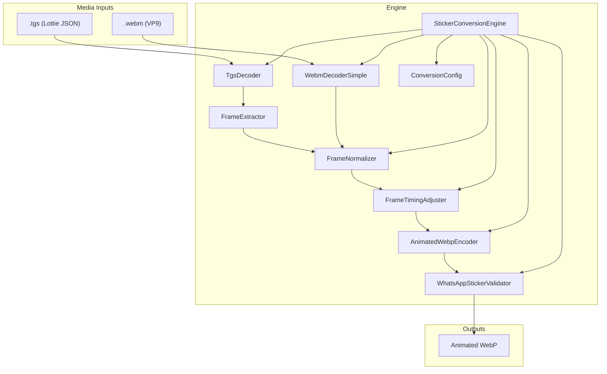
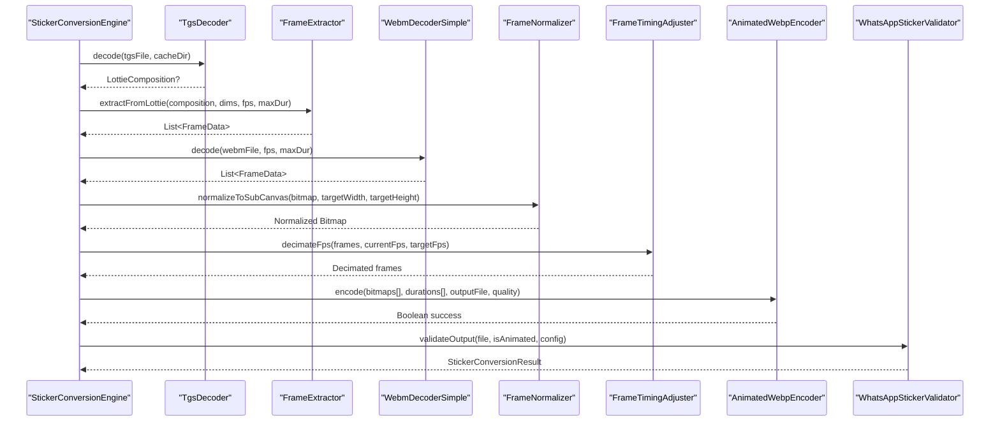
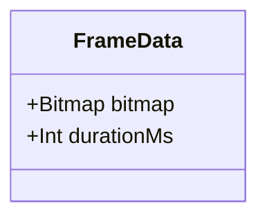
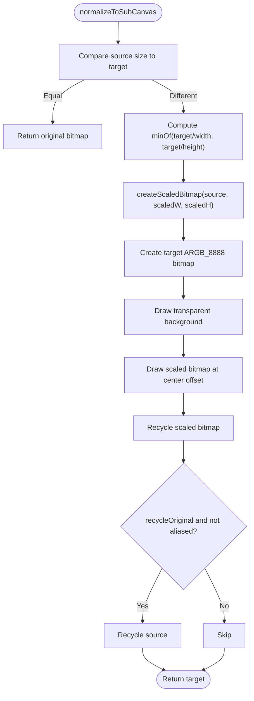
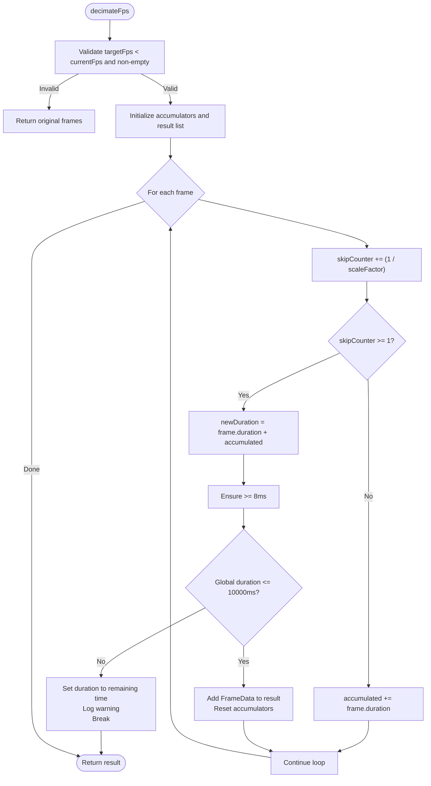
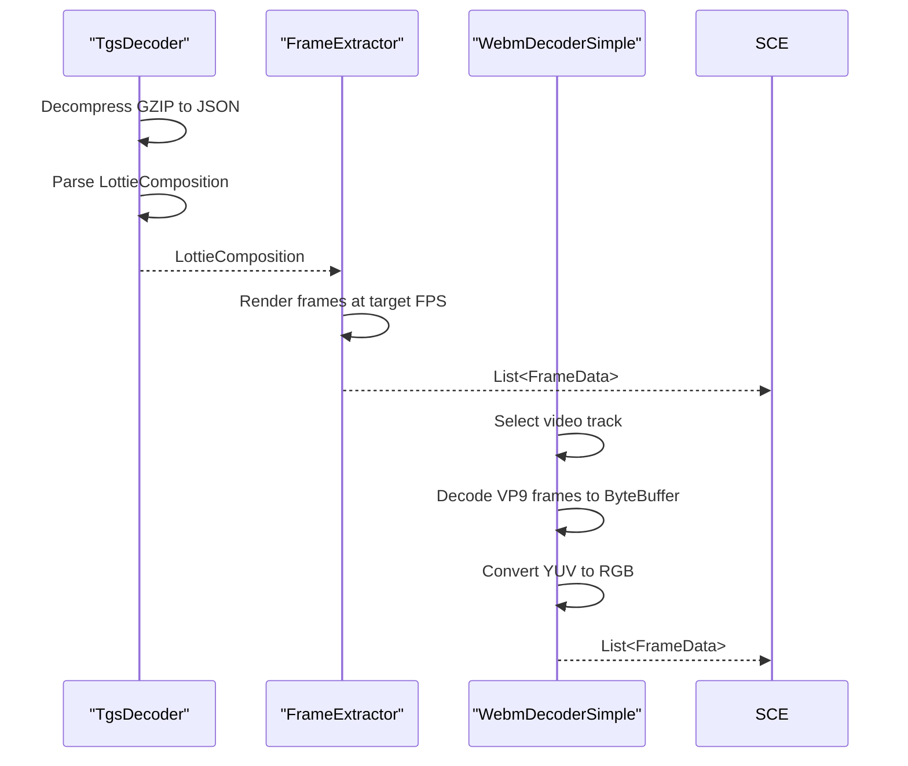
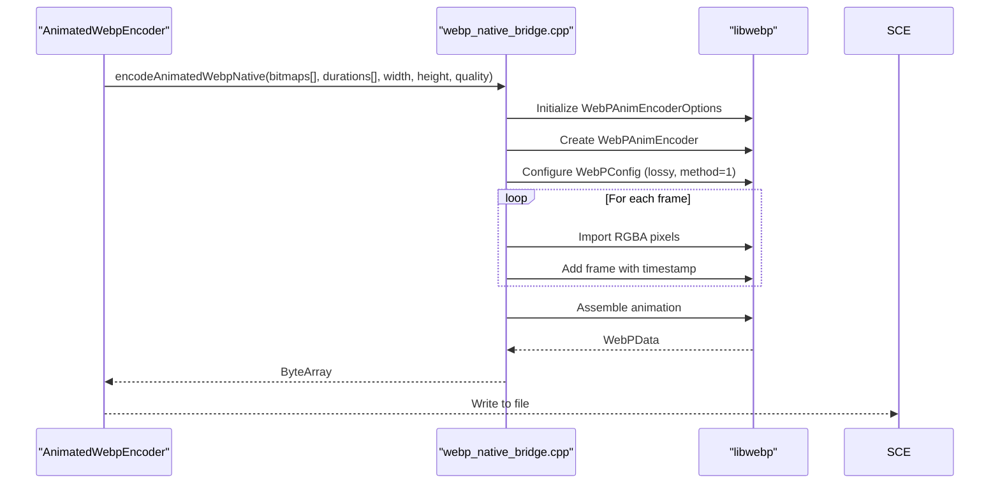
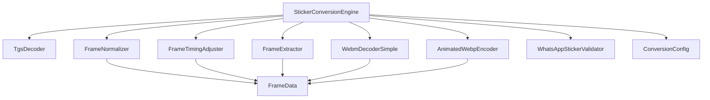

# Frame Processing Utilities

<cite>
**Referenced Files in This Document**
- [FrameData.kt](file://app/src/main/java/com/maheshsharan/tel2what/engine/frame/FrameData.kt)
- [FrameNormalizer.kt](file://app/src/main/java/com/maheshsharan/tel2what/engine/frame/FrameNormalizer.kt)
- [FrameTimingAdjuster.kt](file://app/src/main/java/com/maheshsharan/tel2what/engine/frame/FrameTimingAdjuster.kt)
- [FrameExtractor.kt](file://app/src/main/java/com/maheshsharan/tel2what/engine/decoder/FrameExtractor.kt)
- [WebmDecoderSimple.kt](file://app/src/main/java/com/maheshsharan/tel2what/engine/decoder/WebmDecoderSimple.kt)
- [TgsDecoder.kt](file://app/src/main/java/com/maheshsharan/tel2what/engine/decoder/TgsDecoder.kt)
- [AnimatedWebpEncoder.kt](file://app/src/main/java/com/maheshsharan/tel2what/engine/encoder/AnimatedWebpEncoder.kt)
- [webp_native_bridge.cpp](file://app/src/main/cpp/webp_native_bridge.cpp)
- [StickerConversionEngine.kt](file://app/src/main/java/com/maheshsharan/tel2what/engine/StickerConversionEngine.kt)
- [ConversionConfig.kt](file://app/src/main/java/com/maheshsharan/tel2what/engine/ConversionConfig.kt)
- [WhatsAppStickerValidator.kt](file://app/src/main/java/com/maheshsharan/tel2what/engine/WhatsAppStickerValidator.kt)
- [StickerConversionResult.kt](file://app/src/main/java/com/maheshsharan/tel2what/engine/StickerConversionResult.kt)
</cite>

## Table of Contents
1. [Introduction](#introduction)
2. [Project Structure](#project-structure)
3. [Core Components](#core-components)
4. [Architecture Overview](#architecture-overview)
5. [Detailed Component Analysis](#detailed-component-analysis)
6. [Dependency Analysis](#dependency-analysis)
7. [Performance Considerations](#performance-considerations)
8. [Troubleshooting Guide](#troubleshooting-guide)
9. [Conclusion](#conclusion)

## Introduction
This document explains the frame processing utilities that power animated sticker conversion in the Tel2What application. It covers the FrameData structure for representing individual animation frames with bitmap data and timing information, the FrameNormalizer implementation for ensuring consistent frame dimensions and quality, and the FrameTimingAdjuster functionality for precise timing control and frame rate conversion. The document also details how these components integrate with different media processing pipelines (TGS Lottie animations and WebM videos) and outlines technical specifications and memory management considerations.

## Project Structure
The frame processing utilities reside in the engine/frame package alongside decoder and encoder components. The overall architecture routes input files through decoders, normalizes frames, adjusts timing, and encodes to Animated WebP using a native JNI bridge.

**Diagram sources**
- [StickerConversionEngine.kt](file://app/src/main/java/com/maheshsharan/tel2what/engine/StickerConversionEngine.kt#L17-L88)
- [FrameNormalizer.kt](file://app/src/main/java/com/maheshsharan/tel2what/engine/frame/FrameNormalizer.kt#L11-L61)
- [FrameTimingAdjuster.kt](file://app/src/main/java/com/maheshsharan/tel2what/engine/frame/FrameTimingAdjuster.kt#L8-L71)
- [FrameExtractor.kt](file://app/src/main/java/com/maheshsharan/tel2what/engine/decoder/FrameExtractor.kt#L16-L99)
- [WebmDecoderSimple.kt](file://app/src/main/java/com/maheshsharan/tel2what/engine/decoder/WebmDecoderSimple.kt#L20-L255)
- [TgsDecoder.kt](file://app/src/main/java/com/maheshsharan/tel2what/engine/decoder/TgsDecoder.kt#L17-L93)
- [AnimatedWebpEncoder.kt](file://app/src/main/java/com/maheshsharan/tel2what/engine/encoder/AnimatedWebpEncoder.kt#L8-L90)
- [WhatsAppStickerValidator.kt](file://app/src/main/java/com/maheshsharan/tel2what/engine/WhatsAppStickerValidator.kt#L7-L71)
- [ConversionConfig.kt](file://app/src/main/java/com/maheshsharan/tel2what/engine/ConversionConfig.kt#L3-L13)

**Section sources**
- [StickerConversionEngine.kt](file://app/src/main/java/com/maheshsharan/tel2what/engine/StickerConversionEngine.kt#L17-L88)
- [ConversionConfig.kt](file://app/src/main/java/com/maheshsharan/tel2what/engine/ConversionConfig.kt#L3-L13)

## Core Components
This section introduces the primary frame processing components and their roles.

- FrameData: A lightweight data structure encapsulating a single frame's bitmap and duration in milliseconds.
- FrameNormalizer: Ensures frames conform to target dimensions with aspect ratio preservation and transparent letterboxing.
- FrameTimingAdjuster: Performs frame rate decimation and duration accumulation to meet size and timing constraints.

**Section sources**
- [FrameData.kt](file://app/src/main/java/com/maheshsharan/tel2what/engine/frame/FrameData.kt#L5-L8)
- [FrameNormalizer.kt](file://app/src/main/java/com/maheshsharan/tel2what/engine/frame/FrameNormalizer.kt#L11-L61)
- [FrameTimingAdjuster.kt](file://app/src/main/java/com/maheshsharan/tel2what/engine/frame/FrameTimingAdjuster.kt#L8-L71)

## Architecture Overview
The frame processing pipeline integrates decoders, normalization, timing adjustment, and encoding into a cohesive workflow. The engine orchestrates routing based on input type and manages concurrency and resource constraints.

**Diagram sources**
- [StickerConversionEngine.kt](file://app/src/main/java/com/maheshsharan/tel2what/engine/StickerConversionEngine.kt#L131-L273)
- [TgsDecoder.kt](file://app/src/main/java/com/maheshsharan/tel2what/engine/decoder/TgsDecoder.kt#L21-L79)
- [FrameExtractor.kt](file://app/src/main/java/com/maheshsharan/tel2what/engine/decoder/FrameExtractor.kt#L24-L87)
- [WebmDecoderSimple.kt](file://app/src/main/java/com/maheshsharan/tel2what/engine/decoder/WebmDecoderSimple.kt#L23-L191)
- [FrameNormalizer.kt](file://app/src/main/java/com/maheshsharan/tel2what/engine/frame/FrameNormalizer.kt#L17-L60)
- [FrameTimingAdjuster.kt](file://app/src/main/java/com/maheshsharan/tel2what/engine/frame/FrameTimingAdjuster.kt#L16-L70)
- [AnimatedWebpEncoder.kt](file://app/src/main/java/com/maheshsharan/tel2what/engine/encoder/AnimatedWebpEncoder.kt#L32-L78)
- [WhatsAppStickerValidator.kt](file://app/src/main/java/com/maheshsharan/tel2what/engine/WhatsAppStickerValidator.kt#L14-L70)

## Detailed Component Analysis

### FrameData Structure
FrameData is a simple data class that carries a single frame's bitmap and its presentation duration. It serves as the fundamental unit for frame sequences across the pipeline.

Key characteristics:
- Encapsulates a Bitmap and durationMs
- Immutable by design (data class)
- Used uniformly by decoders, normalizer, timing adjuster, and encoder

**Diagram sources**
- [FrameData.kt](file://app/src/main/java/com/maheshsharan/tel2what/engine/frame/FrameData.kt#L5-L8)

**Section sources**
- [FrameData.kt](file://app/src/main/java/com/maheshsharan/tel2what/engine/frame/FrameData.kt#L5-L8)

### FrameNormalizer Implementation
FrameNormalizer scales arbitrary input bitmaps to fit within target dimensions while preserving aspect ratio and adding transparent letterboxing. It optimizes identical-sized inputs and recycles bitmaps to reduce memory pressure.

Core algorithm:
- Compute scale factor to fit within target bounds
- Scale source bitmap to nearest integer dimensions
- Create target ARGB_8888 canvas and clear to transparent
- Center-scaled bitmap onto canvas
- Recycle intermediate and optionally original bitmaps

**Diagram sources**
- [FrameNormalizer.kt](file://app/src/main/java/com/maheshsharan/tel2what/engine/frame/FrameNormalizer.kt#L17-L60)

**Section sources**
- [FrameNormalizer.kt](file://app/src/main/java/com/maheshsharan/tel2what/engine/frame/FrameNormalizer.kt#L11-L61)

### FrameTimingAdjuster Functionality
FrameTimingAdjuster performs decimation to reduce frame rate while preserving total animation duration and meeting platform constraints. It accumulates durations across dropped frames and enforces minimum duration thresholds.

Key behaviors:
- Decimate frames by computing skipCounter based on current/target FPS ratio
- Accumulate durations from dropped frames into the next retained frame
- Enforce minimum 8ms per frame and cap total animation at 10 seconds
- Log metrics and return decimated frame list

**Diagram sources**
- [FrameTimingAdjuster.kt](file://app/src/main/java/com/maheshsharan/tel2what/engine/frame/FrameTimingAdjuster.kt#L16-L70)

**Section sources**
- [FrameTimingAdjuster.kt](file://app/src/main/java/com/maheshsharan/tel2what/engine/frame/FrameTimingAdjuster.kt#L8-L71)

### Frame Extraction Pipelines
Two distinct pipelines produce FrameData lists:

1) TGS (Lottie) extraction:
- Decompresses GZIP .tgs to JSON, parses into LottieComposition
- Renders frames at target FPS with ARGB_8888 bitmaps
- Enforces minimum 2 frames and caps total duration

2) WebM decoding:
- Uses MediaExtractor/MediaCodec to decode VP9 frames
- Converts YUV_420_888 buffers to RGB bitmaps
- Captures frames at target intervals and computes durations

**Diagram sources**
- [TgsDecoder.kt](file://app/src/main/java/com/maheshsharan/tel2what/engine/decoder/TgsDecoder.kt#L21-L79)
- [FrameExtractor.kt](file://app/src/main/java/com/maheshsharan/tel2what/engine/decoder/FrameExtractor.kt#L24-L87)
- [WebmDecoderSimple.kt](file://app/src/main/java/com/maheshsharan/tel2what/engine/decoder/WebmDecoderSimple.kt#L23-L191)

**Section sources**
- [TgsDecoder.kt](file://app/src/main/java/com/maheshsharan/tel2what/engine/decoder/TgsDecoder.kt#L17-L93)
- [FrameExtractor.kt](file://app/src/main/java/com/maheshsharan/tel2what/engine/decoder/FrameExtractor.kt#L16-L99)
- [WebmDecoderSimple.kt](file://app/src/main/java/com/maheshsharan/tel2what/engine/decoder/WebmDecoderSimple.kt#L20-L255)

### Encoding Workflow and JNI Bridge
AnimatedWebpEncoder wraps a native JNI bridge that converts FrameData sequences into Animated WebP. The native implementation uses libwebp's animation encoder with loop_count set to zero for infinite looping.

**Diagram sources**
- [AnimatedWebpEncoder.kt](file://app/src/main/java/com/maheshsharan/tel2what/engine/encoder/AnimatedWebpEncoder.kt#L32-L78)
- [webp_native_bridge.cpp](file://app/src/main/cpp/webp_native_bridge.cpp#L14-L147)

**Section sources**
- [AnimatedWebpEncoder.kt](file://app/src/main/java/com/maheshsharan/tel2what/engine/encoder/AnimatedWebpEncoder.kt#L8-L90)
- [webp_native_bridge.cpp](file://app/src/main/cpp/webp_native_bridge.cpp#L13-L147)

## Dependency Analysis
The frame processing utilities depend on decoders for initial frames, normalization for dimension consistency, timing adjustment for quality and size targets, and the encoder for final output. The engine coordinates these dependencies and applies validation.

**Diagram sources**
- [StickerConversionEngine.kt](file://app/src/main/java/com/maheshsharan/tel2what/engine/StickerConversionEngine.kt#L17-L88)
- [FrameNormalizer.kt](file://app/src/main/java/com/maheshsharan/tel2what/engine/frame/FrameNormalizer.kt#L11-L61)
- [FrameTimingAdjuster.kt](file://app/src/main/java/com/maheshsharan/tel2what/engine/frame/FrameTimingAdjuster.kt#L8-L71)
- [FrameExtractor.kt](file://app/src/main/java/com/maheshsharan/tel2what/engine/decoder/FrameExtractor.kt#L16-L99)
- [WebmDecoderSimple.kt](file://app/src/main/java/com/maheshsharan/tel2what/engine/decoder/WebmDecoderSimple.kt#L20-L255)
- [TgsDecoder.kt](file://app/src/main/java/com/maheshsharan/tel2what/engine/decoder/TgsDecoder.kt#L17-L93)
- [AnimatedWebpEncoder.kt](file://app/src/main/java/com/maheshsharan/tel2what/engine/encoder/AnimatedWebpEncoder.kt#L8-L90)
- [WhatsAppStickerValidator.kt](file://app/src/main/java/com/maheshsharan/tel2what/engine/WhatsAppStickerValidator.kt#L7-L71)
- [ConversionConfig.kt](file://app/src/main/java/com/maheshsharan/tel2what/engine/ConversionConfig.kt#L3-L13)

**Section sources**
- [StickerConversionEngine.kt](file://app/src/main/java/com/maheshsharan/tel2what/engine/StickerConversionEngine.kt#L17-L88)

## Performance Considerations
- Memory management: Intermediate bitmaps are recycled promptly to minimize peak heap usage. The engine recycles all frames after encoding to prevent memory leaks.
- Concurrency control: Animated processing is serialized to avoid thermal throttling and OOM on mid-tier devices; static processing allows up to four concurrent threads.
- Adaptive compression: The engine reduces quality and frame rate iteratively to meet the 500KB animated size limit while preserving visual fidelity.
- Native encoding: libwebp's animation encoder runs in native code for speed, with method=1 balancing speed and compression.

[No sources needed since this section provides general guidance]

## Troubleshooting Guide
Common issues and their indicators:
- Input file errors: Nonexistent or empty files cause immediate failure with descriptive logs.
- Decoder failures: TGS parsing exceptions or WebM track selection failures lead to graceful fallbacks and cleanup.
- Frame extraction failures: Lottie extraction exceptions trigger bitmap recycling and return empty lists.
- Encoding failures: JNI encoder returning null or empty byte arrays indicate native encoding errors.
- Validation failures: Exceeding size limits or dimension mismatches are caught by the validator before completion.

Resolution steps:
- Verify input file integrity and permissions
- Reduce target FPS or quality to meet size constraints
- Ensure sufficient free storage for temporary files during TGS decompression
- Monitor logs for specific error messages indicating the failing stage

**Section sources**
- [StickerConversionEngine.kt](file://app/src/main/java/com/maheshsharan/tel2what/engine/StickerConversionEngine.kt#L45-L53)
- [TgsDecoder.kt](file://app/src/main/java/com/maheshsharan/tel2what/engine/decoder/TgsDecoder.kt#L25-L33)
- [WebmDecoderSimple.kt](file://app/src/main/java/com/maheshsharan/tel2what/engine/decoder/WebmDecoderSimple.kt#L32-L40)
- [FrameExtractor.kt](file://app/src/main/java/com/maheshsharan/tel2what/engine/decoder/FrameExtractor.kt#L89-L96)
- [AnimatedWebpEncoder.kt](file://app/src/main/java/com/maheshsharan/tel2what/engine/encoder/AnimatedWebpEncoder.kt#L38-L46)
- [WhatsAppStickerValidator.kt](file://app/src/main/java/com/maheshsharan/tel2what/engine/WhatsAppStickerValidator.kt#L19-L40)

## Conclusion
The frame processing utilities provide a robust foundation for converting animated stickers across different media types. FrameData offers a consistent representation, FrameNormalizer ensures dimensional compliance, and FrameTimingAdjuster balances quality and size constraints. Together with decoders, encoder, and validator, they form a complete pipeline that meets WhatsApp's requirements while optimizing performance and memory usage.