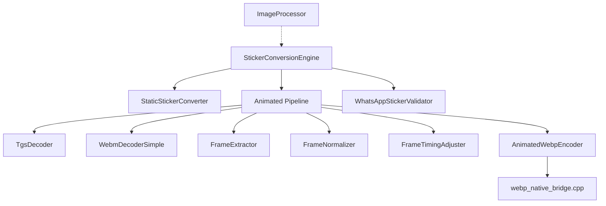
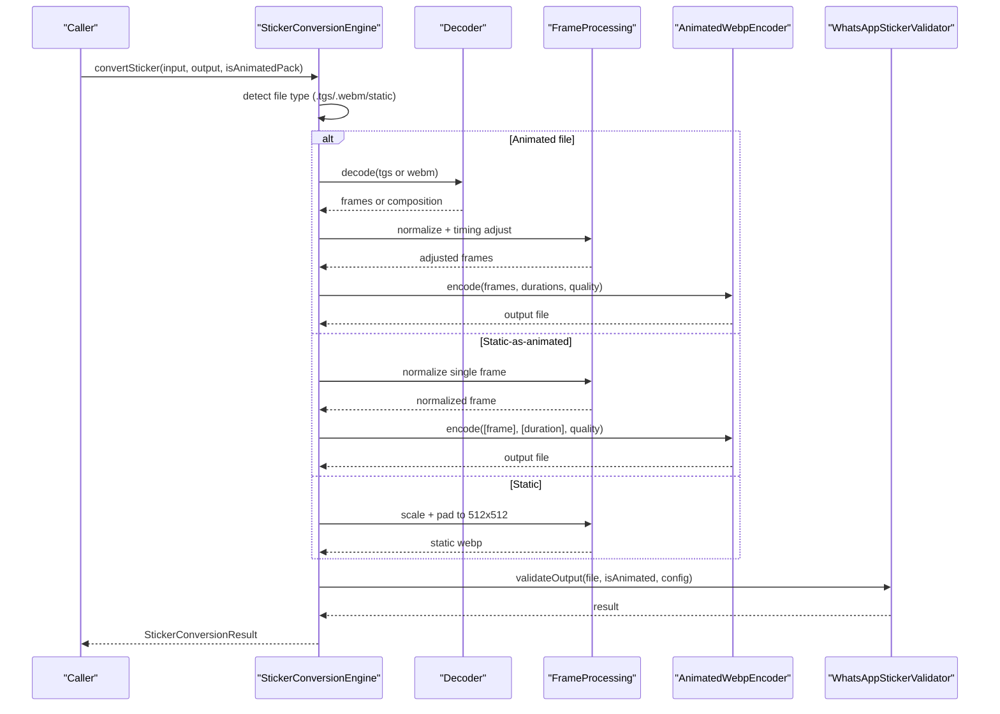
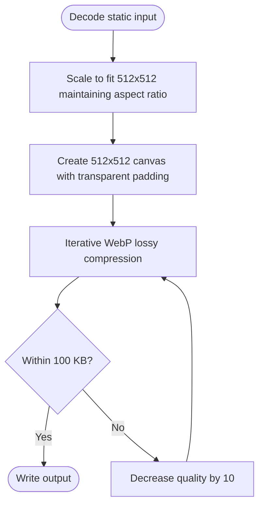
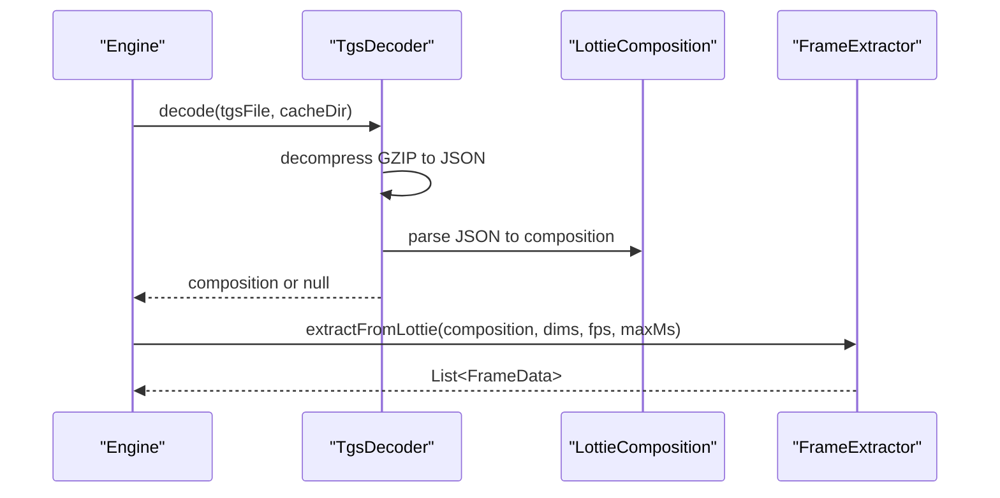
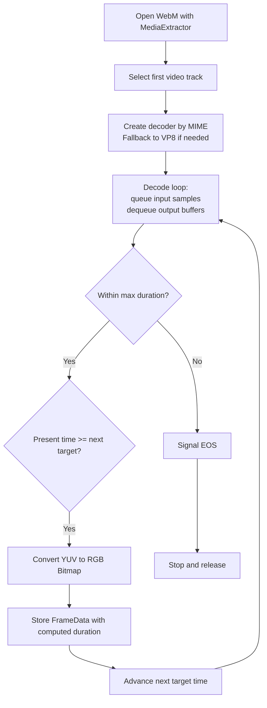
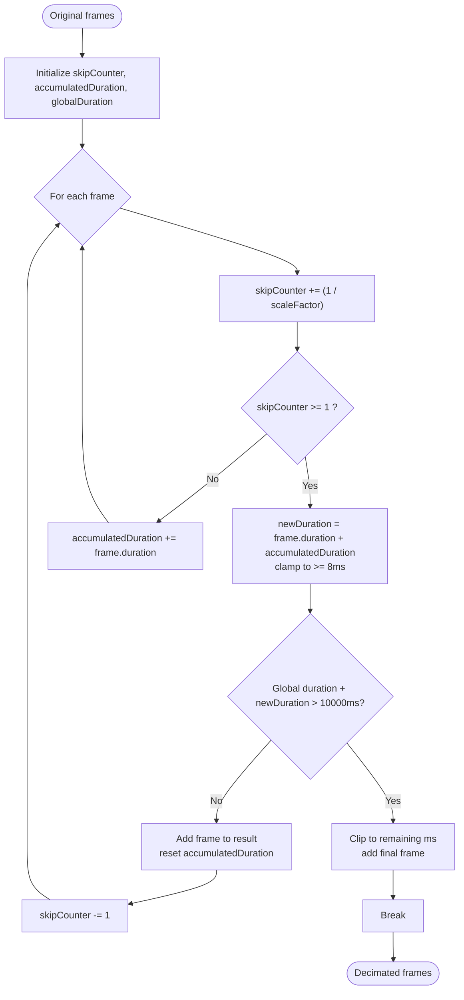
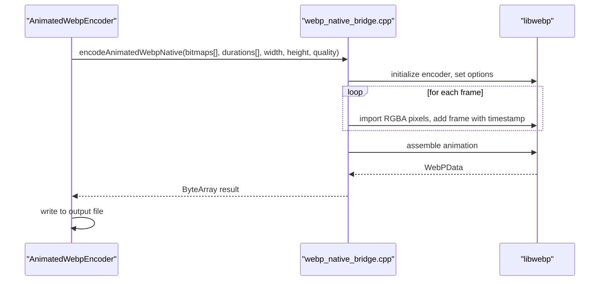
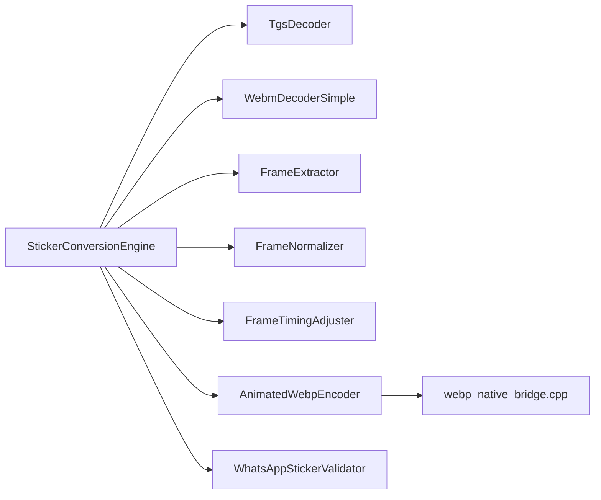

# Media Processing

<cite>
**Referenced Files in This Document**
- [StickerConversionEngine.kt](file://app/src/main/java/com/maheshsharan/tel2what/engine/StickerConversionEngine.kt)
- [StaticStickerConverter.kt](file://app/src/main/java/com/maheshsharan/tel2what/engine/StaticStickerConverter.kt)
- [TgsDecoder.kt](file://app/src/main/java/com/maheshsharan/tel2what/engine/decoder/TgsDecoder.kt)
- [FrameExtractor.kt](file://app/src/main/java/com/maheshsharan/tel2what/engine/decoder/FrameExtractor.kt)
- [WebmDecoderSimple.kt](file://app/src/main/java/com/maheshsharan/tel2what/engine/decoder/WebmDecoderSimple.kt)
- [FrameNormalizer.kt](file://app/src/main/java/com/maheshsharan/tel2what/engine/frame/FrameNormalizer.kt)
- [FrameTimingAdjuster.kt](file://app/src/main/java/com/maheshsharan/tel2what/engine/frame/FrameTimingAdjuster.kt)
- [FrameData.kt](file://app/src/main/java/com/maheshsharan/tel2what/engine/frame/FrameData.kt)
- [AnimatedWebpEncoder.kt](file://app/src/main/java/com/maheshsharan/tel2what/engine/encoder/AnimatedWebpEncoder.kt)
- [webp_native_bridge.cpp](file://app/src/main/cpp/webp_native_bridge.cpp)
- [ConversionConfig.kt](file://app/src/main/java/com/maheshsharan/tel2what/engine/ConversionConfig.kt)
- [WhatsAppStickerValidator.kt](file://app/src/main/java/com/maheshsharan/tel2what/engine/WhatsAppStickerValidator.kt)
- [ImageProcessor.kt](file://app/src/main/java/com/maheshsharan/tel2what/utils/ImageProcessor.kt)
- [StickerConversionResult.kt](file://app/src/main/java/com/maheshsharan/tel2what/engine/StickerConversionResult.kt)
- [StickerConverter.kt](file://app/src/main/java/com/maheshsharan/tel2what/engine/StickerConverter.kt)
</cite>

## Table of Contents
1. [Introduction](#introduction)
2. [Project Structure](#project-structure)
3. [Core Components](#core-components)
4. [Architecture Overview](#architecture-overview)
5. [Detailed Component Analysis](#detailed-component-analysis)
6. [Dependency Analysis](#dependency-analysis)
7. [Performance Considerations](#performance-considerations)
8. [Troubleshooting Guide](#troubleshooting-guide)
9. [Conclusion](#conclusion)
10. [Appendices](#appendices)

## Introduction
This document explains the media processing capabilities of the application with a focus on:
- Static image handling
- Telegram GIF (TGS) animation support
- WebM video processing
- Frame extraction and timing adjustment
- TGS and WebM decoders
- Frame normalization and timing adjustment algorithms
- ImageProcessor utilities for optimization
- Supported formats, resolution handling, and memory management
- Processing workflows and performance considerations

## Project Structure
The media processing pipeline is organized around a central engine that routes inputs to specialized decoders and processors, then encodes to Animated WebP using a native bridge.

**Diagram sources**
- [StickerConversionEngine.kt](file://app/src/main/java/com/maheshsharan/tel2what/engine/StickerConversionEngine.kt#L33-L88)
- [StaticStickerConverter.kt](file://app/src/main/java/com/maheshsharan/tel2what/engine/StaticStickerConverter.kt#L15-L94)
- [TgsDecoder.kt](file://app/src/main/java/com/maheshsharan/tel2what/engine/decoder/TgsDecoder.kt#L17-L94)
- [FrameExtractor.kt](file://app/src/main/java/com/maheshsharan/tel2what/engine/decoder/FrameExtractor.kt#L16-L100)
- [WebmDecoderSimple.kt](file://app/src/main/java/com/maheshsharan/tel2what/engine/decoder/WebmDecoderSimple.kt#L20-L256)
- [FrameNormalizer.kt](file://app/src/main/java/com/maheshsharan/tel2what/engine/frame/FrameNormalizer.kt#L11-L62)
- [FrameTimingAdjuster.kt](file://app/src/main/java/com/maheshsharan/tel2what/engine/frame/FrameTimingAdjuster.kt#L8-L72)
- [AnimatedWebpEncoder.kt](file://app/src/main/java/com/maheshsharan/tel2what/engine/encoder/AnimatedWebpEncoder.kt#L8-L91)
- [webp_native_bridge.cpp](file://app/src/main/cpp/webp_native_bridge.cpp#L13-L148)
- [WhatsAppStickerValidator.kt](file://app/src/main/java/com/maheshsharan/tel2what/engine/WhatsAppStickerValidator.kt#L7-L72)
- [ImageProcessor.kt](file://app/src/main/java/com/maheshsharan/tel2what/utils/ImageProcessor.kt#L9-L68)

**Section sources**
- [StickerConversionEngine.kt](file://app/src/main/java/com/maheshsharan/tel2what/engine/StickerConversionEngine.kt#L17-L88)
- [ConversionConfig.kt](file://app/src/main/java/com/maheshsharan/tel2what/engine/ConversionConfig.kt#L3-L14)

## Core Components
- StickerConversionEngine: Orchestrates routing and concurrency control for static, static-as-animated, and animated pipelines.
- StaticStickerConverter: Handles static images with aspect-preserving scaling and letterboxed padding to target dimensions.
- Decoders:
  - TgsDecoder: Decompresses Telegram’s .tgs (GZIP JSON) and parses into a LottieComposition.
  - WebmDecoderSimple: Extracts frames from WebM containers using MediaCodec in ByteBuffer mode.
- Frame processing:
  - FrameExtractor: Renders Lottie compositions into timed Bitmap frames.
  - FrameNormalizer: Normalizes arbitrary frames to a fixed 512x512 canvas with transparent padding.
  - FrameTimingAdjuster: Decimates frames to meet target FPS while preserving total duration and enforcing minimum frame durations.
- AnimatedWebpEncoder and native bridge: Encodes sequences of Bitmaps into Animated WebP using libwebp.
- WhatsAppStickerValidator: Validates output against size, dimension, and animation constraints.
- ImageProcessor: Optimizes tray icons to 96x96 with WEBP_LOSSY compression under 50 KB.

**Section sources**
- [StickerConversionEngine.kt](file://app/src/main/java/com/maheshsharan/tel2what/engine/StickerConversionEngine.kt#L17-L275)
- [StaticStickerConverter.kt](file://app/src/main/java/com/maheshsharan/tel2what/engine/StaticStickerConverter.kt#L15-L94)
- [TgsDecoder.kt](file://app/src/main/java/com/maheshsharan/tel2what/engine/decoder/TgsDecoder.kt#L17-L94)
- [FrameExtractor.kt](file://app/src/main/java/com/maheshsharan/tel2what/engine/decoder/FrameExtractor.kt#L16-L100)
- [WebmDecoderSimple.kt](file://app/src/main/java/com/maheshsharan/tel2what/engine/decoder/WebmDecoderSimple.kt#L20-L256)
- [FrameNormalizer.kt](file://app/src/main/java/com/maheshsharan/tel2what/engine/frame/FrameNormalizer.kt#L11-L62)
- [FrameTimingAdjuster.kt](file://app/src/main/java/com/maheshsharan/tel2what/engine/frame/FrameTimingAdjuster.kt#L8-L72)
- [AnimatedWebpEncoder.kt](file://app/src/main/java/com/maheshsharan/tel2what/engine/encoder/AnimatedWebpEncoder.kt#L8-L91)
- [webp_native_bridge.cpp](file://app/src/main/cpp/webp_native_bridge.cpp#L13-L148)
- [WhatsAppStickerValidator.kt](file://app/src/main/java/com/maheshsharan/tel2what/engine/WhatsAppStickerValidator.kt#L7-L72)
- [ImageProcessor.kt](file://app/src/main/java/com/maheshsharan/tel2what/utils/ImageProcessor.kt#L9-L68)

## Architecture Overview
The engine selects a pipeline based on input type and pack characteristics, then applies normalization and timing adjustments before encoding to Animated WebP.

**Diagram sources**
- [StickerConversionEngine.kt](file://app/src/main/java/com/maheshsharan/tel2what/engine/StickerConversionEngine.kt#L33-L88)
- [TgsDecoder.kt](file://app/src/main/java/com/maheshsharan/tel2what/engine/decoder/TgsDecoder.kt#L21-L80)
- [WebmDecoderSimple.kt](file://app/src/main/java/com/maheshsharan/tel2what/engine/decoder/WebmDecoderSimple.kt#L27-L192)
- [FrameExtractor.kt](file://app/src/main/java/com/maheshsharan/tel2what/engine/decoder/FrameExtractor.kt#L24-L98)
- [FrameNormalizer.kt](file://app/src/main/java/com/maheshsharan/tel2what/engine/frame/FrameNormalizer.kt#L17-L60)
- [FrameTimingAdjuster.kt](file://app/src/main/java/com/maheshsharan/tel2what/engine/frame/FrameTimingAdjuster.kt#L16-L70)
- [AnimatedWebpEncoder.kt](file://app/src/main/java/com/maheshsharan/tel2what/engine/encoder/AnimatedWebpEncoder.kt#L32-L78)
- [WhatsAppStickerValidator.kt](file://app/src/main/java/com/maheshsharan/tel2what/engine/WhatsAppStickerValidator.kt#L14-L70)

## Detailed Component Analysis

### Static Image Handling
- Aspect-preserving scaling to fit within 512x512, followed by letterboxed padding on an ARGB_8888 canvas.
- Iterative WebP lossy compression to meet the 100 KB static size cap.
- Memory management: bitmaps are recycled in finally blocks to avoid leaks.

**Diagram sources**
- [StaticStickerConverter.kt](file://app/src/main/java/com/maheshsharan/tel2what/engine/StaticStickerConverter.kt#L17-L94)

**Section sources**
- [StaticStickerConverter.kt](file://app/src/main/java/com/maheshsharan/tel2what/engine/StaticStickerConverter.kt#L15-L94)
- [ConversionConfig.kt](file://app/src/main/java/com/maheshsharan/tel2what/engine/ConversionConfig.kt#L3-L14)

### Telegram GIF (TGS) Animation Support
- Decompression: .tgs is GZIP-compressed JSON; decompressed to a temporary JSON file.
- Parsing: LottieCompositionFactory parses the JSON synchronously; errors are logged and null is returned on failure.
- Rendering: FrameExtractor renders the composition at target FPS and capped duration, producing timed frames.
- Memory safety: On exceptions, extracted bitmaps are recycled.

**Diagram sources**
- [TgsDecoder.kt](file://app/src/main/java/com/maheshsharan/tel2what/engine/decoder/TgsDecoder.kt#L21-L80)
- [FrameExtractor.kt](file://app/src/main/java/com/maheshsharan/tel2what/engine/decoder/FrameExtractor.kt#L24-L98)

**Section sources**
- [TgsDecoder.kt](file://app/src/main/java/com/maheshsharan/tel2what/engine/decoder/TgsDecoder.kt#L17-L94)
- [FrameExtractor.kt](file://app/src/main/java/com/maheshsharan/tel2what/engine/decoder/FrameExtractor.kt#L16-L100)

### WebM Video Processing
- Track selection: MediaExtractor locates the first video track.
- Codec selection: Uses container MIME to choose a decoder; falls back to VP8 if needed.
- Decoding: MediaCodec configured without a surface; frames decoded to ByteBuffer and converted to RGB.
- Timing: Captures frames at target FPS intervals, respecting max duration; computes per-frame durations.
- YUV to RGB: Converts I420-like buffers to NV21 and uses YuvImage + JPEG compression to produce a Bitmap.

**Diagram sources**
- [WebmDecoderSimple.kt](file://app/src/main/java/com/maheshsharan/tel2what/engine/decoder/WebmDecoderSimple.kt#L27-L192)
- [WebmDecoderSimple.kt](file://app/src/main/java/com/maheshsharan/tel2what/engine/decoder/WebmDecoderSimple.kt#L194-L256)

**Section sources**
- [WebmDecoderSimple.kt](file://app/src/main/java/com/maheshsharan/tel2what/engine/decoder/WebmDecoderSimple.kt#L20-L256)

### FrameExtractor Functionality
- Renders LottieComposition frames at a specified FPS and caps total duration.
- Creates fresh ARGB_8888 bitmaps and draws each frame with transparent background.
- Ensures at least two frames for animated sticker validation.
- Returns a list of FrameData with equal durations for simple TGS extraction.

**Section sources**
- [FrameExtractor.kt](file://app/src/main/java/com/maheshsharan/tel2what/engine/decoder/FrameExtractor.kt#L16-L100)
- [FrameData.kt](file://app/src/main/java/com/maheshsharan/tel2what/engine/frame/FrameData.kt#L5-L9)

### Frame Normalization
- Scales input to fit within 512x512 while preserving aspect ratio.
- Pads with transparent letterboxes on a 512x512 ARGB_8888 canvas.
- Recycles original bitmaps when safe to reduce memory pressure.

**Section sources**
- [FrameNormalizer.kt](file://app/src/main/java/com/maheshsharan/tel2what/engine/frame/FrameNormalizer.kt#L11-L62)

### FrameTimingAdjuster Algorithm
- Decimates frames to reach target FPS by accumulating durations into retained frames.
- Enforces a minimum 8 ms per frame and caps total animation at 10 seconds.
- Preserves global timing continuity across drops.

**Diagram sources**
- [FrameTimingAdjuster.kt](file://app/src/main/java/com/maheshsharan/tel2what/engine/frame/FrameTimingAdjuster.kt#L16-L70)

**Section sources**
- [FrameTimingAdjuster.kt](file://app/src/main/java/com/maheshsharan/tel2what/engine/frame/FrameTimingAdjuster.kt#L8-L72)

### Animated WebP Encoding (JNI Bridge)
- JNI loads a native library and marshals arrays of Bitmaps and durations to libwebp.
- Uses WebPAnimEncoder with loop_count=0 for infinite looping.
- Writes assembled WebP data to disk after successful encoding.

**Diagram sources**
- [AnimatedWebpEncoder.kt](file://app/src/main/java/com/maheshsharan/tel2what/engine/encoder/AnimatedWebpEncoder.kt#L32-L78)
- [webp_native_bridge.cpp](file://app/src/main/cpp/webp_native_bridge.cpp#L14-L148)

**Section sources**
- [AnimatedWebpEncoder.kt](file://app/src/main/java/com/maheshsharan/tel2what/engine/encoder/AnimatedWebpEncoder.kt#L8-L91)
- [webp_native_bridge.cpp](file://app/src/main/cpp/webp_native_bridge.cpp#L13-L148)

### ImageProcessor Utilities
- Generates a 96x96 tray icon using WebP_LOSSY compression.
- Iteratively lowers quality to keep under 50 KB.
- Logs success/failure with final dimensions and size.

**Section sources**
- [ImageProcessor.kt](file://app/src/main/java/com/maheshsharan/tel2what/utils/ImageProcessor.kt#L9-L68)

## Dependency Analysis
- Engine depends on decoders, frame processors, and encoder.
- Decoders depend on platform APIs (Lottie, MediaCodec, MediaExtractor).
- Encoder depends on native libwebp via JNI.
- Validator enforces constraints post-encoding.

**Diagram sources**
- [StickerConversionEngine.kt](file://app/src/main/java/com/maheshsharan/tel2what/engine/StickerConversionEngine.kt#L5-L11)
- [TgsDecoder.kt](file://app/src/main/java/com/maheshsharan/tel2what/engine/decoder/TgsDecoder.kt#L3-L6)
- [WebmDecoderSimple.kt](file://app/src/main/java/com/maheshsharan/tel2what/engine/decoder/WebmDecoderSimple.kt#L3-L11)
- [FrameExtractor.kt](file://app/src/main/java/com/maheshsharan/tel2what/engine/decoder/FrameExtractor.kt#L3-L11)
- [FrameNormalizer.kt](file://app/src/main/java/com/maheshsharan/tel2what/engine/frame/FrameNormalizer.kt#L3-L7)
- [FrameTimingAdjuster.kt](file://app/src/main/java/com/maheshsharan/tel2what/engine/frame/FrameTimingAdjuster.kt#L3-L4)
- [AnimatedWebpEncoder.kt](file://app/src/main/java/com/maheshsharan/tel2what/engine/encoder/AnimatedWebpEncoder.kt#L3-L7)
- [webp_native_bridge.cpp](file://app/src/main/cpp/webp_native_bridge.cpp#L1-L8)
- [WhatsAppStickerValidator.kt](file://app/src/main/java/com/maheshsharan/tel2what/engine/WhatsAppStickerValidator.kt#L3-L6)

**Section sources**
- [StickerConversionEngine.kt](file://app/src/main/java/com/maheshsharan/tel2what/engine/StickerConversionEngine.kt#L17-L275)

## Performance Considerations
- Concurrency:
  - Static conversions: up to 4 concurrent threads to leverage CPU cores efficiently.
  - Animated conversions: serialized with a semaphore to avoid thermal throttling and OOM.
- Resolution and FPS:
  - Target 512x512 frames; default 10 FPS to maximize speed and reduce memory.
  - Minimum 8 ms per frame to satisfy platform constraints.
- Memory management:
  - Immediate recycling of intermediate bitmaps on failure and in finally blocks.
  - Decimation reduces frame count and total memory footprint.
- Encoding strategy:
  - Starts with low quality and decimates FPS progressively to meet size targets.
  - Uses lossy WebP with method tuned for speed.
- Platform specifics:
  - WebM decoding uses ByteBuffer mode to avoid format mismatches.
  - TGS parsing occurs synchronously to maintain thread safety.

[No sources needed since this section provides general guidance]

## Troubleshooting Guide
- Input validation failures:
  - Nonexistent or zero-length files are rejected early with explicit logs.
- TGS decoding:
  - Empty files, missing JSON, or parse errors lead to null composition; check logs for details.
- WebM decoding:
  - Missing video track, unsupported MIME, or codec creation failures result in empty frame lists.
  - Buffer size mismatches during YUV conversion are logged and skipped.
- Frame extraction:
  - Exceptions trigger bitmap recycling to prevent leaks.
- Encoding:
  - JNI load failures are logged; empty or null results from native encoder cause failure returns.
- Validation:
  - Exceeding size or dimension limits triggers ValidationFailed with precise messages.

**Section sources**
- [StickerConversionEngine.kt](file://app/src/main/java/com/maheshsharan/tel2what/engine/StickerConversionEngine.kt#L45-L53)
- [TgsDecoder.kt](file://app/src/main/java/com/maheshsharan/tel2what/engine/decoder/TgsDecoder.kt#L25-L33)
- [WebmDecoderSimple.kt](file://app/src/main/java/com/maheshsharan/tel2what/engine/decoder/WebmDecoderSimple.kt#L32-L40)
- [FrameExtractor.kt](file://app/src/main/java/com/maheshsharan/tel2what/engine/decoder/FrameExtractor.kt#L89-L97)
- [AnimatedWebpEncoder.kt](file://app/src/main/java/com/maheshsharan/tel2what/engine/encoder/AnimatedWebpEncoder.kt#L13-L21)
- [WhatsAppStickerValidator.kt](file://app/src/main/java/com/maheshsharan/tel2what/engine/WhatsAppStickerValidator.kt#L19-L40)

## Conclusion
The media processing pipeline integrates robust decoders for TGS and WebM, precise frame normalization and timing adjustments, and efficient Animated WebP encoding with strict validation. Concurrency controls and memory-conscious design ensure reliable operation across diverse devices and input types.

[No sources needed since this section summarizes without analyzing specific files]

## Appendices

### Supported Formats and Constraints
- Static images: Any raster input; output 512x512 WebP under 100 KB.
- Animated:
  - TGS: Lottie JSON inside .tgs (GZIP); rendered to frames.
  - WebM: VP9 or VP8 decodable streams; extracted frames.
- Output: Animated WebP (512x512, ≤500 KB, ≤10 seconds, ≥8 ms per frame).
- Tray icons: 96x96 WebP_LOSSY under 50 KB.

**Section sources**
- [ConversionConfig.kt](file://app/src/main/java/com/maheshsharan/tel2what/engine/ConversionConfig.kt#L3-L14)
- [StaticStickerConverter.kt](file://app/src/main/java/com/maheshsharan/tel2what/engine/StaticStickerConverter.kt#L54-L72)
- [ImageProcessor.kt](file://app/src/main/java/com/maheshsharan/tel2what/utils/ImageProcessor.kt#L11-L12)

### Example Workflows
- Static image to WebP:
  - Decode → Scale and pad → Lossy compression loop → Validate.
- Static image wrapped as 1-frame animation:
  - Decode → Normalize → Encode single frame → Validate.
- TGS to Animated WebP:
  - Decompress → Parse → Extract frames → Normalize → Timing adjust → Encode → Validate.
- WebM to Animated WebP:
  - Select track → Decode frames → Normalize → Timing adjust → Encode → Validate.

**Section sources**
- [StickerConversionEngine.kt](file://app/src/main/java/com/maheshsharan/tel2what/engine/StickerConversionEngine.kt#L90-L129)
- [StickerConversionEngine.kt](file://app/src/main/java/com/maheshsharan/tel2what/engine/StickerConversionEngine.kt#L131-L273)