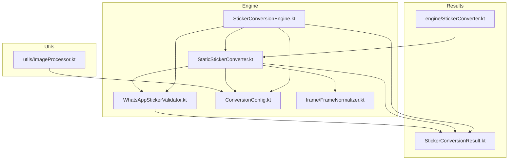
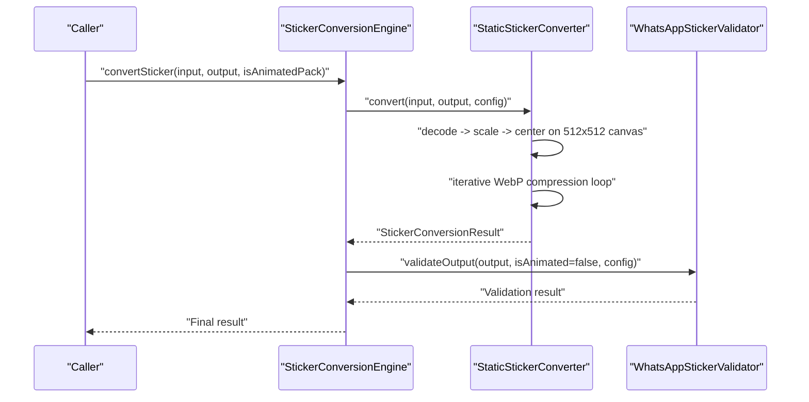
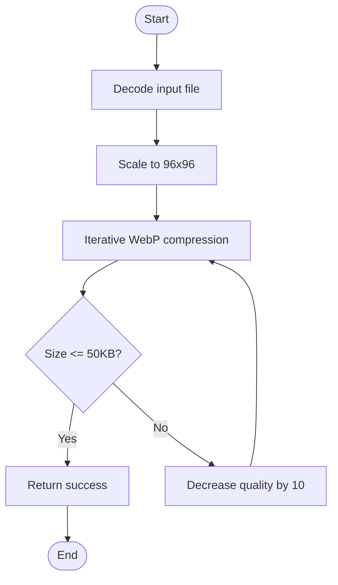
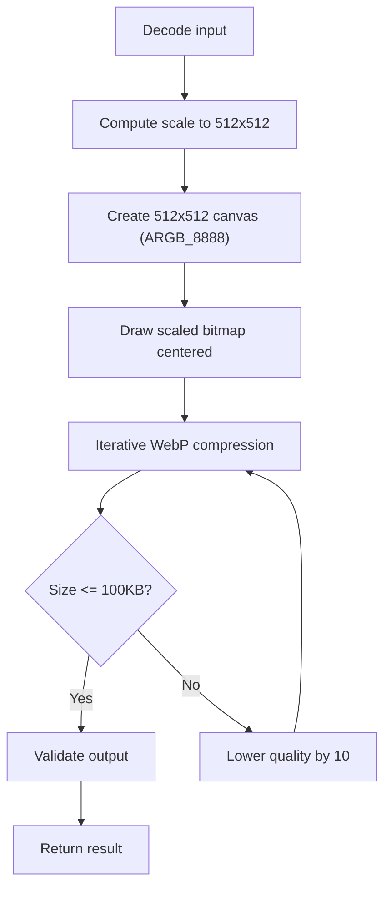
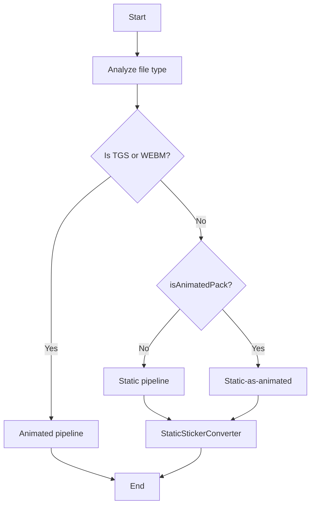
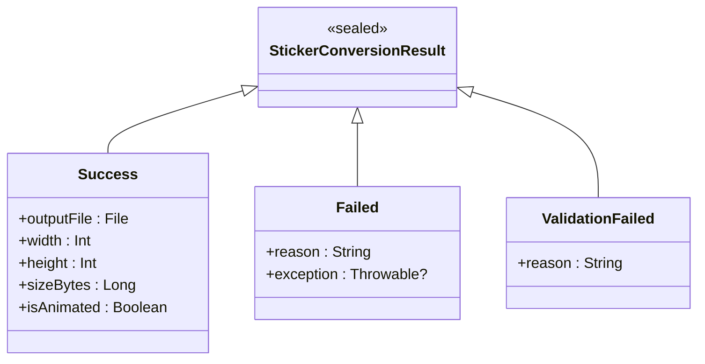
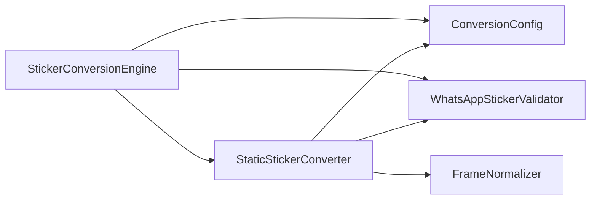

# Static Image Processing

<cite>
**Referenced Files in This Document**
- [ImageProcessor.kt](file://app/src/main/java/com/maheshsharan/tel2what/utils/ImageProcessor.kt)
- [StaticStickerConverter.kt](file://app/src/main/java/com/maheshsharan/tel2what/engine/StaticStickerConverter.kt)
- [StickerConversionEngine.kt](file://app/src/main/java/com/maheshsharan/tel2what/engine/StickerConversionEngine.kt)
- [ConversionConfig.kt](file://app/src/main/java/com/maheshsharan/tel2what/engine/ConversionConfig.kt)
- [WhatsAppStickerValidator.kt](file://app/src/main/java/com/maheshsharan/tel2what/engine/WhatsAppStickerValidator.kt)
- [StickerConverter.kt](file://app/src/main/java/com/maheshsharan/tel2what/engine/StickerConverter.kt)
- [StickerConversionResult.kt](file://app/src/main/java/com/maheshsharan/tel2what/engine/StickerConversionResult.kt)
- [FrameNormalizer.kt](file://app/src/main/java/com/maheshsharan/tel2what/engine/frame/FrameNormalizer.kt)
- [animated_pipe.md](file://assets/docs/animated_pipe.md)
</cite>

## Table of Contents
1. [Introduction](#introduction)
2. [Project Structure](#project-structure)
3. [Core Components](#core-components)
4. [Architecture Overview](#architecture-overview)
5. [Detailed Component Analysis](#detailed-component-analysis)
6. [Dependency Analysis](#dependency-analysis)
7. [Performance Considerations](#performance-considerations)
8. [Troubleshooting Guide](#troubleshooting-guide)
9. [Conclusion](#conclusion)

## Introduction
This document explains the static image processing capabilities in Tel2What, focusing on:
- ImageProcessor utilities for generating WhatsApp-compliant tray icons
- StaticStickerConverter for converting static Telegram stickers to animated WebP with exact 512x512 dimensions and optional lossy compression
- Supported formats, resolution handling, color space conversion, and compression strategies
- Quality preservation, memory optimization, and performance characteristics
- Typical workflows and troubleshooting guidance

## Project Structure
The static image processing pipeline resides primarily under the engine and utils packages, with shared configuration and validation utilities.

**Diagram sources**
- [StickerConversionEngine.kt](file://app/src/main/java/com/maheshsharan/tel2what/engine/StickerConversionEngine.kt#L1-L275)
- [StaticStickerConverter.kt](file://app/src/main/java/com/maheshsharan/tel2what/engine/StaticStickerConverter.kt#L1-L94)
- [WhatsAppStickerValidator.kt](file://app/src/main/java/com/maheshsharan/tel2what/engine/WhatsAppStickerValidator.kt#L1-L72)
- [ConversionConfig.kt](file://app/src/main/java/com/maheshsharan/tel2what/engine/ConversionConfig.kt#L1-L14)
- [FrameNormalizer.kt](file://app/src/main/java/com/maheshsharan/tel2what/engine/frame/FrameNormalizer.kt#L1-L62)
- [ImageProcessor.kt](file://app/src/main/java/com/maheshsharan/tel2what/utils/ImageProcessor.kt#L1-L68)
- [StickerConversionResult.kt](file://app/src/main/java/com/maheshsharan/tel2what/engine/StickerConversionResult.kt#L1-L23)
- [StickerConverter.kt](file://app/src/main/java/com/maheshsharan/tel2what/engine/StickerConverter.kt#L1-L20)

**Section sources**
- [StickerConversionEngine.kt](file://app/src/main/java/com/maheshsharan/tel2what/engine/StickerConversionEngine.kt#L1-L275)
- [StaticStickerConverter.kt](file://app/src/main/java/com/maheshsharan/tel2what/engine/StaticStickerConverter.kt#L1-L94)
- [ImageProcessor.kt](file://app/src/main/java/com/maheshsharan/tel2what/utils/ImageProcessor.kt#L1-L68)
- [ConversionConfig.kt](file://app/src/main/java/com/maheshsharan/tel2what/engine/ConversionConfig.kt#L1-L14)

## Core Components
- ImageProcessor: Generates exactly 96x96 tray icons with WebP compression and size checks.
- StaticStickerConverter: Resizes and centers static images to 512x512, then iteratively compresses to meet size limits.
- StickerConversionEngine: Orchestrates routing between static, animated, and static-as-animated pipelines.
- WhatsAppStickerValidator: Enforces exact dimensions and size limits for output files.
- ConversionConfig: Centralizes constraints (dimensions, sizes, FPS, durations).
- FrameNormalizer: Aspect-ratio-preserving normalization to 512x512 with transparent padding.

**Section sources**
- [ImageProcessor.kt](file://app/src/main/java/com/maheshsharan/tel2what/utils/ImageProcessor.kt#L1-L68)
- [StaticStickerConverter.kt](file://app/src/main/java/com/maheshsharan/tel2what/engine/StaticStickerConverter.kt#L1-L94)
- [StickerConversionEngine.kt](file://app/src/main/java/com/maheshsharan/tel2what/engine/StickerConversionEngine.kt#L1-L275)
- [WhatsAppStickerValidator.kt](file://app/src/main/java/com/maheshsharan/tel2what/engine/WhatsAppStickerValidator.kt#L1-L72)
- [ConversionConfig.kt](file://app/src/main/java/com/maheshsharan/tel2what/engine/ConversionConfig.kt#L1-L14)
- [FrameNormalizer.kt](file://app/src/main/java/com/maheshsharan/tel2what/engine/frame/FrameNormalizer.kt#L1-L62)

## Architecture Overview
Static image processing follows a straightforward pipeline:
- Decode input image
- Resize to fit within 512x512 maintaining aspect ratio
- Pad to exactly 512x512 with transparent background
- Iteratively compress to WebP with decreasing quality until under size limit
- Validate output dimensions and size

**Diagram sources**
- [StickerConversionEngine.kt](file://app/src/main/java/com/maheshsharan/tel2what/engine/StickerConversionEngine.kt#L33-L88)
- [StaticStickerConverter.kt](file://app/src/main/java/com/maheshsharan/tel2what/engine/StaticStickerConverter.kt#L17-L92)
- [WhatsAppStickerValidator.kt](file://app/src/main/java/com/maheshsharan/tel2what/engine/WhatsAppStickerValidator.kt#L14-L70)

## Detailed Component Analysis

### ImageProcessor (Tray Icon Generation)
- Purpose: Produce exactly 96x96 tray icons compliant with WhatsApp constraints.
- Input: Any image file.
- Output: WebP-formatted file under 50 KB.
- Algorithm:
  - Decode image
  - Scale to 96x96
  - Iteratively compress with WebP (lossy on Android 11+) with decreasing quality until size threshold met
  - Log success/failure with final dimensions and file size
- Color space: Uses Android’s WebP compression; assumes sRGB-like input.
- Memory: Recycles bitmaps after writing.

**Diagram sources**
- [ImageProcessor.kt](file://app/src/main/java/com/maheshsharan/tel2what/utils/ImageProcessor.kt#L17-L66)

**Section sources**
- [ImageProcessor.kt](file://app/src/main/java/com/maheshsharan/tel2what/utils/ImageProcessor.kt#L11-L66)
- [ConversionConfig.kt](file://app/src/main/java/com/maheshsharan/tel2what/engine/ConversionConfig.kt#L8-L12)

### StaticStickerConverter (Static to Animated WebP)
- Purpose: Convert static images to animated WebP with exact 512x512 canvas and transparent padding.
- Input: Static image file.
- Output: Animated WebP file meeting size and dimension constraints.
- Algorithm:
  - Decode original bitmap
  - Compute scale ratio to fit within 512x512
  - Create 512x512 ARGB_8888 canvas, clear to transparent, draw centered scaled bitmap
  - Iterative WebP compression loop (WebP_LOSSY on Android 11+, else WebP) lowering quality until under 100 KB
  - Validate output via WhatsAppStickerValidator
  - Recycle bitmaps in finally block
- Color space: ARGB_8888 canvas ensures full alpha channel for transparent padding.
- Quality: Starts at 100, decrements by 10 until success or minimum threshold.

**Diagram sources**
- [StaticStickerConverter.kt](file://app/src/main/java/com/maheshsharan/tel2what/engine/StaticStickerConverter.kt#L26-L92)
- [WhatsAppStickerValidator.kt](file://app/src/main/java/com/maheshsharan/tel2what/engine/WhatsAppStickerValidator.kt#L14-L70)

**Section sources**
- [StaticStickerConverter.kt](file://app/src/main/java/com/maheshsharan/tel2what/engine/StaticStickerConverter.kt#L15-L94)
- [FrameNormalizer.kt](file://app/src/main/java/com/maheshsharan/tel2what/engine/frame/FrameNormalizer.kt#L17-L60)
- [ConversionConfig.kt](file://app/src/main/java/com/maheshsharan/tel2what/engine/ConversionConfig.kt#L3-L12)

### StickerConversionEngine (Routing and Concurrency)
- Routes to appropriate pipeline based on file type and pack type.
- Static pipeline: Uses StaticStickerConverter with concurrency control (Semaphore(4)).
- Static-as-animated pipeline: Wraps a static image into a 1-frame animated WebP.
- Animated pipeline: Handled elsewhere; see animated_pipe.md for details.
- Logging: Comprehensive telemetry around file analysis, pipeline selection, and metrics.

**Diagram sources**
- [StickerConversionEngine.kt](file://app/src/main/java/com/maheshsharan/tel2what/engine/StickerConversionEngine.kt#L33-L88)

**Section sources**
- [StickerConversionEngine.kt](file://app/src/main/java/com/maheshsharan/tel2what/engine/StickerConversionEngine.kt#L17-L88)

### Validation and Results
- WhatsAppStickerValidator enforces:
  - Non-empty output
  - Size limits (100 KB for static, 500 KB for animated)
  - Exact 512x512 dimensions
- StickerConversionResult encapsulates Success, Failed, and ValidationFailed outcomes.

**Diagram sources**
- [StickerConversionResult.kt](file://app/src/main/java/com/maheshsharan/tel2what/engine/StickerConversionResult.kt#L5-L22)

**Section sources**
- [WhatsAppStickerValidator.kt](file://app/src/main/java/com/maheshsharan/tel2what/engine/WhatsAppStickerValidator.kt#L14-L70)
- [StickerConversionResult.kt](file://app/src/main/java/com/maheshsharan/tel2what/engine/StickerConversionResult.kt#L5-L22)

## Dependency Analysis
- StaticStickerConverter depends on:
  - ConversionConfig for target dimensions and size limits
  - WhatsAppStickerValidator for post-encoding checks
  - FrameNormalizer for aspect-ratio-preserving scaling and padding
- StickerConversionEngine coordinates:
  - StaticStickerConverter for static conversions
  - Concurrency control via Semaphores
  - Routing decisions based on file extension and flags

**Diagram sources**
- [StaticStickerConverter.kt](file://app/src/main/java/com/maheshsharan/tel2what/engine/StaticStickerConverter.kt#L15-L94)
- [StickerConversionEngine.kt](file://app/src/main/java/com/maheshsharan/tel2what/engine/StickerConversionEngine.kt#L17-L88)
- [ConversionConfig.kt](file://app/src/main/java/com/maheshsharan/tel2what/engine/ConversionConfig.kt#L3-L12)
- [FrameNormalizer.kt](file://app/src/main/java/com/maheshsharan/tel2what/engine/frame/FrameNormalizer.kt#L17-L60)
- [WhatsAppStickerValidator.kt](file://app/src/main/java/com/maheshsharan/tel2what/engine/WhatsAppStickerValidator.kt#L14-L70)

**Section sources**
- [StaticStickerConverter.kt](file://app/src/main/java/com/maheshsharan/tel2what/engine/StaticStickerConverter.kt#L15-L94)
- [StickerConversionEngine.kt](file://app/src/main/java/com/maheshsharan/tel2what/engine/StickerConversionEngine.kt#L17-L88)

## Performance Considerations
- Static pipeline:
  - Uses iterative WebP compression with quality decrement to meet size targets quickly.
  - ARGB_8888 canvas ensures alpha transparency without extra color space conversions.
  - Bitmap recycling in finally blocks prevents leaks.
- Concurrency:
  - Static conversions permit up to 4 parallel threads via Semaphore(4).
  - Animated pipeline is single-threaded to avoid thermal throttling and OOM.
- Compression strategy:
  - Static: WebP_LOSSY (Android 11+) or WebP (older) with quality steps.
  - Animated: Native libwebp with adaptive quality and FPS reduction loops (see animated_pipe.md).
- Memory optimization:
  - Explicit bitmap recycling after use.
  - Temporary caches cleaned promptly (e.g., TGS JSON cache).
- Logging and telemetry:
  - Extensive logs for diagnostics and metrics collection.

**Section sources**
- [StaticStickerConverter.kt](file://app/src/main/java/com/maheshsharan/tel2what/engine/StaticStickerConverter.kt#L50-L92)
- [StickerConversionEngine.kt](file://app/src/main/java/com/maheshsharan/tel2what/engine/StickerConversionEngine.kt#L23-L27)
- [animated_pipe.md](file://assets/docs/animated_pipe.md#L114-L126)

## Troubleshooting Guide
Common issues and resolutions:
- Input file errors:
  - Non-existent or zero-length input files cause immediate failure in engine routing and conversion.
  - Verify file existence and size before invoking conversion.
- Decoding failures:
  - StaticStickerConverter returns a failed result if decoding fails; check input format and permissions.
- Size exceeded:
  - Static images exceeding 100 KB after compression indicate low-quality threshold or large source images; consider higher compression or smaller originals.
  - Validator reports exact size and limit breaches.
- Dimension mismatch:
  - Validator enforces exact 512x512; ensure input aspect ratio is preserved and transparent padding is applied.
- Tray icon issues:
  - ImageProcessor requires WebP compression; ensure device supports WebP_LOSSY on Android 11+ or falls back to WebP on older versions.
  - Output must be under 50 KB; adjust source image or quality to meet threshold.
- Logging:
  - Review engine and validator logs for detailed failure reasons and metrics.

**Section sources**
- [StickerConversionEngine.kt](file://app/src/main/java/com/maheshsharan/tel2what/engine/StickerConversionEngine.kt#L45-L53)
- [StaticStickerConverter.kt](file://app/src/main/java/com/maheshsharan/tel2what/engine/StaticStickerConverter.kt#L27-L28)
- [WhatsAppStickerValidator.kt](file://app/src/main/java/com/maheshsharan/tel2what/engine/WhatsAppStickerValidator.kt#L19-L40)
- [ImageProcessor.kt](file://app/src/main/java/com/maheshsharan/tel2what/utils/ImageProcessor.kt#L17-L66)

## Conclusion
Tel2What’s static image processing pipeline efficiently converts static images into WhatsApp-compliant animated WebPs with exact 512x512 dimensions and transparent padding. It leverages iterative WebP compression, strict validation, and robust memory management to deliver reliable, high-throughput conversions. For tray icons, a dedicated processor ensures compact 96x96 outputs under 50 KB. Together, these components provide a solid foundation for static sticker workflows with clear diagnostics and performance characteristics.