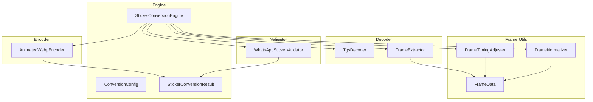
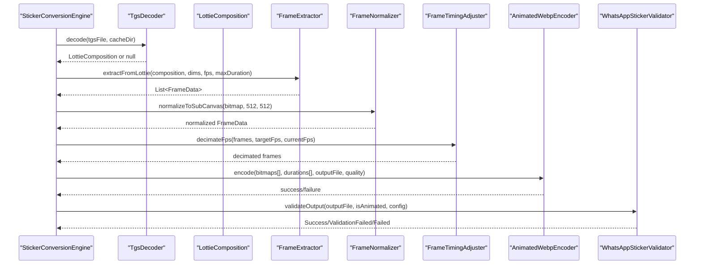
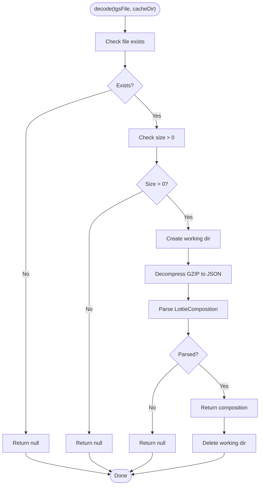
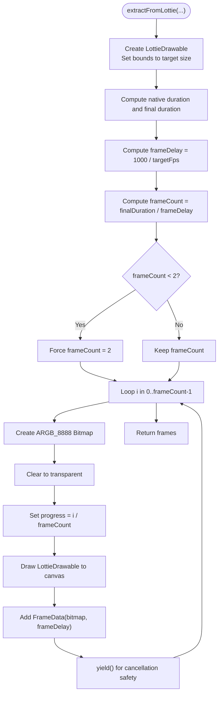
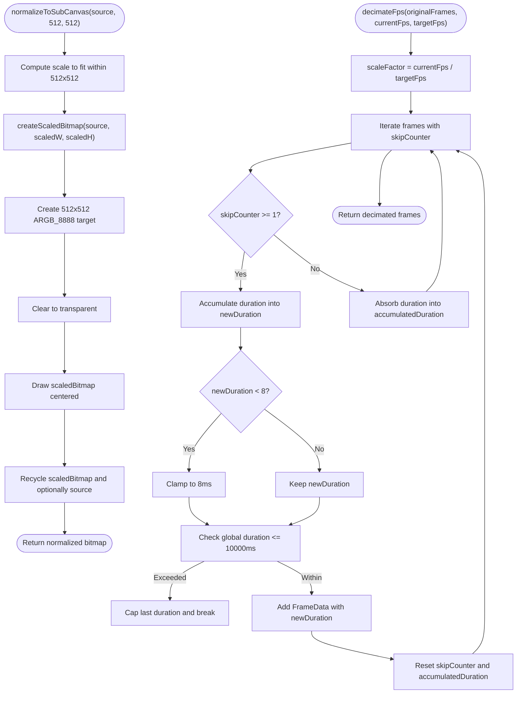
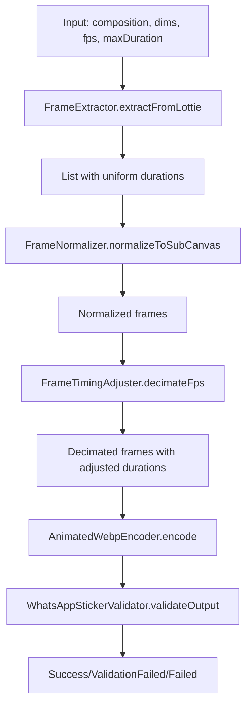
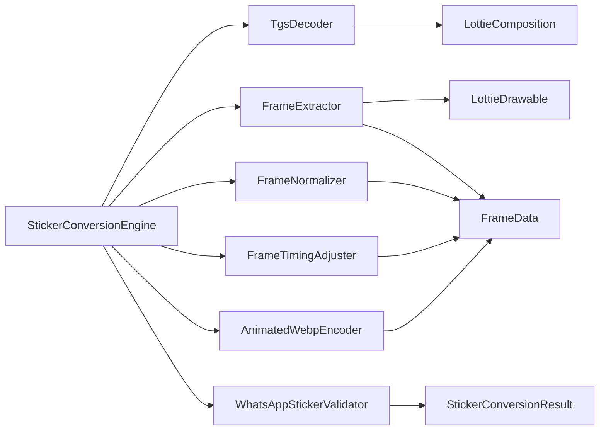

# TGS Animation Processing

<cite>
**Referenced Files in This Document**
- [TgsDecoder.kt](file://app/src/main/java/com/maheshsharan/tel2what/engine/decoder/TgsDecoder.kt)
- [FrameExtractor.kt](file://app/src/main/java/com/maheshsharan/tel2what/engine/decoder/FrameExtractor.kt)
- [FrameTimingAdjuster.kt](file://app/src/main/java/com/maheshsharan/tel2what/engine/frame/FrameTimingAdjuster.kt)
- [FrameNormalizer.kt](file://app/src/main/java/com/maheshsharan/tel2what/engine/frame/FrameNormalizer.kt)
- [FrameData.kt](file://app/src/main/java/com/maheshsharan/tel2what/engine/frame/FrameData.kt)
- [StickerConversionEngine.kt](file://app/src/main/java/com/maheshsharan/tel2what/engine/StickerConversionEngine.kt)
- [ConversionConfig.kt](file://app/src/main/java/com/maheshsharan/tel2what/engine/ConversionConfig.kt)
- [AnimatedWebpEncoder.kt](file://app/src/main/java/com/maheshsharan/tel2what/engine/encoder/AnimatedWebpEncoder.kt)
- [WhatsAppStickerValidator.kt](file://app/src/main/java/com/maheshsharan/tel2what/engine/WhatsAppStickerValidator.kt)
- [StickerConversionResult.kt](file://app/src/main/java/com/maheshsharan/tel2what/engine/StickerConversionResult.kt)
- [animated_pipe.md](file://assets/docs/animated_pipe.md)
- [README.md](file://README.md)
</cite>

## Table of Contents
1. [Introduction](#introduction)
2. [Project Structure](#project-structure)
3. [Core Components](#core-components)
4. [Architecture Overview](#architecture-overview)
5. [Detailed Component Analysis](#detailed-component-analysis)
6. [Dependency Analysis](#dependency-analysis)
7. [Performance Considerations](#performance-considerations)
8. [Troubleshooting Guide](#troubleshooting-guide)
9. [Conclusion](#conclusion)

## Introduction
This document explains the Telegram GIF (TGS) animation processing pipeline used by the application. It focuses on the TGS decoding and frame extraction mechanisms, the integration with the Lottie library, and the end-to-end conversion to WhatsApp-compliant animated stickers. It covers parsing and decoding TGS files, rendering Lottie compositions into discrete Bitmap frames, controlling frame rates and durations, normalization and timing adjustments, and quality optimization strategies.

## Project Structure
The TGS processing lives within the conversion engine and related modules:
- Decoder layer: TGS parsing and Lottie composition loading
- Frame extraction: Rendering Lottie frames into Bitmap sequences
- Frame utilities: Normalization and timing adjustments
- Encoder: Native WebP encoding
- Validator: WhatsApp compliance checks

**Diagram sources**
- [StickerConversionEngine.kt](file://app/src/main/java/com/maheshsharan/tel2what/engine/StickerConversionEngine.kt#L1-L275)
- [TgsDecoder.kt](file://app/src/main/java/com/maheshsharan/tel2what/engine/decoder/TgsDecoder.kt#L1-L94)
- [FrameExtractor.kt](file://app/src/main/java/com/maheshsharan/tel2what/engine/decoder/FrameExtractor.kt#L1-L100)
- [FrameNormalizer.kt](file://app/src/main/java/com/maheshsharan/tel2what/engine/frame/FrameNormalizer.kt#L1-L62)
- [FrameTimingAdjuster.kt](file://app/src/main/java/com/maheshsharan/tel2what/engine/frame/FrameTimingAdjuster.kt#L1-L72)
- [FrameData.kt](file://app/src/main/java/com/maheshsharan/tel2what/engine/frame/FrameData.kt#L1-L9)
- [AnimatedWebpEncoder.kt](file://app/src/main/java/com/maheshsharan/tel2what/engine/encoder/AnimatedWebpEncoder.kt#L1-L91)
- [WhatsAppStickerValidator.kt](file://app/src/main/java/com/maheshsharan/tel2what/engine/WhatsAppStickerValidator.kt#L1-L72)
- [StickerConversionResult.kt](file://app/src/main/java/com/maheshsharan/tel2what/engine/StickerConversionResult.kt#L1-L23)

**Section sources**
- [README.md](file://README.md#L98-L110)

## Core Components
- TgsDecoder: Validates and decompresses Telegram’s .tgs (GZIP JSON) into a LottieComposition synchronously.
- FrameExtractor: Renders LottieComposition frames into discrete, timed Bitmap frames at a target FPS and enforces duration limits.
- FrameNormalizer: Scales and letterboxes frames to a fixed 512x512 canvas with transparent padding.
- FrameTimingAdjuster: Decimates frames to reduce FPS while preserving total animation duration and respecting minimum frame durations.
- AnimatedWebpEncoder: JNI-based native encoder that writes an Animated WebP from a sequence of Bitmaps and durations.
- WhatsAppStickerValidator: Validates output file size, dimensions, and other constraints for WhatsApp compatibility.
- ConversionConfig: Centralized constraints for dimensions, durations, sizes, and FPS targets.

**Section sources**
- [TgsDecoder.kt](file://app/src/main/java/com/maheshsharan/tel2what/engine/decoder/TgsDecoder.kt#L1-L94)
- [FrameExtractor.kt](file://app/src/main/java/com/maheshsharan/tel2what/engine/decoder/FrameExtractor.kt#L1-L100)
- [FrameNormalizer.kt](file://app/src/main/java/com/maheshsharan/tel2what/engine/frame/FrameNormalizer.kt#L1-L62)
- [FrameTimingAdjuster.kt](file://app/src/main/java/com/maheshsharan/tel2what/engine/frame/FrameTimingAdjuster.kt#L1-L72)
- [AnimatedWebpEncoder.kt](file://app/src/main/java/com/maheshsharan/tel2what/engine/encoder/AnimatedWebpEncoder.kt#L1-L91)
- [WhatsAppStickerValidator.kt](file://app/src/main/java/com/maheshsharan/tel2what/engine/WhatsAppStickerValidator.kt#L1-L72)
- [ConversionConfig.kt](file://app/src/main/java/com/maheshsharan/tel2what/engine/ConversionConfig.kt#L1-L14)

## Architecture Overview
The animated sticker pipeline routes TGS files through a decoder, renders frames, normalizes and adjusts timing, then encodes to Animated WebP with adaptive quality and FPS targeting.

**Diagram sources**
- [StickerConversionEngine.kt](file://app/src/main/java/com/maheshsharan/tel2what/engine/StickerConversionEngine.kt#L131-L273)
- [TgsDecoder.kt](file://app/src/main/java/com/maheshsharan/tel2what/engine/decoder/TgsDecoder.kt#L21-L80)
- [FrameExtractor.kt](file://app/src/main/java/com/maheshsharan/tel2what/engine/decoder/FrameExtractor.kt#L24-L98)
- [FrameNormalizer.kt](file://app/src/main/java/com/maheshsharan/tel2what/engine/frame/FrameNormalizer.kt#L17-L60)
- [FrameTimingAdjuster.kt](file://app/src/main/java/com/maheshsharan/tel2what/engine/frame/FrameTimingAdjuster.kt#L16-L70)
- [AnimatedWebpEncoder.kt](file://app/src/main/java/com/maheshsharan/tel2what/engine/encoder/AnimatedWebpEncoder.kt#L32-L78)
- [WhatsAppStickerValidator.kt](file://app/src/main/java/com/maheshsharan/tel2what/engine/WhatsAppStickerValidator.kt#L14-L70)

## Detailed Component Analysis

### TgsDecoder Implementation
Purpose:
- Validate input file existence and size
- Decompress GZIP payload to JSON
- Parse JSON into a LottieComposition synchronously
- Log and handle errors, clean up intermediate files

Key behaviors:
- Uses GZIPInputStream to decompress .tgs to a temporary JSON file
- Loads LottieComposition via LottieCompositionFactory.fromJsonInputStreamSync
- Logs composition duration and bounds upon success
- Cleans up working directory after completion

**Diagram sources**
- [TgsDecoder.kt](file://app/src/main/java/com/maheshsharan/tel2what/engine/decoder/TgsDecoder.kt#L21-L80)

**Section sources**
- [TgsDecoder.kt](file://app/src/main/java/com/maheshsharan/tel2what/engine/decoder/TgsDecoder.kt#L13-L94)

### FrameExtractor Functionality
Purpose:
- Render LottieComposition frames into discrete Bitmaps at a target FPS
- Enforce maximum duration and ensure at least two frames
- Produce FrameData sequences with uniform durations

Processing logic:
- Creates a LottieDrawable and sets composition and bounds
- Computes final duration as min(native duration, max duration)
- Calculates frame delay from target FPS and frame count
- Iterates progress from 0 to 1, draws each frame onto a fresh ARGB_8888 canvas
- Accumulates frames with equal duration

**Diagram sources**
- [FrameExtractor.kt](file://app/src/main/java/com/maheshsharan/tel2what/engine/decoder/FrameExtractor.kt#L24-L98)

**Section sources**
- [FrameExtractor.kt](file://app/src/main/java/com/maheshsharan/tel2what/engine/decoder/FrameExtractor.kt#L13-L100)

### FrameNormalization and Timing Adjustment
Normalization:
- Scales arbitrary frames to fit within 512x512 while preserving aspect ratio
- Centers scaled content and fills letterboxed edges with transparency
- Recycles original bitmaps when replaced

Timing adjustment:
- Reduces FPS by decimating frames while accumulating durations
- Enforces minimum frame duration (hard constraint)
- Caps total animation duration at 10 seconds
- Preserves global timing across retained frames

**Diagram sources**
- [FrameNormalizer.kt](file://app/src/main/java/com/maheshsharan/tel2what/engine/frame/FrameNormalizer.kt#L17-L60)
- [FrameTimingAdjuster.kt](file://app/src/main/java/com/maheshsharan/tel2what/engine/frame/FrameTimingAdjuster.kt#L16-L70)

**Section sources**
- [FrameNormalizer.kt](file://app/src/main/java/com/maheshsharan/tel2what/engine/frame/FrameNormalizer.kt#L8-L62)
- [FrameTimingAdjuster.kt](file://app/src/main/java/com/maheshsharan/tel2what/engine/frame/FrameTimingAdjuster.kt#L5-L72)

### Animation Extraction Process and Constraints
- Frame rate control: Derived from target FPS; frame delay computed as 1000/targetFps
- Duration limits: Final duration is min(native duration, max duration); enforced at extraction and adjusted by timing adjuster
- Timing adjustments: Decimation preserves global duration and enforces minimum frame duration
- Quality optimization: Adaptive quality reduction and FPS floor to meet size constraints

**Diagram sources**
- [FrameExtractor.kt](file://app/src/main/java/com/maheshsharan/tel2what/engine/decoder/FrameExtractor.kt#L24-L98)
- [FrameNormalizer.kt](file://app/src/main/java/com/maheshsharan/tel2what/engine/frame/FrameNormalizer.kt#L17-L60)
- [FrameTimingAdjuster.kt](file://app/src/main/java/com/maheshsharan/tel2what/engine/frame/FrameTimingAdjuster.kt#L16-L70)
- [AnimatedWebpEncoder.kt](file://app/src/main/java/com/maheshsharan/tel2what/engine/encoder/AnimatedWebpEncoder.kt#L32-L78)
- [WhatsAppStickerValidator.kt](file://app/src/main/java/com/maheshsharan/tel2what/engine/WhatsAppStickerValidator.kt#L14-L70)

**Section sources**
- [FrameExtractor.kt](file://app/src/main/java/com/maheshsharan/tel2what/engine/decoder/FrameExtractor.kt#L20-L61)
- [FrameTimingAdjuster.kt](file://app/src/main/java/com/maheshsharan/tel2what/engine/frame/FrameTimingAdjuster.kt#L12-L50)
- [ConversionConfig.kt](file://app/src/main/java/com/maheshsharan/tel2what/engine/ConversionConfig.kt#L3-L13)

### Integration with Lottie Library
- TGS parsing uses LottieCompositionFactory.fromJsonInputStreamSync to load the composition
- Frame extraction uses LottieDrawable to render frames at specific progress values
- Composition metadata (duration and bounds) is logged and used for downstream decisions

Supported animation parameters:
- Composition duration and bounds influence frame count and extraction timing
- Frame delay and final duration are derived from target FPS and max duration

**Section sources**
- [TgsDecoder.kt](file://app/src/main/java/com/maheshsharan/tel2what/engine/decoder/TgsDecoder.kt#L48-L67)
- [FrameExtractor.kt](file://app/src/main/java/com/maheshsharan/tel2what/engine/decoder/FrameExtractor.kt#L39-L61)

### Quality Optimization Strategies
- Adaptive quality reduction: Starts low and increases until size target is met
- FPS floor: Drops FPS in steps to reduce frame count and size
- Minimum frame duration enforcement: Prevents overly rapid transitions
- Global duration cap: Ensures animations do not exceed 10 seconds

**Section sources**
- [StickerConversionEngine.kt](file://app/src/main/java/com/maheshsharan/tel2what/engine/StickerConversionEngine.kt#L194-L235)
- [FrameTimingAdjuster.kt](file://app/src/main/java/com/maheshsharan/tel2what/engine/frame/FrameTimingAdjuster.kt#L38-L50)

## Dependency Analysis
High-level dependencies among core components:

**Diagram sources**
- [StickerConversionEngine.kt](file://app/src/main/java/com/maheshsharan/tel2what/engine/StickerConversionEngine.kt#L1-L275)
- [TgsDecoder.kt](file://app/src/main/java/com/maheshsharan/tel2what/engine/decoder/TgsDecoder.kt#L1-L94)
- [FrameExtractor.kt](file://app/src/main/java/com/maheshsharan/tel2what/engine/decoder/FrameExtractor.kt#L1-L100)
- [FrameNormalizer.kt](file://app/src/main/java/com/maheshsharan/tel2what/engine/frame/FrameNormalizer.kt#L1-L62)
- [FrameTimingAdjuster.kt](file://app/src/main/java/com/maheshsharan/tel2what/engine/frame/FrameTimingAdjuster.kt#L1-L72)
- [AnimatedWebpEncoder.kt](file://app/src/main/java/com/maheshsharan/tel2what/engine/encoder/AnimatedWebpEncoder.kt#L1-L91)
- [WhatsAppStickerValidator.kt](file://app/src/main/java/com/maheshsharan/tel2what/engine/WhatsAppStickerValidator.kt#L1-L72)
- [StickerConversionResult.kt](file://app/src/main/java/com/maheshsharan/tel2what/engine/StickerConversionResult.kt#L1-L23)

**Section sources**
- [StickerConversionEngine.kt](file://app/src/main/java/com/maheshsharan/tel2what/engine/StickerConversionEngine.kt#L1-L275)

## Performance Considerations
- Memory management:
  - Temporary JSON decompression files are cleaned up immediately after parsing
  - Frames are recycled after encoding to prevent memory leaks
  - Bitmap recycling occurs in normalization and timing adjuster to reduce fragmentation
- Concurrency:
  - Animated pipeline is serialized (semaphore=1) to avoid thermal throttling and OOM on mid-tier devices
  - Static pipeline allows up to 4 concurrent workers
- Native encoding:
  - JNI bridge to libwebp reduces CPU overhead and improves throughput
- FPS and quality targeting:
  - Starts with reduced FPS and quality to quickly meet size constraints
  - Iteratively increases quality or drops FPS to balance size and smoothness

**Section sources**
- [TgsDecoder.kt](file://app/src/main/java/com/maheshsharan/tel2what/engine/decoder/TgsDecoder.kt#L71-L79)
- [StickerConversionEngine.kt](file://app/src/main/java/com/maheshsharan/tel2what/engine/StickerConversionEngine.kt#L23-L27)
- [FrameExtractor.kt](file://app/src/main/java/com/maheshsharan/tel2what/engine/decoder/FrameExtractor.kt#L92-L97)
- [FrameNormalizer.kt](file://app/src/main/java/com/maheshsharan/tel2what/engine/frame/FrameNormalizer.kt#L52-L57)
- [README.md](file://README.md#L32-L40)

## Troubleshooting Guide
Common issues and resolutions:
- TGS file missing or empty:
  - Decoder returns null; engine fails early with descriptive logs
- Lottie parsing failures:
  - JSON integrity or unsupported features cause parse exceptions; decoder logs and returns null
- Zero frames extracted:
  - WEBM decoder returns empty frames; engine fails with explicit message
- JNI encoding failures:
  - AnimatedWebpEncoder returns false; engine retries with lower quality or lower FPS
- Validation failures:
  - Output exceeds size or dimension limits; validator returns ValidationFailed with details

Operational tips:
- Ensure sufficient free storage for temporary files during extraction
- Monitor logs for “Cleaned up working directory” and “Encoded bytes written” to confirm successful stages
- Verify that the final file meets WhatsApp constraints before sharing

**Section sources**
- [TgsDecoder.kt](file://app/src/main/java/com/maheshsharan/tel2what/engine/decoder/TgsDecoder.kt#L25-L33)
- [FrameExtractor.kt](file://app/src/main/java/com/maheshsharan/tel2what/engine/decoder/FrameExtractor.kt#L89-L97)
- [AnimatedWebpEncoder.kt](file://app/src/main/java/com/maheshsharan/tel2what/engine/encoder/AnimatedWebpEncoder.kt#L38-L46)
- [WhatsAppStickerValidator.kt](file://app/src/main/java/com/maheshsharan/tel2what/engine/WhatsAppStickerValidator.kt#L19-L40)

## Conclusion
The TGS animation processing pipeline integrates Telegram’s .tgs format with Lottie rendering, normalizes frames to WhatsApp standards, and optimizes for smooth playback and size constraints. Through careful frame rate control, duration limits, timing adjustments, and adaptive quality/FPS targeting, the system reliably produces high-quality animated stickers that meet platform requirements while managing memory and performance efficiently.