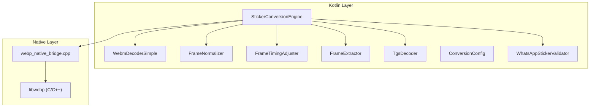
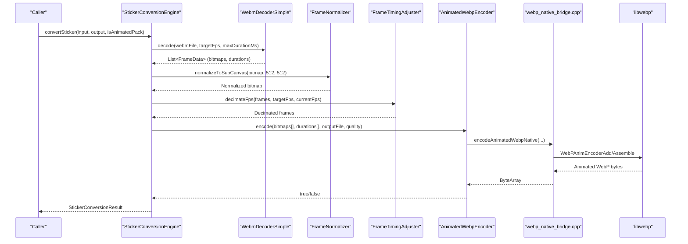
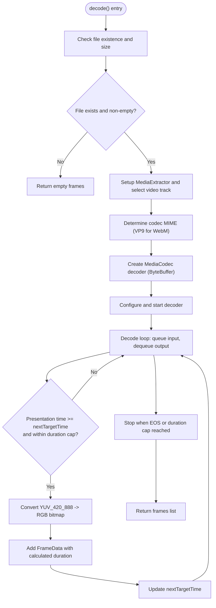
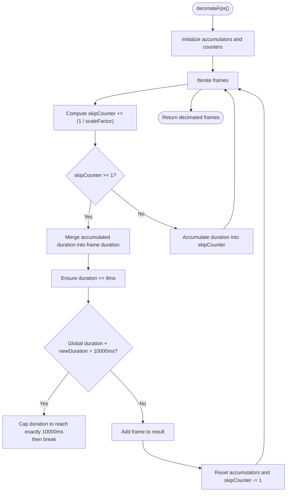
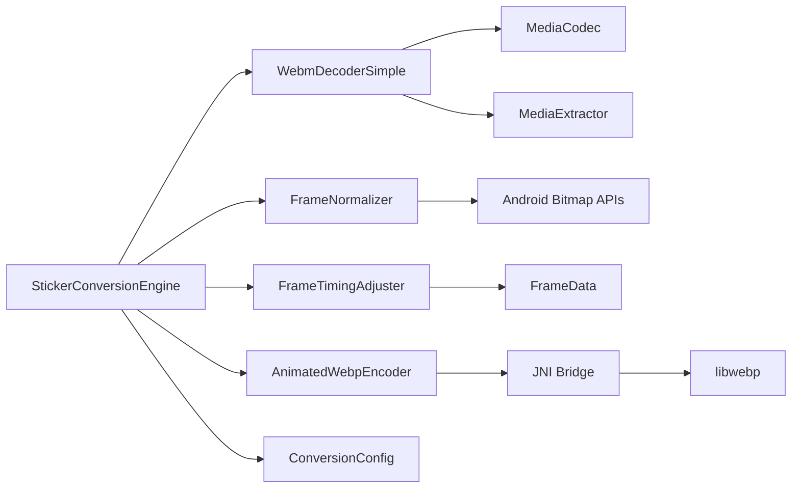

# WebM Video Processing

<cite>
**Referenced Files in This Document**
- [WebmDecoderSimple.kt](file://app/src/main/java/com/maheshsharan/tel2what/engine/decoder/WebmDecoderSimple.kt)
- [FrameNormalizer.kt](file://app/src/main/java/com/maheshsharan/tel2what/engine/frame/FrameNormalizer.kt)
- [FrameTimingAdjuster.kt](file://app/src/main/java/com/maheshsharan/tel2what/engine/frame/FrameTimingAdjuster.kt)
- [FrameExtractor.kt](file://app/src/main/java/com/maheshsharan/tel2what/engine/decoder/FrameExtractor.kt)
- [TgsDecoder.kt](file://app/src/main/java/com/maheshsharan/tel2what/engine/decoder/TgsDecoder.kt)
- [FrameData.kt](file://app/src/main/java/com/maheshsharan/tel2what/engine/frame/FrameData.kt)
- [StickerConversionEngine.kt](file://app/src/main/java/com/maheshsharan/tel2what/engine/StickerConversionEngine.kt)
- [ConversionConfig.kt](file://app/src/main/java/com/maheshsharan/tel2what/engine/ConversionConfig.kt)
- [AnimatedWebpEncoder.kt](file://app/src/main/java/com/maheshsharan/tel2what/engine/encoder/AnimatedWebpEncoder.kt)
- [webp_native_bridge.cpp](file://app/src/main/cpp/webp_native_bridge.cpp)
- [WhatsAppStickerValidator.kt](file://app/src/main/java/com/maheshsharan/tel2what/engine/WhatsAppStickerValidator.kt)
</cite>

## Table of Contents
1. [Introduction](#introduction)
2. [Project Structure](#project-structure)
3. [Core Components](#core-components)
4. [Architecture Overview](#architecture-overview)
5. [Detailed Component Analysis](#detailed-component-analysis)
6. [Dependency Analysis](#dependency-analysis)
7. [Performance Considerations](#performance-considerations)
8. [Troubleshooting Guide](#troubleshooting-guide)
9. [Conclusion](#conclusion)

## Introduction
This document explains the WebM video processing capabilities of the application, focusing on the WebmDecoderSimple implementation for extracting frames from WebM video files. It documents the frame normalization algorithms used to ensure consistent dimensions and quality across video frames, the FrameTimingAdjuster functionality for precise timing control and frame rate optimization, and the complete video decoding parameters, supported codecs, resolution handling, and frame extraction strategies. Additionally, it covers technical specifications for video processing workflows, memory management during video decoding, and performance optimization techniques for efficient video frame processing.

## Project Structure
The WebM processing pipeline is organized around Kotlin coroutines and native C/C++ encoding. The main components are:
- Decoder: WebmDecoderSimple for extracting frames from WebM videos
- Normalization: FrameNormalizer for consistent dimensions and quality
- Timing Control: FrameTimingAdjuster for FPS decimation and duration accumulation
- Encoder: AnimatedWebpEncoder with JNI bridge to libwebp
- Orchestrator: StickerConversionEngine coordinating the entire pipeline
- Configuration: ConversionConfig defining target dimensions, FPS, and size limits

**Diagram sources**
- [StickerConversionEngine.kt](file://app/src/main/java/com/maheshsharan/tel2what/engine/StickerConversionEngine.kt#L131-L273)
- [WebmDecoderSimple.kt](file://app/src/main/java/com/maheshsharan/tel2what/engine/decoder/WebmDecoderSimple.kt#L23-L192)
- [FrameNormalizer.kt](file://app/src/main/java/com/maheshsharan/tel2what/engine/frame/FrameNormalizer.kt#L17-L60)
- [FrameTimingAdjuster.kt](file://app/src/main/java/com/maheshsharan/tel2what/engine/frame/FrameTimingAdjuster.kt#L16-L70)
- [FrameExtractor.kt](file://app/src/main/java/com/maheshsharan/tel2what/engine/decoder/FrameExtractor.kt#L24-L98)
- [TgsDecoder.kt](file://app/src/main/java/com/maheshsharan/tel2what/engine/decoder/TgsDecoder.kt#L21-L79)
- [AnimatedWebpEncoder.kt](file://app/src/main/java/com/maheshsharan/tel2what/engine/encoder/AnimatedWebpEncoder.kt#L32-L78)
- [webp_native_bridge.cpp](file://app/src/main/cpp/webp_native_bridge.cpp#L14-L147)

**Section sources**
- [StickerConversionEngine.kt](file://app/src/main/java/com/maheshsharan/tel2what/engine/StickerConversionEngine.kt#L17-L88)
- [ConversionConfig.kt](file://app/src/main/java/com/maheshsharan/tel2what/engine/ConversionConfig.kt#L3-L13)

## Core Components
- WebmDecoderSimple: Extracts frames from WebM files using MediaExtractor and MediaCodec, converting YUV_420_888 output to RGB bitmaps and capturing frames at a target FPS.
- FrameNormalizer: Scales arbitrary bitmaps to a fixed 512x512 canvas with transparent letterboxing to meet WhatsApp constraints.
- FrameTimingAdjuster: Decimates frames to reduce FPS while preserving total animation duration and enforcing minimum frame duration constraints.
- AnimatedWebpEncoder: JNI bridge that encodes a sequence of ARGB_8888 bitmaps into an animated WebP using libwebp.
- StickerConversionEngine: Orchestrates the entire pipeline, routing inputs to the correct decoder, normalizing frames, adjusting timing, and encoding with quality/size constraints.
- ConversionConfig: Defines target dimensions, FPS, maximum sizes, and duration limits.

**Section sources**
- [WebmDecoderSimple.kt](file://app/src/main/java/com/maheshsharan/tel2what/engine/decoder/WebmDecoderSimple.kt#L20-L192)
- [FrameNormalizer.kt](file://app/src/main/java/com/maheshsharan/tel2what/engine/frame/FrameNormalizer.kt#L11-L60)
- [FrameTimingAdjuster.kt](file://app/src/main/java/com/maheshsharan/tel2what/engine/frame/FrameTimingAdjuster.kt#L8-L70)
- [AnimatedWebpEncoder.kt](file://app/src/main/java/com/maheshsharan/tel2what/engine/encoder/AnimatedWebpEncoder.kt#L8-L90)
- [StickerConversionEngine.kt](file://app/src/main/java/com/maheshsharan/tel2what/engine/StickerConversionEngine.kt#L17-L273)
- [ConversionConfig.kt](file://app/src/main/java/com/maheshsharan/tel2what/engine/ConversionConfig.kt#L3-L13)

## Architecture Overview
The WebM processing workflow follows a strict pipeline:
1. Input detection: The engine detects WebM or TGS inputs and routes accordingly.
2. Decoding: WebM files are decoded using MediaCodec; TGS files are decompressed and parsed into a Lottie composition.
3. Frame extraction: Frames are extracted either from the decoded WebM stream or from the Lottie composition.
4. Normalization: All frames are normalized to 512x512 with transparent letterboxing.
5. Timing adjustment: Frames are decimated to the target FPS while preserving total duration and enforcing minimum frame duration.
6. Encoding: Frames are encoded into an animated WebP using the native bridge and libwebp.
7. Validation: Output is validated against WhatsApp constraints.

**Diagram sources**
- [StickerConversionEngine.kt](file://app/src/main/java/com/maheshsharan/tel2what/engine/StickerConversionEngine.kt#L131-L273)
- [WebmDecoderSimple.kt](file://app/src/main/java/com/maheshsharan/tel2what/engine/decoder/WebmDecoderSimple.kt#L23-L192)
- [FrameNormalizer.kt](file://app/src/main/java/com/maheshsharan/tel2what/engine/frame/FrameNormalizer.kt#L17-L60)
- [FrameTimingAdjuster.kt](file://app/src/main/java/com/maheshsharan/tel2what/engine/frame/FrameTimingAdjuster.kt#L16-L70)
- [AnimatedWebpEncoder.kt](file://app/src/main/java/com/maheshsharan/tel2what/engine/encoder/AnimatedWebpEncoder.kt#L32-L78)
- [webp_native_bridge.cpp](file://app/src/main/cpp/webp_native_bridge.cpp#L14-L147)

## Detailed Component Analysis

### WebmDecoderSimple Implementation
WebmDecoderSimple extracts frames from WebM video files using MediaExtractor and MediaCodec. It:
- Selects the first video track from the container
- Determines the codec MIME type (VP9 for WebM, otherwise the container MIME)
- Creates a decoder and starts it in ByteBuffer mode (no surface rendering)
- Reads input samples and queues them to the decoder
- Captures output frames at target FPS by comparing presentation timestamps with a target time window
- Converts YUV_420_888 buffers to RGB bitmaps using YuvImage and JPEG compression
- Applies duration calculation based on presentation time differences and enforces minimum duration

Key parameters and behaviors:
- Target FPS drives frame capture intervals
- Duration cap limits processing to a maximum duration
- MIME type mapping ensures correct codec selection (VP9 for WebM)
- Fallback to VP8 decoder if VP9 fails
- Buffer size validation prevents malformed YUV_420_888 frames

**Diagram sources**
- [WebmDecoderSimple.kt](file://app/src/main/java/com/maheshsharan/tel2what/engine/decoder/WebmDecoderSimple.kt#L23-L192)

**Section sources**
- [WebmDecoderSimple.kt](file://app/src/main/java/com/maheshsharan/tel2what/engine/decoder/WebmDecoderSimple.kt#L20-L192)

### Frame Normalization Algorithms
FrameNormalizer scales arbitrary bitmaps to a fixed 512x512 canvas while maintaining aspect ratio and applying transparent letterboxing:
- Computes the maximum scale factor that fits within the target dimensions
- Scales the source bitmap to the scaled dimensions
- Creates a target ARGB_8888 bitmap initialized to transparent
- Draws the scaled bitmap centered on the target canvas
- Recycles intermediate bitmaps to reduce memory pressure

Constraints:
- Maintains aspect ratio perfectly
- Uses transparent padding for letterboxing
- Optimizes by avoiding unnecessary operations when dimensions match

**Section sources**
- [FrameNormalizer.kt](file://app/src/main/java/com/maheshsharan/tel2what/engine/frame/FrameNormalizer.kt#L11-L60)

### FrameTimingAdjuster Functionality
FrameTimingAdjuster reduces FPS by decimating frames while preserving total animation duration:
- Calculates a scale factor based on current and target FPS
- Accumulates durations across skipped frames
- Enforces a minimum frame duration of 8ms
- Caps total animation duration at 10,000ms
- Preserves global timing by distributing accumulated durations across retained frames

**Diagram sources**
- [FrameTimingAdjuster.kt](file://app/src/main/java/com/maheshsharan/tel2what/engine/frame/FrameTimingAdjuster.kt#L16-L70)

**Section sources**
- [FrameTimingAdjuster.kt](file://app/src/main/java/com/maheshsharan/tel2what/engine/frame/FrameTimingAdjuster.kt#L8-L70)

### Video Decoding Parameters and Supported Codecs
- Supported container: video/webm
- Codec mapping: WebM -> video/x-vnd.on2.vp9; otherwise use container MIME
- Fallback: If VP9 creation fails, attempts VP8 decoder
- Resolution handling: Uses MediaFormat KEY_WIDTH and KEY_HEIGHT
- Duration handling: Uses MediaFormat KEY_DURATION and caps at maxDurationMs
- Frame capture: Targets frames at 1000/targetFps milliseconds intervals

**Section sources**
- [WebmDecoderSimple.kt](file://app/src/main/java/com/maheshsharan/tel2what/engine/decoder/WebmDecoderSimple.kt#L69-L81)
- [WebmDecoderSimple.kt](file://app/src/main/java/com/maheshsharan/tel2what/engine/decoder/WebmDecoderSimple.kt#L194-L203)

### Frame Extraction Strategies
- WebM: Decodes via MediaCodec, captures frames at target FPS, converts YUV to RGB
- Lottie (TGS): Renders frames directly to 512x512 ARGB_8888 bitmaps with transparent backgrounds
- Both strategies enforce a minimum frame count of 2 for animated stickers

**Section sources**
- [WebmDecoderSimple.kt](file://app/src/main/java/com/maheshsharan/tel2what/engine/decoder/WebmDecoderSimple.kt#L106-L179)
- [FrameExtractor.kt](file://app/src/main/java/com/maheshsharan/tel2what/engine/decoder/FrameExtractor.kt#L24-L98)

### Technical Specifications for Video Processing Workflows
- Target dimensions: 512x512
- Target FPS: 10
- Maximum animation duration: 10,000ms
- Maximum animated file size: 500KB
- Minimum frame duration: 8ms
- Animation loops infinitely (loop_count = 0)

**Section sources**
- [ConversionConfig.kt](file://app/src/main/java/com/maheshsharan/tel2what/engine/ConversionConfig.kt#L3-L13)
- [webp_native_bridge.cpp](file://app/src/main/cpp/webp_native_bridge.cpp#L35-L36)

### Memory Management During Video Decoding
- Immediate resource cleanup: MediaCodec and MediaExtractor are released in finally blocks
- Bitmap recycling: Frames are recycled after use to prevent memory leaks
- Intermediate bitmap recycling: Normalizer recycles scaled bitmaps to reduce fragmentation
- JNI memory safety: Proper locking/unlocking of bitmap pixels and freeing of WebPPicture structures

**Section sources**
- [WebmDecoderSimple.kt](file://app/src/main/java/com/maheshsharan/tel2what/engine/decoder/WebmDecoderSimple.kt#L187-L190)
- [FrameNormalizer.kt](file://app/src/main/java/com/maheshsharan/tel2what/engine/frame/FrameNormalizer.kt#L52-L57)
- [webp_native_bridge.cpp](file://app/src/main/cpp/webp_native_bridge.cpp#L96-L111)

### Performance Optimization Techniques
- Concurrency control: Animated pipeline runs with a semaphore permit to prevent thermal throttling
- Quality degradation loop: Starts with higher quality and lowers quality in steps to achieve size targets
- FPS reduction loop: If quality is exhausted, reduces FPS in steps to meet size constraints
- Early termination: Stops when file size is within limits or when FPS drops below 5
- Efficient YUV conversion: Uses YuvImage and JPEG compression for fast RGB conversion

**Section sources**
- [StickerConversionEngine.kt](file://app/src/main/java/com/maheshsharan/tel2what/engine/StickerConversionEngine.kt#L23-L27)
- [StickerConversionEngine.kt](file://app/src/main/java/com/maheshsharan/tel2what/engine/StickerConversionEngine.kt#L194-L235)

## Dependency Analysis
The WebM processing pipeline depends on:
- Android MediaExtractor/MediaCodec for hardware-accelerated decoding
- libwebp for animated WebP encoding via JNI
- Lottie for TGS (Telegram Animated Stickers) support
- Android Bitmap APIs for pixel manipulation and drawing

**Diagram sources**
- [WebmDecoderSimple.kt](file://app/src/main/java/com/maheshsharan/tel2what/engine/decoder/WebmDecoderSimple.kt#L43-L108)
- [FrameNormalizer.kt](file://app/src/main/java/com/maheshsharan/tel2what/engine/frame/FrameNormalizer.kt#L17-L60)
- [FrameTimingAdjuster.kt](file://app/src/main/java/com/maheshsharan/tel2what/engine/frame/FrameTimingAdjuster.kt#L16-L70)
- [AnimatedWebpEncoder.kt](file://app/src/main/java/com/maheshsharan/tel2what/engine/encoder/AnimatedWebpEncoder.kt#L32-L78)
- [webp_native_bridge.cpp](file://app/src/main/cpp/webp_native_bridge.cpp#L14-L147)
- [StickerConversionEngine.kt](file://app/src/main/java/com/maheshsharan/tel2what/engine/StickerConversionEngine.kt#L131-L273)

**Section sources**
- [StickerConversionEngine.kt](file://app/src/main/java/com/maheshsharan/tel2what/engine/StickerConversionEngine.kt#L17-L88)

## Performance Considerations
- Use VP9 for WebM when available; fall back to VP8 if needed
- Prefer ByteBuffer mode for MediaCodec to avoid format mismatches
- Normalize frames to 512x512 to minimize downstream processing overhead
- Reduce FPS first, then quality to meet size constraints efficiently
- Ensure minimum frame duration of 8ms to satisfy platform constraints
- Monitor total animation duration to stay within 10,000ms

[No sources needed since this section provides general guidance]

## Troubleshooting Guide
Common issues and resolutions:
- Decoder creation failures: The decoder attempts VP9 first, then VP8; if both fail, decoding stops early
- Empty or missing files: The pipeline returns empty lists or fails early with logs
- YUV conversion errors: Buffer size validation prevents malformed frames; logs indicate conversion failures
- JNI encoding failures: Logs indicate encoder errors; ensure bitmaps are ARGB_8888 and dimensions match
- Size constraints exceeded: The engine reduces quality or FPS until under 500KB

**Section sources**
- [WebmDecoderSimple.kt](file://app/src/main/java/com/maheshsharan/tel2what/engine/decoder/WebmDecoderSimple.kt#L90-L102)
- [WebmDecoderSimple.kt](file://app/src/main/java/com/maheshsharan/tel2what/engine/decoder/WebmDecoderSimple.kt#L205-L254)
- [AnimatedWebpEncoder.kt](file://app/src/main/java/com/maheshsharan/tel2what/engine/encoder/AnimatedWebpEncoder.kt#L32-L78)
- [webp_native_bridge.cpp](file://app/src/main/cpp/webp_native_bridge.cpp#L66-L111)

## Conclusion
The WebM video processing pipeline integrates Android’s MediaCodec for efficient decoding, robust normalization and timing control for consistent output, and a native WebP encoder for high-performance animated sticker generation. By combining hardware acceleration, careful memory management, and adaptive quality/FPS tuning, the system reliably produces animated stickers within platform constraints.