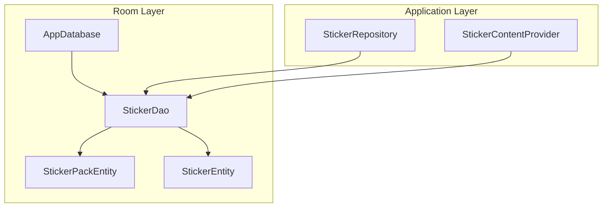
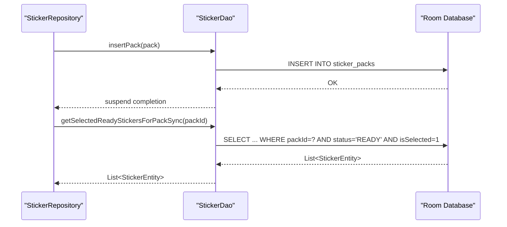
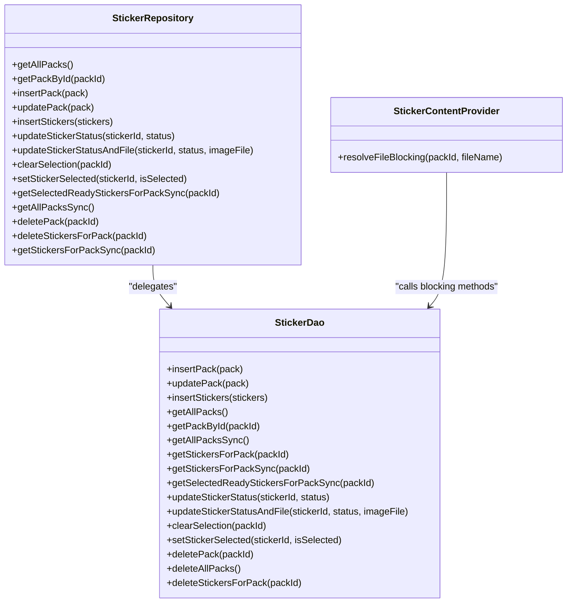

# DAO Operations and Data Access

<cite>
**Referenced Files in This Document**
- [StickerDao.kt](file://app/src/main/java/com/maheshsharan/tel2what/data/local/dao/StickerDao.kt)
- [StickerEntity.kt](file://app/src/main/java/com/maheshsharan/tel2what/data/local/entity/StickerEntity.kt)
- [StickerPackEntity.kt](file://app/src/main/java/com/maheshsharan/tel2what/data/local/entity/StickerPackEntity.kt)
- [AppDatabase.kt](file://app/src/main/java/com/maheshsharan/tel2what/data/local/AppDatabase.kt)
- [StickerRepository.kt](file://app/src/main/java/com/maheshsharan/tel2what/data/repository/StickerRepository.kt)
- [StickerContentProvider.kt](file://app/src/main/java/com/maheshsharan/tel2what/provider/StickerContentProvider.kt)
</cite>

## Table of Contents
1. [Introduction](#introduction)
2. [Project Structure](#project-structure)
3. [Core Components](#core-components)
4. [Architecture Overview](#architecture-overview)
5. [Detailed Component Analysis](#detailed-component-analysis)
6. [Dependency Analysis](#dependency-analysis)
7. [Performance Considerations](#performance-considerations)
8. [Troubleshooting Guide](#troubleshooting-guide)
9. [Conclusion](#conclusion)

## Introduction
This document describes the Data Access Object (DAO) layer responsible for all database operations related to sticker packs and stickers. It covers CRUD operations, query methods for retrieving sticker packs with associated stickers, filtering by selection and readiness, and batch operations. It also explains the use of coroutines and suspend functions for asynchronous database operations, custom SQL queries and parameter binding, error handling strategies, transaction management, and performance considerations such as query execution plans and indexing utilization.

## Project Structure
The DAO layer is implemented using Android Room. The relevant components are:
- DAO interface defining all database operations for sticker packs and stickers
- Entities representing the database schema for packs and stickers
- App database class configuring Room and migrations
- Repository delegating higher-level operations to the DAO
- Content Provider using blocking DAO methods for legacy compatibility

**Diagram sources**
- [AppDatabase.kt](file://app/src/main/java/com/maheshsharan/tel2what/data/local/AppDatabase.kt#L13-L41)
- [StickerDao.kt](file://app/src/main/java/com/maheshsharan/tel2what/data/local/dao/StickerDao.kt#L13-L80)
- [StickerEntity.kt](file://app/src/main/java/com/maheshsharan/tel2what/data/local/entity/StickerEntity.kt#L8-L28)
- [StickerPackEntity.kt](file://app/src/main/java/com/maheshsharan/tel2what/data/local/entity/StickerPackEntity.kt#L6-L21)
- [StickerRepository.kt](file://app/src/main/java/com/maheshsharan/tel2what/data/repository/StickerRepository.kt#L10-L79)
- [StickerContentProvider.kt](file://app/src/main/java/com/maheshsharan/tel2what/provider/StickerContentProvider.kt#L220-L235)

**Section sources**
- [AppDatabase.kt](file://app/src/main/java/com/maheshsharan/tel2what/data/local/AppDatabase.kt#L13-L41)
- [StickerDao.kt](file://app/src/main/java/com/maheshsharan/tel2what/data/local/dao/StickerDao.kt#L13-L80)
- [StickerEntity.kt](file://app/src/main/java/com/maheshsharan/tel2what/data/local/entity/StickerEntity.kt#L8-L28)
- [StickerPackEntity.kt](file://app/src/main/java/com/maheshsharan/tel2what/data/local/entity/StickerPackEntity.kt#L6-L21)
- [StickerRepository.kt](file://app/src/main/java/com/maheshsharan/tel2what/data/repository/StickerRepository.kt#L10-L79)
- [StickerContentProvider.kt](file://app/src/main/java/com/maheshsharan/tel2what/provider/StickerContentProvider.kt#L220-L235)

## Core Components
- StickerDao: Declares all database operations for sticker packs and stickers, including inserts, updates, deletes, selects, and filtering. Methods are annotated for Room to generate SQL and support coroutines via suspend functions and Flow emissions.
- StickerPackEntity: Defines the schema for sticker packs stored in the sticker_packs table.
- StickerEntity: Defines the schema for stickers stored in the stickers table, including a foreign key relationship to packs and an index on packId for efficient joins.
- AppDatabase: Configures Room, exposes the DAO, and manages migrations.
- StickerRepository: Exposes higher-level operations delegating to DAO methods.
- StickerContentProvider: Uses blocking DAO methods for legacy compatibility in a ContentProvider context.

**Section sources**
- [StickerDao.kt](file://app/src/main/java/com/maheshsharan/tel2what/data/local/dao/StickerDao.kt#L13-L80)
- [StickerEntity.kt](file://app/src/main/java/com/maheshsharan/tel2what/data/local/entity/StickerEntity.kt#L8-L28)
- [StickerPackEntity.kt](file://app/src/main/java/com/maheshsharan/tel2what/data/local/entity/StickerPackEntity.kt#L6-L21)
- [AppDatabase.kt](file://app/src/main/java/com/maheshsharan/tel2what/data/local/AppDatabase.kt#L13-L41)
- [StickerRepository.kt](file://app/src/main/java/com/maheshsharan/tel2what/data/repository/StickerRepository.kt#L10-L79)
- [StickerContentProvider.kt](file://app/src/main/java/com/maheshsharan/tel2what/provider/StickerContentProvider.kt#L220-L235)

## Architecture Overview
The DAO layer sits between the repository and the Room database. The repository orchestrates higher-level operations and delegates persistence to the DAO. The Content Provider uses DAO methods directly for legacy compatibility, relying on blocking variants where coroutines are not applicable.

**Diagram sources**
- [StickerRepository.kt](file://app/src/main/java/com/maheshsharan/tel2what/data/repository/StickerRepository.kt#L32-L62)
- [StickerDao.kt](file://app/src/main/java/com/maheshsharan/tel2what/data/local/dao/StickerDao.kt#L16-L25)
- [StickerDao.kt](file://app/src/main/java/com/maheshsharan/tel2what/data/local/dao/StickerDao.kt#L53-L58)

## Detailed Component Analysis

### StickerDao: CRUD and Query Methods
- Insert operations
  - insertPack(pack): Inserts or replaces a sticker pack record.
  - insertStickers(stickers): Inserts or replaces sticker records in batch, returning an array of row IDs.
- Update operations
  - updatePack(pack): Safely updates an existing pack row without triggering foreign key cascade.
  - updateStickerStatus(stickerId, status): Updates the status of a sticker.
  - updateStickerStatusAndFile(stickerId, status, imageFile): Updates status and image file path in one operation.
  - clearSelection(packId): Resets selection flag for all stickers in a pack.
  - setStickerSelected(stickerId, isSelected): Sets selection flag for a specific sticker.
- Delete operations
  - deletePack(packId): Removes a sticker pack by identifier.
  - deleteAllPacks(): Removes all sticker packs.
  - deleteStickersForPack(packId): Removes all stickers belonging to a pack.
- Select operations
  - getAllPacks(): Returns a Flow of all sticker packs for reactive UI updates.
  - getPackById(packId): Retrieves a single pack by identifier.
  - getAllPacksSync(): Synchronous retrieval of all packs.
  - getStickersForPack(packId): Returns a Flow of stickers for a given pack.
  - getStickersForPackSync(packId): Synchronous retrieval of stickers for a pack.
  - getSelectedReadyStickersForPackSync(packId): Filters stickers by readiness and selection status.
- Blocking variants for ContentProvider
  - getAllPacksSyncBlocking(), getPackByIdBlocking(), getStickersForPackSyncBlocking(), getSelectedReadyStickersForPackSyncBlocking()

Notes on conflict resolution:
- Insert methods use REPLACE strategy to handle duplicates by replacing existing rows.

Notes on transactions:
- No explicit @Transaction methods are declared in the DAO interface. Complex multi-step operations should be performed within a Room Transaction block at the caller level if needed.

**Section sources**
- [StickerDao.kt](file://app/src/main/java/com/maheshsharan/tel2what/data/local/dao/StickerDao.kt#L16-L25)
- [StickerDao.kt](file://app/src/main/java/com/maheshsharan/tel2what/data/local/dao/StickerDao.kt#L21-L22)
- [StickerDao.kt](file://app/src/main/java/com/maheshsharan/tel2what/data/local/dao/StickerDao.kt#L60-L70)
- [StickerDao.kt](file://app/src/main/java/com/maheshsharan/tel2what/data/local/dao/StickerDao.kt#L72-L79)
- [StickerDao.kt](file://app/src/main/java/com/maheshsharan/tel2what/data/local/dao/StickerDao.kt#L27-L34)
- [StickerDao.kt](file://app/src/main/java/com/maheshsharan/tel2what/data/local/dao/StickerDao.kt#L37-L41)
- [StickerDao.kt](file://app/src/main/java/com/maheshsharan/tel2what/data/local/dao/StickerDao.kt#L43-L51)
- [StickerDao.kt](file://app/src/main/java/com/maheshsharan/tel2what/data/local/dao/StickerDao.kt#L53-L58)

### Entities: Schema and Indices
- StickerPackEntity
  - Table: sticker_packs
  - Primary key: identifier
  - Fields: name, publisher, trayImageFile, publisherEmail, publisherWebsite, privacyPolicyWebsite, licenseAgreementWebsite, animatedStickerPack, imageDataVersion, avoidCache, sizeBytes, dateAdded
- StickerEntity
  - Table: stickers
  - Primary key: id (auto-generated)
  - Foreign key: packId references sticker_packs.identifier with CASCADE delete
  - Index: packId for efficient joins and filtering
  - Fields: packId, imageFile, emojis, accessibilityText, status, isSelected

These definitions enable efficient queries by packId and maintain referential integrity.

**Section sources**
- [StickerPackEntity.kt](file://app/src/main/java/com/maheshsharan/tel2what/data/local/entity/StickerPackEntity.kt#L6-L21)
- [StickerEntity.kt](file://app/src/main/java/com/maheshsharan/tel2what/data/local/entity/StickerEntity.kt#L8-L28)

### AppDatabase: Configuration and Migration
- Database version: 2
- Entities: StickerPackEntity, StickerEntity
- Migration 1→2: Adds isSelected column to stickers with NOT NULL default 0
- Builder: Configures Room database with a singleton instance and migration support

**Section sources**
- [AppDatabase.kt](file://app/src/main/java/com/maheshsharan/tel2what/data/local/AppDatabase.kt#L13-L41)

### Repository and ContentProvider Integration
- StickerRepository delegates all DAO calls to StickerDao, exposing suspend functions and Flow emissions to the rest of the app.
- StickerContentProvider uses blocking DAO methods for legacy compatibility, ensuring thread-safe synchronous access in a ContentProvider context.

**Section sources**
- [StickerRepository.kt](file://app/src/main/java/com/maheshsharan/tel2what/data/repository/StickerRepository.kt#L10-L79)
- [StickerContentProvider.kt](file://app/src/main/java/com/maheshsharan/tel2what/provider/StickerContentProvider.kt#L220-L235)

### Query Methods and Filtering
- Retrieve packs with associated stickers
  - Use getStickersForPack(packId) for reactive lists or getStickersForPackSync(packId) for immediate results.
- Filter by selection status and readiness
  - Use getSelectedReadyStickersForPackSync(packId) to obtain stickers that are both ready and selected.
- Batch operations
  - Use insertStickers(stickers) to insert multiple stickers efficiently.

Parameter binding is handled by Room’s query annotations, which bind method parameters to SQL placeholders safely.

**Section sources**
- [StickerDao.kt](file://app/src/main/java/com/maheshsharan/tel2what/data/local/dao/StickerDao.kt#L43-L51)
- [StickerDao.kt](file://app/src/main/java/com/maheshsharan/tel2what/data/local/dao/StickerDao.kt#L53-L58)
- [StickerDao.kt](file://app/src/main/java/com/maheshsharan/tel2what/data/local/dao/StickerDao.kt#L24-L25)

### Coroutines and Suspend Functions
- DAO methods are declared as suspend functions or return Flow, enabling asynchronous database operations without blocking the main thread.
- Repository methods delegate to DAO methods, preserving coroutine context for callers.
- Blocking variants are provided for ContentProvider contexts where coroutines are not applicable.

**Section sources**
- [StickerDao.kt](file://app/src/main/java/com/maheshsharan/tel2what/data/local/dao/StickerDao.kt#L16-L25)
- [StickerDao.kt](file://app/src/main/java/com/maheshsharan/tel2what/data/local/dao/StickerDao.kt#L27-L34)
- [StickerDao.kt](file://app/src/main/java/com/maheshsharan/tel2what/data/local/dao/StickerDao.kt#L43-L51)
- [StickerDao.kt](file://app/src/main/java/com/maheshsharan/tel2what/data/local/dao/StickerDao.kt#L53-L58)
- [StickerRepository.kt](file://app/src/main/java/com/maheshsharan/tel2what/data/repository/StickerRepository.kt#L16-L79)
- [StickerContentProvider.kt](file://app/src/main/java/com/maheshsharan/tel2what/provider/StickerContentProvider.kt#L220-L235)

### Transaction Management and Conflict Resolution
- Conflict resolution
  - Insert operations use REPLACE to handle duplicates by replacing existing rows.
- Transactions
  - No @Transaction methods are declared in the DAO interface. For multi-step operations requiring atomicity, wrap calls in a Room Transaction block at the caller level (e.g., repository or service) as needed.

**Section sources**
- [StickerDao.kt](file://app/src/main/java/com/maheshsharan/tel2what/data/local/dao/StickerDao.kt#L16-L25)

### Error Handling Strategies
- Network and conversion errors are handled in dedicated layers (network and engine). DAO operations themselves are straightforward SQL statements and do not include explicit try/catch blocks.
- For robustness, callers should wrap DAO invocations in try/catch blocks when necessary, particularly around batch inserts and updates.

[No sources needed since this section provides general guidance]

## Dependency Analysis
The DAO depends on Room annotations and entities. The repository depends on the DAO. The Content Provider depends on DAO methods for legacy compatibility.

**Diagram sources**
- [StickerDao.kt](file://app/src/main/java/com/maheshsharan/tel2what/data/local/dao/StickerDao.kt#L13-L80)
- [StickerRepository.kt](file://app/src/main/java/com/maheshsharan/tel2what/data/repository/StickerRepository.kt#L10-L79)
- [StickerContentProvider.kt](file://app/src/main/java/com/maheshsharan/tel2what/provider/StickerContentProvider.kt#L220-L235)

**Section sources**
- [StickerDao.kt](file://app/src/main/java/com/maheshsharan/tel2what/data/local/dao/StickerDao.kt#L13-L80)
- [StickerRepository.kt](file://app/src/main/java/com/maheshsharan/tel2what/data/repository/StickerRepository.kt#L10-L79)
- [StickerContentProvider.kt](file://app/src/main/java/com/maheshsharan/tel2what/provider/StickerContentProvider.kt#L220-L235)

## Performance Considerations
- Query execution plans
  - Room compiles queries at compile-time. Use EXPLAIN QUERY PLAN or database profiling tools to inspect execution plans for complex queries.
- Index utilization
  - The stickers table has an index on packId, optimizing queries filtered by packId such as getStickersForPack and getSelectedReadyStickersForPackSync.
- Query optimization techniques
  - Prefer indexed columns in WHERE clauses (e.g., packId).
  - Use LIMIT when retrieving a single row (e.g., getPackById).
  - Batch inserts via insertStickers to reduce round-trips.
- Asynchronous operations
  - Use suspend functions and Flow to avoid blocking the main thread and improve responsiveness.
- Transaction management
  - Group related operations (insert/update/delete) within a Room Transaction block to minimize overhead and ensure atomicity.

[No sources needed since this section provides general guidance]

## Troubleshooting Guide
- Sticker selection not persisting
  - Verify isSelected updates via setStickerSelected and clearSelection. Confirm migration added the isSelected column.
- Stickers not appearing after pack import
  - Ensure insertStickers was called with the correct packId and that foreign keys are intact.
- Performance issues on large packs
  - Confirm queries filter by packId and leverage the packId index. Consider pagination or limiting results where appropriate.
- Blocking vs. suspend behavior
  - For ContentProvider, use blocking DAO methods. For UI flows, prefer suspend functions and Flow.

**Section sources**
- [AppDatabase.kt](file://app/src/main/java/com/maheshsharan/tel2what/data/local/AppDatabase.kt#L21-L25)
- [StickerDao.kt](file://app/src/main/java/com/maheshsharan/tel2what/data/local/dao/StickerDao.kt#L66-L70)
- [StickerContentProvider.kt](file://app/src/main/java/com/maheshsharan/tel2what/provider/StickerContentProvider.kt#L220-L235)

## Conclusion
The DAO layer provides a clean, asynchronous interface for managing sticker packs and stickers. It leverages Room’s compile-time safety, Flow for reactive updates, and custom SQL for optimized queries. By using indexed columns, batch operations, and suspend functions, the layer supports responsive UIs and efficient data handling. For complex multi-step operations, wrap DAO calls in Room Transaction blocks to ensure atomicity and consistency.