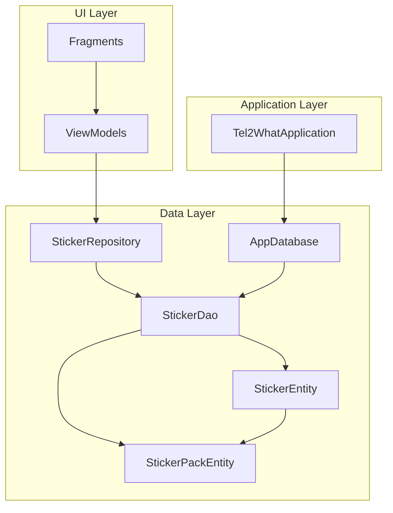
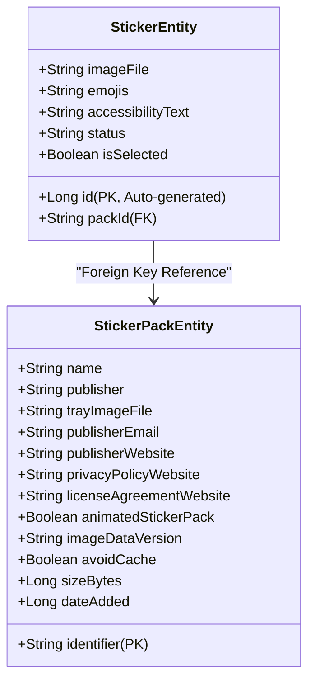
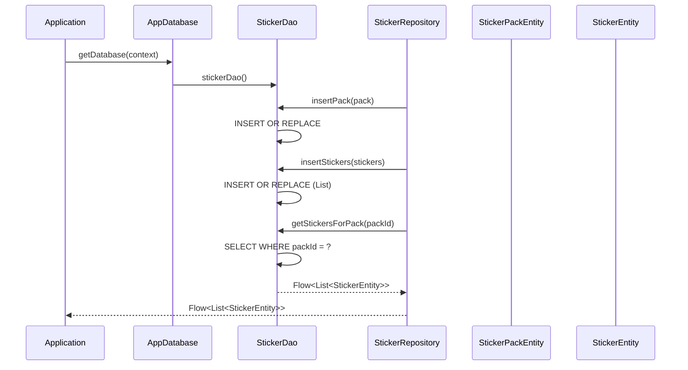
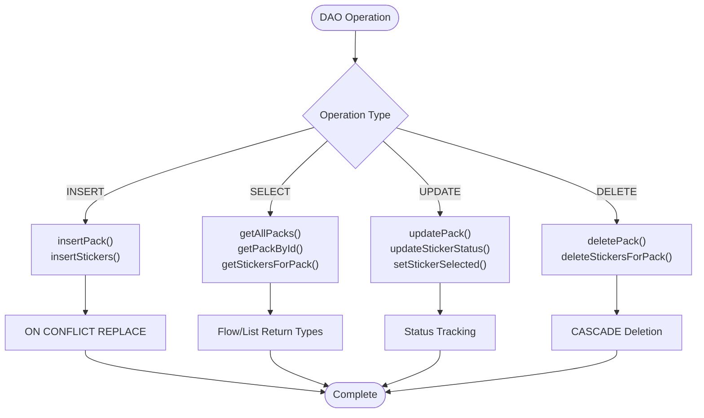
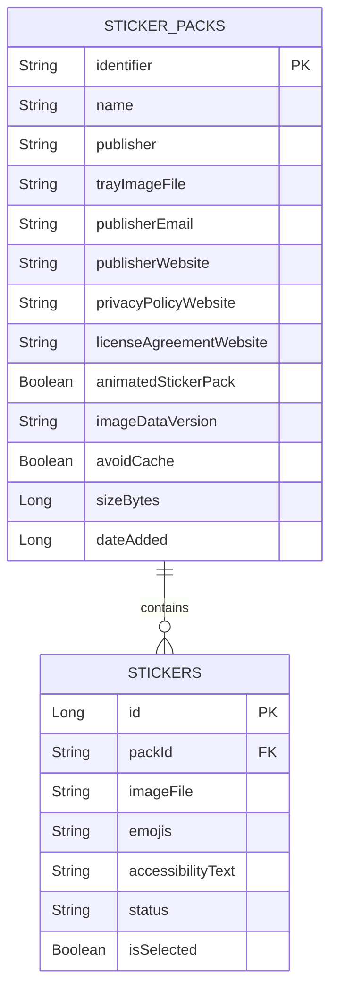
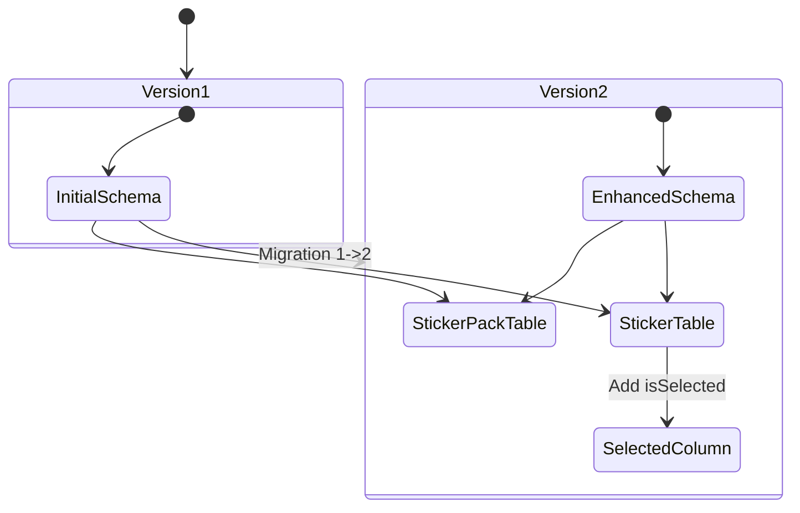
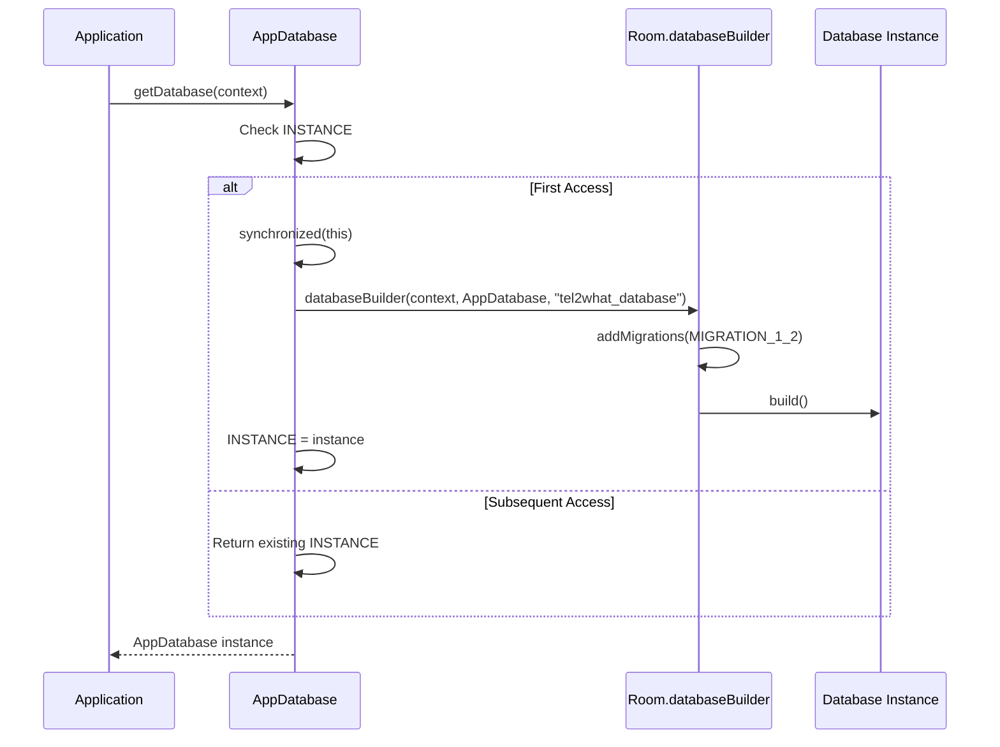

# Database Schema Design

<cite>
**Referenced Files in This Document**
- [AppDatabase.kt](file://app/src/main/java/com/maheshsharan/tel2what/data/local/AppDatabase.kt)
- [StickerPackEntity.kt](file://app/src/main/java/com/maheshsharan/tel2what/data/local/entity/StickerPackEntity.kt)
- [StickerEntity.kt](file://app/src/main/java/com/maheshsharan/tel2what/data/local/entity/StickerEntity.kt)
- [StickerDao.kt](file://app/src/main/java/com/maheshsharan/tel2what/data/local/dao/StickerDao.kt)
- [StickerRepository.kt](file://app/src/main/java/com/maheshsharan/tel2what/data/repository/StickerRepository.kt)
- [Tel2WhatApplication.kt](file://app/src/main/java/com/maheshsharan/tel2what/Tel2WhatApplication.kt)
</cite>

## Table of Contents
1. [Introduction](#introduction)
2. [Project Structure](#project-structure)
3. [Core Components](#core-components)
4. [Architecture Overview](#architecture-overview)
5. [Detailed Component Analysis](#detailed-component-analysis)
6. [Entity Relationship Analysis](#entity-relationship-analysis)
7. [Database Versioning and Migration](#database-versioning-and-migration)
8. [Indexing Strategies](#indexing-strategies)
9. [Data Integrity and Constraints](#data-integrity-and-constraints)
10. [Database Initialization Process](#database-initialization-process)
11. [Performance Considerations](#performance-considerations)
12. [Troubleshooting Guide](#troubleshooting-guide)
13. [Conclusion](#conclusion)

## Introduction

This document provides comprehensive documentation for the Room database schema design used in the Tel2What sticker application. The database manages sticker packs and individual stickers with support for animated stickers, selection tracking, and status management. The schema design emphasizes referential integrity, efficient querying, and smooth database migrations.

## Project Structure

The database implementation follows a clean architecture pattern with clear separation of concerns:

**Diagram sources**
- [AppDatabase.kt](file://app/src/main/java/com/maheshsharan/tel2what/data/local/AppDatabase.kt#L13-L15)
- [StickerRepository.kt](file://app/src/main/java/com/maheshsharan/tel2what/data/repository/StickerRepository.kt#L10-L14)

**Section sources**
- [AppDatabase.kt](file://app/src/main/java/com/maheshsharan/tel2what/data/local/AppDatabase.kt#L1-L42)
- [StickerRepository.kt](file://app/src/main/java/com/maheshsharan/tel2what/data/repository/StickerRepository.kt#L1-L80)

## Core Components

The database schema consists of two primary entities with a clear hierarchical relationship:

### Entity Hierarchy

**Diagram sources**
- [StickerPackEntity.kt](file://app/src/main/java/com/maheshsharan/tel2what/data/local/entity/StickerPackEntity.kt#L6-L21)
- [StickerEntity.kt](file://app/src/main/java/com/maheshsharan/tel2what/data/local/entity/StickerEntity.kt#L8-L28)

**Section sources**
- [StickerPackEntity.kt](file://app/src/main/java/com/maheshsharan/tel2what/data/local/entity/StickerPackEntity.kt#L1-L22)
- [StickerEntity.kt](file://app/src/main/java/com/maheshsharan/tel2what/data/local/entity/StickerEntity.kt#L1-L29)

## Architecture Overview

The database architecture implements a master-detail relationship pattern:

**Diagram sources**
- [AppDatabase.kt](file://app/src/main/java/com/maheshsharan/tel2what/data/local/AppDatabase.kt#L27-L39)
- [StickerDao.kt](file://app/src/main/java/com/maheshsharan/tel2what/data/local/dao/StickerDao.kt#L16-L25)
- [StickerRepository.kt](file://app/src/main/java/com/maheshsharan/tel2what/data/repository/StickerRepository.kt#L32-L42)

## Detailed Component Analysis

### StickerPackEntity Analysis

The StickerPackEntity serves as the master entity containing metadata about sticker collections:

| Field | Type | Primary Key | Description |
|-------|------|-------------|-------------|
| identifier | String | Yes | Unique identifier for the sticker pack (PK) |
| name | String | No | Display name of the sticker pack |
| publisher | String | No | Creator/publisher of the sticker pack |
| trayImageFile | String | No | Path to the tray icon image file |
| publisherEmail | String | No | Publisher contact email |
| publisherWebsite | String | No | Publisher website URL |
| privacyPolicyWebsite | String | No | Privacy policy URL |
| licenseAgreementWebsite | String | No | License agreement URL |
| animatedStickerPack | Boolean | No | Indicates if pack contains animated stickers |
| imageDataVersion | String | No | Version tracking for image data |
| avoidCache | Boolean | No | Flag to bypass caching |
| sizeBytes | Long | No | Total size of the sticker pack in bytes |
| dateAdded | Long | No | Timestamp when pack was added |

**Section sources**
- [StickerPackEntity.kt](file://app/src/main/java/com/maheshsharan/tel2what/data/local/entity/StickerPackEntity.kt#L7-L21)

### StickerEntity Analysis

The StickerEntity represents individual stickers within packs:

| Field | Type | Primary Key | Foreign Key | Description |
|-------|------|-------------|-------------|-------------|
| id | Long | Yes | No | Auto-generated unique identifier (PK) |
| packId | String | No | Yes | References StickerPackEntity.identifier (FK) |
| imageFile | String | No | No | Path to the sticker image file |
| emojis | String | No | No | Comma-separated emoji associations |
| accessibilityText | String | No | No | Accessibility description text |
| status | String | No | No | Conversion/download status |
| isSelected | Boolean | No | No | Selection flag for tray icon |

**Section sources**
- [StickerEntity.kt](file://app/src/main/java/com/maheshsharan/tel2what/data/local/entity/StickerEntity.kt#L20-L28)

### StickerDao Operations

The DAO provides comprehensive CRUD operations with specialized queries:

**Diagram sources**
- [StickerDao.kt](file://app/src/main/java/com/maheshsharan/tel2what/data/local/dao/StickerDao.kt#L16-L79)

**Section sources**
- [StickerDao.kt](file://app/src/main/java/com/maheshsharan/tel2what/data/local/dao/StickerDao.kt#L1-L81)

## Entity Relationship Analysis

The database enforces a many-to-one relationship between stickers and sticker packs:

**Diagram sources**
- [StickerPackEntity.kt](file://app/src/main/java/com/maheshsharan/tel2what/data/local/entity/StickerPackEntity.kt#L6-L21)
- [StickerEntity.kt](file://app/src/main/java/com/maheshsharan/tel2what/data/local/entity/StickerEntity.kt#L8-L18)

### Relationship Characteristics

- **Cardinality**: One sticker pack can contain multiple stickers (one-to-many relationship)
- **Referential Integrity**: Enforced through foreign key constraint with CASCADE deletion
- **Cascade Behavior**: Deleting a sticker pack automatically deletes all associated stickers
- **Indexing**: Foreign key column is indexed for optimal join performance

**Section sources**
- [StickerEntity.kt](file://app/src/main/java/com/maheshsharan/tel2what/data/local/entity/StickerEntity.kt#L10-L18)

## Database Versioning and Migration

The application uses a versioned database approach with explicit migration handling:

### Current Database Version

The database is configured for version 2 with the following migration strategy:

**Diagram sources**
- [AppDatabase.kt](file://app/src/main/java/com/maheshsharan/tel2what/data/local/AppDatabase.kt#L13-L25)

### Migration Implementation Details

The migration from version 1 to 2 adds a new column to the stickers table:

| Migration Step | Action | SQL Statement |
|----------------|--------|---------------|
| Version 1 | Base schema with stickers and sticker_packs tables | CREATE TABLE statements |
| Version 2 | Add selection capability | ALTER TABLE stickers ADD COLUMN isSelected INTEGER NOT NULL DEFAULT 0 |

**Section sources**
- [AppDatabase.kt](file://app/src/main/java/com/maheshsharan/tel2what/data/local/AppDatabase.kt#L21-L25)

## Indexing Strategies

The database employs strategic indexing for optimal query performance:

### Primary Indexes

| Table | Column | Type | Purpose |
|-------|--------|------|---------|
| sticker_packs | identifier | Primary Key | Unique identification |
| stickers | id | Primary Key | Auto-generated unique identifier |

### Foreign Key Index

| Table | Column | Type | Purpose |
|-------|--------|------|---------|
| stickers | packId | Indexed Foreign Key | Efficient joins and filtering |

### Index Benefits

- **JOIN Performance**: Foreign key index enables fast lookups when joining sticker packs with stickers
- **Filtering Efficiency**: Indexed packId allows O(log n) lookup for sticker queries
- **Referential Integrity**: Index supports efficient constraint checking
- **Memory Efficiency**: Minimal overhead for maintaining index structure

**Section sources**
- [StickerEntity.kt](file://app/src/main/java/com/maheshsharan/tel2what/data/local/entity/StickerEntity.kt#L18-L18)

## Data Integrity and Constraints

The database enforces comprehensive data integrity through multiple mechanisms:

### Primary Key Constraints

- **StickerPackEntity**: String identifier as primary key ensures unique pack identification
- **StickerEntity**: Auto-generated Long id as primary key guarantees unique sticker identity

### Foreign Key Constraints

- **Referential Integrity**: packId in StickerEntity references identifier in StickerPackEntity
- **Cascade Deletion**: Deleting a sticker pack automatically removes all associated stickers
- **Constraint Validation**: Database enforces referential integrity at insertion/update time

### Data Type Constraints

| Field | Constraint | Validation |
|-------|------------|------------|
| identifier | Non-null, unique | String validation |
| packId | Matches parent identifier | Foreign key validation |
| status | Enum-like values | Application-level validation |
| isSelected | Boolean | Type safety |
| dateAdded | Timestamp | Numeric validation |

### Business Logic Constraints

- **Status Management**: Sticker status follows a defined lifecycle (DOWNLOADING, CONVERTING, READY, FAILED)
- **Selection Tracking**: isSelected flag managed through dedicated DAO operations
- **Emoji Association**: Emojis stored as comma-separated values for simplicity

**Section sources**
- [StickerEntity.kt](file://app/src/main/java/com/maheshsharan/tel2what/data/local/entity/StickerEntity.kt#L10-L16)
- [StickerDao.kt](file://app/src/main/java/com/maheshsharan/tel2what/data/local/dao/StickerDao.kt#L66-L70)

## Database Initialization Process

The database follows a singleton pattern with thread-safe initialization:

**Diagram sources**
- [AppDatabase.kt](file://app/src/main/java/com/maheshsharan/tel2what/data/local/AppDatabase.kt#L17-L39)

### Initialization Features

- **Singleton Pattern**: Ensures single database instance throughout application lifecycle
- **Thread Safety**: Synchronized initialization prevents race conditions
- **Migration Support**: Automatic application of version 1 to 2 migration
- **Schema Export**: Disabled for production (exportSchema = false)

**Section sources**
- [AppDatabase.kt](file://app/src/main/java/com/maheshsharan/tel2what/data/local/AppDatabase.kt#L17-L39)

## Performance Considerations

### Query Optimization

- **Indexed Foreign Keys**: packId column indexed for efficient filtering
- **Flow-based Queries**: Asynchronous Flow return types for reactive UI updates
- **Batch Operations**: Bulk insert operations for improved performance
- **Blocking vs Async**: Separate blocking and coroutine-based APIs for different contexts

### Memory Management

- **Lazy Loading**: Flow-based queries enable lazy evaluation
- **Connection Pooling**: Room manages connection pooling automatically
- **Transaction Support**: DAO methods support transaction boundaries

### Storage Optimization

- **Boolean Fields**: isSelected stored as INTEGER with DEFAULT 0 for space efficiency
- **String Fields**: Optimized for typical sticker pack metadata sizes
- **Timestamp Fields**: Long values for precise time tracking

## Troubleshooting Guide

### Common Issues and Solutions

| Issue | Symptoms | Solution |
|-------|----------|----------|
| Migration Failure | Database version mismatch errors | Verify migration SQL syntax |
| Foreign Key Violations | Insert/update failures | Check parent record existence |
| Performance Issues | Slow sticker loading | Verify foreign key index usage |
| Memory Leaks | Database connection warnings | Ensure proper database closure |

### Debugging Steps

1. **Enable Strict Mode**: Development builds include comprehensive logging
2. **Check Migration Logs**: Review migration execution logs
3. **Verify Index Usage**: Monitor query performance with EXPLAIN QUERY PLAN
4. **Monitor Connections**: Track database connection lifecycle

**Section sources**
- [Tel2WhatApplication.kt](file://app/src/main/java/com/maheshsharan/tel2what/Tel2WhatApplication.kt#L17-L43)

## Conclusion

The Room database schema design for Tel2What demonstrates robust architectural principles with clear entity relationships, comprehensive data integrity enforcement, and efficient performance characteristics. The design successfully balances simplicity with functionality, providing:

- **Clear Hierarchy**: Master-detail relationship between sticker packs and individual stickers
- **Strong Integrity**: Foreign key constraints with cascade deletion
- **Optimized Performance**: Strategic indexing and efficient query patterns
- **Future Extensibility**: Versioned migrations supporting schema evolution
- **Production Ready**: Thread-safe initialization and comprehensive error handling

The schema effectively supports the application's core functionality of managing sticker collections while maintaining data consistency and query performance across various usage scenarios.