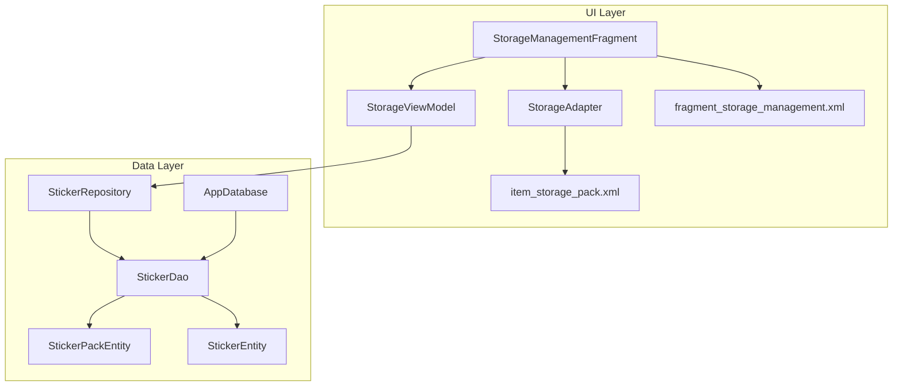
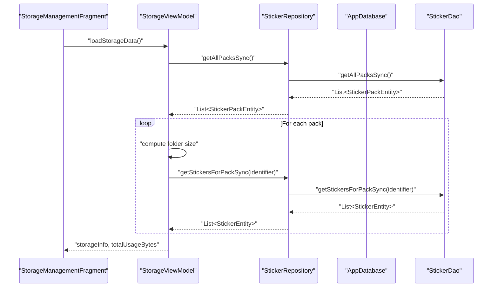
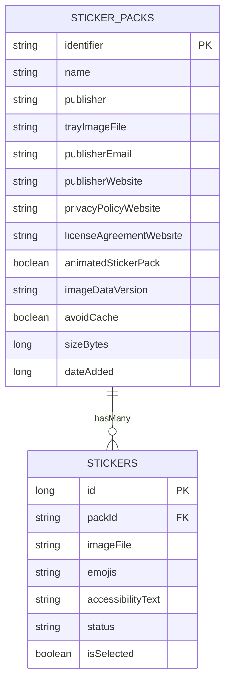
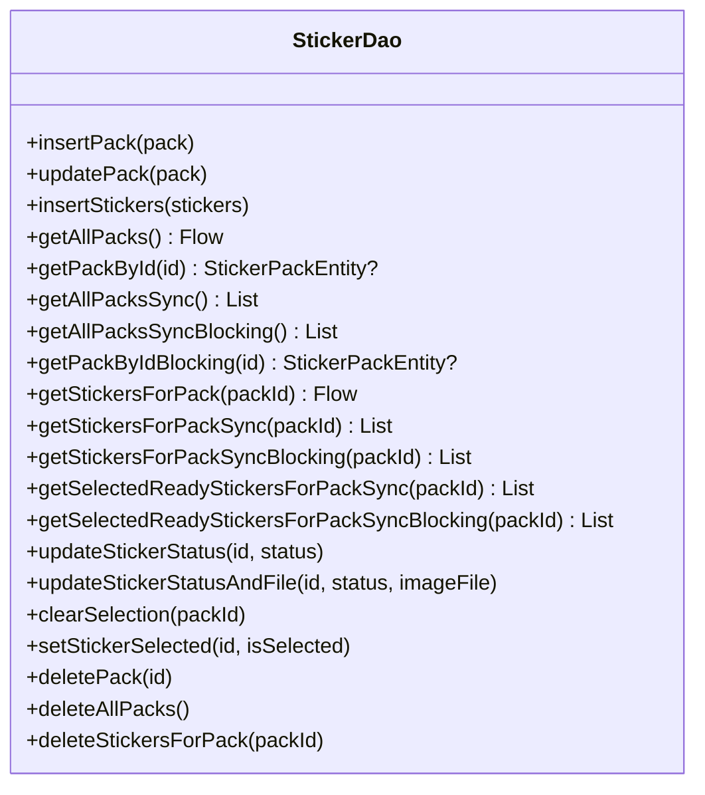
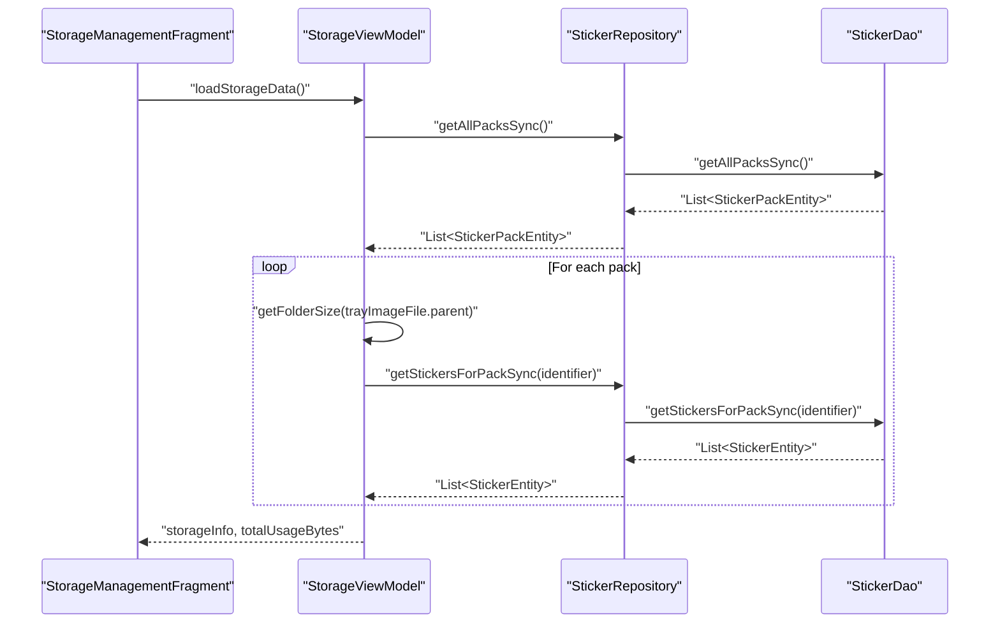
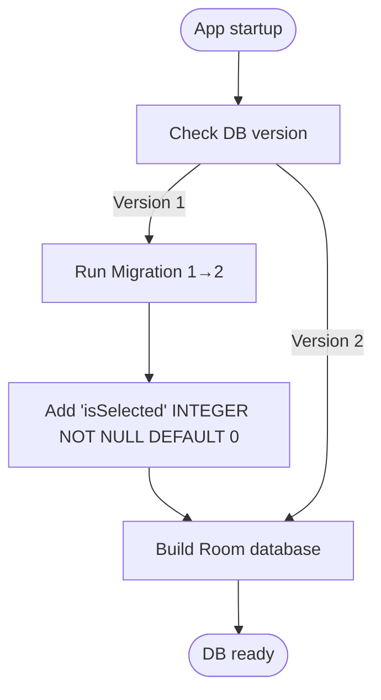
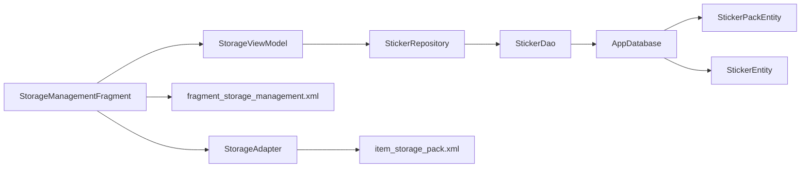

# Storage Management

<cite>
**Referenced Files in This Document**
- [AppDatabase.kt](file://app/src/main/java/com/maheshsharan/tel2what/data/local/AppDatabase.kt)
- [StickerEntity.kt](file://app/src/main/java/com/maheshsharan/tel2what/data/local/entity/StickerEntity.kt)
- [StickerPackEntity.kt](file://app/src/main/java/com/maheshsharan/tel2what/data/local/entity/StickerPackEntity.kt)
- [StickerDao.kt](file://app/src/main/java/com/maheshsharan/tel2what/data/local/dao/StickerDao.kt)
- [StickerRepository.kt](file://app/src/main/java/com/maheshsharan/tel2what/data/repository/StickerRepository.kt)
- [StorageManagementFragment.kt](file://app/src/main/java/com/maheshsharan/tel2what/ui/storage/StorageManagementFragment.kt)
- [StorageViewModel.kt](file://app/src/main/java/com/maheshsharan/tel2what/ui/storage/StorageViewModel.kt)
- [StorageAdapter.kt](file://app/src/main/java/com/maheshsharan/tel2what/ui/storage/StorageAdapter.kt)
- [fragment_storage_management.xml](file://app/src/main/res/layout/fragment_storage_management.xml)
- [item_storage_pack.xml](file://app/src/main/res/layout/item_storage_pack.xml)
</cite>

## Table of Contents
1. [Introduction](#introduction)
2. [Project Structure](#project-structure)
3. [Core Components](#core-components)
4. [Architecture Overview](#architecture-overview)
5. [Detailed Component Analysis](#detailed-component-analysis)
6. [Dependency Analysis](#dependency-analysis)
7. [Performance Considerations](#performance-considerations)
8. [Troubleshooting Guide](#troubleshooting-guide)
9. [Conclusion](#conclusion)

## Introduction
This document describes the local storage management system built with Room database. It covers the database schema, DAO layer, UI components for viewing and managing sticker packs, migrations, and storage optimization strategies. It also explains how UI components integrate with database operations, including transaction handling and error recovery mechanisms.

## Project Structure
The storage management system spans three layers:
- Data layer: Room database, entities, DAO, and repository
- UI layer: Fragment, ViewModel, and RecyclerView adapter
- Layout resources: XML layouts for the storage screen and list items

**Diagram sources**
- [StorageManagementFragment.kt](file://app/src/main/java/com/maheshsharan/tel2what/ui/storage/StorageManagementFragment.kt#L22-L118)
- [StorageViewModel.kt](file://app/src/main/java/com/maheshsharan/tel2what/ui/storage/StorageViewModel.kt#L25-L132)
- [StorageAdapter.kt](file://app/src/main/java/com/maheshsharan/tel2what/ui/storage/StorageAdapter.kt#L13-L69)
- [fragment_storage_management.xml](file://app/src/main/res/layout/fragment_storage_management.xml#L1-L144)
- [item_storage_pack.xml](file://app/src/main/res/layout/item_storage_pack.xml#L1-L200)
- [AppDatabase.kt](file://app/src/main/java/com/maheshsharan/tel2what/data/local/AppDatabase.kt#L13-L42)
- [StickerDao.kt](file://app/src/main/java/com/maheshsharan/tel2what/data/local/dao/StickerDao.kt#L13-L81)
- [StickerRepository.kt](file://app/src/main/java/com/maheshsharan/tel2what/data/repository/StickerRepository.kt#L10-L80)
- [StickerPackEntity.kt](file://app/src/main/java/com/maheshsharan/tel2what/data/local/entity/StickerPackEntity.kt#L6-L22)
- [StickerEntity.kt](file://app/src/main/java/com/maheshsharan/tel2what/data/local/entity/StickerEntity.kt#L8-L29)

**Section sources**
- [StorageManagementFragment.kt](file://app/src/main/java/com/maheshsharan/tel2what/ui/storage/StorageManagementFragment.kt#L22-L118)
- [StorageViewModel.kt](file://app/src/main/java/com/maheshsharan/tel2what/ui/storage/StorageViewModel.kt#L25-L132)
- [StorageAdapter.kt](file://app/src/main/java/com/maheshsharan/tel2what/ui/storage/StorageAdapter.kt#L13-L69)
- [fragment_storage_management.xml](file://app/src/main/res/layout/fragment_storage_management.xml#L1-L144)
- [item_storage_pack.xml](file://app/src/main/res/layout/item_storage_pack.xml#L1-L200)
- [AppDatabase.kt](file://app/src/main/java/com/maheshsharan/tel2what/data/local/AppDatabase.kt#L13-L42)
- [StickerDao.kt](file://app/src/main/java/com/maheshsharan/tel2what/data/local/dao/StickerDao.kt#L13-L81)
- [StickerRepository.kt](file://app/src/main/java/com/maheshsharan/tel2what/data/repository/StickerRepository.kt#L10-L80)
- [StickerPackEntity.kt](file://app/src/main/java/com/maheshsharan/tel2what/data/local/entity/StickerPackEntity.kt#L6-L22)
- [StickerEntity.kt](file://app/src/main/java/com/maheshsharan/tel2what/data/local/entity/StickerEntity.kt#L8-L29)

## Core Components
- AppDatabase: Declares entities, exposes DAO, and defines migration from version 1 to 2.
- StickerPackEntity: Represents sticker pack metadata stored in the sticker_packs table.
- StickerEntity: Represents individual stickers stored in the stickers table with a foreign key to a pack.
- StickerDao: Provides CRUD and query APIs for packs and stickers, including blocking variants for ContentProvider.
- StickerRepository: Encapsulates DAO access and exposes higher-level operations to the UI.
- StorageManagementFragment: UI controller that initializes ViewModel and binds data to RecyclerView.
- StorageViewModel: Computes storage usage, orchestrates deletion/cleanup, and exposes StateFlow streams.
- StorageAdapter: Renders each sticker pack’s tray image, name, count, size, and action buttons.

**Section sources**
- [AppDatabase.kt](file://app/src/main/java/com/maheshsharan/tel2what/data/local/AppDatabase.kt#L13-L42)
- [StickerPackEntity.kt](file://app/src/main/java/com/maheshsharan/tel2what/data/local/entity/StickerPackEntity.kt#L6-L22)
- [StickerEntity.kt](file://app/src/main/java/com/maheshsharan/tel2what/data/local/entity/StickerEntity.kt#L8-L29)
- [StickerDao.kt](file://app/src/main/java/com/maheshsharan/tel2what/data/local/dao/StickerDao.kt#L13-L81)
- [StickerRepository.kt](file://app/src/main/java/com/maheshsharan/tel2what/data/repository/StickerRepository.kt#L10-L80)
- [StorageManagementFragment.kt](file://app/src/main/java/com/maheshsharan/tel2what/ui/storage/StorageManagementFragment.kt#L22-L118)
- [StorageViewModel.kt](file://app/src/main/java/com/maheshsharan/tel2what/ui/storage/StorageViewModel.kt#L19-L132)
- [StorageAdapter.kt](file://app/src/main/java/com/maheshsharan/tel2what/ui/storage/StorageAdapter.kt#L13-L69)

## Architecture Overview
The system follows MVVM with Room persistence:
- UI observes StateFlow emissions from ViewModel.
- ViewModel delegates to Repository for DAO access.
- DAO executes SQL queries and updates against Room tables.
- AppDatabase manages schema and migrations.

**Diagram sources**
- [StorageManagementFragment.kt](file://app/src/main/java/com/maheshsharan/tel2what/ui/storage/StorageManagementFragment.kt#L62-L74)
- [StorageViewModel.kt](file://app/src/main/java/com/maheshsharan/tel2what/ui/storage/StorageViewModel.kt#L36-L53)
- [StickerRepository.kt](file://app/src/main/java/com/maheshsharan/tel2what/data/repository/StickerRepository.kt#L64-L78)
- [StickerDao.kt](file://app/src/main/java/com/maheshsharan/tel2what/data/local/dao/StickerDao.kt#L33-L47)
- [AppDatabase.kt](file://app/src/main/java/com/maheshsharan/tel2what/data/local/AppDatabase.kt#L13-L42)

## Detailed Component Analysis

### Database Schema and Relationships
- Entities:
  - StickerPackEntity mapped to sticker_packs table with identifier as primary key.
  - StickerEntity mapped to stickers table with auto-generated id and packId as foreign key referencing StickerPackEntity.identifier.
- Foreign Keys:
  - stickers.packId → sticker_packs.identifier with cascade delete.
- Indexing:
  - stickers.packId indexed for efficient pack-scoped queries.
- Additional column:
  - isSelected added via migration 1→2 for UI selection state.

**Diagram sources**
- [StickerPackEntity.kt](file://app/src/main/java/com/maheshsharan/tel2what/data/local/entity/StickerPackEntity.kt#L6-L22)
- [StickerEntity.kt](file://app/src/main/java/com/maheshsharan/tel2what/data/local/entity/StickerEntity.kt#L8-L29)

**Section sources**
- [StickerPackEntity.kt](file://app/src/main/java/com/maheshsharan/tel2what/data/local/entity/StickerPackEntity.kt#L6-L22)
- [StickerEntity.kt](file://app/src/main/java/com/maheshsharan/tel2what/data/local/entity/StickerEntity.kt#L8-L29)

### DAO Layer Implementation and Query Optimization
- Insert/update:
  - insertPack/updatePack for StickerPackEntity.
  - insertStickers for bulk sticker insertion.
- Queries:
  - getAllPacks returns Flow<List<StickerPackEntity>> for reactive UI updates.
  - getPackById/getAllPacksSync provide sync access for ContentProvider.
  - getStickersForPack returns Flow<List<StickerEntity>> for per-pack reactive lists.
  - getSelectedReadyStickersForPackSync restricts to READY stickers selected by UI.
- Updates:
  - updateStickerStatus/updateStickerStatusAndFile manage lifecycle states.
  - clearSelection resets selection within a pack.
  - setStickerSelected toggles selection for a sticker.
- Deletes:
  - deletePack deletes a single pack (cascade removes stickers).
  - deleteAllPacks clears all packs.
  - deleteStickersForPack removes stickers for a given pack.
- Blocking variants:
  - getAllPacksSyncBlocking/getPackByIdBlocking/getStickersForPackSyncBlocking support ContentProvider constraints.

**Diagram sources**
- [StickerDao.kt](file://app/src/main/java/com/maheshsharan/tel2what/data/local/dao/StickerDao.kt#L13-L81)

**Section sources**
- [StickerDao.kt](file://app/src/main/java/com/maheshsharan/tel2what/data/local/dao/StickerDao.kt#L13-L81)

### Storage Management UI Components
- StorageManagementFragment:
  - Initializes AppDatabase, StickerRepository, and StorageViewModelFactory.
  - Binds RecyclerView with StorageAdapter.
  - Observes storageInfo and totalUsageBytes to render summary and list.
  - Handles back navigation and global actions: clear cache, delete all.
- StorageViewModel:
  - Computes total usage by walking pack directories and summing sizes.
  - Exposes StateFlows for UI binding.
  - Implements clearPackCache, deletePack, and deleteAll with IO/Main threading separation.
- StorageAdapter:
  - Displays tray image, pack name, sticker count, and size.
  - Emits callbacks for clear cache and delete actions.

**Diagram sources**
- [StorageManagementFragment.kt](file://app/src/main/java/com/maheshsharan/tel2what/ui/storage/StorageManagementFragment.kt#L62-L74)
- [StorageViewModel.kt](file://app/src/main/java/com/maheshsharan/tel2what/ui/storage/StorageViewModel.kt#L36-L53)
- [StickerRepository.kt](file://app/src/main/java/com/maheshsharan/tel2what/data/repository/StickerRepository.kt#L64-L78)
- [StickerDao.kt](file://app/src/main/java/com/maheshsharan/tel2what/data/local/dao/StickerDao.kt#L33-L47)

**Section sources**
- [StorageManagementFragment.kt](file://app/src/main/java/com/maheshsharan/tel2what/ui/storage/StorageManagementFragment.kt#L22-L118)
- [StorageViewModel.kt](file://app/src/main/java/com/maheshsharan/tel2what/ui/storage/StorageViewModel.kt#L25-L132)
- [StorageAdapter.kt](file://app/src/main/java/com/maheshsharan/tel2what/ui/storage/StorageAdapter.kt#L13-L69)
- [fragment_storage_management.xml](file://app/src/main/res/layout/fragment_storage_management.xml#L58-L142)
- [item_storage_pack.xml](file://app/src/main/res/layout/item_storage_pack.xml#L1-L200)

### Data Migration Strategies and Version Management
- Current schema version is 2.
- Migration 1→2 adds isSelected column to stickers table with NOT NULL default 0.
- AppDatabase registers the migration and builds the database with Room.databaseBuilder.

**Diagram sources**
- [AppDatabase.kt](file://app/src/main/java/com/maheshsharan/tel2what/data/local/AppDatabase.kt#L17-L39)

**Section sources**
- [AppDatabase.kt](file://app/src/main/java/com/maheshsharan/tel2what/data/local/AppDatabase.kt#L13-L42)

### Storage Optimization and Cleanup Procedures
- Per-pack cache clearing:
  - Deletes cache directory under cacheDir/telegram/{packId}.
- Global cache clearing:
  - Clears app cacheDir and Glide disk/memory caches.
- Delete pack:
  - Removes pack directory tree, then deletes pack and associated stickers from DB.
- Delete all:
  - Removes all pack directories under filesDir/packs, then clears DB entries for all packs.

Recommendations:
- Prefer cascade deletes via foreign keys when removing packs to keep DB consistent.
- Use batch operations (bulk insert) for stickers to reduce overhead.
- Consider periodic cleanup jobs to remove orphaned files if pack directories fall out of sync with DB.

**Section sources**
- [StorageViewModel.kt](file://app/src/main/java/com/maheshsharan/tel2what/ui/storage/StorageViewModel.kt#L69-L108)
- [StickerDao.kt](file://app/src/main/java/com/maheshsharan/tel2what/data/local/dao/StickerDao.kt#L72-L79)

### Transaction Handling and Error Recovery
- Transactions:
  - Room executes each DAO operation in a transaction by default.
  - For multi-step operations (e.g., delete pack), perform filesystem deletion followed by DB deletion to maintain consistency.
- Error recovery:
  - UI uses coroutine scopes with IO/Main dispatchers to prevent ANRs.
  - Repository methods are suspend and can propagate exceptions upward for UI-level handling.
  - For ContentProvider compatibility, blocking DAO variants are provided.

**Section sources**
- [StorageViewModel.kt](file://app/src/main/java/com/maheshsharan/tel2what/ui/storage/StorageViewModel.kt#L69-L108)
- [StickerDao.kt](file://app/src/main/java/com/maheshsharan/tel2what/data/local/dao/StickerDao.kt#L36-L51)
- [StickerRepository.kt](file://app/src/main/java/com/maheshsharan/tel2what/data/repository/StickerRepository.kt#L10-L80)

## Dependency Analysis
- UI depends on ViewModel via ViewModelProvider.
- ViewModel depends on Repository for DAO access.
- Repository depends on DAO for database operations.
- DAO depends on Room entities and AppDatabase for schema and migrations.
- UI layout resources define views bound by Fragment and Adapter.

**Diagram sources**
- [StorageManagementFragment.kt](file://app/src/main/java/com/maheshsharan/tel2what/ui/storage/StorageManagementFragment.kt#L22-L118)
- [StorageViewModel.kt](file://app/src/main/java/com/maheshsharan/tel2what/ui/storage/StorageViewModel.kt#L25-L132)
- [StorageAdapter.kt](file://app/src/main/java/com/maheshsharan/tel2what/ui/storage/StorageAdapter.kt#L13-L69)
- [fragment_storage_management.xml](file://app/src/main/res/layout/fragment_storage_management.xml#L1-L144)
- [item_storage_pack.xml](file://app/src/main/res/layout/item_storage_pack.xml#L1-L200)
- [StickerRepository.kt](file://app/src/main/java/com/maheshsharan/tel2what/data/repository/StickerRepository.kt#L10-L80)
- [StickerDao.kt](file://app/src/main/java/com/maheshsharan/tel2what/data/local/dao/StickerDao.kt#L13-L81)
- [AppDatabase.kt](file://app/src/main/java/com/maheshsharan/tel2what/data/local/AppDatabase.kt#L13-L42)
- [StickerPackEntity.kt](file://app/src/main/java/com/maheshsharan/tel2what/data/local/entity/StickerPackEntity.kt#L6-L22)
- [StickerEntity.kt](file://app/src/main/java/com/maheshsharan/tel2what/data/local/entity/StickerEntity.kt#L8-L29)

**Section sources**
- [StorageManagementFragment.kt](file://app/src/main/java/com/maheshsharan/tel2what/ui/storage/StorageManagementFragment.kt#L22-L118)
- [StorageViewModel.kt](file://app/src/main/java/com/maheshsharan/tel2what/ui/storage/StorageViewModel.kt#L25-L132)
- [StorageAdapter.kt](file://app/src/main/java/com/maheshsharan/tel2what/ui/storage/StorageAdapter.kt#L13-L69)
- [fragment_storage_management.xml](file://app/src/main/res/layout/fragment_storage_management.xml#L1-L144)
- [item_storage_pack.xml](file://app/src/main/res/layout/item_storage_pack.xml#L1-L200)
- [StickerRepository.kt](file://app/src/main/java/com/maheshsharan/tel2what/data/repository/StickerRepository.kt#L10-L80)
- [StickerDao.kt](file://app/src/main/java/com/maheshsharan/tel2what/data/local/dao/StickerDao.kt#L13-L81)
- [AppDatabase.kt](file://app/src/main/java/com/maheshsharan/tel2what/data/local/AppDatabase.kt#L13-L42)
- [StickerPackEntity.kt](file://app/src/main/java/com/maheshsharan/tel2what/data/local/entity/StickerPackEntity.kt#L6-L22)
- [StickerEntity.kt](file://app/src/main/java/com/maheshsharan/tel2what/data/local/entity/StickerEntity.kt#L8-L29)

## Performance Considerations
- Reactive UI updates:
  - Use Flow-based queries (getAllPacks, getStickersForPack) to minimize unnecessary recomputation.
- Efficient queries:
  - stickers.packId is indexed; queries filter by packId to avoid full scans.
- Batch operations:
  - insertStickers accepts a list for bulk inserts.
- Threading:
  - Perform heavy work (directory traversal, filesystem ops) on Dispatchers.IO; switch to Main for UI updates.
- Migration cost:
  - Adding isSelected was a single ALTER TABLE; keep future migrations minimal and additive.

[No sources needed since this section provides general guidance]

## Troubleshooting Guide
- Stickers not appearing after import:
  - Verify packId matches StickerPackEntity.identifier and stickers.packId references it.
  - Confirm isSelected defaults to false; toggle selection via setStickerSelected.
- Pack deletion did not free space:
  - Ensure filesystem deletion precedes DB deletion to avoid dangling files.
  - Confirm cascade delete is effective by checking foreign key constraint.
- UI not updating:
  - Ensure Flow-based queries are collected in LifecycleScope.
  - Confirm StateFlow emissions occur on Main thread after IO operations.

**Section sources**
- [StickerEntity.kt](file://app/src/main/java/com/maheshsharan/tel2what/data/local/entity/StickerEntity.kt#L18-L28)
- [StickerDao.kt](file://app/src/main/java/com/maheshsharan/tel2what/data/local/dao/StickerDao.kt#L66-L70)
- [StorageViewModel.kt](file://app/src/main/java/com/maheshsharan/tel2what/ui/storage/StorageViewModel.kt#L79-L91)

## Conclusion
The storage management system leverages Room for robust local persistence, with a clean separation between UI, ViewModel, Repository, and DAO layers. The schema supports efficient pack-centric queries, and the UI provides practical controls for viewing, organizing, and cleaning up sticker packs. Future enhancements could include background cleanup tasks and more granular transaction boundaries for complex operations.