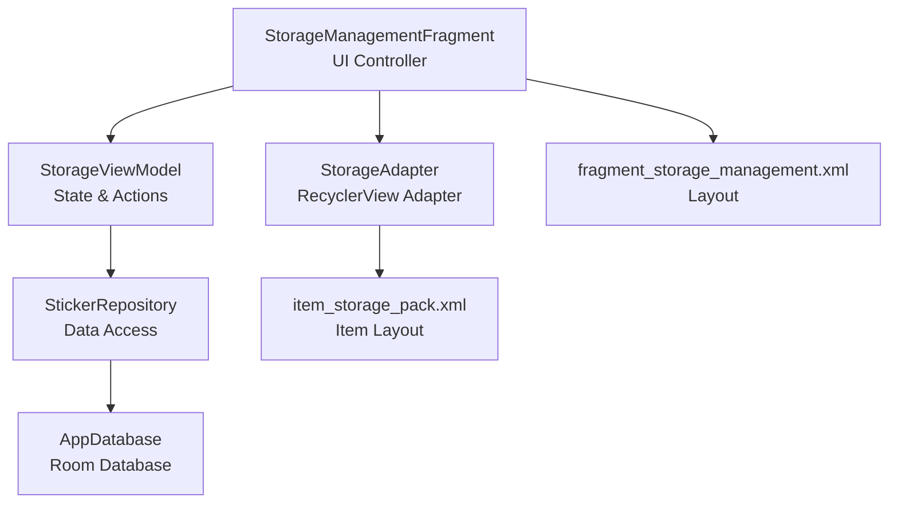
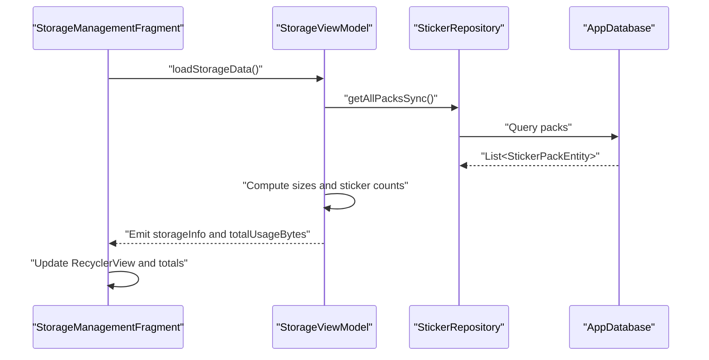
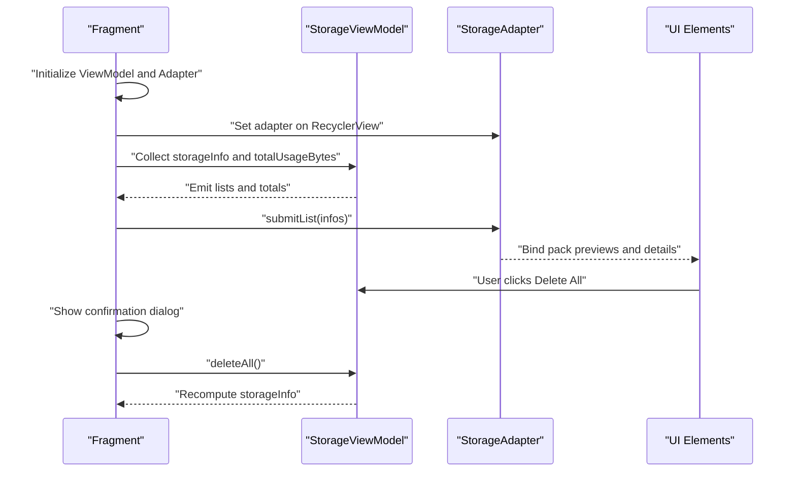
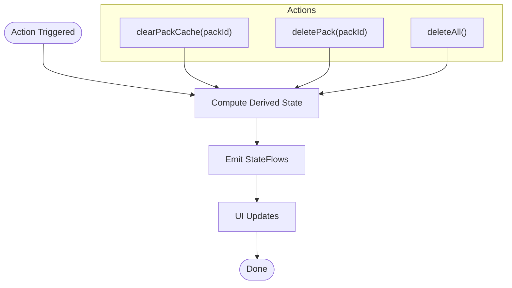
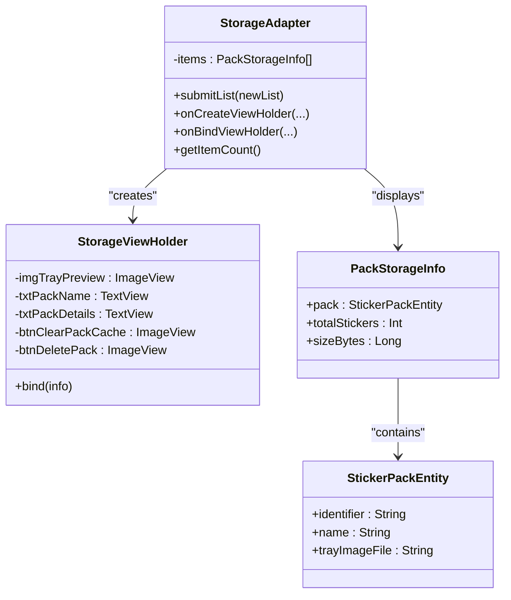
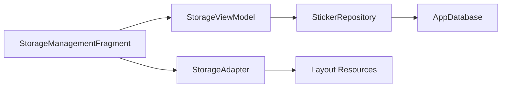

# Storage UI Management

<cite>
**Referenced Files in This Document**
- [StorageManagementFragment.kt](file://app/src/main/java/com/maheshsharan/tel2what/ui/storage/StorageManagementFragment.kt)
- [StorageViewModel.kt](file://app/src/main/java/com/maheshsharan/tel2what/ui/storage/StorageViewModel.kt)
- [StorageAdapter.kt](file://app/src/main/java/com/maheshsharan/tel2what/ui/storage/StorageAdapter.kt)
- [fragment_storage_management.xml](file://app/src/main/res/layout/fragment_storage_management.xml)
- [item_storage_pack.xml](file://app/src/main/res/layout/item_storage_pack.xml)
- [StickerRepository.kt](file://app/src/main/java/com/maheshsharan/tel2what/data/repository/StickerRepository.kt)
- [AppDatabase.kt](file://app/src/main/java/com/maheshsharan/tel2what/data/local/AppDatabase.kt)
- [StickerPackEntity.kt](file://app/src/main/java/com/maheshsharan/tel2what/data/local/entity/StickerPackEntity.kt)
- [themes.xml](file://app/src/main/res/values/themes.xml)
</cite>

## Table of Contents
1. [Introduction](#introduction)
2. [Project Structure](#project-structure)
3. [Core Components](#core-components)
4. [Architecture Overview](#architecture-overview)
5. [Detailed Component Analysis](#detailed-component-analysis)
6. [Dependency Analysis](#dependency-analysis)
7. [Performance Considerations](#performance-considerations)
8. [Troubleshooting Guide](#troubleshooting-guide)
9. [Conclusion](#conclusion)

## Introduction
This document provides comprehensive documentation for the storage management user interface components in the Tel2WhatSticker Android application. It focuses on the StorageManagementFragment implementation, the StorageViewModel responsibilities, and the StorageAdapter that displays sticker packs in a grid-like layout. The documentation covers RecyclerView setup, adapter configuration, user interaction handling, UI state management, loading indicators, empty state handling, error display mechanisms, bulk operations, swipe gestures, contextual actions, responsive design considerations, and accessibility features.

## Project Structure
The storage management UI is organized around three primary components:
- StorageManagementFragment: The UI controller that initializes the ViewModel, sets up the RecyclerView, binds UI state, and handles user interactions.
- StorageViewModel: The state holder that manages UI state, coordinates with the repository layer, and exposes reactive streams for UI updates.
- StorageAdapter: The RecyclerView adapter implementing the ViewHolder pattern to render individual sticker pack items.

**Diagram sources**
- [StorageManagementFragment.kt](file://app/src/main/java/com/maheshsharan/tel2what/ui/storage/StorageManagementFragment.kt#L22-L118)
- [StorageViewModel.kt](file://app/src/main/java/com/maheshsharan/tel2what/ui/storage/StorageViewModel.kt#L25-L132)
- [StorageAdapter.kt](file://app/src/main/java/com/maheshsharan/tel2what/ui/storage/StorageAdapter.kt#L13-L69)
- [fragment_storage_management.xml](file://app/src/main/res/layout/fragment_storage_management.xml#L1-L144)
- [item_storage_pack.xml](file://app/src/main/res/layout/item_storage_pack.xml#L1-L63)
- [StickerRepository.kt](file://app/src/main/java/com/maheshsharan/tel2what/data/repository/StickerRepository.kt#L10-L80)
- [AppDatabase.kt](file://app/src/main/java/com/maheshsharan/tel2what/data/local/AppDatabase.kt#L13-L42)

**Section sources**
- [StorageManagementFragment.kt](file://app/src/main/java/com/maheshsharan/tel2what/ui/storage/StorageManagementFragment.kt#L22-L118)
- [StorageViewModel.kt](file://app/src/main/java/com/maheshsharan/tel2what/ui/storage/StorageViewModel.kt#L25-L132)
- [StorageAdapter.kt](file://app/src/main/java/com/maheshsharan/tel2what/ui/storage/StorageAdapter.kt#L13-L69)
- [fragment_storage_management.xml](file://app/src/main/res/layout/fragment_storage_management.xml#L1-L144)
- [item_storage_pack.xml](file://app/src/main/res/layout/item_storage_pack.xml#L1-L63)
- [StickerRepository.kt](file://app/src/main/java/com/maheshsharan/tel2what/data/repository/StickerRepository.kt#L10-L80)
- [AppDatabase.kt](file://app/src/main/java/com/maheshsharan/tel2what/data/local/AppDatabase.kt#L13-L42)

## Core Components
- StorageManagementFragment
  - Initializes the ViewModel using a factory with repository and context.
  - Sets up RecyclerView with LinearLayoutManager and binds the StorageAdapter.
  - Subscribes to StateFlows for storage info and total usage to update UI.
  - Handles user actions: back navigation, clear cache, delete all, and per-pack operations via confirmation dialogs.
  - Uses coroutines for background tasks and UI thread transitions.

- StorageViewModel
  - Exposes StateFlows for storageInfo and totalUsageBytes.
  - Computes per-pack size by traversing directories and counts stickers via repository queries.
  - Provides actions: loadStorageData, clearPackCache, deletePack, deleteAll.
  - Uses Dispatchers.IO for file operations and Dispatchers.Main for UI updates.

- StorageAdapter
  - Implements RecyclerView.Adapter with a custom ViewHolder.
  - Binds pack preview, name, and details (count and size).
  - Delegates per-item actions to callbacks injected by the fragment.

**Section sources**
- [StorageManagementFragment.kt](file://app/src/main/java/com/maheshsharan/tel2what/ui/storage/StorageManagementFragment.kt#L27-L107)
- [StorageViewModel.kt](file://app/src/main/java/com/maheshsharan/tel2what/ui/storage/StorageViewModel.kt#L30-L108)
- [StorageAdapter.kt](file://app/src/main/java/com/maheshsharan/tel2what/ui/storage/StorageAdapter.kt#L18-L67)

## Architecture Overview
The storage management UI follows MVVM with reactive state flows:
- UI (Fragment) observes StateFlows from ViewModel and triggers actions.
- ViewModel orchestrates repository calls, computes derived state, and exposes it via StateFlows.
- Repository abstracts data access to Room and external APIs.
- Data entities define the persisted structure for sticker packs.

**Diagram sources**
- [StorageManagementFragment.kt](file://app/src/main/java/com/maheshsharan/tel2what/ui/storage/StorageManagementFragment.kt#L62-L74)
- [StorageViewModel.kt](file://app/src/main/java/com/maheshsharan/tel2what/ui/storage/StorageViewModel.kt#L36-L53)
- [StickerRepository.kt](file://app/src/main/java/com/maheshsharan/tel2what/data/repository/StickerRepository.kt#L64-L66)
- [AppDatabase.kt](file://app/src/main/java/com/maheshsharan/tel2what/data/local/AppDatabase.kt#L13-L42)

## Detailed Component Analysis

### StorageManagementFragment Implementation
- Initialization and DI
  - Creates AppDatabase, StickerRepository, and StorageViewModelFactory.
  - Instantiates StorageViewModel via ViewModelProvider.
- RecyclerView Setup
  - Finds views: back button, clear cache, delete all, RecyclerView, and total size text.
  - Initializes StorageAdapter with callbacks for clear cache and delete actions.
  - Assigns adapter to RecyclerView and sets LinearLayoutManager.
- State Binding
  - Collects storageInfo StateFlow to submit lists to the adapter.
  - Collects totalUsageBytes StateFlow to format and display total usage.
- User Interactions
  - Back navigation handled via NavController.
  - Clear cache: deletes app cache and Glide disk/memory caches with confirmation dialog.
  - Delete all: removes packs directory and clears DB entries with confirmation dialog.
  - Per-pack actions: clear cache and delete via item-level buttons with confirmation dialogs.

**Diagram sources**
- [StorageManagementFragment.kt](file://app/src/main/java/com/maheshsharan/tel2what/ui/storage/StorageManagementFragment.kt#L30-L107)
- [StorageViewModel.kt](file://app/src/main/java/com/maheshsharan/tel2what/ui/storage/StorageViewModel.kt#L94-L108)
- [StorageAdapter.kt](file://app/src/main/java/com/maheshsharan/tel2what/ui/storage/StorageAdapter.kt#L20-L35)

**Section sources**
- [StorageManagementFragment.kt](file://app/src/main/java/com/maheshsharan/tel2what/ui/storage/StorageManagementFragment.kt#L27-L107)
- [fragment_storage_management.xml](file://app/src/main/res/layout/fragment_storage_management.xml#L133-L139)

### StorageViewModel Responsibilities
- State Management
  - Maintains storageInfo (list of PackStorageInfo) and totalUsageBytes using StateFlows.
- Data Computation
  - Loads all packs synchronously, computes folder sizes recursively, and counts stickers per pack.
- Actions
  - clearPackCache: deletes per-pack cache directory and refreshes state.
  - deletePack: removes pack directory and DB records, then refreshes state.
  - deleteAll: removes packs directory and clears all DB records, then refreshes state.
- Threading
  - Uses Dispatchers.IO for file operations and Dispatchers.Main for UI updates after context switching.

**Diagram sources**
- [StorageViewModel.kt](file://app/src/main/java/com/maheshsharan/tel2what/ui/storage/StorageViewModel.kt#L36-L108)

**Section sources**
- [StorageViewModel.kt](file://app/src/main/java/com/maheshsharan/tel2what/ui/storage/StorageViewModel.kt#L25-L108)
- [StickerRepository.kt](file://app/src/main/java/com/maheshsharan/tel2what/data/repository/StickerRepository.kt#L64-L78)

### StorageAdapter Implementation
- ViewHolder Pattern
  - StorageViewHolder holds references to preview image, name, details, and action buttons.
  - Binds data from PackStorageInfo and sets click listeners for per-pack actions.
- Data Binding
  - Loads tray image preview using Glide.
  - Displays pack name and formatted details (sticker count and size).
- Callbacks
  - Delegates clear cache and delete actions to callbacks provided by the fragment.

**Diagram sources**
- [StorageAdapter.kt](file://app/src/main/java/com/maheshsharan/tel2what/ui/storage/StorageAdapter.kt#L13-L69)
- [StickerPackEntity.kt](file://app/src/main/java/com/maheshsharan/tel2what/data/local/entity/StickerPackEntity.kt#L7-L21)

**Section sources**
- [StorageAdapter.kt](file://app/src/main/java/com/maheshsharan/tel2what/ui/storage/StorageAdapter.kt#L18-L67)
- [item_storage_pack.xml](file://app/src/main/res/layout/item_storage_pack.xml#L12-L63)

### UI State Management, Loading Indicators, Empty States, and Error Display
- Reactive State
  - storageInfo and totalUsageBytes are exposed as StateFlows, enabling declarative UI updates.
- Loading Indicators
  - No explicit progress indicator is present in the current layout; consider adding a ProgressBar or shimmer effect during initial load.
- Empty State Handling
  - The RecyclerView uses a linear layout manager; empty state can be indicated by a dedicated message view when storageInfo is empty.
- Error Display
  - No explicit error UI is implemented in the fragment; errors can surface via toasts or snackbars triggered by exceptions in ViewModel actions.

**Section sources**
- [StorageManagementFragment.kt](file://app/src/main/java/com/maheshsharan/tel2what/ui/storage/StorageManagementFragment.kt#L62-L74)
- [StorageViewModel.kt](file://app/src/main/java/com/maheshsharan/tel2what/ui/storage/StorageViewModel.kt#L36-L53)

### User Interaction Patterns: Bulk Operations, Swipe Gestures, and Contextual Actions
- Bulk Operations
  - Clear Cache: Clears app cache and Glide caches with confirmation.
  - Delete All: Removes all packs and DB entries with confirmation.
- Individual Pack Actions
  - Clear Cache: Removes per-pack cache directory with confirmation.
  - Delete: Removes pack directory and DB entries with confirmation.
- Swipe Gestures and Contextual Actions
  - Not implemented in the current UI; can be added using ItemTouchHelper for swipe-to-delete and contextual action modes for multi-select operations.

**Section sources**
- [StorageManagementFragment.kt](file://app/src/main/java/com/maheshsharan/tel2what/ui/storage/StorageManagementFragment.kt#L76-L106)
- [StorageAdapter.kt](file://app/src/main/java/com/maheshsharan/tel2what/ui/storage/StorageAdapter.kt#L59-L65)

### Responsive Design Considerations
- Current Layout
  - Uses ConstraintLayout with a ScrollView to accommodate varying screen sizes.
  - RecyclerView uses LinearLayoutManager; consider GridLayoutManager for a grid layout similar to other fragments.
- Theming
  - Material Design 3 theme applied with light/dark mode support.

**Section sources**
- [fragment_storage_management.xml](file://app/src/main/res/layout/fragment_storage_management.xml#L1-L144)
- [themes.xml](file://app/src/main/res/values/themes.xml#L1-L21)

### Accessibility Features
- Current Accessibility
  - Buttons use selectable backgrounds; no explicit content descriptions are set in the provided layouts.
- Recommendations
  - Add contentDescription attributes to action icons.
  - Ensure sufficient color contrast for text and icons.
  - Provide focus indicators and keyboard navigation support.

**Section sources**
- [item_storage_pack.xml](file://app/src/main/res/layout/item_storage_pack.xml#L46-L62)
- [fragment_storage_management.xml](file://app/src/main/res/layout/fragment_storage_management.xml#L23-L31)

## Dependency Analysis
The components exhibit clear separation of concerns with unidirectional data flow:
- Fragment depends on ViewModel for state and actions.
- ViewModel depends on Repository for data operations.
- Repository depends on AppDatabase for persistence.
- Adapter depends on UI resources and callbacks.

**Diagram sources**
- [StorageManagementFragment.kt](file://app/src/main/java/com/maheshsharan/tel2what/ui/storage/StorageManagementFragment.kt#L30-L33)
- [StorageViewModel.kt](file://app/src/main/java/com/maheshsharan/tel2what/ui/storage/StorageViewModel.kt#L25-L28)
- [StickerRepository.kt](file://app/src/main/java/com/maheshsharan/tel2what/data/repository/StickerRepository.kt#L10-L14)
- [AppDatabase.kt](file://app/src/main/java/com/maheshsharan/tel2what/data/local/AppDatabase.kt#L13-L15)

**Section sources**
- [StorageManagementFragment.kt](file://app/src/main/java/com/maheshsharan/tel2what/ui/storage/StorageManagementFragment.kt#L30-L33)
- [StorageViewModel.kt](file://app/src/main/java/com/maheshsharan/tel2what/ui/storage/StorageViewModel.kt#L25-L28)
- [StickerRepository.kt](file://app/src/main/java/com/maheshsharan/tel2what/data/repository/StickerRepository.kt#L10-L14)
- [AppDatabase.kt](file://app/src/main/java/com/maheshsharan/tel2what/data/local/AppDatabase.kt#L13-L15)

## Performance Considerations
- File Size Calculation
  - Recursive directory traversal can be expensive; consider caching sizes and invalidating on changes.
- UI Updates
  - notifyDataSetChanged is used; consider diffing libraries for large lists to minimize UI churn.
- Image Loading
  - Glide is used for image loading; ensure appropriate placeholders and memory management.
- Concurrency
  - IO-bound operations are offloaded to Dispatchers.IO; maintain minimal work on the main thread.

[No sources needed since this section provides general guidance]

## Troubleshooting Guide
- Cache Clearing Issues
  - Verify cache directory paths and permissions; ensure Glide disk cache is cleared after file deletions.
- Deletion Failures
  - Confirm pack directories exist and are writable; handle potential concurrent access or file locks.
- Empty State
  - Ensure storageInfo is populated before binding; handle null or zero-length directories gracefully.
- Formatting
  - Use the provided formatFileSize utility to display human-readable sizes consistently.

**Section sources**
- [StorageManagementFragment.kt](file://app/src/main/java/com/maheshsharan/tel2what/ui/storage/StorageManagementFragment.kt#L80-L96)
- [StorageViewModel.kt](file://app/src/main/java/com/maheshsharan/tel2what/ui/storage/StorageViewModel.kt#L55-L67)
- [StorageViewModel.kt](file://app/src/main/java/com/maheshsharan/tel2what/ui/storage/StorageViewModel.kt#L124-L131)

## Conclusion
The storage management UI components provide a clean MVVM architecture with reactive state management. The Fragment orchestrates UI interactions, the ViewModel centralizes business logic and state computation, and the Adapter renders individual items efficiently. Enhancements such as grid layout, explicit loading and error states, swipe gestures, and improved accessibility would further strengthen the user experience.