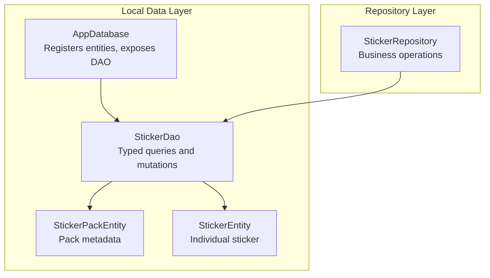
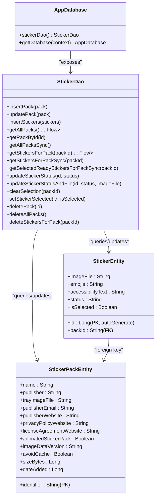
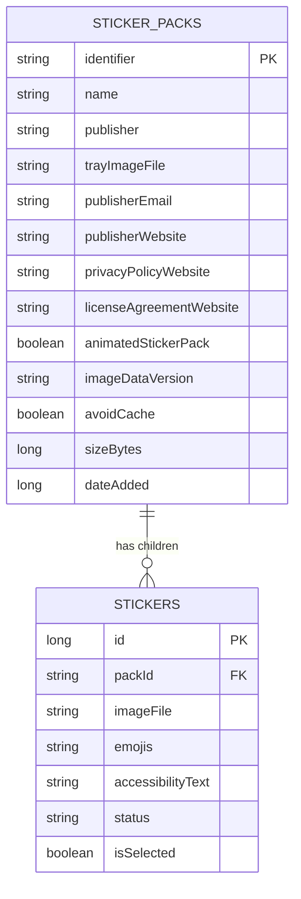
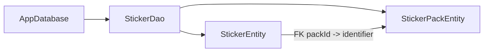

# Data Models and Database Schema

<cite>
**Referenced Files in This Document**
- [AppDatabase.kt](file://app/src/main/java/com/maheshsharan/tel2what/data/local/AppDatabase.kt)
- [StickerEntity.kt](file://app/src/main/java/com/maheshsharan/tel2what/data/local/entity/StickerEntity.kt)
- [StickerPackEntity.kt](file://app/src/main/java/com/maheshsharan/tel2what/data/local/entity/StickerPackEntity.kt)
- [StickerDao.kt](file://app/src/main/java/com/maheshsharan/tel2what/data/local/dao/StickerDao.kt)
- [StickerRepository.kt](file://app/src/main/java/com/maheshsharan/tel2what/data/repository/StickerRepository.kt)
</cite>

## Table of Contents
1. [Introduction](#introduction)
2. [Project Structure](#project-structure)
3. [Core Components](#core-components)
4. [Architecture Overview](#architecture-overview)
5. [Detailed Component Analysis](#detailed-component-analysis)
6. [Dependency Analysis](#dependency-analysis)
7. [Performance Considerations](#performance-considerations)
8. [Troubleshooting Guide](#troubleshooting-guide)
9. [Conclusion](#conclusion)

## Introduction
This document describes the database schema and data models used by Tel2What for managing sticker packs and individual stickers. It covers Room entity definitions, foreign key relationships, DAO query patterns, migrations, indexing, and operational constraints. It also outlines repository-level access patterns and practical query examples used across the application.

## Project Structure
The database layer is organized around Room’s entity-DAO-Database pattern:
- Entities define persistent records for sticker packs and stickers.
- DAO defines typed queries and mutations for data access.
- AppDatabase registers entities, exposes DAO access, and manages migrations.
- Repository coordinates higher-level operations and delegates to DAO.

**Diagram sources**
- [AppDatabase.kt](file://app/src/main/java/com/maheshsharan/tel2what/data/local/AppDatabase.kt#L13-L15)
- [StickerDao.kt](file://app/src/main/java/com/maheshsharan/tel2what/data/local/dao/StickerDao.kt#L13-L25)
- [StickerPackEntity.kt](file://app/src/main/java/com/maheshsharan/tel2what/data/local/entity/StickerPackEntity.kt#L6-L21)
- [StickerEntity.kt](file://app/src/main/java/com/maheshsharan/tel2what/data/local/entity/StickerEntity.kt#L8-L28)
- [StickerRepository.kt](file://app/src/main/java/com/maheshsharan/tel2what/data/repository/StickerRepository.kt#L10-L14)

**Section sources**
- [AppDatabase.kt](file://app/src/main/java/com/maheshsharan/tel2what/data/local/AppDatabase.kt#L13-L15)
- [StickerDao.kt](file://app/src/main/java/com/maheshsharan/tel2what/data/local/dao/StickerDao.kt#L13-L25)
- [StickerRepository.kt](file://app/src/main/java/com/maheshsharan/tel2what/data/repository/StickerRepository.kt#L10-L14)

## Core Components
- AppDatabase: Declares entities, version, and migration(s). Provides DAO access and singleton construction.
- StickerPackEntity: Defines the sticker pack record schema.
- StickerEntity: Defines the individual sticker record schema with foreign key to pack and an index on the foreign key.
- StickerDao: Declares CRUD and query methods for packs and stickers, including blocking variants for ContentProvider.
- StickerRepository: Exposes repository methods delegating to DAO.

**Section sources**
- [AppDatabase.kt](file://app/src/main/java/com/maheshsharan/tel2what/data/local/AppDatabase.kt#L13-L15)
- [StickerPackEntity.kt](file://app/src/main/java/com/maheshsharan/tel2what/data/local/entity/StickerPackEntity.kt#L6-L21)
- [StickerEntity.kt](file://app/src/main/java/com/maheshsharan/tel2what/data/local/entity/StickerEntity.kt#L8-L28)
- [StickerDao.kt](file://app/src/main/java/com/maheshsharan/tel2what/data/local/dao/StickerDao.kt#L13-L80)
- [StickerRepository.kt](file://app/src/main/java/com/maheshsharan/tel2what/data/repository/StickerRepository.kt#L10-L79)

## Architecture Overview
The Room database integrates entities, DAO, and migration strategy. The StickerPackEntity is the parent; StickerEntity is the child with a cascading foreign key relationship.

**Diagram sources**
- [AppDatabase.kt](file://app/src/main/java/com/maheshsharan/tel2what/data/local/AppDatabase.kt#L13-L15)
- [StickerPackEntity.kt](file://app/src/main/java/com/maheshsharan/tel2what/data/local/entity/StickerPackEntity.kt#L6-L21)
- [StickerEntity.kt](file://app/src/main/java/com/maheshsharan/tel2what/data/local/entity/StickerEntity.kt#L8-L28)
- [StickerDao.kt](file://app/src/main/java/com/maheshsharan/tel2what/data/local/dao/StickerDao.kt#L13-L80)

## Detailed Component Analysis

### AppDatabase
- Registers two entities: StickerPackEntity and StickerEntity.
- Version is 2; includes a migration from 1 to 2 that adds a new column to the stickers table.
- Singleton builder pattern ensures a single database instance per process.

Key behaviors:
- Entity registration and versioning.
- Migration installation for schema evolution.
- Database name and builder configuration.

**Section sources**
- [AppDatabase.kt](file://app/src/main/java/com/maheshsharan/tel2what/data/local/AppDatabase.kt#L13-L15)
- [AppDatabase.kt](file://app/src/main/java/com/maheshsharan/tel2what/data/local/AppDatabase.kt#L21-L25)
- [AppDatabase.kt](file://app/src/main/java/com/maheshsharan/tel2what/data/local/AppDatabase.kt#L27-L39)

### StickerPackEntity
Fields and constraints:
- Primary key: identifier (String).
- Pack metadata fields: name, publisher, trayImageFile, publisherEmail, publisherWebsite, privacyPolicyWebsite, licenseAgreementWebsite.
- Flags and metadata: animatedStickerPack (Boolean), imageDataVersion (String), avoidCache (Boolean), sizeBytes (Long), dateAdded (Long).

Business notes:
- Identifier uniquely identifies a pack.
- Metadata supports external integrations and display.

**Section sources**
- [StickerPackEntity.kt](file://app/src/main/java/com/maheshsharan/tel2what/data/local/entity/StickerPackEntity.kt#L6-L21)

### StickerEntity
Fields and constraints:
- Primary key: id (Long, auto-generated).
- Foreign key: packId (String) referencing StickerPackEntity.identifier.
- Index: packId for efficient joins and filtering by pack.
- Data fields: imageFile (String), emojis (String), accessibilityText (String).
- Status lifecycle: status (String) with values such as DOWNLOADING, CONVERTING, READY, FAILED.
- Selection flag: isSelected (Boolean).

Foreign key and cascade:
- Foreign key constraint from StickerEntity.packId to StickerPackEntity.identifier.
- Cascade delete configured so deleting a pack deletes all related stickers.

Indices:
- Index on packId to optimize queries filtering by pack.

**Section sources**
- [StickerEntity.kt](file://app/src/main/java/com/maheshsharan/tel2what/data/local/entity/StickerEntity.kt#L8-L28)

### StickerDao
Purpose:
- Provides typed Room DAO methods for StickerPackEntity and StickerEntity.
- Supports reactive Flow streams for real-time UI updates and suspend/blocking variants for ContentProvider compatibility.

Key method categories:
- Insert/update/delete packs:
  - insertPack, updatePack, deletePack, deleteAllPacks.
- Insert stickers:
  - insertStickers.
- Queries:
  - getAllPacks (Flow), getPackById (suspend), getAllPacksSync (suspend), blocking variants.
  - getStickersForPack (Flow), getStickersForPackSync (suspend), blocking variant.
  - getSelectedReadyStickersForPackSync (suspend), blocking variant.
- Updates:
  - updateStickerStatus, updateStickerStatusAndFile.
  - clearSelection (by packId), setStickerSelected (by sticker id).
- Deletes:
  - deleteStickersForPack (by packId).

Notes:
- Blocking methods are provided for ContentProvider usage where coroutines are not applicable.
- Safe update pattern is used for packs to avoid triggering foreign key cascade during updates.

**Section sources**
- [StickerDao.kt](file://app/src/main/java/com/maheshsharan/tel2what/data/local/dao/StickerDao.kt#L13-L80)

### Relationship Between StickerPackEntity and StickerEntity
- Parent: StickerPackEntity (identifier PK).
- Child: StickerEntity (packId FK referencing identifier).
- Cascade behavior: DELETE CASCADE configured on the foreign key, ensuring child deletion when a pack is removed.

**Diagram sources**
- [StickerPackEntity.kt](file://app/src/main/java/com/maheshsharan/tel2what/data/local/entity/StickerPackEntity.kt#L6-L21)
- [StickerEntity.kt](file://app/src/main/java/com/maheshsharan/tel2what/data/local/entity/StickerEntity.kt#L8-L28)

**Section sources**
- [StickerEntity.kt](file://app/src/main/java/com/maheshsharan/tel2what/data/local/entity/StickerEntity.kt#L10-L16)
- [StickerDao.kt](file://app/src/main/java/com/maheshsharan/tel2what/data/local/dao/StickerDao.kt#L72-L79)

### Data Access Patterns and Repository Integration
- Repository delegates to DAO for all persistence operations.
- Repository methods expose suspend/blocking variants and Flow streams as needed by UI and providers.

Common patterns:
- Observe packs via Flow for reactive UI updates.
- Fetch packs/stickers synchronously when immediate results are required.
- Use blocking DAO methods for ContentProvider scenarios.

**Section sources**
- [StickerRepository.kt](file://app/src/main/java/com/maheshsharan/tel2what/data/repository/StickerRepository.kt#L16-L79)
- [StickerDao.kt](file://app/src/main/java/com/maheshsharan/tel2what/data/local/dao/StickerDao.kt#L27-L58)

## Dependency Analysis
Room enforces compile-time safety between DAO and entities. The DAO depends on entities for SQL generation and type safety. AppDatabase binds entities and DAO together.

**Diagram sources**
- [AppDatabase.kt](file://app/src/main/java/com/maheshsharan/tel2what/data/local/AppDatabase.kt#L13-L15)
- [StickerDao.kt](file://app/src/main/java/com/maheshsharan/tel2what/data/local/dao/StickerDao.kt#L13-L25)
- [StickerEntity.kt](file://app/src/main/java/com/maheshsharan/tel2what/data/local/entity/StickerEntity.kt#L10-L16)
- [StickerPackEntity.kt](file://app/src/main/java/com/maheshsharan/tel2what/data/local/entity/StickerPackEntity.kt#L7-L8)

**Section sources**
- [AppDatabase.kt](file://app/src/main/java/com/maheshsharan/tel2what/data/local/AppDatabase.kt#L13-L15)
- [StickerDao.kt](file://app/src/main/java/com/maheshsharan/tel2what/data/local/dao/StickerDao.kt#L13-L25)
- [StickerEntity.kt](file://app/src/main/java/com/maheshsharan/tel2what/data/local/entity/StickerEntity.kt#L10-L16)
- [StickerPackEntity.kt](file://app/src/main/java/com/maheshsharan/tel2what/data/local/entity/StickerPackEntity.kt#L7-L8)

## Performance Considerations
- Indexing:
  - An index exists on StickerEntity.packId to accelerate pack-scoped queries and joins.
- Query patterns:
  - Prefer Flow-based queries for real-time UI updates to avoid redundant loads.
  - Use blocking DAO methods only where coroutine usage is not feasible (e.g., ContentProvider).
- Cascading:
  - CASCADE DELETE simplifies cleanup but can be expensive on large datasets; batch operations and transaction boundaries are recommended when removing packs.
- Concurrency:
  - DAO methods are designed for concurrent access; ensure UI and background threads coordinate appropriately.

[No sources needed since this section provides general guidance]

## Troubleshooting Guide
Common issues and resolutions:
- Foreign key constraint violations:
  - Ensure pack identifiers are inserted before stickers referencing them.
  - Avoid deleting packs while stickers still reference them unless CASCADE behavior is intended.
- Migration errors:
  - Verify migration script ran successfully; the migration adds a column with a default value.
- Query performance:
  - Confirm packId queries leverage the index; avoid SELECT * on large tables without filtering.
- Selection and status updates:
  - Use dedicated methods for updating sticker status and selection flags to maintain consistency.

**Section sources**
- [StickerEntity.kt](file://app/src/main/java/com/maheshsharan/tel2what/data/local/entity/StickerEntity.kt#L18-L28)
- [StickerDao.kt](file://app/src/main/java/com/maheshsharan/tel2what/data/local/dao/StickerDao.kt#L53-L70)
- [AppDatabase.kt](file://app/src/main/java/com/maheshsharan/tel2what/data/local/AppDatabase.kt#L21-L25)

## Conclusion
The Tel2What database model centers on two entities: sticker packs and stickers. StickerEntity references StickerPackEntity with a CASCADE delete policy, and an index on packId optimizes pack-scoped queries. The DAO exposes a comprehensive set of operations, including reactive streams and blocking variants for ContentProvider. The current migration adds a selection flag column to stickers, enabling selection tracking per pack.