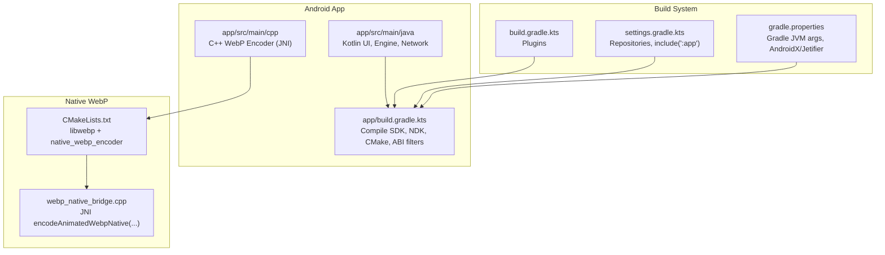
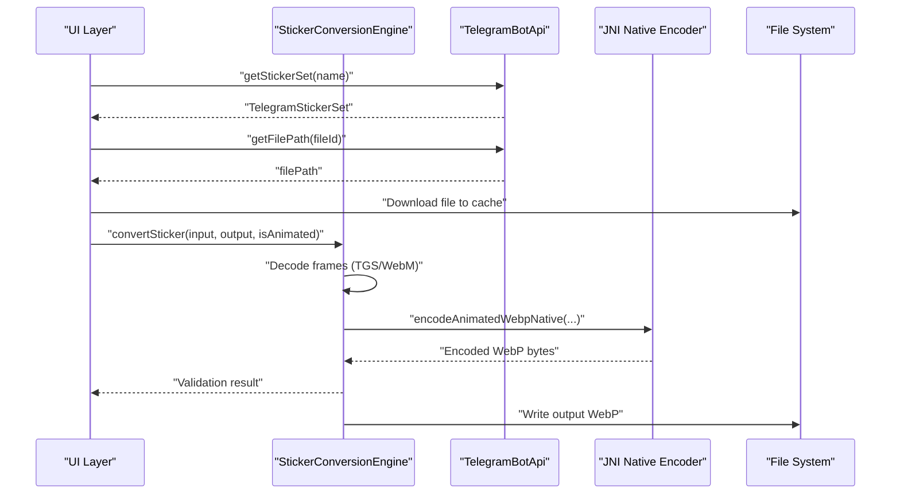
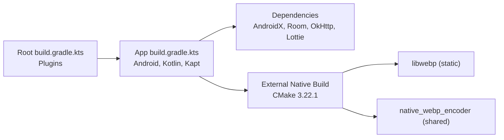

# Getting Started

<cite>
**Referenced Files in This Document**
- [README.md](file://README.md)
- [build.gradle.kts](file://build.gradle.kts)
- [app/build.gradle.kts](file://app/build.gradle.kts)
- [gradle.properties](file://gradle.properties)
- [settings.gradle.kts](file://settings.gradle.kts)
- [local.properties.example](file://local.properties.example)
- [TelegramBotApi.kt](file://app/src/main/java/com/maheshsharan/tel2what/data/network/TelegramBotApi.kt)
- [CMakeLists.txt](file://app/src/main/cpp/CMakeLists.txt)
- [webp_native_bridge.cpp](file://app/src/main/cpp/webp_native_bridge.cpp)
- [StickerConversionEngine.kt](file://app/src/main/java/com/maheshsharan/tel2what/engine/StickerConversionEngine.kt)
- [animated_pipe.md](file://assets/docs/animated_pipe.md)
</cite>

## Table of Contents
1. [Introduction](#introduction)
2. [Project Structure](#project-structure)
3. [Core Components](#core-components)
4. [Architecture Overview](#architecture-overview)
5. [Detailed Component Analysis](#detailed-component-analysis)
6. [Dependency Analysis](#dependency-analysis)
7. [Performance Considerations](#performance-considerations)
8. [Troubleshooting Guide](#troubleshooting-guide)
9. [Conclusion](#conclusion)
10. [Appendices](#appendices)

## Introduction
This guide helps you set up a complete Tel2What development environment on Windows and build the project from source. You will configure Android Studio, JDK, SDK, and NDK, install required native dependencies, obtain and configure a Telegram Bot token, and build both debug and release variants. The guide also covers troubleshooting common setup issues and verifying your installation.

## Project Structure
Tel2What is a single-activity Android application written in Kotlin with a native C++ engine for animated sticker encoding. The app integrates with Telegram’s Bot API to fetch sticker metadata and files, then converts them to WhatsApp-ready animated WebP format using a custom native WebP encoder.

**Diagram sources**
- [app/build.gradle.kts](file://app/build.gradle.kts#L16-L81)
- [CMakeLists.txt](file://app/src/main/cpp/CMakeLists.txt#L1-L44)
- [webp_native_bridge.cpp](file://app/src/main/cpp/webp_native_bridge.cpp#L1-L148)
- [build.gradle.kts](file://build.gradle.kts#L1-L5)
- [settings.gradle.kts](file://settings.gradle.kts#L1-L26)
- [gradle.properties](file://gradle.properties#L1-L12)

**Section sources**
- [README.md](file://README.md#L81-L120)
- [app/build.gradle.kts](file://app/build.gradle.kts#L16-L81)
- [CMakeLists.txt](file://app/src/main/cpp/CMakeLists.txt#L1-L44)
- [webp_native_bridge.cpp](file://app/src/main/cpp/webp_native_bridge.cpp#L1-L148)
- [build.gradle.kts](file://build.gradle.kts#L1-L5)
- [settings.gradle.kts](file://settings.gradle.kts#L1-L26)
- [gradle.properties](file://gradle.properties#L1-L12)

## Core Components
- Android app module with Kotlin UI, conversion engine, and Telegram Bot API integration.
- Native C++ WebP encoder exposed via JNI for fast animated sticker encoding.
- Telegram Bot API client to fetch sticker metadata and file paths.
- Build configuration specifying compile/target SDK, min SDK, ABI filters, and CMake version.

Key build and runtime requirements:
- Android 11 (minSdk 30) and target SDK 34.
- JDK 17.
- Android SDK 34.
- Android NDK (required for native WebP encoding).
- CMake 3.22.1 for native build.

**Section sources**
- [README.md](file://README.md#L81-L120)
- [app/build.gradle.kts](file://app/build.gradle.kts#L16-L81)
- [CMakeLists.txt](file://app/src/main/cpp/CMakeLists.txt#L1-L44)

## Architecture Overview
The app fetches Telegram sticker metadata and files, decodes frames (TGS via Lottie, WebM via MediaCodec), normalizes frames, and encodes them to animated WebP using a native JNI bridge backed by libwebp. The conversion engine coordinates concurrency and adaptive compression to meet WhatsApp constraints.

**Diagram sources**
- [TelegramBotApi.kt](file://app/src/main/java/com/maheshsharan/tel2what/data/network/TelegramBotApi.kt#L22-L111)
- [StickerConversionEngine.kt](file://app/src/main/java/com/maheshsharan/tel2what/engine/StickerConversionEngine.kt#L34-L89)
- [webp_native_bridge.cpp](file://app/src/main/cpp/webp_native_bridge.cpp#L14-L147)

**Section sources**
- [animated_pipe.md](file://assets/docs/animated_pipe.md#L1-L252)
- [StickerConversionEngine.kt](file://app/src/main/java/com/maheshsharan/tel2what/engine/StickerConversionEngine.kt#L34-L89)
- [TelegramBotApi.kt](file://app/src/main/java/com/maheshsharan/tel2what/data/network/TelegramBotApi.kt#L22-L111)

## Detailed Component Analysis

### System Requirements and Setup
- Android Studio: Hedgehog or later.
- JDK: 17.
- Android SDK: 34.
- Android NDK: Required for native WebP encoding.
- CMake: 3.22.1 (explicitly configured in the app module).
- Minimum Android version: Android 11 (API 30).

Verification steps:
- Confirm Android Studio recognizes SDK 34 and NDK.
- Verify Gradle sync completes without plugin or repository errors.
- Ensure CMake 3.22.1 is installed and discoverable by Android Studio.

**Section sources**
- [README.md](file://README.md#L114-L119)
- [app/build.gradle.kts](file://app/build.gradle.kts#L16-L81)
- [CMakeLists.txt](file://app/src/main/cpp/CMakeLists.txt#L1-L44)

### Telegram Bot Token Setup
The app uses the Telegram Bot API to fetch sticker metadata. A demo token is embedded in the source for quick testing, but you should replace it with your own token for production use or to avoid rate limits.

Steps:
1. Open a chat with [@BotFather](https://t.me/BotFather) on Telegram.
2. Send the command to create a new bot.
3. Copy the returned token.
4. Configure the token in your local properties file.

Configuration locations:
- Example local properties file shows the required property key and placeholder value.
- The app reads the token at build time and injects it into BuildConfig.

Notes:
- The included demo token is read-only and safe for testing but may hit rate limits.
- If you receive HTTP 401 or 404 responses, verify your token and ensure it matches the expected format.

**Section sources**
- [README.md](file://README.md#L121-L133)
- [local.properties.example](file://local.properties.example#L7-L12)
- [app/build.gradle.kts](file://app/build.gradle.kts#L29-L30)
- [TelegramBotApi.kt](file://app/src/main/java/com/maheshsharan/tel2what/data/network/TelegramBotApi.kt#L16-L17)
- [TelegramBotApi.kt](file://app/src/main/java/com/maheshsharan/tel2what/data/network/TelegramBotApi.kt#L36-L42)

### Build Instructions
Prerequisites:
- Android Studio Hedgehog or later.
- JDK 17.
- Android SDK 34.
- Android NDK.
- CMake 3.22.1.

Build commands:
- Clone the repository and navigate to the project root.
- Build the debug APK.
- Install the debug APK on a connected device.
- Build the release APK.

Verification:
- After building, check the generated APKs in the app/build/outputs/apk directory.
- Use installDebug to deploy directly to a connected device.

**Section sources**
- [README.md](file://README.md#L134-L149)
- [app/build.gradle.kts](file://app/build.gradle.kts#L42-L53)

### Native WebP Encoder (JNI)
The native engine compiles a subset of libwebp and exposes a JNI function to encode animated WebPs from frame arrays. The app configures CMake and ABI filters to keep the APK small.

Key points:
- CMake minimum version is 3.22.1.
- ABI filters include arm64-v8a and armeabi-v7a.
- The JNI function signature and parameters are defined in the C++ source.
- The native library links against libwebp, android, jnigraphics, and log.

**Section sources**
- [app/build.gradle.kts](file://app/build.gradle.kts#L32-L40)
- [app/build.gradle.kts](file://app/build.gradle.kts#L60-L65)
- [CMakeLists.txt](file://app/src/main/cpp/CMakeLists.txt#L1-L44)
- [webp_native_bridge.cpp](file://app/src/main/cpp/webp_native_bridge.cpp#L14-L147)

### Conversion Engine and Pipeline
The conversion engine orchestrates static and animated sticker processing:
- Detects input type (TGS, WebM, static).
- Routes to appropriate decoder (Lottie for TGS, MediaCodec-based for WebM).
- Normalizes frames to 512x512 and adjusts timing.
- Encodes animated WebP using the native JNI bridge.
- Validates output against WhatsApp constraints.

Concurrency:
- Static conversions allow up to 4 concurrent threads.
- Animated conversions are limited to 1 thread to prevent OOM and thermal throttling.

Compression strategy:
- Starts with quality 25 and method 1 for fast encoding.
- Iteratively reduces quality or FPS to meet the 500KB limit.

**Section sources**
- [StickerConversionEngine.kt](file://app/src/main/java/com/maheshsharan/tel2what/engine/StickerConversionEngine.kt#L24-L28)
- [StickerConversionEngine.kt](file://app/src/main/java/com/maheshsharan/tel2what/engine/StickerConversionEngine.kt#L189-L236)
- [animated_pipe.md](file://assets/docs/animated_pipe.md#L70-L126)

## Dependency Analysis
High-level dependencies:
- Android Gradle Plugin and Kotlin Android plugin.
- AndroidX libraries, Material Components, Navigation Component.
- Room for persistence, OkHttp/Retrofit for networking, Glide for image loading.
- Lottie for TGS decoding.
- Native: libwebp via CMake, JNI bridge.

Build-time configuration:
- Root build script applies Android application and Kotlin plugins.
- App module sets compile/target SDK, min SDK, ABI filters, CMake version, and JDK compatibility.
- Gradle properties enable AndroidX/Jetifier and increase JVM memory for builds.

**Diagram sources**
- [build.gradle.kts](file://build.gradle.kts#L1-L5)
- [app/build.gradle.kts](file://app/build.gradle.kts#L83-L116)
- [CMakeLists.txt](file://app/src/main/cpp/CMakeLists.txt#L26-L43)

**Section sources**
- [build.gradle.kts](file://build.gradle.kts#L1-L5)
- [app/build.gradle.kts](file://app/build.gradle.kts#L83-L116)
- [settings.gradle.kts](file://settings.gradle.kts#L8-L22)
- [gradle.properties](file://gradle.properties#L6-L11)

## Performance Considerations
- Native WebP encoding uses method 1 and quality 25 for fast throughput (~2–3 seconds per animated sticker).
- The pipeline adapts quality and FPS to stay under the 500KB limit.
- Concurrency is tuned to prevent OOM and thermal throttling during animated conversions.
- Frame extraction and normalization preserve aspect ratios and fit within 512x512.

**Section sources**
- [animated_pipe.md](file://assets/docs/animated_pipe.md#L77-L126)
- [StickerConversionEngine.kt](file://app/src/main/java/com/maheshsharan/tel2what/engine/StickerConversionEngine.kt#L189-L236)

## Troubleshooting Guide
Common setup issues and resolutions:

- Gradle sync fails or cannot resolve plugins
  - Ensure Android Studio Hedgehog or later is installed.
  - Verify repositories in settings.gradle.kts are reachable.
  - Confirm Gradle version compatibility.

- Missing SDK or NDK
  - Install Android SDK 34 and Android NDK via SDK Manager.
  - Ensure Android Studio points to the correct sdk.dir in local.properties.

- CMake version mismatch
  - The app requires CMake 3.22.1. Install this version via SDK Manager.
  - Verify CMake path in Android Studio preferences.

- Telegram API errors (401, 404, or “not found”)
  - Replace the demo token with your own in local.properties.
  - Confirm the token format and that the bot is active.
  - Check network connectivity and firewall restrictions.

- Native build failures
  - Ensure NDK is installed and selected in Android Studio.
  - Verify ABI filters match your target devices.
  - Clean and rebuild the project after changing native settings.

- BuildConfig field missing
  - The app reads TELEGRAM_BOT_TOKEN from local.properties and injects it into BuildConfig.
  - If missing, add the token to local.properties and rerun Gradle sync.

Verification steps:
- Build and install the debug variant to a connected device.
- Attempt to import a public Telegram sticker pack link.
- Check logs for Telegram API responses and native encoding logs.

**Section sources**
- [README.md](file://README.md#L121-L133)
- [local.properties.example](file://local.properties.example#L7-L12)
- [app/build.gradle.kts](file://app/build.gradle.kts#L29-L30)
- [TelegramBotApi.kt](file://app/src/main/java/com/maheshsharan/tel2what/data/network/TelegramBotApi.kt#L36-L42)
- [CMakeLists.txt](file://app/src/main/cpp/CMakeLists.txt#L1-L44)

## Conclusion
You now have the prerequisites, configuration steps, and build instructions to develop Tel2What on Windows. By installing Android Studio, JDK 17, SDK 34, and NDK, configuring a Telegram Bot token, and building with Gradle, you can run, test, and iterate on the app. Use the troubleshooting section to resolve common setup issues and verify your environment with debug builds and basic imports.

## Appendices

### Quick Reference: Requirements
- Android Studio: Hedgehog or later
- JDK: 17
- Android SDK: 34
- Android NDK: Required
- CMake: 3.22.1
- Minimum Android: API 30

**Section sources**
- [README.md](file://README.md#L114-L119)
- [app/build.gradle.kts](file://app/build.gradle.kts#L16-L81)