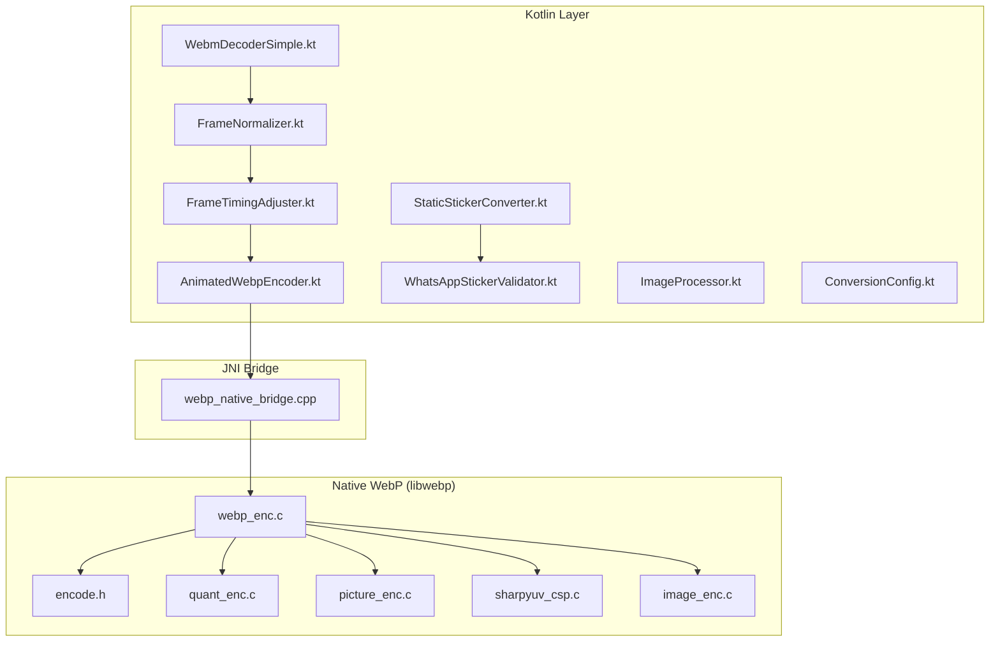
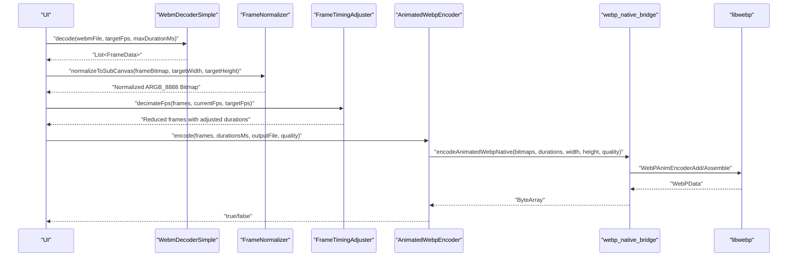
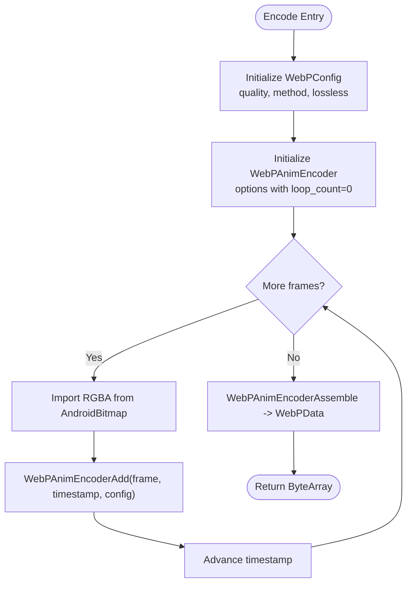
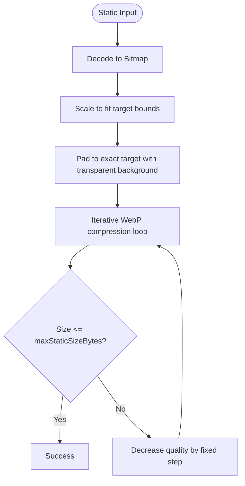
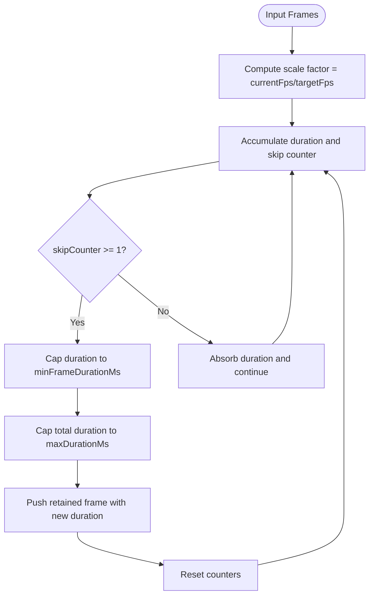
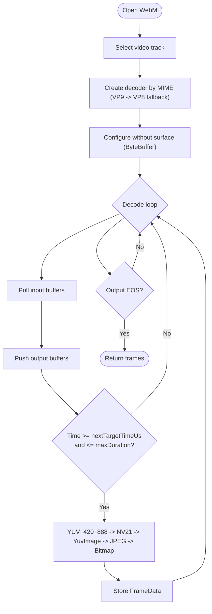
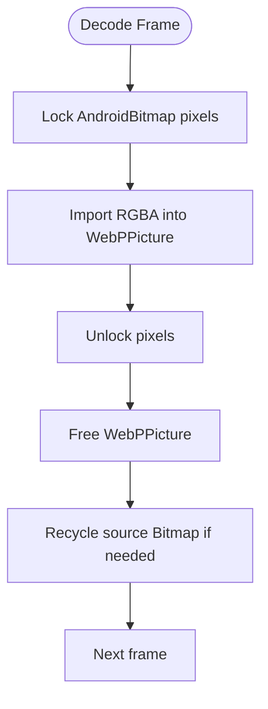
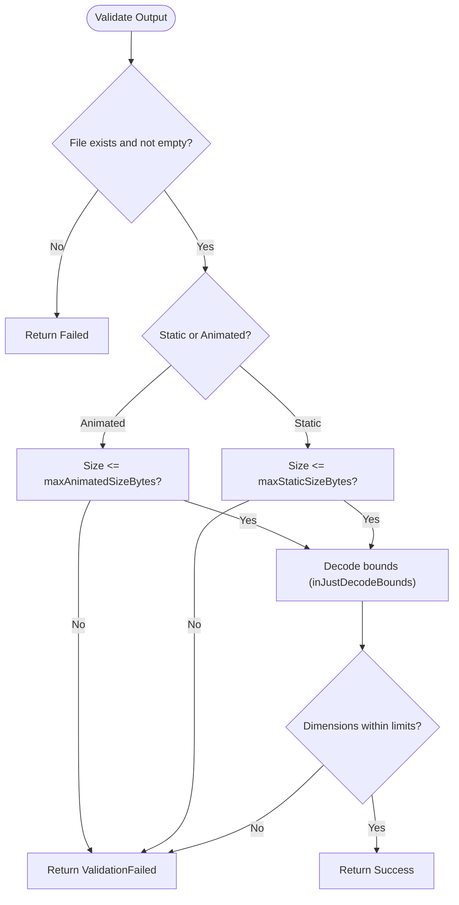
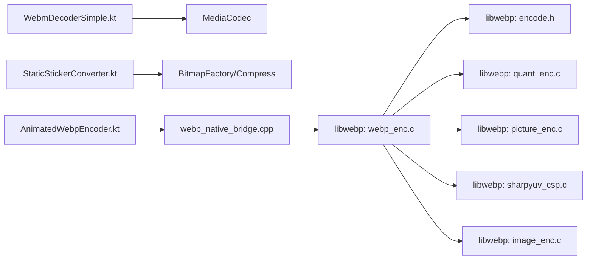

# Performance and Optimization

<cite>
**Referenced Files in This Document**
- [AnimatedWebpEncoder.kt](file://app/src/main/java/com/maheshsharan/tel2what/engine/encoder/AnimatedWebpEncoder.kt)
- [webp_native_bridge.cpp](file://app/src/main/cpp/webp_native_bridge.cpp)
- [FrameNormalizer.kt](file://app/src/main/java/com/maheshsharan/tel2what/engine/frame/FrameNormalizer.kt)
- [FrameTimingAdjuster.kt](file://app/src/main/java/com/maheshsharan/tel2what/engine/frame/FrameTimingAdjuster.kt)
- [StaticStickerConverter.kt](file://app/src/main/java/com/maheshsharan/tel2what/engine/StaticStickerConverter.kt)
- [ConversionConfig.kt](file://app/src/main/java/com/maheshsharan/tel2what/engine/ConversionConfig.kt)
- [WhatsAppStickerValidator.kt](file://app/src/main/java/com/maheshsharan/tel2what/engine/WhatsAppStickerValidator.kt)
- [WebmDecoderSimple.kt](file://app/src/main/java/com/maheshsharan/tel2what/engine/decoder/WebmDecoderSimple.kt)
- [ImageProcessor.kt](file://app/src/main/java/com/maheshsharan/tel2what/utils/ImageProcessor.kt)
- [webp_enc.c](file://app/src/main/cpp/libwebp/src/enc/webp_enc.c)
- [encode.h](file://app/src/main/cpp/libwebp/src/webp/encode.h)
- [quant_enc.c](file://app/src/main/cpp/libwebp/src/enc/quant_enc.c)
- [picture_enc.c](file://app/src/main/cpp/libwebp/src/enc/picture_enc.c)
- [sharpyuv_csp.c](file://app/src/main/cpp/libwebp/sharpyuv/sharpyuv_csp.c)
- [image_enc.c](file://app/src/main/cpp/libwebp/imageio/image_enc.c)
- [nalloc.h](file://app/src/main/cpp/libwebp/tests/fuzzer/nalloc.h)
</cite>

## Table of Contents
1. [Introduction](#introduction)
2. [Project Structure](#project-structure)
3. [Core Components](#core-components)
4. [Architecture Overview](#architecture-overview)
5. [Detailed Component Analysis](#detailed-component-analysis)
6. [Dependency Analysis](#dependency-analysis)
7. [Performance Considerations](#performance-considerations)
8. [Troubleshooting Guide](#troubleshooting-guide)
9. [Conclusion](#conclusion)

## Introduction
This document provides comprehensive performance optimization guidance for Tel2What, focusing on native WebP encoding, memory management, concurrency controls, adaptive compression, frame-rate optimization, video decoding performance, and profiling techniques. It synthesizes the repository’s Kotlin and C++ implementations to deliver actionable recommendations for meeting WhatsApp size and timing constraints while preventing OutOfMemory errors across diverse device capabilities.

## Project Structure
Tel2What’s performance-critical pipeline spans Kotlin coroutines and native C++ via JNI:
- Video ingestion and decoding: MediaCodec-based ByteBuffer extraction and YUV-to-RGB conversion.
- Frame normalization and timing: Aspect-ratio preserving scaling and frame-rate decimation.
- Static and animated WebP generation: Lossy compression with iterative quality tuning and native muxing.
- Validation: Pre-flight checks against WhatsApp constraints to avoid runtime rejections.

**Diagram sources**
- [WebmDecoderSimple.kt](file://app/src/main/java/com/maheshsharan/tel2what/engine/decoder/WebmDecoderSimple.kt#L1-L256)
- [FrameNormalizer.kt](file://app/src/main/java/com/maheshsharan/tel2what/engine/frame/FrameNormalizer.kt#L1-L62)
- [FrameTimingAdjuster.kt](file://app/src/main/java/com/maheshsharan/tel2what/engine/frame/FrameTimingAdjuster.kt#L1-L72)
- [StaticStickerConverter.kt](file://app/src/main/java/com/maheshsharan/tel2what/engine/StaticStickerConverter.kt#L1-L94)
- [AnimatedWebpEncoder.kt](file://app/src/main/java/com/maheshsharan/tel2what/engine/encoder/AnimatedWebpEncoder.kt#L1-L91)
- [WhatsAppStickerValidator.kt](file://app/src/main/java/com/maheshsharan/tel2what/engine/WhatsAppStickerValidator.kt#L1-L50)
- [ImageProcessor.kt](file://app/src/main/java/com/maheshsharan/tel2what/utils/ImageProcessor.kt#L1-L34)
- [webp_native_bridge.cpp](file://app/src/main/cpp/webp_native_bridge.cpp#L1-L148)
- [webp_enc.c](file://app/src/main/cpp/libwebp/src/enc/webp_enc.c#L79-L107)
- [encode.h](file://app/src/main/cpp/libwebp/src/webp/encode.h#L123-L143)
- [quant_enc.c](file://app/src/main/cpp/libwebp/src/enc/quant_enc.c#L269-L415)
- [picture_enc.c](file://app/src/main/cpp/libwebp/src/enc/picture_enc.c#L202-L247)
- [sharpyuv_csp.c](file://app/src/main/cpp/libwebp/sharpyuv/sharpyuv_csp.c#L1-L39)
- [image_enc.c](file://app/src/main/cpp/libwebp/imageio/image_enc.c#L294-L334)

**Section sources**
- [WebmDecoderSimple.kt](file://app/src/main/java/com/maheshsharan/tel2what/engine/decoder/WebmDecoderSimple.kt#L1-L256)
- [AnimatedWebpEncoder.kt](file://app/src/main/java/com/maheshsharan/tel2what/engine/encoder/AnimatedWebpEncoder.kt#L1-L91)
- [webp_native_bridge.cpp](file://app/src/main/cpp/webp_native_bridge.cpp#L1-L148)

## Core Components
- Video decoder: Extracts frames at target FPS, converts YUV_420_888 to RGB efficiently, and caps duration to meet WhatsApp limits.
- Frame normalizer: Preserves aspect ratio and fills to exact target bounds with transparent letterboxes.
- Timing adjuster: Decimates frames to reduce bitrate and file size while respecting minimum per-frame duration and total animation duration.
- Static converter: Iterative WebP compression loop to guarantee size compliance under constraints.
- Animated encoder: JNI bridge to native WebP animation muxer with lossy compression and fast method selection.
- Validator: Pre-flight size and dimension checks to fail fast and avoid downstream failures.
- Tray icon processor: Efficient WebP_LOSSY generation for small icons with quality ramp.

**Section sources**
- [WebmDecoderSimple.kt](file://app/src/main/java/com/maheshsharan/tel2what/engine/decoder/WebmDecoderSimple.kt#L1-L256)
- [FrameNormalizer.kt](file://app/src/main/java/com/maheshsharan/tel2what/engine/frame/FrameNormalizer.kt#L1-L62)
- [FrameTimingAdjuster.kt](file://app/src/main/java/com/maheshsharan/tel2what/engine/frame/FrameTimingAdjuster.kt#L1-L72)
- [StaticStickerConverter.kt](file://app/src/main/java/com/maheshsharan/tel2what/engine/StaticStickerConverter.kt#L1-L94)
- [AnimatedWebpEncoder.kt](file://app/src/main/java/com/maheshsharan/tel2what/engine/encoder/AnimatedWebpEncoder.kt#L1-L91)
- [WhatsAppStickerValidator.kt](file://app/src/main/java/com/maheshsharan/tel2what/engine/WhatsAppStickerValidator.kt#L1-L50)
- [ImageProcessor.kt](file://app/src/main/java/com/maheshsharan/tel2what/utils/ImageProcessor.kt#L1-L34)

## Architecture Overview
The pipeline integrates Kotlin coroutines with native WebP encoding through JNI. Decoding uses MediaCodec in ByteBuffer mode to minimize overhead, followed by normalization and optional frame-rate reduction. Encoding leverages libwebp’s animation encoder with tuned configuration for speed and size.

**Diagram sources**
- [WebmDecoderSimple.kt](file://app/src/main/java/com/maheshsharan/tel2what/engine/decoder/WebmDecoderSimple.kt#L23-L192)
- [FrameNormalizer.kt](file://app/src/main/java/com/maheshsharan/tel2what/engine/frame/FrameNormalizer.kt#L17-L60)
- [FrameTimingAdjuster.kt](file://app/src/main/java/com/maheshsharan/tel2what/engine/frame/FrameTimingAdjuster.kt#L16-L70)
- [AnimatedWebpEncoder.kt](file://app/src/main/java/com/maheshsharan/tel2what/engine/encoder/AnimatedWebpEncoder.kt#L32-L78)
- [webp_native_bridge.cpp](file://app/src/main/cpp/webp_native_bridge.cpp#L14-L147)

## Detailed Component Analysis

### Native WebP Encoding Performance
- Method and quality: Fast method selection and lossy compression are configured to balance speed and size.
- Memory growth: Dynamic buffer resizing prevents repeated reallocations and reduces fragmentation risk.
- Tool mapping: Config-to-tools mapping selects RD optimization levels and trellis based on method.

**Diagram sources**
- [webp_native_bridge.cpp](file://app/src/main/cpp/webp_native_bridge.cpp#L28-L131)
- [webp_enc.c](file://app/src/main/cpp/libwebp/src/enc/webp_enc.c#L99-L107)
- [encode.h](file://app/src/main/cpp/libwebp/src/webp/encode.h#L123-L143)

**Section sources**
- [webp_native_bridge.cpp](file://app/src/main/cpp/webp_native_bridge.cpp#L28-L131)
- [webp_enc.c](file://app/src/main/cpp/libwebp/src/enc/webp_enc.c#L99-L107)
- [encode.h](file://app/src/main/cpp/libwebp/src/webp/encode.h#L123-L143)

### Adaptive Compression and Quality Tuning
- Static WebP: Iterative compression loop lowers quality in steps until the output fits under the static size cap.
- Animated WebP: Target quality passed via JNI; combined with fast method and lossy encoding to meet animated size limits.
- Quantization and SNS: Quantization tables and segmental adjustments adapt to content complexity and user-specified strength.

**Diagram sources**
- [StaticStickerConverter.kt](file://app/src/main/java/com/maheshsharan/tel2what/engine/StaticStickerConverter.kt#L50-L72)
- [encode.h](file://app/src/main/cpp/libwebp/src/webp/encode.h#L123-L143)
- [quant_enc.c](file://app/src/main/cpp/libwebp/src/enc/quant_enc.c#L386-L415)

**Section sources**
- [StaticStickerConverter.kt](file://app/src/main/java/com/maheshsharan/tel2what/engine/StaticStickerConverter.kt#L50-L72)
- [quant_enc.c](file://app/src/main/cpp/libwebp/src/enc/quant_enc.c#L386-L415)

### Frame Rate Optimization and Timing Control
- Decimation: Reduces frame count by accumulating durations and enforcing minimum per-frame duration and total animation duration.
- Constraints: Enforces minimum frame duration and caps total animation length to satisfy client requirements.

**Diagram sources**
- [FrameTimingAdjuster.kt](file://app/src/main/java/com/maheshsharan/tel2what/engine/frame/FrameTimingAdjuster.kt#L16-L70)

**Section sources**
- [FrameTimingAdjuster.kt](file://app/src/main/java/com/maheshsharan/tel2what/engine/frame/FrameTimingAdjuster.kt#L16-L70)
- [ConversionConfig.kt](file://app/src/main/java/com/maheshsharan/tel2what/engine/ConversionConfig.kt#L3-L13)

### Video Decoding Performance Optimizations
- ByteBuffer decoding: Avoids surface rendering overhead and reduces format mismatches.
- Codec fallback: Attempts VP9 first, falls back to VP8 if necessary.
- YUV conversion: Uses YuvImage + JPEG compression path for fast conversion to RGB, then Bitmap creation.
- Duration capping: Stops decoding beyond the configured maximum duration.

**Diagram sources**
- [WebmDecoderSimple.kt](file://app/src/main/java/com/maheshsharan/tel2what/engine/decoder/WebmDecoderSimple.kt#L89-L192)
- [WebmDecoderSimple.kt](file://app/src/main/java/com/maheshsharan/tel2what/engine/decoder/WebmDecoderSimple.kt#L205-L254)

**Section sources**
- [WebmDecoderSimple.kt](file://app/src/main/java/com/maheshsharan/tel2what/engine/decoder/WebmDecoderSimple.kt#L89-L192)
- [WebmDecoderSimple.kt](file://app/src/main/java/com/maheshsharan/tel2what/engine/decoder/WebmDecoderSimple.kt#L205-L254)

### Memory Management and Concurrency Controls
- Bitmap lifecycle: Normalize and converter routines recycle intermediate bitmaps to reduce heap pressure and fragmentation.
- Concurrency: Decoding runs on Dispatchers.IO; yields are used to keep UI responsive.
- JNI boundaries: Proper locking/unlocking of bitmap pixels and releasing local references to prevent leaks.
- Buffer growth: Dynamic memory writer resizes buffers safely to avoid repeated allocations.

**Diagram sources**
- [webp_native_bridge.cpp](file://app/src/main/cpp/webp_native_bridge.cpp#L66-L111)
- [FrameNormalizer.kt](file://app/src/main/java/com/maheshsharan/tel2what/engine/frame/FrameNormalizer.kt#L52-L57)
- [StaticStickerConverter.kt](file://app/src/main/java/com/maheshsharan/tel2what/engine/StaticStickerConverter.kt#L88-L91)

**Section sources**
- [webp_native_bridge.cpp](file://app/src/main/cpp/webp_native_bridge.cpp#L66-L111)
- [FrameNormalizer.kt](file://app/src/main/java/com/maheshsharan/tel2what/engine/frame/FrameNormalizer.kt#L52-L57)
- [StaticStickerConverter.kt](file://app/src/main/java/com/maheshsharan/tel2what/engine/StaticStickerConverter.kt#L88-L91)
- [picture_enc.c](file://app/src/main/cpp/libwebp/src/enc/picture_enc.c#L202-L247)

### Validation and Size Compliance
- Pre-flight checks: Validates file existence, emptiness, and size against static/animated limits.
- Dimension check: Uses BitmapFactory with inJustDecodeBounds to quickly fetch dimensions without loading full pixel data.

**Diagram sources**
- [WhatsAppStickerValidator.kt](file://app/src/main/java/com/maheshsharan/tel2what/engine/WhatsAppStickerValidator.kt#L14-L50)

**Section sources**
- [WhatsAppStickerValidator.kt](file://app/src/main/java/com/maheshsharan/tel2what/engine/WhatsAppStickerValidator.kt#L14-L50)

## Dependency Analysis
Key performance dependencies:
- Kotlin coroutines drive I/O-bound tasks (decoding, compression).
- JNI bridges native WebP encoding to Kotlin.
- libwebp provides encoding tools, quantization, and memory management primitives.
- Android APIs (MediaCodec, Bitmap, YuvImage) underpin decoding and conversion.

**Diagram sources**
- [WebmDecoderSimple.kt](file://app/src/main/java/com/maheshsharan/tel2what/engine/decoder/WebmDecoderSimple.kt#L89-L192)
- [StaticStickerConverter.kt](file://app/src/main/java/com/maheshsharan/tel2what/engine/StaticStickerConverter.kt#L50-L72)
- [AnimatedWebpEncoder.kt](file://app/src/main/java/com/maheshsharan/tel2what/engine/encoder/AnimatedWebpEncoder.kt#L32-L78)
- [webp_native_bridge.cpp](file://app/src/main/cpp/webp_native_bridge.cpp#L28-L131)
- [webp_enc.c](file://app/src/main/cpp/libwebp/src/enc/webp_enc.c#L99-L107)
- [encode.h](file://app/src/main/cpp/libwebp/src/webp/encode.h#L123-L143)
- [quant_enc.c](file://app/src/main/cpp/libwebp/src/enc/quant_enc.c#L386-L415)
- [picture_enc.c](file://app/src/main/cpp/libwebp/src/enc/picture_enc.c#L202-L247)
- [sharpyuv_csp.c](file://app/src/main/cpp/libwebp/sharpyuv/sharpyuv_csp.c#L1-L39)
- [image_enc.c](file://app/src/main/cpp/libwebp/imageio/image_enc.c#L294-L334)

**Section sources**
- [WebmDecoderSimple.kt](file://app/src/main/java/com/maheshsharan/tel2what/engine/decoder/WebmDecoderSimple.kt#L89-L192)
- [AnimatedWebpEncoder.kt](file://app/src/main/java/com/maheshsharan/tel2what/engine/encoder/AnimatedWebpEncoder.kt#L32-L78)
- [webp_native_bridge.cpp](file://app/src/main/cpp/webp_native_bridge.cpp#L28-L131)

## Performance Considerations
- Encoding speed vs quality: Use fast method and moderate quality for animated WebP; iterate quality for static WebP to meet size targets.
- Frame-rate decimation: Reduce FPS to decrease bitrate and file size; enforce minimum per-frame duration and total animation duration.
- Memory footprint: Normalize frames to exact target size, recycle intermediate bitmaps, and leverage dynamic buffer growth in native code.
- Hardware acceleration: Prefer MediaCodec for decoding; ensure proper fallback to VP8 when needed.
- Color space conversion: Use efficient YUV-to-RGB conversion path and avoid unnecessary format conversions.
- Concurrency: Offload I/O-bound work to Dispatchers.IO and yield periodically to maintain responsiveness.
- Validation-first: Validate size and dimensions early to avoid wasted computation.

[No sources needed since this section provides general guidance]

## Troubleshooting Guide
- JNI load failures: Verify library loading and handle UnsatisfiedLinkError gracefully.
- Empty or missing files: Validate existence and size before processing.
- Excessive memory usage: Monitor bitmap lifecycles and ensure recycling; consider reducing frame count or resolution.
- Slow decoding: Confirm codec availability and fallback; ensure ByteBuffer mode is used.
- Validation failures: Check size and dimension limits; log detected values for diagnostics.

**Section sources**
- [AnimatedWebpEncoder.kt](file://app/src/main/java/com/maheshsharan/tel2what/engine/encoder/AnimatedWebpEncoder.kt#L13-L20)
- [WhatsAppStickerValidator.kt](file://app/src/main/java/com/maheshsharan/tel2what/engine/WhatsAppStickerValidator.kt#L19-L40)
- [WebmDecoderSimple.kt](file://app/src/main/java/com/maheshsharan/tel2what/engine/decoder/WebmDecoderSimple.kt#L32-L40)

## Conclusion
Tel2What’s performance strategy combines efficient video decoding, precise frame normalization and timing, adaptive compression, and robust validation to consistently produce WhatsApp-compliant stickers. By tuning encoding parameters, controlling memory usage, leveraging hardware acceleration, and applying targeted frame-rate optimizations, the system achieves reliable performance across a wide range of devices while minimizing the risk of OutOfMemory errors.