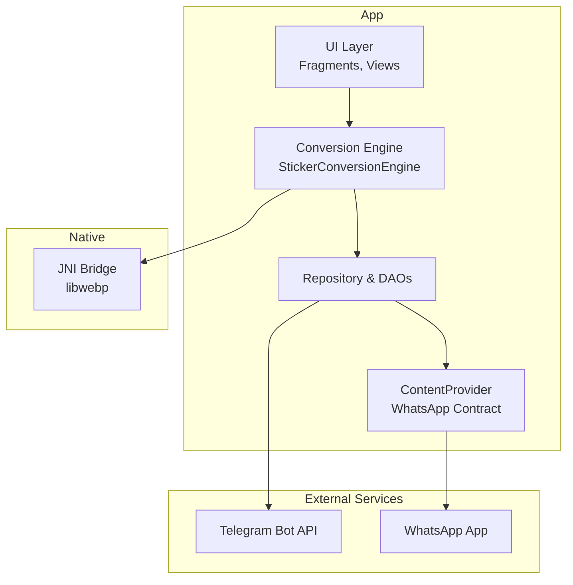
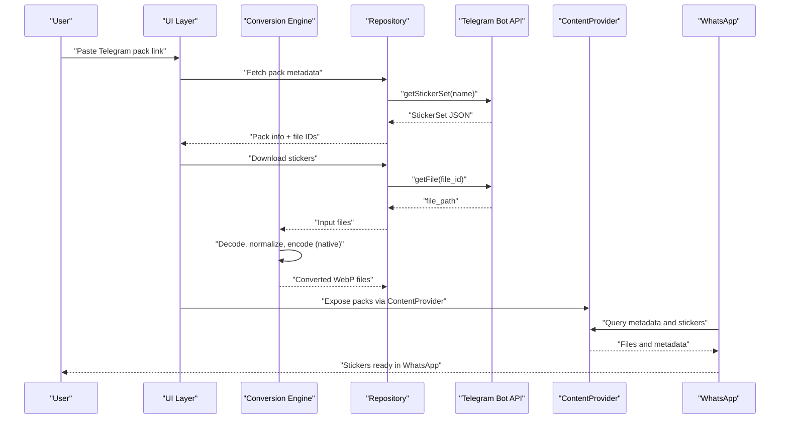
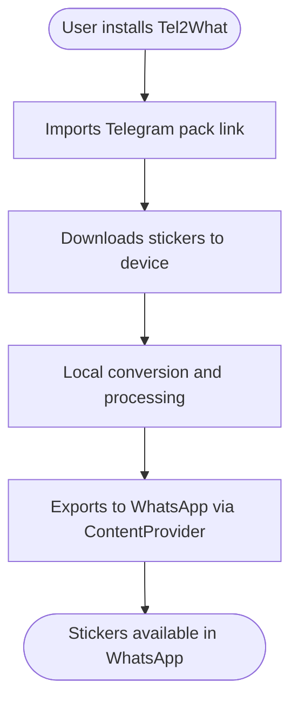
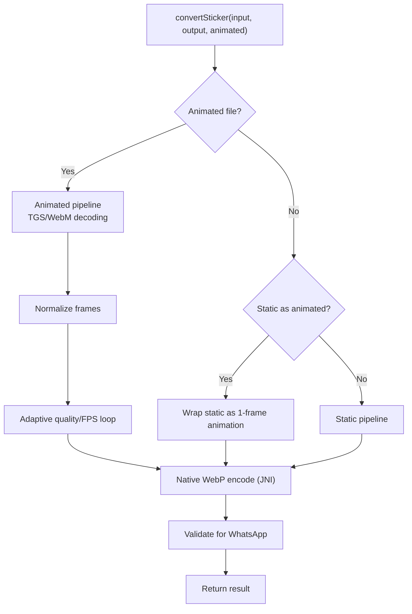
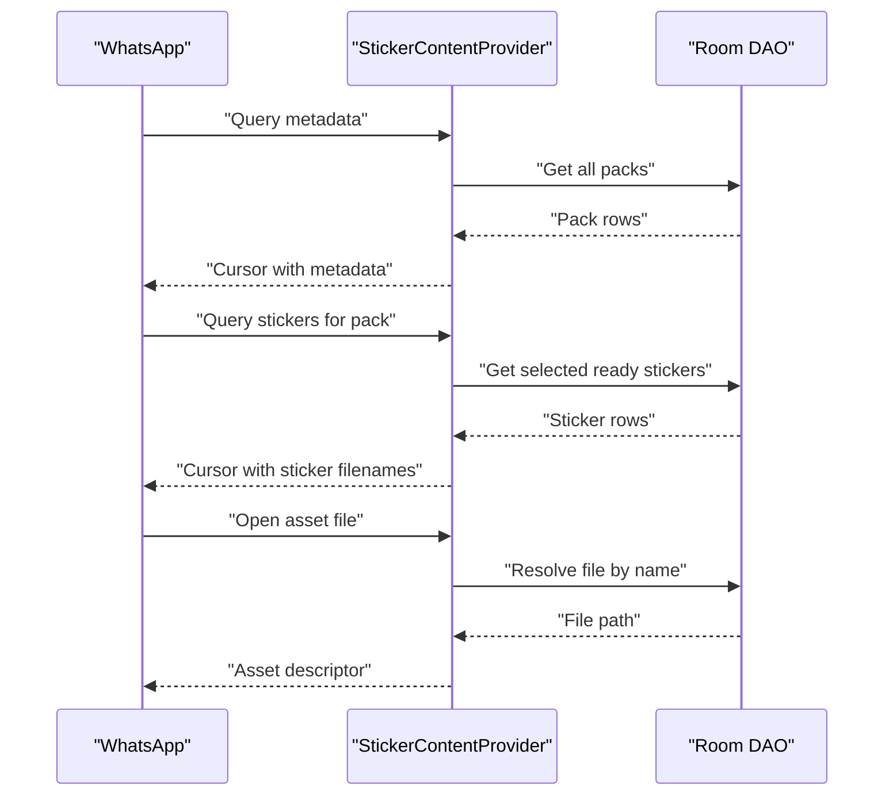
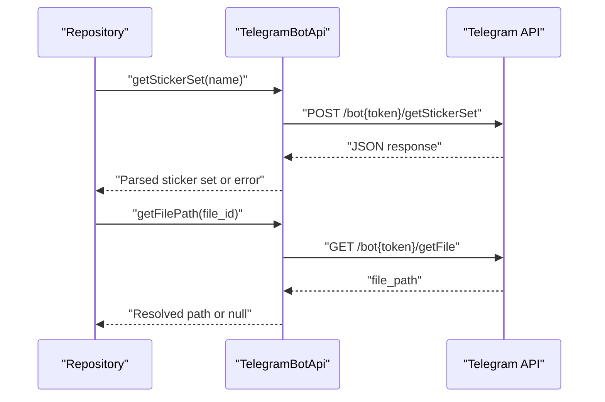
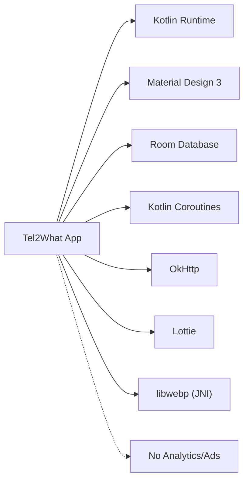

# Introduction and Philosophy

<cite>
**Referenced Files in This Document**
- [README.md](file://README.md)
- [CHANGELOG.md](file://CHANGELOG.md)
- [AndroidManifest.xml](file://app/src/main/AndroidManifest.xml)
- [Tel2WhatApplication.kt](file://app/src/main/java/com/maheshsharan/tel2what/Tel2WhatApplication.kt)
- [StickerConversionEngine.kt](file://app/src/main/java/com/maheshsharan/tel2what/engine/StickerConversionEngine.kt)
- [TelegramBotApi.kt](file://app/src/main/java/com/maheshsharan/tel2what/data/network/TelegramBotApi.kt)
- [StickerContentProvider.kt](file://app/src/main/java/com/maheshsharan/tel2what/provider/StickerContentProvider.kt)
- [privacy-policy.html](file://docs/privacy-policy.html)
- [terms-of-service.html](file://docs/terms-of-service.html)
</cite>

## Table of Contents
1. [Introduction](#introduction)
2. [Project Structure](#project-structure)
3. [Core Components](#core-components)
4. [Architecture Overview](#architecture-overview)
5. [Detailed Component Analysis](#detailed-component-analysis)
6. [Dependency Analysis](#dependency-analysis)
7. [Performance Considerations](#performance-considerations)
8. [Troubleshooting Guide](#troubleshooting-guide)
9. [Conclusion](#conclusion)
10. [Appendices](#appendices)

## Introduction
Tel2What is a privacy-focused Android application that converts Telegram sticker packs into a format compatible with WhatsApp. Its mission is to give users full control over their sticker collections without sacrificing privacy, transparency, or local data sovereignty. The app solves a real-world problem: the inability to transfer Telegram sticker packs to WhatsApp without exposing user data to third parties or cloud services.

Philosophy and values
- Privacy-first design: Everything happens locally on your device. There is no data collection, no analytics, no cloud upload, and no tracking.
- Transparency through openness: The entire codebase is open source, enabling users and security researchers to inspect, verify, and audit the app’s behavior.
- Minimal permissions: The app requests only essential permissions for core functionality—internet access to download stickers and storage to save them locally.
- Ethical technology: Tel2What avoids ads, telemetry, and unnecessary data flows. It respects user autonomy and data ownership.

Why Tel2What matters
In an era where digital privacy is increasingly under threat, Tel2What demonstrates that powerful features can be delivered responsibly. By keeping processing offline, minimizing data exposure, and operating with clear, auditable code, Tel2What offers a trustworthy alternative in the mobile ecosystem. Users can enjoy animated stickers, batch conversion, and seamless export to WhatsApp—all while retaining control over their data.

## Project Structure
At a high level, Tel2What follows a modular Android architecture:
- UI layer: Fragments and Activities organized around a single-activity pattern, with Material Design 3 and Navigation Component.
- Domain logic: A dedicated conversion engine that orchestrates decoding, normalization, timing adjustment, and native WebP encoding.
- Data layer: Room database-backed repositories and a Telegram Bot API client for metadata retrieval.
- Provider layer: A ContentProvider that speaks WhatsApp’s expected contract to surface sticker packs and assets.
- Native layer: A C++ WebP encoder bridged via JNI for fast, hardware-accelerated encoding.

**Diagram sources**
- [StickerConversionEngine.kt](file://app/src/main/java/com/maheshsharan/tel2what/engine/StickerConversionEngine.kt#L1-L275)
- [StickerContentProvider.kt](file://app/src/main/java/com/maheshsharan/tel2what/provider/StickerContentProvider.kt#L1-L244)
- [TelegramBotApi.kt](file://app/src/main/java/com/maheshsharan/tel2what/data/network/TelegramBotApi.kt#L1-L112)

**Section sources**
- [README.md](file://README.md#L98-L110)
- [AndroidManifest.xml](file://app/src/main/AndroidManifest.xml#L1-L39)

## Core Components
- Conversion Engine: Orchestrates static and animated pipelines, manages concurrency, and ensures output meets WhatsApp constraints.
- Telegram Bot API: Fetches sticker metadata and resolves file paths for download.
- ContentProvider: Exposes sticker packs and assets to WhatsApp using the official contract.
- Application Initialization: Sets up runtime safety checks for development and debugging.

Key capabilities aligned with the mission:
- Fully offline processing after initial download.
- Transparent, auditable conversion pipeline.
- Minimal permissions and no data collection.

**Section sources**
- [StickerConversionEngine.kt](file://app/src/main/java/com/maheshsharan/tel2what/engine/StickerConversionEngine.kt#L1-L275)
- [TelegramBotApi.kt](file://app/src/main/java/com/maheshsharan/tel2what/data/network/TelegramBotApi.kt#L1-L112)
- [StickerContentProvider.kt](file://app/src/main/java/com/maheshsharan/tel2what/provider/StickerContentProvider.kt#L1-L244)
- [Tel2WhatApplication.kt](file://app/src/main/java/com/maheshsharan/tel2what/Tel2WhatApplication.kt#L1-L46)

## Architecture Overview
Tel2What’s architecture emphasizes user control and local processing:
- Initial import uses Telegram Bot API to fetch metadata and file paths.
- Download occurs directly to the device.
- Conversion runs entirely on-device, leveraging native WebP encoding.
- Export integrates with WhatsApp via a ContentProvider that adheres to WhatsApp’s expected URIs and MIME types.

**Diagram sources**
- [TelegramBotApi.kt](file://app/src/main/java/com/maheshsharan/tel2what/data/network/TelegramBotApi.kt#L22-L73)
- [StickerConversionEngine.kt](file://app/src/main/java/com/maheshsharan/tel2what/engine/StickerConversionEngine.kt#L33-L88)
- [StickerContentProvider.kt](file://app/src/main/java/com/maheshsharan/tel2what/provider/StickerContentProvider.kt#L74-L165)

**Section sources**
- [README.md](file://README.md#L11-L31)
- [AndroidManifest.xml](file://app/src/main/AndroidManifest.xml#L19-L35)

## Detailed Component Analysis

### Privacy and Transparency
- No data collection: The privacy policy explicitly states no personal data is collected, stored, or transmitted.
- Open source: Users can inspect the codebase and verify privacy claims.
- Minimal permissions: Only internet and storage permissions are requested for core functionality.
- Fully offline: After initial download, all processing remains on-device.

**Diagram sources**
- [privacy-policy.html](file://docs/privacy-policy.html#L49-L95)
- [AndroidManifest.xml](file://app/src/main/AndroidManifest.xml#L3-L9)

**Section sources**
- [privacy-policy.html](file://docs/privacy-policy.html#L49-L95)
- [terms-of-service.html](file://docs/terms-of-service.html#L46-L77)
- [AndroidManifest.xml](file://app/src/main/AndroidManifest.xml#L3-L9)

### Conversion Pipeline and Local Processing
- Animated vs static routing: The engine selects the appropriate pipeline based on file type and pack characteristics.
- Concurrency control: Limits animated processing to prevent thermal throttling and memory pressure while allowing parallel static conversions.
- Native WebP encoding: Uses JNI to libwebp for fast, hardware-accelerated encoding.
- Validation: Ensures output meets WhatsApp constraints (size, format, dimensions).

**Diagram sources**
- [StickerConversionEngine.kt](file://app/src/main/java/com/maheshsharan/tel2what/engine/StickerConversionEngine.kt#L33-L88)
- [StickerConversionEngine.kt](file://app/src/main/java/com/maheshsharan/tel2what/engine/StickerConversionEngine.kt#L131-L273)

**Section sources**
- [StickerConversionEngine.kt](file://app/src/main/java/com/maheshsharan/tel2what/engine/StickerConversionEngine.kt#L23-L27)
- [README.md](file://README.md#L32-L39)

### ContentProvider and WhatsApp Integration
- Contract compliance: The provider exposes metadata and sticker assets using exact column names and MIME types expected by WhatsApp.
- URI routing: Supports queries for metadata, sticker lists, and asset retrieval.
- Local serving: Assets are served from the device’s storage, maintaining end-to-end privacy.

**Diagram sources**
- [StickerContentProvider.kt](file://app/src/main/java/com/maheshsharan/tel2what/provider/StickerContentProvider.kt#L74-L165)
- [StickerContentProvider.kt](file://app/src/main/java/com/maheshsharan/tel2what/provider/StickerContentProvider.kt#L189-L235)

**Section sources**
- [StickerContentProvider.kt](file://app/src/main/java/com/maheshsharan/tel2what/provider/StickerContentProvider.kt#L21-L61)
- [AndroidManifest.xml](file://app/src/main/AndroidManifest.xml#L19-L24)

### Telegram Bot API and Minimal Data Exposure
- Read-only operations: The API is used solely to fetch metadata and file paths.
- Token handling: A demo token is included for testing; users can replace it with their own to avoid rate limits.
- Error handling: Clear messaging for invalid tokens, missing packs, and network issues.

**Diagram sources**
- [TelegramBotApi.kt](file://app/src/main/java/com/maheshsharan/tel2what/data/network/TelegramBotApi.kt#L22-L73)
- [TelegramBotApi.kt](file://app/src/main/java/com/maheshsharan/tel2what/data/network/TelegramBotApi.kt#L75-L106)

**Section sources**
- [TelegramBotApi.kt](file://app/src/main/java/com/maheshsharan/tel2what/data/network/TelegramBotApi.kt#L16-L17)
- [TelegramBotApi.kt](file://app/src/main/java/com/maheshsharan/tel2what/data/network/TelegramBotApi.kt#L36-L57)

## Dependency Analysis
Tel2What’s dependencies reflect a privacy-preserving, minimal-stack approach:
- Kotlin for modern Android development.
- Material Design 3 and Navigation Component for UI.
- Room for local data persistence.
- OkHttp/Retrofit for network operations.
- Lottie for TGS decoding.
- libwebp via JNI for native encoding.
- No analytics, crash reporting, or advertising SDKs.

**Diagram sources**
- [README.md](file://README.md#L87-L96)

**Section sources**
- [README.md](file://README.md#L87-L96)

## Performance Considerations
- Native acceleration: JNI-based WebP encoding reduces conversion time per sticker.
- Adaptive compression: The engine lowers quality and FPS iteratively to meet size constraints.
- Concurrency management: Limits animated processing to prevent OOM and thermal throttling.
- Memory hygiene: Bitmap recycling and careful resource lifecycle management.

[No sources needed since this section provides general guidance]

## Troubleshooting Guide
Common issues and resolutions:
- Invalid Telegram Bot Token: Replace the token with your own to avoid unauthorized or rate-limited responses.
- Sticker pack not found: Verify the Telegram link and ensure the pack is public.
- Network errors: Confirm connectivity and retry; the app handles unknown host exceptions gracefully.
- Export failures: Ensure the ContentProvider is properly exposed and WhatsApp can query metadata and assets.

**Section sources**
- [TelegramBotApi.kt](file://app/src/main/java/com/maheshsharan/tel2what/data/network/TelegramBotApi.kt#L36-L57)
- [TelegramBotApi.kt](file://app/src/main/java/com/maheshsharan/tel2what/data/network/TelegramBotApi.kt#L67-L72)
- [AndroidManifest.xml](file://app/src/main/AndroidManifest.xml#L19-L24)

## Conclusion
Tel2What embodies a principled approach to mobile app development: privacy, transparency, and user control. By keeping everything local, minimizing permissions, and delivering a robust conversion pipeline, it enables users to move their Telegram stickers to WhatsApp without compromise. As digital privacy becomes ever more critical, Tel2What stands as a practical example of ethical technology design in action.

[No sources needed since this section summarizes without analyzing specific files]

## Appendices
- Legal and policy documents are available in the repository for transparency and compliance verification.

**Section sources**
- [privacy-policy.html](file://docs/privacy-policy.html#L1-L106)
- [terms-of-service.html](file://docs/terms-of-service.html#L1-L94)