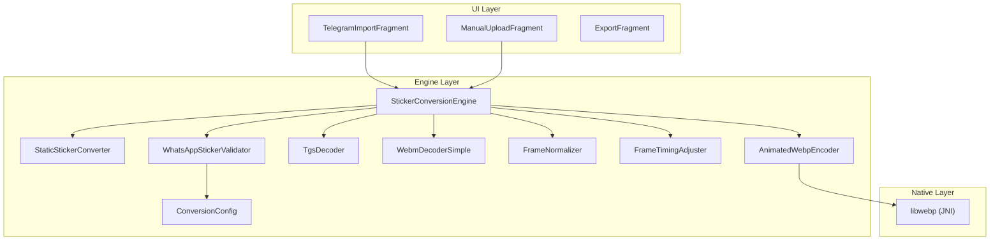
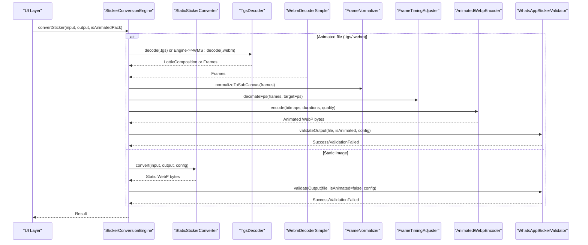
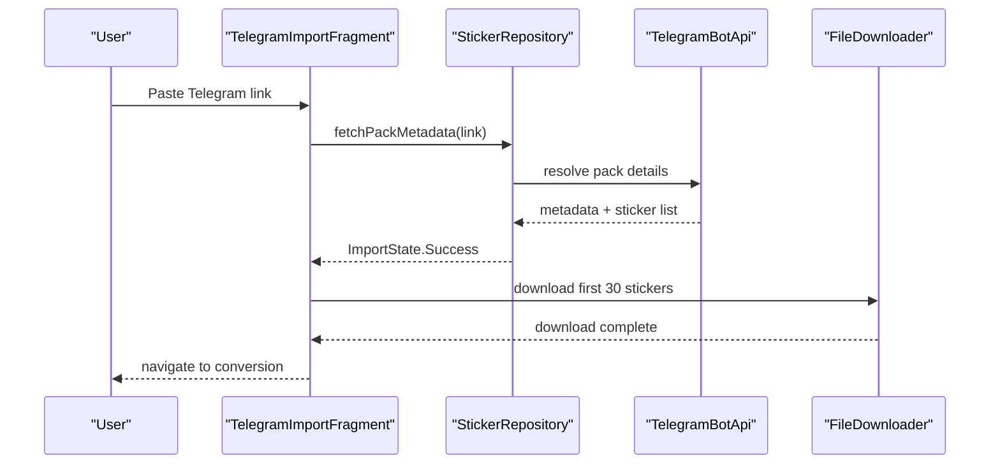
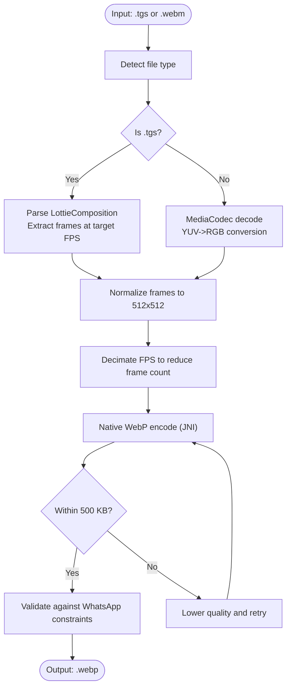
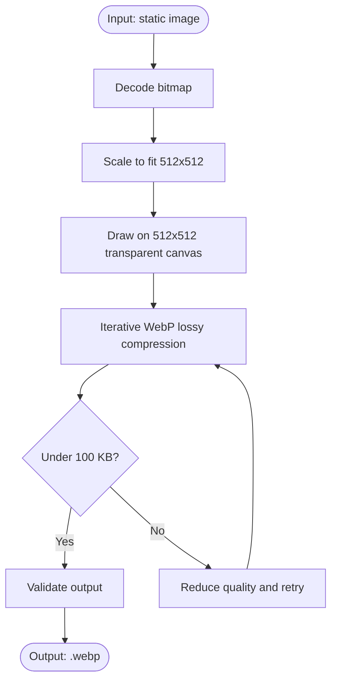
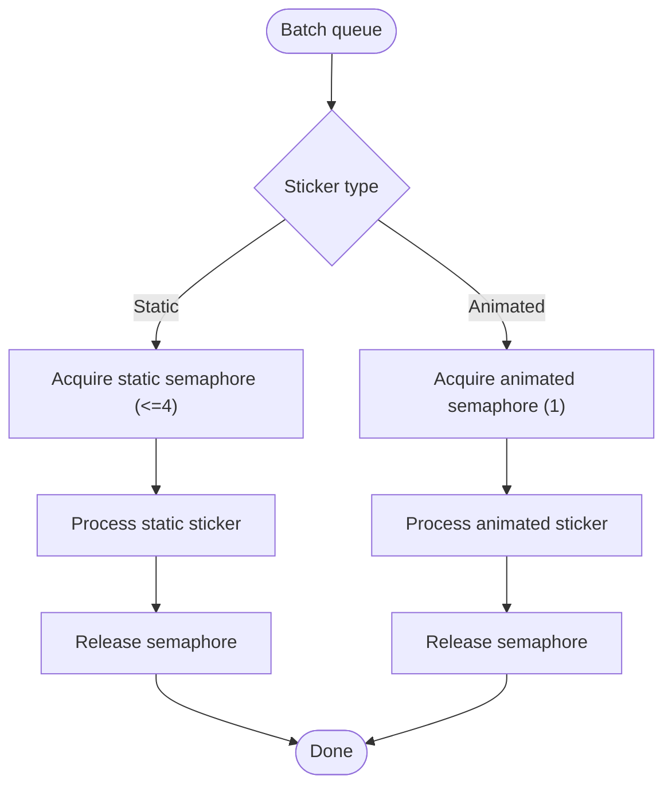
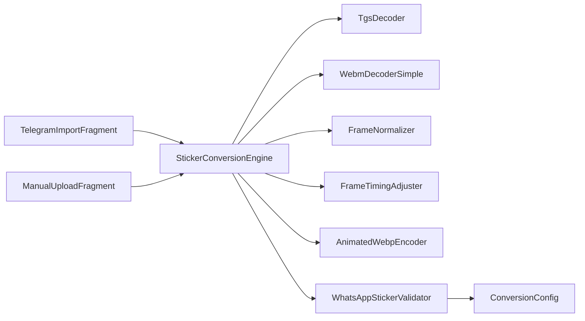

# Key Features and Capabilities

<cite>
**Referenced Files in This Document**
- [README.md](file://README.md)
- [StickerConversionEngine.kt](file://app/src/main/java/com/maheshsharan/tel2what/engine/StickerConversionEngine.kt)
- [StaticStickerConverter.kt](file://app/src/main/java/com/maheshsharan/tel2what/engine/StaticStickerConverter.kt)
- [AnimatedWebpEncoder.kt](file://app/src/main/java/com/maheshsharan/tel2what/engine/encoder/AnimatedWebpEncoder.kt)
- [TgsDecoder.kt](file://app/src/main/java/com/maheshsharan/tel2what/engine/decoder/TgsDecoder.kt)
- [WebmDecoderSimple.kt](file://app/src/main/java/com/maheshsharan/tel2what/engine/decoder/WebmDecoderSimple.kt)
- [FrameExtractor.kt](file://app/src/main/java/com/maheshsharan/tel2what/engine/decoder/FrameExtractor.kt)
- [FrameNormalizer.kt](file://app/src/main/java/com/maheshsharan/tel2what/engine/frame/FrameNormalizer.kt)
- [FrameTimingAdjuster.kt](file://app/src/main/java/com/maheshsharan/tel2what/engine/frame/FrameTimingAdjuster.kt)
- [WhatsAppStickerValidator.kt](file://app/src/main/java/com/maheshsharan/tel2what/engine/WhatsAppStickerValidator.kt)
- [ConversionConfig.kt](file://app/src/main/java/com/maheshsharan/tel2what/engine/ConversionConfig.kt)
- [StickerConversionResult.kt](file://app/src/main/java/com/maheshsharan/tel2what/engine/StickerConversionResult.kt)
- [TelegramImportFragment.kt](file://app/src/main/java/com/maheshsharan/tel2what/ui/importpack/TelegramImportFragment.kt)
- [ManualUploadFragment.kt](file://app/src/main/java/com/maheshsharan/tel2what/ui/manual/ManualUploadFragment.kt)
- [ExportFragment.kt](file://app/src/main/java/com/maheshsharan/tel2what/ui/export/ExportFragment.kt)
</cite>

## Table of Contents
1. [Introduction](#introduction)
2. [Project Structure](#project-structure)
3. [Core Components](#core-components)
4. [Architecture Overview](#architecture-overview)
5. [Detailed Component Analysis](#detailed-component-analysis)
6. [Dependency Analysis](#dependency-analysis)
7. [Performance Considerations](#performance-considerations)
8. [Troubleshooting Guide](#troubleshooting-guide)
9. [Conclusion](#conclusion)
10. [Appendices](#appendices)

## Introduction
Tel2What is a Telegram to WhatsApp sticker converter designed for speed, privacy, and reliability. It supports animated stickers (TGS and WebM), static images, batch processing, manual uploads, and exports ready for WhatsApp. The app emphasizes hardware-accelerated processing, adaptive compression, and strict validation to meet WhatsApp’s constraints.

## Project Structure
Tel2What follows a layered architecture:
- UI layer: Fragments and ViewModels for import, manual upload, selection, export, and storage.
- Engine layer: Conversion orchestration, decoders, encoders, and validators.
- Data layer: Repository pattern integrating Telegram Bot API and local persistence.
- Native layer: C++ bridge to libwebp for high-performance animated WebP encoding.

**Diagram sources**
- [TelegramImportFragment.kt](file://app/src/main/java/com/maheshsharan/tel2what/ui/importpack/TelegramImportFragment.kt#L25-L154)
- [ManualUploadFragment.kt](file://app/src/main/java/com/maheshsharan/tel2what/ui/manual/ManualUploadFragment.kt#L23-L111)
- [ExportFragment.kt](file://app/src/main/java/com/maheshsharan/tel2what/ui/export/ExportFragment.kt#L25-L113)
- [StickerConversionEngine.kt](file://app/src/main/java/com/maheshsharan/tel2what/engine/StickerConversionEngine.kt#L17-L275)
- [StaticStickerConverter.kt](file://app/src/main/java/com/maheshsharan/tel2what/engine/StaticStickerConverter.kt#L15-L94)
- [AnimatedWebpEncoder.kt](file://app/src/main/java/com/maheshsharan/tel2what/engine/encoder/AnimatedWebpEncoder.kt#L8-L91)
- [TgsDecoder.kt](file://app/src/main/java/com/maheshsharan/tel2what/engine/decoder/TgsDecoder.kt#L17-L94)
- [WebmDecoderSimple.kt](file://app/src/main/java/com/maheshsharan/tel2what/engine/decoder/WebmDecoderSimple.kt#L20-L256)
- [FrameNormalizer.kt](file://app/src/main/java/com/maheshsharan/tel2what/engine/frame/FrameNormalizer.kt#L11-L62)
- [FrameTimingAdjuster.kt](file://app/src/main/java/com/maheshsharan/tel2what/engine/frame/FrameTimingAdjuster.kt#L8-L72)
- [ConversionConfig.kt](file://app/src/main/java/com/maheshsharan/tel2what/engine/ConversionConfig.kt#L3-L13)
- [WhatsAppStickerValidator.kt](file://app/src/main/java/com/maheshsharan/tel2what/engine/WhatsAppStickerValidator.kt#L7-L72)

**Section sources**
- [README.md](file://README.md#L98-L110)

## Core Components
- Telegram import: Paste a Telegram sticker pack link to fetch metadata and preview, then download up to 30 stickers.
- Animated sticker support: Full TGS (Lottie) and WebM decoding with hardware-accelerated WebP encoding.
- Static conversion: Resize, center, and lossy-compress to 512x512 with strict size checks.
- Batch processing: Up to 30 stickers processed concurrently with thread control to avoid OOM.
- Manual upload: Add your own images/GIFs to build custom packs.
- WhatsApp-ready export: Automatic validation and optimization to meet WhatsApp constraints.

**Section sources**
- [README.md](file://README.md#L22-L30)
- [TelegramImportFragment.kt](file://app/src/main/java/com/maheshsharan/tel2what/ui/importpack/TelegramImportFragment.kt#L25-L154)
- [ManualUploadFragment.kt](file://app/src/main/java/com/maheshsharan/tel2what/ui/manual/ManualUploadFragment.kt#L23-L111)
- [ExportFragment.kt](file://app/src/main/java/com/maheshsharan/tel2what/ui/export/ExportFragment.kt#L25-L113)

## Architecture Overview
Tel2What’s conversion pipeline is orchestrated by a central engine that routes inputs to specialized decoders, normalizes frames, and encodes to animated WebP via a native bridge. Validation ensures compliance with WhatsApp’s constraints.

**Diagram sources**
- [StickerConversionEngine.kt](file://app/src/main/java/com/maheshsharan/tel2what/engine/StickerConversionEngine.kt#L33-L88)
- [StaticStickerConverter.kt](file://app/src/main/java/com/maheshsharan/tel2what/engine/StaticStickerConverter.kt#L17-L94)
- [TgsDecoder.kt](file://app/src/main/java/com/maheshsharan/tel2what/engine/decoder/TgsDecoder.kt#L21-L80)
- [WebmDecoderSimple.kt](file://app/src/main/java/com/maheshsharan/tel2what/engine/decoder/WebmDecoderSimple.kt#L27-L192)
- [FrameNormalizer.kt](file://app/src/main/java/com/maheshsharan/tel2what/engine/frame/FrameNormalizer.kt#L17-L60)
- [FrameTimingAdjuster.kt](file://app/src/main/java/com/maheshsharan/tel2what/engine/frame/FrameTimingAdjuster.kt#L16-L70)
- [AnimatedWebpEncoder.kt](file://app/src/main/java/com/maheshsharan/tel2what/engine/encoder/AnimatedWebpEncoder.kt#L32-L78)
- [WhatsAppStickerValidator.kt](file://app/src/main/java/com/maheshsharan/tel2what/engine/WhatsAppStickerValidator.kt#L14-L70)

## Detailed Component Analysis

### Telegram Import Functionality
- Purpose: Fetch Telegram sticker pack metadata, preview, and download up to 30 stickers.
- Implementation highlights:
  - Uses Telegram Bot API to resolve pack details and list stickers.
  - Clipboard paste support for convenience.
  - Limits downloads to 30 stickers per batch.
  - Navigates to conversion/download flow upon success.
- User benefits:
  - One-click import from Telegram links.
  - Safe batching to manage device resources.
  - Immediate preview before downloading.

**Diagram sources**
- [TelegramImportFragment.kt](file://app/src/main/java/com/maheshsharan/tel2what/ui/importpack/TelegramImportFragment.kt#L94-L151)

**Section sources**
- [TelegramImportFragment.kt](file://app/src/main/java/com/maheshsharan/tel2what/ui/importpack/TelegramImportFragment.kt#L25-L154)

### Animated Sticker Support (TGS and WebM)
- TGS decoding:
  - Validates and decompresses .tgs (GZIP JSON), parses into a Lottie composition, and renders frames at target FPS.
- WebM decoding:
  - Uses MediaCodec with ByteBuffer output to decode VP9/Vp8 streams, converts YUV to RGB, and extracts frames at target FPS.
- Frame normalization and timing:
  - All frames normalized to 512x512 with transparent letterboxing.
  - Timing adjusted to meet FPS and duration caps.
- Encoding:
  - Native animated WebP encoding via JNI to libwebp with adaptive quality and FPS reduction loops to stay under 500 KB.

**Diagram sources**
- [TgsDecoder.kt](file://app/src/main/java/com/maheshsharan/tel2what/engine/decoder/TgsDecoder.kt#L21-L80)
- [WebmDecoderSimple.kt](file://app/src/main/java/com/maheshsharan/tel2what/engine/decoder/WebmDecoderSimple.kt#L27-L192)
- [FrameNormalizer.kt](file://app/src/main/java/com/maheshsharan/tel2what/engine/frame/FrameNormalizer.kt#L17-L60)
- [FrameTimingAdjuster.kt](file://app/src/main/java/com/maheshsharan/tel2what/engine/frame/FrameTimingAdjuster.kt#L16-L70)
- [AnimatedWebpEncoder.kt](file://app/src/main/java/com/maheshsharan/tel2what/engine/encoder/AnimatedWebpEncoder.kt#L32-L78)
- [WhatsAppStickerValidator.kt](file://app/src/main/java/com/maheshsharan/tel2what/engine/WhatsAppStickerValidator.kt#L14-L70)

**Section sources**
- [TgsDecoder.kt](file://app/src/main/java/com/maheshsharan/tel2what/engine/decoder/TgsDecoder.kt#L17-L94)
- [WebmDecoderSimple.kt](file://app/src/main/java/com/maheshsharan/tel2what/engine/decoder/WebmDecoderSimple.kt#L20-L256)
- [FrameExtractor.kt](file://app/src/main/java/com/maheshsharan/tel2what/engine/decoder/FrameExtractor.kt)
- [FrameNormalizer.kt](file://app/src/main/java/com/maheshsharan/tel2what/engine/frame/FrameNormalizer.kt#L11-L62)
- [FrameTimingAdjuster.kt](file://app/src/main/java/com/maheshsharan/tel2what/engine/frame/FrameTimingAdjuster.kt#L8-L72)
- [AnimatedWebpEncoder.kt](file://app/src/main/java/com/maheshsharan/tel2what/engine/encoder/AnimatedWebpEncoder.kt#L8-L91)
- [WhatsAppStickerValidator.kt](file://app/src/main/java/com/maheshsharan/tel2what/engine/WhatsAppStickerValidator.kt#L7-L72)

### Static Sticker Conversion
- Resizes input to fit within 512x512 while preserving aspect ratio.
- Centers the image on a 512x512 transparent canvas.
- Iteratively compresses to WebP lossy with quality reduction until under 100 KB.
- Validates final output against constraints.

**Diagram sources**
- [StaticStickerConverter.kt](file://app/src/main/java/com/maheshsharan/tel2what/engine/StaticStickerConverter.kt#L17-L94)
- [WhatsAppStickerValidator.kt](file://app/src/main/java/com/maheshsharan/tel2what/engine/WhatsAppStickerValidator.kt#L14-L70)

**Section sources**
- [StaticStickerConverter.kt](file://app/src/main/java/com/maheshsharan/tel2what/engine/StaticStickerConverter.kt#L15-L94)

### Batch Processing Capabilities
- Concurrency control:
  - Static conversions allow up to 4 parallel threads.
  - Animated conversions are serialized (1 concurrent) to prevent thermal throttling and OOM.
- Limits:
  - Telegram import caps downloads to 30 stickers per batch.
  - Manual upload allows selecting 3–30 files for processing.

**Diagram sources**
- [StickerConversionEngine.kt](file://app/src/main/java/com/maheshsharan/tel2what/engine/StickerConversionEngine.kt#L23-L27)

**Section sources**
- [StickerConversionEngine.kt](file://app/src/main/java/com/maheshsharan/tel2what/engine/StickerConversionEngine.kt#L17-L88)
- [TelegramImportFragment.kt](file://app/src/main/java/com/maheshsharan/tel2what/ui/importpack/TelegramImportFragment.kt#L114-L129)
- [ManualUploadFragment.kt](file://app/src/main/java/com/maheshsharan/tel2what/ui/manual/ManualUploadFragment.kt#L54-L76)

### Manual Upload Options
- Allows adding images and GIFs from device storage.
- Enforces minimum (3) and maximum (30) selection bounds.
- Processes selected files into a new pack and navigates to selection/export.

**Section sources**
- [ManualUploadFragment.kt](file://app/src/main/java/com/maheshsharan/tel2what/ui/manual/ManualUploadFragment.kt#L23-L111)

### WhatsApp-Ready Export
- Validates final WebP against:
  - File size limits (static ≤100 KB, animated ≤500 KB).
  - Exact dimensions (512x512).
- Provides tray icon preview and enables direct installation via WhatsApp’s intent.

**Section sources**
- [WhatsAppStickerValidator.kt](file://app/src/main/java/com/maheshsharan/tel2what/engine/WhatsAppStickerValidator.kt#L14-L70)
- [ExportFragment.kt](file://app/src/main/java/com/maheshsharan/tel2what/ui/export/ExportFragment.kt#L25-L113)

## Dependency Analysis
- Engine orchestration depends on decoders, normalizers, timing adjusters, and the native encoder.
- Validation enforces constraints defined in the conversion configuration.
- UI components depend on repositories and view models to coordinate network and conversion tasks.

**Diagram sources**
- [StickerConversionEngine.kt](file://app/src/main/java/com/maheshsharan/tel2what/engine/StickerConversionEngine.kt#L17-L275)
- [TgsDecoder.kt](file://app/src/main/java/com/maheshsharan/tel2what/engine/decoder/TgsDecoder.kt#L17-L94)
- [WebmDecoderSimple.kt](file://app/src/main/java/com/maheshsharan/tel2what/engine/decoder/WebmDecoderSimple.kt#L20-L256)
- [FrameNormalizer.kt](file://app/src/main/java/com/maheshsharan/tel2what/engine/frame/FrameNormalizer.kt#L11-L62)
- [FrameTimingAdjuster.kt](file://app/src/main/java/com/maheshsharan/tel2what/engine/frame/FrameTimingAdjuster.kt#L8-L72)
- [AnimatedWebpEncoder.kt](file://app/src/main/java/com/maheshsharan/tel2what/engine/encoder/AnimatedWebpEncoder.kt#L8-L91)
- [WhatsAppStickerValidator.kt](file://app/src/main/java/com/maheshsharan/tel2what/engine/WhatsAppStickerValidator.kt#L7-L72)
- [ConversionConfig.kt](file://app/src/main/java/com/maheshsharan/tel2what/engine/ConversionConfig.kt#L3-L13)

**Section sources**
- [StickerConversionEngine.kt](file://app/src/main/java/com/maheshsharan/tel2what/engine/StickerConversionEngine.kt#L17-L275)
- [WhatsAppStickerValidator.kt](file://app/src/main/java/com/maheshsharan/tel2what/engine/WhatsAppStickerValidator.kt#L14-L70)

## Performance Considerations
- Hardware-accelerated processing:
  - WebM decoding uses MediaCodec with ByteBuffer output for efficient YUV-to-RGB conversion.
  - Native animated WebP encoding via JNI to libwebp for high throughput.
- Conversion speeds:
  - Empirical metrics indicate ~2–3 s per animated sticker end-to-end.
  - Static WebP compression iterates quality steps to reach target size efficiently.
- Memory efficiency:
  - Bitmap recycling after use to prevent OOM.
  - Concurrency limits and serialization for animated workloads.
  - Frame decimation reduces memory footprint and improves speed.
- Adaptive compression:
  - Starts with higher quality and FPS, lowers parameters until under size limits.

**Section sources**
- [README.md](file://README.md#L151-L159)
- [WebmDecoderSimple.kt](file://app/src/main/java/com/maheshsharan/tel2what/engine/decoder/WebmDecoderSimple.kt#L89-L192)
- [AnimatedWebpEncoder.kt](file://app/src/main/java/com/maheshsharan/tel2what/engine/encoder/AnimatedWebpEncoder.kt#L32-L78)
- [StickerConversionEngine.kt](file://app/src/main/java/com/maheshsharan/tel2what/engine/StickerConversionEngine.kt#L23-L27)

## Troubleshooting Guide
- Input file issues:
  - Empty or missing input files are rejected early with explicit reasons.
- TGS parsing failures:
  - GZIP decompression and Lottie composition parsing errors are logged and surfaced as failures.
- WebM decoding failures:
  - Missing video tracks, unsupported codecs, or corrupted containers lead to empty frame lists.
- Animated compression failures:
  - If quality drops below threshold and file remains oversized, conversion fails.
- Validation failures:
  - Exceeding size limits or dimension mismatches produce validation errors.
- Export issues:
  - Missing required metadata (pack name, author) blocks export.
  - WhatsApp not installed prevents intent launch.

**Section sources**
- [StickerConversionEngine.kt](file://app/src/main/java/com/maheshsharan/tel2what/engine/StickerConversionEngine.kt#L45-L53)
- [TgsDecoder.kt](file://app/src/main/java/com/maheshsharan/tel2what/engine/decoder/TgsDecoder.kt#L25-L33)
- [WebmDecoderSimple.kt](file://app/src/main/java/com/maheshsharan/tel2what/engine/decoder/WebmDecoderSimple.kt#L32-L40)
- [WhatsAppStickerValidator.kt](file://app/src/main/java/com/maheshsharan/tel2what/engine/WhatsAppStickerValidator.kt#L19-L40)
- [ExportFragment.kt](file://app/src/main/java/com/maheshsharan/tel2what/ui/export/ExportFragment.kt#L76-L85)

## Conclusion
Tel2What delivers a fast, reliable, and privacy-focused solution for converting Telegram stickers to WhatsApp-ready animated and static WebPs. Its hybrid Java/C++ pipeline, strict validation, and thoughtful UX enable users to import, batch-process, and export sticker packs with confidence.

## Appendices

### Feature Comparison and Unique Value Propositions
- Compared to browser-based tools:
  - Fully offline processing with no cloud upload risk.
  - Hardware acceleration and native encoding for speed.
- Compared to other Android apps:
  - Dedicated support for TGS and WebM with robust decoders.
  - Built-in validation prevents failed WhatsApp submissions.
  - Batch import and manual upload streamline diverse workflows.

**Section sources**
- [README.md](file://README.md#L22-L30)

### Typical Workflows and Use Cases
- Import and convert a popular Telegram pack:
  - Paste link → preview → download first 30 stickers → convert → validate → export to WhatsApp.
- Build a custom sticker pack:
  - Add 3–30 images/GIFs → process → select and export.
- Repurpose existing animations:
  - Convert TGS to animated WebP or WebM to animated WebP with optimized size and FPS.

**Section sources**
- [TelegramImportFragment.kt](file://app/src/main/java/com/maheshsharan/tel2what/ui/importpack/TelegramImportFragment.kt#L114-L129)
- [ManualUploadFragment.kt](file://app/src/main/java/com/maheshsharan/tel2what/ui/manual/ManualUploadFragment.kt#L54-L88)
- [ExportFragment.kt](file://app/src/main/java/com/maheshsharan/tel2what/ui/export/ExportFragment.kt#L71-L95)