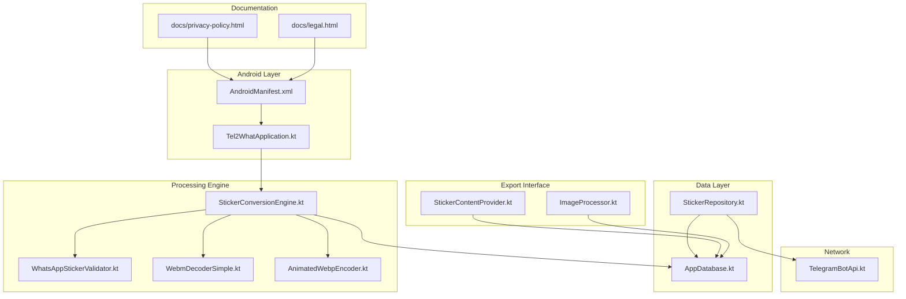
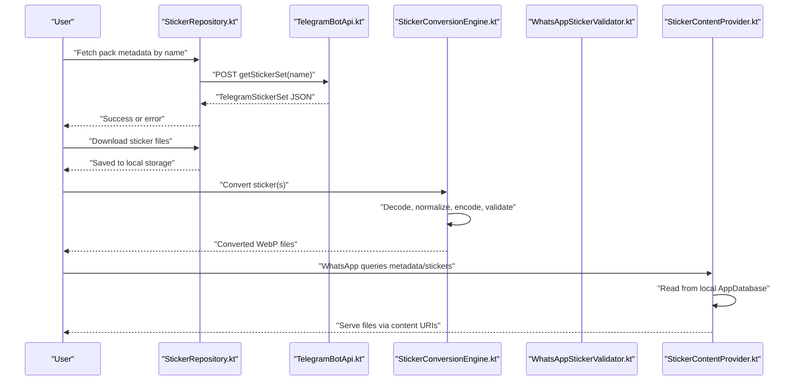
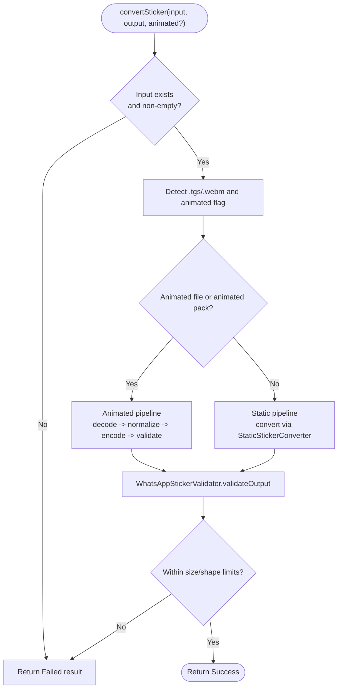
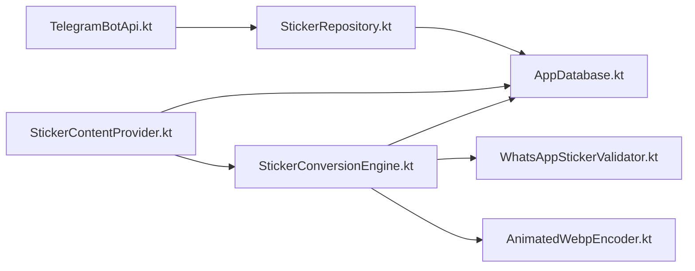

# Privacy Guarantees and Security

<cite>
**Referenced Files in This Document**
- [privacy-policy.html](file://docs/privacy-policy.html)
- [legal.html](file://docs/legal.html)
- [README.md](file://README.md)
- [AndroidManifest.xml](file://app/src/main/AndroidManifest.xml)
- [Tel2WhatApplication.kt](file://app/src/main/java/com/maheshsharan/tel2what/Tel2WhatApplication.kt)
- [AppDatabase.kt](file://app/src/main/java/com/maheshsharan/tel2what/data/local/AppDatabase.kt)
- [StickerConversionEngine.kt](file://app/src/main/java/com/maheshsharan/tel2what/engine/StickerConversionEngine.kt)
- [WhatsAppStickerValidator.kt](file://app/src/main/java/com/maheshsharan/tel2what/engine/WhatsAppStickerValidator.kt)
- [StickerContentProvider.kt](file://app/src/main/java/com/maheshsharan/tel2what/provider/StickerContentProvider.kt)
- [ImageProcessor.kt](file://app/src/main/java/com/maheshsharan/tel2what/utils/ImageProcessor.kt)
- [TelegramBotApi.kt](file://app/src/main/java/com/maheshsharan/tel2what/data/network/TelegramBotApi.kt)
- [WebmDecoderSimple.kt](file://app/src/main/java/com/maheshsharan/tel2what/engine/decoder/WebmDecoderSimple.kt)
- [AnimatedWebpEncoder.kt](file://app/src/main/java/com/maheshsharan/tel2what/engine/encoder/AnimatedWebpEncoder.kt)
- [StickerRepository.kt](file://app/src/main/java/com/maheshsharan/tel2what/data/repository/StickerRepository.kt)
</cite>

## Table of Contents
1. [Introduction](#introduction)
2. [Project Structure](#project-structure)
3. [Core Components](#core-components)
4. [Architecture Overview](#architecture-overview)
5. [Detailed Component Analysis](#detailed-component-analysis)
6. [Dependency Analysis](#dependency-analysis)
7. [Performance Considerations](#performance-considerations)
8. [Troubleshooting Guide](#troubleshooting-guide)
9. [Conclusion](#conclusion)

## Introduction
This document details Tel2What’s privacy guarantees and security posture. The app is designed to keep your data private and under your control:
- No ads, no data collection, no analytics, and no tracking
- Fully offline processing after the initial sticker download
- Minimal permissions strictly for core functionality
- Open-source transparency with verifiable privacy claims

These guarantees are enforced by the app’s architecture and implemented security controls described in this document.

## Project Structure
Tel2What organizes privacy and security across:
- Documentation: Privacy policy and legal pages
- Android manifest: Permission minimization and exported providers
- Application initialization: StrictMode for development-time safety checks
- Local storage: Room database for on-device persistence
- Conversion engine: Local-only processing with validation
- Content provider: WhatsApp-compatible interface that reads from local storage
- Network layer: Telegram Bot API read-only calls with explicit error handling
- Native encoder: JNI-based WebP encoding without cloud uploads

**Diagram sources**
- [privacy-policy.html](file://docs/privacy-policy.html#L1-L106)
- [AndroidManifest.xml](file://app/src/main/AndroidManifest.xml#L1-L39)
- [Tel2WhatApplication.kt](file://app/src/main/java/com/maheshsharan/tel2what/Tel2WhatApplication.kt#L1-L46)
- [AppDatabase.kt](file://app/src/main/java/com/maheshsharan/tel2what/data/local/AppDatabase.kt#L1-L42)
- [StickerConversionEngine.kt](file://app/src/main/java/com/maheshsharan/tel2what/engine/StickerConversionEngine.kt#L1-L275)
- [WhatsAppStickerValidator.kt](file://app/src/main/java/com/maheshsharan/tel2what/engine/WhatsAppStickerValidator.kt#L1-L72)
- [WebmDecoderSimple.kt](file://app/src/main/java/com/maheshsharan/tel2what/engine/decoder/WebmDecoderSimple.kt#L1-L256)
- [AnimatedWebpEncoder.kt](file://app/src/main/java/com/maheshsharan/tel2what/engine/encoder/AnimatedWebpEncoder.kt#L1-L91)
- [StickerContentProvider.kt](file://app/src/main/java/com/maheshsharan/tel2what/provider/StickerContentProvider.kt#L1-L244)
- [ImageProcessor.kt](file://app/src/main/java/com/maheshsharan/tel2what/utils/ImageProcessor.kt#L1-L68)
- [TelegramBotApi.kt](file://app/src/main/java/com/maheshsharan/tel2what/data/network/TelegramBotApi.kt#L1-L112)
- [StickerRepository.kt](file://app/src/main/java/com/maheshsharan/tel2what/data/repository/StickerRepository.kt#L1-L80)

**Section sources**
- [README.md](file://README.md#L11-L21)
- [AndroidManifest.xml](file://app/src/main/AndroidManifest.xml#L1-L39)
- [privacy-policy.html](file://docs/privacy-policy.html#L49-L95)

## Core Components
- Privacy policy and transparency: The policy explicitly states no data collection, no analytics, fully offline operation, and open-source verification.
- Minimal permissions: Only Internet and Access Network State are requested; storage is used only for saving files locally.
- Local-only processing: Conversion, decoding, encoding, and validation occur entirely on-device.
- Secure storage: Data is persisted in a local Room database; no cloud sync or transmission.
- Export compliance: A ContentProvider exposes stickers to WhatsApp using local files only.
- Network safeguards: Telegram Bot API calls are read-only and validated with explicit error handling.

**Section sources**
- [privacy-policy.html](file://docs/privacy-policy.html#L49-L95)
- [AndroidManifest.xml](file://app/src/main/AndroidManifest.xml#L3-L4)
- [StickerContentProvider.kt](file://app/src/main/java/com/maheshsharan/tel2what/provider/StickerContentProvider.kt#L19-L24)
- [TelegramBotApi.kt](file://app/src/main/java/com/maheshsharan/tel2what/data/network/TelegramBotApi.kt#L22-L73)
- [AppDatabase.kt](file://app/src/main/java/com/maheshsharan/tel2what/data/local/AppDatabase.kt#L13-L41)

## Architecture Overview
The privacy-preserving flow:
- Import: Telegram Bot API read-only calls fetch metadata and file paths; no personal data is transmitted.
- Download: Sticker files are downloaded directly to local storage.
- Process: Conversion engine runs entirely on-device with validation against WhatsApp constraints.
- Store: Results remain in the local database and file system.
- Export: WhatsApp reads from the ContentProvider backed by local files.

**Diagram sources**
- [StickerRepository.kt](file://app/src/main/java/com/maheshsharan/tel2what/data/repository/StickerRepository.kt#L24-L30)
- [TelegramBotApi.kt](file://app/src/main/java/com/maheshsharan/tel2what/data/network/TelegramBotApi.kt#L22-L73)
- [StickerConversionEngine.kt](file://app/src/main/java/com/maheshsharan/tel2what/engine/StickerConversionEngine.kt#L33-L88)
- [WhatsAppStickerValidator.kt](file://app/src/main/java/com/maheshsharan/tel2what/engine/WhatsAppStickerValidator.kt#L14-L70)
- [StickerContentProvider.kt](file://app/src/main/java/com/maheshsharan/tel2what/provider/StickerContentProvider.kt#L74-L165)

## Detailed Component Analysis

### Privacy Policy and Transparency
- Explicit no-collection stance: Personal info, device identifiers, analytics, crash reports, location, and sticker content are not collected.
- Fully offline operation: Downloads are local; conversions and exports happen on-device.
- Third-party services: Read-only Telegram Bot API and WhatsApp export via official APIs.
- Permissions: Internet for Telegram downloads; storage for saving files; no telemetry.
- Open source: Source code available for independent verification.

**Section sources**
- [privacy-policy.html](file://docs/privacy-policy.html#L49-L95)
- [legal.html](file://docs/legal.html#L133-L139)
- [README.md](file://README.md#L11-L21)

### Android Manifest and Permissions
- Minimal permissions: INTERNET and ACCESS_NETWORK_STATE are declared.
- Exported provider: A ContentProvider is exported with a read permission required by WhatsApp, ensuring only WhatsApp can access sticker data.

**Section sources**
- [AndroidManifest.xml](file://app/src/main/AndroidManifest.xml#L3-L4)
- [AndroidManifest.xml](file://app/src/main/AndroidManifest.xml#L19-L24)

### Application Initialization and Safety Checks
- StrictMode enabled in debug builds to detect disk reads/writes, network usage, and cleartext traffic on the main thread, aiding early discovery of privacy/security regressions.

**Section sources**
- [Tel2WhatApplication.kt](file://app/src/main/java/com/maheshsharan/tel2what/Tel2WhatApplication.kt#L17-L44)

### Local Data Storage and Database
- Room database stores sticker packs and stickers locally; migrations are handled explicitly.
- ContentProvider reads from the database to serve metadata and files to WhatsApp.

**Section sources**
- [AppDatabase.kt](file://app/src/main/java/com/maheshsharan/tel2what/data/local/AppDatabase.kt#L13-L41)
- [StickerContentProvider.kt](file://app/src/main/java/com/maheshsharan/tel2what/provider/StickerContentProvider.kt#L64-L69)
- [StickerContentProvider.kt](file://app/src/main/java/com/maheshsharan/tel2what/provider/StickerContentProvider.kt#L112-L136)

### Conversion Engine and Validation
- Conversion pipeline:
  - Detects file types and routes to static or animated processing.
  - Animated pipeline extracts frames from TGS or WebM, normalizes, and encodes to WebP using a native encoder.
  - Validates output size and dimensions against WhatsApp constraints.
- Logging and metrics are scoped to internal tags; no external transmission occurs.

**Diagram sources**
- [StickerConversionEngine.kt](file://app/src/main/java/com/maheshsharan/tel2what/engine/StickerConversionEngine.kt#L33-L88)
- [WhatsAppStickerValidator.kt](file://app/src/main/java/com/maheshsharan/tel2what/engine/WhatsAppStickerValidator.kt#L14-L70)

**Section sources**
- [StickerConversionEngine.kt](file://app/src/main/java/com/maheshsharan/tel2what/engine/StickerConversionEngine.kt#L33-L88)
- [WhatsAppStickerValidator.kt](file://app/src/main/java/com/maheshsharan/tel2what/engine/WhatsAppStickerValidator.kt#L14-L70)

### Export Interface to WhatsApp
- ContentProvider exposes metadata and sticker assets to WhatsApp using content URIs.
- Reads only from the local database and file system; no network calls or cloud sync.
- Enforces read permission required by WhatsApp to prevent unauthorized access.

**Section sources**
- [StickerContentProvider.kt](file://app/src/main/java/com/maheshsharan/tel2what/provider/StickerContentProvider.kt#L19-L24)
- [StickerContentProvider.kt](file://app/src/main/java/com/maheshsharan/tel2what/provider/StickerContentProvider.kt#L74-L165)

### Network Layer and Telegram Bot API
- Read-only operations: Fetches sticker set metadata and file paths; no personal data is sent.
- Robust error handling: Distinguishes invalid token, missing pack, network errors, and parsing failures.
- Download URLs are constructed from Telegram’s file paths; files are saved locally.

**Section sources**
- [TelegramBotApi.kt](file://app/src/main/java/com/maheshsharan/tel2what/data/network/TelegramBotApi.kt#L22-L73)
- [TelegramBotApi.kt](file://app/src/main/java/com/maheshsharan/tel2what/data/network/TelegramBotApi.kt#L75-L110)
- [StickerRepository.kt](file://app/src/main/java/com/maheshsharan/tel2what/data/repository/StickerRepository.kt#L24-L30)

### Native Encoding and Media Processing
- Animated WebP encoding uses a native library loaded at runtime; output is written to a local file.
- WebM decoding uses MediaCodec in ByteBuffer mode to avoid format mismatches and leaks.
- Proper resource cleanup and bitmap recycling reduce memory pressure and prevent leaks.

**Section sources**
- [AnimatedWebpEncoder.kt](file://app/src/main/java/com/maheshsharan/tel2what/engine/encoder/AnimatedWebpEncoder.kt#L32-L78)
- [WebmDecoderSimple.kt](file://app/src/main/java/com/maheshsharan/tel2what/engine/decoder/WebmDecoderSimple.kt#L23-L192)

### Tray Icon Processing
- Generates a 96x96 tray icon with a strict size cap and writes to a local file.
- Ensures compliance with WhatsApp constraints for tray icons.

**Section sources**
- [ImageProcessor.kt](file://app/src/main/java/com/maheshsharan/tel2what/utils/ImageProcessor.kt#L17-L61)

## Dependency Analysis
Key privacy/security dependencies:
- Telegram Bot API: Read-only, no personal data; errors surfaced clearly.
- Room database: Local-only persistence; ContentProvider reads from DB.
- ContentProvider: Exposed only to WhatsApp via declared read permission.
- Conversion engine: All steps are local; validation prevents non-compliant outputs.
- Native encoder: JNI-bound; no network IO.

**Diagram sources**
- [TelegramBotApi.kt](file://app/src/main/java/com/maheshsharan/tel2what/data/network/TelegramBotApi.kt#L1-L112)
- [StickerRepository.kt](file://app/src/main/java/com/maheshsharan/tel2what/data/repository/StickerRepository.kt#L1-L80)
- [AppDatabase.kt](file://app/src/main/java/com/maheshsharan/tel2what/data/local/AppDatabase.kt#L1-L42)
- [StickerConversionEngine.kt](file://app/src/main/java/com/maheshsharan/tel2what/engine/StickerConversionEngine.kt#L1-L275)
- [WhatsAppStickerValidator.kt](file://app/src/main/java/com/maheshsharan/tel2what/engine/WhatsAppStickerValidator.kt#L1-L72)
- [AnimatedWebpEncoder.kt](file://app/src/main/java/com/maheshsharan/tel2what/engine/encoder/AnimatedWebpEncoder.kt#L1-L91)
- [StickerContentProvider.kt](file://app/src/main/java/com/maheshsharan/tel2what/provider/StickerContentProvider.kt#L1-L244)

**Section sources**
- [StickerRepository.kt](file://app/src/main/java/com/maheshsharan/tel2what/data/repository/StickerRepository.kt#L1-L80)
- [StickerContentProvider.kt](file://app/src/main/java/com/maheshsharan/tel2what/provider/StickerContentProvider.kt#L64-L69)

## Performance Considerations
- Local-first design: All heavy lifting happens on-device, avoiding network overhead and latency.
- Concurrency control: Semaphores limit parallel animated processing to prevent thermal throttling and OOM.
- Adaptive compression: Iterative quality/FPS tuning meets size constraints efficiently.
- Resource management: Bitmap recycling and MediaCodec cleanup reduce memory footprint.

[No sources needed since this section provides general guidance]

## Troubleshooting Guide
Common privacy-related issues and resolutions:
- No data leaves the device:
  - Imports use Telegram Bot API read-only calls; downloads are saved locally.
  - Exports are served via the ContentProvider from local files.
- Permission confusion:
  - INTERNET is required for Telegram downloads; STORAGE is required to save files.
  - No analytics or tracking SDKs are present.
- Network errors:
  - Telegram API errors are surfaced with actionable messages (invalid token, missing pack, network issues).
- Export issues:
  - Ensure WhatsApp is installed and the provider authority matches the declared manifest value.

**Section sources**
- [TelegramBotApi.kt](file://app/src/main/java/com/maheshsharan/tel2what/data/network/TelegramBotApi.kt#L36-L73)
- [AndroidManifest.xml](file://app/src/main/AndroidManifest.xml#L3-L4)
- [StickerContentProvider.kt](file://app/src/main/java/com/maheshsharan/tel2what/provider/StickerContentProvider.kt#L19-L24)

## Conclusion
Tel2What’s privacy and security model is rooted in a fully local architecture:
- No data collection, no analytics, no tracking
- Minimal permissions strictly for core functionality
- Read-only third-party integrations with explicit error handling
- Local-only processing, storage, and export
- Open-source transparency for community oversight

These guarantees are enforced by the app’s design and implementation, verified by the referenced source files.