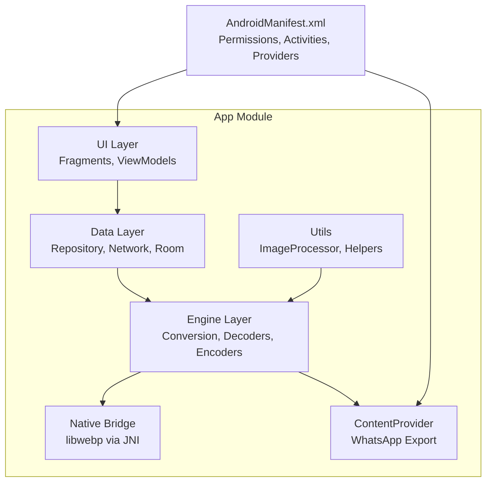
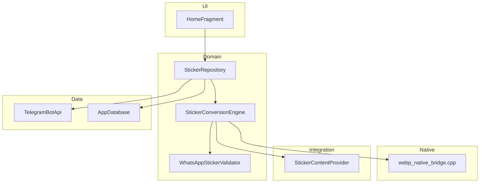
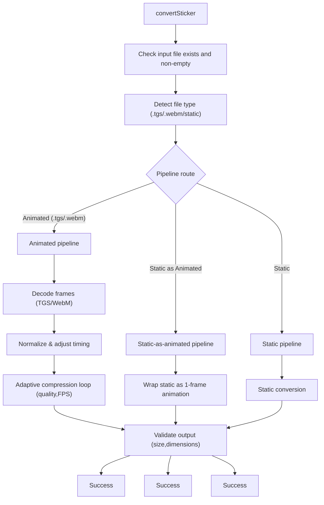
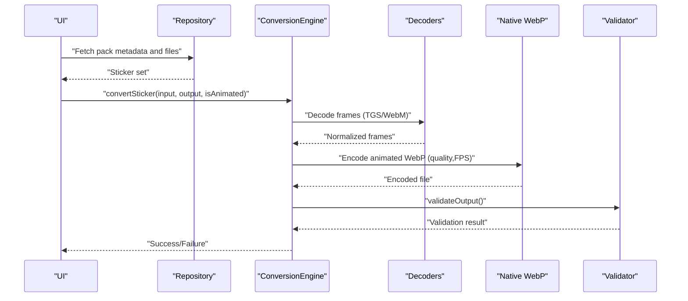
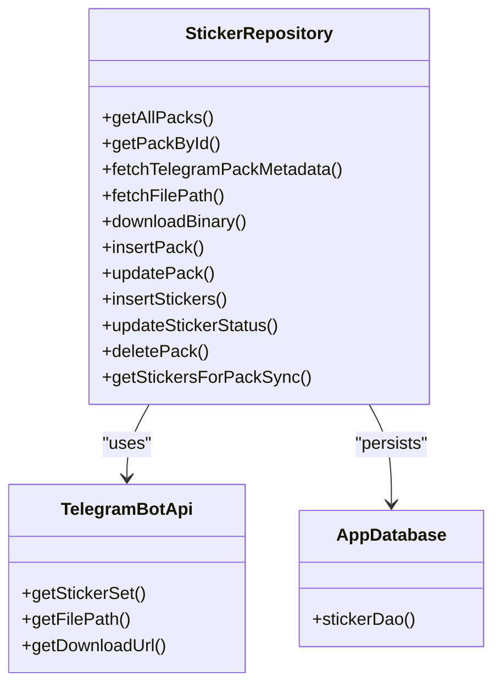
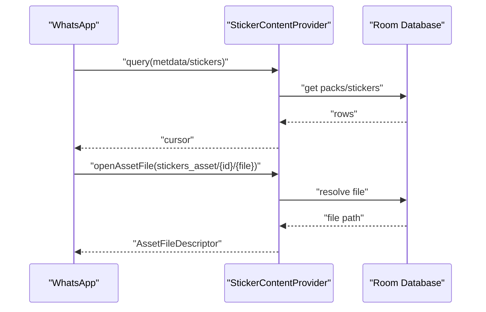
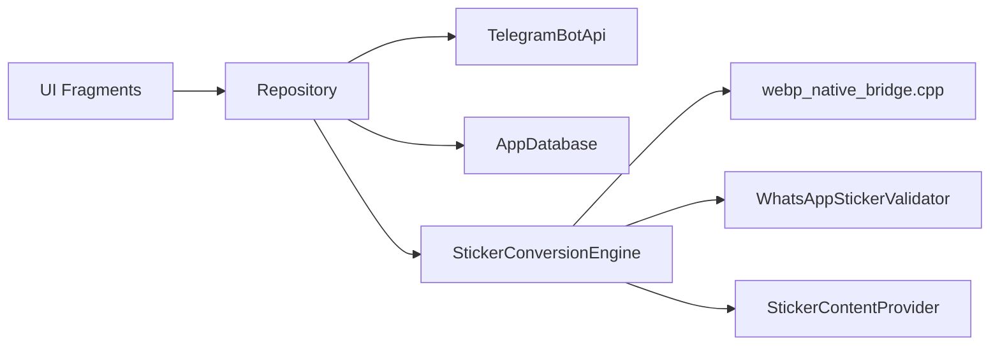

# Project Overview

<cite>
**Referenced Files in This Document**
- [README.md](file://README.md)
- [Tel2WhatApplication.kt](file://app/src/main/java/com/maheshsharan/tel2what/Tel2WhatApplication.kt)
- [MainActivity.kt](file://app/src/main/java/com/maheshsharan/tel2what/MainActivity.kt)
- [AndroidManifest.xml](file://app/src/main/AndroidManifest.xml)
- [StickerConversionEngine.kt](file://app/src/main/java/com/maheshsharan/tel2what/engine/StickerConversionEngine.kt)
- [ConversionConfig.kt](file://app/src/main/java/com/maheshsharan/tel2what/engine/ConversionConfig.kt)
- [WhatsAppStickerValidator.kt](file://app/src/main/java/com/maheshsharan/tel2what/engine/WhatsAppStickerValidator.kt)
- [TelegramBotApi.kt](file://app/src/main/java/com/maheshsharan/tel2what/data/network/TelegramBotApi.kt)
- [StickerRepository.kt](file://app/src/main/java/com/maheshsharan/tel2what/data/repository/StickerRepository.kt)
- [AppDatabase.kt](file://app/src/main/java/com/maheshsharan/tel2what/data/local/AppDatabase.kt)
- [StickerContentProvider.kt](file://app/src/main/java/com/maheshsharan/tel2what/provider/StickerContentProvider.kt)
- [webp_native_bridge.cpp](file://app/src/main/cpp/webp_native_bridge.cpp)
- [animated_pipe.md](file://assets/docs/animated_pipe.md)
- [HomeFragment.kt](file://app/src/main/java/com/maheshsharan/tel2what/ui/home/HomeFragment.kt)
- [privacy-policy.html](file://docs/privacy-policy.html)
</cite>

## Table of Contents
1. [Introduction](#introduction)
2. [Project Structure](#project-structure)
3. [Core Components](#core-components)
4. [Architecture Overview](#architecture-overview)
5. [Detailed Component Analysis](#detailed-component-analysis)
6. [Dependency Analysis](#dependency-analysis)
7. [Performance Considerations](#performance-considerations)
8. [Troubleshooting Guide](#troubleshooting-guide)
9. [Conclusion](#conclusion)
10. [Appendices](#appendices)

## Introduction
Tel2What is a privacy-focused Android application that converts Telegram sticker packs into WhatsApp-ready animated and static stickers. Its core purpose is to give users complete control over their sticker data: everything is downloaded directly from Telegram’s public endpoints and processed locally on-device, ensuring no personal data is collected, stored, or transmitted. The app emphasizes transparency, user trust, and user control by operating fully offline after the initial download, exposing open-source code for review, and requesting only essential permissions for core functionality.

Key value propositions:
- Fully offline processing: All conversion and optimization occur on-device.
- No data collection: The app does not collect, store, or transmit any personal information.
- Transparent architecture: Built with modern Android technologies and open-source libraries.
- High performance: Hardware-accelerated decoding and native WebP encoding deliver fast conversions.
- WhatsApp-ready output: Automatic validation and optimization to meet WhatsApp’s strict requirements.

Target audience:
- Users who want to reuse Telegram sticker collections in WhatsApp.
- Privacy-conscious users who prefer local-first processing.
- Contributors interested in a well-structured Android project with native performance and clear separation of concerns.

Main use cases:
- Bulk import of public Telegram sticker packs via a pasteable link.
- Conversion of TGS (Lottie) and WebM animated stickers to animated WebP.
- Creation of custom sticker packs from personal images and GIFs.
- Exporting ready-to-use sticker packs directly to WhatsApp via the official sticker API.

Competitive advantages:
- Privacy-first design with zero data collection and no analytics.
- Native performance leveraging libwebp and MediaCodec for speed and efficiency.
- Strict output validation aligned with WhatsApp’s requirements.
- Open-source codebase enabling community review and contribution.

Privacy philosophy and trust-building:
- No ads, no analytics, no tracking.
- Minimal permissions strictly for core functionality.
- Open source with full visibility into how data is handled.
- Local-first architecture prevents cloud exposure.

Technical approach to maintaining trust:
- Strict validation of outputs before export.
- Comprehensive logging and error reporting for transparency.
- Public documentation of the animated conversion pipeline.
- ContentProvider integration for secure, controlled exports to WhatsApp.

Architectural principles:
- Single Activity + Fragments with Kotlin Coroutines and Flow for reactive UI.
- Repository pattern separating data sources and local persistence.
- Room database for structured local storage.
- JNI bridge for native WebP encoding to maximize throughput.
- ContentProvider for official WhatsApp sticker API integration.

Executive summary for stakeholders and contributors:
Tel2What is a privacy-respecting, high-performance Android app that converts Telegram stickers to WhatsApp format. It uses a layered architecture with a clear separation between UI, repository, engine, and native components. The conversion engine supports both static and animated formats, with adaptive compression and strict validation to meet WhatsApp’s constraints. The app is fully offline, open source, and designed for transparency and user control. Contributors can review the codebase, participate in the conversion pipeline, and help improve performance and reliability.

**Section sources**
- [README.md](file://README.md#L1-L174)
- [privacy-policy.html](file://docs/privacy-policy.html#L49-L71)

## Project Structure
The project follows a feature-based, layered structure:
- app/src/main/java/com/maheshsharan/tel2what
  - engine/: Conversion pipeline (decoders, encoders, validators, frame utilities)
  - data/: Repository, network, and local database modules
  - ui/: Fragments, ViewModels, and adapters for navigation and user interaction
  - utils/: Helper utilities (e.g., tray icon processing)
  - provider/: ContentProvider for exporting to WhatsApp
  - cpp/: Native WebP encoder via JNI
- app/src/main/AndroidManifest.xml: App metadata, permissions, and exported ContentProvider
- assets/docs/animated_pipe.md: Technical deep dive into the animated conversion pipeline
- docs/: Legal and policy documents (privacy policy, terms, licenses)

**Diagram sources**
- [AndroidManifest.xml](file://app/src/main/AndroidManifest.xml#L1-L39)
- [StickerConversionEngine.kt](file://app/src/main/java/com/maheshsharan/tel2what/engine/StickerConversionEngine.kt#L1-L276)
- [StickerRepository.kt](file://app/src/main/java/com/maheshsharan/tel2what/data/repository/StickerRepository.kt#L1-L80)
- [webp_native_bridge.cpp](file://app/src/main/cpp/webp_native_bridge.cpp#L1-L148)
- [StickerContentProvider.kt](file://app/src/main/java/com/maheshsharan/tel2what/provider/StickerContentProvider.kt#L1-L244)

**Section sources**
- [AndroidManifest.xml](file://app/src/main/AndroidManifest.xml#L1-L39)
- [README.md](file://README.md#L98-L110)

## Core Components
- Application bootstrap and strict-mode enforcement for development
- Single-activity entry point
- Conversion engine orchestrating static and animated pipelines
- Native WebP encoder via JNI
- Repository coordinating Telegram API and local storage
- ContentProvider integrating with WhatsApp’s sticker API
- Validation ensuring output meets WhatsApp constraints
- UI fragments and navigation for import, selection, and export

**Section sources**
- [Tel2WhatApplication.kt](file://app/src/main/java/com/maheshsharan/tel2what/Tel2WhatApplication.kt#L1-L46)
- [MainActivity.kt](file://app/src/main/java/com/maheshsharan/tel2what/MainActivity.kt#L1-L13)
- [StickerConversionEngine.kt](file://app/src/main/java/com/maheshsharan/tel2what/engine/StickerConversionEngine.kt#L1-L276)
- [webp_native_bridge.cpp](file://app/src/main/cpp/webp_native_bridge.cpp#L1-L148)
- [StickerRepository.kt](file://app/src/main/java/com/maheshsharan/tel2what/data/repository/StickerRepository.kt#L1-L80)
- [StickerContentProvider.kt](file://app/src/main/java/com/maheshsharan/tel2what/provider/StickerContentProvider.kt#L1-L244)
- [WhatsAppStickerValidator.kt](file://app/src/main/java/com/maheshsharan/tel2what/engine/WhatsAppStickerValidator.kt#L1-L72)
- [HomeFragment.kt](file://app/src/main/java/com/maheshsharan/tel2what/ui/home/HomeFragment.kt#L1-L93)

## Architecture Overview
Tel2What employs a layered architecture:
- UI layer (Fragments, ViewModels) manages navigation and user actions.
- Repository abstracts data sources (Telegram Bot API and local Room database).
- Engine layer implements the conversion logic, routing static and animated paths.
- Native layer accelerates encoding using libwebp via JNI.
- ContentProvider enables secure export to WhatsApp.

**Diagram sources**
- [HomeFragment.kt](file://app/src/main/java/com/maheshsharan/tel2what/ui/home/HomeFragment.kt#L1-L93)
- [StickerRepository.kt](file://app/src/main/java/com/maheshsharan/tel2what/data/repository/StickerRepository.kt#L1-L80)
- [StickerConversionEngine.kt](file://app/src/main/java/com/maheshsharan/tel2what/engine/StickerConversionEngine.kt#L1-L276)
- [WhatsAppStickerValidator.kt](file://app/src/main/java/com/maheshsharan/tel2what/engine/WhatsAppStickerValidator.kt#L1-L72)
- [TelegramBotApi.kt](file://app/src/main/java/com/maheshsharan/tel2what/data/network/TelegramBotApi.kt#L1-L112)
- [AppDatabase.kt](file://app/src/main/java/com/maheshsharan/tel2what/data/local/AppDatabase.kt#L1-L42)
- [webp_native_bridge.cpp](file://app/src/main/cpp/webp_native_bridge.cpp#L1-L148)
- [StickerContentProvider.kt](file://app/src/main/java/com/maheshsharan/tel2what/provider/StickerContentProvider.kt#L1-L244)

## Detailed Component Analysis

### Conversion Engine Orchestration
The engine selects the appropriate pipeline based on input type and pack characteristics, enforces concurrency limits, and coordinates decoders, frame processing, and native encoding. It includes a multi-dimensional compression loop to meet size constraints and validates outputs against WhatsApp requirements.

**Diagram sources**
- [StickerConversionEngine.kt](file://app/src/main/java/com/maheshsharan/tel2what/engine/StickerConversionEngine.kt#L34-L89)
- [WhatsAppStickerValidator.kt](file://app/src/main/java/com/maheshsharan/tel2what/engine/WhatsAppStickerValidator.kt#L14-L70)

**Section sources**
- [StickerConversionEngine.kt](file://app/src/main/java/com/maheshsharan/tel2what/engine/StickerConversionEngine.kt#L1-L276)
- [ConversionConfig.kt](file://app/src/main/java/com/maheshsharan/tel2what/engine/ConversionConfig.kt#L1-L14)
- [WhatsAppStickerValidator.kt](file://app/src/main/java/com/maheshsharan/tel2what/engine/WhatsAppStickerValidator.kt#L1-L72)

### Animated Conversion Deep Dive
The animated pipeline integrates TGS decoding (Lottie) and WebM decoding (MediaCodec), normalizes frames, and uses a native WebP encoder to produce animated WebP with strict constraints.

**Diagram sources**
- [animated_pipe.md](file://assets/docs/animated_pipe.md#L1-L252)
- [StickerConversionEngine.kt](file://app/src/main/java/com/maheshsharan/tel2what/engine/StickerConversionEngine.kt#L132-L274)
- [webp_native_bridge.cpp](file://app/src/main/cpp/webp_native_bridge.cpp#L13-L147)

**Section sources**
- [animated_pipe.md](file://assets/docs/animated_pipe.md#L1-L252)
- [webp_native_bridge.cpp](file://app/src/main/cpp/webp_native_bridge.cpp#L1-L148)

### Data Access and Persistence
The repository mediates between the UI and data sources, fetching Telegram metadata and files, and persisting sticker packs and stickers to Room. The database schema includes entities for packs and stickers with migration support.

**Diagram sources**
- [StickerRepository.kt](file://app/src/main/java/com/maheshsharan/tel2what/data/repository/StickerRepository.kt#L1-L80)
- [TelegramBotApi.kt](file://app/src/main/java/com/maheshsharan/tel2what/data/network/TelegramBotApi.kt#L1-L112)
- [AppDatabase.kt](file://app/src/main/java/com/maheshsharan/tel2what/data/local/AppDatabase.kt#L1-L42)

**Section sources**
- [StickerRepository.kt](file://app/src/main/java/com/maheshsharan/tel2what/data/repository/StickerRepository.kt#L1-L80)
- [TelegramBotApi.kt](file://app/src/main/java/com/maheshsharan/tel2what/data/network/TelegramBotApi.kt#L1-L112)
- [AppDatabase.kt](file://app/src/main/java/com/maheshsharan/tel2what/data/local/AppDatabase.kt#L1-L42)

### WhatsApp Export Integration
The ContentProvider exposes metadata and sticker assets to WhatsApp using the official API contract. It resolves files from the local database and serves them as required.

**Diagram sources**
- [StickerContentProvider.kt](file://app/src/main/java/com/maheshsharan/tel2what/provider/StickerContentProvider.kt#L74-L216)
- [AppDatabase.kt](file://app/src/main/java/com/maheshsharan/tel2what/data/local/AppDatabase.kt#L1-L42)

**Section sources**
- [StickerContentProvider.kt](file://app/src/main/java/com/maheshsharan/tel2what/provider/StickerContentProvider.kt#L1-L244)
- [AppDatabase.kt](file://app/src/main/java/com/maheshsharan/tel2what/data/local/AppDatabase.kt#L1-L42)

## Dependency Analysis
High-level dependencies:
- UI depends on Repository and ViewModels.
- Repository depends on TelegramBotApi and Room database.
- Engine depends on decoders, validators, and native encoder.
- Native encoder depends on libwebp and Android bitmap APIs.
- ContentProvider depends on Room for file resolution.

**Diagram sources**
- [HomeFragment.kt](file://app/src/main/java/com/maheshsharan/tel2what/ui/home/HomeFragment.kt#L1-L93)
- [StickerRepository.kt](file://app/src/main/java/com/maheshsharan/tel2what/data/repository/StickerRepository.kt#L1-L80)
- [StickerConversionEngine.kt](file://app/src/main/java/com/maheshsharan/tel2what/engine/StickerConversionEngine.kt#L1-L276)
- [webp_native_bridge.cpp](file://app/src/main/cpp/webp_native_bridge.cpp#L1-L148)
- [WhatsAppStickerValidator.kt](file://app/src/main/java/com/maheshsharan/tel2what/engine/WhatsAppStickerValidator.kt#L1-L72)
- [StickerContentProvider.kt](file://app/src/main/java/com/maheshsharan/tel2what/provider/StickerContentProvider.kt#L1-L244)

**Section sources**
- [README.md](file://README.md#L87-L96)
- [AndroidManifest.xml](file://app/src/main/AndroidManifest.xml#L1-L39)

## Performance Considerations
- Adaptive compression loop reduces quality and FPS iteratively to meet size targets.
- Native WebP encoding with optimized parameters balances speed and quality.
- Concurrency controls prevent thermal throttling and OOM during animated conversions.
- Strict validation avoids downstream failures by catching non-compliance early.

[No sources needed since this section provides general guidance]

## Troubleshooting Guide
Common issues and remedies:
- Telegram API errors: Verify the bot token and network connectivity; handle 401/404/400 responses gracefully.
- Empty or missing input files: Ensure the file exists and is readable before conversion.
- Excessive file sizes: Adjust quality or FPS in the compression loop; validate output dimensions.
- Export failures: Confirm the ContentProvider is registered and files exist in the database.

**Section sources**
- [TelegramBotApi.kt](file://app/src/main/java/com/maheshsharan/tel2what/data/network/TelegramBotApi.kt#L22-L73)
- [StickerConversionEngine.kt](file://app/src/main/java/com/maheshsharan/tel2what/engine/StickerConversionEngine.kt#L46-L54)
- [WhatsAppStickerValidator.kt](file://app/src/main/java/com/maheshsharan/tel2what/engine/WhatsAppStickerValidator.kt#L19-L40)
- [StickerContentProvider.kt](file://app/src/main/java/com/maheshsharan/tel2what/provider/StickerContentProvider.kt#L189-L216)

## Conclusion
Tel2What delivers a privacy-first, high-performance solution for converting Telegram stickers to WhatsApp format. Its layered architecture, native acceleration, and strict validation ensure reliable, compliant outputs while keeping user data local. The open-source nature and transparent design foster trust and enable community contributions.

[No sources needed since this section summarizes without analyzing specific files]

## Appendices
- Privacy policy highlights: No data collection, fully offline processing, minimal permissions, open source.
- Requirements: Android 11+, storage for temporary files, Telegram bot token for imports.

**Section sources**
- [privacy-policy.html](file://docs/privacy-policy.html#L49-L95)
- [README.md](file://README.md#L81-L86)