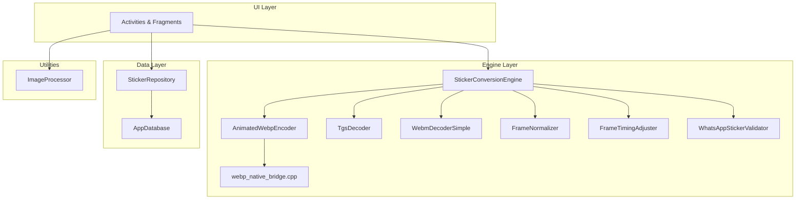
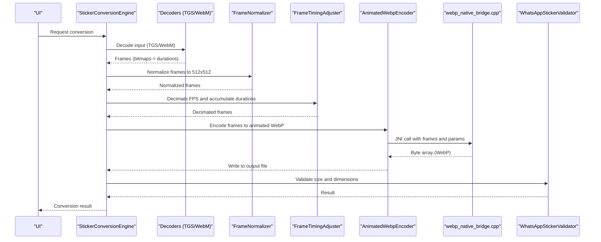
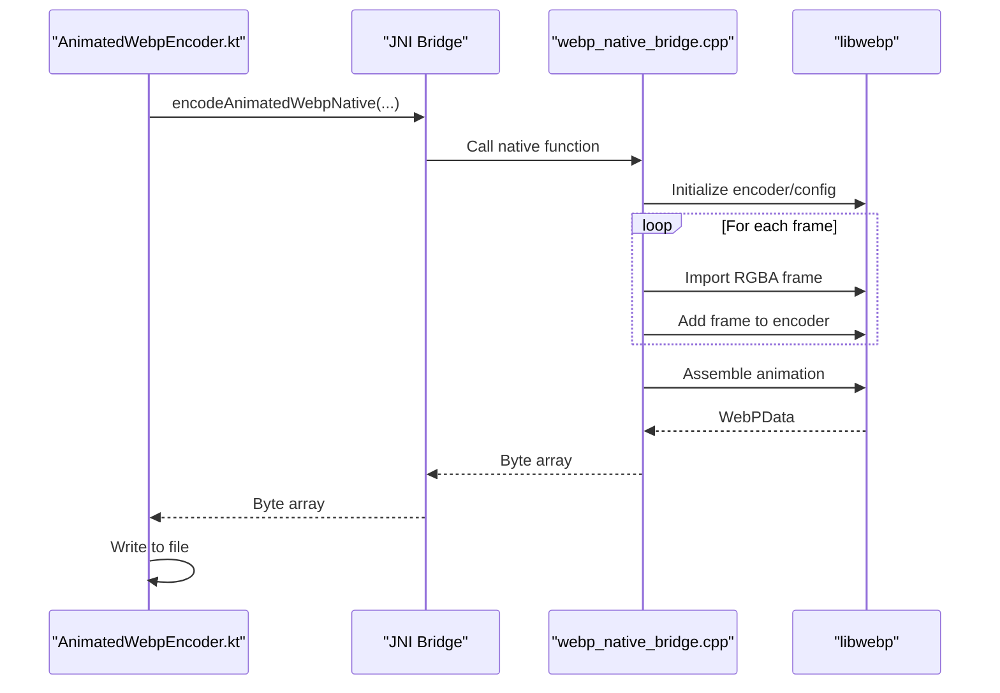
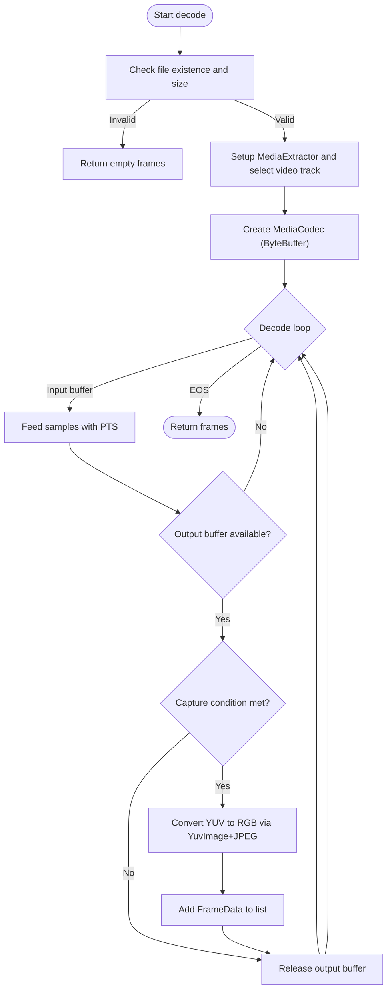
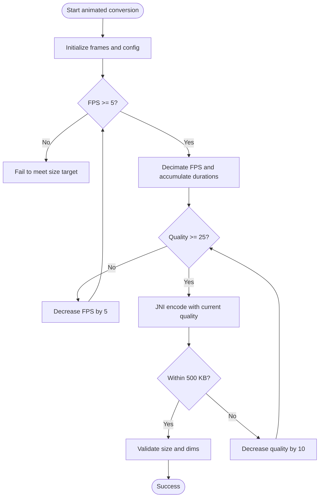
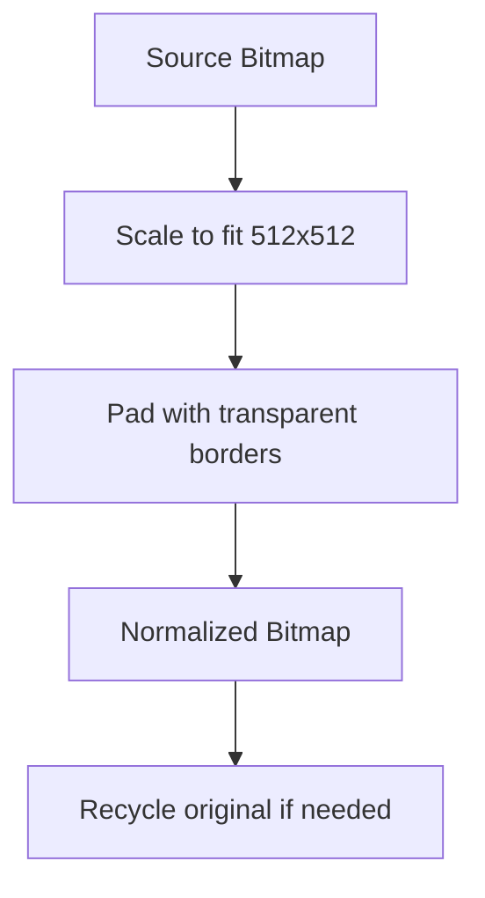
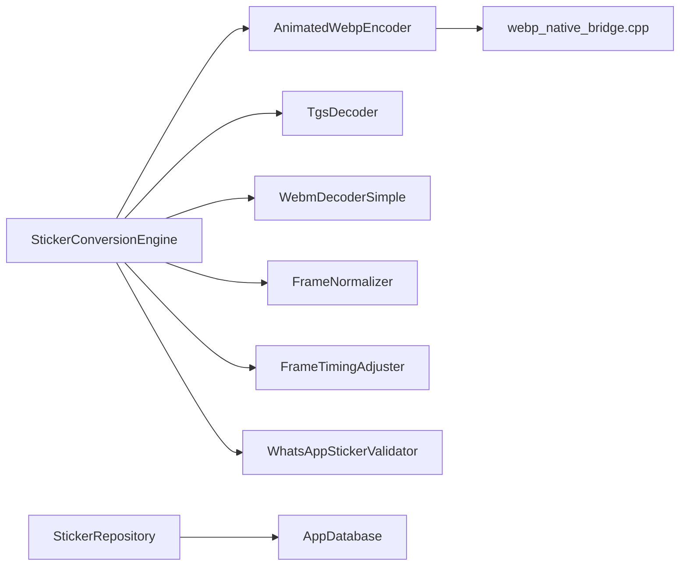

# Technical Highlights

<cite>
**Referenced Files in This Document**
- [webp_native_bridge.cpp](file://app/src/main/cpp/webp_native_bridge.cpp)
- [AnimatedWebpEncoder.kt](file://app/src/main/java/com/maheshsharan/tel2what/engine/encoder/AnimatedWebpEncoder.kt)
- [WebmDecoderSimple.kt](file://app/src/main/java/com/maheshsharan/tel2what/engine/decoder/WebmDecoderSimple.kt)
- [TgsDecoder.kt](file://app/src/main/java/com/maheshsharan/tel2what/engine/decoder/TgsDecoder.kt)
- [StickerConversionEngine.kt](file://app/src/main/java/com/maheshsharan/tel2what/engine/StickerConversionEngine.kt)
- [StaticStickerConverter.kt](file://app/src/main/java/com/maheshsharan/tel2what/engine/StaticStickerConverter.kt)
- [FrameNormalizer.kt](file://app/src/main/java/com/maheshsharan/tel2what/engine/frame/FrameNormalizer.kt)
- [FrameTimingAdjuster.kt](file://app/src/main/java/com/maheshsharan/tel2what/engine/frame/FrameTimingAdjuster.kt)
- [WhatsAppStickerValidator.kt](file://app/src/main/java/com/maheshsharan/tel2what/engine/WhatsAppStickerValidator.kt)
- [AppDatabase.kt](file://app/src/main/java/com/maheshsharan/tel2what/data/local/AppDatabase.kt)
- [StickerRepository.kt](file://app/src/main/java/com/maheshsharan/tel2what/data/repository/StickerRepository.kt)
- [ImageProcessor.kt](file://app/src/main/java/com/maheshsharan/tel2what/utils/ImageProcessor.kt)
- [build.gradle.kts](file://app/build.gradle.kts)
- [libs.versions.toml](file://gradle/libs.versions.toml)
</cite>

## Table of Contents
1. [Introduction](#introduction)
2. [Project Structure](#project-structure)
3. [Core Components](#core-components)
4. [Architecture Overview](#architecture-overview)
5. [Detailed Component Analysis](#detailed-component-analysis)
6. [Dependency Analysis](#dependency-analysis)
7. [Performance Considerations](#performance-considerations)
8. [Troubleshooting Guide](#troubleshooting-guide)
9. [Conclusion](#conclusion)

## Introduction
This document presents Tel2What’s technical highlights, showcasing advanced engineering implementations that deliver high-quality sticker conversion with strict performance and memory constraints. It covers:
- Native WebP encoding via a JNI bridge backed by libwebp
- A custom WebM decoder using MediaCodec with ByteBuffer output
- Adaptive compression algorithms that balance quality, FPS, and size
- Memory-efficient bitmap lifecycle management and OOM prevention strategies
- Modern Android architecture: Kotlin coroutines, Room database, and MVVM-style flows
- Performance optimizations, concurrency controls, and telemetry-driven validation

## Project Structure
Tel2What organizes functionality into cohesive layers:
- Native layer: C++ libwebp integration for animated WebP encoding
- Engine layer: Orchestration, decoders, converters, and validators
- Data layer: Room database and repository pattern for persistence
- Utilities: Image processing helpers and conversion configuration
- Build configuration: Kotlin DSL with CMake, ABI filtering, and minification

**Diagram sources**
- [StickerConversionEngine.kt](file://app/src/main/java/com/maheshsharan/tel2what/engine/StickerConversionEngine.kt#L1-L275)
- [AnimatedWebpEncoder.kt](file://app/src/main/java/com/maheshsharan/tel2what/engine/encoder/AnimatedWebpEncoder.kt#L1-L91)
- [webp_native_bridge.cpp](file://app/src/main/cpp/webp_native_bridge.cpp#L1-L148)
- [TgsDecoder.kt](file://app/src/main/java/com/maheshsharan/tel2what/engine/decoder/TgsDecoder.kt#L1-L94)
- [WebmDecoderSimple.kt](file://app/src/main/java/com/maheshsharan/tel2what/engine/decoder/WebmDecoderSimple.kt#L1-L256)
- [FrameNormalizer.kt](file://app/src/main/java/com/maheshsharan/tel2what/engine/frame/FrameNormalizer.kt#L1-L62)
- [FrameTimingAdjuster.kt](file://app/src/main/java/com/maheshsharan/tel2what/engine/frame/FrameTimingAdjuster.kt#L1-L72)
- [WhatsAppStickerValidator.kt](file://app/src/main/java/com/maheshsharan/tel2what/engine/WhatsAppStickerValidator.kt#L1-L72)
- [StickerRepository.kt](file://app/src/main/java/com/maheshsharan/tel2what/data/repository/StickerRepository.kt#L1-L80)
- [AppDatabase.kt](file://app/src/main/java/com/maheshsharan/tel2what/data/local/AppDatabase.kt#L1-L42)
- [ImageProcessor.kt](file://app/src/main/java/com/maheshsharan/tel2what/utils/ImageProcessor.kt#L1-L68)

**Section sources**
- [build.gradle.kts](file://app/build.gradle.kts#L1-L117)

## Core Components
- Native WebP encoder: A JNI bridge that converts an array of ARGB_8888 Bitmaps into an animated WebP using libwebp, with configurable quality and method parameters.
- Custom WebM decoder: Uses MediaCodec in ByteBuffer mode to decode VP9/Vp8 streams, converting frames to RGB bitmaps and capturing at target FPS.
- Animated pipeline: Orchestrated by the conversion engine with adaptive compression loops, FPS decimation, and strict size validation.
- Static pipeline: Iterative WebP lossy compression to meet size targets while preserving aspect ratio and centering.
- Memory management: Centralized recycling, semaphore-based concurrency, and decimation to prevent OOM.
- Validation: Pre-flight checks against WhatsApp constraints (dimensions, size) with detailed logging.
- Data layer: Room database with migrations and a repository exposing Flow-based APIs.

**Section sources**
- [webp_native_bridge.cpp](file://app/src/main/cpp/webp_native_bridge.cpp#L1-L148)
- [AnimatedWebpEncoder.kt](file://app/src/main/java/com/maheshsharan/tel2what/engine/encoder/AnimatedWebpEncoder.kt#L1-L91)
- [WebmDecoderSimple.kt](file://app/src/main/java/com/maheshsharan/tel2what/engine/decoder/WebmDecoderSimple.kt#L1-L256)
- [TgsDecoder.kt](file://app/src/main/java/com/maheshsharan/tel2what/engine/decoder/TgsDecoder.kt#L1-L94)
- [StickerConversionEngine.kt](file://app/src/main/java/com/maheshsharan/tel2what/engine/StickerConversionEngine.kt#L1-L275)
- [StaticStickerConverter.kt](file://app/src/main/java/com/maheshsharan/tel2what/engine/StaticStickerConverter.kt#L1-L94)
- [FrameNormalizer.kt](file://app/src/main/java/com/maheshsharan/tel2what/engine/frame/FrameNormalizer.kt#L1-L62)
- [FrameTimingAdjuster.kt](file://app/src/main/java/com/maheshsharan/tel2what/engine/frame/FrameTimingAdjuster.kt#L1-L72)
- [WhatsAppStickerValidator.kt](file://app/src/main/java/com/maheshsharan/tel2what/engine/WhatsAppStickerValidator.kt#L1-L72)
- [AppDatabase.kt](file://app/src/main/java/com/maheshsharan/tel2what/data/local/AppDatabase.kt#L1-L42)
- [StickerRepository.kt](file://app/src/main/java/com/maheshsharan/tel2what/data/repository/StickerRepository.kt#L1-L80)
- [ImageProcessor.kt](file://app/src/main/java/com/maheshsharan/tel2what/utils/ImageProcessor.kt#L1-L68)

## Architecture Overview
The system follows a layered architecture:
- UI triggers conversion requests
- Engine orchestrates decoders, normalization, timing adjustment, and encoding
- JNI bridges native libwebp for efficient animated WebP generation
- Validation ensures compliance with WhatsApp constraints
- Repository and Room manage persistent state and metadata

**Diagram sources**
- [StickerConversionEngine.kt](file://app/src/main/java/com/maheshsharan/tel2what/engine/StickerConversionEngine.kt#L1-L275)
- [TgsDecoder.kt](file://app/src/main/java/com/maheshsharan/tel2what/engine/decoder/TgsDecoder.kt#L1-L94)
- [WebmDecoderSimple.kt](file://app/src/main/java/com/maheshsharan/tel2what/engine/decoder/WebmDecoderSimple.kt#L1-L256)
- [FrameNormalizer.kt](file://app/src/main/java/com/maheshsharan/tel2what/engine/frame/FrameNormalizer.kt#L1-L62)
- [FrameTimingAdjuster.kt](file://app/src/main/java/com/maheshsharan/tel2what/engine/frame/FrameTimingAdjuster.kt#L1-L72)
- [AnimatedWebpEncoder.kt](file://app/src/main/java/com/maheshsharan/tel2what/engine/encoder/AnimatedWebpEncoder.kt#L1-L91)
- [webp_native_bridge.cpp](file://app/src/main/cpp/webp_native_bridge.cpp#L1-L148)
- [WhatsAppStickerValidator.kt](file://app/src/main/java/com/maheshsharan/tel2what/engine/WhatsAppStickerValidator.kt#L1-L72)

## Detailed Component Analysis

### Native WebP Encoding with JNI Bridge
- Purpose: Efficiently encode an array of ARGB_8888 Bitmaps into an animated WebP using libwebp.
- Implementation highlights:
  - JNI entry initializes libwebp encoder options and config, sets loop count to infinite, and uses lossy compression with a tuned speed/quality trade-off.
  - Frames are imported directly from Android Bitmap pixel buffers into WebPPicture structures to avoid extra copies.
  - Timestamps are accumulated per frame and the final terminator frame signals EOS.
  - Encoded data is assembled and returned as a Java byte array for writing to disk.
- Performance characteristics:
  - Uses optimized libwebp settings and direct pixel import to minimize overhead.
  - Quality and method parameters are chosen to meet strict size constraints while maintaining acceptable visual fidelity.

**Diagram sources**
- [AnimatedWebpEncoder.kt](file://app/src/main/java/com/maheshsharan/tel2what/engine/encoder/AnimatedWebpEncoder.kt#L1-L91)
- [webp_native_bridge.cpp](file://app/src/main/cpp/webp_native_bridge.cpp#L1-L148)

**Section sources**
- [webp_native_bridge.cpp](file://app/src/main/cpp/webp_native_bridge.cpp#L1-L148)
- [AnimatedWebpEncoder.kt](file://app/src/main/java/com/maheshsharan/tel2what/engine/encoder/AnimatedWebpEncoder.kt#L1-L91)

### Custom WebM Decoder Using MediaCodec
- Purpose: Decode VP9/Vp8 WebM videos to RGB frames using MediaCodec in ByteBuffer mode.
- Implementation highlights:
  - Selects the first video track, infers codec MIME, and falls back to VP8 if needed.
  - Configures decoder without a surface, decoding directly to ByteBuffer.
  - Captures frames at a target FPS by skipping intermediate timestamps while respecting duration caps.
  - Converts YUV_420_888 output to RGB via YuvImage and JPEG compression, then decodes to Bitmap.
  - Robust error handling and resource cleanup in finally blocks.
- Performance characteristics:
  - ByteBuffer decoding avoids format mismatches and reduces overhead.
  - Coroutine-based IO dispatcher isolates blocking operations.

**Diagram sources**
- [WebmDecoderSimple.kt](file://app/src/main/java/com/maheshsharan/tel2what/engine/decoder/WebmDecoderSimple.kt#L1-L256)

**Section sources**
- [WebmDecoderSimple.kt](file://app/src/main/java/com/maheshsharan/tel2what/engine/decoder/WebmDecoderSimple.kt#L1-L256)

### Adaptive Compression Algorithms
- Animated pipeline:
  - Starts at a high target FPS and iteratively lowers FPS when quality thresholds are insufficient.
  - Uses a two-tier loop: quality reduction followed by FPS decimation to meet the 500 KB cap.
  - Accumulates durations across dropped frames to maintain global timing.
- Static pipeline:
  - Iterative WebP lossy compression with decreasing quality until under the static size limit.
- Validation:
  - Strictly validates size and dimensions against WhatsApp constraints before reporting success.

**Diagram sources**
- [StickerConversionEngine.kt](file://app/src/main/java/com/maheshsharan/tel2what/engine/StickerConversionEngine.kt#L1-L275)
- [FrameTimingAdjuster.kt](file://app/src/main/java/com/maheshsharan/tel2what/engine/frame/FrameTimingAdjuster.kt#L1-L72)
- [WhatsAppStickerValidator.kt](file://app/src/main/java/com/maheshsharan/tel2what/engine/WhatsAppStickerValidator.kt#L1-L72)

**Section sources**
- [StickerConversionEngine.kt](file://app/src/main/java/com/maheshsharan/tel2what/engine/StickerConversionEngine.kt#L1-L275)
- [FrameTimingAdjuster.kt](file://app/src/main/java/com/maheshsharan/tel2what/engine/frame/FrameTimingAdjuster.kt#L1-L72)
- [WhatsAppStickerValidator.kt](file://app/src/main/java/com/maheshsharan/tel2what/engine/WhatsAppStickerValidator.kt#L1-L72)

### Memory-Efficient Bitmap Management
- Normalization:
  - Maintains aspect ratio and pads with transparent borders to meet exact 512x512 requirements.
  - Recycles source bitmaps when ownership transfers to the normalized output.
- Timing adjuster:
  - Preserves dropped frames’ bitmaps for reuse by the encoder; final cleanup occurs after JNI completion.
- Static converter:
  - Iterative compression loop with explicit recycling of intermediate bitmaps.
- Tray icon processor:
  - Iterative WebP compression loop targeting a 50 KB cap with progressive quality reduction.

**Diagram sources**
- [FrameNormalizer.kt](file://app/src/main/java/com/maheshsharan/tel2what/engine/frame/FrameNormalizer.kt#L1-L62)
- [StaticStickerConverter.kt](file://app/src/main/java/com/maheshsharan/tel2what/engine/StaticStickerConverter.kt#L1-L94)
- [ImageProcessor.kt](file://app/src/main/java/com/maheshsharan/tel2what/utils/ImageProcessor.kt#L1-L68)

**Section sources**
- [FrameNormalizer.kt](file://app/src/main/java/com/maheshsharan/tel2what/engine/frame/FrameNormalizer.kt#L1-L62)
- [StaticStickerConverter.kt](file://app/src/main/java/com/maheshsharan/tel2what/engine/StaticStickerConverter.kt#L1-L94)
- [ImageProcessor.kt](file://app/src/main/java/com/maheshsharan/tel2what/utils/ImageProcessor.kt#L1-L68)

### Concurrency Management and OOM Prevention
- Concurrency controls:
  - Static conversions: permits up to 4 concurrent jobs to maximize throughput on capable devices.
  - Animated conversions: permits only 1 concurrent job to prevent thermal throttling and OOM.
- Semaphore-based orchestration:
  - Ensures resource contention is bounded and predictable.
- Memory safety:
  - Immediate bitmap recycling after JNI completion.
  - FPS decimation reduces memory footprint by lowering frame counts.
  - Duration accumulation prevents excessive memory retention of dropped frames.

**Section sources**
- [StickerConversionEngine.kt](file://app/src/main/java/com/maheshsharan/tel2what/engine/StickerConversionEngine.kt#L1-L275)

### Technical Stack Choices and Rationale
- Kotlin coroutines:
  - Used extensively for IO-bound tasks (decoding, compression, file IO) and structured concurrency with semaphores.
- Room database:
  - Provides type-safe, reactive persistence with Flow-based queries and a straightforward migration strategy.
- Lottie:
  - Enables robust parsing of Telegram’s .tgs animations with synchronous composition loading.
- MediaCodec:
  - Hardware-accelerated decoding with ByteBuffer output for flexibility and compatibility.
- libwebp:
  - High-performance, standards-compliant encoder with tight control over quality and speed.
- ViewBinding and Navigation Component:
  - Modern UI development with safe, type-checked bindings and declarative navigation.

**Section sources**
- [build.gradle.kts](file://app/build.gradle.kts#L1-L117)
- [libs.versions.toml](file://gradle/libs.versions.toml#L1-L14)
- [StickerConversionEngine.kt](file://app/src/main/java/com/maheshsharan/tel2what/engine/StickerConversionEngine.kt#L1-L275)

## Dependency Analysis
The engine depends on decoders, normalization utilities, and the JNI encoder. The repository mediates access to Room entities and network endpoints. Dependencies are intentionally decoupled to support testing and modularity.

**Diagram sources**
- [StickerConversionEngine.kt](file://app/src/main/java/com/maheshsharan/tel2what/engine/StickerConversionEngine.kt#L1-L275)
- [AnimatedWebpEncoder.kt](file://app/src/main/java/com/maheshsharan/tel2what/engine/encoder/AnimatedWebpEncoder.kt#L1-L91)
- [webp_native_bridge.cpp](file://app/src/main/cpp/webp_native_bridge.cpp#L1-L148)
- [TgsDecoder.kt](file://app/src/main/java/com/maheshsharan/tel2what/engine/decoder/TgsDecoder.kt#L1-L94)
- [WebmDecoderSimple.kt](file://app/src/main/java/com/maheshsharan/tel2what/engine/decoder/WebmDecoderSimple.kt#L1-L256)
- [FrameNormalizer.kt](file://app/src/main/java/com/maheshsharan/tel2what/engine/frame/FrameNormalizer.kt#L1-L62)
- [FrameTimingAdjuster.kt](file://app/src/main/java/com/maheshsharan/tel2what/engine/frame/FrameTimingAdjuster.kt#L1-L72)
- [WhatsAppStickerValidator.kt](file://app/src/main/java/com/maheshsharan/tel2what/engine/WhatsAppStickerValidator.kt#L1-L72)
- [StickerRepository.kt](file://app/src/main/java/com/maheshsharan/tel2what/data/repository/StickerRepository.kt#L1-L80)
- [AppDatabase.kt](file://app/src/main/java/com/maheshsharan/tel2what/data/local/AppDatabase.kt#L1-L42)

**Section sources**
- [StickerConversionEngine.kt](file://app/src/main/java/com/maheshsharan/tel2what/engine/StickerConversionEngine.kt#L1-L275)
- [StickerRepository.kt](file://app/src/main/java/com/maheshsharan/tel2what/data/repository/StickerRepository.kt#L1-L80)
- [AppDatabase.kt](file://app/src/main/java/com/maheshsharan/tel2what/data/local/AppDatabase.kt#L1-L42)

## Performance Considerations
- Hardware acceleration:
  - MediaCodec leverages platform decoders for VP9/Vp8, minimizing CPU usage.
  - libwebp benefits from optimized SIMD paths in the native library.
- Concurrency:
  - Per-resource semaphores cap parallelism to prevent thermal throttling and memory spikes.
- Adaptive compression:
  - Dual-stage loop prioritizes quality reduction before FPS decimation, optimizing for both speed and size.
- Memory hygiene:
  - Centralized recycling and decimation reduce peak memory and prevent OOM.
- Build-time optimizations:
  - CMake flags enable aggressive optimization and ABI filtering to reduce APK size and improve runtime performance.

[No sources needed since this section provides general guidance]

## Troubleshooting Guide
- Decoder failures:
  - Verify file existence and non-zero size before decoding.
  - Check MIME inference and fallback to VP8 when needed.
  - Inspect BufferInfo flags and EOS conditions during decode loops.
- JNI encoding errors:
  - Validate bitmap formats (RGBA_8888) and stride correctness.
  - Confirm encoder initialization and assembly steps succeed.
- Validation failures:
  - Ensure output dimensions match the configured target and file size is within limits.
- Repository and database:
  - Confirm Room migrations are applied and DAO queries return expected results.

**Section sources**
- [WebmDecoderSimple.kt](file://app/src/main/java/com/maheshsharan/tel2what/engine/decoder/WebmDecoderSimple.kt#L1-L256)
- [webp_native_bridge.cpp](file://app/src/main/cpp/webp_native_bridge.cpp#L1-L148)
- [WhatsAppStickerValidator.kt](file://app/src/main/java/com/maheshsharan/tel2what/engine/WhatsAppStickerValidator.kt#L1-L72)
- [StickerRepository.kt](file://app/src/main/java/com/maheshsharan/tel2what/data/repository/StickerRepository.kt#L1-L80)
- [AppDatabase.kt](file://app/src/main/java/com/maheshsharan/tel2what/data/local/AppDatabase.kt#L1-L42)

## Conclusion
Tel2What demonstrates engineering excellence through a tightly integrated pipeline that combines native performance, adaptive compression, and rigorous memory management. The use of Kotlin coroutines, Room, and modern Android components ensures a scalable, maintainable architecture, while the native WebP encoder and custom WebM decoder deliver high-quality, constraint-compliant outputs efficiently and reliably.