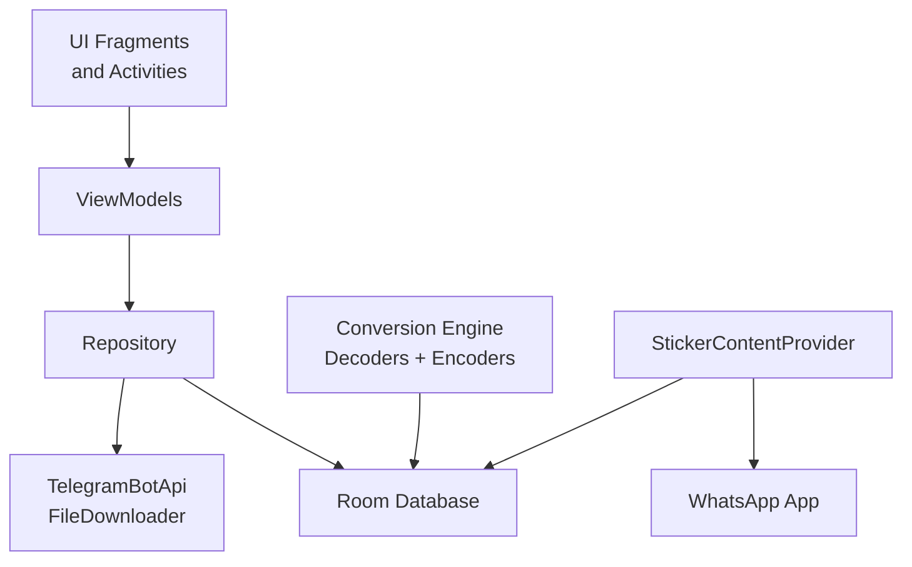
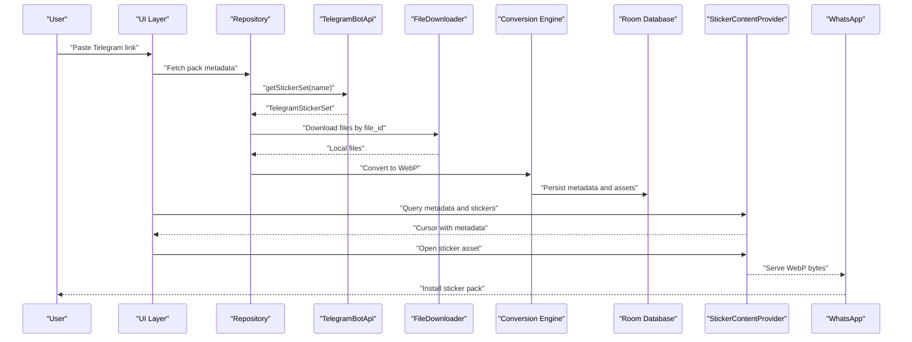
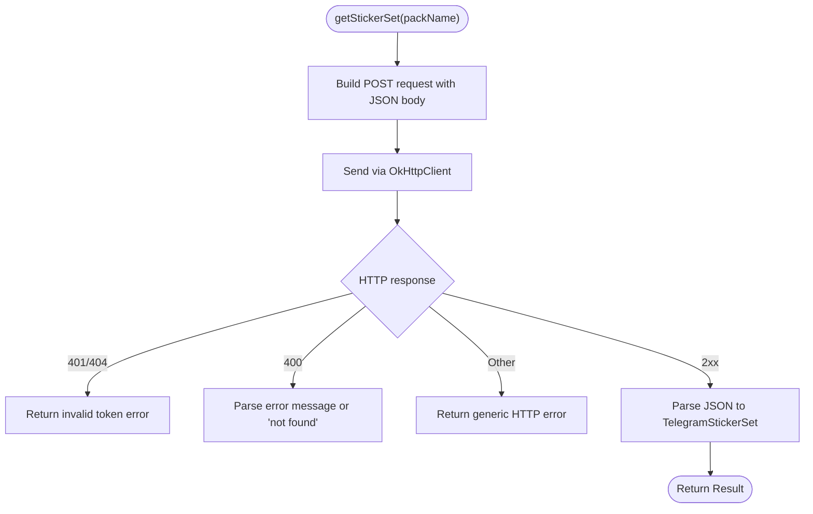
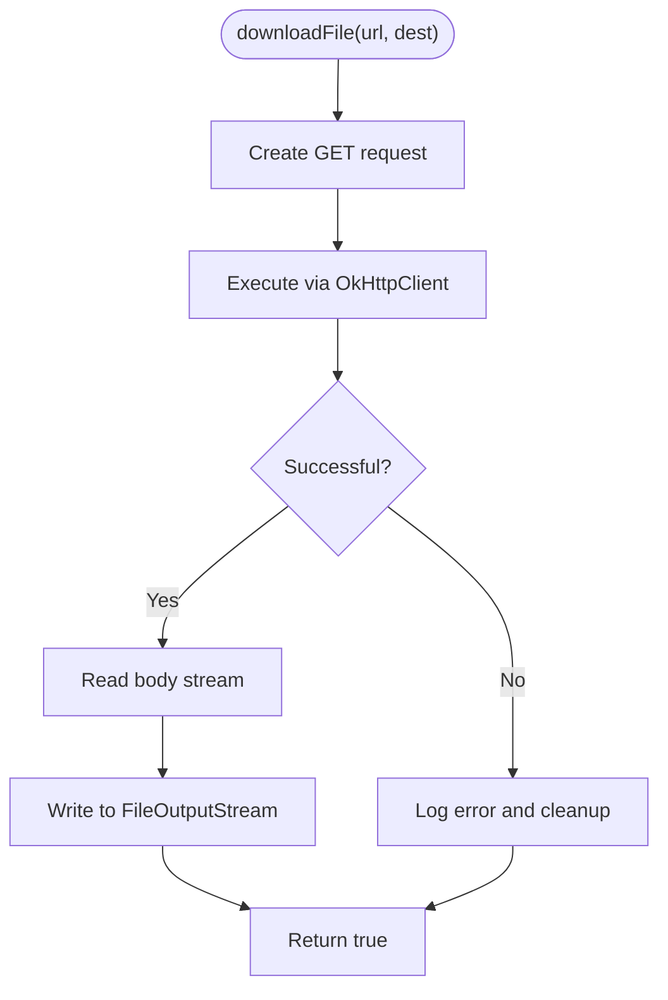
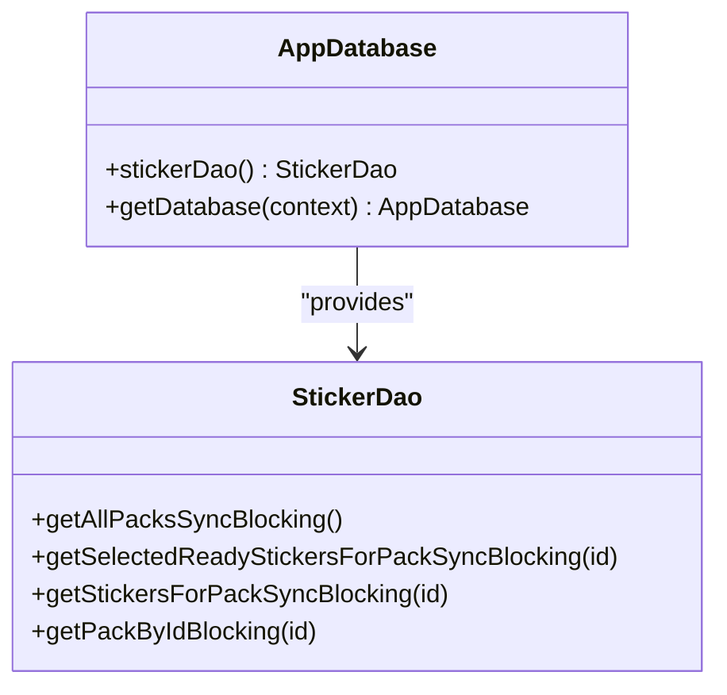
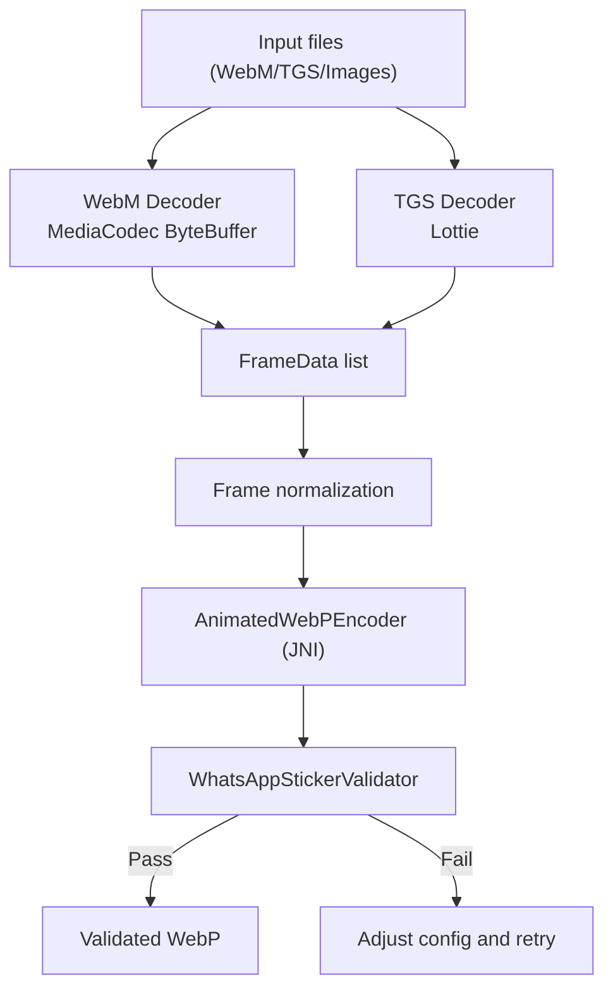
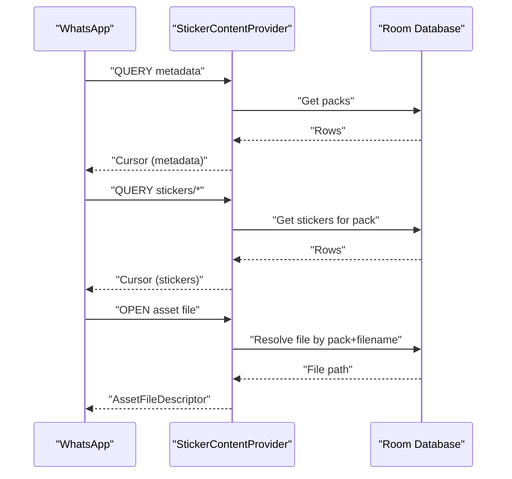
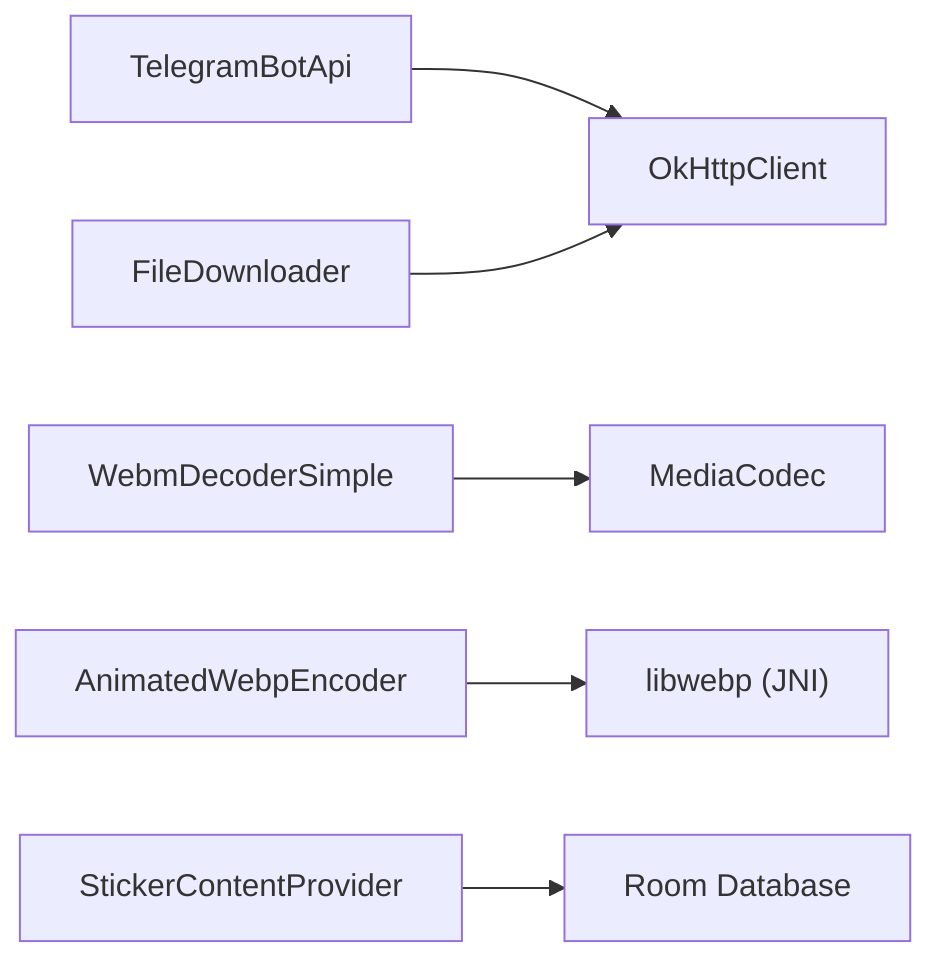

# Security and Privacy

<cite>
**Referenced Files in This Document**
- [README.md](file://README.md)
- [AndroidManifest.xml](file://app/src/main/AndroidManifest.xml)
- [TelegramBotApi.kt](file://app/src/main/java/com/maheshsharan/tel2what/data/network/TelegramBotApi.kt)
- [FileDownloader.kt](file://app/src/main/java/com/maheshsharan/tel2what/data/network/FileDownloader.kt)
- [TelegramModels.kt](file://app/src/main/java/com/maheshsharan/tel2what/data/network/model/TelegramModels.kt)
- [AppDatabase.kt](file://app/src/main/java/com/maheshsharan/tel2what/data/local/AppDatabase.kt)
- [StickerContentProvider.kt](file://app/src/main/java/com/maheshsharan/tel2what/provider/StickerContentProvider.kt)
- [WebmDecoderSimple.kt](file://app/src/main/java/com/maheshsharan/tel2what/engine/decoder/WebmDecoderSimple.kt)
- [AnimatedWebpEncoder.kt](file://app/src/main/java/com/maheshsharan/tel2what/engine/encoder/AnimatedWebpEncoder.kt)
- [ImageProcessor.kt](file://app/src/main/java/com/maheshsharan/tel2what/utils/ImageProcessor.kt)
- [WhatsAppStickerValidator.kt](file://app/src/main/java/com/maheshsharan/tel2what/engine/WhatsAppStickerValidator.kt)
- [privacy-policy.html](file://docs/privacy-policy.html)
- [legal.html](file://docs/legal.html)
</cite>

## Table of Contents
1. [Introduction](#introduction)
2. [Project Structure](#project-structure)
3. [Core Components](#core-components)
4. [Architecture Overview](#architecture-overview)
5. [Detailed Component Analysis](#detailed-component-analysis)
6. [Dependency Analysis](#dependency-analysis)
7. [Performance Considerations](#performance-considerations)
8. [Troubleshooting Guide](#troubleshooting-guide)
9. [Conclusion](#conclusion)
10. [Appendices](#appendices)

## Introduction
This document details the security and privacy design of Tel2What, focusing on privacy-first principles, local processing, minimal data handling, and secure integration with Telegram and Android’s sticker framework. It explains how the app avoids collecting or transmitting personal data, how it securely handles downloaded and converted sticker assets, and how it manages permissions and runtime security controls. It also covers Telegram API integration security, rate-limit considerations, and export/export-related security practices.

## Project Structure
Tel2What is organized around a privacy-preserving, offline-first architecture:
- UI and navigation in fragments and activities
- Data layer with a local Room database
- Network layer for Telegram API and file downloads
- Conversion engine for animated and static stickers
- Android Content Provider for exporting to WhatsApp

**Diagram sources**
- [AndroidManifest.xml](file://app/src/main/AndroidManifest.xml#L11-L39)
- [TelegramBotApi.kt](file://app/src/main/java/com/maheshsharan/tel2what/data/network/TelegramBotApi.kt#L14-L112)
- [FileDownloader.kt](file://app/src/main/java/com/maheshsharan/tel2what/data/network/FileDownloader.kt#L11-L77)
- [AppDatabase.kt](file://app/src/main/java/com/maheshsharan/tel2what/data/local/AppDatabase.kt#L13-L42)
- [StickerContentProvider.kt](file://app/src/main/java/com/maheshsharan/tel2what/provider/StickerContentProvider.kt#L15-L244)

**Section sources**
- [README.md](file://README.md#L98-L110)
- [AndroidManifest.xml](file://app/src/main/AndroidManifest.xml#L1-L39)

## Core Components
- Privacy-first design: No data collection, no analytics, no cloud storage, and no personal data transmission.
- Local processing: All conversions and validations occur on-device after initial downloads.
- Minimal permissions: Internet and network state for Telegram downloads; storage for saving files.
- Telegram API integration: Read-only operations with explicit token handling and error reporting.
- Secure export: Android Content Provider serves files to WhatsApp with strict path and MIME handling.

**Section sources**
- [README.md](file://README.md#L11-L21)
- [AndroidManifest.xml](file://app/src/main/AndroidManifest.xml#L3-L9)
- [privacy-policy.html](file://docs/privacy-policy.html#L49-L98)

## Architecture Overview
The system is structured to minimize data exposure and centralize sensitive operations:
- Telegram API calls are made with a local token and parsed strictly.
- Files are downloaded to local storage and processed in-memory or to disk.
- Conversion results are validated against WhatsApp constraints before export.
- Export uses a Content Provider with fixed, known URIs and strict MIME types.

**Diagram sources**
- [TelegramBotApi.kt](file://app/src/main/java/com/maheshsharan/tel2what/data/network/TelegramBotApi.kt#L22-L73)
- [FileDownloader.kt](file://app/src/main/java/com/maheshsharan/tel2what/data/network/FileDownloader.kt#L21-L75)
- [StickerContentProvider.kt](file://app/src/main/java/com/maheshsharan/tel2what/provider/StickerContentProvider.kt#L74-L180)
- [AppDatabase.kt](file://app/src/main/java/com/maheshsharan/tel2what/data/local/AppDatabase.kt#L13-L42)

## Detailed Component Analysis

### Telegram API Integration Security
- Token handling: The Telegram bot token is embedded in the source for quick testing. Users are instructed to replace it with their own token for production use to avoid shared rate limits and potential abuse.
- Request/response validation: Requests are constructed with JSON bodies and validated for HTTP errors, unauthorized access, missing resources, and parsing failures.
- Logging: Sensitive fields are not logged; only non-sensitive metadata is logged for diagnostics.
- Rate limiting awareness: The README advises creating your own bot to avoid hitting shared limits.

**Diagram sources**
- [TelegramBotApi.kt](file://app/src/main/java/com/maheshsharan/tel2what/data/network/TelegramBotApi.kt#L22-L73)
- [TelegramModels.kt](file://app/src/main/java/com/maheshsharan/tel2what/data/network/model/TelegramModels.kt#L24-L60)

**Section sources**
- [TelegramBotApi.kt](file://app/src/main/java/com/maheshsharan/tel2what/data/network/TelegramBotApi.kt#L16-L18)
- [TelegramBotApi.kt](file://app/src/main/java/com/maheshsharan/tel2what/data/network/TelegramBotApi.kt#L36-L58)
- [TelegramBotApi.kt](file://app/src/main/java/com/maheshsharan/tel2what/data/network/TelegramBotApi.kt#L67-L73)
- [README.md](file://README.md#L121-L133)

### File Download Security and Integrity
- Network transport: Uses OkHttp for reliable, streaming downloads.
- Error handling: Non-success responses and null bodies are handled gracefully; partial files are cleaned up.
- Logging: Logs are scoped to non-sensitive information (status codes, sizes).

**Diagram sources**
- [FileDownloader.kt](file://app/src/main/java/com/maheshsharan/tel2what/data/network/FileDownloader.kt#L21-L75)

**Section sources**
- [FileDownloader.kt](file://app/src/main/java/com/maheshsharan/tel2what/data/network/FileDownloader.kt#L30-L47)
- [FileDownloader.kt](file://app/src/main/java/com/maheshsharan/tel2what/data/network/FileDownloader.kt#L65-L75)

### Local Data Handling and Storage Security
- Room database: Stores sticker pack metadata and file paths locally; migrations are defined for schema evolution.
- File paths: Stored as absolute paths; retrieval resolves tray icons and sticker files by pack ID and filename.
- Temporary files: Created during conversion and download; cleanup on failure prevents orphaned data.

**Diagram sources**
- [AppDatabase.kt](file://app/src/main/java/com/maheshsharan/tel2what/data/local/AppDatabase.kt#L13-L42)
- [StickerContentProvider.kt](file://app/src/main/java/com/maheshsharan/tel2what/provider/StickerContentProvider.kt#L223-L235)

**Section sources**
- [AppDatabase.kt](file://app/src/main/java/com/maheshsharan/tel2what/data/local/AppDatabase.kt#L17-L39)
- [StickerContentProvider.kt](file://app/src/main/java/com/maheshsharan/tel2what/provider/StickerContentProvider.kt#L111-L113)
- [StickerContentProvider.kt](file://app/src/main/java/com/maheshsharan/tel2what/provider/StickerContentProvider.kt#L223-L235)

### Conversion Engine Security and Validation
- Decoding: WebM decoding uses MediaCodec in ByteBuffer mode to avoid format mismatches and leaks raw buffers safely.
- Encoding: Animated WebP encoding is performed via a native JNI bridge to libwebp, ensuring hardware-accelerated and secure encoding.
- Validation: Pre-export validation checks size, dimensions, and animated/static constraints to fail early and avoid sending invalid assets to WhatsApp.

**Diagram sources**
- [WebmDecoderSimple.kt](file://app/src/main/java/com/maheshsharan/tel2what/engine/decoder/WebmDecoderSimple.kt#L27-L192)
- [AnimatedWebpEncoder.kt](file://app/src/main/java/com/maheshsharan/tel2what/engine/encoder/AnimatedWebpEncoder.kt#L32-L78)
- [WhatsAppStickerValidator.kt](file://app/src/main/java/com/maheshsharan/tel2what/engine/WhatsAppStickerValidator.kt#L14-L70)

**Section sources**
- [WebmDecoderSimple.kt](file://app/src/main/java/com/maheshsharan/tel2what/engine/decoder/WebmDecoderSimple.kt#L89-L109)
- [AnimatedWebpEncoder.kt](file://app/src/main/java/com/maheshsharan/tel2what/engine/encoder/AnimatedWebpEncoder.kt#L13-L21)
- [WhatsAppStickerValidator.kt](file://app/src/main/java/com/maheshsharan/tel2what/engine/WhatsAppStickerValidator.kt#L19-L40)

### Export and Permission Management
- Android Content Provider: Exposes metadata and sticker assets to WhatsApp using fixed URIs and MIME types. Export requires WhatsApp packages to be installed and queryable.
- Permissions: Only INTERNET and ACCESS_NETWORK_STATE are requested; storage is used for local file operations.
- Tray icon generation: Enforces size and dimension constraints for tray icons to meet platform requirements.

**Diagram sources**
- [StickerContentProvider.kt](file://app/src/main/java/com/maheshsharan/tel2what/provider/StickerContentProvider.kt#L74-L180)
- [AndroidManifest.xml](file://app/src/main/AndroidManifest.xml#L6-L9)

**Section sources**
- [AndroidManifest.xml](file://app/src/main/AndroidManifest.xml#L3-L9)
- [AndroidManifest.xml](file://app/src/main/AndroidManifest.xml#L19-L25)
- [StickerContentProvider.kt](file://app/src/main/java/com/maheshsharan/tel2what/provider/StickerContentProvider.kt#L170-L179)
- [StickerContentProvider.kt](file://app/src/main/java/com/maheshsharan/tel2what/provider/StickerContentProvider.kt#L189-L216)
- [ImageProcessor.kt](file://app/src/main/java/com/maheshsharan/tel2what/utils/ImageProcessor.kt#L11-L12)

### Data Minimization and Privacy-Focused Design
- No personal data collection: The privacy policy explicitly states no collection of personal information, device identifiers, usage analytics, crash reports, location, or sticker content.
- Offline-first: Everything is processed locally; no cloud storage or transmission of user data.
- Minimal permissions: Only internet and storage are requested for core functionality.
- Transparent operation: Open source availability supports verification of privacy claims.

**Section sources**
- [privacy-policy.html](file://docs/privacy-policy.html#L49-L98)
- [README.md](file://README.md#L11-L21)
- [AndroidManifest.xml](file://app/src/main/AndroidManifest.xml#L3-L9)

## Dependency Analysis
Key security-relevant dependencies and their roles:
- OkHttp: Transport for Telegram API and file downloads; supports robust error handling and logging control.
- Room: Local persistence with migrations; no cloud sync.
- MediaCodec: Hardware-accelerated decoding with controlled buffer usage.
- JNI/libwebp: Native encoding for performance and reduced in-app processing overhead.
- Android Content Provider: Controlled export surface to WhatsApp with strict URIs and MIME types.

**Diagram sources**
- [TelegramBotApi.kt](file://app/src/main/java/com/maheshsharan/tel2what/data/network/TelegramBotApi.kt#L18-L20)
- [FileDownloader.kt](file://app/src/main/java/com/maheshsharan/tel2what/data/network/FileDownloader.kt#L13-L13)
- [WebmDecoderSimple.kt](file://app/src/main/java/com/maheshsharan/tel2what/engine/decoder/WebmDecoderSimple.kt#L90-L102)
- [AnimatedWebpEncoder.kt](file://app/src/main/java/com/maheshsharan/tel2what/engine/encoder/AnimatedWebpEncoder.kt#L14-L20)
- [StickerContentProvider.kt](file://app/src/main/java/com/maheshsharan/tel2what/provider/StickerContentProvider.kt#L64-L69)

**Section sources**
- [TelegramBotApi.kt](file://app/src/main/java/com/maheshsharan/tel2what/data/network/TelegramBotApi.kt#L18-L20)
- [FileDownloader.kt](file://app/src/main/java/com/maheshsharan/tel2what/data/network/FileDownloader.kt#L13-L13)
- [WebmDecoderSimple.kt](file://app/src/main/java/com/maheshsharan/tel2what/engine/decoder/WebmDecoderSimple.kt#L90-L102)
- [AnimatedWebpEncoder.kt](file://app/src/main/java/com/maheshsharan/tel2what/engine/encoder/AnimatedWebpEncoder.kt#L14-L20)
- [StickerContentProvider.kt](file://app/src/main/java/com/maheshsharan/tel2what/provider/StickerContentProvider.kt#L64-L69)

## Performance Considerations
- Hardware acceleration: MediaCodec decoding and native libwebp encoding reduce CPU time and memory pressure.
- Streaming I/O: Downloads stream directly to disk; conversion writes to files incrementally.
- Early validation: Size and dimension checks prevent wasted computation on invalid outputs.
- Concurrency: IO dispatchers isolate network and disk operations from UI threads.

[No sources needed since this section provides general guidance]

## Troubleshooting Guide
Common issues and mitigations:
- Telegram API errors: Invalid token, not found, or rate-limited responses are surfaced with actionable messages. Replace the token and retry.
- Network failures: Unknown host or transient network errors are caught and reported; verify connectivity.
- Download failures: Null body or non-success responses trigger cleanup of partial files.
- Export failures: Provider logs help diagnose URI segment counts, file existence, and MIME type mismatches.

**Section sources**
- [TelegramBotApi.kt](file://app/src/main/java/com/maheshsharan/tel2what/data/network/TelegramBotApi.kt#L36-L58)
- [TelegramBotApi.kt](file://app/src/main/java/com/maheshsharan/tel2what/data/network/TelegramBotApi.kt#L67-L73)
- [FileDownloader.kt](file://app/src/main/java/com/maheshsharan/tel2what/data/network/FileDownloader.kt#L35-L47)
- [FileDownloader.kt](file://app/src/main/java/com/maheshsharan/tel2what/data/network/FileDownloader.kt#L65-L75)
- [StickerContentProvider.kt](file://app/src/main/java/com/maheshsharan/tel2what/provider/StickerContentProvider.kt#L193-L196)
- [StickerContentProvider.kt](file://app/src/main/java/com/maheshsharan/tel2what/provider/StickerContentProvider.kt#L203-L215)

## Conclusion
Tel2What implements a privacy-first, offline-first design with strong operational security controls. By minimizing data collection, processing everything locally, validating outputs rigorously, and exposing a narrow, controlled export surface, the app reduces privacy and security risks. Telegram API integration is secured through explicit token management and robust error handling, while Android’s Content Provider enforces strict URIs and MIME types for export.

[No sources needed since this section summarizes without analyzing specific files]

## Appendices

### Legal and Compliance References
- Privacy policy outlines non-collection of personal data, offline operation, and transparency.
- Legal documents page links to privacy policy, terms of service, and open-source licenses.

**Section sources**
- [privacy-policy.html](file://docs/privacy-policy.html#L49-L98)
- [legal.html](file://docs/legal.html#L133-L147)