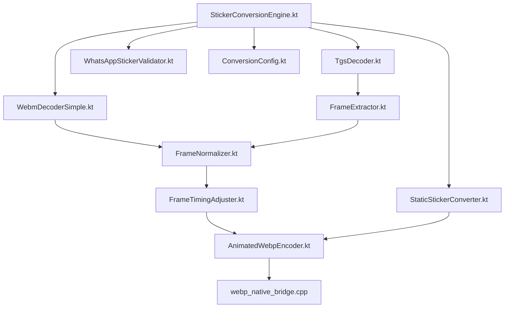
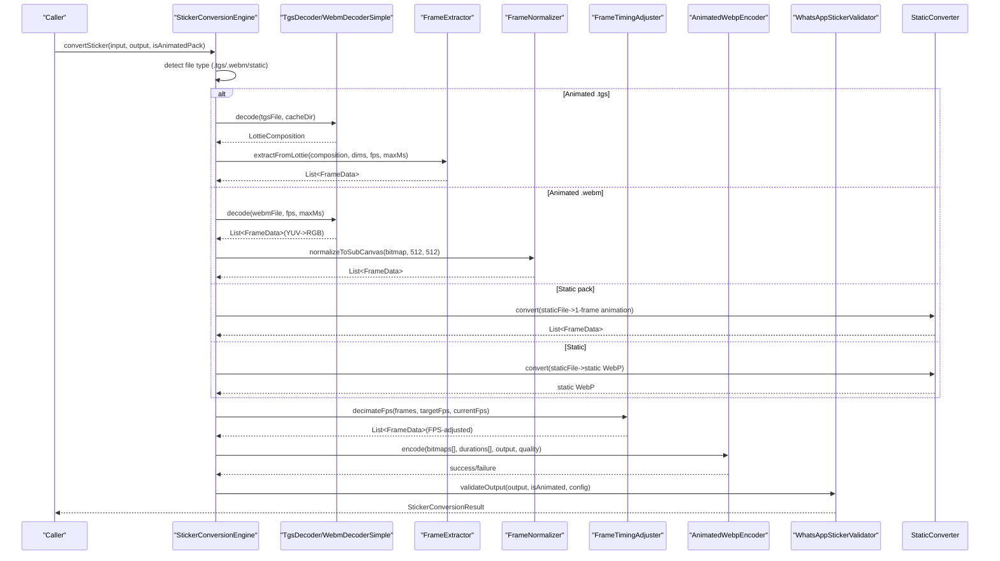
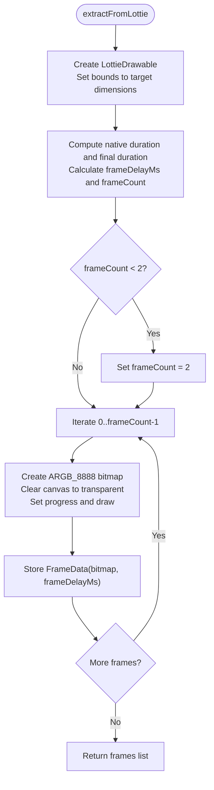
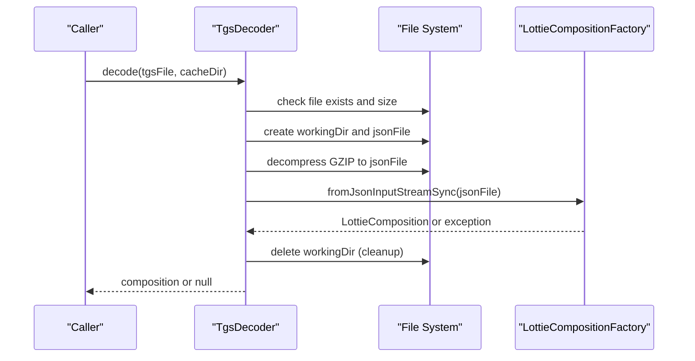
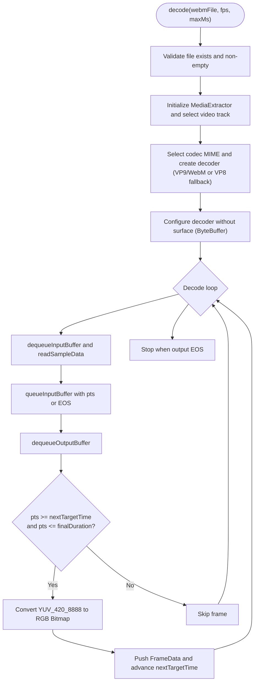
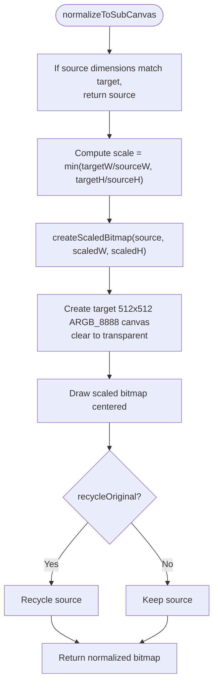
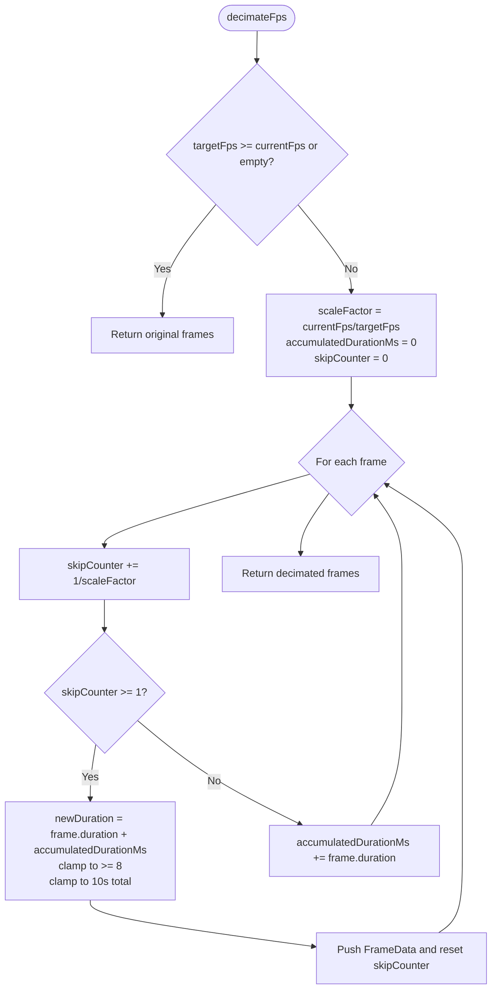
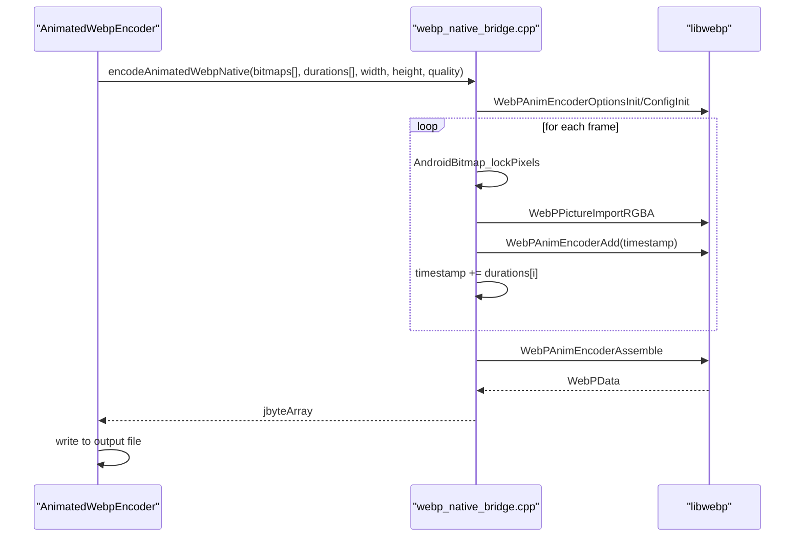
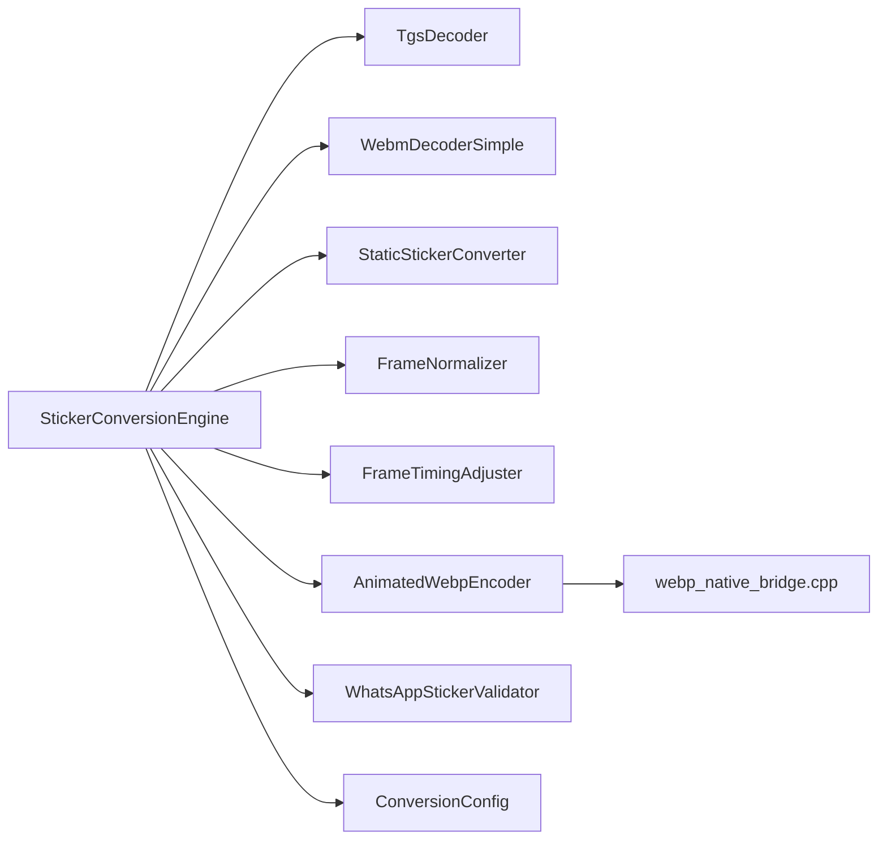

# Media Processing Algorithms

<cite>
**Referenced Files in This Document**
- [FrameExtractor.kt](file://app/src/main/java/com/maheshsharan/tel2what/engine/decoder/FrameExtractor.kt)
- [TgsDecoder.kt](file://app/src/main/java/com/maheshsharan/tel2what/engine/decoder/TgsDecoder.kt)
- [WebmDecoderSimple.kt](file://app/src/main/java/com/maheshsharan/tel2what/engine/decoder/WebmDecoderSimple.kt)
- [FrameNormalizer.kt](file://app/src/main/java/com/maheshsharan/tel2what/engine/frame/FrameNormalizer.kt)
- [FrameTimingAdjuster.kt](file://app/src/main/java/com/maheshsharan/tel2what/engine/frame/FrameTimingAdjuster.kt)
- [FrameData.kt](file://app/src/main/java/com/maheshsharan/tel2what/engine/frame/FrameData.kt)
- [StickerConversionEngine.kt](file://app/src/main/java/com/maheshsharan/tel2what/engine/StickerConversionEngine.kt)
- [StaticStickerConverter.kt](file://app/src/main/java/com/maheshsharan/tel2what/engine/StaticStickerConverter.kt)
- [AnimatedWebpEncoder.kt](file://app/src/main/java/com/maheshsharan/tel2what/engine/encoder/AnimatedWebpEncoder.kt)
- [ConversionConfig.kt](file://app/src/main/java/com/maheshsharan/tel2what/engine/ConversionConfig.kt)
- [WhatsAppStickerValidator.kt](file://app/src/main/java/com/maheshsharan/tel2what/engine/WhatsAppStickerValidator.kt)
- [StickerConverter.kt](file://app/src/main/java/com/maheshsharan/tel2what/engine/StickerConverter.kt)
- [StickerConversionResult.kt](file://app/src/main/java/com/maheshsharan/tel2what/engine/StickerConversionResult.kt)
- [webp_native_bridge.cpp](file://app/src/main/cpp/webp_native_bridge.cpp)
</cite>

## Table of Contents
1. [Introduction](#introduction)
2. [Project Structure](#project-structure)
3. [Core Components](#core-components)
4. [Architecture Overview](#architecture-overview)
5. [Detailed Component Analysis](#detailed-component-analysis)
6. [Dependency Analysis](#dependency-analysis)
7. [Performance Considerations](#performance-considerations)
8. [Troubleshooting Guide](#troubleshooting-guide)
9. [Conclusion](#conclusion)
10. [Appendices](#appendices)

## Introduction
This document explains Tel2What’s media processing algorithms and video decoding systems with a focus on:
- FrameExtractor for extracting individual frames from animated sources (Lottie TGS animations), including timing calculations and frame rate normalization.
- TGS (Telegram GIF) decoder using the Lottie library, covering animation parsing, frame interpolation, and rendering optimization.
- WebM video decoder implementation, including hardware acceleration support and frame extraction strategies.
- FrameNormalizer algorithms for maintaining consistent frame dimensions and timing.
- Color space conversion processes, frame scaling techniques, and memory-efficient processing pipelines.
- Algorithm complexity analysis, performance characteristics, and optimization strategies for different input formats.

## Project Structure
The media processing pipeline is organized around a central engine that routes inputs to specialized decoders and then normalizes and encodes frames into animated WebP. Supporting components handle frame normalization, timing adjustment, configuration, validation, and JNI-based WebP encoding.

**Diagram sources**
- [StickerConversionEngine.kt](file://app/src/main/java/com/maheshsharan/tel2what/engine/StickerConversionEngine.kt#L33-L88)
- [TgsDecoder.kt](file://app/src/main/java/com/maheshsharan/tel2what/engine/decoder/TgsDecoder.kt#L21-L80)
- [WebmDecoderSimple.kt](file://app/src/main/java/com/maheshsharan/tel2what/engine/decoder/WebmDecoderSimple.kt#L23-L192)
- [FrameExtractor.kt](file://app/src/main/java/com/maheshsharan/tel2what/engine/decoder/FrameExtractor.kt#L24-L98)
- [FrameNormalizer.kt](file://app/src/main/java/com/maheshsharan/tel2what/engine/frame/FrameNormalizer.kt#L17-L60)
- [FrameTimingAdjuster.kt](file://app/src/main/java/com/maheshsharan/tel2what/engine/frame/FrameTimingAdjuster.kt#L16-L70)
- [AnimatedWebpEncoder.kt](file://app/src/main/java/com/maheshsharan/tel2what/engine/encoder/AnimatedWebpEncoder.kt#L32-L78)
- [webp_native_bridge.cpp](file://app/src/main/cpp/webp_native_bridge.cpp#L14-L147)
- [WhatsAppStickerValidator.kt](file://app/src/main/java/com/maheshsharan/tel2what/engine/WhatsAppStickerValidator.kt#L14-L70)
- [ConversionConfig.kt](file://app/src/main/java/com/maheshsharan/tel2what/engine/ConversionConfig.kt#L3-L13)

**Section sources**
- [StickerConversionEngine.kt](file://app/src/main/java/com/maheshsharan/tel2what/engine/StickerConversionEngine.kt#L33-L88)
- [ConversionConfig.kt](file://app/src/main/java/com/maheshsharan/tel2what/engine/ConversionConfig.kt#L3-L13)

## Core Components
- FrameExtractor: Extracts frames from Lottie compositions at a target FPS, normalizes timing, and enforces minimum frame counts.
- TgsDecoder: Decompresses Telegram .tgs (GZIP JSON) and parses into a LottieComposition for downstream extraction.
- WebmDecoderSimple: Uses MediaExtractor/MediaCodec to decode VP9/VP8 WebM streams, converting YUV output to RGB bitmaps and capturing at target FPS.
- FrameNormalizer: Scales and letterboxes arbitrary frames to fixed 512x512 boundaries with transparent padding.
- FrameTimingAdjuster: Decimates frame rates by accumulating durations into retained frames while respecting WhatsApp constraints.
- AnimatedWebpEncoder: JNI bridge to libwebp for animated WebP generation with configurable quality and duration arrays.
- StickerConversionEngine: Orchestrates routing, concurrency control, and the multi-stage compression loop with adaptive FPS/quality tuning.
- StaticStickerConverter: Handles static images by scaling to fit within 512x512 with transparent padding and iterative lossy compression.
- WhatsAppStickerValidator: Validates output size and dimensions against WhatsApp constraints.

**Section sources**
- [FrameExtractor.kt](file://app/src/main/java/com/maheshsharan/tel2what/engine/decoder/FrameExtractor.kt#L24-L98)
- [TgsDecoder.kt](file://app/src/main/java/com/maheshsharan/tel2what/engine/decoder/TgsDecoder.kt#L21-L80)
- [WebmDecoderSimple.kt](file://app/src/main/java/com/maheshsharan/tel2what/engine/decoder/WebmDecoderSimple.kt#L23-L192)
- [FrameNormalizer.kt](file://app/src/main/java/com/maheshsharan/tel2what/engine/frame/FrameNormalizer.kt#L17-L60)
- [FrameTimingAdjuster.kt](file://app/src/main/java/com/maheshsharan/tel2what/engine/frame/FrameTimingAdjuster.kt#L16-L70)
- [AnimatedWebpEncoder.kt](file://app/src/main/java/com/maheshsharan/tel2what/engine/encoder/AnimatedWebpEncoder.kt#L32-L78)
- [StickerConversionEngine.kt](file://app/src/main/java/com/maheshsharan/tel2what/engine/StickerConversionEngine.kt#L131-L273)
- [StaticStickerConverter.kt](file://app/src/main/java/com/maheshsharan/tel2what/engine/StaticStickerConverter.kt#L17-L93)
- [WhatsAppStickerValidator.kt](file://app/src/main/java/com/maheshsharan/tel2what/engine/WhatsAppStickerValidator.kt#L14-L70)

## Architecture Overview
The pipeline selects a route based on input type:
- Animated file (.tgs or .webm): Decode, normalize, adjust timing, and encode to animated WebP.
- Static file: Scale to 512x512 with transparent padding, then compress to static WebP.
- Static pack: Convert single static image into a 1-frame animated WebP.

**Diagram sources**
- [StickerConversionEngine.kt](file://app/src/main/java/com/maheshsharan/tel2what/engine/StickerConversionEngine.kt#L131-L273)
- [TgsDecoder.kt](file://app/src/main/java/com/maheshsharan/tel2what/engine/decoder/TgsDecoder.kt#L21-L80)
- [WebmDecoderSimple.kt](file://app/src/main/java/com/maheshsharan/tel2what/engine/decoder/WebmDecoderSimple.kt#L23-L192)
- [FrameExtractor.kt](file://app/src/main/java/com/maheshsharan/tel2what/engine/decoder/FrameExtractor.kt#L24-L98)
- [FrameNormalizer.kt](file://app/src/main/java/com/maheshsharan/tel2what/engine/frame/FrameNormalizer.kt#L17-L60)
- [FrameTimingAdjuster.kt](file://app/src/main/java/com/maheshsharan/tel2what/engine/frame/FrameTimingAdjuster.kt#L16-L70)
- [AnimatedWebpEncoder.kt](file://app/src/main/java/com/maheshsharan/tel2what/engine/encoder/AnimatedWebpEncoder.kt#L32-L78)
- [WhatsAppStickerValidator.kt](file://app/src/main/java/com/maheshsharan/tel2what/engine/WhatsAppStickerValidator.kt#L14-L70)

## Detailed Component Analysis

### FrameExtractor: Lottie-based Frame Extraction and Timing
FrameExtractor renders a LottieComposition into discrete frames at a target FPS, enforcing duration caps and ensuring a minimum number of frames for animated sticker compatibility.

Key behaviors:
- Creates a LottieDrawable from the composition and sets target bounds for native scaling.
- Computes frame delay from target FPS and determines frame count capped by composition duration and max duration.
- Forces a minimum of two frames to satisfy animated sticker requirements.
- Renders each frame by setting drawable progress and drawing onto an ARGB_8888 canvas, storing each frame with uniform duration.
- Includes robust error handling with bitmap recycling on failure.

**Diagram sources**
- [FrameExtractor.kt](file://app/src/main/java/com/maheshsharan/tel2what/engine/decoder/FrameExtractor.kt#L24-L98)

**Section sources**
- [FrameExtractor.kt](file://app/src/main/java/com/maheshsharan/tel2what/engine/decoder/FrameExtractor.kt#L24-L98)

### TGS Decoder: GZIP Decompression and Lottie Composition Parsing
The TGS decoder handles Telegram’s .tgs format, which is a GZIP-compressed JSON containing a Lottie animation definition.

Processing steps:
- Validates input existence and non-empty size.
- Decompresses GZIP to a temporary JSON file in a cache directory.
- Parses JSON synchronously into a LottieComposition using LottieCompositionFactory.
- Returns the composition or null on failure, with cleanup of intermediate files.

**Diagram sources**
- [TgsDecoder.kt](file://app/src/main/java/com/maheshsharan/tel2what/engine/decoder/TgsDecoder.kt#L21-L80)

**Section sources**
- [TgsDecoder.kt](file://app/src/main/java/com/maheshsharan/tel2what/engine/decoder/TgsDecoder.kt#L21-L80)

### WebM Decoder: MediaCodec-Based Frame Extraction and YUV-to-RGB Conversion
WebmDecoderSimple decodes VP9/VP8 WebM streams using MediaCodec in ByteBuffer mode to avoid format mismatches, captures frames at target FPS, and converts YUV_420_8888 to RGB bitmaps.

Highlights:
- Selects the first video track and infers codec MIME (VP9 for WebM).
- Attempts codec creation with fallback to VP8 if needed.
- Reads samples via MediaExtractor, queues input buffers with timestamps, and captures output frames whose presentation times meet the target cadence.
- Converts YUV_420_8888 to RGB by converting to NV21 and using YuvImage+JPEG path for fast conversion.
- Applies dynamic duration calculation based on PTS differences for realistic timing.

**Diagram sources**
- [WebmDecoderSimple.kt](file://app/src/main/java/com/maheshsharan/tel2what/engine/decoder/WebmDecoderSimple.kt#L23-L192)
- [WebmDecoderSimple.kt](file://app/src/main/java/com/maheshsharan/tel2what/engine/decoder/WebmDecoderSimple.kt#L205-L254)

**Section sources**
- [WebmDecoderSimple.kt](file://app/src/main/java/com/maheshsharan/tel2what/engine/decoder/WebmDecoderSimple.kt#L23-L192)
- [WebmDecoderSimple.kt](file://app/src/main/java/com/maheshsharan/tel2what/engine/decoder/WebmDecoderSimple.kt#L205-L254)

### FrameNormalizer: Aspect-Ratio Preserving Scaling and Letterboxing
FrameNormalizer scales an arbitrary bitmap to fit within 512x512 while preserving aspect ratio and centers the image on a transparent 512x512 canvas, adding translucent padding for letterboxing.

Behavior:
- Computes scale factor to fit within target bounds.
- Creates a scaled bitmap and draws it centered on a transparent target canvas.
- Recycles the original bitmap if requested to reduce memory pressure.

**Diagram sources**
- [FrameNormalizer.kt](file://app/src/main/java/com/maheshsharan/tel2what/engine/frame/FrameNormalizer.kt#L17-L60)

**Section sources**
- [FrameNormalizer.kt](file://app/src/main/java/com/maheshsharan/tel2what/engine/frame/FrameNormalizer.kt#L17-L60)

### FrameTimingAdjuster: FPS Decimation with Duration Accumulation
FrameTimingAdjuster reduces frame rate by decimating frames and accumulating their durations into the retained frames. It enforces:
- Minimum 8 ms per frame.
- Maximum total duration of 10 seconds.
- Maintains global timing continuity across drops.

**Diagram sources**
- [FrameTimingAdjuster.kt](file://app/src/main/java/com/maheshsharan/tel2what/engine/frame/FrameTimingAdjuster.kt#L16-L70)

**Section sources**
- [FrameTimingAdjuster.kt](file://app/src/main/java/com/maheshsharan/tel2what/engine/frame/FrameTimingAdjuster.kt#L16-L70)

### Animated WebP Encoding Pipeline: JNI Bridge and libwebp
AnimatedWebpEncoder loads a native library and marshals frames and durations into libwebp for animated WebP generation. The native bridge:
- Initializes WebPAnimEncoder with loop_count=0 for infinite looping.
- Configures lossy encoding with method=1 for speed and acceptable quality.
- Iterates frames, locks Android bitmap pixels, imports RGBA into WebPPicture, and appends frames with accumulated timestamps.
- Assembles the animation and returns the byte array to Java for writing to disk.

**Diagram sources**
- [AnimatedWebpEncoder.kt](file://app/src/main/java/com/maheshsharan/tel2what/engine/encoder/AnimatedWebpEncoder.kt#L32-L78)
- [webp_native_bridge.cpp](file://app/src/main/cpp/webp_native_bridge.cpp#L14-L147)

**Section sources**
- [AnimatedWebpEncoder.kt](file://app/src/main/java/com/maheshsharan/tel2what/engine/encoder/AnimatedWebpEncoder.kt#L32-L78)
- [webp_native_bridge.cpp](file://app/src/main/cpp/webp_native_bridge.cpp#L14-L147)

### StickerConversionEngine: Orchestration and Adaptive Compression Loop
StickerConversionEngine coordinates the entire pipeline:
- Routes to TGS/WebM decoders or static converters based on file type.
- Normalizes frames to 512x512 and adjusts timing to target FPS.
- Runs an adaptive compression loop that lowers FPS or quality to meet size targets (≤500 KB for animated).
- Validates output dimensions and size against WhatsApp constraints.

Concurrency:
- Uses semaphores to limit concurrent animated conversions to 1 and static conversions to 4, preventing thermal throttling and OOM.

**Section sources**
- [StickerConversionEngine.kt](file://app/src/main/java/com/maheshsharan/tel2what/engine/StickerConversionEngine.kt#L33-L88)
- [StickerConversionEngine.kt](file://app/src/main/java/com/maheshsharan/tel2what/engine/StickerConversionEngine.kt#L131-L273)

### StaticStickerConverter: Static Image to Static WebP
StaticStickerConverter:
- Decodes input image and scales to fit within 512x512 while preserving aspect ratio.
- Draws the scaled image onto a 512x512 transparent canvas.
- Iteratively compresses to WebP lossy with decreasing quality until under 100 KB.

**Section sources**
- [StaticStickerConverter.kt](file://app/src/main/java/com/maheshsharan/tel2what/engine/StaticStickerConverter.kt#L17-L93)

### Validation and Configuration
WhatsAppStickerValidator:
- Checks file existence and size limits (static ≤100 KB, animated ≤500 KB).
- Validates exact 512x512 dimensions using BitmapFactory with inJustDecodeBounds.

ConversionConfig:
- Defines target dimensions (512x512), size limits, max duration (10 s), min frame duration (~125 FPS), and target FPS (10 FPS).

**Section sources**
- [WhatsAppStickerValidator.kt](file://app/src/main/java/com/maheshsharan/tel2what/engine/WhatsAppStickerValidator.kt#L14-L70)
- [ConversionConfig.kt](file://app/src/main/java/com/maheshsharan/tel2what/engine/ConversionConfig.kt#L3-L13)

## Dependency Analysis
High-level dependencies among major components:

**Diagram sources**
- [StickerConversionEngine.kt](file://app/src/main/java/com/maheshsharan/tel2what/engine/StickerConversionEngine.kt#L33-L88)
- [TgsDecoder.kt](file://app/src/main/java/com/maheshsharan/tel2what/engine/decoder/TgsDecoder.kt#L21-L80)
- [WebmDecoderSimple.kt](file://app/src/main/java/com/maheshsharan/tel2what/engine/decoder/WebmDecoderSimple.kt#L23-L192)
- [StaticStickerConverter.kt](file://app/src/main/java/com/maheshsharan/tel2what/engine/StaticStickerConverter.kt#L17-L93)
- [FrameNormalizer.kt](file://app/src/main/java/com/maheshsharan/tel2what/engine/frame/FrameNormalizer.kt#L17-L60)
- [FrameTimingAdjuster.kt](file://app/src/main/java/com/maheshsharan/tel2what/engine/frame/FrameTimingAdjuster.kt#L16-L70)
- [AnimatedWebpEncoder.kt](file://app/src/main/java/com/maheshsharan/tel2what/engine/encoder/AnimatedWebpEncoder.kt#L32-L78)
- [webp_native_bridge.cpp](file://app/src/main/cpp/webp_native_bridge.cpp#L14-L147)
- [WhatsAppStickerValidator.kt](file://app/src/main/java/com/maheshsharan/tel2what/engine/WhatsAppStickerValidator.kt#L14-L70)
- [ConversionConfig.kt](file://app/src/main/java/com/maheshsharan/tel2what/engine/ConversionConfig.kt#L3-L13)

**Section sources**
- [StickerConversionEngine.kt](file://app/src/main/java/com/maheshsharan/tel2what/engine/StickerConversionEngine.kt#L33-L88)

## Performance Considerations
- FrameExtractor
  - Rendering per frame is CPU-bound; target FPS directly impacts render time. Uniform duration simplifies timing but may increase memory usage.
  - Minimum frame enforcement prevents trivial outputs but increases frame count.
  - Complexity: O(N) frames × per-frame rendering cost; memory usage proportional to N bitmaps.
- TgsDecoder
  - Decompression and JSON parsing are I/O and CPU bound; synchronous Lottie parsing blocks the IO dispatcher briefly.
  - Complexity: O(1) parse plus I/O; memory overhead from intermediate JSON file.
- WebmDecoderSimple
  - MediaCodec decoding is hardware-accelerated where available; ByteBuffer mode avoids format mismatches.
  - YUV to RGB conversion via YuvImage+JPEG introduces extra copies and CPU work; consider GPU paths if available.
  - Complexity: O(S) samples processed; output frame count depends on FPS and duration.
- FrameNormalizer
  - Single-pass scaling and letterboxing; minimal overhead. Recycling reduces GC pressure.
- FrameTimingAdjuster
  - O(N) pass with constant-time operations per frame; maintains global timing with minimal memory.
- AnimatedWebpEncoder
  - JNI bridge transfers pixel buffers and performs lossy encoding; method=1 balances speed and size.
  - Memory footprint dominated by frame arrays and intermediate WebP data.

Optimization strategies:
- Reduce target FPS for faster extraction and encoding.
- Prefer hardware decoders by using MediaCodec where supported.
- Minimize bitmap copies by reusing canvases and recycling early.
- Tune quality downward for animated WebP to meet size constraints quickly.
- Limit concurrency to avoid thermal throttling and memory pressure.

[No sources needed since this section provides general guidance]

## Troubleshooting Guide
Common issues and remedies:
- Empty or missing input file: Both engines and decoders log errors and return failure results. Verify file paths and permissions.
- TGS parsing failures: Decompression or Lottie parse errors lead to null composition; check JSON validity and GZIP integrity.
- WebM decoding failures: No video track, unsupported MIME, or codec creation failures. Ensure container and codec are supported.
- YUV conversion errors: Buffer size mismatch or invalid YUV planes cause null bitmaps; validate MediaCodec output format.
- Size violations: If animated WebP exceeds 500 KB, lower FPS or quality; if static exceeds 100 KB, reduce quality further.
- Dimension mismatches: Ensure normalization to 512x512 and validate final dimensions post-encoding.

**Section sources**
- [TgsDecoder.kt](file://app/src/main/java/com/maheshsharan/tel2what/engine/decoder/TgsDecoder.kt#L21-L80)
- [WebmDecoderSimple.kt](file://app/src/main/java/com/maheshsharan/tel2what/engine/decoder/WebmDecoderSimple.kt#L23-L192)
- [FrameNormalizer.kt](file://app/src/main/java/com/maheshsharan/tel2what/engine/frame/FrameNormalizer.kt#L17-L60)
- [AnimatedWebpEncoder.kt](file://app/src/main/java/com/maheshsharan/tel2what/engine/encoder/AnimatedWebpEncoder.kt#L32-L78)
- [WhatsAppStickerValidator.kt](file://app/src/main/java/com/maheshsharan/tel2what/engine/WhatsAppStickerValidator.kt#L14-L70)

## Conclusion
Tel2What’s media processing pipeline combines robust decoders (Lottie for TGS and MediaCodec for WebM), efficient normalization and timing adjustment, and a high-performance JNI-based animated WebP encoder. The system enforces strict constraints for WhatsApp compatibility, adapts FPS and quality dynamically, and manages memory carefully to maintain responsiveness across devices.

[No sources needed since this section summarizes without analyzing specific files]

## Appendices

### Algorithm Complexity Summary
- FrameExtractor: O(N) rendering; memory O(N) bitmaps.
- TgsDecoder: O(1) parse plus I/O; memory O(JSON size).
- WebmDecoderSimple: O(S) samples; memory O(output frames).
- FrameNormalizer: O(1) per frame; negligible memory.
- FrameTimingAdjuster: O(N) with accumulation; memory O(N).
- AnimatedWebpEncoder: O(F) frames with libwebp; memory O(F) + intermediate WebP data.

[No sources needed since this section provides general guidance]