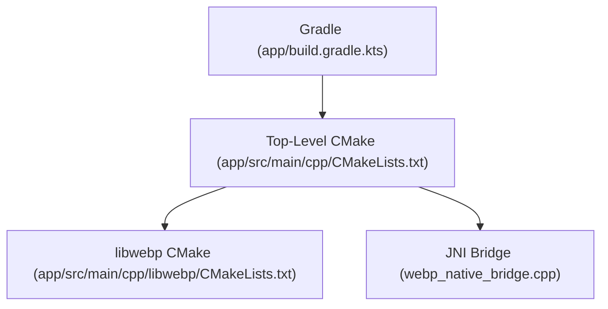
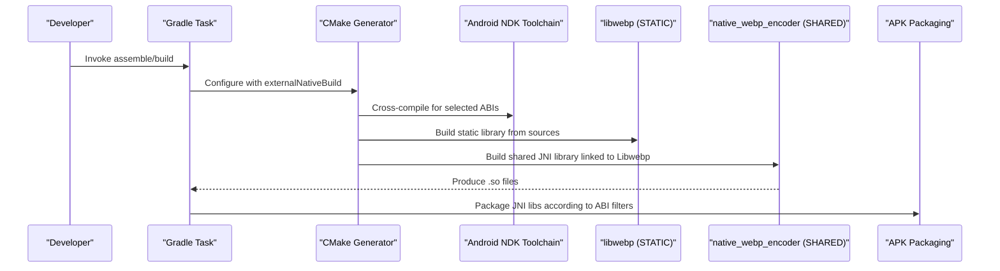
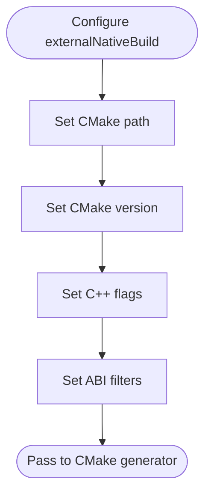
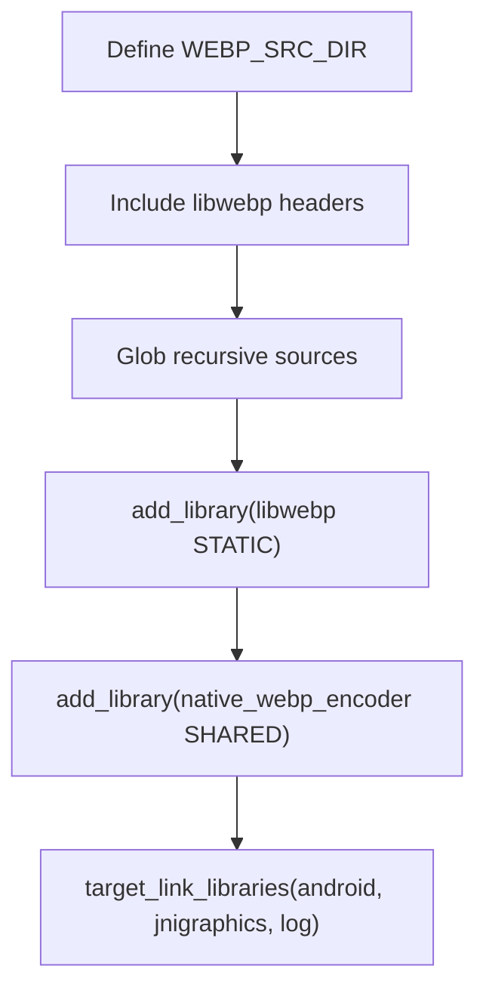
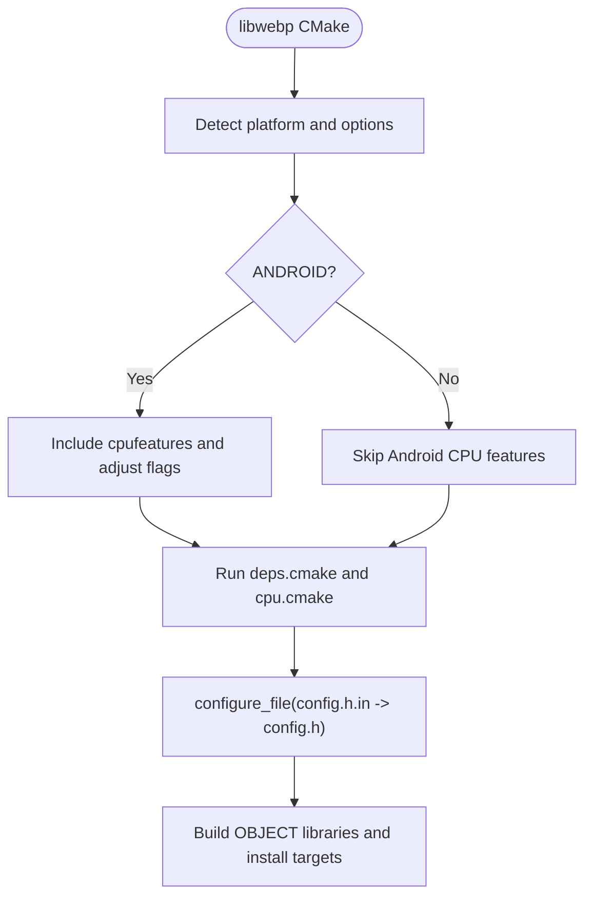
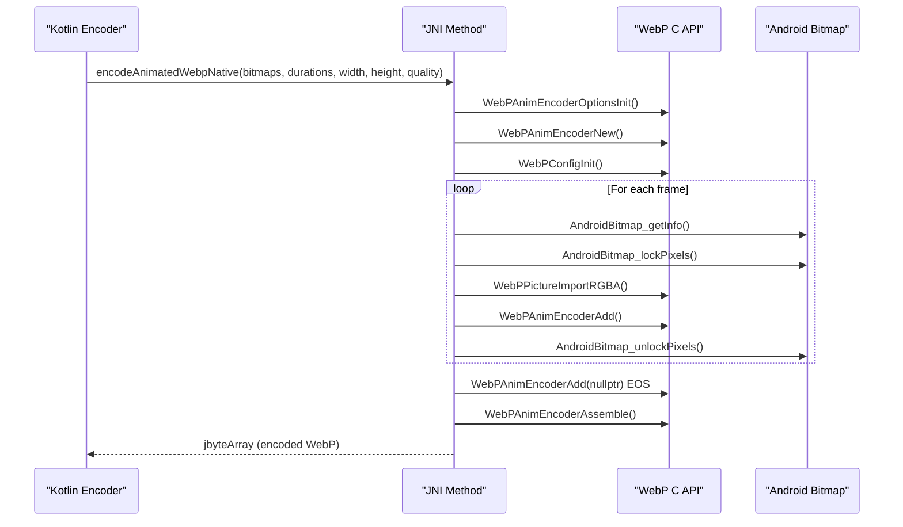
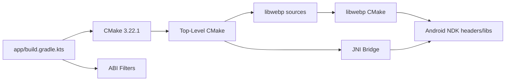

# Native Build System and CMake Configuration

<cite>
**Referenced Files in This Document**
- [app/build.gradle.kts](file://app/build.gradle.kts)
- [build.gradle.kts](file://build.gradle.kts)
- [settings.gradle.kts](file://settings.gradle.kts)
- [gradle.properties](file://gradle.properties)
- [gradle/libs.versions.toml](file://gradle/libs.versions.toml)
- [app/src/main/cpp/CMakeLists.txt](file://app/src/main/cpp/CMakeLists.txt)
- [app/src/main/cpp/libwebp/CMakeLists.txt](file://app/src/main/cpp/libwebp/CMakeLists.txt)
- [app/src/main/cpp/libwebp/cmake/WebPConfig.cmake.in](file://app/src/main/cpp/libwebp/cmake/WebPConfig.cmake.in)
- [app/src/main/cpp/libwebp/cmake/config.h.in](file://app/src/main/cpp/libwebp/cmake/config.h.in)
- [app/src/main/cpp/libwebp/cmake/deps.cmake](file://app/src/main/cpp/libwebp/cmake/deps.cmake)
- [app/src/main/cpp/libwebp/cmake/cpu.cmake](file://app/src/main/cpp/libwebp/cmake/cpu.cmake)
- [app/src/main/cpp/webp_native_bridge.cpp](file://app/src/main/cpp/webp_native_bridge.cpp)
</cite>

## Table of Contents
1. [Introduction](#introduction)
2. [Project Structure](#project-structure)
3. [Core Components](#core-components)
4. [Architecture Overview](#architecture-overview)
5. [Detailed Component Analysis](#detailed-component-analysis)
6. [Dependency Analysis](#dependency-analysis)
7. [Performance Considerations](#performance-considerations)
8. [Troubleshooting Guide](#troubleshooting-guide)
9. [Conclusion](#conclusion)
10. [Appendices](#appendices)

## Introduction
This document explains the native build system and CMake configuration used by Tel2What’s Android module. It focuses on how the project integrates a bundled copy of libwebp into the Android NDK build via CMake, manages dependencies, applies cross-compilation settings for Android architectures, and connects Gradle with CMake to produce native libraries packaged into the APK. It also covers ABI filtering, optimization flags, debugging configuration, symbol generation, native crash reporting setup, build optimization techniques, incremental compilation strategies, CI considerations, and common build issues.

## Project Structure
The native build is organized under app/src/main/cpp with:
- A top-level CMakeLists.txt that compiles a static libwebp and a JNI bridge shared library.
- A self-contained libwebp submodule under app/src/main/cpp/libwebp containing its own CMakeLists.txt and CMake support files.
- A JNI bridge implementation that exposes a Kotlin-facing function to encode animated WebP from Android Bitmap arrays.



**Diagram sources**
- [app/build.gradle.kts](file://app/build.gradle.kts#L60-L65)
- [app/src/main/cpp/CMakeLists.txt](file://app/src/main/cpp/CMakeLists.txt#L1-L44)
- [app/src/main/cpp/libwebp/CMakeLists.txt](file://app/src/main/cpp/libwebp/CMakeLists.txt#L1-L130)
- [app/src/main/cpp/webp_native_bridge.cpp](file://app/src/main/cpp/webp_native_bridge.cpp#L1-L20)

**Section sources**
- [app/build.gradle.kts](file://app/build.gradle.kts#L16-L81)
- [app/src/main/cpp/CMakeLists.txt](file://app/src/main/cpp/CMakeLists.txt#L1-L44)
- [app/src/main/cpp/libwebp/CMakeLists.txt](file://app/src/main/cpp/libwebp/CMakeLists.txt#L1-L130)

## Core Components
- Gradle configuration defines the Android NDK/CMake integration, ABI filtering, and externalNativeBuild settings.
- Top-level CMake compiles libwebp as a static library and links it into a JNI bridge shared library.
- libwebp’s CMake handles platform detection, SIMD feature detection, and Android-specific CPU feature handling.
- The JNI bridge implements the native entry point for animated WebP encoding using WebP APIs.

Key responsibilities:
- Gradle: orchestrates NDK/CMake, sets ABI filters, and controls packaging.
- Top-level CMake: aggregates libwebp sources and builds the JNI bridge.
- libwebp CMake: selects appropriate SIMD sources per target, configures headers, and installs artifacts.
- JNI bridge: consumes Android Bitmaps, configures WebP encoding, and returns encoded data.

**Section sources**
- [app/build.gradle.kts](file://app/build.gradle.kts#L32-L40)
- [app/src/main/cpp/CMakeLists.txt](file://app/src/main/cpp/CMakeLists.txt#L14-L43)
- [app/src/main/cpp/libwebp/CMakeLists.txt](file://app/src/main/cpp/libwebp/CMakeLists.txt#L200-L218)
- [app/src/main/cpp/webp_native_bridge.cpp](file://app/src/main/cpp/webp_native_bridge.cpp#L13-L20)

## Architecture Overview
The build pipeline ties Gradle, CMake, and the Android NDK together to produce native libraries consumed by the Android app.



**Diagram sources**
- [app/build.gradle.kts](file://app/build.gradle.kts#L32-L40)
- [app/build.gradle.kts](file://app/build.gradle.kts#L60-L65)
- [app/src/main/cpp/CMakeLists.txt](file://app/src/main/cpp/CMakeLists.txt#L26-L43)
- [app/src/main/cpp/libwebp/CMakeLists.txt](file://app/src/main/cpp/libwebp/CMakeLists.txt#L200-L218)

## Detailed Component Analysis

### Gradle Integration and CMake Configuration
- externalNativeBuild specifies the CMake path and version.
- defaultConfig.externalNativeBuild sets C++ standard and optimization flags.
- abiFilters restricts builds to modern ARM and ARM64 variants.
- packaging.jniLibs.useLegacyPackaging is disabled to align with modern packaging.



**Diagram sources**
- [app/build.gradle.kts](file://app/build.gradle.kts#L32-L40)
- [app/build.gradle.kts](file://app/build.gradle.kts#L60-L65)

**Section sources**
- [app/build.gradle.kts](file://app/build.gradle.kts#L32-L40)
- [app/build.gradle.kts](file://app/build.gradle.kts#L60-L65)

### Top-Level CMake: libwebp and JNI Bridge
- Sets WEBP_SRC_DIR and include directories pointing to the embedded libwebp source.
- Gathers dec, demux, dsp, enc, mux, utils, and sharpyuv sources.
- Builds libwebp as a static library.
- Builds the JNI bridge shared library and links against libwebp, android, jnigraphics, and log.



**Diagram sources**
- [app/src/main/cpp/CMakeLists.txt](file://app/src/main/cpp/CMakeLists.txt#L5-L43)

**Section sources**
- [app/src/main/cpp/CMakeLists.txt](file://app/src/main/cpp/CMakeLists.txt#L5-L43)

### libwebp CMake: Platform and SIMD Detection
- Enables/disables SIMD based on platform and options.
- Android-specific: includes Android CPU features and adjusts flags for armeabi-v7a NEON.
- Generates config.h via configure_file and sets version properties.
- Installs public headers and pkg-config files for downstream consumption.



**Diagram sources**
- [app/src/main/cpp/libwebp/CMakeLists.txt](file://app/src/main/cpp/libwebp/CMakeLists.txt#L200-L218)
- [app/src/main/cpp/libwebp/cmake/deps.cmake](file://app/src/main/cpp/libwebp/cmake/deps.cmake#L11-L140)
- [app/src/main/cpp/libwebp/cmake/cpu.cmake](file://app/src/main/cpp/libwebp/cmake/cpu.cmake#L91-L98)

**Section sources**
- [app/src/main/cpp/libwebp/CMakeLists.txt](file://app/src/main/cpp/libwebp/CMakeLists.txt#L200-L218)
- [app/src/main/cpp/libwebp/cmake/deps.cmake](file://app/src/main/cpp/libwebp/cmake/deps.cmake#L11-L140)
- [app/src/main/cpp/libwebp/cmake/cpu.cmake](file://app/src/main/cpp/libwebp/cmake/cpu.cmake#L91-L98)

### JNI Bridge: Animated WebP Encoding
- Exposes a single JNI method to encode an array of Android Bitmaps into an animated WebP byte array.
- Initializes WebPAnimEncoderOptions and WebPAnimEncoder.
- Configures WebPConfig for lossy encoding and a fast method.
- Iterates frames, locks Bitmap pixels, imports RGBA into WebPPicture, adds frames to the encoder, and assembles the final WebPData.



**Diagram sources**
- [app/src/main/cpp/webp_native_bridge.cpp](file://app/src/main/cpp/webp_native_bridge.cpp#L13-L147)

**Section sources**
- [app/src/main/cpp/webp_native_bridge.cpp](file://app/src/main/cpp/webp_native_bridge.cpp#L13-L147)

### CMake Support Files
- WebPConfig.cmake.in: Provides exported targets and required components for consumers.
- config.h.in: Template for generated config.h controlling feature macros.
- deps.cmake: Detects optional libraries, threads, and math library linkage.
- cpu.cmake: Detects SIMD capabilities and adjusts compile flags per platform and ABI.

```mermaid
classDiagram
class WebPConfig_cmake_in {
+WebP_VERSION
+WebP_INCLUDE_DIRS
+WebP_LIBRARIES
+check_required_components()
}
class config_h_in {
+HAVE_CPU_FEATURES_H
+WEBP_HAVE_NEON
+WEBP_HAVE_SSE2
+WEBP_USE_THREAD
+VERSION
}
class deps_cmake {
+find_package(Threads)
+find_package(Images)
+check_c_source_compiles(math)
}
class cpu_cmake {
+webp_check_compiler_flag()
+SIMD flags per arch
+Android ABI adjustments
}
WebPConfig_cmake_in -->|"includes"| WebPTargets_cmake["WebPTargets.cmake"]
config_h_in -->|"generated as"| GeneratedConfig_h["config.h"]
deps_cmake -->|"sets"| WEBP_DEP_LIBRARIES
cpu_cmake -->|"sets SIMD flags"| GeneratedConfig_h
```

**Diagram sources**
- [app/src/main/cpp/libwebp/cmake/WebPConfig.cmake.in](file://app/src/main/cpp/libwebp/cmake/WebPConfig.cmake.in#L1-L20)
- [app/src/main/cpp/libwebp/cmake/config.h.in](file://app/src/main/cpp/libwebp/cmake/config.h.in#L1-L112)
- [app/src/main/cpp/libwebp/cmake/deps.cmake](file://app/src/main/cpp/libwebp/cmake/deps.cmake#L38-L94)
- [app/src/main/cpp/libwebp/cmake/cpu.cmake](file://app/src/main/cpp/libwebp/cmake/cpu.cmake#L12-L63)

**Section sources**
- [app/src/main/cpp/libwebp/cmake/WebPConfig.cmake.in](file://app/src/main/cpp/libwebp/cmake/WebPConfig.cmake.in#L1-L20)
- [app/src/main/cpp/libwebp/cmake/config.h.in](file://app/src/main/cpp/libwebp/cmake/config.h.in#L1-L112)
- [app/src/main/cpp/libwebp/cmake/deps.cmake](file://app/src/main/cpp/libwebp/cmake/deps.cmake#L38-L94)
- [app/src/main/cpp/libwebp/cmake/cpu.cmake](file://app/src/main/cpp/libwebp/cmake/cpu.cmake#L12-L63)

## Dependency Analysis
- Gradle depends on a specific CMake version and delegates native build to CMake.
- Top-level CMake depends on libwebp sources and Android NDK-provided headers and libraries.
- libwebp CMake depends on platform detection, SIMD capability checks, and optional system libraries.
- JNI bridge depends on libwebp public headers and Android logging/JNI APIs.



**Diagram sources**
- [app/build.gradle.kts](file://app/build.gradle.kts#L60-L65)
- [app/src/main/cpp/CMakeLists.txt](file://app/src/main/cpp/CMakeLists.txt#L5-L43)
- [app/src/main/cpp/libwebp/CMakeLists.txt](file://app/src/main/cpp/libwebp/CMakeLists.txt#L200-L218)

**Section sources**
- [app/build.gradle.kts](file://app/build.gradle.kts#L60-L65)
- [app/src/main/cpp/CMakeLists.txt](file://app/src/main/cpp/CMakeLists.txt#L5-L43)
- [app/src/main/cpp/libwebp/CMakeLists.txt](file://app/src/main/cpp/libwebp/CMakeLists.txt#L200-L218)

## Performance Considerations
- ABI filtering reduces APK size and improves performance by targeting modern ARM and ARM64 variants.
- libwebp SIMD detection is handled automatically; Android-specific NEON adjustments are applied for armeabi-v7a.
- Optimization flags are set at the Gradle level for C++ code; libwebp’s CMake controls its own build flags and version properties.
- Incremental builds benefit from CMake’s object-library pattern and modular targets.

Recommendations:
- Keep ABI filters aligned with device coverage goals.
- Monitor SIMD inclusion to balance performance and compatibility.
- Use RelWithDebInfo for development builds to include symbols for profiling.

**Section sources**
- [app/build.gradle.kts](file://app/build.gradle.kts#L35-L38)
- [app/src/main/cpp/libwebp/cmake/cpu.cmake](file://app/src/main/cpp/libwebp/cmake/cpu.cmake#L91-L98)
- [app/src/main/cpp/CMakeLists.txt](file://app/src/main/cpp/CMakeLists.txt#L26-L43)

## Troubleshooting Guide
Common issues and resolutions:
- Missing CMake version: Ensure the configured CMake version matches the project’s minimum required version.
- ABI mismatch: Verify abiFilters match the intended devices; incorrect filters prevent proper packaging.
- Missing Android NDK headers/libs: Confirm the Android NDK installation and toolchain are correctly configured.
- SIMD-related failures: If NEON/SIMD flags cause issues, disable SIMD in libwebp options or adjust toolchain flags.
- JNI linkage errors: Ensure jnigraphics and log are linked and that public headers are available.
- Packaging issues: With useLegacyPackaging disabled, confirm ABI-specific .so files are present in the APK.

**Section sources**
- [app/build.gradle.kts](file://app/build.gradle.kts#L60-L65)
- [app/src/main/cpp/CMakeLists.txt](file://app/src/main/cpp/CMakeLists.txt#L36-L43)
- [app/src/main/cpp/libwebp/cmake/cpu.cmake](file://app/src/main/cpp/libwebp/cmake/cpu.cmake#L110-L187)

## Conclusion
Tel2What integrates a bundled libwebp into the Android build via a two-tier CMake setup: a top-level CMake that compiles libwebp and a JNI bridge, and libwebp’s own CMake that detects platform capabilities and configures features. Gradle coordinates ABI filtering, CMake versioning, and packaging. The JNI bridge enables efficient animated WebP encoding from Android Bitmaps. With careful ABI selection, SIMD tuning, and symbol configuration, the build remains maintainable and performant across Android architectures.

## Appendices

### Android ABI Filtering and Optimization Flags
- ABI filters: arm64-v8a, armeabi-v7a.
- C++ flags: C++17 with aggressive optimization.
- Packaging: modern packaging without legacy behavior.

**Section sources**
- [app/build.gradle.kts](file://app/build.gradle.kts#L35-L38)
- [app/build.gradle.kts](file://app/build.gradle.kts#L34)
- [app/build.gradle.kts](file://app/build.gradle.kts#L76-L80)

### Debugging Configuration and Symbol Generation
- Logging: Android logcat entries prefixed with a dedicated tag.
- Symbols: Use RelWithDebInfo or Debug builds to include symbols for native debugging.
- Crash reporting: Integrate a native crash reporter to capture stack traces from the JNI bridge.

**Section sources**
- [app/src/main/cpp/webp_native_bridge.cpp](file://app/src/main/cpp/webp_native_bridge.cpp#L9-L12)

### Continuous Integration Setup for Native Components
- Pin CMake and Android NDK versions in CI.
- Cache CMake and NDK downloads.
- Run Gradle with parallel and configuration cache disabled for reproducibility.
- Archive native artifacts per ABI for testing.

**Section sources**
- [gradle.properties](file://gradle.properties#L4)
- [gradle.properties](file://gradle.properties#L10)
- [app/build.gradle.kts](file://app/build.gradle.kts#L60-L65)