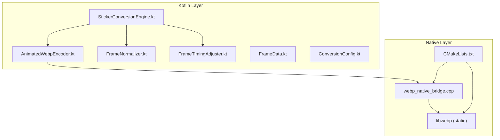
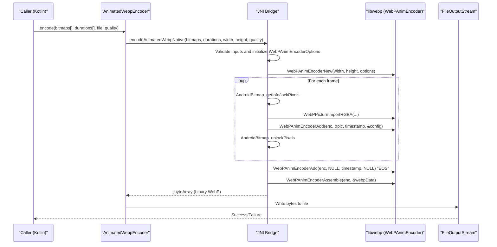
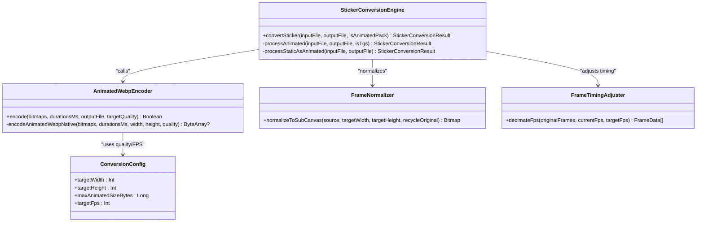
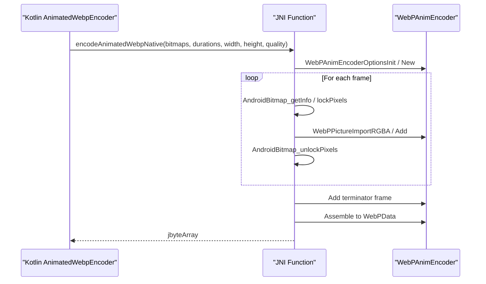
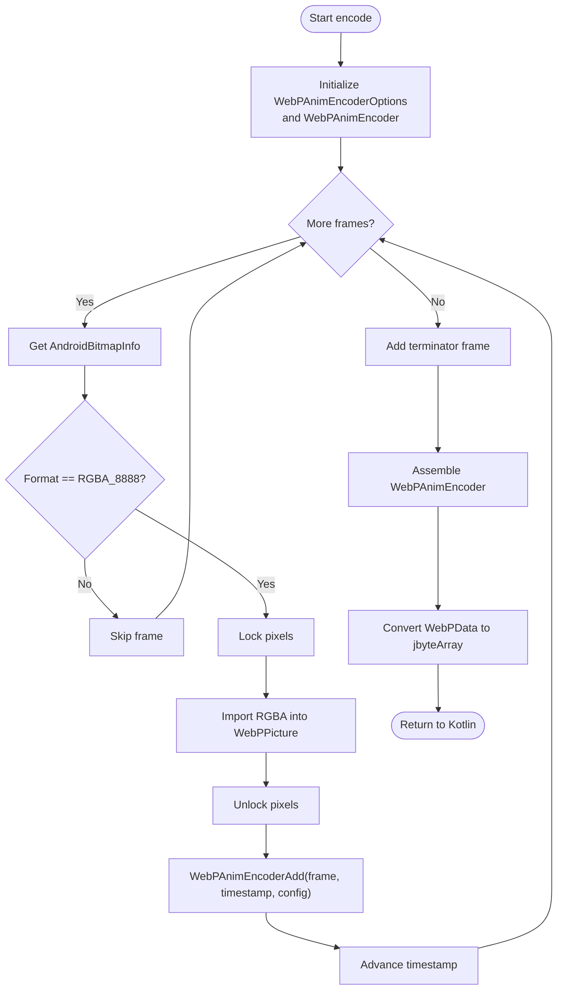
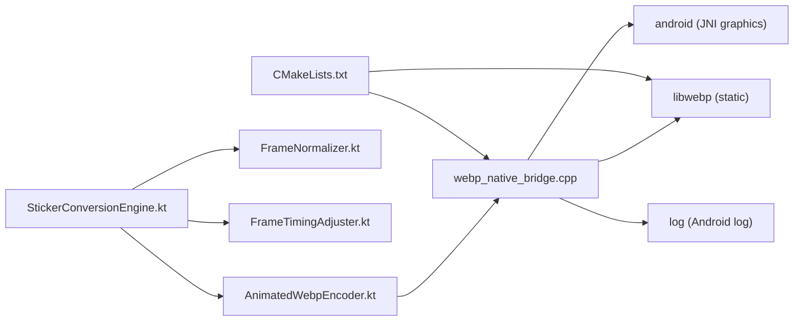

# Native WebP Encoding Engine

<cite>
**Referenced Files in This Document**
- [AnimatedWebpEncoder.kt](file://app/src/main/java/com/maheshsharan/tel2what/engine/encoder/AnimatedWebpEncoder.kt)
- [webp_native_bridge.cpp](file://app/src/main/cpp/webp_native_bridge.cpp)
- [CMakeLists.txt](file://app/src/main/cpp/CMakeLists.txt)
- [StickerConversionEngine.kt](file://app/src/main/java/com/maheshsharan/tel2what/engine/StickerConversionEngine.kt)
- [ConversionConfig.kt](file://app/src/main/java/com/maheshsharan/tel2what/engine/ConversionConfig.kt)
- [FrameNormalizer.kt](file://app/src/main/java/com/maheshsharan/tel2what/engine/frame/FrameNormalizer.kt)
- [FrameTimingAdjuster.kt](file://app/src/main/java/com/maheshsharan/tel2what/engine/frame/FrameTimingAdjuster.kt)
- [FrameData.kt](file://app/src/main/java/com/maheshsharan/tel2what/engine/frame/FrameData.kt)
- [app/build.gradle.kts](file://app/build.gradle.kts)
- [build.gradle.kts](file://build.gradle.kts)
</cite>

## Table of Contents
1. [Introduction](#introduction)
2. [Project Structure](#project-structure)
3. [Core Components](#core-components)
4. [Architecture Overview](#architecture-overview)
5. [Detailed Component Analysis](#detailed-component-analysis)
6. [Dependency Analysis](#dependency-analysis)
7. [Performance Considerations](#performance-considerations)
8. [Troubleshooting Guide](#troubleshooting-guide)
9. [Conclusion](#conclusion)
10. [Appendices](#appendices)

## Introduction
This document explains Tel2What’s native WebP animation encoding implementation. It covers the JNI bridge that connects Kotlin to C++, the AnimatedWebpEncoder class and its native method signatures, the frame-by-frame encoding pipeline, configuration of quality and compression parameters, memory management, error handling, logging, performance characteristics, and debugging strategies for JNI-related issues.

## Project Structure
The WebP encoding pipeline spans Kotlin orchestration and a native C++ bridge backed by libwebp. Key elements:
- Kotlin encoder interface and orchestrator
- JNI bridge implementation
- libwebp integration via a bundled static library
- Frame normalization and timing adjustment utilities
- Build configuration for native compilation and ABI targeting

**Diagram sources**
- [AnimatedWebpEncoder.kt](file://app/src/main/java/com/maheshsharan/tel2what/engine/encoder/AnimatedWebpEncoder.kt#L1-L91)
- [webp_native_bridge.cpp](file://app/src/main/cpp/webp_native_bridge.cpp#L1-L148)
- [CMakeLists.txt](file://app/src/main/cpp/CMakeLists.txt#L1-L44)
- [StickerConversionEngine.kt](file://app/src/main/java/com/maheshsharan/tel2what/engine/StickerConversionEngine.kt#L1-L275)
- [FrameNormalizer.kt](file://app/src/main/java/com/maheshsharan/tel2what/engine/frame/FrameNormalizer.kt#L1-L62)
- [FrameTimingAdjuster.kt](file://app/src/main/java/com/maheshsharan/tel2what/engine/frame/FrameTimingAdjuster.kt#L1-L72)
- [FrameData.kt](file://app/src/main/java/com/maheshsharan/tel2what/engine/frame/FrameData.kt#L1-L9)

**Section sources**
- [AnimatedWebpEncoder.kt](file://app/src/main/java/com/maheshsharan/tel2what/engine/encoder/AnimatedWebpEncoder.kt#L1-L91)
- [webp_native_bridge.cpp](file://app/src/main/cpp/webp_native_bridge.cpp#L1-L148)
- [CMakeLists.txt](file://app/src/main/cpp/CMakeLists.txt#L1-L44)
- [StickerConversionEngine.kt](file://app/src/main/java/com/maheshsharan/tel2what/engine/StickerConversionEngine.kt#L1-L275)
- [FrameNormalizer.kt](file://app/src/main/java/com/maheshsharan/tel2what/engine/frame/FrameNormalizer.kt#L1-L62)
- [FrameTimingAdjuster.kt](file://app/src/main/java/com/maheshsharan/tel2what/engine/frame/FrameTimingAdjuster.kt#L1-L72)
- [FrameData.kt](file://app/src/main/java/com/maheshsharan/tel2what/engine/frame/FrameData.kt#L1-L9)

## Core Components
- AnimatedWebpEncoder: Kotlin facade that loads the native library and exposes a single encode method. It validates inputs, prepares arrays for JNI, and writes the resulting byte array to disk.
- webp_native_bridge.cpp: JNI entry point that receives arrays of Bitmaps and durations, configures libwebp, extracts RGBA_8888 pixel data, builds an animated WebP, and returns the binary payload.
- StickerConversionEngine: Orchestrates the entire pipeline, including decoding, normalization, timing adjustment, and iterative compression loops to meet size targets.
- FrameNormalizer: Ensures frames are scaled and letterboxed to 512x512 with transparent padding.
- FrameTimingAdjuster: Reduces FPS by decimation and aggregates durations to preserve total animation time.
- ConversionConfig: Defines size limits, FPS targets, and duration bounds.

**Section sources**
- [AnimatedWebpEncoder.kt](file://app/src/main/java/com/maheshsharan/tel2what/engine/encoder/AnimatedWebpEncoder.kt#L1-L91)
- [webp_native_bridge.cpp](file://app/src/main/cpp/webp_native_bridge.cpp#L1-L148)
- [StickerConversionEngine.kt](file://app/src/main/java/com/maheshsharan/tel2what/engine/StickerConversionEngine.kt#L1-L275)
- [FrameNormalizer.kt](file://app/src/main/java/com/maheshsharan/tel2what/engine/frame/FrameNormalizer.kt#L1-L62)
- [FrameTimingAdjuster.kt](file://app/src/main/java/com/maheshsharan/tel2what/engine/frame/FrameTimingAdjuster.kt#L1-L72)
- [ConversionConfig.kt](file://app/src/main/java/com/maheshsharan/tel2what/engine/ConversionConfig.kt#L1-L14)

## Architecture Overview
The system integrates Kotlin and C++ through JNI. The Kotlin layer validates inputs and prepares arrays; the native layer performs pixel extraction, configuration, and encoding using libwebp’s WebPAnimEncoder.

**Diagram sources**
- [AnimatedWebpEncoder.kt](file://app/src/main/java/com/maheshsharan/tel2what/engine/encoder/AnimatedWebpEncoder.kt#L32-L78)
- [webp_native_bridge.cpp](file://app/src/main/cpp/webp_native_bridge.cpp#L14-L147)

## Detailed Component Analysis

### AnimatedWebpEncoder (Kotlin)
Responsibilities:
- Load the native library on demand.
- Validate frame arrays and durations length.
- Call the native JNI method with prepared parameters.
- Write the returned byte array to the specified output file.
- Log successes and failures.

Key behaviors:
- Validates non-empty arrays and equal lengths.
- Uses a default quality of 90 unless overridden.
- Handles null or empty results from JNI by logging and returning false.
- Deletes existing output file before writing.

**Section sources**
- [AnimatedWebpEncoder.kt](file://app/src/main/java/com/maheshsharan/tel2what/engine/encoder/AnimatedWebpEncoder.kt#L1-L91)

### JNI Bridge (webp_native_bridge.cpp)
Responsibilities:
- Receive arrays of Bitmaps and durations.
- Configure WebPAnimEncoderOptions and WebPConfig.
- Iterate frames, lock AndroidBitmap pixels, import RGBA_8888 into WebPPicture, and add frames to the encoder.
- Assemble the animation and return a jbyteArray.
- Manage memory for WebPData and clean up JNI resources.

Encoding configuration:
- Loop count set to infinite (WhatsApp requirement).
- Lossy compression enabled with quality and method parameters.
- Timestamp accumulation ensures correct timing across frames.
- Final terminator frame added to signal end-of-sequence.

Pixel handling:
- Requires RGBA_8888 format.
- Uses AndroidBitmap APIs to retrieve info and lock/unlock pixels.
- Imports directly from pixel memory into WebPPicture.

Error handling:
- Logs initialization and operation failures.
- Releases JNI resources (array elements, local refs).
- Frees WebP structures and returns null on failure.

**Section sources**
- [webp_native_bridge.cpp](file://app/src/main/cpp/webp_native_bridge.cpp#L14-L147)

### StickerConversionEngine (Orchestrator)
Responsibilities:
- Route input to appropriate pipeline (animated, static-as-animated, or static).
- Normalize frames to 512x512 and adjust timing to meet FPS and duration constraints.
- Iteratively reduce quality and FPS until the animated WebP fits under the 500 KB limit.
- Validate output against WhatsApp constraints and emit metrics.

Concurrency:
- Limits animated processing to a single concurrent permit to avoid thermal throttling and OOM.
- Allows up to four static conversions concurrently.

Metrics:
- Tracks initial and final frame counts, durations, quality, FPS, file size, and encoding time.

**Section sources**
- [StickerConversionEngine.kt](file://app/src/main/java/com/maheshsharan/tel2what/engine/StickerConversionEngine.kt#L1-L275)

### Frame Normalization and Timing Adjustment
- FrameNormalizer scales frames to fit within 512x512 while preserving aspect ratio and fills borders with transparent pixels.
- FrameTimingAdjuster reduces FPS by decimation, aggregating durations to maintain total animation time and enforcing minimum and maximum constraints.

**Section sources**
- [FrameNormalizer.kt](file://app/src/main/java/com/maheshsharan/tel2what/engine/frame/FrameNormalizer.kt#L1-L62)
- [FrameTimingAdjuster.kt](file://app/src/main/java/com/maheshsharan/tel2what/engine/frame/FrameTimingAdjuster.kt#L1-L72)
- [FrameData.kt](file://app/src/main/java/com/maheshsharan/tel2what/engine/frame/FrameData.kt#L1-L9)

### Build Configuration and Dependencies
- The native module compiles a static libwebp library and links it with a shared JNI bridge library.
- Targets arm64-v8a and armeabi-v7a ABIs with optimized C++ flags.
- Links against android, jnigraphics, and log system libraries.

**Section sources**
- [CMakeLists.txt](file://app/src/main/cpp/CMakeLists.txt#L1-L44)
- [app/build.gradle.kts](file://app/build.gradle.kts#L32-L42)
- [build.gradle.kts](file://build.gradle.kts#L1-L5)

## Architecture Overview

**Diagram sources**
- [AnimatedWebpEncoder.kt](file://app/src/main/java/com/maheshsharan/tel2what/engine/encoder/AnimatedWebpEncoder.kt#L1-L91)
- [StickerConversionEngine.kt](file://app/src/main/java/com/maheshsharan/tel2what/engine/StickerConversionEngine.kt#L1-L275)
- [FrameNormalizer.kt](file://app/src/main/java/com/maheshsharan/tel2what/engine/frame/FrameNormalizer.kt#L1-L62)
- [FrameTimingAdjuster.kt](file://app/src/main/java/com/maheshsharan/tel2what/engine/frame/FrameTimingAdjuster.kt#L1-L72)
- [ConversionConfig.kt](file://app/src/main/java/com/maheshsharan/tel2what/engine/ConversionConfig.kt#L1-L14)

## Detailed Component Analysis

### JNI Method Signature and Contract
The Kotlin external declaration maps to a C++ JNI function exported with a specific signature. The method accepts:
- An array of Bitmaps
- An array of frame durations in milliseconds
- Width and height of frames
- Target quality parameter

It returns a ByteArray containing the encoded WebP data.

**Diagram sources**
- [AnimatedWebpEncoder.kt](file://app/src/main/java/com/maheshsharan/tel2what/engine/encoder/AnimatedWebpEncoder.kt#L83-L89)
- [webp_native_bridge.cpp](file://app/src/main/cpp/webp_native_bridge.cpp#L14-L147)

**Section sources**
- [AnimatedWebpEncoder.kt](file://app/src/main/java/com/maheshsharan/tel2what/engine/encoder/AnimatedWebpEncoder.kt#L83-L89)
- [webp_native_bridge.cpp](file://app/src/main/cpp/webp_native_bridge.cpp#L14-L147)

### Frame-by-Frame Encoding Flow
- Initialization: Options and encoder are created with loop count set to infinite.
- Per-frame processing:
  - Retrieve bitmap info and verify RGBA_8888 format.
  - Lock pixels, import RGBA into WebPPicture, unlock pixels.
  - Add frame to encoder with accumulated timestamp and config.
- Termination: Add a null frame to signal end-of-sequence.
- Assembly: Produce final WebPData and convert to jbyteArray.

**Diagram sources**
- [webp_native_bridge.cpp](file://app/src/main/cpp/webp_native_bridge.cpp#L28-L147)

**Section sources**
- [webp_native_bridge.cpp](file://app/src/main/cpp/webp_native_bridge.cpp#L28-L147)

### Encoding Configuration and Compression Parameters
- Quality: Passed from Kotlin, controlling lossy compression trade-off.
- Lossless flag: Disabled to enable lossy compression.
- Method: Balanced toward faster encoding with acceptable quality.
- Loop count: Infinite for animated sticker compatibility.
- Timing: Accumulated timestamps ensure correct playback duration.

**Section sources**
- [webp_native_bridge.cpp](file://app/src/main/cpp/webp_native_bridge.cpp#L45-L58)
- [AnimatedWebpEncoder.kt](file://app/src/main/java/com/maheshsharan/tel2what/engine/encoder/AnimatedWebpEncoder.kt#L32-L37)

### Memory Management Strategies
- JNI resource cleanup:
  - Release integer array elements and delete local references.
  - Free WebPData and WebPAnimEncoder instances.
- Bitmap lifecycle:
  - Frames are recycled by the orchestrator after JNI completes.
  - Normalizer recycles intermediate bitmaps to reduce fragmentation.
- Native memory:
  - WebP structures are freed explicitly; ensure no leaks by following the cleanup path.

**Section sources**
- [webp_native_bridge.cpp](file://app/src/main/cpp/webp_native_bridge.cpp#L141-L147)
- [StickerConversionEngine.kt](file://app/src/main/java/com/maheshsharan/tel2what/engine/StickerConversionEngine.kt#L238-L242)
- [FrameNormalizer.kt](file://app/src/main/java/com/maheshsharan/tel2what/engine/frame/FrameNormalizer.kt#L52-L57)

### Error Handling Patterns and Logging
- Initialization failures: Early return with null and logs.
- Frame-level failures: Continue with next frame; log error codes.
- IO failures: Catch exceptions during file write and log errors.
- Logging: Uses Android log macros in native code and Kotlin logging in encoder.

**Section sources**
- [webp_native_bridge.cpp](file://app/src/main/cpp/webp_native_bridge.cpp#L29-L43)
- [webp_native_bridge.cpp](file://app/src/main/cpp/webp_native_bridge.cpp#L69-L108)
- [AnimatedWebpEncoder.kt](file://app/src/main/java/com/maheshsharan/tel2what/engine/encoder/AnimatedWebpEncoder.kt#L60-L77)

## Dependency Analysis

**Diagram sources**
- [AnimatedWebpEncoder.kt](file://app/src/main/java/com/maheshsharan/tel2what/engine/encoder/AnimatedWebpEncoder.kt#L1-L91)
- [webp_native_bridge.cpp](file://app/src/main/cpp/webp_native_bridge.cpp#L1-L148)
- [CMakeLists.txt](file://app/src/main/cpp/CMakeLists.txt#L26-L43)
- [StickerConversionEngine.kt](file://app/src/main/java/com/maheshsharan/tel2what/engine/StickerConversionEngine.kt#L1-L275)

**Section sources**
- [CMakeLists.txt](file://app/src/main/cpp/CMakeLists.txt#L1-L44)
- [AnimatedWebpEncoder.kt](file://app/src/main/java/com/maheshsharan/tel2what/engine/encoder/AnimatedWebpEncoder.kt#L1-L91)
- [webp_native_bridge.cpp](file://app/src/main/cpp/webp_native_bridge.cpp#L1-L148)
- [StickerConversionEngine.kt](file://app/src/main/java/com/maheshsharan/tel2what/engine/StickerConversionEngine.kt#L1-L275)

## Performance Considerations
- Encoding speed:
  - Lower WebP method and reduced quality accelerate encoding.
  - Target FPS is lowered iteratively to meet size constraints.
- Size optimization:
  - Iterative quality reduction and FPS decimation ensure output stays under 500 KB.
  - Maintains global duration by aggregating skipped frame durations.
- Memory pressure:
  - Single concurrent animated encoder prevents thermal throttling and OOM.
  - Heavy bitmaps are recycled promptly after JNI completion.

[No sources needed since this section provides general guidance]

## Troubleshooting Guide
Common issues and remedies:
- JNI UnsatisfiedLinkError: Ensure the native library is packaged for the correct ABI and loaded before use.
- Null or empty return from JNI: Verify inputs (non-empty arrays, matching sizes) and RGBA_8888 format.
- Frame format errors: Confirm all frames are RGBA_8888; otherwise, skip or convert them.
- Out-of-memory conditions: Reduce quality and FPS; ensure bitmaps are recycled; monitor native memory usage.
- IO write failures: Check file permissions and available storage.

Debugging JNI boundary issues:
- Enable verbose logging around JNI calls and WebP operations.
- Validate array lengths and indices before JNI entry.
- Use Android Studio’s native debugging to inspect stack traces and memory.

**Section sources**
- [AnimatedWebpEncoder.kt](file://app/src/main/java/com/maheshsharan/tel2what/engine/encoder/AnimatedWebpEncoder.kt#L13-L20)
- [webp_native_bridge.cpp](file://app/src/main/cpp/webp_native_bridge.cpp#L69-L108)
- [StickerConversionEngine.kt](file://app/src/main/java/com/maheshsharan/tel2what/engine/StickerConversionEngine.kt#L238-L242)

## Conclusion
The native WebP encoding engine combines Kotlin orchestration with a tightly integrated JNI bridge and libwebp to produce animated stickers efficiently. By normalizing frames, adjusting timing, and iteratively optimizing quality and FPS, the system reliably meets strict size and duration constraints while maintaining performance and stability.

[No sources needed since this section summarizes without analyzing specific files]

## Appendices

### API Reference: AnimatedWebpEncoder.encode
- Inputs:
  - bitmaps: Array of ARGB_8888 Bitmaps (512x512 recommended)
  - durationsMs: Presentation duration per frame in milliseconds
  - outputFile: Destination file for the WebP
  - targetQuality: Lossy quality factor (default 90)
- Returns: Boolean indicating success or failure

Behavior:
- Validates inputs and calls the native method.
- Writes the resulting byte array to the output file.

**Section sources**
- [AnimatedWebpEncoder.kt](file://app/src/main/java/com/maheshsharan/tel2what/engine/encoder/AnimatedWebpEncoder.kt#L32-L78)

### Build Targets and Flags
- ABIs: arm64-v8a, armeabi-v7a
- Compiler flags: C++17, O3
- Libraries linked: libwebp, android, jnigraphics, log

**Section sources**
- [app/build.gradle.kts](file://app/build.gradle.kts#L32-L42)
- [CMakeLists.txt](file://app/src/main/cpp/CMakeLists.txt#L36-L43)