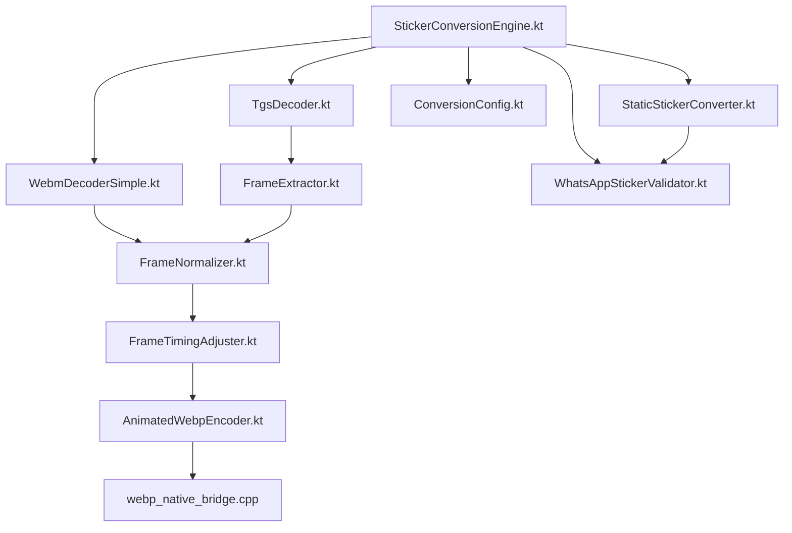
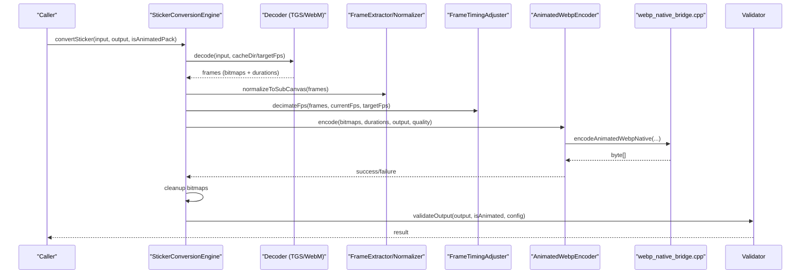
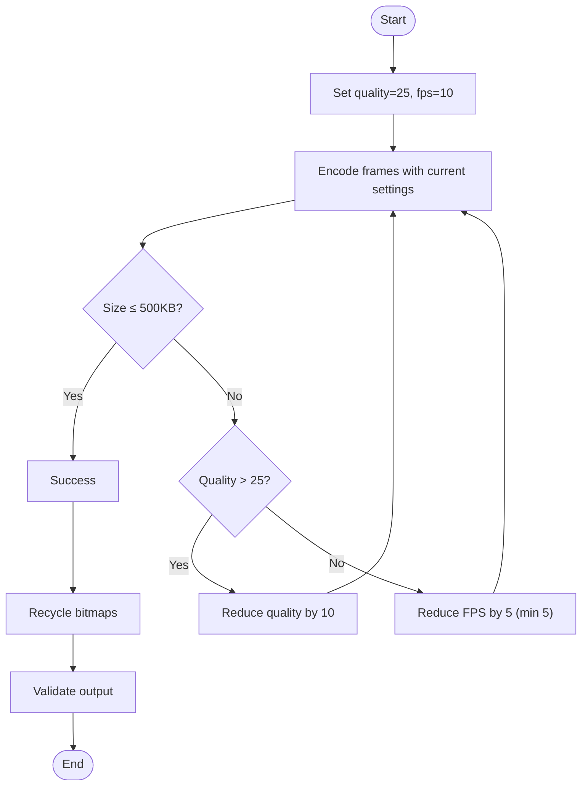
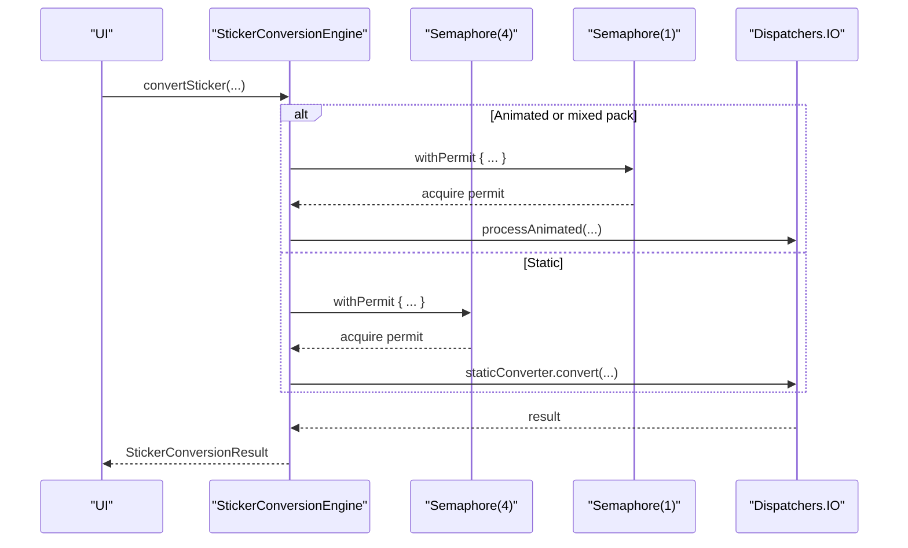
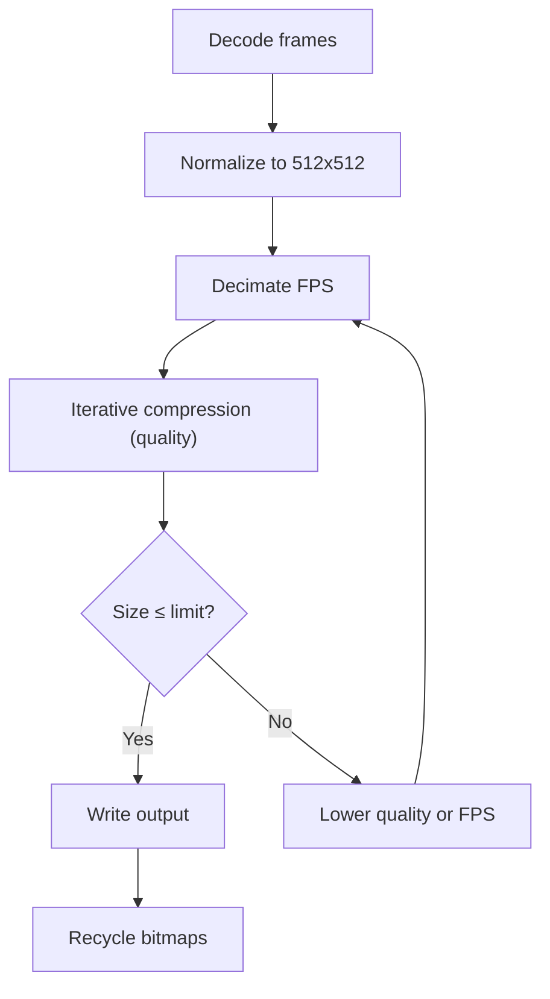
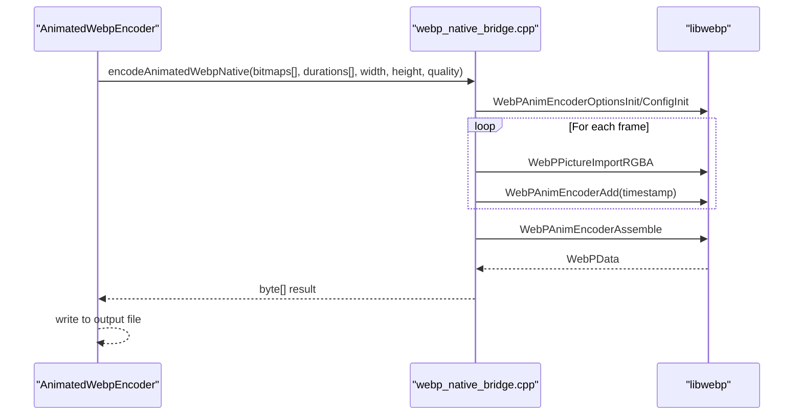
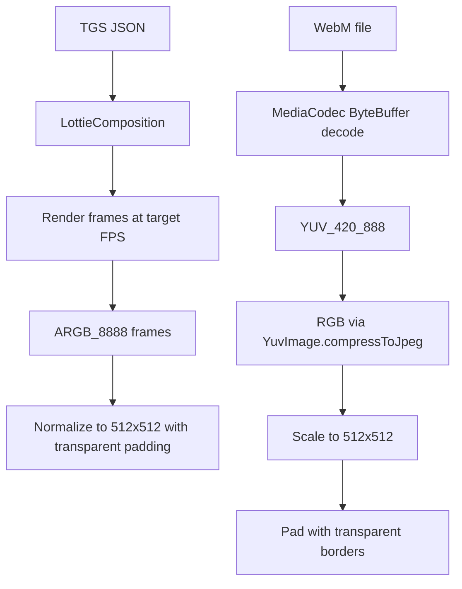
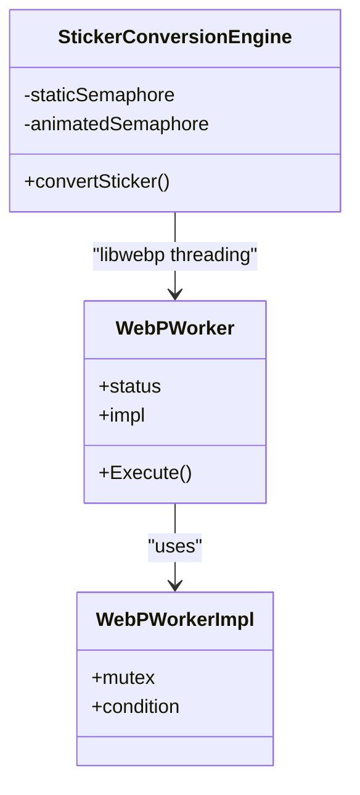
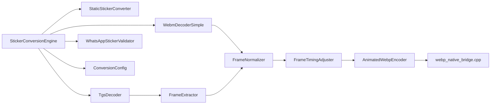

# Performance Optimization and Memory Management

<cite>
**Referenced Files in This Document**
- [StickerConversionEngine.kt](file://app/src/main/java/com/maheshsharan/tel2what/engine/StickerConversionEngine.kt)
- [StaticStickerConverter.kt](file://app/src/main/java/com/maheshsharan/tel2what/engine/StaticStickerConverter.kt)
- [AnimatedWebpEncoder.kt](file://app/src/main/java/com/maheshsharan/tel2what/engine/encoder/AnimatedWebpEncoder.kt)
- [webp_native_bridge.cpp](file://app/src/main/cpp/webp_native_bridge.cpp)
- [FrameExtractor.kt](file://app/src/main/java/com/maheshsharan/tel2what/engine/decoder/FrameExtractor.kt)
- [TgsDecoder.kt](file://app/src/main/java/com/maheshsharan/tel2what/engine/decoder/TgsDecoder.kt)
- [WebmDecoderSimple.kt](file://app/src/main/java/com/maheshsharan/tel2what/engine/decoder/WebmDecoderSimple.kt)
- [FrameNormalizer.kt](file://app/src/main/java/com/maheshsharan/tel2what/engine/frame/FrameNormalizer.kt)
- [FrameTimingAdjuster.kt](file://app/src/main/java/com/maheshsharan/tel2what/engine/frame/FrameTimingAdjuster.kt)
- [ConversionConfig.kt](file://app/src/main/java/com/maheshsharan/tel2what/engine/ConversionConfig.kt)
- [WhatsAppStickerValidator.kt](file://app/src/main/java/com/maheshsharan/tel2what/engine/WhatsAppStickerValidator.kt)
- [Tel2WhatApplication.kt](file://app/src/main/java/com/maheshsharan/tel2what/Tel2WhatApplication.kt)
- [animated_pipe.md](file://assets/docs/animated_pipe.md)
- [thread_utils.c](file://app/src/main/cpp/libwebp/src/utils/thread_utils.c)
- [thread_utils.h](file://app/src/main/cpp/libwebp/src/utils/thread_utils.h)
- [vp8l_dec.c](file://app/src/main/cpp/libwebp/src/dec/vp8l_dec.c)
- [vp8_dec.c](file://app/src/main/cpp/libwebp/src/dec/vp8_dec.c)
- [idec_dec.c](file://app/src/main/cpp/libwebp/src/dec/idec_dec.c)
- [backward_references_enc.c](file://app/src/main/cpp/libwebp/src/enc/backward_references_enc.c)
- [histogram_enc.c](file://app/src/main/cpp/libwebp/src/enc/histogram_enc.c)
- [backward_references_cost_enc.c](file://app/src/main/cpp/libwebp/src/enc/backward_references_cost_enc.c)
- [huffman_encode_utils.c](file://app/src/main/cpp/libwebp/src/utils/huffman_encode_utils.c)
- [utils.c](file://app/src/main/cpp/libwebp/src/utils/utils.c)
- [nalloc.h](file://app/src/main/cpp/libwebp/tests/fuzzer/nalloc.h)
- [stopwatch.h](file://app/src/main/cpp/libwebp/examples/stopwatch.h)
</cite>

## Table of Contents
1. [Introduction](#introduction)
2. [Project Structure](#project-structure)
3. [Core Components](#core-components)
4. [Architecture Overview](#architecture-overview)
5. [Detailed Component Analysis](#detailed-component-analysis)
6. [Dependency Analysis](#dependency-analysis)
7. [Performance Considerations](#performance-considerations)
8. [Troubleshooting Guide](#troubleshooting-guide)
9. [Conclusion](#conclusion)
10. [Appendices](#appendices)

## Introduction
This document details Tel2What’s performance optimization and memory management systems for converting Telegram stickers (TGS and WebM) into WhatsApp-compatible animated WebP format. It explains the adaptive compression strategy balancing quality and file size within the 500 KB limit, the memory-efficient processing pipeline preventing OutOfMemory errors during batch conversions, the concurrent processing architecture using coroutines and background threads, frame caching and bitmap reuse patterns, garbage collection optimization, performance monitoring and profiling, device-specific tuning, and production debugging techniques for memory leaks and performance bottlenecks.

## Project Structure
The conversion system is organized around a Kotlin orchestration layer, native WebP encoding via JNI, and specialized decoders for TGS and WebM. Key modules include:
- Orchestration and routing: StickerConversionEngine
- Static conversion: StaticStickerConverter
- Animated conversion: Frame extraction, normalization, timing adjustment, and native WebP encoding
- Native bridge: webp_native_bridge.cpp
- Configuration and validation: ConversionConfig, WhatsAppStickerValidator
- Threading and concurrency: Kotlin coroutines with semaphores and libwebp threading utilities
- Performance monitoring: StrictMode and logging

**Diagram sources**
- [StickerConversionEngine.kt](file://app/src/main/java/com/maheshsharan/tel2what/engine/StickerConversionEngine.kt#L17-L88)
- [StaticStickerConverter.kt](file://app/src/main/java/com/maheshsharan/tel2what/engine/StaticStickerConverter.kt#L15-L94)
- [TgsDecoder.kt](file://app/src/main/java/com/maheshsharan/tel2what/engine/decoder/TgsDecoder.kt#L17-L94)
- [WebmDecoderSimple.kt](file://app/src/main/java/com/maheshsharan/tel2what/engine/decoder/WebmDecoderSimple.kt#L20-L256)
- [FrameExtractor.kt](file://app/src/main/java/com/maheshsharan/tel2what/engine/decoder/FrameExtractor.kt#L16-L100)
- [FrameNormalizer.kt](file://app/src/main/java/com/maheshsharan/tel2what/engine/frame/FrameNormalizer.kt#L11-L62)
- [FrameTimingAdjuster.kt](file://app/src/main/java/com/maheshsharan/tel2what/engine/frame/FrameTimingAdjuster.kt#L8-L72)
- [AnimatedWebpEncoder.kt](file://app/src/main/java/com/maheshsharan/tel2what/engine/encoder/AnimatedWebpEncoder.kt#L8-L91)
- [webp_native_bridge.cpp](file://app/src/main/cpp/webp_native_bridge.cpp#L13-L148)
- [ConversionConfig.kt](file://app/src/main/java/com/maheshsharan/tel2what/engine/ConversionConfig.kt#L3-L14)
- [WhatsAppStickerValidator.kt](file://app/src/main/java/com/maheshsharan/tel2what/engine/WhatsAppStickerValidator.kt#L7-L72)

**Section sources**
- [StickerConversionEngine.kt](file://app/src/main/java/com/maheshsharan/tel2what/engine/StickerConversionEngine.kt#L17-L88)
- [animated_pipe.md](file://assets/docs/animated_pipe.md#L1-L252)

## Core Components
- StickerConversionEngine: Orchestrates conversion, routes to static or animated pipelines, enforces concurrency limits, and manages lifecycle logs and metrics.
- StaticStickerConverter: Performs iterative lossy compression to meet static size limits with explicit bitmap recycling.
- AnimatedWebpEncoder: JNI bridge to native WebP encoder, passing ARGB frames and durations to libwebp.
- webp_native_bridge.cpp: Native implementation using libwebp’s animated encoder, zero-copy pixel import, and loop count configuration.
- Decoders: TgsDecoder (Lottie JSON decompression and composition parsing), WebmDecoderSimple (MediaCodec ByteBuffer decoding with YUV-to-RGB conversion).
- Frame processing: FrameExtractor (Lottie rendering), FrameNormalizer (aspect-ratio preserving 512x512 canvas), FrameTimingAdjuster (FPS decimation with duration accumulation).
- Validation and configuration: ConversionConfig (constraints), WhatsAppStickerValidator (dimension and size checks).
- Threading and monitoring: Kotlin Dispatchers.IO, Semaphores, StrictMode, and logging.

**Section sources**
- [StickerConversionEngine.kt](file://app/src/main/java/com/maheshsharan/tel2what/engine/StickerConversionEngine.kt#L17-L275)
- [StaticStickerConverter.kt](file://app/src/main/java/com/maheshsharan/tel2what/engine/StaticStickerConverter.kt#L15-L94)
- [AnimatedWebpEncoder.kt](file://app/src/main/java/com/maheshsharan/tel2what/engine/encoder/AnimatedWebpEncoder.kt#L8-L91)
- [webp_native_bridge.cpp](file://app/src/main/cpp/webp_native_bridge.cpp#L13-L148)
- [TgsDecoder.kt](file://app/src/main/java/com/maheshsharan/tel2what/engine/decoder/TgsDecoder.kt#L17-L94)
- [WebmDecoderSimple.kt](file://app/src/main/java/com/maheshsharan/tel2what/engine/decoder/WebmDecoderSimple.kt#L20-L256)
- [FrameExtractor.kt](file://app/src/main/java/com/maheshsharan/tel2what/engine/decoder/FrameExtractor.kt#L16-L100)
- [FrameNormalizer.kt](file://app/src/main/java/com/maheshsharan/tel2what/engine/frame/FrameNormalizer.kt#L11-L62)
- [FrameTimingAdjuster.kt](file://app/src/main/java/com/maheshsharan/tel2what/engine/frame/FrameTimingAdjuster.kt#L8-L72)
- [ConversionConfig.kt](file://app/src/main/java/com/maheshsharan/tel2what/engine/ConversionConfig.kt#L3-L14)
- [WhatsAppStickerValidator.kt](file://app/src/main/java/com/maheshsharan/tel2what/engine/WhatsAppStickerValidator.kt#L7-L72)
- [Tel2WhatApplication.kt](file://app/src/main/java/com/maheshsharan/tel2what/Tel2WhatApplication.kt#L7-L45)

## Architecture Overview
The system converts Telegram stickers to animated WebP with strict constraints:
- Input: TGS (Lottie JSON) or WebM (VP9)
- Processing: Decode → Normalize → Adjust timing → Adaptive compression loop
- Output: Animated WebP under 500 KB, 512x512, infinite loop

**Diagram sources**
- [StickerConversionEngine.kt](file://app/src/main/java/com/maheshsharan/tel2what/engine/StickerConversionEngine.kt#L33-L275)
- [TgsDecoder.kt](file://app/src/main/java/com/maheshsharan/tel2what/engine/decoder/TgsDecoder.kt#L21-L80)
- [WebmDecoderSimple.kt](file://app/src/main/java/com/maheshsharan/tel2what/engine/decoder/WebmDecoderSimple.kt#L27-L192)
- [FrameExtractor.kt](file://app/src/main/java/com/maheshsharan/tel2what/engine/decoder/FrameExtractor.kt#L24-L98)
- [FrameNormalizer.kt](file://app/src/main/java/com/maheshsharan/tel2what/engine/frame/FrameNormalizer.kt#L17-L60)
- [FrameTimingAdjuster.kt](file://app/src/main/java/com/maheshsharan/tel2what/engine/frame/FrameTimingAdjuster.kt#L16-L70)
- [AnimatedWebpEncoder.kt](file://app/src/main/java/com/maheshsharan/tel2what/engine/encoder/AnimatedWebpEncoder.kt#L32-L90)
- [webp_native_bridge.cpp](file://app/src/main/cpp/webp_native_bridge.cpp#L14-L147)
- [WhatsAppStickerValidator.kt](file://app/src/main/java/com/maheshsharan/tel2what/engine/WhatsAppStickerValidator.kt#L14-L70)

## Detailed Component Analysis

### Adaptive Compression Strategy for Animated WebP
The animated pipeline uses a two-dimensional adaptive loop:
- Start with quality=25 and targetFps=10
- Encode; if size > 500 KB:
  - Reduce quality by 10 (min 25)
  - If quality exhausted, reduce FPS by 5 (min 5)
- Continue until success or failure

**Diagram sources**
- [StickerConversionEngine.kt](file://app/src/main/java/com/maheshsharan/tel2what/engine/StickerConversionEngine.kt#L187-L235)
- [animated_pipe.md](file://assets/docs/animated_pipe.md#L91-L112)

**Section sources**
- [StickerConversionEngine.kt](file://app/src/main/java/com/maheshsharan/tel2what/engine/StickerConversionEngine.kt#L187-L235)
- [animated_pipe.md](file://assets/docs/animated_pipe.md#L91-L112)

### Concurrent Processing Architecture
- Static conversions: Semaphore(4) allows up to four parallel jobs to maximize throughput on low-to-mid-tier devices.
- Animated conversions: Semaphore(1) prevents thermal throttling and OOM by serializing CPU-intensive and memory-heavy operations.
- Background execution: All heavy work runs on Dispatchers.IO; coroutines enable cooperative cancellation and graceful shutdown.

**Diagram sources**
- [StickerConversionEngine.kt](file://app/src/main/java/com/maheshsharan/tel2what/engine/StickerConversionEngine.kt#L23-L27)
- [StickerConversionEngine.kt](file://app/src/main/java/com/maheshsharan/tel2what/engine/StickerConversionEngine.kt#L71-L87)

**Section sources**
- [StickerConversionEngine.kt](file://app/src/main/java/com/maheshsharan/tel2what/engine/StickerConversionEngine.kt#L23-L27)
- [animated_pipe.md](file://assets/docs/animated_pipe.md#L114-L126)

### Memory-Efficient Processing Pipeline
- Explicit bitmap recycling: Originals and intermediate bitmaps are recycled promptly after use.
- Immediate cleanup: Decoders and extractors recycle frames on failure paths.
- Frame reuse patterns: Normalized frames are reused across timing adjustments; dropped frames’ bitmaps are not recycled here to avoid double-recycling.
- Static conversion loop: Iterative compression reduces file size progressively, minimizing peak memory usage.

**Diagram sources**
- [StickerConversionEngine.kt](file://app/src/main/java/com/maheshsharan/tel2what/engine/StickerConversionEngine.kt#L131-L275)
- [FrameNormalizer.kt](file://app/src/main/java/com/maheshsharan/tel2what/engine/frame/FrameNormalizer.kt#L17-L60)
- [FrameTimingAdjuster.kt](file://app/src/main/java/com/maheshsharan/tel2what/engine/frame/FrameTimingAdjuster.kt#L16-L70)
- [StaticStickerConverter.kt](file://app/src/main/java/com/maheshsharan/tel2what/engine/StaticStickerConverter.kt#L50-L72)

**Section sources**
- [StickerConversionEngine.kt](file://app/src/main/java/com/maheshsharan/tel2what/engine/StickerConversionEngine.kt#L238-L271)
- [FrameExtractor.kt](file://app/src/main/java/com/maheshsharan/tel2what/engine/decoder/FrameExtractor.kt#L89-L98)
- [WebmDecoderSimple.kt](file://app/src/main/java/com/maheshsharan/tel2what/engine/decoder/WebmDecoderSimple.kt#L183-L190)
- [StaticStickerConverter.kt](file://app/src/main/java/com/maheshsharan/tel2what/engine/StaticStickerConverter.kt#L87-L92)

### Native WebP Encoding Pipeline
- JNI bridge loads native library and passes arrays of ARGB_8888 bitmaps and durations.
- Native code initializes WebPAnimEncoder with loop_count=0 and config.method=1 for fast encoding.
- Zero-copy import from Android bitmap pixel buffers; final assembly produces a single byte array written to disk.

**Diagram sources**
- [AnimatedWebpEncoder.kt](file://app/src/main/java/com/maheshsharan/tel2what/engine/encoder/AnimatedWebpEncoder.kt#L32-L90)
- [webp_native_bridge.cpp](file://app/src/main/cpp/webp_native_bridge.cpp#L28-L147)

**Section sources**
- [AnimatedWebpEncoder.kt](file://app/src/main/java/com/maheshsharan/tel2what/engine/encoder/AnimatedWebpEncoder.kt#L32-L90)
- [webp_native_bridge.cpp](file://app/src/main/cpp/webp_native_bridge.cpp#L28-L147)

### Frame Extraction and Normalization
- TGS: LottieDrawable renders frames at target FPS into ARGB_8888 bitmaps; normalization pads to 512x512 with transparent borders.
- WebM: MediaCodec decodes to ByteBuffer (YUV_420_888), converted to RGB via YuvImage + JPEG path, then scaled and padded.

**Diagram sources**
- [FrameExtractor.kt](file://app/src/main/java/com/maheshsharan/tel2what/engine/decoder/FrameExtractor.kt#L24-L98)
- [FrameNormalizer.kt](file://app/src/main/java/com/maheshsharan/tel2what/engine/frame/FrameNormalizer.kt#L17-L60)
- [WebmDecoderSimple.kt](file://app/src/main/java/com/maheshsharan/tel2what/engine/decoder/WebmDecoderSimple.kt#L205-L254)

**Section sources**
- [FrameExtractor.kt](file://app/src/main/java/com/maheshsharan/tel2what/engine/decoder/FrameExtractor.kt#L24-L98)
- [WebmDecoderSimple.kt](file://app/src/main/java/com/maheshsharan/tel2what/engine/decoder/WebmDecoderSimple.kt#L205-L254)
- [FrameNormalizer.kt](file://app/src/main/java/com/maheshsharan/tel2what/engine/frame/FrameNormalizer.kt#L17-L60)

### Validation and Constraints
- Size checks: Static ≤ 100 KB, Animated ≤ 500 KB, Tray ≤ 50 KB.
- Dimension check: Exactly 512x512 for animated WebP.
- Duration constraints: Minimum 8 ms per frame; total ≤ 10 seconds.

**Section sources**
- [ConversionConfig.kt](file://app/src/main/java/com/maheshsharan/tel2what/engine/ConversionConfig.kt#L3-L14)
- [WhatsAppStickerValidator.kt](file://app/src/main/java/com/maheshsharan/tel2what/engine/WhatsAppStickerValidator.kt#L14-L70)

### Threading and Concurrency Utilities
- libwebp threading: Worker threads with condition-variable synchronization, allowing multi-threaded encoding where supported.
- Engine-level semaphores: Controlled parallelism to prevent OOM and thermal throttling.

**Diagram sources**
- [thread_utils.h](file://app/src/main/cpp/libwebp/src/utils/thread_utils.h#L30-L43)
- [thread_utils.c](file://app/src/main/cpp/libwebp/src/utils/thread_utils.c#L145-L200)
- [StickerConversionEngine.kt](file://app/src/main/java/com/maheshsharan/tel2what/engine/StickerConversionEngine.kt#L23-L27)

**Section sources**
- [thread_utils.h](file://app/src/main/cpp/libwebp/src/utils/thread_utils.h#L30-L43)
- [thread_utils.c](file://app/src/main/cpp/libwebp/src/utils/thread_utils.c#L145-L200)
- [StickerConversionEngine.kt](file://app/src/main/java/com/maheshsharan/tel2what/engine/StickerConversionEngine.kt#L23-L27)

## Dependency Analysis
- Kotlin orchestration depends on decoders, frame processors, and encoder.
- Native encoding depends on libwebp and Android bitmap pixel access.
- Decoders depend on platform APIs (MediaCodec, Lottie) and file I/O.
- Validation depends on output file presence and decoded dimensions.

**Diagram sources**
- [StickerConversionEngine.kt](file://app/src/main/java/com/maheshsharan/tel2what/engine/StickerConversionEngine.kt#L17-L88)
- [StaticStickerConverter.kt](file://app/src/main/java/com/maheshsharan/tel2what/engine/StaticStickerConverter.kt#L15-L94)
- [TgsDecoder.kt](file://app/src/main/java/com/maheshsharan/tel2what/engine/decoder/TgsDecoder.kt#L17-L94)
- [WebmDecoderSimple.kt](file://app/src/main/java/com/maheshsharan/tel2what/engine/decoder/WebmDecoderSimple.kt#L20-L256)
- [FrameExtractor.kt](file://app/src/main/java/com/maheshsharan/tel2what/engine/decoder/FrameExtractor.kt#L16-L100)
- [FrameNormalizer.kt](file://app/src/main/java/com/maheshsharan/tel2what/engine/frame/FrameNormalizer.kt#L11-L62)
- [FrameTimingAdjuster.kt](file://app/src/main/java/com/maheshsharan/tel2what/engine/frame/FrameTimingAdjuster.kt#L8-L72)
- [AnimatedWebpEncoder.kt](file://app/src/main/java/com/maheshsharan/tel2what/engine/encoder/AnimatedWebpEncoder.kt#L8-L91)
- [webp_native_bridge.cpp](file://app/src/main/cpp/webp_native_bridge.cpp#L13-L148)
- [WhatsAppStickerValidator.kt](file://app/src/main/java/com/maheshsharan/tel2what/engine/WhatsAppStickerValidator.kt#L7-L72)
- [ConversionConfig.kt](file://app/src/main/java/com/maheshsharan/tel2what/engine/ConversionConfig.kt#L3-L14)

**Section sources**
- [StickerConversionEngine.kt](file://app/src/main/java/com/maheshsharan/tel2what/engine/StickerConversionEngine.kt#L17-L88)
- [AnimatedWebpEncoder.kt](file://app/src/main/java/com/maheshsharan/tel2what/engine/encoder/AnimatedWebpEncoder.kt#L8-L91)
- [webp_native_bridge.cpp](file://app/src/main/cpp/webp_native_bridge.cpp#L13-L148)

## Performance Considerations
- Encoding parameters: config.method=1 and config.quality=25 balance speed and size; loop_count=0 ensures infinite playback.
- FPS and frame count: Target 10 FPS; decimation preserves total duration and enforces minimum 8 ms per frame.
- Static compression: Iterative quality reduction to meet 100 KB limit.
- Concurrency: Semaphore(4) for static, Semaphore(1) for animated to avoid OOM and thermal throttling.
- Memory pressure: Recycle bitmaps aggressively; early cleanup on failure paths.
- Device categories:
  - Low RAM (<2 GB): Prefer static conversion, avoid animated packs, reduce batch size.
  - Mid-tier (2–4 GB): Allow staticSemaphore(4), monitor thermal throttling.
  - High RAM (>4 GB): Increase batch size cautiously; monitor GC churn.
- Battery life: Use lower FPS (10), fewer frames, and fast encoding method; minimize UI thread work.

[No sources needed since this section provides general guidance]

## Troubleshooting Guide
- OutOfMemory errors:
  - Verify bitmap recycling after encoding and on failure paths.
  - Reduce batch size or switch to animatedSemaphore(1).
  - Monitor with StrictMode and logs.
- JNI failures:
  - Check native library load and pixel format (RGBA_8888).
  - Validate frame count and durations match.
- Thermal throttling:
  - Keep animated processing serialized; avoid parallel animated jobs.
  - Lower target FPS or quality temporarily.
- Validation failures:
  - Confirm 512x512 dimensions and size limits.
  - For animated, ensure loop_count and frame durations are compliant.

**Section sources**
- [StickerConversionEngine.kt](file://app/src/main/java/com/maheshsharan/tel2what/engine/StickerConversionEngine.kt#L238-L271)
- [AnimatedWebpEncoder.kt](file://app/src/main/java/com/maheshsharan/tel2what/engine/encoder/AnimatedWebpEncoder.kt#L32-L90)
- [webp_native_bridge.cpp](file://app/src/main/cpp/webp_native_bridge.cpp#L66-L103)
- [WhatsAppStickerValidator.kt](file://app/src/main/java/com/maheshsharan/tel2what/engine/WhatsAppStickerValidator.kt#L14-L70)
- [Tel2WhatApplication.kt](file://app/src/main/java/com/maheshsharan/tel2what/Tel2WhatApplication.kt#L17-L44)

## Conclusion
Tel2What’s conversion pipeline combines Kotlin orchestration, efficient decoders, and native WebP encoding to reliably produce WhatsApp-compliant animated stickers under 500 KB. The adaptive compression loop, strict concurrency controls, and aggressive bitmap recycling mitigate memory pressure and prevent OOM. Logging, validation, and StrictMode support ongoing optimization and production debugging.

[No sources needed since this section summarizes without analyzing specific files]

## Appendices

### Performance Monitoring and Profiling
- StrictMode: Detects disk reads/writes, network, slow calls, and leaked objects in debug builds.
- Logs: Extensive logging in engines and decoders for metrics and failure diagnosis.
- Native memory tracking: libwebp utilities and fuzzer helpers for memory instrumentation.

**Section sources**
- [Tel2WhatApplication.kt](file://app/src/main/java/com/maheshsharan/tel2what/Tel2WhatApplication.kt#L17-L44)
- [utils.c](file://app/src/main/cpp/libwebp/src/utils/utils.c#L68-L159)
- [nalloc.h](file://app/src/main/cpp/libwebp/tests/fuzzer/nalloc.h#L109-L204)
- [stopwatch.h](file://app/src/main/cpp/libwebp/examples/stopwatch.h#L1-L42)

### WebP Decoder Internals (Relevance to Memory and Speed)
- Huffman tables and color cache sizing impact memory footprint and decode speed.
- Lossless and lossy modes, method selection, and color cache bits influence performance.

**Section sources**
- [vp8l_dec.c](file://app/src/main/cpp/libwebp/src/dec/vp8l_dec.c#L78-L89)
- [vp8_dec.c](file://app/src/main/cpp/libwebp/src/dec/vp8_dec.c#L311-L349)
- [idec_dec.c](file://app/src/main/cpp/libwebp/src/dec/idec_dec.c#L488-L514)

### Encoding Internals (Compression Efficiency)
- Backward references and histograms guide compression efficiency; cost managers and queues optimize merge strategies.
- Huffman encoding utilities and thread utilities support parallel encoding where applicable.

**Section sources**
- [backward_references_enc.c](file://app/src/main/cpp/libwebp/src/enc/backward_references_enc.c#L858-L894)
- [histogram_enc.c](file://app/src/main/cpp/libwebp/src/enc/histogram_enc.c#L764-L838)
- [backward_references_cost_enc.c](file://app/src/main/cpp/libwebp/src/enc/backward_references_cost_enc.c#L196-L234)
- [huffman_encode_utils.c](file://app/src/main/cpp/libwebp/src/utils/huffman_encode_utils.c#L106-L146)
- [thread_utils.c](file://app/src/main/cpp/libwebp/src/utils/thread_utils.c#L145-L200)