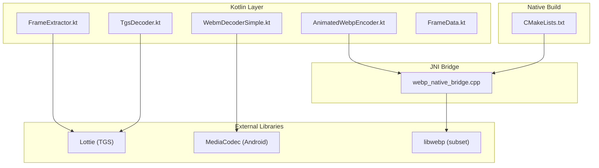
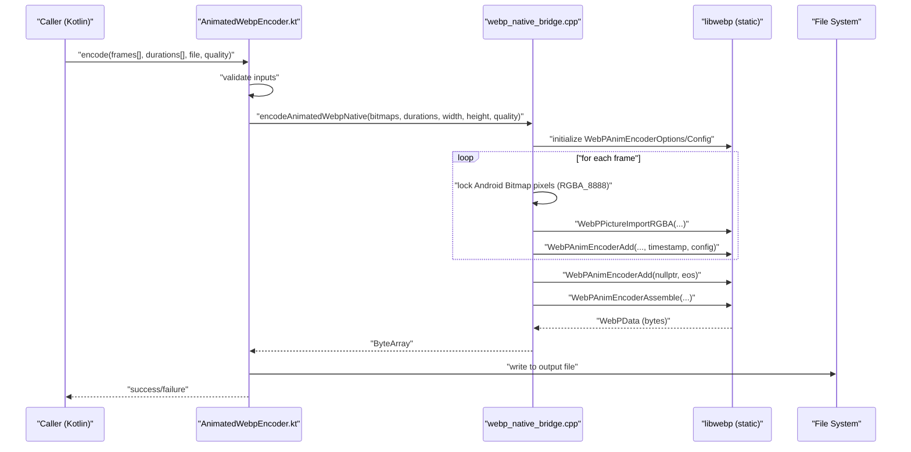
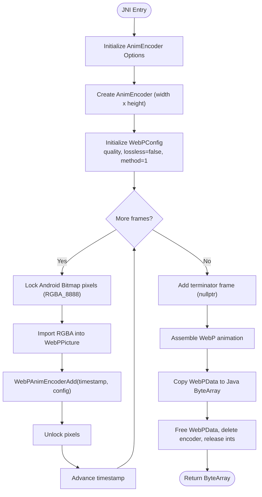
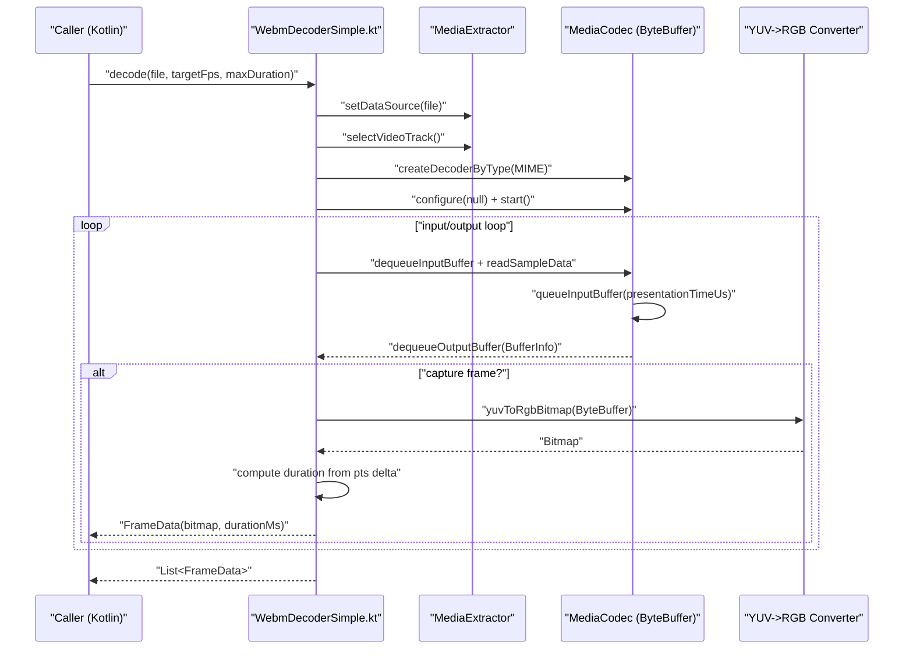
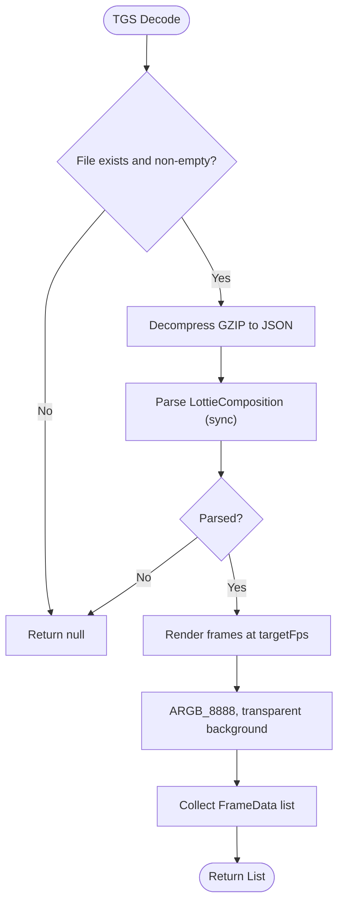
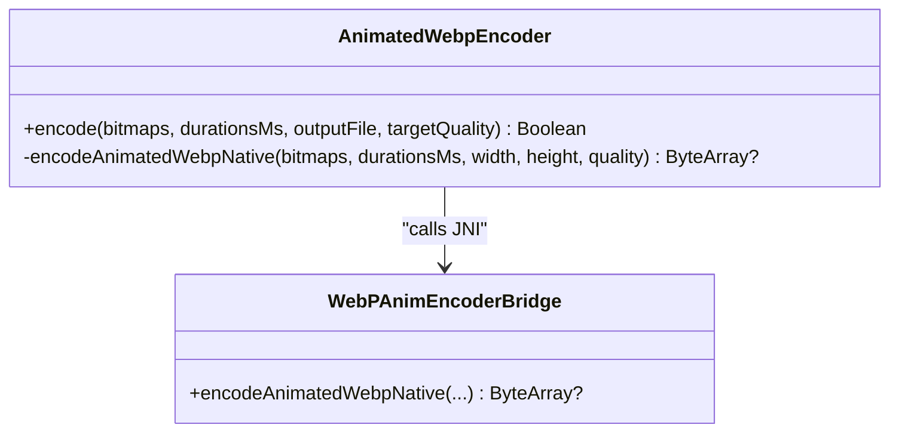
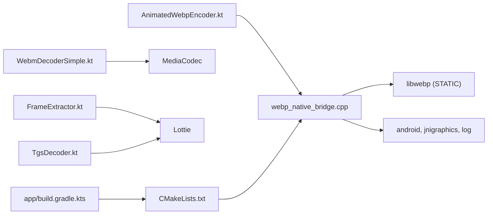

# Technical Deep Dive

<cite>
**Referenced Files in This Document**
- [webp_native_bridge.cpp](file://app/src/main/cpp/webp_native_bridge.cpp)
- [CMakeLists.txt](file://app/src/main/cpp/CMakeLists.txt)
- [AnimatedWebpEncoder.kt](file://app/src/main/java/com/maheshsharan/tel2what/engine/encoder/AnimatedWebpEncoder.kt)
- [WebmDecoderSimple.kt](file://app/src/main/java/com/maheshsharan/tel2what/engine/decoder/WebmDecoderSimple.kt)
- [FrameExtractor.kt](file://app/src/main/java/com/maheshsharan/tel2what/engine/decoder/FrameExtractor.kt)
- [TgsDecoder.kt](file://app/src/main/java/com/maheshsharan/tel2what/engine/decoder/TgsDecoder.kt)
- [FrameData.kt](file://app/src/main/java/com/maheshsharan/tel2what/engine/frame/FrameData.kt)
- [app/build.gradle.kts](file://app/build.gradle.kts)
- [build.gradle.kts](file://build.gradle.kts)
</cite>

## Table of Contents
1. [Introduction](#introduction)
2. [Project Structure](#project-structure)
3. [Core Components](#core-components)
4. [Architecture Overview](#architecture-overview)
5. [Detailed Component Analysis](#detailed-component-analysis)
6. [Dependency Analysis](#dependency-analysis)
7. [Performance Considerations](#performance-considerations)
8. [Troubleshooting Guide](#troubleshooting-guide)
9. [Conclusion](#conclusion)
10. [Appendices](#appendices)

## Introduction
This document provides a deep technical analysis of Tel2What’s advanced implementation aspects with a focus on:
- Native C++ WebP encoder using a custom-built libwebp subset and JNI bridge
- MediaCodec-based video decoding and frame extraction pipeline
- Color space conversion and bitmap generation
- Adaptive compression strategies and memory management to avoid OutOfMemory errors
- Concurrency patterns leveraging coroutines and JNI boundaries
- Native build system with CMake, dependency management, and cross-platform compilation considerations
- Performance metrics, benchmarking strategies, and debugging techniques for native code

## Project Structure
Tel2What integrates Kotlin/Android app logic with a native C++ WebP encoder and a custom video decoding pipeline. The native layer is built via CMake and exposes a JNI interface consumed by Kotlin encoders and decoders.

**Diagram sources**
- [AnimatedWebpEncoder.kt](file://app/src/main/java/com/maheshsharan/tel2what/engine/encoder/AnimatedWebpEncoder.kt#L1-L91)
- [WebmDecoderSimple.kt](file://app/src/main/java/com/maheshsharan/tel2what/engine/decoder/WebmDecoderSimple.kt#L1-L256)
- [FrameExtractor.kt](file://app/src/main/java/com/maheshsharan/tel2what/engine/decoder/FrameExtractor.kt#L1-L100)
- [TgsDecoder.kt](file://app/src/main/java/com/maheshsharan/tel2what/engine/decoder/TgsDecoder.kt#L1-L94)
- [FrameData.kt](file://app/src/main/java/com/maheshsharan/tel2what/engine/frame/FrameData.kt#L1-L9)
- [webp_native_bridge.cpp](file://app/src/main/cpp/webp_native_bridge.cpp#L1-L148)
- [CMakeLists.txt](file://app/src/main/cpp/CMakeLists.txt#L1-L44)

**Section sources**
- [AnimatedWebpEncoder.kt](file://app/src/main/java/com/maheshsharan/tel2what/engine/encoder/AnimatedWebpEncoder.kt#L1-L91)
- [WebmDecoderSimple.kt](file://app/src/main/java/com/maheshsharan/tel2what/engine/decoder/WebmDecoderSimple.kt#L1-L256)
- [FrameExtractor.kt](file://app/src/main/java/com/maheshsharan/tel2what/engine/decoder/FrameExtractor.kt#L1-L100)
- [TgsDecoder.kt](file://app/src/main/java/com/maheshsharan/tel2what/engine/decoder/TgsDecoder.kt#L1-L94)
- [FrameData.kt](file://app/src/main/java/com/maheshsharan/tel2what/engine/frame/FrameData.kt#L1-L9)
- [webp_native_bridge.cpp](file://app/src/main/cpp/webp_native_bridge.cpp#L1-L148)
- [CMakeLists.txt](file://app/src/main/cpp/CMakeLists.txt#L1-L44)

## Core Components
- Native WebP encoder via JNI: A custom-built libwebp subset compiled into a static library and linked with a shared JNI bridge to produce animated WebP output from Android Bitmap arrays.
- MediaCodec-based WebM decoder: Extracts frames at target FPS, converts YUV_420_888 to RGB, and returns FrameData sequences.
- Lottie-based TGS decoder: Decompresses GZIP and parses JSON into a LottieComposition, enabling frame extraction.
- Frame extraction pipeline: Renders Lottie compositions into ARGB_8888 bitmaps with consistent timing and padding.
- Memory safety: Explicit recycling of Bitmaps and early cleanup on exceptions to prevent OOM.

**Section sources**
- [webp_native_bridge.cpp](file://app/src/main/cpp/webp_native_bridge.cpp#L1-L148)
- [AnimatedWebpEncoder.kt](file://app/src/main/java/com/maheshsharan/tel2what/engine/encoder/AnimatedWebpEncoder.kt#L1-L91)
- [WebmDecoderSimple.kt](file://app/src/main/java/com/maheshsharan/tel2what/engine/decoder/WebmDecoderSimple.kt#L1-L256)
- [FrameExtractor.kt](file://app/src/main/java/com/maheshsharan/tel2what/engine/decoder/FrameExtractor.kt#L1-L100)
- [TgsDecoder.kt](file://app/src/main/java/com/maheshsharan/tel2what/engine/decoder/TgsDecoder.kt#L1-L94)
- [FrameData.kt](file://app/src/main/java/com/maheshsharan/tel2what/engine/frame/FrameData.kt#L1-L9)

## Architecture Overview
The system orchestrates Kotlin coroutines and JNI boundaries to process animations and stickers efficiently. The JNI bridge encapsulates libwebp’s WebPAnimEncoder to assemble animated WebP from pre-rendered frames.

**Diagram sources**
- [AnimatedWebpEncoder.kt](file://app/src/main/java/com/maheshsharan/tel2what/engine/encoder/AnimatedWebpEncoder.kt#L32-L78)
- [webp_native_bridge.cpp](file://app/src/main/cpp/webp_native_bridge.cpp#L13-L147)

## Detailed Component Analysis

### Native WebP Encoder (JNI Bridge)
- JNI entry point receives an array of Android Bitmaps, per-frame durations, and encoding quality.
- Initializes WebPAnimEncoderOptions and WebPConfig, sets loop count to infinite for WhatsApp compatibility, and selects a fast encoding method.
- Iterates frames, locks RGBA_8888 pixels, imports into WebPPicture, and adds to the animated encoder with monotonic timestamps.
- Assembles the final WebP animation and returns a Java ByteArray for persistence.

**Diagram sources**
- [webp_native_bridge.cpp](file://app/src/main/cpp/webp_native_bridge.cpp#L28-L147)

**Section sources**
- [webp_native_bridge.cpp](file://app/src/main/cpp/webp_native_bridge.cpp#L13-L147)
- [AnimatedWebpEncoder.kt](file://app/src/main/java/com/maheshsharan/tel2what/engine/encoder/AnimatedWebpEncoder.kt#L32-L89)

### MediaCodec-Based WebM Decoder and Frame Extraction
- Uses MediaExtractor to locate the first video track and MediaCodec to decode into ByteBuffer without a Surface.
- Selects VP9 MIME for WebM containers or falls back to VP8 when necessary.
- Reads samples, enforces a maximum duration, and captures frames at a target FPS by comparing presentation timestamps.
- Converts YUV_420_888 to RGB using YuvImage compression to JPEG and decoding to a Bitmap.

**Diagram sources**
- [WebmDecoderSimple.kt](file://app/src/main/java/com/maheshsharan/tel2what/engine/decoder/WebmDecoderSimple.kt#L43-L192)
- [WebmDecoderSimple.kt](file://app/src/main/java/com/maheshsharan/tel2what/engine/decoder/WebmDecoderSimple.kt#L205-L254)

**Section sources**
- [WebmDecoderSimple.kt](file://app/src/main/java/com/maheshsharan/tel2what/engine/decoder/WebmDecoderSimple.kt#L23-L192)
- [WebmDecoderSimple.kt](file://app/src/main/java/com/maheshsharan/tel2what/engine/decoder/WebmDecoderSimple.kt#L205-L254)

### Lottie-Based TGS Decoder and Frame Extraction
- Decompresses GZIP to JSON and parses into a LottieComposition synchronously.
- Renders frames at target FPS into ARGB_8888 Bitmaps with transparent backgrounds and consistent durations.
- Enforces a minimum frame count for animated sticker validation.

**Diagram sources**
- [TgsDecoder.kt](file://app/src/main/java/com/maheshsharan/tel2what/engine/decoder/TgsDecoder.kt#L21-L79)
- [FrameExtractor.kt](file://app/src/main/java/com/maheshsharan/tel2what/engine/decoder/FrameExtractor.kt#L24-L98)

**Section sources**
- [TgsDecoder.kt](file://app/src/main/java/com/maheshsharan/tel2what/engine/decoder/TgsDecoder.kt#L21-L79)
- [FrameExtractor.kt](file://app/src/main/java/com/maheshsharan/tel2what/engine/decoder/FrameExtractor.kt#L24-L98)

### JNI Bridge Class Model

**Diagram sources**
- [AnimatedWebpEncoder.kt](file://app/src/main/java/com/maheshsharan/tel2what/engine/encoder/AnimatedWebpEncoder.kt#L8-L90)
- [webp_native_bridge.cpp](file://app/src/main/cpp/webp_native_bridge.cpp#L13-L147)

## Dependency Analysis
- Kotlin encoders/decoders depend on Android SDK APIs (MediaCodec, MediaExtractor, Bitmap) and third-party libraries (Lottie).
- The JNI bridge depends on libwebp (subset) and Android NDK libraries (android, jnigraphics, log).
- Build configuration restricts ABIs and enables optimizations for release builds.

**Diagram sources**
- [AnimatedWebpEncoder.kt](file://app/src/main/java/com/maheshsharan/tel2what/engine/encoder/AnimatedWebpEncoder.kt#L1-L91)
- [WebmDecoderSimple.kt](file://app/src/main/java/com/maheshsharan/tel2what/engine/decoder/WebmDecoderSimple.kt#L1-L256)
- [FrameExtractor.kt](file://app/src/main/java/com/maheshsharan/tel2what/engine/decoder/FrameExtractor.kt#L1-L100)
- [TgsDecoder.kt](file://app/src/main/java/com/maheshsharan/tel2what/engine/decoder/TgsDecoder.kt#L1-L94)
- [webp_native_bridge.cpp](file://app/src/main/cpp/webp_native_bridge.cpp#L1-L148)
- [CMakeLists.txt](file://app/src/main/cpp/CMakeLists.txt#L1-L44)
- [app/build.gradle.kts](file://app/build.gradle.kts#L32-L65)

**Section sources**
- [app/build.gradle.kts](file://app/build.gradle.kts#L32-L65)
- [CMakeLists.txt](file://app/src/main/cpp/CMakeLists.txt#L1-L44)

## Performance Considerations
- Encoding quality and speed:
  - Lossy compression with a fast method balances speed and size.
  - Quality parameter controls the trade-off; lower values reduce output size but increase visible artifacts.
- Frame capture cadence:
  - Target FPS drives frame spacing; ensure durations align with presentation timestamps to avoid stutter.
- Memory management:
  - Explicitly unlock bitmap pixels after importing into WebPPicture.
  - Recycle Bitmaps on exceptions and clear lists to prevent OOM.
- Concurrency:
  - Decoding and extraction run on Dispatchers.IO; yielding periodically allows cooperative cancellation and responsiveness.
- Build optimizations:
  - C++17, -O3, and ABI filters reduce APK size and improve runtime performance.

[No sources needed since this section provides general guidance]

## Troubleshooting Guide
- JNI load failures:
  - Verify library name matches the CMake target and that the native library is packaged for the correct ABI.
- Unsupported bitmap format:
  - Ensure frames are RGBA_8888; the bridge rejects other formats.
- Decoder creation failures:
  - The decoder attempts VP9 first, then VP8 fallback; if both fail, decoding returns an empty list.
- Buffer size mismatches:
  - YUV conversion expects sufficient buffer size; logs indicate when buffers are too small.
- Logging:
  - Native logs are tagged and emitted via Android log; inspect Logcat for detailed error messages.

**Section sources**
- [AnimatedWebpEncoder.kt](file://app/src/main/java/com/maheshsharan/tel2what/engine/encoder/AnimatedWebpEncoder.kt#L13-L20)
- [webp_native_bridge.cpp](file://app/src/main/cpp/webp_native_bridge.cpp#L69-L82)
- [WebmDecoderSimple.kt](file://app/src/main/java/com/maheshsharan/tel2what/engine/decoder/WebmDecoderSimple.kt#L90-L102)
- [WebmDecoderSimple.kt](file://app/src/main/java/com/maheshsharan/tel2what/engine/decoder/WebmDecoderSimple.kt#L210-L213)

## Conclusion
Tel2What’s advanced implementation leverages a compact, optimized libwebp subset compiled via CMake and exposed through a focused JNI bridge. The system integrates MediaCodec-based video decoding, Lottie-based TGS processing, and a robust frame extraction pipeline. Performance is tuned with fast encoding, careful memory management, and coroutine-driven concurrency, while the build system targets modern Android ABIs and enables release optimizations.

[No sources needed since this section summarizes without analyzing specific files]

## Appendices

### Native Build System and Cross-Platform Compilation
- CMake configuration compiles a minimal set of libwebp sources into a static library and links it with the JNI bridge shared library.
- The Android Gradle plugin externalNativeBuild references the CMake script and sets ABI filters and C++ flags.
- Cross-platform considerations:
  - The included libwebp sources are compiled directly; ensure platform-specific DSP optimizations are enabled via CMake toolchains if extending to other platforms.
  - Keep ABI filters aligned with supported devices to minimize APK size.

**Section sources**
- [CMakeLists.txt](file://app/src/main/cpp/CMakeLists.txt#L1-L44)
- [app/build.gradle.kts](file://app/build.gradle.kts#L32-L65)
- [build.gradle.kts](file://build.gradle.kts#L1-L5)

### Benchmarking and Metrics
- Recommended metrics:
  - Encoding throughput (frames/sec), output size (bytes), and CPU time per frame.
  - Decoding throughput (fps), latency to first frame, and memory footprint.
  - Compression ratio vs. quality parameter across typical sticker assets.
- Methodology:
  - Use a controlled set of frames (e.g., 512x512 ARGB_8888) and vary quality and FPS.
  - Measure on representative devices; account for thermal throttling and background load.
- Optimization strategies:
  - Tune WebPConfig.method and quality for target device class.
  - Adjust target FPS to balance smoothness and file size.
  - Monitor and cap max duration to meet platform limits.

[No sources needed since this section provides general guidance]