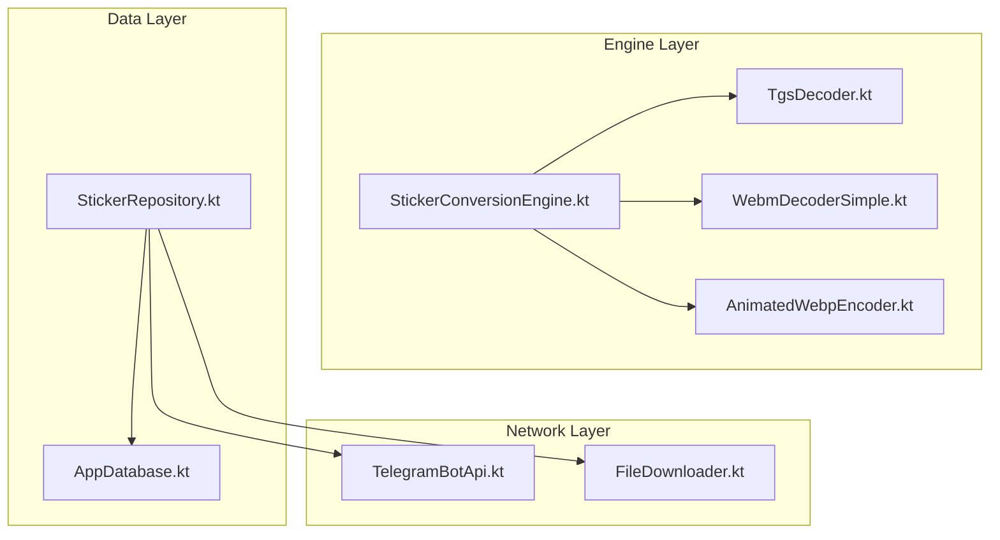
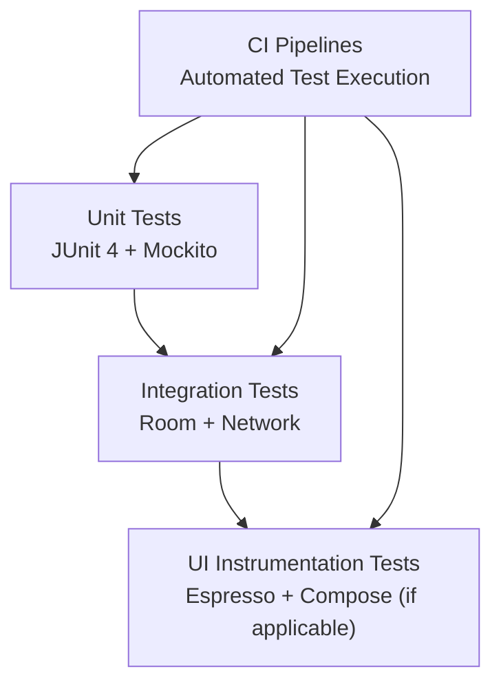
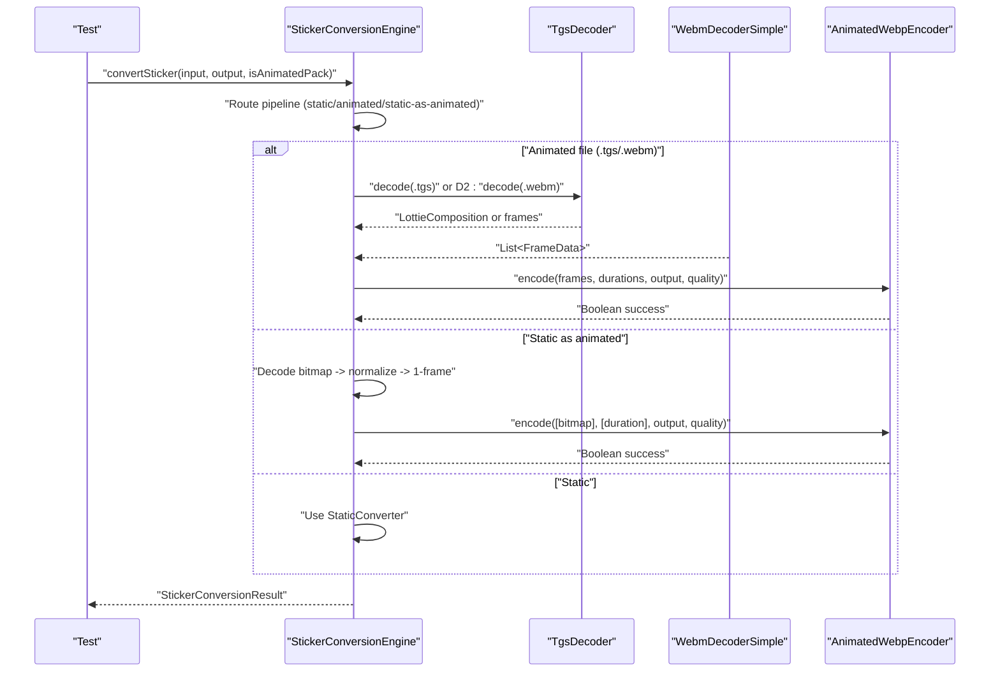
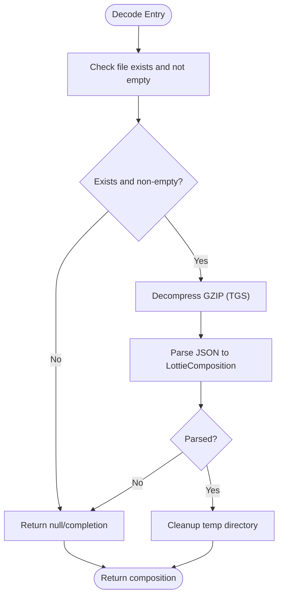
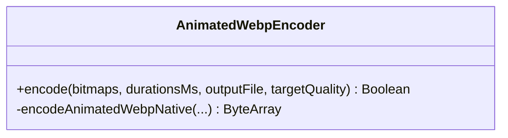
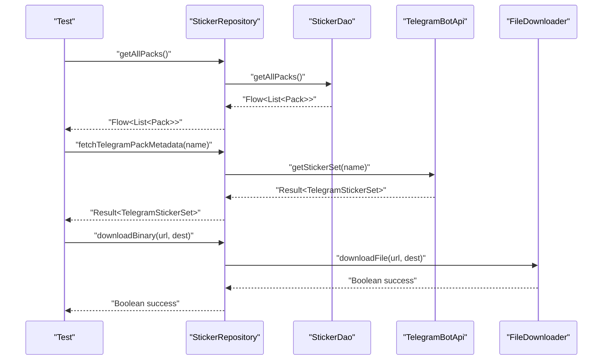
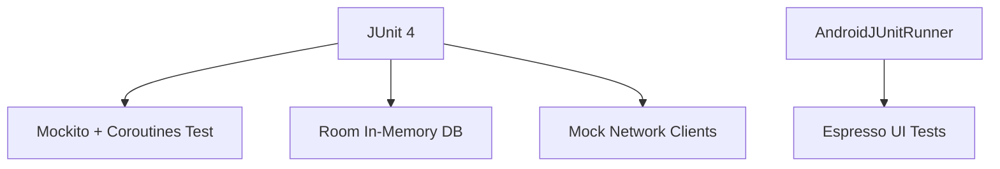

# Testing Strategy

<cite>
**Referenced Files in This Document**
- [build.gradle.kts](file://app/build.gradle.kts)
- [README.md](file://README.md)
- [StickerConversionEngine.kt](file://app/src/main/java/com/maheshsharan/tel2what/engine/StickerConversionEngine.kt)
- [AnimatedWebpEncoder.kt](file://app/src/main/java/com/maheshsharan/tel2what/engine/encoder/AnimatedWebpEncoder.kt)
- [WebmDecoderSimple.kt](file://app/src/main/java/com/maheshsharan/tel2what/engine/decoder/WebmDecoderSimple.kt)
- [TgsDecoder.kt](file://app/src/main/java/com/maheshsharan/tel2what/engine/decoder/TgsDecoder.kt)
- [AppDatabase.kt](file://app/src/main/java/com/maheshsharan/tel2what/data/local/AppDatabase.kt)
- [StickerRepository.kt](file://app/src/main/java/com/maheshsharan/tel2what/data/repository/StickerRepository.kt)
</cite>

## Table of Contents
1. [Introduction](#introduction)
2. [Project Structure](#project-structure)
3. [Core Components](#core-components)
4. [Architecture Overview](#architecture-overview)
5. [Detailed Component Analysis](#detailed-component-analysis)
6. [Dependency Analysis](#dependency-analysis)
7. [Performance Considerations](#performance-considerations)
8. [Troubleshooting Guide](#troubleshooting-guide)
9. [Conclusion](#conclusion)
10. [Appendices](#appendices)

## Introduction
This document defines a comprehensive testing strategy for Tel2What, focusing on unit testing for repository classes, engine components, and utility functions; integration testing for database operations, network integration, and UI component testing; and continuous integration practices. It covers testing frameworks, mocking strategies for external dependencies, test data management, performance testing, memory leak detection, concurrent processing validation, and CI pipelines.

## Project Structure
Tel2What is an Android application written in Kotlin with a modular architecture:
- Engine layer: decoders, encoders, and conversion orchestration
- Data layer: Room database and repositories
- Network layer: Telegram Bot API and file downloader
- UI layer: Fragments and ViewModels
- Native layer: C++ WebP encoder via JNI

Key testing-relevant files:
- Unit test dependencies and instrumentation runner are declared in the Gradle build script
- Engine components orchestrate conversion pipelines and expose concurrency controls suitable for testing
- Repository encapsulates DAOs and network calls behind synchronous and Flow APIs
- Database provides Room entities, DAOs, and migrations

**Diagram sources**
- [StickerConversionEngine.kt](file://app/src/main/java/com/maheshsharan/tel2what/engine/StickerConversionEngine.kt#L1-L276)
- [TgsDecoder.kt](file://app/src/main/java/com/maheshsharan/tel2what/engine/decoder/TgsDecoder.kt#L1-L94)
- [WebmDecoderSimple.kt](file://app/src/main/java/com/maheshsharan/tel2what/engine/decoder/WebmDecoderSimple.kt#L1-L256)
- [AnimatedWebpEncoder.kt](file://app/src/main/java/com/maheshsharan/tel2what/engine/encoder/AnimatedWebpEncoder.kt#L1-L91)
- [AppDatabase.kt](file://app/src/main/java/com/maheshsharan/tel2what/data/local/AppDatabase.kt#L1-L42)
- [StickerRepository.kt](file://app/src/main/java/com/maheshsharan/tel2what/data/repository/StickerRepository.kt#L1-L80)

**Section sources**
- [build.gradle.kts](file://app/build.gradle.kts#L115-L116)
- [README.md](file://README.md#L87-L96)

## Core Components
This section outlines testing approaches for the primary components:

- StickerConversionEngine
  - Unit test routing logic, concurrency controls, and error handling paths
  - Mock decoders and encoder to validate pipeline decisions and compression loop behavior
  - Verify logs and metrics emission for deterministic assertions

- Decoders (TgsDecoder, WebmDecoderSimple)
  - Validate file existence checks, empty file guards, and parsing failures
  - Test successful composition extraction and frame generation under various conditions
  - Assert cleanup behavior and resource release

- Encoders (AnimatedWebpEncoder)
  - Validate JNI loading and error reporting
  - Mock native bridge to assert IO write outcomes and quality/fps combinations

- Repository (StickerRepository)
  - Wrap DAOs and network clients with mocks to test CRUD operations and metadata retrieval
  - Validate Flow emissions and suspend function behavior

- Database (Room)
  - Use in-memory databases for unit tests and real database for integration tests
  - Validate migrations and transactional integrity

**Section sources**
- [StickerConversionEngine.kt](file://app/src/main/java/com/maheshsharan/tel2what/engine/StickerConversionEngine.kt#L34-L89)
- [TgsDecoder.kt](file://app/src/main/java/com/maheshsharan/tel2what/engine/decoder/TgsDecoder.kt#L21-L80)
- [WebmDecoderSimple.kt](file://app/src/main/java/com/maheshsharan/tel2what/engine/decoder/WebmDecoderSimple.kt#L23-L192)
- [AnimatedWebpEncoder.kt](file://app/src/main/java/com/maheshsharan/tel2what/engine/encoder/AnimatedWebpEncoder.kt#L32-L78)
- [StickerRepository.kt](file://app/src/main/java/com/maheshsharan/tel2what/data/repository/StickerRepository.kt#L10-L79)
- [AppDatabase.kt](file://app/src/main/java/com/maheshsharan/tel2what/data/local/AppDatabase.kt#L13-L41)

## Architecture Overview
The testing architecture leverages:
- JUnit 4 for unit tests
- AndroidX Test Runner for instrumentation tests
- Mockito/Kotlinx Coroutines test utilities for concurrency and mocking
- Room In-Memory database for fast integration tests
- Espresso for UI component testing

[No sources needed since this diagram shows conceptual workflow, not actual code structure]

## Detailed Component Analysis

### StickerConversionEngine Testing
Approach:
- Isolate concurrency controls (semaphores) using coroutine test dispatchers
- Mock decoders and encoder to simulate success/failure scenarios
- Validate routing decisions and error propagation paths
- Assert metrics logging and validation outcomes

**Diagram sources**
- [StickerConversionEngine.kt](file://app/src/main/java/com/maheshsharan/tel2what/engine/StickerConversionEngine.kt#L34-L89)
- [TgsDecoder.kt](file://app/src/main/java/com/maheshsharan/tel2what/engine/decoder/TgsDecoder.kt#L21-L67)
- [WebmDecoderSimple.kt](file://app/src/main/java/com/maheshsharan/tel2what/engine/decoder/WebmDecoderSimple.kt#L23-L192)
- [AnimatedWebpEncoder.kt](file://app/src/main/java/com/maheshsharan/tel2what/engine/encoder/AnimatedWebpEncoder.kt#L32-L78)

**Section sources**
- [StickerConversionEngine.kt](file://app/src/main/java/com/maheshsharan/tel2what/engine/StickerConversionEngine.kt#L18-L89)

### Decoders Testing
Approach:
- TgsDecoder: Validate GZIP decompression, JSON parsing, and composition loading; assert cleanup behavior
- WebmDecoderSimple: Validate track selection, codec creation, frame extraction, and YUV to RGB conversion; assert resource release

**Diagram sources**
- [TgsDecoder.kt](file://app/src/main/java/com/maheshsharan/tel2what/engine/decoder/TgsDecoder.kt#L21-L80)

**Section sources**
- [TgsDecoder.kt](file://app/src/main/java/com/maheshsharan/tel2what/engine/decoder/TgsDecoder.kt#L21-L80)
- [WebmDecoderSimple.kt](file://app/src/main/java/com/maheshsharan/tel2what/engine/decoder/WebmDecoderSimple.kt#L23-L192)

### Encoders Testing
Approach:
- Validate JNI library loading and error reporting
- Mock native bridge to assert IO write outcomes and quality/fps combinations
- Verify return values for success/failure scenarios

**Diagram sources**
- [AnimatedWebpEncoder.kt](file://app/src/main/java/com/maheshsharan/tel2what/engine/encoder/AnimatedWebpEncoder.kt#L32-L90)

**Section sources**
- [AnimatedWebpEncoder.kt](file://app/src/main/java/com/maheshsharan/tel2what/engine/encoder/AnimatedWebpEncoder.kt#L32-L78)

### Repository and Database Testing
Approach:
- Use Room’s in-memory database for unit tests to avoid disk I/O
- Mock network clients to simulate success and failure scenarios
- Validate Flow emissions and suspend function behavior
- Test migrations and transactional integrity in integration tests

**Diagram sources**
- [StickerRepository.kt](file://app/src/main/java/com/maheshsharan/tel2what/data/repository/StickerRepository.kt#L16-L30)
- [AppDatabase.kt](file://app/src/main/java/com/maheshsharan/tel2what/data/local/AppDatabase.kt#L13-L41)

**Section sources**
- [StickerRepository.kt](file://app/src/main/java/com/maheshsharan/tel2what/data/repository/StickerRepository.kt#L10-L79)
- [AppDatabase.kt](file://app/src/main/java/com/maheshsharan/tel2what/data/local/AppDatabase.kt#L13-L41)

## Dependency Analysis
Testing dependencies and frameworks:
- Unit testing framework: JUnit 4
- Android instrumentation runner: AndroidJUnitRunner
- Mocking and coroutines testing: Mockito and Kotlinx Coroutines test utilities
- Database testing: Room with in-memory database
- Network testing: Mock network clients and OkHttp interceptors
- UI testing: Espresso for instrumentation tests

**Diagram sources**
- [build.gradle.kts](file://app/build.gradle.kts#L115-L116)

**Section sources**
- [build.gradle.kts](file://app/build.gradle.kts#L27-L27)
- [build.gradle.kts](file://app/build.gradle.kts#L115-L116)

## Performance Considerations
- Concurrency validation: Use coroutine test dispatchers to validate semaphore-controlled pipelines and ensure thread safety
- Memory leak detection: Monitor bitmap recycling and resource cleanup in decoders; assert that frames are recycled post-processing
- Performance profiling: Measure conversion times and file sizes; capture metrics emitted by the engine for regression detection
- Native performance: Validate JNI bridge behavior and IO throughput; mock native calls to isolate performance bottlenecks

[No sources needed since this section provides general guidance]

## Troubleshooting Guide
Common issues and resolutions:
- JNI library loading failures: Verify native library availability and handle UnsatisfiedLinkError gracefully
- Empty or missing input files: Assert guard clauses and return appropriate failure results
- Decoder failures: Validate MIME types, track selection, and codec fallbacks
- Encoder IO errors: Confirm file write permissions and output directory availability
- Database migration errors: Ensure migrations are applied and in-memory databases are configured correctly

**Section sources**
- [AnimatedWebpEncoder.kt](file://app/src/main/java/com/maheshsharan/tel2what/engine/encoder/AnimatedWebpEncoder.kt#L13-L20)
- [WebmDecoderSimple.kt](file://app/src/main/java/com/maheshsharan/tel2what/engine/decoder/WebmDecoderSimple.kt#L89-L102)
- [AppDatabase.kt](file://app/src/main/java/com/maheshsharan/tel2what/data/local/AppDatabase.kt#L21-L25)

## Conclusion
This testing strategy emphasizes robust unit and integration tests for the engine, repository, and database layers, complemented by UI instrumentation tests and CI automation. By leveraging JUnit, Mockito, Room in-memory databases, and Android instrumentation, Tel2What can maintain high reliability, performance, and correctness across its conversion pipeline and user interface.

## Appendices
- Test data management: Use fixtures for Telegram sticker sets, WebM/TGS samples, and Room entities; manage temporary files for native encoding
- Mocking strategies: Mock TelegramBotApi and FileDownloader to simulate network conditions; mock decoders/encoders to validate pipeline logic
- Continuous integration: Configure Gradle tasks to run unit tests, instrumented tests, and lint checks; publish test reports and coverage

[No sources needed since this section provides general guidance]